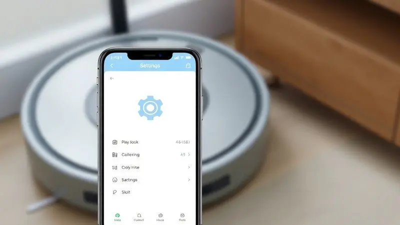
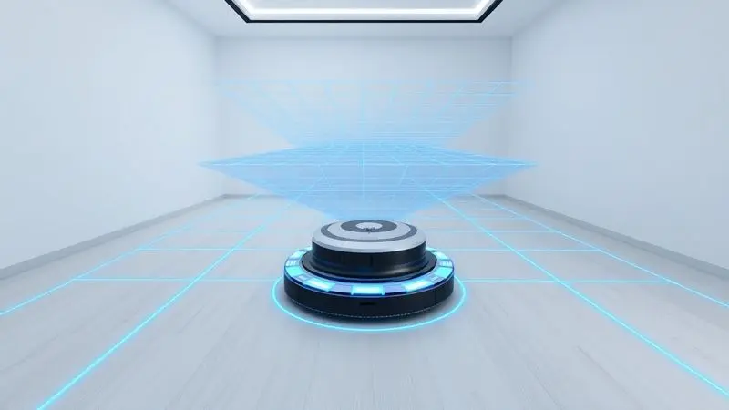
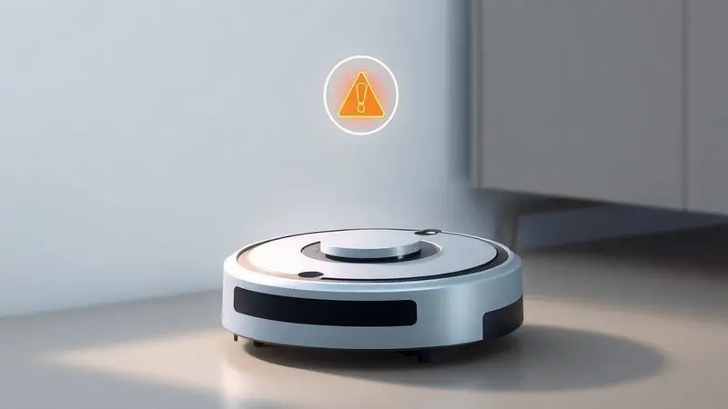

Ter um dos robôs aspiradores mais avançados do mercado, como o Bespoke Jet Bot Combo, é um grande alívio na rotina doméstica. Até que, um dia, a conexão começa a falhar ou ele se perde no próprio mapa que criou.

A frustração bate, mas a solução pode ser mais simples do que imagina. Saber como realizar um reset de fábrica pode ser o atalho para recuperar aquele desempenho de fábrica que você amou desde o primeiro dia.

Este guia vai além do passo a passo técnico, mostrando como fazer isso com segurança e, mais importante, como reconstruir a relação com seu assistente de limpeza para que ele volte a ser aquele parceiro confiável.

<SummaryList products={frontmatter.top_products} />

## O que é o Reset de Fábrica e por que ele é necessário?

Imagine apertar um botão que apaga todas as memórias recentes do [seu robô](/robo-aspirador-eos-e-bom/), fazendo com que ele 'acorde' como se fosse a primeira vez que você o tirou da caixa. Esse é o reset de fábrica.

No Bespoke Jet Bot Combo, esse recurso não serve apenas para corrigir bugs ou problemas de conexão teimosos, mas funciona como um verdadeiro botão de reinício para o relacionamento entre você e a máquina.

Quando nada mais parece funcionar, [restaurar às configurações originais](/como-resetar-robo-aspirador-kabum-700/) pode ser a chave para recuperar aquela eficiência silenciosa que transformou sua rotina doméstica.

## Quando você deve restaurar seu Bespoke Jet Bot Combo?

Você conhece aquela sensação de que o robô não está mais sendo ele mesmo? Talvez ele tenha começado a [ignorar certos cômodos](/melhores-robos-aspiradores-2023/), travado no meio da sala sem motivo aparente ou esteja simplesmente mais lento para responder aos comandos.

Esses são os sinais clássicos de que está na hora de considerar um reset. Além das questões técnicas, há momentos de vida do aparelho que justificam o reinício, como uma mudança de casa nova ou a decisão de passá-lo para outra pessoa.

Em todos esses casos, a restauração não é apenas uma solução prática, mas um ritual de limpeza digital que garante um começo fresco, sem bagagem do passado.

## O que acontece com os dados e mapas após a restauração?

Aqui está o ponto que mais gera apreensão. Sim, após o reset, o Bespoke Jet Bot Combo esquece tudo, literalmente. Todos os [mapas que ele criou](/melhor-robo-aspirador-com-mapeamento/) meticulosamente de sua casa, as configurações de intensidade para cada piso e os horários programados desaparecem.

É como se você tivesse um novo aluno que precisa reaprender todos os cantos da sua residência.

Pode parecer um retrocesso, mas pense nisso como uma oportunidade: talvez na primeira vez você não tenha configurado os horários ideais ou tenha deixado áreas importantes de fora do mapeamento. Agora é a chance de fazer melhor.

A recomendação é clara, se possível, tenha uma ideia dos ajustes anteriores antes de prosseguir.

## Como Restaurar o Bespoke Jet Bot Combo: Passo a Passo Detalhado

<ProductBox 
  title={frontmatter.top_products[0].title} 
  image={frontmatter.top_products[0].image} 
  link={frontmatter.top_products[0].link} 
/>

O processo varia entre um reset rápido (para pequenos problemas) e um restauro completo. Comece abrindo a tampa do aparelho para localizar o pequeno botão de reset, geralmente na parte inferior interna. Um clique com um clipe de papel sinaliza o início do reset simples.

Para uma limpeza mais profunda, pressione e segure esse mesmo botão por sete segundos até ver os botões "Start/Stop" e "Charging" piscando em branco. O robô reiniciará sozinho, como um ritual de rejuvenescimento.

Apenas lembre-se que, após isso, ele aparecerá como um estranho no seu aplicativo SmartThings, exigindo um novo cadastro. Parece trabalho, mas é o preço por um companheiro de limpeza que volta a funcionar como no primeiro dia.

### Método 1: Reset manual através dos botões do robô

Às vezes, a solução mais elegante é a mais física. Localize os botões de controle no corpo do seu Bespoke Jet Bot Combo, geralmente um para ligar e outro para alternar modos. O primeiro passo é desligar o robô com o botão de energia.

Em seguida, com calma, mantenha o botão de modo pressionado por cerca de cinco segundos. Observe as luzes do painel, seu sinal de que o processo foi acionado e o robô está retornando às suas raízes de fábrica.

É um método direto, sem intermediários, ideal para quando você quer ter o controle literal na ponta dos dedos.

### Método 2: Reset através do aplicativo Samsung SmartThings

Para quem prefere gerenciar tudo pelo celular, o aplicativo [Samsung](/robo-aspirador-samsung-vr5000rm-e-bom/) SmartThings torna o processo quase intuitivo. Com o robô conectado à sua Wi-Fi, abra o app, encontre seu dispositivo na lista e toque no ícone.

Navegue até as configurações do robô e procure pela opção, muitas vezes escondida, de "Restaurar configurações de fábrica" ou similar. Uma confirmação digital e alguns minutos depois, seu robô estará reiniciando.

A beleza desse método está na centralização, transformando seu smartphone no centro de comando não apenas para a limpeza diária, mas também para esses procedimentos de manutenção mais profundos.

## O que fazer após o reset? (Reconfiguração e Mapeamento)

Com a tábula rasa estabelecida, chega a parte mais gratificante: reconstruir. Reconecte o aparelho à sua rede Wi-Fi no aplicativo. Depois, deixe-o explorar lentamente cada canto da sua casa para criar um novo mapa, mais preciso e atualizado que o anterior.

Aproveite esse momento para recalibrar suas preferências. Aquele horário de limpeza que sempre atrapalhava suas reuniões? Agora você pode ajustar. A intensidade que era forte demais para o piso de madeira? Revise.

Este não é apenas um processo técnico, é uma chance de personalizar o comportamento do seu robô para se encaixar perfeitamente na sua vida atual, não na vida que você tinha quando o comprou.

## Solução de problemas comuns: O reset não funcionou, e agora?

E se, após seguir todos os passos, o seu Bespoke Jet Bot Combo parecer resistir ao reinício? Não entre em pânico. Primeiro, verifique o básico: a [bateria está com carga suficiente](/como-carregar-o-aspirador-robo-multilaser/) para completar o processo? Falta de energia pode interromper o reset no meio do caminho.

Confirme também se você está pressionando os botões na sequência e pelo tempo exatos. Se nada funcionar, uma pausa estratégica pode ajudar. Desconecte o robô da tomada por alguns minutos, deixe ele 'descansar', e tente novamente.

Em casos raros onde a persistência do problema sugere algo mais sério, recorrer ao suporte técnico especializado pode ser o caminho mais sábio para um diagnóstico preciso.

## Dica Extra: Mantenha seu Robô como novo com a manutenção preventiva

<ProductBox 
  title={frontmatter.top_products[1].title} 
  image={frontmatter.top_products[1].image} 
  link={frontmatter.top_products[1].link} 
/>

Um reset resolve muitos problemas, mas o cuidado diário previne que outros surjam. Para manter seu Bespoke Jet Bot Combo no pico da forma, transforme a limpeza em um ritual regular.

O compartimento de poeira e o filtro do motor agradecem uma lavada periódica, que evita o acúmulo que sufoca a potência. As escovas, tanto a principal quanto as laterais, precisam ser libertadas dos [fios de cabelo](/melhor-aspirador-robo-para-quem-tem-gatos/) e da sujeira que se enrolam e as travam.

Fique de olho no desgaste, elas eventualmente precisam ser trocadas. E não subestime os sensores, um pano macio neles garante que o robô continue 'enxergando' seu ambiente com clareza.

Essa manutenção demanda alguns minutos da sua semana, mas é o investimento que garante anos de serviço silencioso e eficiente, mantendo sua casa limpa e sua mente tranquila.

## Perguntas Frequentes (FAQ) sobre o Reset do Jet Bot Combo

Resetar um dispositivo pode gerar dúvidas. Uma das mais comuns é justamente sobre o que se perde no processo.

Sim, todas as personalizações são apagadas, mas isso é exatamente o propósito, trazer o robô de volta ao seu estado virgem de fábrica, pronto para ser configurado do zero. Outra questão frequente é sobre a segurança de fazer isso repetidamente.

Enquanto o procedimento em si é seguro para o hardware, fazê-lo sem necessidade significa perder constantemente suas configurações de limpeza personalizadas, o que pode se tornar inconveniente. A chave é usar o reset como uma ferramenta estratégica, não como um hábito.

## Conclusão

Resetar o seu Bespoke Jet Bot Combo não precisa ser visto como um último recurso desesperado, mas sim como um recurso poderoso de manutenção. É o equivalente digital a levar seu carro para uma revisão completa.

Sim, você perderá os mapas e as configurações antigas, mas ganhará a oportunidade de começar de novo, muitas vezes corrigindo problemas que se acumularam aos poucos e restabelecendo a confiança no equipamento.

Seguindo os métodos manuais ou pelo aplicativo com cuidado, e dedicando um tempo à reconfiguração e manutenção preventiva pós-reset, você não apenas resolve a questão imediata, mas estende a vida útil e o desempenho do seu companheiro de limpeza.

Então, se o seu robô está dando sinais de cansaço, considere esse guio como seu plano para devolver a ele o vigor de quando era novo.