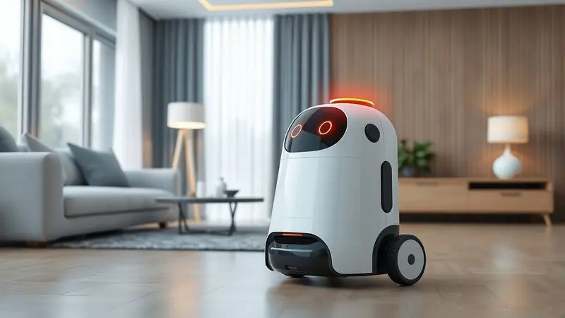
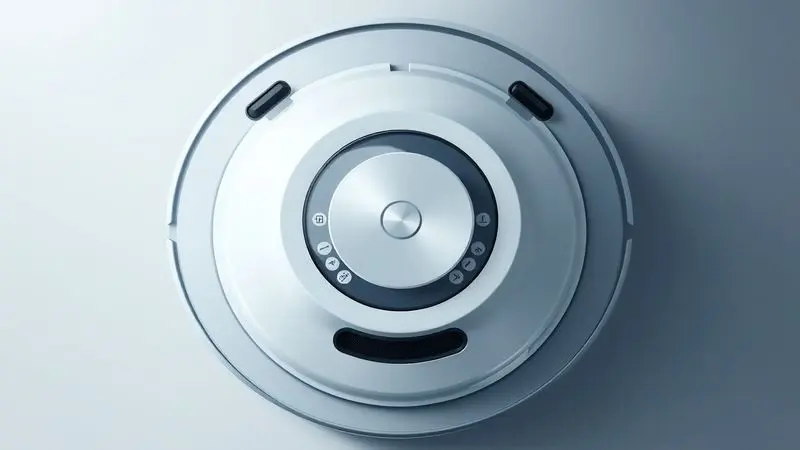
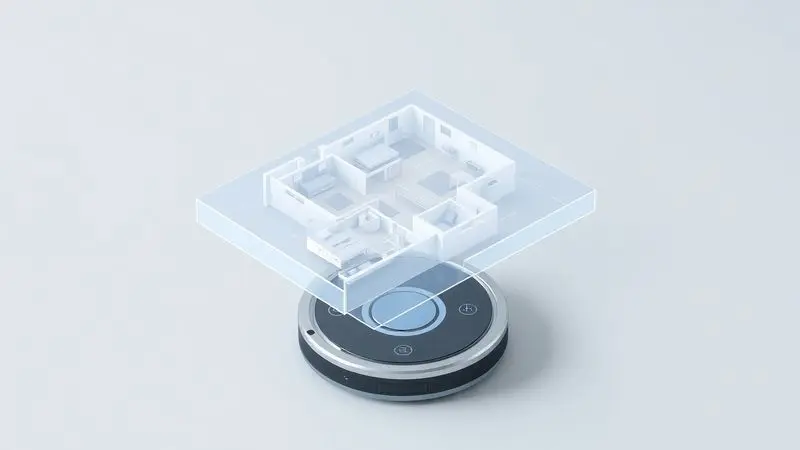
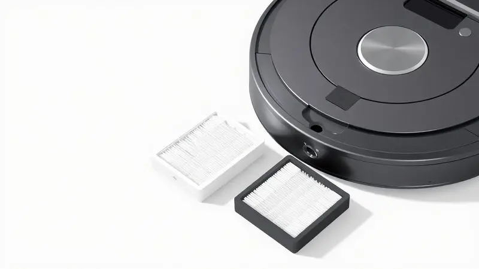

Ter um robô aspirador em casa é sinônimo de praticidade, mas problemas de conexão ou pequenos travamentos podem acontecer com qualquer tecnologia. Se o seu dispositivo TP-Link parou de responder ou não sincroniza com o aplicativo, você está no lugar certo.

Neste guia completo, você aprenderá exatamente como reiniciar o aspirador robô Tapo de forma segura e eficiente. Vamos cobrir desde o reset simples até a restauração de fábrica, garantindo que seu ajudante eletrônico volte a deixar sua casa impecável rapidamente.

<SummaryList products={frontmatter.top_products} />

## Por que você pode precisar resetar seu aspirador robô Tapo?

Imagine chegar em casa depois de um dia cansativo, ansioso para encontrar tudo limpo, mas seu robô está parado no meio da sala, sem responder aos seus comandos. Esse tipo de frustração é mais comum do que parece.

Resetar seu aspirador Tapo resolve desde pequenos bugsinhos até problemas sérios de [conexão Wi-Fi](/como-conectar-robo-aspirador-xiaomi-no-wifi/).

Se ele parou de responder ao aplicativo, está com dificuldade para se reconectar após você mudar de rede, ou simplesmente travou após uma atualização de software, o reset é sua solução.

Mais do que um procedimento técnico, é a chave para recuperar aquela sensação gostosa de ter sua casa sempre arrumada sem você precisar levantar um dedo.

## Soft Reset vs. Factory Reset: Qual a diferença e quando usar?

Você não precisa ser um expert em tecnologia para entender esses dois conceitos. Pense no Soft Reset como aquele "desliga e liga novamente" que resolve 90% dos problemas do seu computador. Ele reinicia o sistema sem apagar nada do que você configurou.

É perfeito para quando o robô dá uma travadinha, demora para responder ou tem uma conexão Wi-Fi instável.

Já o [Factory Reset](/como-resetar-robo-aspirador-kabum-700/) é mais drástico. Ele devolve o dispositivo exatamente como saiu da fábrica, apagando tudo: suas configurações, mapas da casa, agendamentos.

Use isso apenas como último recurso, quando problemas persistentes não resolvem com o Soft Reset, ou se você vai passar o robô para outra pessoa. A regra é simples: comece pelo Soft, só recorra ao Factory se não tiver jeito mesmo.

## Como fazer o Soft Reset (Reinicialização Simples) no robô Tapo

Esse é o tipo de solução que você faz em 30 segundos e volta a ter sua rotina de limpeza automaticamente funcionando. Primeiro, localize o botão de liga/desligar.

Geralmente fica na parte superior ou lateral, fácil de encontrar mesmo se você não for muito íntimo com gadgets.

Pressione e segure por 10 a 15 segundos. Você vai perceber que as luzes de LED do robô vão piscar de forma diferente, sinalizando que o sistema está reiniciando. Solte o botão, ligue o dispositivo novamente e pronto.

Essa simples ação resolve desde conexões Wi-Fi que pipocam até aqueles momentos em que o robô simplesmente parece ter decidido tirar férias.

## Passo a Passo para o Factory Reset (Reset de Fábrica) no Tapo

Atenção: este é o botão de emergência. Antes de prosseguir, tenha certeza de que o Soft Reset não resolveu. O Factory Reset apaga tudo, então você precisará reconfigurar seu robô do zero depois.

Mantenha o botão de liga/desligar pressionado por cerca de 10 segundos, até que o LED comece a piscar de forma específica (geralmente um padrão diferente do normal). Isso indica que o processo de restauração começou. Aguarde o robô completar o reset automaticamente.

### Método 1: Usando os botões físicos do robô

Às vezes o aplicativo trava, mas o botão físico nunca falha. Se precisar fazer o reset urgentemente e o aplicativo não estiver respondendo, essa é sua solução. Localize o botão na parte superior ou lateral, pressione e segure por 5 a 10 segundos.

Você perceberá quando funcionou porque o robô emitirá um sinal sonoro ou as luzes mudarão de padrão. É como ter um controle manual de emergência nas suas mãos.

### Método 2: Redefinição através do Aplicativo Tapo

Para quem prefere a conveniência digital, o app oferece todo o controle. Abra o aplicativo Tapo no seu smartphone, selecione seu dispositivo na lista e vá até as configurações. Lá você encontrará as opções de reset. A vantagem?

Você pode escolher exatamente o que precisa: um reinício simples que mantém suas configurações, ou o reset completo de fábrica. É tudo feito com alguns toques na tela, de qualquer lugar da sua casa.

## O que acontece com os mapas e agendamentos após o reset?

Essa é a preocupação de quem já investiu tempo configurando o robô perfeitamente para sua casa.

Com o Soft Reset, fique tranquilo: seus mapas detalhados de cada cômodo e aqueles agendamentos que fazem seu robô limpar automaticamente enquanto você trabalha permanecem intactos. É apenas um refresco no sistema.

Já com o Factory Reset... é como se você tivesse um robô novinho em folha. Todos os mapas são apagados, todos os agendamentos desaparecem.

Por isso a recomendação é clara: só vá para o Factory Reset se realmente não tiver outro jeito, e anote suas configurações favoritas antes. Dá um trabalhinho reconfigurar, mas às vezes é o preço para ter seu ajudante de volta funcionando 100%.

## Problemas comuns: O robô Tapo não reseta ou não conecta?

Já tentou de tudo e o robô continua teimoso? Alguns problemas são mais persistentes, mas quase sempre têm solução. Se o reset não está funcionando, verifique primeiro o básico: a bateria está carregada?

Às vezes o dispositivo não tem energia suficiente para completar o processo.

Quanto à conexão Wi-Fi, imagine que seu robô está tentando ouvir seu roteador, mas tem um "tampão no ouvido". Certifique-se de que está dentro do alcance do sinal (objetos como paredes muito grossas podem atrapalhar).

Reinicie seu roteador também - esse velho truque resolve mais problemas de conexão do que você imagina.

E não se esqueça de verificar atualizações no aplicativo e no firmware do robô. Às vezes a solução já está disponível, esperando apenas um download rápido.

## Conheça o Tapo RV30 Plus: Alta performance com Auto-Esvaziamento

<ProductBox 
  title={frontmatter.top_products[0].title} 
  image={frontmatter.top_products[0].image} 
  link={frontmatter.top_products[0].link} 
/>

Depois de aprender a resolver problemas, que tal [conhecer um modelo](/melhores-robos-aspiradores-2023/) que foi feito para minimizá-los? O Tapo RV30 Plus é aquele robô que te faz pensar "por que não comprei isso antes?".

Com navegação LiDAR, ele mapeia sua casa com uma precisão que lembra GPS de carro de luxo - nunca mais você encontrará um canto esquecido pela limpeza.

Mas o verdadeiro tesouro é a base de auto-esvaziamento. Imagine: seu robô limpa a casa inteira, volta para a base, e toda a sujeira que ele coletou é sugada automaticamente para um compartimento maior.

Você só precisa esvaziar esse compartimento a cada 30 ou 60 dias, dependendo do uso. É a liberdade de ter uma casa sempre limpa sem nem mesmo lembrar que existe esse trabalho.

E quando ele encontra um tapete? A potência de 4200Pa entra em ação, garantindo que nem a sujeira mais incrustada escape.

A função mopa complementa, limpando e aspirando ao mesmo tempo (sim, você ainda precisa lavar o pano após o uso, mas é um pequeno preço pela praticidade).

## Tapo RV10: A opção equilibrada para o dia a dia

<ProductBox 
  title={frontmatter.top_products[1].title} 
  image={frontmatter.top_products[1].image} 
  link={frontmatter.top_products[1].link} 
/>

Se você busca eficiência sem precisar do [topo de linha](/melhores-robo-aspirador-2024/), o RV10 é seu parceiro ideal. Com 2000Pa de potência e a função Auto-Boost que automaticamente aumenta a força quando encontra carpetes, ele mantém sua casa limpa sem estardalhaço desnecessário.

A navegação por giroscópio pode não ter a sofisticação do LiDAR, mas é incrivelmente eficiente. Você vai se surpreender com como ele cobre cada centímetro do piso sem ficar repetindo áreas.

Controle via aplicativo e compatibilidade com Alexa e Google Assistant significam que você pode pedir para limpar a sala apenas falando "Alexa, peça para o robô limpar a sala".

E a função de esfregar? Três níveis de fluxo de água para você escolher exatamente o que seu piso precisa. É equilíbrio perfeito entre tecnologia, preço e o que realmente importa: uma casa limpa sem esforço.

## Dicas de manutenção para evitar novos travamentos no seu robô

Um pouco de cuidado preventivo evita muitos problemas futuros. Comece pelos sensores - limpe-os regularmente com um pano seco. São os "olhos" do seu robô, e poeira neles é como tentar dirigir com o para-brisa sujo.

As escovas e a bandeja de sujeira também precisam de atenção. Esvazie a bandeja após cada limpeza, e dê uma olhada nas escovas para remover cabelos ou fios que possam se enrolar. Parece básico, mas essas duas ações simples previnem 80% dos problemas.

Mantenha o software atualizado. As atualizações não são apenas para adicionar funções novas - frequentemente corrigem pequenos bugs que poderiam evoluir para travamentos. E claro, faça uma varredura rápida no chão antes de mandar o robô trabalhar.

Objetos pequenos podem ser engolidos e causar grandes dores de cabeça.

## Conclusão

Resetar seu [aspirador robô](/robo-aspirador-electrolux-erb10-e-bom/) Tapo não precisa ser um bicho de sete cabeças. Com as informações certas, você transforma um momento de frustração em uma solução rápida e eficiente.

Lembre-se sempre da hierarquia: comece com o Soft Reset para resolver problemas do dia a dia, e só recorra ao Factory Reset quando realmente necessário, sabendo que terá que reconfigurar tudo depois.

Os modelos Tapo RV30 Plus e RV10 mostram que a tecnologia está do seu lado, oferecendo desde limpeza totalmente automática com auto-esvaziamento até [soluções equilibradas](/robo-aspirador-qual-o-melhor/) que cabem no seu orçamento.

E com manutenção simples e regular, você minimiza drasticamente as chances de precisar desesperadamente desses procedimentos de reset.

No final, o que realmente importa é recuperar aquela paz de espírito que vem de saber que sua casa estará limpa quando você chegar em casa, todos os dias, sem você precisar se preocupar.

Seu robô é um investimento em tempo e qualidade de vida - e saber mantê-lo funcionando perfeitamente é parte essencial desse investimento.

A próxima vez que ele der algum problema, respire fundo e lembre: a solução provavelmente está a alguns segundos de distância, seja num botão físico ou em alguns toques no aplicativo.