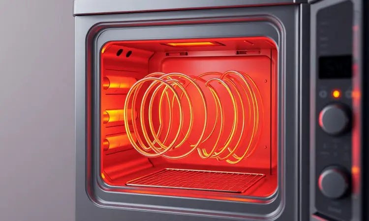
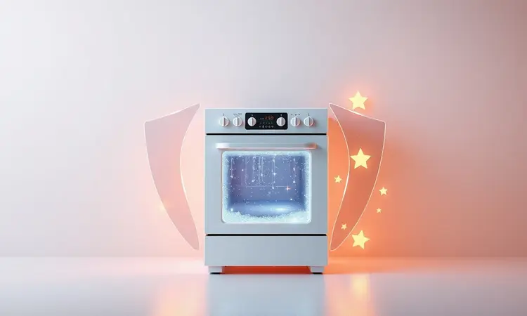

Você se preparou para uma refeição crocante e saudável, mas na hora H, percebeu que sua Air Fryer simplesmente não esquenta ou nem liga. É frustrante, eu sei, mas não jogue seu aparelho no lixo ainda.

Neste guia, vamos diagnosticar os problemas mais comuns, desde falhas simples na tomada até componentes internos que podem ter queimado.

Você vai descobrir exatamente o que fazer para recuperar sua fritadeira e, mais importante, como evitar que o problema aconteça novamente.

<SummaryList products={frontmatter.top_products} />

## Minha Air Fryer não funciona: Primeiros passos para o diagnóstico

Antes de pensar no pior, respire fundo. A maioria dos problemas começa no lugar mais simples que você nem imagina: a fonte de energia. Pense na sua Air Fryer como um atleta de alta performance, ela precisa de energia constante para funcionar direito.

E assim como um corredor não consegue dar seu melhor com os tênis desamarrados, sua fritadeira pode estar apenas com uma conexão mal feita.

### Verifique a tomada e o disjuntor antes de se desesperar

Comece pelo básico, como você faria com qualquer eletrodoméstico. O plugue está realmente inserido até o fim? Às vezes, a gente puxa um fio sem querer e nem percebe que desconectou o equipamento.

Teste a tomada com outro dispositivo, como um carregador de celular ou uma lâmpada. Funcionou? Ótimo, o problema não está ali.

Agora, caminhe até o quadro de energia. Aquele disjuntor específico não saltou, não é mesmo? Parece óbvio, mas quantas vezes já nos esquecemos de checar isso primeiro?

Essa verificação rápida pode poupar horas de frustração e até evitar que você tente abrir um aparelho que está apenas sem energia.

### O cabo de energia está danificado ou com mau contato?

<ProductBox 
  title={frontmatter.top_products[0].title} 
  image={frontmatter.top_products[0].image} 
  link={frontmatter.top_products[0].link} 
/>

Observe o cabo com atenção, do plugue até onde ele entra na Air Fryer. Você vê algum fio aparecendo? A borracha está rachada, derretida ou com marcas de superaquecimento? Se sim, pare tudo imediatamente.

Usar um cabo danificado não é apenas arriscar perder seu aparelho, é colocar sua segurança em jogo.

E aqui vai uma dica valiosa: evite adaptadores e extensões. Sua Air Fryer é como um atleta que precisa respirar livremente, sem obstáculos.

Esses acessórios intermediários podem sobrecarregar o cabo, especialmente se não forem adequados para a potência que seu aparelho exige. Quando notar qualquer sinal de desgaste, a solução não é remendar, é trocar.

E para isso, nada melhor que uma assistência técnica autorizada que fará a substituição correta, mantendo você e sua família seguros.

## Por que a Air Fryer parou de esquentar? Os 3 motivos principais

Se a energia está chegando, mas o calor não vem, temos novos suspeitos. Esses três problemas são responsáveis pela maioria dos casos em que sua fritadeira parece ter perdido sua capacidade de transformar alimentos.

### 1. Fusível térmico queimado (A causa oculta número 1)

<ProductBox 
  title={frontmatter.top_products[1].title} 
  image={frontmatter.top_products[1].image} 
  link={frontmatter.top_products[1].link} 
/>

Imagine que sua Air Fryer tenha um herói silencioso trabalhando dentro dela: o fusível térmico. Essa pequena peça é o guardião da segurança, sacrificando-se quando o aparelho atinge temperaturas perigosas.

Ele literalmente se queima para evitar que aconteça algo pior, como um incêndio.

Se sua fritadeira parou de funcionar do nada, especialmente durante o uso, o fusível pode ter cumprido seu dever. Localizado internamente (geralmente um componente cilíndrico), ele interrompe o circuito quando necessário.

Substituí-lo exige cuidado e, acima de tudo, o fusível exato com as mesmas especificações do original.

Não é uma tarefa impossível, mas se você hesita em abrir eletrodomésticos, um técnico qualificado fará isso em minutos, restaurando a proteção que seu aparelho precisa.

### 2. Resistência danificada ou oxidada

<ProductBox 
  title={frontmatter.top_products[2].title} 
  image={frontmatter.top_products[2].image} 
  link={frontmatter.top_products[2].link} 
/>

O coração da sua Air Fryer é a resistência. É ela que gera aquele calor uniforme que torna seus alimentos crocantes por fora e macios por dentro.

Com o tempo, especialmente se você cozinha alimentos gordurosos com frequência, essa resistência pode oxidar ou até danificar-se.

Como saber? Além da falta de aquecimento, fique atento a sinais como fumaça excessiva ou cheiros estranhos durante o uso. São alertas de que algo não está bem.

A boa notícia é que a prevenção é simples: limpeza regular após cada uso, evitando que gordura e umidade criem o ambiente perfeito para a oxidação. Use produtos neutros e um pano macio, tratando essa parte vital do seu aparelho com o carinho que ela merece.

### 3. Falha no termostato ou no timer manual

<ProductBox 
  title={frontmatter.top_products[3].title} 
  image={frontmatter.top_products[3].image} 
  link={frontmatter.top_products[3].link} 
/>

O que torna sua Air Fryer tão prática é o controle total que você tem. Esse controle começa no termostato, responsável por manter a temperatura exata que você selecionou, e no timer, que garante que seus alimentos não passem do ponto perfeito.

Quando esses componentes falham, o resultado é frustrante: a fritadeira liga, mas não aquece o suficiente, ou simplesmente desliga antes do tempo. São peças mais delicadas que exigem conhecimento específico para testar e substituir.

Se você perceber irregularidades na temperatura ou no tempo de funcionamento, não insista. Um técnico especializado pode diagnosticar rapidamente se é apenas um ajuste necessário ou uma substituição, devolvendo o controle completo às suas mãos.

## Air Fryer queimada: Sinais claros de que a placa eletrônica falhou

Agora vamos ao cenário mais complexo, mas ainda solucionável. A placa eletrônica é o cérebro da sua Air Fryer, coordenando temperatura, tempo e todas as funções que tornam o cozimento tão simples.

Quando esse cérebro apresenta problemas, os sinais são evidentes. Primeiro, o cheiro característico de queimado, mesmo sem alimentos dentro, indica componentes superaquecidos.

Segundo, o display digital pode ficar completamente apagado, mostrar números incoerentes ou travar no meio da programação. Terceiro, e mais frustrante, a luz de funcionamento acende, mas nenhum calor é gerado.

Esses sintomas não significam o fim. Significam que é hora de parar de tentar soluções caseiras e buscar assistência técnica especializada.

Uma avaliação profissional pode identificar se é um componente específico da placa que precisa de substituição ou se há um curto-circuito que pode ser corrigido, salvando seu investimento e sua segurança.

## 8 Problemas comuns e como resolvê-los rapidamente

Alguns desafios aparecem com mais frequência, mas felizmente, muitos têm soluções simples que você mesmo pode aplicar. Vamos descomplicar cada um deles.

### Tomada ou plugue derretendo: O perigo do superaquecimento

<ProductBox 
  title={frontmatter.top_products[4].title} 
  image={frontmatter.top_products[4].image} 
  link={frontmatter.top_products[4].link} 
/>

Encontrar uma tomada derretida ou um plugue deformado pelo calor é assustador, mas também esclarecedor. Isso quase sempre aponta para incompatibilidade: sua Air Fryer está exigindo mais energia do que a tomada pode oferecer com segurança.

Muitas pessoas conectam seus aparelhos em tomadas de 10 ampères quando precisariam de 20. É como tentar encher uma piscina com uma mangueira de jardim. A solução? Conecte diretamente em uma tomada adequada, sem adaptadores ou extensões.

Se notar qualquer aquecimento anormal ou cheiro, desligue imediatamente. Às vezes, o problema não está no aparelho, mas na instalação elétrica da sua casa. Um eletricista pode fazer a avaliação necessária, prevenindo não apenas danos à sua Air Fryer, mas riscos maiores.

### Ventoinha parou de girar ou está fazendo barulho alto

A ventoinha é a respiração da sua Air Fryer, circulando o ar quente que cozinha os alimentos de forma uniforme. Quando ela para ou começa a gritar (com barulhos altos e estranhos), é sinal de que algo a está sufocando.

Primeiro, desligue e deixe esfriar completamente. Depois, verifique se não há migalhas, pedaços de alimentos ou acúmulo de gordura bloqueando as pás. Uma limpeza cuidadosa com um pincel macio pode resolver.

Se o barulho persistir, o motor da ventoinha pode estar desgastado. Nesse caso, a intervenção de um técnico garante que a respiração do seu aparelho volte ao normal.

### Painel digital não liga ou trava no meio do preparo

Você está no meio do preparo daquela batata perfeita e... o painel congela. Ou pior, nem liga. Antes da frustração tomar conta, faça uma pausa. O problema pode ser tão simples quanto umidade ou sujeira interferindo nos sensores.

Limpe o painel com um pano seco e macio, sem produtos químicos. Verifique novamente o cabo e a tomada. Se o painel continuar inoperante, consulte o manual do usuário. Muitos fabricantes incluem soluções para reinicialização específicas do modelo.

Estas etapas simples resolvem a maioria dos casos, fazendo com que você volte a controlar sua cozinha em minutos.

### Puxador ou botão de timer quebrado

<ProductBox 
  title={frontmatter.top_products[5].title} 
  image={frontmatter.top_products[5].image} 
  link={frontmatter.top_products[5].link} 
/>

O puxador que solta ou o botão que não gira mais são problemas físicos, mas não necessariamente fatais. Para o puxador, dependendo do tipo de quebra, um reparo com parafusos adequados ou uma chapinha de reforço pode devolver a funcionalidade.

Se a danificação for extensa, lojas online oferecem peças de reposição específicas para seu modelo.

Já o botão de timer muitas vezes só precisa de uma boa limpeza. Acúmulo de gordura e resíduos podem impedir seu movimento suave. Uma limpeza cuidadosa seguida de um lubrificante específico (nunca produtos gerais que podem danificar o plástico) pode fazer milagres.

Se realmente estiver danificado, botões compatíveis são facilmente encontrados. Recuperar esses detalhes dá uma satisfação especial, como renovar um parceiro de cozinha que já conquistou seu lugar.

### Cesto enferrujado ou descascando: É hora de trocar?

<ProductBox 
  title={frontmatter.top_products[6].title} 
  image={frontmatter.top_products[6].image} 
  link={frontmatter.top_products[6].link} 
/>

Ver o revestimento antiaderente do seu cesto descascando ou manchas de ferrugem aparecendo é desanimador, mas também um alerta importante.

Enquanto pequenas áreas podem ser tratadas com métodos adequados de limpeza, um descascamento evidente ou ferrugem extensa significa que é hora da substituição.

Por quê? Fragmentos do revestimento podem se soltar nos alimentos, e a ferrugem compromete não apenas o sabor, mas a segurança do que você consome. A boa notícia é que você não precisa trocar o aparelho inteiro.

Fabricantes como Mondial e Philco oferecem cestos de reposição específicos para cada modelo, a um custo muito menor que uma nova Air Fryer.

E para prevenir que isso aconteça novamente, lembre-se: lave sempre com esponjas macias, seque completamente antes de guardar e nunca use utensílios metálicos que possam arranhar o revestimento.

## Vale a pena consertar ou é melhor comprar uma Air Fryer nova?

Chegamos à pergunta que todos fazem quando o problema aparece. A resposta não é única, mas segue uma lógica simples: compare o custo do conserto (em tempo e dinheiro) com o valor emocional e funcional do seu aparelho atual.

### Quando a garantia de fábrica ainda é sua melhor amiga

Antes de qualquer decisão, verifique a garantia. Ainda está dentro do período? Isso muda completamente o jogo. A garantia é como um seguro que você já pagou ao comprar o aparelho. Use-a.

Defeitos de fabricação e falhas não causadas por mau uso são cobertos, podendo resultar em conserto gratuito ou até substituição do aparelho. É a forma mais inteligente de proteger seu investimento.

### Comparando o custo das peças com os novos modelos do mercado

<ProductBox 
  title={frontmatter.top_products[7].title} 
  image={frontmatter.top_products[7].image} 
  link={frontmatter.top_products[7].link} 
/>

Vamos aos números. Um cesto de reposição custa entre R$ 70,00 e R$ 299,00. Componentes eletrônicos básicos começam em R$ 24,99. Some o custo de todas as peças que seu aparelho precisa e compare com o preço de um modelo novo.

Mas não pense apenas no valor. Pense na experiência. Os modelos mais recentes trazem eficiência energética aprimorada, tecnologias que facilitam ainda mais o uso e designs que se integram melhor à sua cozinha.

Se o custo total do conserto se aproxima de 60-70% do valor de um modelo novo e mais eficiente, o upgrade pode ser o investimento mais inteligente a longo prazo.

## 5 Dicas de mestre para sua fritadeira durar muito mais

Agora que você já sabe resolver problemas, vamos focar na prevenção. Essas cinco práticas simples farão com que sua Air Fryer se torne não apenas um eletrodoméstico, mas um companheiro de cozinha por anos.

1. **Estabilidade é fundamental**: Sempre coloque seu aparelho em uma superfície plana e estável. Vibrações podem afetar componentes internos sensíveis.

2. **Limpeza como ritual, não como obrigação**: Após cada uso, enquanto ainda está morno (nunca quente), limpe o cesto e o interior. Resíduos secos são muito mais difíceis de remover depois.

3. **Respeite o espaço de respiração**: Mantenha pelo menos 10 centímetros de distância das paredes e outros eletrodomésticos. Sua Air Fryer precisa circular ar para não superaquecer.

4. **Guarde com carinho**: Deixe esfriar completamente antes de guardar, e se possível, mantenha a tampa ligeiramente aberta para evitar acúmulo de umidade.

5. **Conheça seu parceiro**: Dedique 10 minutos para ler o manual. Cada modelo tem particularidades que, quando respeitadas, prolongam significativamente sua vida útil.

## Perguntas Frequentes (FAQ)

### Posso consertar minha Air Fryer em casa?

Depende do problema e da sua confiança. Fusíveis queimados, fiação solta ou limpeza interna são realizáveis se você seguir instruções precisas e tomar todas as precauções de segurança (sempre desligado da tomada).

No entanto, quando envolve componentes complexos como a placa eletrônica ou o termostato, e especialmente se você não tem experiência com reparos elétricos, procurar um profissional é sempre a escolha mais segura.

O manual do fabricante é seu melhor guia para identificar o que você pode fazer e quando pedir ajuda.

### Por que minha Air Fryer desliga sozinha do nada?

Imagine que sua Air Fryer tem limites que ela própria respeita para proteger você. O desligamento repentino geralmente é uma medida de segurança ativada por superaquecimento.

Verifique se o filtro de ar não está obstruído por gordura ou resíduos, se a cesta está corretamente encaixada (muito mal posicionada pode interferir nos sensores) e se a tomada está fornecendo energia estável.

Às vezes, é apenas o aparelho dizendo "preciso de uma pausa para respirar". Deixe esfriar por 30 minutos e tente novamente.

Se persistir, pode ser um sinal de que um dos componentes de segurança (como o fusível térmico) está atuando, indicando a necessidade de uma verificação mais detalhada.

## Conclusão

Sua Air Fryer parar de funcionar não precisa ser o fim da história. Na verdade, é o início de uma jornada de descoberta sobre como seu aparelho funciona e como você pode mantê-lo em perfeito estado. Comece sempre pelo básico: energia, conexões e limpeza.

Muitos problemas se resolvem ali mesmo, sem necessidade de intervenções complexas.

Quando componentes internos como fusíveis, resistências ou a placa eletrônica apresentarem falhas, lembre-se que soluções existem. Desde reparos simples até substituições pontuais, seu investimento pode ser recuperado.

A decisão entre consertar ou trocar deve considerar não apenas o custo financeiro, mas também o valor emocional que seu aparelho tem na sua rotina.

Mais importante que saber consertar é saber prevenir. As cinco dicas que compartilhamos transformam a manutenção da sua Air Fryer em um hábito natural, como lavar a louça após o jantar.

Com esses cuidados, sua fritadeira não apenas funcionará por mais tempo, mas continuará entregando aquelas refeições crocantes e saudáveis que tanto ama.

A próxima vez que seu aparelho apresentar qualquer sinal, respire e lembre-se: você tem o conhecimento para diagnosticar, as opções para resolver e o poder para prevenir. Sua cozinha inteligente continua nas suas mãos.