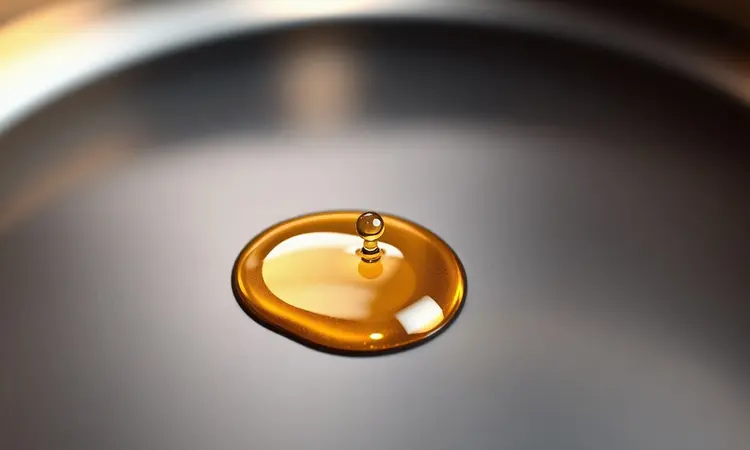
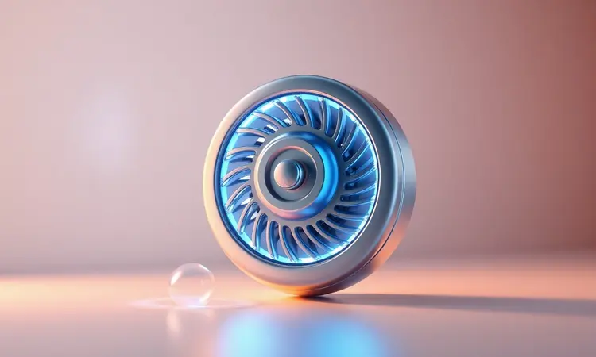

Imagine preparar batatas fritas tão crocantes que fazem aquele barulho satisfatório a cada mordida, mas sem aquela sensação de peso no estômago horas depois.

Ou transformar um peito de frango numa casca dourada que se desfaz na boca, preservando toda a suculência interior.

Essa não é uma promessa de restaurante caro, é a realidade que mora dentro da sua cozinha, pronta para ser desbloqueada por um eletrodoméstico que parece entender exatamente o que seu paladar deseja: crocância sem culpa.

<SummaryList products={frontmatter.top_products} />

## O Que é uma Air Fryer e Qual Sua Origem?

Você pode pensar nela como o resultado de anos de pesquisa em busca do equilíbrio perfeito entre sabor e saúde.

Nascida na Bélgica no início dos anos 2000, essa invenção foi a resposta para um dilema culinário: como recriar o prazer inconfundível da fritura sem afogar os alimentos em óleo? A solução veio não de ingredientes secretos, mas de física aplicada à cozinha.

O que começou como uma curiosidade tecnológica rapidamente conquistou lares ao redor do mundo, transformando-se naquela aliada silenciosa que trabalha enquanto você cuida de outras coisas, prometendo (e entregando) refeições que enganam os sentidos de maneira deliciosa.

## A Ciência por Trás: Entenda a Tecnologia de Convecção de Ar Rápido

A magia acontece quando calor e movimento se encontram. Diferente do forno convencional, que esquenta o ambiente e espera que esse calor lentamente alcance sua comida, a air fryer cria uma tempestade controlada.

É como colocar seus alimentos num tornado de ar quente que os envolve por todos os lados simultaneamente. Esse abraço térmico intenso cozinha a superfície rapidamente, criando a crocância que buscamos, enquanto sela os sucos internos antes que tenham chance de escapar.

O resultado? Textura que satisfaz lá fora, suculência que emociona lá dentro, e tudo isso com apenas uma colher de óleo ou menos.

### O Papel da Resistência de Aquecimento

Pense na resistência como o coração pulsante do aparelho. Localizada no topo, ela acorda em segundos, elevando a temperatura interna até os 200°C necessários para iniciar a transformação.

Esse aquecimento imediato é o que elimina a espera tediosa do pré-aquecimento do forno tradicional.

Quando você programa 180°C, não está apenas definindo um número, está acionando um gerador de calor que trabalha incansavelmente para manter essa temperatura estável, criando o ambiente perfeito para a cocção uniforme.

### Por que o Ventilador de Alta Potência é o Segredo da Crocância

Se a resistência é o coração, o ventilador é o sistema circulatório que leva vida a cada canto. Girando em alta velocidade, ele não apenas move o ar quente, mas o direciona com precisão cirúrgica.

Cada batata, cada pedaço de frango, cada vegetal recebe atenção individualizada, como se estivesse sendo assado por um chef invisível que vira e movimenta constantemente.

Essa circulação vigorosa é a responsável por eliminar pontos frios, garantir que cada milímetro fique dourado igualmente e, o mais importante, criar aquela camada externa crocante que faz você fechar os olhos de satisfação.

## Air Fryer vs. Forno Convencional: Por que Ela é Mais Rápida?

A diferença não está apenas no tempo marcado no relógio, mas na eficiência com que cada minuto é aproveitado.

Enquanto seu forno precisa aquecer toda a cavidade interna (muitas vezes muito maior do que o necessário), a air fryer concentra toda sua energia num espaço compacto, direcionando cada joule de calor diretamente para os alimentos.

Pense nisso como a diferença entre aquecer um estádio inteiro para você sentar numa única cadeira versus aquecer apenas o assento que você vai ocupar.

Essa economia de energia se traduz em velocidade: o que levaria 40 minutos no forno pode ficar pronto em 20, mantendo a mesma qualidade (ou até superior).

## Primeiro Uso: Como Fazer a 'Cura' do Antiaderente Corretamente

Antes da primeira receita, seu novo aparelho merece um ritual de iniciação. Essa 'cura' não é apenas um procedimento técnico, é como apresentá-lo oficialmente ao mundo dos sabores.

Comece lavando suavemente a cesta e bandeja com água morna e detergente neutro, imagine que está removendo qualquer vestígio de sua vida anterior na fábrica. Depois de secar completamente, leve o aparelho vazio a 200°C por 20 minutos.

Durante esse tempo, qualquer resíduo mínimo de produção se dissipa, o revestimento antiaderente se estabiliza e a air fryer literalmente encontra sua voz, pronta para começar sua jornada culinária ao seu lado.

## 7 Dicas Práticas para Usar Sua Fritadeira Elétrica Como um Expert

Dominar sua air fryer é como aprender a dançar com um novo parceiro, requer atenção aos sinais, respeito ao espaço e sincronia perfeita. Essas sete dicas são os passos básicos que transformarão você de aprendiz em mestre.

### 1. A Importância de Preaquecer para Selar os Alimentos

Pular o pré-aquecimento é como tentar correr com os sapatos ainda amarrados.

Esses poucos minutos extras (geralmente 3 a 5) fazem toda a diferença entre alimentos que suam seus sucos e perderam textura versus aqueles que selaram instantaneamente suas superfícies, trancando a umidade dentro.

Essa barreira térmica inicial é o segredo para carnes que desfazem na boca e legumes que mantêm sua vivacidade. Quando a air fryer já está na temperatura certa ao receber os alimentos, ela trabalha de maneira assertiva, não reativa.

### 2. O Erro Comum de Lotar a Cesta: Deixe o Ar Circular

A tentação de encher a cesta até a borda é compreensível, queremos eficiência máxima. Mas aqui, menos é literalmente mais. Visualize cada pedaço de comida precisando de seu próprio espaço pessoal, um pequeno halo de ar quente circulando ao seu redor.

Quando amontoamos, criamos sombras térmicas onde o calor não consegue penetrar, resultando em pontos crus e outros queimados. A solução? Duas fornadas menores com resultados perfeitos valem mais do que uma única fornada cheia com resultados irregulares.

### 3. Sacudir a Cesta: O Segredo para um Dourado Uniforme

A cada 5 a 10 minutos, uma sacudida suave na cesta faz mais do que redistribuir os alimentos, é como dar uma mexida cuidadosa numa panela, garantindo que cada lado receba seu momento de glória sob o calor.

Para batatas fritas, essa prática é especialmente mágica: as que estavam no fundo sobem, as de cima descem, e todas alcançam aquele dourado uniforme que parece saído de um comercial de TV. É gesto simples que separa o amador do profissional.

### 4. O Truque do Spray de Óleo: Quando Usar?

<ProductBox 
  title={frontmatter.top_products[0].title} 
  image={frontmatter.top_products[0].image} 
  link={frontmatter.top_products[0].link} 
/>

O spray de óleo é o acessório secreto que eleva 90% das receitas. Mas atenção: nem todo spray é criado igual. Evite aqueles com propelentes químicos que podem danificar o revestimento da sua cesta.

Opte por borrifadores recarregáveis onde você controla o óleo usado (abacate ou semente de uva são excelentes para altas temperaturas). A técnica é uma névoa sutil, não um banho.

Uma camada quase imperceptível já é suficiente para criar aquela crocância adicional sem transformar sua refeição saudável em algo oleoso. Pense nisso como o verniz final numa obra de arte, realça sem dominar.

## O Que NUNCA Colocar na Air Fryer: Segurança em Primeiro Lugar

Algumas combinações são feitas para não dar certo. Alimentos com muito líquido (sopas, molhos aquosos) criam respingos perigosos que podem atingir a resistência. Massas de panificação muito líquidas podem escorrer pelos vãos da cesta.

Queijos que derretem excessivamente podem pingar e criar fumaça. E alimentos empanados com farinha de rosca muito solta podem voar e queimar, criando odor desagradável.

A regra de ouro é simples: se algo precisaria de uma frigideira com laterais altas no fogão, provavelmente não é candidato para a air fryer. Respeitar esses limites protege seu aparelho e sua tranquilidade.

## Manutenção e Limpeza Profunda: Como Evitar o Acúmulo de Gordura no Motor

Seu relacionamento com a air fryer é de mão dupla: ela cuida da sua alimentação, você cuida da sua saúde mecânica. Após cada uso, enquanto ainda está levemente quente (não quente ao ponto de queimar), limpe a cesta com água morna e sabão neutro.

A cada duas semanas, faça um encontro mais profundo: desconecte o aparelho, passe um pano úmido nas superfícies internas (evitando a entrada de água no motor), e verifique se não há migalhas ou resíduos acumulados nos cantos. Nunca submerja a base elétrica.

Esse pequeno ritual de cuidado prolonga a vida do seu aliado culinário e garante que cada refeição tenha o sabor puro que você merece, sem resquícios de preparos anteriores.

## Melhores Opções de Air Fryer: Fritadeira Elétrica Mondial Family Inox

<ProductBox 
  title={frontmatter.top_products[1].title} 
  image={frontmatter.top_products[1].image} 
  link={frontmatter.top_products[1].link} 
/>

Quando a praticidade precisa encontrar a robustez, a Mondial Family Inox se apresenta como uma companheira confiável. Com capacidade que vai de 3,5L a 5L, ela acolhe desde seu jantar solitário até uma reunião familiar sem perder o brilho.

Seus 1500W de potência significam que não há espera, quando você tem fome, ela está pronta para trabalhar. O controle de temperatura chega a 200°C, e o timer de até 60 minutos permite desde um snack rápido até um assado mais demorado.

A cesta antiaderente se solta com um clique, tornando a limpeza parte fácil da rotina. Seu design é funcional sobre tudo, para quem valoriza substância sobre aparência.

## Eficiência Digital: Fritadeira Elétrica Electrolux Digital Efficient (EAT10)

<ProductBox 
  title={frontmatter.top_products[2].title} 
  image={frontmatter.top_products[2].image} 
  link={frontmatter.top_products[2].link} 
/>

Para quem conversa melhor com telas do que com botões giratórios, a Electrolux EAT10 oferece um diálogo silencioso através de seu painel touch digital. Cada toque é um comando preciso, temperatura, tempo, função pré-programada.

Com 3,2 litros e 1400W, ela é a escolha perfeita para casais ou solteiros que desejam agilidade sem complicação. As receitas pré-configuradas são como ter um assistente culinário embutido, guiando você através de preparos perfeitos mesmo nas noites mais cansativas.

A superfície em polipropileno pede cuidado contra arranhões, mas retribui com um visual moderno que se integra a qualquer cozinha.

## Tecnologia de Ponta: Fritadeira Elétrica Philips Walita Essential

<ProductBox 
  title={frontmatter.top_products[3].title} 
  image={frontmatter.top_products[3].image} 
  link={frontmatter.top_products[3].link} 
/>

Aqui está onde a engenharia encontra a arte culinária. A Philips Walita Essential XL não apenas cozinha, ela realiza pequenos milagres diários com sua tecnologia Rapid Air.

Esse sistema patenteado é a evolução do conceito original, garantindo que o ar quente não apenas circule, mas dance ao redor dos alimentos com padrões otimizados.

Os 6,2 litros de capacidade convidam celebrações, prepare aperitivos para uma festa ou o jantar completo para a família toda. O painel digital oferece controle intuitivo, e todas as peças removíveis vão à lava-louças, respeitando seu tempo pós-refeição.

Se você busca não apenas um eletrodoméstico, mas um centro de inovação culinária na sua cozinha, esta é sua escolha.

## Perguntas Frequentes (FAQ) sobre o Funcionamento da Air Fryer

*Ela realmente é segura?* Absolutamente, quando usada conforme as instruções. Possui sistemas de desligamento automático por temperatura e timer. *Precisa de óleo algum?* Apenas uma névoa sutil em alguns alimentos para potencializar a crocância.

*Posso fazer só batatas fritas?* Pode, mas está subutilizando seu potencial. Ela assa, grelha, aquece, até faz bolos pequenos. *A limpeza é trabalhosa?* Pelo contrário, a maioria das peças vai à lava-louças, e uma limpeza rápida após o uso mantém tudo impecável.

*Funciona para congelados?* Sim, e muitas vezes melhor que o forno, pois descongela e cozinha simultaneamente, evitando aquela textura borrachuda.

## Conclusão

No final dessa jornada, a pergunta não é mais *se* vale a pena ter uma fritadeira sem óleo, mas *como* você viveu tanto tempo sem uma. Ela representa mais do que um eletrodoméstico, é uma mudança de mentalidade.

É sobre redescobrir o prazer de comer bem sem o peso da culpa, sobre reconquistar minutos preciosos do seu dia que antes eram gastos em frente ao fogão, sobre surpreender sua família (e a si mesmo) com criações culinárias que pareciam reservadas a restaurantes.

Desde a primeira batata crocante até o frango mais suculento que você já preparou, cada receita se torna uma pequena vitória. O espaço que ocupa no balcão é insignificante perto do espaço que abre na sua rotina para mais criatividade, saúde e sabor.

Se você busca um aliado que respeite seu tempo, seu paladar e seu bem-estar, a resposta está no ar quente que circula, na crocância que satisfaz, e na liberdade de criar sem limites. Sua próxima refeição extraordinária está a apenas um timer de distância.