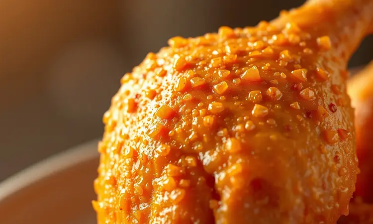
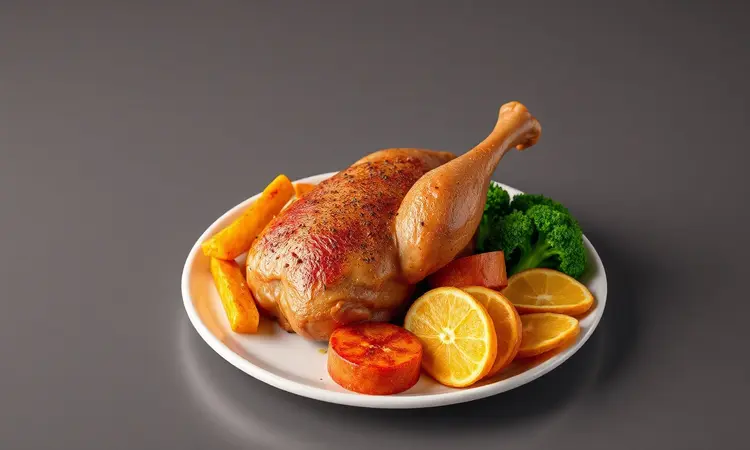

Já aconteceu com você? Abrir a air fryer esperando encontrar uma coxa de frango dourada e suculenta, mas deparar-se com uma carne que parece couro e uma pele que mais lembra borracha?

A verdade é que preparar frango perfeito nesse aparelho vai além de apenas configurar temperatura e tempo. Existe uma arte delicada entre manter os sucos presos na carne e transformar a pele em uma crocância que estala a cada mordida.

Neste guia, você vai descobrir não apenas uma receita, mas um método completo que transforma o frango mais simples em uma experiência digna de restaurante - sem precisar ser chef profissional ou gastar horas na cozinha.

<SummaryList products={frontmatter.top_products} />

## Por que preparar coxa de frango na air fryer?

Pense na última vez que você preparou frango na frigideira: o óleo espirrando por toda a bancada, aquela sensação de gordura no ar, a pele que nunca ficava realmente crocante por igual. A air fryer resolve todos esses problemas de uma vez só.

Ela usa o ar quente em movimento para criar uma camada exterior perfeita, enquanto mantém o interior incrivelmente úmido - tudo isso usando apenas uma colher de sopa de óleo ou menos.

Você ganha praticidade (o preparo é quase automático), saúde (muito menos gordura) e resultados consistentes toda vez. É como ter um assistente culinário que nunca se cansa e sempre acerta o ponto.

## Como escolher e preparar as coxas de frango para o melhor resultado

A jornada para o frango perfeito começa muito antes da air fryer ser ligada. Ao escolher as coxas, procure por aquelas com pele bem esticada e cor uniforme - evite pedaços com manchas escuras ou que pareçam murchas. Ao toque, devem sentir-se firmes, não gelatinosas.

Agora vem o segredo que muitos pulam: a preparação. Não basta apenas temperar e colocar no aparelho. Seque bem a pele com papel toalha - essa umidade superficial é inimiga da crocância.

Deixe-as marinar por pelo menos 30 minutos (idealmente 2 horas se tiver tempo), mas aqui está um truque profissional: se estiver com pressa, massageie os temperos na carne por alguns minutos e deixe descansar enquanto preaquece a máquina.

O calor inicial ajudará os sabores a penetrarem mais rápido.

## Temperos imbatíveis: Do clássico alho e ervas ao toque picante

Você já percebeu como o mesmo frango pode ter personalidades completamente diferentes dependendo dos temperos? É como vestir a mesma pessoa com roupas diferentes - a base é a mesma, mas a experiência muda completamente.

Para o caminho clássico, não subestime o poder do alho fresco espremido, sal grosso moído na hora, pimenta-do-reino recém-moída e um punhado generoso de alecrim ou tomilho.

Mas se o seu paladar pede aventura, experimente uma mistura de páprica defumada, cominho e um toque de canela - parece incomum até você experimentar a primeira mordida.

### Marinada seca (Dry Rub) vs. Marinada líquida: Qual escolher?

Essa decisão define o destino da sua coxa. A marinada seca é sua aliada para o máximo de crocância: ela forma uma casca dourada que protege a umidade interior enquanto cria textura.

Perfeita para quando você quer resultados rápidos - apenas esfregue, deixe por 15 minutos e vá para a air fryer.

Já a marinada líquida (com azeite, limão, mel, vinagre) é uma infusão mais profunda que abraça cada fibra da carne, garantindo suculência mesmo se você errar alguns segundos no tempo. Minha recomendação?

Use a seca quando busca crocância extrema, e a líquida quando prioriza carne que praticamente derrete na boca.

## Receita de Coxa de Frango na Air Fryer: Passo a Passo Detalhado

Agora vamos à prática que transforma teoria em prato. Primeiro, tempere suas coxas já preparadas com sua mistura escolhida - seja generoso, especialmente sob a pele. Pré-aqueça a air fryer a 200°C por 5 minutos (esse passo é não negociável para a crocância).

Arrume as coxas na cesta com a pele para cima, garantindo espaço entre elas como convidados em uma festa que precisam de espaço para dançar.

Asse por 12 minutos, vire com cuidado (use uma pinça para não furar a pele), e continue por mais 13-18 minutos dependendo do tamanho. O sinal visual? Pele dourada e que parece estalar ao toque. O sinal técnico?

Um termômetro marca 75°C no ponto mais grosso, sem tocar o osso.

## Guia de Tempo e Temperatura: Tabela prática para não errar

Esqueça as receitas que dizem '25-30 minutos' sem contexto. O tamanho da coxa muda tudo. Para pedaços pequenos (até 150g), 200°C por 20-22 minutos com uma virada na metade. Para as médias (150-200g), mantenha os 200°C mas aumente para 24-26 minutos.

As grandes (acima de 200g) podem precisar de 28-30 minutos. A regra de ouro? Comece com menos tempo - você sempre pode adicionar minutos, mas não pode tirar o excesso de cozimento. E sempre, sempre verifique com termômetro.

Essa pequena ferramenta é seu seguro contra frangos ressecados.

## 5 Segredos para uma Pele de Frango Extra Crocante na Fritadeira

1. Secagem agressiva: Passe papel toalha na pele até ele sair completamente seco. A umidade é o veneno da crocância.

2. Tempero estratégico: Sal grosso esfregado na pele uma hora antes puxa a umidade superficial, criando condições perfeitas para a transformação em crocância.

3. Pré-aquecimento não negociável: A air fryer precisa estar quente como um forno profissional quando o frango entra. Esse choque térmico sela os sucos instantaneamente.

4. Espaço é luxo: Nunca, em hipótese alguma, empilhe as coxas. Cada uma precisa de seu próprio território de ar quente circulando.

5. O toque final: Nos últimos 2 minutos, aumente para 210°C para dar aquele acabamento dourado e estalante que faz os olhos brilharem antes mesmo da primeira mordida.

## Equipamentos e acessórios que facilitam o preparo

Assim como um pintor precisa das ferramentas certas, sua air fryer também se beneficia de alguns parceiros essenciais. Um termômetro de ponta instantânea é seu melhor amigo - ele tira todas as adivinhações da equação.

Uma pinça de silicone permite virar o frango sem rasgar aquela pele preciosa. E um pincel de silicone ajuda a aplicar marinadas líquidas de forma uniforme, garantindo que cada centímetro receba amor.

### Fritadeiras Air Fryer de Alta Performance

<ProductBox 
  title={frontmatter.top_products[0].title} 
  image={frontmatter.top_products[0].image} 
  link={frontmatter.top_products[0].link} 
/>

Se você está pensando em investir ou atualizar seu equipamento, considere modelos que oferecem controle preciso de temperatura (ajustes de 5 em 5 graus são ideais) e cesta com revestimento cerâmico que evita grudar sem necessidade de óleo extra.

Marcas como Philips e Oster oferecem tecnologias de circulação de ar que fazem diferença real - não é marketing, é física aplicada à sua coxa de frango.

Procure por capacidade adequada ao seu uso: para famílias, 5L ou mais; para solteiros ou casais, 3-4L são suficientes sem ocupar espaço desnecessário.

### Termômetro Digital de Alimentos

<ProductBox 
  title={frontmatter.top_products[1].title} 
  image={frontmatter.top_products[1].image} 
  link={frontmatter.top_products[1].link} 
/>

Este é o item que separa os amadores dos profissionais domésticos. Um bom termômetro digital responde em 3-4 segundos, tem ponta fina para não fazer buracos enormes na carne, e memória para a temperatura ideal do frango (75°C).

Não precisa ser caríssimo - modelos acessíveis fazem trabalho excelente. A dica de ouro: insira na parte mais grossa, sem tocar o osso, e espere o bip. Essa confirmação sonora é sua garantia de carne segura e suculenta, não seca e borrachuda.

### Forros de Silicone e Papel Antiaderente para Air Fryer

<ProductBox 
  title={frontmatter.top_products[2].title} 
  image={frontmatter.top_products[2].image} 
  link={frontmatter.top_products[2].link} 
/>

Esses acessórios são sobre praticidade limpa. O forro de silicone reutilizável é ideal para quem cozinha frango frequentemente - ele protege o fundo da cesta, coleta gorduras para um molho rápido, e lava na lava-louças sem esforço.

Já o papel antiaderente descartável é perfeito para quando você quer zero limpeza pós-jantar (e quem não quer às vezes?). Use-os quando fizer marinadas açucaradas que podem caramelizar e grudar, ou quando preparar coxas especialmente gordurosas.

## Dicas de Especialista: Como evitar que o frango resseque

O pesadelo de qualquer cozinheiro amador: abrir a air fryer e encontrar carne que parece ter cruzado o deserto. Para evitar isso, comece escolhendo coxas com pele (ela é uma barreira natural de umidade).

Não corte a pele para 'deixar mais saudável' - isso é enviar a suculência direto para o ar quente. Durante o cozimento, resista à tentação de abrir a tampa a cada cinco minutos - cada abertura baixa a temperatura interna drasticamente.

E aqui está o segredo mais guardado: ao retirar o frango, deixe-o 'descansar' por 5 minutos em um prato antes de cortar. Esse tempo permite que os sucos se redistribuam uniformemente pela carne, em vez de escorrerem pelo prato quando você corta.

## O que servir? Sugestões de acompanhamentos deliciosos

Uma coxa de frango perfeita merece companhias à altura. Para um equilíbrio de texturas, legumes assados na própria air fryer enquanto o frango descansa - abobrinha em rodelas, cenoura baby e pimentões em tiras, tudo com um fio de azeite e ervas.

Para conforto, um purê de batata cremoso (dica: cozinhe as batatas no vapor e amasse com manteiga e um pouco do suco que coletou da assadeira do frango). Para refrescar, uma salada simples de folhas verdes com vinagrete de limão e mostarda dijon.

E para os dias especiais, arroz soltinho cozido com caldo de legumes caseiro - ele absorve os sucos do frango no prato de forma mágica.

## Como requentar o frango na air fryer mantendo a crocância

Sobra de frango não precisa significar segunda-feira triste. Para reviver a crocância, pré-aqueça a air fryer a 180°C - temperatura mais baixa para aquecer sem queimar.

Coloque as coxas ainda frias da geladeira direto na cesta (não precisa descongelar se estiverem congeladas, apenas adicione 5 minutos). Asse por 8-12 minutos, virando na metade.

A mágica acontece porque o ar quente circulante reativa a textura da pele enquanto aquece o interior de forma uniforme. Resultado? Frango que parece acabado de fazer, sem aquela tristeza de micro-ondas que deixa tudo borrachudo.

## Perguntas Frequentes (FAQ)

Posso congelar coxa de frango já temperada antes de assar? Sim, e é uma ótima estratégia de meal prep. Tempere, coloque em sacos individuais, e congele. Ao assar, adicione 5-7 minutos ao tempo normal.

E se minha air fryer não tem ajuste de temperatura exata? Use o modo 'frango' se disponível, ou ajuste manualmente para a posição média-alta. Fique atento visualmente a partir dos 15 minutos.

Preciso virar o frango mesmo se minha air fryer diz que não precisa? Sim, sempre. Mesmo as melhores circulações de ar têm pontos quentes e frios. Virar garante crocância uniforme.

Posso usar essa técnica para outros cortes de frango? Totalmente. Coxas da asa funcionam em 18-20 minutos, peitos (com pele) em 22-25 minutos. Ajuste sempre com termômetro.

O óleo spray é realmente necessário? Para coxas com pele, não. A gordura natural da pele é suficiente. Para peitos sem pele, uma leve borrifada ajuda na crocância.

## Conclusão

Preparar coxa de frango na air fryer vai muito além de seguir uma receita - é entender a conversa entre calor, umidade e tempo.

Ao dominar esses três elementos, você transforma o corte mais acessível do supermercado em uma experiência gastronômica que impressiona tanto no jantar de terça-feira quanto na recepção de visitas especiais.

Lembre-se: o equipamento é importante, mas sua atenção aos detalhes faz a diferença real. Desde a escolha do frango até o descanso final antes de servir, cada passo importa. Agora você tem todas as ferramentas para nunca mais aceitar frango ressecado.

Ligue sua air fryer, escolha suas coxas favoritas, e prepare-se para ouvir o melhor elogio que um cozinheiro pode receber: 'Você precisa me passar essa receita!'. A cozinha espera - e seu próximo jantar também.