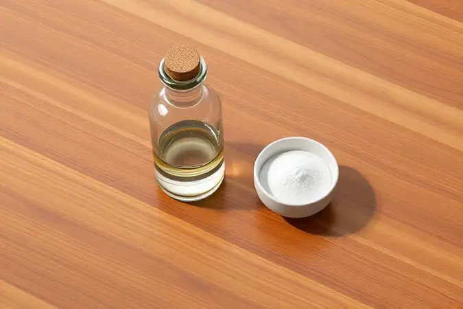
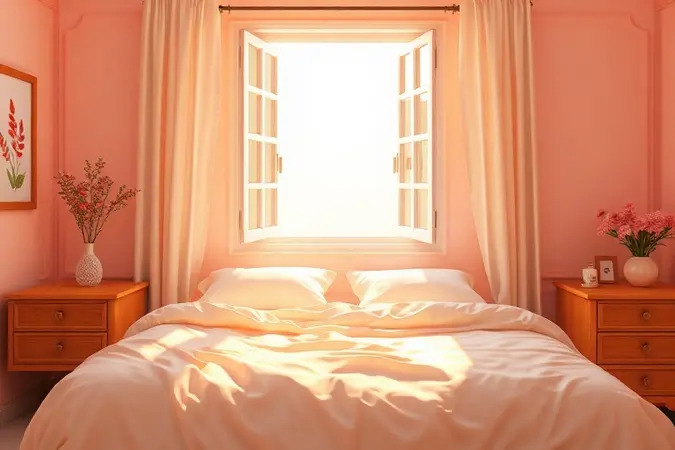

Acordar com aquele cheiro característico de mofo ou notar manchas escuras no lugar onde você descansa à noite não é apenas desagradável. É um sinal de alerta.

Esse vilão silencioso que se instala no seu colchão pode comprometer sua saúde respiratória e transformar seu santuário de descanso num ambiente hostil.

Mas aqui está a boa notícia: você não precisa gastar fortunas com produtos químicos agressivos ou serviços profissionais para reconquistar seu espaço seguro.

Neste guia completo, vamos percorrer juntos o caminho desde entender exatamente por que o mofo aparece até dominar técnicas caseiras para eliminá-lo de vez, garantindo que seu sono volte a ser protegido e revigorante.

<SummaryList products={frontmatter.top_products} />

## Por que o mofo aparece no colchão e quais os riscos para a saúde?

Imagine um ambiente que reúne tudo que um fungo adora: umidade, calor e pouca circulação de ar.

É exatamente esse cenário que você cria, muitas vezes sem perceber, quando deixa o colchão em contato direto com o chão, não ventila bem o quarto ou ignora pequenos derramamentos que não secam completamente. O resultado é um convite aberto para a proliferação do mofo.

E os efeitos vão muito além das manchas feias e do odor desagradável.

Respirar esporos de mofo durante horas, enquanto você dorme, pode desencadear crises alérgicas, agravar problemas respiratórios como asma e, para quem tem imunidade comprometida, até facilitar infecções mais sérias.

Manter seu colchão seco e livre desse invasor não é questão de limpeza, é uma defesa indispensável da sua saúde.

## O que você vai precisar: Materiais essenciais para a limpeza

A beleza desta missão está na sua simplicidade. Você não precisa de um arsenal industrial.

Para transformar seu colchão e expulsar o mofo, reúna ingredientes que provavelmente já tem em casa: água quente, vinagre branco (aquele mesmo da cozinha), bicarbonato de sódio, uma escova de cerdas macias (como uma escova de roupa) e alguns panos limpos de algodão.

Esta combinação é poderosa. Vamos explorar o papel de cada herói neste processo.

### Bicarbonato de Sódio: O clareador e neutralizador de odores

<ProductBox 
  title={frontmatter.top_products[0].title} 
  image={frontmatter.top_products[0].image} 
  link={frontmatter.top_products[0].link} 
/>

O bicarbonato de sódio é o mágico da neutralização. Ele não apenas cobre odores, ele os elimina quimicamente, reagindo com as moléculas que causam aquele cheiro característico de umidade e mofo.

Quando você o polvilha generosamente sobre o colchão, ele trabalha em silêncio, absorvendo a umidade residual que os fungos tanto amam e deixando a superfície pronta para a etapa seguinte.

É aquele aliado que prepara o terreno, garantindo que, ao final do processo, você sinta apenas aquele frescor característico de roupa lavada ao sol, não uma máscara de perfume sobre o problema.

(Para manchas mais teimosas e antigas, ele age como clareador natural, clareando aos poucos a área afetada.)

### Vinagre de Álcool: O agente antifúngico natural

<ProductBox 
  title={frontmatter.top_products[1].title} 
  image={frontmatter.top_products[1].image} 
  link={frontmatter.top_products[1].link} 
/>

Enquanto o bicarbonato prepara, o vinagre ataca. Seu componente principal, o ácido acético, é um inimigo natural dos fungos. Ele cria um ambiente tão ácido que interrompe o ciclo de vida do mofo, impedindo sua reprodução.

Pesquisas indicam que ele pode inibir o crescimento de diversas famílias de fungos, sendo uma alternativa eficaz e ecológica aos desinfetantes químicos.

Seu poder pode ser potencializado quando combinado com cravo da índia, formando um tônica natural ainda mais forte contra esporos e odores.

Ao contrário de produtos agressivos, ele não libera vapores tóxicos, permitindo que você retorne ao seu quarto logo após a limpeza, respirando aliviado.

### Aspirador de pó: Remoção física de esporos

<ProductBox 
  title={frontmatter.top_products[2].title} 
  image={frontmatter.top_products[2].image} 
  link={frontmatter.top_products[2].link} 
/>

Depois de soltar e atacar o mofo, é hora de removê-lo fisicamente do seu espaço. Eis onde um aspirador de pó com filtro HEPA se torna seu melhor aliado.

Esses filtros são projetados como uma barreira de alta eficiência, capturando partículas microscópicas (como os desagradáveis esporos de fungos) e impedindo que eles sejam devolvidos ao ar que você respira.

Marcas consagradas como Electrolux, AEG e Philips oferecem modelos com essa tecnologia específica. O segredo para mantê-lo eficiente está na manutenção regular: alguns filtros HEPA são laváveis, outros precisam de substituição periódica.

Lembre-se, essa ferramenta é especialista em partículas sólidas. Para combater odores persistentes, você pode combinar seu uso com outros métodos ou procurar modelos que também incluam filtros de carvão ativado.

## Passo a passo: Como tirar mofo do colchão com bicarbonato e vinagre

Esta sequência foi pensada para ser um ritual contínuo, onde cada ação constrói sobre a anterior, garantindo uma limpeza profunda e duradoura. Siga o fluxo natural e veja seu colchão se transformar.

### Passo 1: Aspiração profunda e ventilação

Comece dando ao seu colchão uma respiração profunda. Com o acessório estofado do aspirador (e se possível, com o filtro HEPA ativado), aspire cuidadosamente toda a superfície.

Não ignore os lados e, principalmente, as costuras, que são verdadeiros esconderijos para sujeira e esporos. Esse primeiro passo remove a camada superficial de poeira e partículas soltas.

Em seguida, se as condições permitirem, leve o colchão para um local arejado, de preferência com luz solar direta. O ar fresco e os raios UV são desinfetantes naturais poderosos que ajudam a secar qualquer umidade e criar um ambiente inóspito para o retorno dos fungos.

### Passo 2: Aplicação da solução de vinagre

Com o colchão arejado e superficialmente limpo, é hora do ataque direto. Em um borrifador, prepare uma mistura em partes iguais de água e vinagre branco. Agite bem e aplique generosamente sobre todas as áreas afetadas pelas manchas de mofo.

O objetivo é umedecer completamente as fibras, permitindo que o ácido acético penetre e faça seu trabalho. Não encharque o colchão a ponto de formar poças.

Deixe essa solução agir por cerca de 30 minutos, tempo suficiente para que ela desestabilize as colônias de fungos. Após esse período, use um pano limpo e seco para retirar o excesso de líquido.

### Passo 3: O truque do bicarbonato para secagem e neutralização

Enquanto o colchão ainda está levemente úmido da solução de vinagre, é a hora perfeita para o bicarbonato entrar em cena. Polvilhe uma camada generosa sobre toda a área tratada, focando nas manchas.

O bicarbonato vai trabalhar em duas frentes: absorver a umidade residual que o fungo precisa para sobreviver e neutralizar qualquer odor remanescente de mofo ou vinagre. Para resultados ideais, deixe-o agir por várias horas, ou melhor ainda, durante toda a noite.

Você está criando uma barreira de secagem e frescor.

### Passo 4: Escovação delicada e remoção de resíduos

Na manhã seguinte, com o bicarbonato já tendo feito seu trabalho, pegue sua escova de cerdas macias. Com movimentos circulares suaves e sem pressionar demais, escove toda a superfície onde o bicarbonato foi aplicado.

Essa ação ajuda a soltar qualquer partícula de fungo ou resíduo que ainda esteja aderido ao tecido, além de levantar o bicarbonato para ser aspirado. Depois da escovação, passe um pano limpo e seco para recolher os resíduos soltos.

Por fim, use o aspirador de pó novamente (com o filtro HEPA) para remover todo o bicarbonato e os últimos vestígios da limpeza. Seu colchão agora deve estar visualmente mais limpo, seco e com um cheiro significativamente mais fresco.

## Técnicas avançadas para manchas de mofo persistentes

Para aquelas manchas que resistem bravamente ao tratamento padrão, é hora de escalar o nível. Duas armas adicionais podem fazer a diferença entre uma limpeza boa e uma impecável.

### Água oxigenada para manchas amareladas ou antigas

<ProductBox 
  title={frontmatter.top_products[3].title} 
  image={frontmatter.top_products[3].image} 
  link={frontmatter.top_products[3].link} 
/>

Manchas amareladas profundas, muitas vezes resultantes da combinação de suor e tempo, podem exigir um clareador mais específico. A água oxigenada de 10 volumes (3% de concentração) é uma opção eficaz e relativamente segura.

Após aspirar bem a área, você pode aplicá-la pura diretamente na mancha ou diluir em duas partes de água para um tecido mais delicado. Use um pano limpo ou a escova de cerdas macias para esfregar suavemente.

A regra de ouro aqui é o teste: sempre faça um teste em uma área pequena e discreta do colchão (como um canto inferior) para verificar a reação do tecido. E evite absolutamente encharcar o colchão, focando apenas na mancha para não danificar a espuma interna.

### Álcool isopropílico para desinfecção de camadas internas

<ProductBox 
  title={frontmatter.top_products[4].title} 
  image={frontmatter.top_products[4].image} 
  link={frontmatter.top_products[4].link} 
/>

Se a preocupação vai além da superfície e você suspeita de contaminação em camadas mais profundas, o álcool isopropílico (também conhecido como álcool isopropílico) é um excelente desinfetante.

Sua grande vantagem é a alta volatilidade, ele evapora rapidamente, minimizando o risco de deixar umidade para trás.

Para usar, misture partes iguais de água e álcool isopropílico em um borrifador, aplique levemente e esfregue com um pano limpo, certificando-se de que a área seque completamente depois.

É importante destacar que ele não remove manchas orgânicas (como de sangue), mas é soberano para uma desinfecção geral e pontual. Use com moderação para não ressecar o material do colchão.

## Cuidados importantes: Como limpar sem danificar a espuma

A espuma do seu colchão é o que garante seu conforto, e ela merece cuidados especiais durante a limpeza. A regra número um é: evite o excesso de umidade. Comece sempre pela aspiração para remover partículas soltas.

Na hora de limpar, opte por soluções suaves (água morna com um pouco de vinagre ou detergente neutro) e aplique com um pano bem torcido, quase seco, em vez de borrifar diretamente. O objetivo é umedecer para limpar, não molhar.

A secagem é crítica: deixe o colchão secar completamente em um local arejado. A exposição direta ao sol pode ser benéfica por algumas horas para desinfetar, mas períodos prolongados podem degradar e ressecar a espuma, então moderação é essência.

## Como evitar que o mofo volte: 5 dicas preventivas

Limpar é revolucionário, mas prevenir é a verdadeira vitória. Adote estes hábitos simples para criar um ambiente onde o mofo nunca mais queira voltar.

### Use capas protetoras impermeáveis e respiráveis

<ProductBox 
  title={frontmatter.top_products[5].title} 
  image={frontmatter.top_products[5].image} 
  link={frontmatter.top_products[5].link} 
/>

Pense na capa protetora como um escudo invisível para seu colchão. Elas criam uma barreira física contra derramamentos, suor, poeira e ácaros.

O segredo está em escolher uma que seja ao mesmo tempo impermeável (para bloquear líquidos) e respirável (para permitir que a umidade do seu corpo evapore, não fique presa). Isso previne o acúmulo de umidade, a raiz do problema do mofo.

Ao investir em uma capa de tamanho adequado e de boa qualidade, você não só protege seu colchão de manchas, tornando a limpeza muito mais fácil, como também cria uma primeira linha de defesa contra alergias, transformando seu sono em um refúgio verdadeiramente saudável.

### Controle a umidade do quarto

<ProductBox 
  title={frontmatter.top_products[6].title} 
  image={frontmatter.top_products[6].image} 
  link={frontmatter.top_products[6].link} 
/>

O mofo é um ser oportunista que surge onde há umidade descontrolada. Tome o controle do ambiente.

Se você vive em um local naturalmente úmido, considere investir em um desumidificador para manter a umidade relativa do ar entre 40% e 60%, a zona de conforto que desencoraja os fungos. Ventile o quarto diariamente, abrindo janelas para promover a circulação do ar.

Evite secar roupas dentro do cômodo, pois isso eleva drasticamente a umidade ambiente. Combinar essas práticas com o uso de uma capa protetora cria um ecossistema hostil ao mofo, garantindo que seu colchão permaneça seco, arejado e seguro noite após noite.

## Quando desistir da limpeza? Sinais de que é hora de trocar o colchão

Existe um momento em que a limpeza e o cuidado não são mais suficientes.

Se seu colchão apresenta deformações profundas (covas ou lombos que não voltam ao normal), se manchas escuras de mofo são permanentes e recorrentes mesmo após limpezas rigorosas, ou se odores desagradáveis impregnaram o núcleo de espuma, esses são sinais claros de que a integridade do produto foi comprometida.

Neste ponto, insistir na limpeza pode ser como tapar o sol com a peneira. Trocar o colchão deixa de ser um gasto e se torna um investimento direto na qualidade do seu sono e na sua saúde respiratória.

### Melhores opções de colchões com tratamento antialérgico

<ProductBox 
  title={frontmatter.top_products[7].title} 
  image={frontmatter.top_products[7].image} 
  link={frontmatter.top_products[7].link} 
/>

Se a hora da troca chegou, aproveite para escolher um aliado na sua luta por um sono saudável. Colchões com tratamento antialérgico incorporam tecnologias que inibem naturalmente ácaros e fungos.

O Colchão Molas Ensacadas Visco Gel Blue da Paropas, por exemplo, combina um revestimento hipoalergênico com a sensação refrescante do visco gel.

Já o Colchão Molas Ensacadas Látex Impressione Visco Euro Pillow da Anjos alia propriedades antibacterianas à suavidade do látex.

Para quem valoriza a praticidade na limpeza, modelos como o Colchão Queen Emma Original Viscoelástico vêm com capas removíveis e laváveis, facilitando imensamente a manutenção da higiene.

Optar por um colchão com essas características é escolher dormir em um ambiente ativamente protegido, onde o conforto anda de mãos dadas com o bem-estar.

## Perguntas Frequentes sobre limpeza de mofo

### Posso usar água sanitária no colchão?

A resposta é um não categórico. A água sanitária é agressiva demais para os tecidos e componentes do colchão. Ela pode descolorir, enfraquecer as fibras e deixar um cheiro químico forte e persistente que apenas mascara o problema.

Pior, seus vapores podem ser irritantes para as vias respiratórias.

As alternativas naturais que apresentamos (vinagre, bicarbonato) são não apenas eficazes, como também protegem a integridade do seu colchão, garantindo que ele dure muito mais e permaneça seguro para você dormir.

### Quanto tempo o colchão deve ficar no sol?

A luz solar é uma grande aliada, mas com timing preciso. Para uma desinfecção eficaz e secagem ideal, exponha o colchão à luz solar direta por 2 a 4 horas.

Esse período é suficiente para que os raios ultravioleta ataquem fungos e bactérias e para que o calor evapore a umidade interna. Escolha um dia de sol forte e sem previsão de chuva. Em dias nublados, a eficácia cai drasticamente.

Lembre-se de virar o colchão para que ambos os lados recebam os benefícios do sol.

### É possível tirar cheiro de mofo sem lavar o colchão?

Absolutamente sim, e o bicarbonato de sódio é o protagonista dessa técnica. Polvilhá-lo sobre a superfície do colchão e deixar agir por várias horas (ou durante a noite) permite que ele absorva a umidade e neutralize os odores em nível molecular.

Depois, basta aspirá-lo cuidadosamente. Para um reforço, você pode usar um borrifador com uma solução bem diluída de vinagre e água, aplicando levemente e secando imediatamente com um pano.

Esses métodos permitem que você recupere a frescura do seu colchão de forma profunda, sem a necessidade e os riscos de uma lavagem completa com água.

## Conclusão

Lidar com o mofo no colchão vai muito além de uma simples tarefa de limpeza. É um ato de cuidado pessoal, uma reafirmação do seu espaço de descanso como um santuário de saúde.

Ao longo deste guia, você aprendeu que o combate a esse inimigo silencioso começa com a compreensão (por que ele aparece) e se concretiza com ação simples, porém poderosa, utilizando ingredientes acessíveis que não agridem seu colchão ou sua saúde.

Desde a dupla dinâmica bicarbonato e vinagre até a importância estratégica de uma boa capa protetora e do controle da umidade, cada passo que você dá é um movimento em direção a noites mais tranquilas e respiráveis.

Lembre-se: prevenir é sempre mais simples (e mais barato) do que remediar. Adote os hábitos preventivos, mantenha a vigilância e transforme a limpeza do seu colchão em um ritual periódico de renovação.

Seu corpo, sua respiração e a qualidade do seu sono agradecerão profundamente. Agora é com você: respire fundo, reúna seus ingredientes e reconquiste o sono refrescante e protegido que você merece.