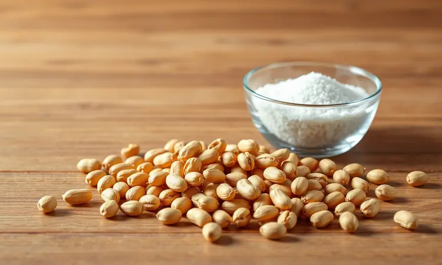
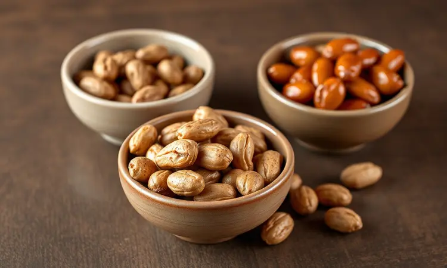

Imagine poder transformar amendoins crus em petiscos crocantes e dourados enquanto prepara o café da manhã. Essa é a magia de usar sua airfryer: em menos de 15 minutos, você tem um snack saudável pronto, sem a ansiedade de esperar quase uma hora no forno convencional.

Neste guia, você vai descobrir não apenas o passo a passo exato, mas todos os truques que transformam amendoins simples em verdadeiras delícias irresistíveis.

<SummaryList products={frontmatter.top_products} />

## Por que torrar amendoim na airfryer é a melhor opção?

A praticidade é o primeiro grande atrativo. Enquanto o forno tradicional exige quase uma hora, sua airfryer entrega o mesmo resultado em 15 minutos.

Mas a verdadeira revolução está na saúde: a circulação de ar quente cria aquela crocância que você adora, usando pouco ou nenhum óleo. O resultado? Um lanche menos gorduroso que parece ter sido frito.

Imagine a facilidade na limpeza também. Com cestos removíveis e antiaderentes, você praticamente só precisa enxaguar. E o melhor: cada grão fica uniformemente torrado, sem aqueles cantinhos queimados enquanto outros permanecem crus. É eficiência pura, do início ao fim.

## O que você vai precisar: Ingredientes e Utensílios

A beleza desta receita está na simplicidade. Você precisará basicamente de amendoins crus, um pouco de sal para realçar o sabor e, é claro, sua airfryer. Mas vamos além dos óbvios para garantir a perfeição.

### Fritadeira Elétrica (Airfryer)

<ProductBox 
  title={frontmatter.top_products[0].title} 
  image={frontmatter.top_products[0].image} 
  link={frontmatter.top_products[0].link} 
/>

Seja qual for o modelo que você tem na cozinha - das compactas às versões de 12 litros da Philips, Walita ou Mondial - todas compartilham a mesma tecnologia que transforma esta receita.

O segredo está na circulação intensa de ar quente, que envolve cada grão de maneira uniforme. Alguns modelos oferecem funções específicas para torrar, mas mesmo as versões mais básicas entregam resultados incríveis quando você conhece os truques certos.

### Amendoim Cru de Qualidade

<ProductBox 
  title={frontmatter.top_products[1].title} 
  image={frontmatter.top_products[1].image} 
  link={frontmatter.top_products[1].link} 
/>

Aqui está onde a diferença realmente acontece. Escolha amendoins inteiros, com aparência saudável e sem sinais de danos ou umidade excessiva. Um teor acima de 8% de umidade não só prejudica a crocância final, mas pode favorecer o desenvolvimento de fungos.

Preste atenção ao frescor: amendoins de qualidade têm odor característico e cor uniforme. E por segurança, prefira marcas que seguem rigorosos controles de qualidade, especialmente quanto à presença de aflatoxinas.

Pode parecer detalhe, mas é o que separa um snack apenas bom de um que faz você querer repetir toda semana.

## Passo a Passo: Como Torrar Amendoim na Airfryer em 15 Minutos

Agora vamos à prática. O processo é tão simples que você vai se perguntar por que não começou antes.

### 1. Preparando os grãos: Lavar ou não lavar?

Esta decisão depende do que você prioriza. Lavar remove impurezas, mas deixa os grãos úmidos, exigindo uma secagem cuidadosa antes da torra para não comprometer a crocância. Se optar por pular essa etapa, verifique se os amendoins estão realmente limpos.

O importante é que, lavados ou não, estejam completamente secos ao entrarem na airfryer.

### 2. Ajuste de Tempo e Temperatura Ideal

Encontre o ponto mágico: 160°C a 180°C. Esta faixa garante que os amendoins se transformem lentamente, desenvolvendo sabor profundo sem queimar. O tempo varia entre 10 e 15 minutos, dependendo da quantidade.

Comece com 10 minutos e verifique, pois melhor adicionar tempo do que recuperar grãos carbonizados.

### 3. O Segredo do Cesto: A importância de agitar

Aqui está o truque que poucos contam. A cada 5 minutos, agite o cesto vigorosamente. Esta simples ação redistribui o calor, garantindo que todos os lados recebam atenção igual.

É o que transforma uma torra irregular em amendoins perfeitamente dourados, crocantes por igual.

## Como saber o ponto certo: O teste da casca solta

Você não precisa ser um expert para acertar. Quando a casca começa a se soltar facilmente do grão, está no caminho certo. Pressione levemente um amendoim: se ele estalou com uma crocância satisfatória, é hora de parar.

Lembre-se, eles continuam cozinhando um pouco mesmo depois de retirados, então é melhor errar pelo lado do pouco tempo do que pelo excesso.

## Variações de Sabores: Do Salgado ao Doce Crocante

Domina o básico? Agora a diversão começa de verdade. A airfryer é uma tela em branco para sua criatividade.

### Amendoim Temperado com Páprica e Ervas

<ProductBox 
  title={frontmatter.top_products[2].title} 
  image={frontmatter.top_products[2].image} 
  link={frontmatter.top_products[2].link} 
/>

Transforme seu snack em uma experiência gourmet. Misture amendoins crus com azeite ou manteiga derretida, alho picado, páprica defumada e suas ervas favoritas - alecrim e orégano são clássicos que nunca falham. Torre por 15 a 20 minutos a 180°C, agitando regularmente.

O segredo final: salgue enquanto ainda estão quentes, assim o tempero adere perfeitamente.

Para versões doces, experimente mel e canela, ou até um toque de baunilha com açúcar mascavo. A única regra é garantir que os temperos sejam adicionados antes da torra, para que se integrem completamente durante o processo.

## Dicas de Armazenamento para Manter a Crocância por Semanas

<ProductBox 
  title={frontmatter.top_products[3].title} 
  image={frontmatter.top_products[3].image} 
  link={frontmatter.top_products[3].link} 
/>

Nada mais frustrante do que amendoins crocantes que ficam moles em dois dias. A inimiga aqui é a umidade. Use recipientes herméticos e armazene em local fresco e seco, longe da luz solar direita.

Evite abrir o pote repetidamente, pois cada vez que entra ar, entra umidade. Se fizer grande quantidade, considere dividir em porções menores.

E atenção: variações bruscas de temperatura criam condensação dentro do recipiente, então mantenha longe do fogão ou da geladeira.

## Erros Comuns que Deixam o Amendoim Murcho ou Queimado

Vamos evitar as armadilhas que arruínam seu esforço. Primeiro, sempre preaqueça sua airfryer. Parece detalhe, mas começando na temperatura correta, você evita que os amendoins cozinhem em vez de torrar.

Segundo, não ignore a etapa de agitar. É tentador colocar e esquecer, mas aqueles que resistem à tentação são recompensados com uniformidade perfeita. Por fim, respeite os tempos sugeridos.

Cada airfryer tem sua personalidade - comece com menos tempo e ajuste conforme conhece melhor sua máquina.

## FAQ: Perguntas Frequentes sobre Amendoim na Airfryer

Ainda com dúvidas? Estas são as questões que mais ouvimos:

* **É obrigatório pré-aquecer?** Não é obrigatório, mas recomendado para resultados mais consistentes.

* **Posso encher a cesta até a borda?** Não. Deixe espaço para o ar circular, ou terá torra desigual.

* **Quanto tempo dura armazenado?** Em condições ideais, até 3 meses mantendo a crocância.

* **Funciona com amendoim japonês?** Funciona perfeitamente, apenas ajuste o tempo para 8-10 minutos.

* **Preciso adicionar óleo?** Não é necessário, mas uma colher de chá de azeite ajuda temperos a aderirem melhor.

## Conclusão

Do grão cru ao snack crocante em 15 minutos flat. É essa transformação mágica que torna a airfryer indispensável para quem valoriza praticidade sem abrir mão do sabor.

Você não está apenas torrando amendoins, está dominando uma técnica que se aplica a castanhas, sementes e outros petiscos.

Lembre-se: comece com qualidade, respeite os tempos, agite com carinho e armazene com inteligência. Cada lote será melhor que o anterior, até você criar sua receita assinatura. Agora é com você. Que tal começar hoje mesmo?

Sua próxima sessão de cinema em casa merece esses amendoins dourados que só você sabe fazer tão bem.