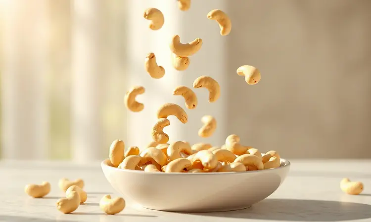
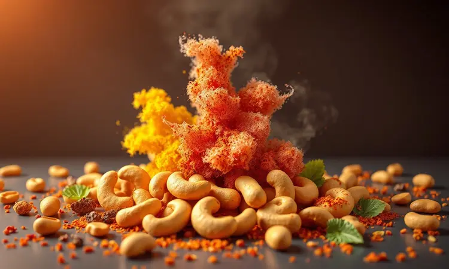
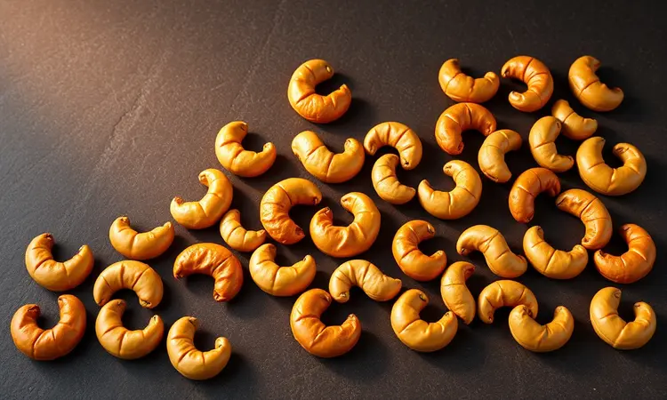

Você já sentiu aquele aroma irresistível de castanhas assadas na hora, mas ficou na dúvida de como reproduzir essa crocância em casa sem queimar? Se busca um lanche saudável, fresco e muito mais econômico que as versões de supermercado, você está no lugar certo.

Neste guia completo, vou te mostrar o passo a passo definitivo para assar castanhas de caju perfeitas usando diferentes métodos, do forno convencional à praticidade da airfryer.

Você vai aprender desde a preparação correta até segredos de temperos que transformarão suas castanhas em um petisco digno de chef.

<SummaryList products={frontmatter.top_products} />

## Por que Assar Castanha de Caju em Casa?

Imagine ter na sua dispensa um lanche 100% personalizado, onde você controla não apenas o sabor, mas também a textura e a frescura. Assar castanha de caju em casa te entrega essa liberdade.

Mais do que economia, você ganha a possibilidade de criar experiências sensoriais únicas, experimentando combinações de temperos que nunca encontraria nas prateleiras do mercado.

É a chance de transformar um ingrediente simples em uma pequena obra-prima gourmet, perfeita para impressionar visitas ou simplesmente se presentear com um momento especial.

## Preparação Inicial: Como Limpar e Escolher as Castanhas

Todo bom resultado começa com matéria-prima de qualidade. Selecione castanhas firmes, com cor uniforme e sem manchas. Observe se estão inteiras, sem rachaduras, sinal de que chegaram até você no ponto ideal de frescor.

Depois da seleção, um rápido enxágue em água corrente remove possíveis impurezas. Evite deixá-las de molho, pois a absorção excessiva de água pode comprometer aquela textura crocante que você tanto busca.

Com esses cuidados simples, você garante que todo o potencial de sabor será explorado no próximo passo.

## Como Assar Castanha de Caju no Forno: O Guia Passo a Passo

<ProductBox 
  title={frontmatter.top_products[0].title} 
  image={frontmatter.top_products[0].image} 
  link={frontmatter.top_products[0].link} 
/>

O forno é o mestre da transformação lenta e controlada. Para começar, pré-aqueça a 180°C, aquela temperatura mágica que trabalha a umidade sem risco de queimar.

Se quiser potencializar o sabor, experimente hidratar as castanhas em água quente com uma pitada de sal por 20 a 30 minutos antes de assar. Esta pequena etapa intensifica o sabor natural.

Espalhe as castanhas em uma única camada na assadeira e leve ao forno por 25 a 40 minutos, mexendo na metade do tempo para garantir um dourado uniforme.

Você saberá que estão prontas quando exalarem aquele aroma tostado irresistível e adquirirem uma cor dourada apetitosa. Para um toque final sofisticado, adicione ervas frescas como alecrim logo após retirar do forno.

## Castanha de Caju na Airfryer: Praticidade em Poucos Minutos

<ProductBox 
  title={frontmatter.top_products[1].title} 
  image={frontmatter.top_products[1].image} 
  link={frontmatter.top_products[1].link} 
/>

Se o forno exige paciência, a airfryer entrega agilidade com resultados igualmente impressionantes. Para castanhas com casca, deixe-as de molho em água quente com sal por cerca de 20 minutos e faça um corte lateral em cada uma, garantindo que assem uniformemente.

Disponha as castanhas no cesto sem sobreposição e programe para 180-200°C por 15 a 20 minutos, mexendo na metade do tempo. Prefere versão sem casca? Tempere-as com azeite, sal e seus condimentos favoritos antes de assar.

O resultado é uma combinação perfeita de crocância externa e maciez interna. Uma dica valiosa: descasque enquanto ainda estão mornas, o processo se torna muito mais fácil.

## Método Tradicional: Como Assar Castanha na Churrasqueira ou na Lata

Para quem busca aquele sabor defumado característico, a churrasqueira ou a lata são opções encantadoras. Aqueça a churrasqueira em temperatura alta e disponha as castanhas em uma grelha ou em uma lata com furos para circulação do ar.

Asse por 15 a 20 minutos, mexendo ocasionalmente até alcançar aquele dourado perfeito que sinaliza ponto ideal. Se optar pela lata, fique atento, pois o tempo pode variar. Ao final, aproveite para personalizar com sal, pimenta ou suas ervas favoritas.

É a maneira perfeita de incorporar as castanhas em momentos de confraternização ao ar livre.

## É possível assar castanha de caju no micro-ondas?

Sim, e a praticidade é o maior atrativo. Espalhe as castanhas em um prato próprio em uma única camada. O tempo varia entre 2 a 5 minutos dependendo da potência do aparelho, mas o segredo está na vigilância constante. Mexa a cada minuto para garantir uniformidade.

Embora o sabor não atinja a profundidade dos métodos tradicionais, é a solução ideal para quem precisa de crocância em questão de minutos, sem comprometer totalmente a qualidade.

## Segredos para a Crocância: Tempo e Temperatura Ideal

A dupla dinâmica que define o sucesso da sua castanha. A faixa de 180°C a 200°C é onde a mágica acontece, tempo suficiente para o sabor se desenvolver, mas controlado para evitar queimaduras.

Inicie com 15 a 20 minutos, sempre mexendo a cada 5 minutos para garantir aquele dourado uniforme que sinaliza perfeição. Cada forno tem sua personalidade, então ajuste conforme observar o comportamento das suas castanhas.

Quando exalarem fragrância tostada e estiverem douradas, é hora de retirar. Lembre-se: ao esfriar, elas ganham crocância extra, então não se preocupe se parecerem levemente macias ao sair do forno.

## Ideias de Temperos: Do Salgado ao Gourmet

Aqui é onde sua criatividade ganha vida. Comece com o clássico sal e pimenta-do-reino, depois explore territórios mais ousados com curry ou páprica defumada. Cada tempero conta uma história diferente no paladar.

### Castanha Perfumada com Curry e Ervas

Dentro das opções gourmet, esta combinação exótica se destaca. Comece torrando as castanhas em frigideira seca até ficarem levemente douradas. Em seguida, adicione uma mistura de curry em pó, sal e ervas frescas como coentro ou salsinha.

Mexa até que cada castanha fique uniformemente revestida com a explosão de sabores. O resultado não é apenas um lanche, mas uma experiência sensorial que funciona como aperitivo sofisticado ou acompanhamento para saladas criativas.

### Versão Doce: Castanhas Caramelizadas com Canela

Para momentos que pedem doçura, esta versão é irresistível. Torre as castanhas até obter um dourado suave. Em panela separada, derreta açúcar até formar caramelo e acrescente canela em pó. Misture as castanhas, envolvendo cada uma no abraço doce e aromático.

Cozinhe por mais alguns minutos com cuidado para não queimar. Ao esfriar, você terá uma textura crocante com sabor que lembra sobremesa, perfeita como snack especial ou complemento para criações doces.

## Como Saber se a Castanha está Pronta? (O Ponto Exato)

O ponto ideal é uma conversa entre olhos, nariz e paladar. Observe a coloração: um dourado uniforme sinaliza perfeição, enquanto tons escuros indicam risco de amargor. Sinta o aroma: quando exala fragrância tostada e convidativa, está no caminho certo.

Por fim, o teste definitivo vem com uma mordida. Deve entregar crocância satisfatória, sem qualquer resquício de umidade ou sabor cru. Uma estratégia inteligente é fazer pequenos lotes teste para calibrar seu equipamento e técnica, garantindo resultados consistentes.

## Armazenamento: Como Manter as Castanhas Crocantes por Semanas

<ProductBox 
  title={frontmatter.top_products[2].title} 
  image={frontmatter.top_products[2].image} 
  link={frontmatter.top_products[2].link} 
/>

Todo esse cuidado merece ser preservado. Para conservação máxima, congele em recipientes herméticos ou sacos próprios, mantendo a crocância por até um ano. Se preferir geladeira, podem durar seis meses com a mesma proteção.

Em temperatura ambiente, escolha locais frescos e secos dentro de potes herméticos, garantindo até um mase de qualidade.

Uma técnica interessante é deixá-las de molho em água com sal antes de uma rápida secagem no forno, realçando ainda mais o sabor antes do armazenamento. Assim, você sempre terá seu lanche crocante pronto para qualquer ocasião.

## Perguntas Frequentes sobre Assar Castanhas de Caju

A jornada para dominar as castanhas perfeitas traz dúvidas naturais. A temperatura ideal gira em torno de 160°C a 180°C, suficiente para crocância sem risco de queimar. O tempo varia entre 10 a 20 minutos, dependendo do tamanho das castanhas e do método escolhido.

Sobre temperos, além do clássico sal, explore especiarias como páprica e curry para transformar o simples em gourmet. A verdadeira beleza está em experimentar, ajustar e fazer do processo uma expressão do seu gosto pessoal.

## Conclusão

Assar castanha de caju em casa é mais que uma técnica culinária, é um convite à criatividade e ao autocuidado. Você começa com um ingrediente simples e, através de métodos que vão do tradicional ao moderno, transforma-o em um lanche que carrega sua assinatura única.

Cada etapa, da seleção meticulosa das castanhas até a escolha dos temperos, é uma oportunidade de criar algo genuinamente seu. A crocância perfeita, o ponto exato, o armazenamento que preserva seu trabalho, tudo converge para momentos de prazer simples e sofisticado.

Experimente diferentes métodos, ouse nas combinações de sabores e descubra como essa prática pode se tornar um ritual gratificante na sua rotina.

Sua próxima fornada de castanhas não será apenas um lanche, será uma expressão do cuidado que você dedica aos detalhes que tornam a vida mais saborosa.