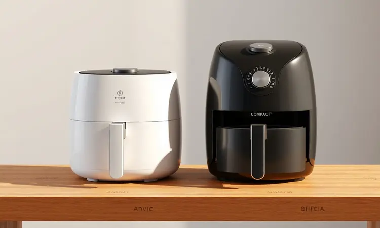

Você já se pegou desejando aquela batata frita bem crocante, mas desistiu só de pensar na sujeira do óleo ou no impacto na sua saúde? Você não está sozinho; a busca por uma alimentação equilibrada sem abrir mão do sabor é o desejo de milhares de brasileiros.

A Arno é uma das pioneiras em fritadeiras sem óleo, mas com tantos modelos disponíveis, a dúvida sobre qual escolher é comum.

Neste guia completo, você vai entender como funciona a tecnologia da marca, descobrir qual capacidade é ideal para sua família e conhecer os melhores modelos para transformar sua rotina na cozinha.

<SummaryList products={frontmatter.top_products} />

## O que é e Como Funciona a Tecnologia de Circulação de Ar da Arno?

Imagine conseguir aquela crocância dourada que só a fritura oferece, mas de dentro para fora. É exatamente isso que a tecnologia de circulação de ar da Arno faz possível.

Ela funciona como um pequeno tornado de ar quente, que circula em alta velocidade dentro da câmara da fritadeira.

Esse movimento constante faz maravilhas: enquanto sela a superfície dos alimentos criando aquela textura crocante que você ama, mantém os sucos naturais presos lá dentro. O resultado?

Batatas, legumes e carnes que desmancham na boca por dentro e estalam por fora, tudo isso usando uma quantidade mínima de óleo (ou nenhuma).

O sistema é tão inteligente que você praticamente programa, aperta um botão, e sai comendo algo que parece ter saído de um restaurante.

## 5 Benefícios Comprovados de Ter uma Air Fryer Arno em Casa

Vamos além da promessa de comida mais saudável. O verdadeiro encanto de ter uma Arno em casa se revela nos pequenos momentos do dia a dia.

### Saúde e Sabor: Redução de até 80% de Gordura

Desfrutar da crocância sem culpa não precisa ser utopia. Com a Air Fryer Arno, você consegue até 80% menos gordura nas suas preparações favoritas. Considere o almoço de domingo: coxinhas crocantes, batatinhas douradas, frango empanado que estala ao morder.

Tudo isso com apenas uma colher de óleo ou menos. A tecnologia de ar quente encapsula o sabor, entregando a experiência completa da fritura tradicional enquanto preserva o que há de melhor nos alimentos.

É o equilíbrio perfeito entre o prazer de comer bem e o cuidado com sua saúde.

### Praticidade no Dia a Dia e Facilidade de Limpeza

Quantas vezes você adiou fazer aquele snack porque imaginou a bagunça depois? A Arno resolve isso com peças removíveis que muitas vezes vão direto para a lava-louças.

O painel de controle intuitivo elimina palpites: você escolhe a receita, ajusta o tempo e temperatura, e segue com seu dia. Enquanto o preparo acontece, você pode cuidar de outras coisas. Terminou?

Basta retirar o cesto antiaderente, dar um enxágue rápido, e está pronto para a próxima aventura culinária. É praticidade que transforma o ato de cozinhar de obrigação em prazer.

### Economia de Energia: Ela Realmente Gastam Muito?

Essa é uma das surpresas mais agradáveis: as Air Fryers consomem significativamente menos energia que fornos convencionais e até mesmo que fritadeiras elétricas tradicionais.

Como o ar quente circula de maneira eficiente, não precisa de tanto tempo para aquecer, nem de temperaturas absurdas. Resultado? Uma conta de luz mais tranquila no final do mês, sem que você precise escolher entre economia e uma refeição deliciosa.

É eficiência que se traduz em benefícios no bolso e na rotina.

## Análise dos Melhores Modelos de Air Fryer Arno

Com tantas opções na prateleira, como saber qual é a sua? Cada modelo tem sua personalidade, e entender isso faz toda diferença na sua satisfação a longo prazo.

### Fritadeira Air Fryer Arno Easy Fry Turbo 6L AFI6

<ProductBox 
  title={frontmatter.top_products[0].title} 
  image={frontmatter.top_products[0].image} 
  link={frontmatter.top_products[0].link} 
/>

Se você tem uma família que sempre recebe amigos ou adora preparar porções generosas para o almoço de domingo, os 6L de capacidade virão a calhar.

A tecnologia Direct Heat aqui é um diferencial que merece elogios: você dispensa o pré-aquecimento, coloca a comida e vê a mágica acontecer. Imagine preparar um pernil inteiro ou uma leva de pães de queijo para a visita sem precisar aquecer o forno por meia hora.

O cesto com compartimento para água mantém suas carnes suculentas, e os 12 programas automáticos são como ter um assistente culinário particular. Atenção apenas à voltagem (1735W para 110V ou 1835W para 220V), pois ela não é bivolt.

### Fritadeira Air Fryer Arno Airfry & Grill Expert 6,5L Inox

<ProductBox 
  title={frontmatter.top_products[1].title} 
  image={frontmatter.top_products[1].image} 
  link={frontmatter.top_products[1].link} 
/>

Para quem deseja um único aparelho que faça tudo, essa é sua escolha.

A função 2 em 1 transforma suas possibilidades: de manhã, bacon crocante; à tarde, legumes grelhados perfeitos para a salada; à noite, frango dourado com aquela marca de grelha que parece de restaurante.

Os 8 programas automáticos cobrem desde snacks rápidos até preparos mais elaborados. Seu tamanho generoso (6,5L) é ideal para famílias, embora exija um cantinho especial na bancada. Mas a versatilitade que você ganha compensa amplamente qualquer concessão de espaço.

### Fritadeira Air Fryer Arno Mega Digital 7,5L Inox

<ProductBox 
  title={frontmatter.top_products[2].title} 
  image={frontmatter.top_products[2].image} 
  link={frontmatter.top_products[2].link} 
/>

Quando falamos em família grande (até 8 pessoas), esse modelo se apresenta como uma solução inteligente. Com 1700W de potência e tecnologia Hot Air, ele transforma a logística do almoço: em vez de fazer porções em sequência, você prepara tudo de uma vez.

O painel digital com 8 programas pré-definidos oferece a segurança de quem está começando e a eficiência de quem já tem experiência.

Sim, ele é maior que a média, mas a economia de tempo (e até 70% de energia comparado a fornos convencionais) cria um equilíbrio que muitos consideram perfeito. A limpeza, graças ao revestimento antiaderente, é uma tarefa de minutos.

### Fritadeira Air Fryer Arno Dual 5,2L+3,1L Inox

<ProductBox 
  title={frontmatter.top_products[3].title} 
  image={frontmatter.top_products[3].image} 
  link={frontmatter.top_products[3].link} 
/>

Imagine cenários como: batatas fritas crocantes no cesto maior enquanto nuggets douram perfeitamente no menor, tudo pronto simultaneamente graças à função Sync.

Essa possibilidade de cozinhar duas preparações distintas ao mesmo tempo redefine a praticidade na cozinha familiar.

Os sete programas pré-definidos no painel digital LED, aliados à faixa de temperatura entre 40°C e 200°C (potência de 1800W), transformam receitas complexas em processos simples.

É verdade que o conjunto dos dois cestos ocupa espaço, mas a liberdade de preparar refeições completas em um único ciclo de cozimento justifica cada centímetro.

## Guia de Compra: Como Escolher o Tamanho Ideal para sua Família

A capacidade da sua Air Fryer deve ser como um convidado perfeito para sua cozinha: nem grande demais a ponto de atrapalhar, nem pequeno de menos para suprir suas necessidades.

### Modelos de 3L a 4L: Ideal para Solteiros e Casais

Para quem vive o ritmo acelerado da vida a dois (ou sozinho), esses modelos são como um parceiro de cozinha discreto e eficiente. Eles cabem em cantinhos da bancada, não dominam o espaço visual, mas ainda assim oferecem o suficiente para uma refeição completa.

Pense em preparar uma porção generosa de batatas rústicas com legumes assados para o jantar, ou nuggets crocantes para um lanche despretensioso.

Com timer e controle de temperatura à disposição, você tem o controle total do resultado final, sem a complexidade de equipamentos maiores.

### Modelos de 5L a 7,5L: O Poder da Alta Capacidade para Famílias Grandes

Esses modelos são os verdadeiros transformadores da rotina familiar. Quando você precisa alimentar três, quatro pessoas ou mais, a capacidade se torna seu maior aliado.

Em vez de fazer batatas fritas em três levas (e ficar esperando entre uma e outra), você prepara tudo de uma vez. A otimização do tempo é tangível: em meia hora, você pode ter frango, legumes e até um acompanhamento pronto simultaneamente.

Para quem adora receber amigos ou tem filhos com apetites de adolescente, essa faixa de capacidade é menos um luxo e mais uma necessidade inteligente.

## Air Fryer Digital vs. Mecânica: Qual Vale Mais a Pena?

Essa escolha diz mais sobre seu estilo na cozinha do que sobre tecnologia pura. As digitais são como ter receitas favoritas programadas: você toca no ícone da batata frita, ajusta o tempo se quiser, e relaxa.

São perfeitas para quem busca previsibilidade e quer resultados consistentes toda vez. As mecânicas, por outro lado, falam uma linguagem universal: gire o botão, espere o clique, comece.

São mais resistentes, com menos componentes eletrônicos que possam apresentar problemas. Se sua cozinha é um laboratório onde você ama improvisar, a mecânica oferece liberdade. Se você valoriza a exatidão e quer reduzir variáveis, a digital é seu caminho.

## Dicas de Especialista para Manter sua Air Fryer como Nova

O cuidado com seu aparelho é simples, mas faz diferença na longevidade. Um pano úmido na superfície externa após o uso já previne o acúmulo de gordura. Prefira utensílios de silicone ou madeira para mexer nos alimentos, evitando arranhar o cesto antiaderente.

E jamais submerja a base elétrica na água; limpe apenas com um pano levemente umedecido.

### Como Limpar o Cesto Antiaderente sem Estragar

A chave está na paciência. Deixe o cesto esfriar completamente (uma hora costuma ser suficiente) antes de começar. Água morna e um detergente suave, com uma esponja macia, resolvem 90% dos casos.

Para aquelas manchas teimosas que insistem em ficar, uma pasta de bicarbonato com um pouquinho de água age como esfoliante gentil, sem agredir o revestimento.

Depois do enxágue, a secagem completa é fundamental: guardar ainda úmido é convite para odores e deterioração do material. Simples assim, seu cesto estará sempre pronto para a próxima aventura.

## Erros Comuns que Você Deve Evitar ao Usar sua Fritadeira

Alguns deslizes podem transformar a experiência de um banquete em uma pequena frustração. O principal? Encher demais o cesto.

Quando os alimentos estão amontoados, o ar não circula direito, e você termina com algumas partes queimadas e outras ainda cruas, como se estivesse preparando duas receitas diferentes ao mesmo tempo.

Outro ponto de atenção é esquecer de virar ou agitar os alimentos na metade do tempo. Essa simples ação garante que cada pedacinho receba seu momento de ouro ao calor.

E não pule o pré-aquecimento quando a receita pedir; são dois minutinhos que fazem toda diferença na crocância final.

## FAQ: Perguntas Frequentes sobre Airfryer Arno

Algumas dúvidas persistem mesmo depois de decidir pela compra. Vamos esclarecer as mais comuns para você começar com o pé direito.

### Qual a Airfryer da Arno mais fácil de limpar?

Os modelos digitais levam vantagem nesse quesito. Seus cestos e bandejas coletoras, com revestimento antiaderente de alta qualidade, praticamente repelem os resíduos.

Muitos são compatíveis com máquina de lavar louças, transformando a limpeza em uma tarefa que você nem precisa pensar.

O design pensado para limpeza, sem cantos difíceis ou frestas minúsculas, faz com que cinco minutos sejam suficientes para deixar tudo pronto para o próximo uso.

### O acabamento em Inox tem vantagens além da estética?

O inox é muito mais que brilho na bancada. É durabilha personificada: resiste a arranhões, não mancha, e mantém sua aparência de novo por anos. Na prática, isso significa fácil limpeza (um pano úmido resolve) e a segurança de que odores não vão ficar impregnados.

Você pode fazer peixe hoje e batata doce amanhã, sem preocupações com sabores cruzados. É investimento em longevidade e paz de espírito.

### Posso colocar formas de silicone ou vidro dentro da Air Fryer?

Sim, e isso amplia seu universo culinário drasticamente. Formas de silicone são perfeitas para muffins, quiches e outras preparações que você não quer que grudem. As de vidro resistente ao calor, como Pyrex, são ideais para assar vegetais ou fazer gratinados.

A única regra de ouro: nunca tampe completamente a circulação de ar. Deixe espaço para que o ar quente dance ao redor da comida, garantindo que o cozimento seja uniforme.

## Conclusão

Escolher uma Air Fryer Arno é mais do que selecionar um eletrodoméstico; é adotar um novo jeito de se relacionar com a comida.

Você recupera o prazer de comer batata frita crocante sem aquele peso na consciência, transforma horas na cozinha em minutos produtivos e descobre que alimentação saudável pode sim ser deliciosa.

Cada modelo oferece uma proposta única: seja a versatilidade do 2 em 1, a capacidade generosa para famílias grandes ou a praticidade de cozinhar duas coisas ao mesmo tempo.

A escolha final vem da sincronia entre suas necessidades reais e o estilo de vida que você quer construir na cozinha. Permita-se experimentar essa transformação; seu paladar (e sua rotina) agradecerão.