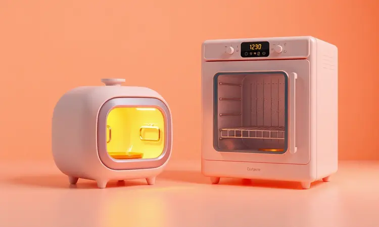
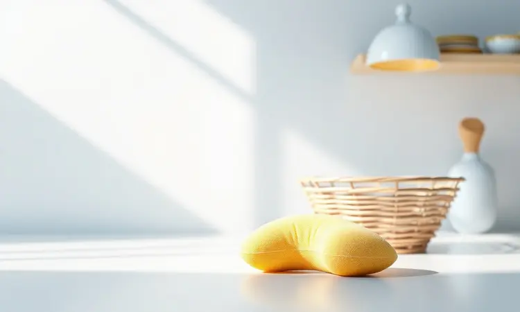

Você já pensou em preparar suas receitas favoritas com até 80% menos gordura sem perder a crocância? As fritadeiras Oster tornaram-se o desejo de consumo de quem busca saúde e praticidade.

Neste guia definitivo, vamos explorar desde os modelos compactos até as potentes Oven Fryers, garantindo que você faça a escolha certa para o tamanho da sua família e suas necessidades culinárias.

Descubra agora as tecnologias exclusivas da marca e aprenda a extrair o máximo de performance do seu aparelho.

<SummaryList products={frontmatter.top_products} />

## Por que escolher uma fritadeira elétrica da marca Oster?

Imagine ter na sua cozinha um eletrodoméstico que não apenas prepara alimentos mais saudáveis, mas também dura anos sem perder sua eficiência. Essa é a proposta da Oster.

A marca construiu sua reputação através de durabilidade que você pode sentir desde o primeiro uso, combinada com inovações que realmente fazem diferença no seu dia a dia.

Ao reduzir drasticamente o uso de óleo, essas fritadeiras entregam aquela crocância que você ama sem o peso na consciência.

Cestos removíveis que facilitam a limpeza, ajustes de temperatura precisos para cada tipo de alimento e um design que se integra naturalmente à sua cozinha são apenas alguns dos detalhes que transformam a experiência. E quando você precisa de ajuda?

O bom suporte ao cliente e garantias sólidas dão aquela segurança extra para investir com tranquilidade.

Para quem busca eficiência que não é apenas um slogan, mas uma realidade prática, as fritadeiras Oster são mais que uma alternativa: são uma escolha que você vai sentir orgulho de ter feito.

## Air Fryer Tradicional vs. Fritadeira Oven: Qual a diferença real?

Depois de entender o que a marca oferece, vem a dúvida prática: qual tecnologia se adapta melhor à sua rotina? A Air Fryer Tradicional é sua aliada quando você precisa de resultados rápidos.

Imagine aquele momento em que os filhos pedem batatas fritas e você quer entregar algo crocante em minutos. A circulação de ar quente intensa cria essa textura quase instantaneamente.

Mas se sua vida culinária é mais diversa, a Fritadeira Oven abre um novo horizonte. Além de fritar, ela assa, grelha e tosta. Pense naquela tarde onde você quer preparar um bolo, grelhar vegetais para o almoço e ainda ter espaço para desidratar algumas frutas.

É como ter um pequeno centro de preparo multifuncional na sua bancada. A Air Fryer é especialista em velocidade; a Oven é sua parceira de versatilidade. A escolha depende de quantas histórias você quer criar na sua cozinha.

## Como escolher a melhor fritadeira Oster: Critérios Essenciais

Com essas duas tecnologias em mente, como você seleciona o modelo perfeito? Não basta apenas comparar números. Você precisa pensar em como cada característica vai impactar sua experiência real na cozinha.

### 1. Capacidade: De 3,2L a 12L, qual atende sua família?

A primeira decisão é sobre espaço. Você é aquela pessoa que prepara porções individuais com cuidado, ou precisa alimentar uma família inteira de uma só vez?

Modelos de 3,2 litros são seus companheiros perfeitos para casais ou quando você quer experimentar uma receita nova sem comprometer grandes quantidades.

Mas quando as crianças crescem e os amigos aparecem para um lanche, a capacidade se torna protagonista. Opções de até 12 litros permitem que você prepare batatas fritas, nuggets e até um pequeno assado simultaneamente.

É a liberdade de não ficar revezando alimentos na cesta enquanto a conversa rola na sala. Considere também o espaço físico na sua bancada. Um modelo maior é um investimento em conveniência, mas precisa de seu lugar próprio.

### 2. Controle de Temperatura e Timer: A precisão no preparo

Você já percebeu que alguns alimentos ficam perfeitos com um certo calor, enquanto outros precisam de mais delicadeza? O controle de temperatura ajustável é seu aliado secreto para essa maestria.

Batatas fritas alcançam a crocância ideal em temperaturas mais altas, enquanto vegetais delicados mantêm seus nutrientes com calor mais moderado.

O timer integrado é seu guardião contra o excesso.

Imagine colocar as batatas para fritar e poder se concentrar em preparar o molho sem aquela ansiedade de "será que já está?" Ele garante que cada receita termine no ponto exato, entregando consistência que transforma sua confiança como chef.

Ter esse controle não é apenas sobre técnica. É sobre criar memórias gastronômicas sem estresse.

### 3. Revestimento Antiaderente e Tecnologia DiamondTech

E depois da festa, vem a parte que muitos temem: a limpeza. O revestimento antiaderente tradicional já ajuda, mas a tecnologia DiamondTech eleva essa experiência. Imagine retirar alimentos da cesta sem aquela luta para desgrudar pequenos pedaços que se agarram.

Essa superfície resistente a riscos significa que você pode usar suas esponjas habituais sem preocupação, e a durabilidade extra garante que essa facilidade permanece por anos.

Além de ser livre de substâncias nocivas, você ganha a tranquilidade de saber que cada preparo é seguro para sua família. É um detalhe que transforma o "depois" da receita em algo quase tão prazeroso quanto o "durante".

### 4. Painel Digital Touch vs. Comandos Analógicos

Finalmente, como você prefere conversar com sua fritadeira? Painéis digitais touch são como ter um assistente inteligente. Pré-programações de tempo e temperatura tornam o processo quase automático para receitas frequentes.

É perfeito para quem valoriza precisão e quer minimizar ajustes.

Comandos analógicos, por outro lado, têm aquela simplicidade intuitiva que dispensa tutorial. Girar um botão e ajustar manualmente pode ser mais natural para quem aprecia o controle físico.

Não é sobre qual é "melhor", é sobre qual dialogo se conecta melhor com seu estilo na cozinha. Alguns adoram a tecnologia avançada; outros preferem a relação direta e tangível.

## Análise dos Melhores Modelos de Fritadeira Oster

Com esses critérios claros, vamos analisar modelos específicos que exemplificam como essas características se materializam em produtos que você pode ter na sua casa.

### Fritadeira Oven Fryer 12L Oster 3 em 1

<ProductBox 
  title={frontmatter.top_products[0].title} 
  image={frontmatter.top_products[0].image} 
  link={frontmatter.top_products[0].link} 
/>

Quando sua família cresce ou seus eventos sociais se tornam mais frequentes, a Oven Fryer 12L surge como uma solução quase completa. Com 1800W de potência, ela responde rapidamente mesmo quando você precisa preparar múltiplos tipos de alimentos simultaneamente.

A capacidade de 12 litros é aquela garantia de que não faltará espaço quando a criatividade culinária aparece.

O verdadeiro diferencial está na combinação de funções: fritadeira, forno e desidratador em um único aparelho.

As nove funções pré-programadas são como ter um livro de receitas básicas integrado, enquanto os modos personalizáveis permitem que você experimente sem limites.

O sistema de rotação 360° é o segredo para um cozimento uniforme que dispensa aquela manipulação constante dos alimentos.

Um ponto importante de atenção é a voltagem: este modelo não é bivolt. Escolha entre 110V ou 220V conforme sua residência. Essa especificação, porém, garante que o aparelho é otimizado para a voltagem selecionada, entregando performance consistente.

O painel digital touch e a porta transparente completam a experiência, permitindo que você monitore o progresso sem interromper o processo. É para quem não quer limites na sua expressão culinária.

### Fritadeira Digital Inox Oster 5L com Painel Touch

<ProductBox 
  title={frontmatter.top_products[1].title} 
  image={frontmatter.top_products[1].image} 
  link={frontmatter.top_products[1].link} 
/>

Para quem busca equilíbrio entre capacidade e elegância visual, esta fritadeira de 5 litros apresenta um design em aço inox que não apenas dura, mas também adorna sua cozinha com um acabamento premium.

Atende famílias pequenas a médias ou aqueles momentos onde você quer preparar uma quantidade generosa para aproveitar depois.

O painel touch colorido transforma ajustes de temperatura (entre 80°C e 200°C) e tempo em uma experiência visual intuitiva. A potência de 1700W significa que o aquecimento é rápido, entregando aquela crocância que parece impossível sem óleo abundante.

A grelha "Easy Clean" antiaderente é aquele detalhe que você aprecia depois de usar, quando a limpeza se torna uma tarefa simples.

É verdade que seu preço pode ser superior a modelos mais básicos, e alguns usuários mencionam que o cabo de energia é um pouco curto.

Mas se você valoriza não apenas função, mas também estética e interface amigável, essa é uma escolha que unifica eficiência com apresentação.

### Fritadeira Inox DiamondTech Oster 7,5L com Visor

<ProductBox 
  title={frontmatter.top_products[2].title} 
  image={frontmatter.top_products[2].image} 
  link={frontmatter.top_products[2].link} 
/>

Quando você precisa de capacidade generosa mas também de monitoramento constante, este modelo de 7,5 litros oferece um visor removível que é uma pequena revolução. Permite verificar o progresso dos alimentos sem abrir a fritadeira e perder calor.

Serve bem desde preparos individuais até demandas familiares maiores.

A tecnologia DiamondTech aqui não é apenas um nome. É a sensação prática de alimentos que não grudam e uma limpeza que se resolve com um passe rápido.

O painel touch com 10 funções pré-programadas simplifica escolhas para receitas comuns, enquanto a faixa de temperatura de 80°C a 200°C dá espaço para toda sua experimentação.

Por ser um pouco volumosa, ela demanda um espaço dedicado na bancada. Mas esse "tamanho" é também sua promessa de capacidade. Para quem não quer negociar funcionalidade, é uma opção robusta que cumpre suas promessas com consistência.

### Fritadeira Ultra Digital 2 em 1 Inox 4,8L Oster

<ProductBox 
  title={frontmatter.top_products[3].title} 
  image={frontmatter.top_products[3].image} 
  link={frontmatter.top_products[3].link} 
/>

Para quem busca diversidade funcional em um formato moderado, a Ultra Digital 2 em 1 modelo OFRT660 é uma proposta interessante. Com 4,8 litros, equilibra bem preparos familiares sem ocupar espaço excessivo.

Sua tecnologia 2 em 1 significa que você pode fritar sem óleo e também desidratar alimentos, ampliando seu repertório culinário além da fritura tradicional.

O painel digital intuitivo com oito funções pré-programadas é seu guia para receitas básicas, enquanto ajustes de temperatura de 40°C a 200°C permitem desde desidratação delicada até fritura intensa.

O design em aço inoxidável não só facilita a limpeza, mas também adiciona um elemento de sofisticação ao seu ambiente.

Com potência de 1500W, o preparo é rápido e eficiente. Como outros modelos Oster, não é bivolt, exigindo escolha entre 127V ou 220V conforme sua instalação elétrica.

Se você busca eficiência compacta com um toque de estilo e funções extras, essa fritadeira pode ser sua companheira de experimentações saudáveis.

## Dicas de Especialista: Como usar sua fritadeira Oster corretamente

Para extrair o máximo da sua fritadeira, comece sempre pré-aquecendo alguns minutos. Essa prática simples é a chave para aquela crocância perfeita que parece impossível sem óleo. Evite sobrecarregar a cesta.

Quando os alimentos estão muito compactos, o ar quente não circula adequadamente, resultando em partes mais cozidas e outras menos.

Um pouco de óleo em spray ou uma leve pincelada nos alimentos pode transformar textura e sabor, criando aquela sensação de fritura tradicional sem os excessos.

E após o uso, a limpeza regular seguindo o manual mantém não apenas a aparência, mas também a performance duradoura. São cuidados simples que multiplicam os resultados.

## Passo a passo para limpar sua Air Fryer sem danificar o cesto

A limpeza adequada preserva tanto a saúde das suas refeições quanto a vida do aparelho. Comece sempre desligando e desconectando, esperando que esfrie completamente. Remova o cesto e a bandeja se existir.

Use água morna com detergente suave e uma esponja macia. Para manchas resistentes, uma pasta de bicarbonato de sódio e água aplicada nas áreas problemáticas resolve sem agressividade. Nunca recorra a produtos abrasivos ou esponjas de aço.

Esses materiais podem comprometer o revestimento que é fundamental para o desempenho.

Depois da limpeza, enxágue bem e seque completamente antes de recolocar. Essa atenção garante que sua fritadeira continue entregando resultados saborosos e consistentes por muitos usos.

## Erros comuns que diminuem a vida útil da sua fritadeira elétrica

A praticidade das fritadeiras elétricas pode ser comprometida por pequenos hábitos. Sobrecarregar a cesta frequentemente força o aparelho, causando superaquecimento que diminui sua vida útil progressivamente.

Ignorar as recomendações de limpeza permite que gordura e resíduos se acumulem, afetando não apenas a eficiência, mas também o sabor dos alimentos. Espaço inadequado para circulação de ar é outro erro silencioso. O ar precisa fluir para garantir fritura uniforme.

Usar acessórios incorretos ou deixar partes de molho em líquidos corrosivos pode danificar componentes internos. São detalhes que parecem pequenos, mas somados definem como seu eletrodoméstico vai acompanhar você por anos.

## FAQ: Perguntas Frequentes sobre Fritadeiras Oster

As dúvidas mais frequentes revelam o que realmente importa quando você investe em uma fritadeira Oster. Durabilidade, facilidade de uso e possibilidades culinárias são os temas centrais.

### Onde encontrar assistência técnica e peças de reposição?

Para manter sua fritadeira funcionando plenamente, o site oficial da Oster é seu primeiro ponto de consulta para assistência. Lojas autorizadas e centros de serviço especializados também oferecem suporte direto para produtos da marca.

Peças de reposição podem ser encontradas em plataformas de e-commerce e lojas especializadas em eletrodomésticos. A verificação de fornecedores autorizados é crucial para garantir que as peças mantêm a qualidade original.

É um cuidado que prolonga sua relação com o aparelho.

### Qual a voltagem correta para as fritadeiras Oster?

Fritadeiras Oster geralmente estão disponíveis em 110V e 220V. A escolha correta é fundamental para funcionamento seguro e eficiente. Verifique sempre a tensão elétrica da sua residência antes da compra.

Usar voltagem diferente pode causar sobrecarga ou falhas. Em áreas com eletricidade instável, considerar um estabilizador é uma proteção adicional que preserva o equipamento. É um passo simples que assegura longevidade.

## Conclusão

Escolher uma fritadeira Oster é mais que selecionar um eletrodoméstico. É escolher uma parceira para transformar suas experiências culinárias.

Dos modelos compactos que atendem casais às potentes Oven Fryers que servem famílias e eventos, cada opção carrega a durabilidade e inovação que define a marca.

A tecnologia DiamondTech, os controles precisos de temperatura e timer, e as capacidades adaptadas às suas necessidades são elementos que se traduzem em benefícios tangíveis: menos tempo de limpeza, mais segurança na preparação e aquela crocância saudável que parece magia.

Independente de sua escolha específica, você investe em uma relação que dura. Uma fritadeira que não apenas prepara alimentos, mas também facilita momentos, preserva saúde e se integra naturalmente à sua rotina.

Agora que você conhece os critérios, modelos e cuidados, está pronto para fazer a escolha que vai acompanhar suas receitas por muitos anos. Qual será a história que você vai criar com ela?