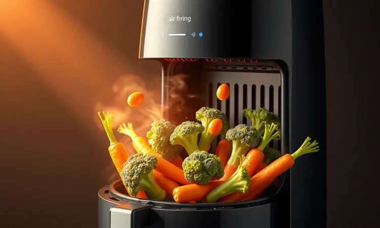
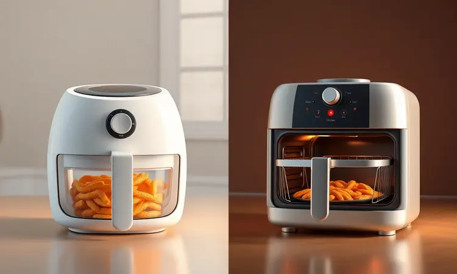
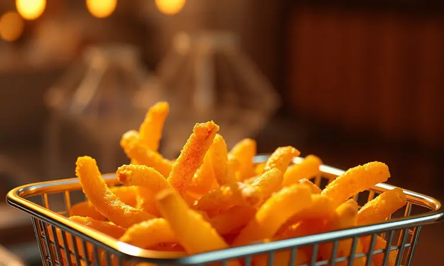

Uma air fryer na cozinha é como ter um pouco de magia ao alcance dos dedos. Ela transforma o ritual de cozinhar em algo que te dá tempo de volta e traz saúde sem abrir mão do sabor.

Se você já se cansou da sujeira do óleo e das manchas de gordura, ou se simplesmente quer chegar em casa e ter um jantar crocante pronto em minutos, sabe que este aparelho não é mais um luxo, mas sim um aliado.

A verdade é que, com tantos modelos, capacidades e tecnologias diferentes, escolher a air fryer certa pode parecer um desafio. Este guia será seu mapa para encontrar exatamente o que você precisa para transformar sua rotina alimentar.

<SummaryList products={frontmatter.top_products} />

## O que é uma Air Fryer e como ela realmente funciona?

Imagine pegar seu frango favorito e, em vez de mergulhá-lo em um mar de óleo, envolvê-lo com um fluxo intenso de ar superaquecido. Essa é a essência da air fryer, ou fritadeira elétrica.

Ela funciona como um mini forno de jato, onde um potente ventilador circula ar quente em alta velocidade, criando aquela casquinha crocante que tanto amamos sem precisar de praticamente nenhuma gordura. É tecnologia que transforma o saudável em irresistível.

Além de fritar, ela pode grelhar, assar e até desidratar, se tornando seu companheiro para tudo, desde uma batata assada simples até aquela sobremesa especial.

## Por que ter uma Air Fryer? Benefícios para Saúde e Economia

Ter uma air fryer é como dar um upgrade na qualidade de vida dentro da sua própria cozinha. Sim, você vai cozinhar com até 80% menos gordura, sentindo aquela paz de espírito de saber que está fazendo um bem enorme para você e sua família.

Mas os benefícios vão muito além da saúde: ela entrega economia de verdade. Pense no fim do mês, ao ver a conta de luz e perceber que você trocou o forno convencional por algo que aquece em segundos e cozinha mais rápido.

É tempo que você ganha para si, é praticidade que chega no seu dia a dia e um dinheirinho que fica no seu bolso.

Você simplesmente prepara mais receitas, testa novos sabores e faz tudo isso sem bagunça, sem cheiro forte e sem aquela sensação pesada que a fritura tradicional deixa.

## Tipos de Air Fryer: Cesto Convencional vs. Modelo Oven

Aqui está a primeira grande decisão: você precisa de algo mais focado ou de uma verdadeira central de cozinha? As air fryers de cesto tradicional são as escolhas clássicas, compactas e diretas ao ponto.

Perfeitas para quem tem uma cozinha menor ou para quem quer aquele crocante perfeito sem ocupar muito espaço. Já o modelo oven é um universo à parte.

Ele é maior, ocupa mais espaço, mas abre um leque de possibilidades que parece infinito: você pode assar um frango de 2kg no espeto rotisserie, grelhar legumes em duas bandejas ao mesmo tempo, ou até fazer seu próprio bacon crocante desidratando.

Uma é a solução elegante, a outra é a transformação completa da sua cozinha.

## O que avaliar antes de comprar sua Air Fryer?

Esta escolha vai muito além de marcar o produto mais bonito na prateleira. É sobre entender como este eletrodoméstico vai se encaixar na sua vida. Você cozinha sozinho ou para uma família de cinco?

Prefere a simplicidade de um botão giratório ou a precisão de um painel digital com programações? Pensa mais na rapidez do cozimento ou na economia de energia? São essas reflexões que vão te guiar para a compra certa. Vamos desvendar cada ponto crucial.

### Capacidade e Litragem: Qual o tamanho ideal para sua família?

Esta é a pergunta que define tudo. Uma air fryer de 2 a 3 litros é sua melhor amiga se você mora sozinho ou em casal, ideal para preparar aquele jantar rápido para dois. Já uma família precisa pensar maior.

De 4 a 6 litros você prepara batatas fritas para todos de uma só vez. Modelos acima de 9 litros, como as oven, transformam o almoço de domingo em algo prático e sem estresse.

Mas lembre-se: cada litro a mais significa mais espaço ocupado na bancada e, geralmente, mais potência exigida da tomada. Avalie sua rotina real, não apenas o desejo de ter a maior de todas.

### Potência: O equilíbrio entre rapidez e consumo de energia

Aqui está o coração da eficiência. Uma air fryer com potência mais alta (acima de 1500W) é como um atleta de alta performance: ela aquece quase instantaneamente e reduz drasticamente o tempo de cozimento.

Para quem chega cansado do trabalho e quer o jantar na mesa em 20 minutos, essa é a escolha. Por outro lado, modelos com potência mais moderada podem ser companheiras mais econômicas no longo prazo, especialmente se você for usar o aparelho todos os dias.

Não existe certo ou errado, apenas o equilíbrio que faz sentido para o seu ritmo e seu orçamento.

### Diferenciais que Facilitam: Visor Glass e Revestimento Redstone

Alguns detalhes transformam a experiência de uso de funcional para verdadeiramente prazerosa. O visor em vidro, por exemplo, é um daqueles luxos que você só percebe o valor quando tem.

Ele permite que você veja seu frango dourando ou suas batatas ficando crocantes sem precisar abrir a tampa e interromper o fluxo de calor. É controle total sobre o ponto perfeito.

Já o revestimento Redstone ou cerâmico antiaderente é a promessa de uma limpeza que leva segundos, não minutos. A comida simplesmente não gruda, e você passa um pano úmido e pronto.

São essas pequenas coisas que fazem você usar o aparelho todos os dias, sem pensar duas vezes.

## Melhores Modelos de Air Fryer para Diferentes Perfis

Depois de entender o que buscar, chegou a hora de conhecer os protagonistas do mercado. Cada modelo abaixo foi escolhido para representar uma necessidade específica, mostrando como as características que discutimos se materializam em produtos reais.

### Air Fryer Oven Philco 12L Digital Rotisserie PFR2200P

<ProductBox 
  title={frontmatter.top_products[0].title} 
  image={frontmatter.top_products[0].image} 
  link={frontmatter.top_products[0].link} 
/>

Se você sonha em substituir o forno convencional de vez, esta é a candidata perfeita.

Com seus 12 litros, a Philco PFR2200P é uma verdadeira cozinheira versátil: frita, assa, reaquece e ainda tem uma função desidratar que opera em temperaturas tão baixas quanto 30°C, perfeita para fazer chips de frutas ou carne seca caseira.

O painel digital touch é intuitivo e vem com 9 programas pré-definidos que tiram as adivinhações do cozimento. Um ponto de atenção é o cesto interno de 3,5 litros, menor que a capacidade total, mas que é compensado pela possibilidade de usar duas grelhas ao mesmo tempo.

Ela é para quem quer uma estação de trabalho completa na bancada.

### Air Fryer Philco 5,5L Revestimento Redstone PAF55B

<ProductBox 
  title={frontmatter.top_products[1].title} 
  image={frontmatter.top_products[1].image} 
  link={frontmatter.top_products[1].link} 
/>

Para a família que busca equilíbrio entre tamanho, potência e simplicidade, este modelo é um clássico certeiro. Com 5,5 litros, ela prepara porções generosas para todos à mesa, e sua tecnologia Air Flow 360° garante que cada pedaço fique igualmente crocante.

Os 1500W de potência entregam rapidez sem exageros no consumo. O grande destaque aqui está no revestimento antiaderente da cuba e do cesto, que são até laváveis na máquina de lavar louça.

Seu painel é mecânico, um retorno ao básico que funciona perfeitamente para quem não quer lidar com telas complicadas. É eficiência pura, sem firulas.

### Air Fryer Philco 9,5L Visor Glass Redstone PAF95A

<ProductBox 
  title={frontmatter.top_products[2].title} 
  image={frontmatter.top_products[2].image} 
  link={frontmatter.top_products[2].link} 
/>

Imagine poder cozinhar para uma família grande ou receber amigos sem precisar abrir o forno convencional nem uma vez. Essa é a proposta da Philco PAF95A. Com um cesto quadrado de 9,5 litros e potência de 1800W, ela tem força bruta e espaço de sobra.

O visor glass é o seu olho mágico para o cozimento, e o painel digital com 8 funções pré-programadas transforma qualquer receita em algo simples. A temperatura ajustável até 200°C e o timer de 60 minutos cobrem praticamente todas as necessidades.

É um aparelho que exige seu espaço na bancada, mas devolve em versatilidade e capacidade.

### Air Fryer Kitchen Art 16L 4 em 1 com Espeto Rotisserie

<ProductBox 
  title={frontmatter.top_products[3].title} 
  image={frontmatter.top_products[3].image} 
  link={frontmatter.top_products[3].link} 
/>

Quando o assunto é preparar uma festa ou um almoço especial, nenhum outro modelo chega perto da Kitchen Art 16L. Esta é a rainha das air fryers oven, com espaço suficiente para assar um frango inteiro de 2kg no espeto rotisserie que gira automaticamente.

São 16 litros de pura versatilidade, combinando fritura, assado, reaquecimento e desidratação em um único aparelho. Os 2000W de potência garantem que tudo fique pronto rapidamente, embora isso se reflita no consumo energético.

Se você precisa de um verdadeiro centro de cozinha multifuncional, esta é sua opção definitiva.

### Air Fryer Philco 4L Compacta Revestimento Redstone PAF40A

<ProductBox 
  title={frontmatter.top_products[4].title} 
  image={frontmatter.top_products[4].image} 
  link={frontmatter.top_products[4].link} 
/>

Para apartamentos pequenos, casais ou quem busca uma segunda air fryer para o escritório, a Philco PAF40A é a escolha inteligente.

Com 4 litros e 1500W, ela tem o tamanho perfeito para não dominar a bancada, mas ainda assim prepara refeições completas para até 4 pessoas. O visor em vidro permite monitorar o cozimento, e o revestimento antiaderente promete uma limpeza rápida e fácil.

É importante verificar se o modelo é 110V ou 220V conforme sua tomada, mas além disso, ela entrega tudo que você precisa: praticidade, economia de espaço e resultados consistentes.

## Dicas de Especialista: Como garantir a crocância perfeita

Você já escolheu sua air fryer, mas como extrair dela o máximo de crocância? O segredo está em alguns truques simples. Primeiro, sempre pré-aqueça o aparelho por 3-5 minutos. É como aquecer uma frigideira antes de colocar a comida, criando a crosta imediatamente.

Segundo, seque muito bem seus alimentos. Um frango ou batata úmidos vão cozinhar no vapor em vez de fritar. Pouco óleo em spray ajuda, mas evite encharcar. Terceiro, nunca sobrecarregue a cesta.

Deixe espaço para o ar circular livremente e vire os alimentos na metade do tempo para um dourado uniforme. Esses detalhes fazem toda a diferença entre um alimento bom e um sensacional.

## Manutenção e Limpeza: Como prolongar a vida útil do antiaderente

A beleza do revestimento antiaderente é que, se bem cuidado, ele dura anos mantendo sua eficiência. O ritual pós-uso é simples: deixe o aparelho esfriar completamente antes de lavar.

Use apenas esponjas macias e detergente neutro, evitando produtos abrasivos que arranham a superfície. Utensílios de silicone ou madeira são seus melhores amigos para mexer os alimentos.

Para uma limpeza mais profunda, mergulhe a cesta em água morna com sabão por alguns minutos e a sujeira simplesmente solta. Esses 5 minutos de cuidado garantem que sua air fryer funcione como nova por muito, muito tempo.

## Erros comuns que você deve evitar ao usar sua Air Fryer

Mesmo com o melhor equipamento, alguns deslizes podem comprometer o resultado. O erro número um é pular o pré-aquecimento, resultando em alimentos cozidos de forma desigual.

O segundo é a tentação de encher a cesta até a borda, limitando a circulação do ar e criando áreas úmidas e moles. O terceiro é tratar todos os alimentos da mesma forma: batata frita e frango não precisam da mesma temperatura e tempo.

E por último, aquela ansiedade de abrir a tampa a cada minuto para ver como está, o que faz o calor escapar. Resista! Confie no timer e prepare-se para se surpreender quando abrir e encontrar tudo perfeitamente dourado.

## Perguntas Frequentes (FAQ)

### Air Fryer gasta muita energia elétrica?

Comparada com um forno convencional, a air fryer é bastante econômica. Isso acontece porque ela aquece rapidamente e cozinha os alimentos em menos tempo, além de ter uma cavidade menor para aquecer.

O consumo varia de modelo para modelo (normalmente entre 1.200W e 1.800W), mas para otimizar ainda mais, você pode preparar porções maiores de uma vez e evitar abrir a tampa durante o cozimento.

No fim, ela gasta menos para fazer a mesma refeição do que um forno tradicional.

### Precisa colocar óleo na Air Fryer?

A beleza da air fryer está justamente na liberdade de escolha. Você pode cozinhar absolutamente tudo sem óleo e ainda ter alimentos crocantes, graças à circulação intensa do ar quente.

No entanto, usar uma quantidade mínima (uma colher de sopa ou um spray rápido) pode elevar a experiência a outro nível, deixando a textura ainda mais próxima da fritura tradicional e realçando os sabores.

É um equilíbrio perfeito: sabor intenso com uma fração da gordura.

## Conclusão

Escolher sua air fryer é mais do que comprar um eletrodoméstico, é investir em um novo estilo de vida na cozinha.

É a promessa de refeições mais saudáveis que não sacrificam o sabor, de minutos preciosos economizados no preparo dos alimentos e de uma cozinha mais limpa e organizada.

Este guio te levou desde os princípios básicos do funcionamento até as características específicas que fazem cada modelo único.

Agora você tem todas as ferramentas para decidir: prefere a simplicidade elegante de uma air fryer de cesto compacta ou a versatilidade completa de um modelo oven para transformar completamente sua rotina culinária?

Independente da escolha, você está dando o primeiro passo para uma relação mais prazerosa, prática e saudável com a comida. Sua cozinha nunca mais será a mesma.