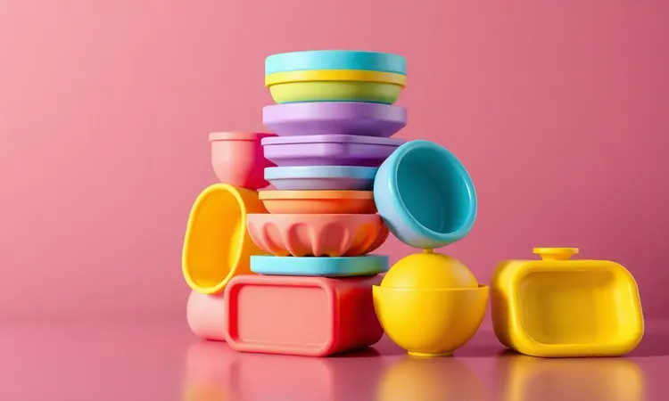
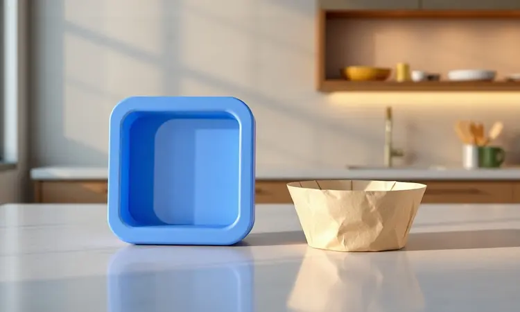
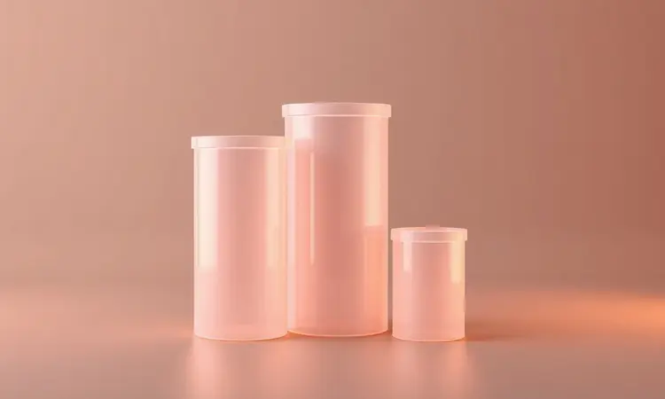

Você já sentiu aquela frustração ao tentar limpar o cesto da sua airfryer depois de preparar algo que grudou? Aquela crosta que parece ter se fundido com o antiaderente, exigindo esfregões que dão vontade de desistir?

Pois é exatamente essa dor que as formas de silicone vieram para aliviar. Mas será que elas são só uma muleta para preguiçosos ou realmente transformam a experiência de cozinhar?

Vamos além da propaganda para descobrir como escolher o tamanho perfeito para seu modelo, manter a saúde do seu aparelho e, o mais importante, como elas podem fazer você redescobrir o prazer de cozinhar sem aquele trabalho chato depois.

Prepare-se para transformar seu relacionamento com a cozinha prática!

<SummaryList products={frontmatter.top_products} />

## O que é e para que serve a forma de silicone para airfryer?

Imagine uma capa protetora que se adapta perfeitamente ao cesto da sua airfryer. Não é magia, é silicone de grau alimentício projetado para criar uma barreira entre seus alimentos e o equipamento.

Mais do que evitar que a comida grude, ela funciona como uma segunda pele que distribui o calor de forma uniforme, garantindo que seus bolos cresçam por igual e seus vegetais fiquem crocantes em todos os lados.

A verdadeira mágica acontece depois: em vez de passar minutos esfregando o cesto, você simplesmente vira a forma flexível, os resíduos soltam como mágica, e uma lavada rápida resolve tudo.

É como ter um ajudante invisível na cozinha que cuida da parte chata para você se concentrar no sabor.

## Principais vantagens de usar acessórios de silicone na fritadeira

Quando você entende o alívio que uma forma de silicone proporciona, começa a perceber que os benefícios vão muito além da simples limpeza fácil. São três transformações principais que acontecem na sua rotina culinária.

### 1. Facilidade extrema na limpeza e proteção do antiaderente

Pense na última vez que preparou algo com queijo derretido ou molho pegajoso na airfryer. Lembra do trabalho para remover aqueles resíduos que pareciam ter virado parte permanente do cesto? Com a forma de silicone, essa cena desaparece.

O material antiaderente natural faz com que até os alimentos mais grudentos se soltem com um leve toque.

Mas o verdadeiro tesouro está no que você não vê: enquanto a forma recebe todo o desgaste, o revestimento original da sua airfryer permanece intacto, preservando seu investimento por anos.

É como colocar um protetor de tela num celular novo, você mantém o equipamento como novo enquanto usa sem medo.

### 2. Versatilidade: do cesto para o micro-ondas e freezer

Aqui está onde o silicone mostra sua personalidade multifuncional. A mesma forma que acabou de sair da airfryer com um bolo quentinho pode ir direto para o micro-ondas para aquecer o almoço do dia seguinte. Precisa congelar porções individuais?

Ele aguenta o freezer sem rachar. Essa adaptabilidade significa que você não precisa ter um arsenal de utensílios diferentes para cada função.

A flexibilidade do material vai além da resistência térmica, ela permite que você desenforme alimentos delicados sem quebrá-los, como muffins que mantêm seu formato perfeito ou tortas que saem inteiras para a mesa.

### 3. Economia e sustentabilidade em comparação aos descartáveis

Faça uma conta simples: quantas folhas de papel manteiga ou formas de alumínio descartáveis você usa por mês? Agora multiplique pelo custo mensal e depois pelo ano todo.

As formas de silicone representam um investimento inicial que se paga rapidamente, eliminando a necessidade constante de reposição.

Mas o benefício mais profundo é o ambiental: enquanto cada forma descartável vai para o lixo após um único uso, o silicone pode ser reutilizado centenas de vezes, reduzindo drasticamente seu lixo doméstico.

É uma daquelas pequenas mudanças que, multiplicada por milhares de cozinhas, faz uma diferença real no planeta.

## Forma de Silicone vs. Papel Descartável: Qual escolher?

A escolha entre silicone e papel descartável revela muito sobre como você enxerga sua rotina na cozinha. O papel oferece a conveniência do "use e jogue fora", perfeito para aqueles dias corridos onde cada minuto conta.

Mas essa praticidade tem um preço: além do custo recorrente e do impacto ambiental, algumas receitas não funcionam bem com papel que pode queimar nas bordas ou impedir a circulação adequada do ar.

O silicone, por outro lado, pede um compromisso inicial. Você precisa lavá-lo (embora seja muito mais fácil do que limpar o cesto direto), armazená-lo e cuidar para que dure.

Em troca, ganha versatilidade incomparável, pode fazer desde cupcakes delicados até lasanhas altas que nunca caberiam em formas de papel. A sustentabilidade entra como bônus emocional: há uma satisfação genuína em saber que você está cozinhando de forma mais consciente.

No fim, a decisão depende do que você valoriza mais: a praticidade imediata ou a eficiência a longo prazo com um toque de consciência ecológica.

## Como escolher o tamanho ideal da forma para a sua airfryer (Guia de Litros)

Comprar uma forma que não se encaixa na sua airfryer é como calçar um sapato apertado, funciona, mas a experiência é sempre desconfortável.

O segredo está em deixar cerca de 20% de espaço livre ao redor da forma para que o ar quente circule adequadamente, garantindo que seus alimentos cozinhem uniformemente em vez de ficarem com partes cruas e outras queimadas.

### Modelos para airfryer de 3L a 4L (Pequenas e Médias)

<ProductBox 
  title={frontmatter.top_products[0].title} 
  image={frontmatter.top_products[0].image} 
  link={frontmatter.top_products[0].link} 
/>

Para essas airfryers compactas, pense em formas que são como bons amigos de apartamento pequeno: versáteis e que sabem aproveitar cada centímetro.

Diâmetros entre 16cm e 21cm funcionam como uma luva, permitindo que você prepare desde porções individuais até pequenos bolos para duas pessoas.

A beleza desses tamanhos está na possibilidade de usar kits com múltiplas formas menores, imagine assar seis cupcakes perfeitos ao mesmo tempo, cada um em seu compartimento individual, sem que as massas se misturem.

A única atenção necessária é verificar as medidas exatas do seu modelo específico, já que alguns cestos podem ter formatos ligeiramente diferentes.

### Modelos para airfryer de 5L a 8L (Grandes e Família)

<ProductBox 
  title={frontmatter.top_products[1].title} 
  image={frontmatter.top_products[1].image} 
  link={frontmatter.top_products[1].link} 
/>

Aqui é onde o silicone mostra sua capacidade de alimentar multidões. Com diâmetros que variam de 20cm a 26cm, essas formas transformam sua airfryer em um pequeno forno elétrico versátil.

Pense em preparar um bolo redondo para o aniversário do seu filho, uma torta salgada para o almoço de domingo ou camadas de legumes para assar simultaneamente.

A única limitação prática é a altura, muitas formas têm cerca de 5cm a 6,5cm, então receitas que precisam crescer muito (como pães fofos) podem encontrar um teto.

Mas para a maioria dos preparos do dia a dia, é espaço mais que suficiente para criar refeições completas e saborosas.

## Melhores formatos de formas de silicone por categoria

Assim como panelas diferentes servem para preparos distintos, cada formato de forma de silicone tem sua personalidade culinária. Escolher o formato certo é metade do caminho para receitas perfeitas.

### Forma de silicone redonda com alças

<ProductBox 
  title={frontmatter.top_products[2].title} 
  image={frontmatter.top_products[2].image} 
  link={frontmatter.top_products[2].link} 
/>

A clássica redonda com alças laterais é a versátil das versáteis. Perfeita para bolos que precisam crescer uniformemente (sem cantos que assam mais rápido), ela também funciona maravilhosamente para fritar ovos, preparar tortas e até assar vegetais inteiros.

As alças não são um detalhe estético, são sua garantia de segurança ao manusear uma forma quente direto da airfryer. Imagine segurar firmemente essas alças para retirar um bolo de cenoura perfumoso sem risco de queimaduras ou acidentes.

A variedade de tamanhos permite que você escolha exatamente o que cabe na sua airfryer, transformando cada preparo em uma experiência segura e sem estresse.

### Forma de silicone quadrada para cestos específicos

<ProductBox 
  title={frontmatter.top_products[3].title} 
  image={frontmatter.top_products[3].image} 
  link={frontmatter.top_products[3].link} 
/>

Se sua airfryer tem um cesto quadrado ou retangular, essa forma é como a peça que faltava no quebra-cabeça. Ela aproveita cada centímetro disponível, permitindo que você prepare porções generosas de lasanha, nhoque assado ou até mesmo brownies densos.

A geometria quadrada distribui o calor de maneira especialmente uniforme, garantindo que todos os pedaços fiquem igualmente crocantes ou macios.

Muitos modelos incluem divisórias internas removíveis, você pode fazer quatro porções individuais de gratinado ou uma única grande receita, conforme a necessidade do dia. É o tipo de versatilidade que faz você se perguntar como vivia sem isso.

### Kit de formas de silicone para cupcakes e muffins

<ProductBox 
  title={frontmatter.top_products[4].title} 
  image={frontmatter.top_products[4].image} 
  link={frontmatter.top_products[4].link} 
/>

Aqui está a solução para quem ama apresentação impecável. Em vez de cupcakes que grudam nas forminhas de papel ou muffins que ficam deformados, cada unidade mantém seu formato perfeito, com aquela cor dourada uniforme que parece saída de padaria gourmet.

A vantagem mais subestimada? Você pode preparar sabores diferentes simultaneamente, dois cupcakes de chocolate, dois de baunilha e dois com gotas de chocolate, todos na mesma fornada, sem que os sabores se contaminem.

Para famílias com preferências diversas ou para quem gosta de variedade, é uma funcionalidade que transforma o café da manhã ou o lanche da tarde em uma pequena celebração.

## O silicone na airfryer faz mal à saúde? Mitos e Verdades

O medo de que o silicone libere toxinas quando aquecido é compreensível, mas baseado em desinformação.

O silicone de grau alimentício (aquele certificado para contato com comida) é quimicamente inerte, isso significa que não reage com alimentos nem libera compostos, mesmo quando submetido a temperaturas que variam de -40°C a 230°C.

Pense no silicone como o vidro temperado: estável, não poroso e seguro.

A verdadeira preocupação deveria ser com produtos falsificados ou de qualidade duvidosa que se passam por silicone alimentício.

A solução é simples: compre de marcas reconhecidas, verifique se há certificações de segurança (como o selo da ANVISA no Brasil) e evite produtos com cheiro forte de plástico.

Quando você escolhe silicone de qualidade, está optando por um material que não apenas é seguro, mas também mais durável e eficiente que muitas alternativas metálicas revestidas.

## A forma de silicone atrapalha o cozimento? Dicas de ajuste de tempo

O silicone cozinha de forma diferente, não pior. Como ele aquece e resfria mais lentamente que o metal, pode ser que suas receitas precisem de 5 a 10 minutos extras para atingirem o ponto perfeito.

Mas essa característica tem um lado positivo: a distribuição de calor mais uniforme evita que as bordas queimem enquanto o centro fica cru.

A dica de ouro? Na primeira vez que fizer uma receita, verifique alguns minutos antes do tempo habitual. Use um palito para testar bolos, corte um vegetal para ver o interior, ou simplesmente observe a cor e textura.

Anote quanto tempo adicional foi necessário, logo você desenvolverá um "feeling" para seus ajustes pessoais. E não pule o pré-aquecimento!

Colocar a forma numa airfryer já quente faz toda a diferença na textura final, especialmente para assados que precisam crescer rapidamente.

## Cuidados essenciais: Como limpar e tirar o cheiro de gordura do silicone

Cuidar da sua forma de silicone é mais simples do que parece, mas alguns hábitos fazem toda a diferença na longevidade. Após o uso, deixe esfriar completamente antes de lavar, o choque térmico pode deformar o material.

Use água morna e sabão neutro com uma esponja macia; aquelas esponjas abrasivas são inimigas do silicone, criando micro-ranhuras onde resíduos e odores se acumulam.

Se notar aquele cheiro persistente de gordura que parece impregnado, a solução está na sua despensa: uma mistura de partes iguais de água e vinagre branco.

Deixe a forma de molho por 30 minutos, lave normalmente e seque ao ar livre (não use secador ou coloque próximo a fontes de calor direto).

Uma vez por mês, você pode "desinfetar" colocando a forma vazia na airfryer por 10 minutos a 100°C, isso ajuda a eliminar quaisquer odores residuais.

Com esses cuidados simples, sua forma mantém suas propriedades antiaderentes por anos, sempre pronta para o próximo preparo.

## Perguntas Frequentes (FAQ)

### Posso colocar qualquer forma de silicone na airfryer?

Aqui está a regra de ouro: silicone alimentício com resistência térmica declarada. Formas de silicone genéricas (daquelas para artesanato ou não especificadas para alimentos) podem não aguentar as altas temperaturas da airfryer ou liberar compostos indesejados.

Sempre verifique na embalagem ou descrição do produto a temperatura máxima suportada, idealmente 230°C ou mais.

Outro detalhe prático: formas muito finas e flexíveis podem não oferecer suporte adequado para massas líquidas, enquanto as mais rígidas mantêm seu formato melhor durante o manuseio.

### Preciso untar a forma de silicone antes de usar?

Na maioria dos casos, não. A beleza do silicone está justamente em sua antiaderência natural. Mas existem duas exceções inteligentes: massas muito açucaradas (como certos tipos de bolo) que tendem a caramelizar e grudar, e preparos com queijos muito derretidos.

Nesses cenários, uma leve camada de óleo em spray ou uma pincelada de manteiga derretida age como garantia extra, é como colocar cinto e suspensórios. Para o dia a dia comum, confie no material e descubra a liberdade de desenformar sem esforço.

## Conclusão

No final da nossa jornada, fica claro que a forma de silicone para airfryer é muito mais que um simples acessório, é um transformador de hábitos culinários.

Ela pega o maior ponto de dor no uso da airfryer (aquela limpeza demorada e frustrante) e o transforma em uma tarefa de segundos.

Mas os benefícios vão além da praticidade: ao proteger o revestimento original do seu equipamento, ela prolonga sua vida útil; ao substituir descartáveis, reduz seu impacto ambiental; e ao oferecer versatilidade de formatos, expande seu repertório de receitas.

A escolha do tamanho certo para sua airfryer e os cuidados simples de manutenção garantem que esse investimento se pague rapidamente, tanto em economia financeira quanto em tempo economizado.

E quanto à segurança, desde que você opte por silicone de grau alimentício de qualidade, pode usar com tranquilidade, sabendo que está preparando alimentos saudáveis para você e sua família.

O que começa como uma solução para um problema específico ("não quero mais limpar esse cesto chato") acaba se revelando um aliado que transforma sua relação com a cozinha prática.

De repente, usar a airfryer deixa de ser uma decisão ponderada ("será que vale a pena a limpeza depois?") e vira um impulso natural ("vou preparar algo rápido e delicioso").

É essa transformação silenciosa, de obrigação para prazer, que faz da forma de silicone não um gasto, mas um dos melhores investimentos para quem busca praticidade sem abrir mão do sabor e da qualidade.

Sua próxima receita favorita está esperando para ser descoberta, sem nenhum resíduo grudado no fundo do cesto.