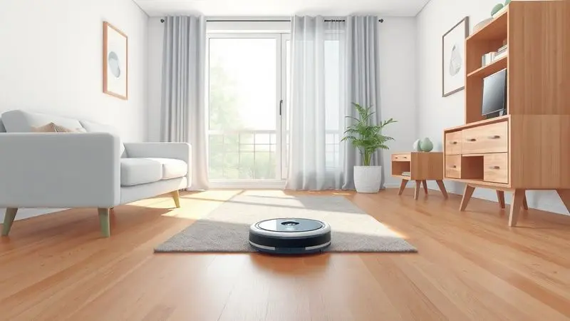
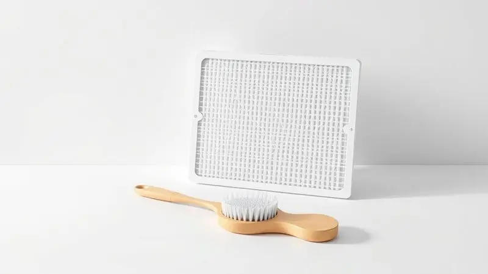
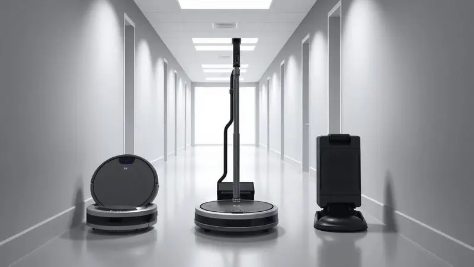

Finalmente chegou o momento de transformar aquele dispositivo que parece saído de um filme de ficção em seu aliado doméstico mais precioso.

Ter um [robô que varre, aspira e passa pano](/robo-aspirador-philips-walita-e-bom/) sozinho é realmente o sonho de qualquer rotina moderna, mas para garantir uma casa que brilhe de verdade, não basta apenas apertar o 'play' e torcer.

Você já imaginou ter total controle sobre cada centímetro da sua casa, sabendo exatamente como seu robô pensa, trabalha e se cuida?

Neste guia completo, você vai descobrir desde os segredos mais básicos de configuração até as manutenções que os manuais nem sempre se lembram de mencionar.

Prepare-se para transformar a limpeza da sua casa em uma experiência tão fluida quanto assistir seu robô passar sob aquele sofá que você nunca conseguia alcançar.

<SummaryList products={frontmatter.top_products} />

## O que é e como funciona a tecnologia do Robô Aspirador WAP?

Imagine um pequeno assistente que não apenas limpa, mas também mapea cada canto da sua casa enquanto memoriza os melhores caminhos. É exatamente isso que você tem nas mãos.

O [Robô Aspirador WAP](/robo-aspirador-wap-e-bom/) utiliza sensores que funcionam como seus olhos, identificando desde móveis e objetos até os temidos degraus de escadas.

Enquanto navega, seu sistema de sucção potente combinado com escovas rotativas trabalha em conjunto para capturar desde migalhas discretas até a poeira mais insidiosa que se esconde nos cantos.

A verdadeira mágica acontece quando você percebe que pode programá-lo para seguir sua rotina, garantindo que chegue em casa com todos os pisos perfeitos, independentemente do caos do seu dia.

## Configuração Inicial: Como conectar o Robô WAP ao Wi-Fi e Aplicativo

Você sabe aquela sensação de desembalar um dispositivo novo e sentir que está prestes a desbloquear um mundo de possibilidades? É exatamente assim que começa sua jornada com o WAP.

O primeiro passo para transformar seu robô de um objeto silencioso em seu parceiro de limpeza é conectá-lo ao seu mundo digital.

### Passo a passo para o emparelhamento com o WAP Connect

Comece baixando o aplicativo WAP Connect e deixando seu smartphone na mesma rede Wi-Fi que você quer que o robô use. Ao abrir o app e selecionar a opção para adicionar um novo dispositivo, basta seguir as instruções intuitivas na tela.

O momento mágico acontece quando você pressiona o botão de conexão no robô por alguns segundos - é como apresentar seu novo amigo ao resto da sua casa digital.

Uma vez conectado, um universo se abre: você pode agendar limpezas, acompanhar em tempo real por onde ele está passando e até definir áreas específicas que precisam de atenção extra, tudo sem sair do sofá.

## Mapeamento e Sensores: Como o robô "enxerga" e evita obstáculos

Agora que vocês estão conectados, você deve estar se perguntando: como esse pequeno assistente sabe exatamente por onde ir sem bater naquela mesinha de centro que todos sempre esbarram?

A resposta está em uma rede de sensores infravermelhos que funciona como um sexto sentido. Enquanto navega, seu WAP constantemente emite sinais que ricocheteiam nos objetos ao redor, criando um mapa mental do ambiente.

É como se ele tivesse um GPS interno que não apenas evita quedas perigosas, mas também memoriza os caminhos mais eficientes para a próxima limpeza.

Essa inteligência incorporada significa que, quando a bateria começa a ficar baixa, ele simplesmente encontra o caminho de volta para sua base de carregamento sozinho, sem que você precise se preocupar em resgatá-lo de algum canto esquecido.

## Guia de Programação: Como agendar limpezas diárias e automáticas

A verdadeira revolução acontece quando você para de pensar em limpeza como uma tarefa e começa a vê-la como um sistema automático.

Imagine acordar todas as manhãs com os pisos já perfeitos, ou chegar do trabalho e encontrar a casa impecável sem ter feito um único esforço.

No aplicativo WAP Connect, você define dias e horários específicos - talvez quando estiver na academia ou durante aquela reunião online.

Pode criar rotinas diferentes para cada dia da semana: um ciclo mais intenso para sábados, quando há mais movimento, e algo mais leve durante a semana.

Alguns modelos até permitem ajustar a potência da sucção conforme a superfície, garantindo que cada centímetro da sua casa receba exatamente o cuidado que merece.

## Como Preparar sua Casa para uma Limpeza sem Interrupções (Dicas de Ouro)

Antes de dar início à primeira sessão de limpeza automatizada, pense nisso como preparar um palco para uma apresentação perfeita. Cinco minutos de preparação podem economizar horas de frustração e garantir que seu robô trabalhe com toda sua capacidade.

Comece dando uma rápida olhada no chão: fios soltos podem se enrolar nas escovas, brinquedos pequenos podem ser engolidos, e sapatos espalhados se tornam obstáculos desnecessários.

Se houver áreas especialmente sujas, uma passada rápida com uma vassoura tradicional pode fazer toda diferença. Mantenha as portas dos cômodos que você quer limpar abertas, e se tiver tapetes que escorregam facilmente, considere fixá-los temporariamente. O resultado?

Uma experiência tranquila onde você pode realmente esquecer que a limpeza está acontecendo.

## O Pulo do Gato: Posso usar produtos de limpeza ou aromatizantes no reservatório?

Esta é uma daquelas dúvidas que quase todo mundo tem, mas poucos se sentem confortáveis em perguntar. A resposta direta é: água destilada ou filtrada é sua melhor amiga quando se trata do reservatório do seu WAP.

[Produtos químicos, mesmo os mais suaves](/o-que-colocar-no-robo-aspirador-para-passar-pano/), podem criar resíduos que entopem os delicados filtros e danificam as partes internas do robô com o tempo.

Mas aqui está um truque inteligente: se você ama aquela sensação de casa cheirosa, aplique seu aromatizante favorito no chão alguns minutos antes de programar a limpeza.

Dessa forma, seu robô espalhará um perfume agradável por todos os ambientes enquanto trabalha, sem comprometer sua saúde mecânica ou eficiência de limpeza.

## Manutenção Preventiva: Limpeza de Sensores, Filtros HEPA e Escovas Central/Lateral

Seu WAP trabalha duro para manter sua casa limpa, então ele merece um pouco de cuidado em troca. A manutenção regular é menos sobre trabalho e mais sobre garantir que esse relacionamento continue fluindo perfeitamente.

Os sensores são os olhos do seu robô - uma limpeza rápida com um pano macio e seco a cada duas semanas garante que ele continue enxergando o mundo com clareza.

Os filtros HEPA são seus pulmões: quando você os [limpa ou substitui regularmente](/como-limpar-o-robo-aspirador-wap/), está basicamente garantindo que seu robô continue respirando bem, capturando alérgenos e partículas que você nem sabia que estavam no ar.

Quanto às escovas, basta retirá-las periodicamente para remover os emaranhados de cabelos e fiapos que inevitavelmente se acumulam. São apenas alguns minutos de atenção que mantêm seu assistente funcionando como novo por anos.

## Solução de Problemas: O que fazer quando o robô não volta para a base ou perde a conexão?

Mesmo a tecnologia mais inteligente pode ter seus dias difíceis. Se seu WAP parece ter decidido fazer uma greve e não volta para sua base, respire fundo - a solução geralmente é mais simples do que parece.

Primeiro, verifique se a base está livre de obstáculos e conectada à energia. Às vezes, o robô pode estar preso timidamente sob um móvel ou travado em um tapete mais teimoso.

Uma reinicialização rápida (sim, o clássico 'desligar e ligar novamente') resolve a maioria dos problemas de conexão. Se o Wi-Fi for o culpado, certifique-se de que seu roteador está funcionando e que o robô não está muito distante do sinal.

A beleza desses momentos é que eles ensinam você a entender melhor como seu assistente pensa.

## Qual Robô Aspirador WAP é ideal para você? Conheça os principais modelos

[Escolher o WAP perfeito](/robo-aspirador-wap-qual-o-melhor/) é menos sobre especificações técnicas frias e mais sobre encontrar aquele que se encaixa naturalmente no ritmo da sua vida.

Cada modelo tem sua própria personalidade e conjunto de habilidades, projetados para diferentes estilos de casa e necessidades específicas. Vamos conhecer os principais personagens dessa família tecnológica.

### WAP Robot W100: Simplicidade e custo-benefício para o dia a dia

<ProductBox 
  title={frontmatter.top_products[0].title} 
  image={frontmatter.top_products[0].image} 
  link={frontmatter.top_products[0].link} 
/>

Imagine um assistente discreto que faz seu trabalho com eficiência sem chamar muita atenção. O [WAP Robot W100](/aspirador-de-po-robo-wap-robot-w100-e-bom/) é exatamente isso: uma solução completa que varre, aspira e passa pano, tudo em um único movimento suave.

Com apenas 7,5 cm de altura, ele alcança aqueles espaços sob móveis que você sempre ignorou por serem muito trabalhosos. Sua bateria dura até 1 hora e 40 minutos, tempo suficiente para cobrir os ambientes principais da maioria das casas.

Sim, o carregamento completo leva cerca de 5 horas, mas pense nisso como o tempo perfeito para ele descansar enquanto você vive sua vida.

O único detalhe a considerar é seu nível de ruído de 72 dB(A) - não é exatamente silencioso, mas também não compete com uma conversa animada na sala.

### WAP Robot W300: Autonomia e design slim para alcançar cantos difíceis

<ProductBox 
  title={frontmatter.top_products[1].title} 
  image={frontmatter.top_products[1].image} 
  link={frontmatter.top_products[1].link} 
/>

Quando cada centímetro conta, o design slim do WAP Robot W300 se torna seu superpoder. Com apenas 7,8 cm de altura, ele desliza sob praticamente qualquer móvel, limpando aqueles cantos que acumulam poeira há meses.

Sua bateria oferece entre 45 minutos a 1 hora e 15 minutos de trabalho contínuo, dependendo de como você o configura.

Escolha o modo 'SUPER' quando precisar de uma limpeza mais intensa e aceite que a bateria vai durar menos - é uma troca justa por resultados excepcionais.

Cinco modos de limpeza diferentes significam que você pode adaptá-lo para qualquer ocasião, desde uma limpeza rápida até uma sessão completa de fim de semana.

### WAP Robot WSmart: Varre, aspira e passa pano com controle por voz

<ProductBox 
  title={frontmatter.top_products[2].title} 
  image={frontmatter.top_products[2].image} 
  link={frontmatter.top_products[2].link} 
/>

Para quem adora a ideia de conversar com sua casa, o WAP Robot WSmart é o assistente perfeito. Além das três funções básicas (varrer, aspirar e passar pano), ele oferece três modos de limpeza mais uma função turbo para quando as coisas ficam realmente sérias.

Seu filtro HEPA é um respiro de alívio para quem sofre com alergias, capturando partículas que você nem sabia que estavam no ar.

Com autonomia de até 2 horas, ele consegue cobrir áreas generosas antes de retornar automaticamente para sua base quando a bateria está baixa.

O controle remoto facilita ainda mais o agendamento, transformando a limpeza em algo que você controla literalmente com um toque.

### WAP Robot Wconnect: A experiência completa de automação residencial

<ProductBox 
  title={frontmatter.top_products[3].title} 
  image={frontmatter.top_products[3].image} 
  link={frontmatter.top_products[3].link} 
/>

Este é para quem quer mergulhar de cabeça no mundo da automação residencial sem complicações excessivas. O WAP Robot Wconnect se conecta facilmente ao aplicativo WAP Connect e responde até a comandos de voz, tornando-o parte integrante do seu ecossistema inteligente.

Seus modos de limpeza versáteis incluem padrões aleatórios, em espiral e específicos para cantos, garantindo que nenhuma área seja negligenciada.

A função Turbo Brush é especialmente eficaz para casas com animais de estimação, lidando com pelos como se fossem brincadeira de criança.

Sim, ele não possui o mapeamento mais avançado do mercado, mas sua combinação de preço acessível e funcionalidades completas o torna uma escolha extremamente inteligente para quem está começando sua jornada doméstica automatizada.

## Perguntas Frequentes sobre Robôs Aspiradores WAP (FAQ)

É normal ter dúvidas quando se está trazendo tecnologia nova para dentro de casa. A bateria realmente dura o suficiente?

Depende muito do seu espaço e de como você usa o robô - em apartamentos menores, uma carga pode ser suficiente para vários dias, enquanto em casas maiores você pode precisar de sessões divididas.

A conectividade é geralmente estável, mas como qualquer dispositivo Wi-Fi, pode ter momentos sensíveis quando o sinal está fraco. Quanto à manutenção, pense nisso como escovar os dentes: rápido, simples e essencial para manter tudo funcionando perfeitamente.

## Conclusão: Vale a pena investir em um robô aspirador WAP?

Quando você para para pensar no que realmente significa investir em um [Robô Aspirador WAP](/aspirador-robo-wap-w95-e-bom/), percebe que não está comprando apenas um eletrodoméstico - está adquirindo tempo, tranquilidade e uma nova maneira de habitar seu espaço.

Esses pequenos assistentes transformam a limpeza de uma obrigação constante em um sistema silencioso que trabalha nos bastidores da sua vida.

Sim, eles exigem um entendimento inicial, alguma manutenção regular e ajuste às particularidades da sua casa, mas em troca oferecem o luxo de pisos sempre limpos sem o esforço físico.

Para quem vive rotinas aceleradas, tem mobilidade reduzida ou simplesmente valoriza seu tempo livre, um WAP não é apenas um gasto - é um investimento em qualidade de vida.

Ele nunca substituirá totalmente aquela limpeza profunda ocasional que todo espaço precisa, mas garantirá que, entre uma e outra, sua casa mantenha aquela sensação aconchegante de estar sempre cuidada.

No final das contas, a pergunta certa não é se vale a pena, mas quanto vale para você recuperar todas aquelas horas que gastava com vassoura e pano de chão.