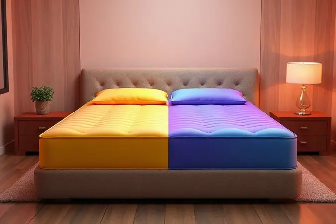
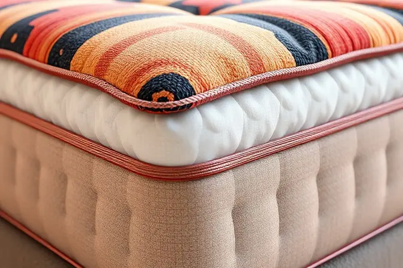

Você já acordou com dores no corpo e sentiu que seu colchão simplesmente não oferece o suporte necessário? Escolher entre a espuma D28 ou D33 é uma das decisões mais comuns e importantes para quem busca um sono de qualidade.

Se você escolher uma densidade baixa demais para seu peso, o colchão afunda; se for alta demais, ele pode ser desconfortável.

Neste guia completo, você vai aprender a ler a tabela de biotipos, entender as diferenças técnicas entre D28 e D33 e descobrir, de uma vez por todas, qual é o investimento certo para o seu descanso e saúde da coluna.

<SummaryList products={frontmatter.top_products} />

## O que significa a Densidade (D) nas espumas de colchão?

Pense na densidade como a personalidade do seu colchão. Ela mede quanto material existe em cada metro cúbico de espuma, determinando como o colchão vai se comportar todas as noites ao receber seu corpo.

Enquanto a D33 abraça mais matéria-prima, oferecendo uma estrutura robusta que promete companhia por muitos anos, a D28 apresenta um caráter mais leve, que convida ao aconchego imediato.

A escolha não é sobre números, é sobre como você quer acordar: com a coluna perfeitamente alinhada ou em um ninho de suavidade?

Essa decisão se baseia no seu peso, nas suas preferências de conforto e na expectativa de quantos sonos tranquilos você espera ter nesse investimento.

## Colchão D28: O equilíbrio entre maciez e suporte leve

<ProductBox 
  title={frontmatter.top_products[0].title} 
  image={frontmatter.top_products[0].image} 
  link={frontmatter.top_products[0].link} 
/>

Imagine um colchão que recebe seu corpo como um abraço suave, cedendo apenas o necessário para que você se sinta envolto sem perder o suporte.

É essa experiência que a densidade D28 oferece, com seus 28 kg de espuma por metro cúbico criando um equilíbrio delicado entre conforto e sustentação.

Perfeito para quem pesa até 80 kg, ele se transforma no parceiro ideal para dormir de lado, aliviando a pressão nos ombros e quadris enquanto mantém sua coluna alinhada.

Para famílias que precisam de versatilidade, o D28 brilha como opção para quartos de hóspedes ou casas de veraneio, onde o uso não é diário mas o conforto não pode faltar. Seu manuseio leve facilita a rotina de virar o colchão, prolongando sua vida útil.

No entanto, se você carrega mais peso ou divide a cama com alguém que pesa consideravelmente mais, essa suavidade pode se transformar em afundamento mais rápido do que gostaria.

### Para quem a densidade D28 é mais indicada?

Para você que está entre 50 e 80 kg e adora a sensação de afundar levemente no colchão ao deitar. Se dormir de lado é sua posição preferida, a D28 se torna sua aliada contra pontos de pressão doloridos, especialmente nos ombros e quadris.

É a escolha inteligente para quem não enfrenta problemas de saúde que exijam firmeza extrema, mas valoriza acordar revigorado em um ninho personalizado que se adaptou ao seu corpo durante a noite.

## Colchão D33: A densidade preferida para maior firmeza e durabilidade

<ProductBox 
  title={frontmatter.top_products[1].title} 
  image={frontmatter.top_products[1].image} 
  link={frontmatter.top_products[1].link} 
/>

Quando firmeza não significa desconforto, mas sim consistência que acompanha seu corpo noite após noite, a densidade D33 entra em cena. Com 33 kg de matéria-prima por metro cúbico, ela oferece uma base sólida que suporta até 100 kg sem perder a capacidade de conforto.

Essa estrutura mais robusta se traduz em alinhamento postural preciso, especialmente valioso para quem sofre com dores nas costas ou busca prevenir seu aparecimento.

O investimento em um D33 é como garantir um companheiro de sono fiel por anos. Enquanto outros colchões podem começar a mostrar sinais de cansaço, ele mantém sua estrutura, oferecendo o mesmo suporte confiável.

Para quem tem orçamento consciente mas não abre mão de qualidade, ele representa a ponte perfeita entre espumas mais simples e opções premium com molas ou densidades ainda maiores.

### Vantagens de escolher um colchão D33 para a postura

Escolher o D33 é dar à sua coluna o respeito que ela merece. Cada noite se transforma em uma sessão de alinhamento silencioso, onde pontos de pressão são distribuídos uniformemente e a curvatura natural das suas costas é preservada.

Para quem dorme de lado, essa densidade oferece o apoio necessário para manter os quadris alinhados com os ombros, evitando aquela torção sutil que resulta em dor matinal.

A durabilidade superior significa que esse cuidado postural não é passageiro, mas um compromisso de longo prazo com sua saúde.

## D28 vs D33: Comparativo direto das principais diferenças

A verdadeira diferença entre D28 e D33 vai além dos números.

Enquanto a D28 sussurra convites suaves com sua maciez convidativa, ideal para corpos mais leves ou para quem busca o aconchego de dormir envolto, a D33 fala com autoridade, oferecendo uma base firme que promete sustentação consistente mesmo para quem carrega mais peso.

A primeira é como uma conversa íntima com seu corpo; a segunda, um acordo de respeito mútuo onde firmeza e conforto negociam um equilíbrio duradouro.

## Guia do Biotipo: Como escolher pela Tabela de Peso e Altura

Seu corpo conta uma história única, e escolher a densidade certa é aprender a escutá-la. Pessoas com peso menor frequentemente descobrem na D28 a resposta perfeita para suas necessidades, uma combinação de suporte que não sobrecarrega com firmeza desnecessária.

À medida que o peso aumenta, a D33 surge como a solução que compreende a necessidade de estrutura sem sacrificar o conforto. Lembre-se que tabelas são guias, não sentenças: seu corpo sabe o que precisa, e a sensação ao deitar é o julgamento final mais importante.

## Qual densidade escolher para o colchão de uma criança?

Para as crianças, o colchão é mais que um lugar para dormir, é um território de sonhos e crescimento. Para os pequenos com peso menor, a D28 oferece o ninho perfeito, com suporte adequado que não desafia seus corpos em desenvolvimento com firmeza excessiva.

Conforme crescem e ganham peso, a transição para a D33 pode fazer sentido, especialmente se você pensa em um investimento que acompanhe suas mudanças por alguns anos. A chave está em equilibrar segurança postural com a maciez que convida ao descanso profundo.

## D28 ou D33 para Casais: Como lidar com pesos diferentes?

Quando dois biotipos diferentes compartilham a mesma cama, a escolha da densidade se transforma em um ato de amor e compromisso. Se ambos estão na faixa até 70 kg, a D28 pode ser o território comum perfeito.

Mas quando um parceiro carrega mais peso, a D33 emerge como a diplomata do relacionamento, oferecendo suporte superior que evita o afundamento desigual que pode afastar vocês durante a noite.

O segredo está em encontrar a densidade que atenda à pessoa com maior necessidade de suporte, complementando com camadas de conforto que acolham o parceiro mais leve.

## Além da densidade: A importância do Pillow Top e das camadas de conforto

A densidade é o esqueleto do seu colchão, mas as camadas de conforto são sua personalidade.

O Pillow Top é aquele toque extra que transforma um colchão firme em um convite irresistível, adicionando suavidade que alivia pontos de pressão sem comprometer o suporte estrutural.

Camadas de látex ou espuma viscoelástica atuam como tradutores entre a firmeza da densidade e as curvas únicas do seu corpo, personalizando o conforto de maneira que números sozinhos nunca conseguiriam.

Ao escolher, pergunte-se não apenas sobre densidade, mas sobre como todas as camadas trabalham juntas para criar o abraço perfeito.

## 5 Dicas essenciais para aumentar a vida útil do seu colchão de espuma

Seu colchão é um investimento que merece cuidado. Comece dando a ele uma base adequada, uma fundação que respeite sua estrutura. Virá-lo regularmente é como dar férias para diferentes partes, prevenindo desgastes localizados.

Mantenha-o limpo com capas protetoras que barram ácaros e umidade, porque um colchão saudável é um colchão duradouro. Evite sentar nas bordas como se fossem bancos, pois essas áreas são projetadas para suporte lateral, não para suportar peso concentrado.

Por fim, permita que ele respire ocasionalmente, expondo-o à luz natural que renova seu interior. Esses pequenos gestos são promessas de que seu colchão retribuirá com conforto por muitos anos.

## FAQ: Dúvidas frequentes sobre as espumas D28 e D33

### A espuma D28 afunda muito mais rápido que a D33?

Sim, essa é uma realidade técnica. A estrutura menos densa da D28, embora inicialmente mais acolhedora, enfrenta o desgaste do tempo com menos resistência.

Enquanto ela oferece conforto imediato que muitos amam, a D33 constrói sua relação com você em camadas mais profundas de durabilidade.

A escolha é entre o prazer do agora e a promessa do amanhã, sempre considerando como seu peso e hábitos de sono influenciam essa equação.

### Qual é a melhor densidade para quem tem dor na lombar?

Para a lombar que sinaliza cansaço, o colchão se transforma em terapeuta noturno. A D28 pode funcionar bem se seu peso for leve e você buscar alívio imediato de pressão.

Mas para muitos, especialmente aqueles com peso maior, a D33 oferece a estrutura consistente que a lombar precisa para manter seu alinhamento natural durante toda a noite.

O segredo está em testar: sua lombar saberá dizer qual densidade conversa melhor com suas curvaturas.

### Uma pessoa leve pode usar um colchão D33 sem sentir desconforto?

Absolutamente. A D33 não discrimina por peso, apenas oferece sua estrutura firme como uma opção. Pessoas mais leves que escolhem essa densidade frequentemente descobrem que apreciam a sensação de segurança que vem de não afundar excessivamente.

É como ter um amigo que te apoia sem te envolver completamente, mantendo você no caminho certo enquanto permite que relaxe. A durabilidade extra é um presente adicional que independe do seu peso.

## Conclusão

A escolha entre D28 e D33 é mais do que uma decisão técnica, é um compromisso com suas noites e seus amanhãs. A D28 sussurra promessas de aconchego imediato, um abraço suave que se molda ao seu corpo como se tivesse sido feito apenas para você.

É para quem valoriza a sensação de ser recebido gentilmente após um dia longo.

A D33, por sua vez, fala a linguagem da constância, oferecendo uma parceria duradoura que mantém suas promessas ano após ano, especialmente valiosa para quem carrega mais peso ou busca prevenção contra dores posturais.

Olhe para seus próximos anos de sono: imagine acordar sem dores, sentir seu corpo revigorado, saber que seu investimento continua cuidando de você mesmo após milhares de noites.

Seja qual for sua escolha, lembre-se que você não está apenas comprando um colchão, está investindo na qualidade dos seus dias através da qualidade das suas noites. Escute seu corpo, considere seu biotipo, e faça a escolha que fará você dormir e acordar melhor.

Seu futuro agradecido espera por você do outro lado dessa decisão.