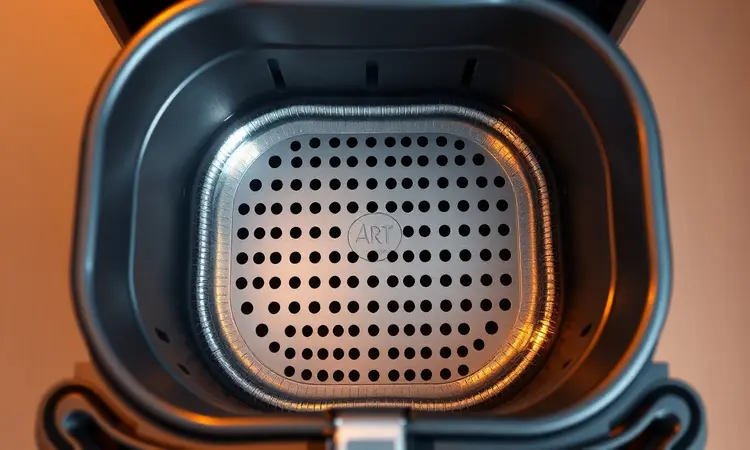
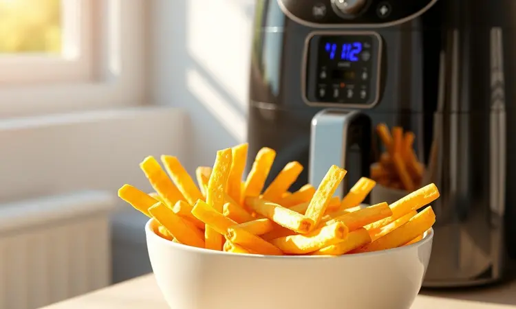
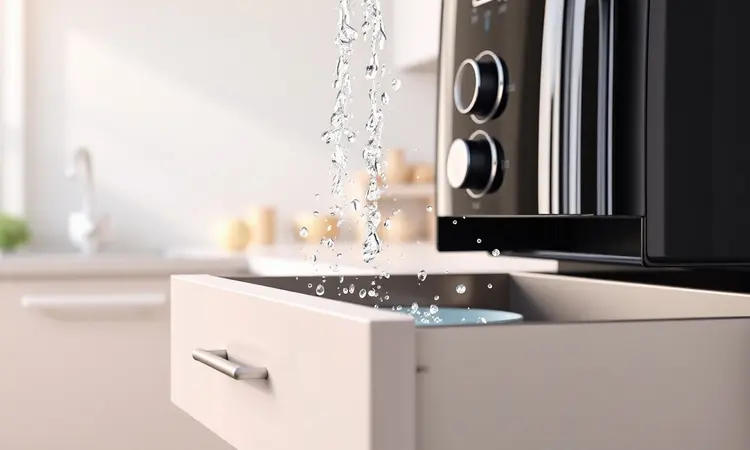
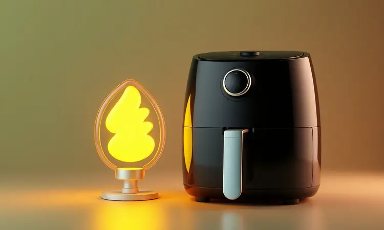

Se você está procurando uma fritadeira elétrica que combine confiança de marca com eficiência prática, é quase impossível não esbarrar na Arno.

Com mais de 70 anos no mercado brasileiro, a marca construiu uma reputação que transcende catálogos e se transforma em uma promessa de durabilidade que passa de geração em geração. Mas será que essa herança se sustenta no mundo acelerado das air fryers?

Neste guia, mergulhamos fundo na experiência com a Air Fryer Arno AFI6 e exploramos suas irmãs mais populares para descobrir qual versão realmente merece um espaço definitivo no seu balcão.

<SummaryList products={frontmatter.top_products} />

## Sobre a marca Arno

Imagine poder confiar em um eletrodoméstico como você confia naquele liquidificador da sua avó que ainda funciona perfeitamente depois de décadas. Essa é a essência da Arno, uma marca que transformou a simplicidade brasileira em tecnologia confiável.

Mais do que apenas fabricar produtos, eles entendem o ritmo das nossas cozinhas - a pressa do café da manhã, a organização do almoço de domingo, a praticidade necessária para quem chega tarde do trabalho.

Seu compromisso vai além das especificações técnicas; é sobre criar ferramentas que se adaptam ao seu dia sem exigir que você se adapte a elas.

Quando você compra uma Arno, está adquirindo um pedaço dessa filosofia, onde cada botão, cada função e cada material carrega a intenção de facilitar algo na sua rotina.

## Análise detalhada da Air Fryer Arno AFI6: pequena no tamanho e potente

<ProductBox 
  title={frontmatter.top_products[0].title} 
  image={frontmatter.top_products[0].image} 
  link={frontmatter.top_products[0].link} 
/>

Ao abrir a caixa da AFI6, a primeira impressão é de decepção: "É só isso?" Suas dimensões compactas quase nos fazem duvidar que ali cabem seis litros de batatas fritas ou um frango inteiro.

Porém, essa primeira impressão é exatamente o que a torna especial - ela ocupa menos espaço do que sua cafeteira, mas transforma completamente sua relação com a fritura.

A mágica começa quando você liga o aparelho e percebe que não precisa daqueles eternos 5 a 10 minutos de pré-aquecimento que testam nossa paciência nos dias mais corridos.

O segredo está na Tecnologia Direct Heat, que dispara ar quente a 200°C em menos de um minuto, como se o aparelho estivesse ansioso para começar a trabalhar.

E enquanto ele esquenta, você tem tempo de preparar os alimentos, criando um fluxo natural na cozinha sem aquelas pausas mortas que desanimam qualquer um.

Os doze programas automáticos são como ter um assistente pessoal que já sabe exatamente quanto tempo suas batatas precisam ou qual temperatura deixa o frango crocante por fora e suculento por dentro.

Mas o verdadeiro diferencial emocional está no detalhe mais simples: o compartimento para água no cesto. Parece pouco, até você experimentar assar um bolo que não resseca ou preparar um frango que mantém o suco natural.

É aquele toque que transforma você de cozinheiro para chef, entregando resultados que impressionam sem exigir técnicas complexas.

<CaixaProsContras>

**Prós:**

- Tecnologia Direct Heat para aquecimento rápido.

- Cesto com compartimento para água, garantindo suculência nos alimentos.

- Doze programas automáticos para facilitar o uso.

- Capacidade de 6 litros, ideal para famílias.

**Contras:**

- Limpeza do painel requer cuidado.

- Acabamento brilhante pode marcar digitais facilmente.

</CaixaProsContras>

### 1. Ficha Técnica da Air Fryer Arno AFI6

Potência: 1.500W | Capacidade: 6 litros | Tecnologia: Direct Heat | Programas: 12 automáticos | Timer: Até 60 minutos | Temperatura máxima: 200°C. Esses números, no papel, podem parecer apenas especificações.

Mas na prática, eles se traduzem em algo muito mais valioso: liberdade. A potência de 1.500W significa que você nunca precisará escolher entre esperar ou comer mal - o aquecimento é quase imediato.

Os seis litros de capacidade representam a possibilidade de reunir a família sem fazer rodadas intermináveis de fritura. E os doze programas são sua rede de segurança contra erros, especialmente nos dias em que sua cabeça está cheia de outras preocupações.

### 2. Design e capacidade do modelo

O design da AFI6 segue uma filosofia inteligente: desaparecer quando não está em uso, mas impressionar quando necessário.

Seu corpo compacto se encaixa em qualquer cantinho do balcão, até mesmo naqueles espaços entre o micro-ondas e a torradeira que normalmente ficam ociosos.

Porém, não se engane pelo tamanho reduzido - quando você abre a gaveta, descobre um universo de 6 litros que comporta desde um frango de 1,5kg até porções generosas de batata para quatro pessoas.

O acabamento em branco ou preto (dependendo do modelo) tem um brilho discreto que combina com qualquer estilo de cozinha, enquanto o painel de controles manuais oferece uma simplicidade reconfortante para quem não quer lidar com telas sensíveis ao toque cheias de opções confusas.

### 3. Uso da Air Fryer no dia a dia

Imagine esta cena: são 19h, você acabou de chegar do trabalho, as crianças estão com fome e sua energia está no limite. Antes, essa combinação significava entregas por aplicativo ou refeições congeladas. Com a AFI6, tudo muda.

Em menos de 20 minutos, você tem frango crocante, batatas douradas e legumes assados prontos na mesa.

O segredo está na combinação entre capacidade generosa e velocidade - enquanto uma fornada tradicional no forno levaria pelo menos 40 minutos, aqui você consegue preparar tudo de uma vez, economizando tempo e energia (tanto a sua quanto a elétrica).

E o melhor: sem o cheio característico de fritura que impregna na roupa e nos móveis, apenas o aroma convidativo de comida caseira fresquinha.

### 4. Limpeza e manutenção do aparelho

Depois do almoço de domingo, quando a preguiça pós-refeição bate forte, a última coisa que você quer é passar meia hora esfregando panelas gordurosas. É aqui que a AFI6 brilha de verdade.

Seu cesto removível e a bandeja coletora vão direto para a lava-louças, transformando uma tarefa chata em um processo automático. Para limpeza diária, um pano úmido no exterior resolve em segundos.

O único cuidado necessário é com o painel de controle - por ter acabamento brilhante e ser sensível, vale a pena usar um pano macio para não riscar.

Essa praticidade não é apenas conveniente; é o que garante que você realmente usará o aparelho todos os dias, sem aquela resistência interna que surge quando sabemos que a limpeza será trabalhosa.

### 5. Consumo de energia e preço

Quando comparada a um forno elétrico tradicional, a economia de energia da AFI6 é quase uma piada de bom gosto.

Enquanto um forno consome em média 1500W por hora inteira de funcionamento, a air fryer atinge temperaturas altas em minutos e mantém o calor de forma muito mais eficiente, reduzindo o consumo total drasticamente.

Essa eficiência se traduz em números reais na sua conta de luz, especialmente se você substituir várias frituras em óleo ou usos prolongados do forno.

E embora falemos em economia a longo prazo, o verdadeiro valor está na sensação de estar fazendo escolhas inteligentes - para sua saúde, para seu bolso e para seu tempo.

## Outras opções de Airfryer Arno para sua cozinha

Se a AFI6, com seus 6 litros e controles manuais, não parece se encaixar perfeitamente no seu estilo de vida, respire aliviado: a Arno oferece uma família completa de air fryers, cada uma com sua personalidade única.

É como escolher entre irmãos com talentos diferentes - um é o atleta, outro é o artista, mas todos carregam o mesmo DNA de qualidade. Vamos conhecer suas principais características para você descobrir qual versão realmente combina com sua rotina na cozinha.

### Arno AirFry Compacta CFRY

<ProductBox 
  title={frontmatter.top_products[1].title} 
  image={frontmatter.top_products[1].image} 
  link={frontmatter.top_products[1].link} 
/>

Para quem mora sozinho, em casal ou simplesmente possui uma cozinha minúscula, a Compacta CFRY é como encontrar a peça que faltava no quebra-cabeça.

Com capacidade reduzida (geralmente entre 3,5L e 4,2L, dependendo do modelo específico), ela mantém toda a tecnologia Arno em um formato que parece desenhado para apartamentos modernos.

A grande questão que ela responde é: "Preciso realmente de 6 litros se cozinho apenas para mim?" Se sua resposta for não, essa versão oferece a mesma qualidade e durabilidade em proporções mais adequadas ao seu dia a dia real, ocupando menos espaço no balcão e na despensa quando guardada.

<CaixaProsContras>

**Prós:**

- Capacidade ideal para famílias.

- Aquecimento rápido sem necessidade de pré-aquecimento.

- Variedade de programas automáticos.

- Visor transparente facilita o controle do cozimento.

**Contras:**

- Não é bivolt.

- Cesto com adição de água pode ser uma novidade para alguns.

</CaixaProsContras>

### Arno AirFry Super Preta – BFRY

<ProductBox 
  title={frontmatter.top_products[2].title} 
  image={frontmatter.top_products[2].image} 
  link={frontmatter.top_products[2].link} 
/>

A Super Preta é para quem gosta de declarações visuais na cozinha. Seu design em preto fosco e detalhes em inox (em alguns modelos) não passam despercebidos - eles transformam o aparelho em um objeto de desejo que você deixa exposto com orgulho.

Mas a beleza vai além da estética: com 1400W de potência e controle preciso de temperatura até 200°C, ela oferece o equilíbrio perfeito entre potência e elegância.

Ideal para quem não abre mão do desempenho, mas também valoriza uma cozinha que parece saída das páginas de uma revista de decoração. Ela diz, sem palavras, que sua casa valoriza tanto a funcionalidade quanto o bom gosto.

<CaixaProsContras>

**Prós:**

- Capacidade significativa para preparar refeições para 6 pessoas.

- Potência eficiente de 1400W.

- Temperatura ajustável até 200°C para diversas receitas.

- Design moderno e fácil de limpar.

**Contras:**

- Não é bivolt, disponível apenas em duas voltagens.

- Pode ser um pouco volumosa para cozinhas com espaço limitado.

</CaixaProsContras>

### Arno AirFry Super Digital Preta

<ProductBox 
  title={frontmatter.top_products[3].title} 
  image={frontmatter.top_products[3].image} 
  link={frontmatter.top_products[3].link} 
/>

Se a ideia de programar tempos e temperaturas manualmente te dá calafrios, a versão Digital é sua salvadora. O painel touch screen não é apenas um capricho tecnológico - é sua garantia contra erros.

Com oito programas pré-configurados, você literalmente precisa apenas escolher o alimento e apertar start. O sistema Hot Air garante uma circulação de ar tão uniforme que parece mágica: como é possível que todas as batatas fiquem igualmente crocantes sem precisar mexer?

Essa versão é especialmente valiosa para iniciantes ou para quem cozinha sob stress - ela remove as variáveis, deixando apenas a certeza do resultado perfeito.

<CaixaProsContras>

**Prós:**

- Painel digital intuitivo com programas automáticos.

- Tecnologia Hot Air para cozimento uniforme.

- Facilidade de limpeza com peças removíveis.

- Ideal para refeições em família até seis pessoas.

**Contras:**

- Tamanho compacto pode limitar porções grandes.

- Potência pode não ser suficiente para alguns pratos mais exigentes.

</CaixaProsContras>

### Arno AirFry PFRY

<ProductBox 
  title={frontmatter.top_products[4].title} 
  image={frontmatter.top_products[4].image} 
  link={frontmatter.top_products[4].link} 
/>

A PFRY representa o ponto de entrada perfeito no universo Arno para quem está começando a explorar o mundo das frituras sem óleo. Com 3,5 litros e potência entre 1200W e 1350W, ela oferece o essencial sem complicações nem investimento exagerado.

Sua cuba antiaderente e peças laváveis na máquina mantêm a tradição de facilidade de limpeza da marca.

É a escolha inteligente para quem quer testar o conceito antes de comprometer-se com modelos mais robustos, funcionando como um excelente primeiro passo para descobrir se essa tecnologia realmente se encaixa no seu estilo de vida.

<CaixaProsContras>

**Prós:**

- Cozinha sem óleo, tornando os alimentos mais saudáveis.

- Tecnologia Hot Air para resultados crocantes.

- Fácil limpeza com peças que podem ir à máquina.

- Timer e controle de temperatura ajustáveis.

**Contras:**

- Pode ser pequena para famílias maiores.

- Design em plástico pode não agradar a todos.

</CaixaProsContras>

## O que os consumidores acham da airfryer Arno?

Conversar com quem já viveu a experiência diária com essas air fryers revela padrões interessantes. A palavra que mais aparece não é "potente" ou "rápida", mas sim "confiável".

É aquela sensação de que, independentemente do dia, do seu cansaço ou da complexidade da receita, o aparelho simplesmente funciona.

Os elogios giram em torno da consistência - as batatas de terça têm o mesmo resultado das de sábado, o frango nunca queima de um lado apenas, e o bolo sempre cresce uniformemente.

As críticas, quando existem, geralmente apontam para detalhes como a ausência de manual mais didático ou o fato de não ser bivolt (dependendo do modelo), mas quase sempre terminam com um "mas eu compraria de novo".

Essa fidelidade pós-compra talvez seja o maior testemunho da qualidade Arno.

## Veredito: Afinal, a airfryer Arno é boa mesmo?

Sim, mas com um adendo importante: ela é boa para quem valoriza consistência acima de tudo. A Arno não necessariamente inventou a roda das air fryers, mas aperfeiçoou-a com uma compreensão profunda das necessidades reais da cozinha brasileira.

O que você compra não é apenas um eletrodoméstico, mas uma promessa cumprida dia após dia, refeição após refeição.

## Conclusão

Depois de analisar minuciosamente a família Arno de air fryers, uma coisa fica clara: você não está apenas escolhendo um eletrodoméstico, mas um parceiro na cozinha.

A AFI6, com seus 6 litros e aquecimento instantâneo, é a escolha clássica para famílias que não abrem mão da praticidade.

Já as versões Compacta, Digital e Super atendem perfis específicos com precisão cirúrgica - do solteiro que valoriza espaço ao perfeccionista que ama tecnologia touch. O denominador comum?

A herança de qualidade de uma marca que entende que cozinhar não é apenas sobre alimentar o corpo, mas sobre criar momentos.

Se você busca uma relação de longo prazo com sua air fryer, onde a novidade do primeiro mês se transforma em confiança duradoura, a Arno oferece exatamente isso: a garantia silenciosa de que, independentemente do que a vida jogar no seu prato, sua cozinha estará preparada para transformá-lo em uma refeição memorável.

Qual modelo escolher depende do ritmo da sua casa, mas qualquer que seja sua decisão, você estará adquirindo muito mais que um produto - estará convidando setenta anos de know-how brasileiro para fazer parte da sua rotina diária.