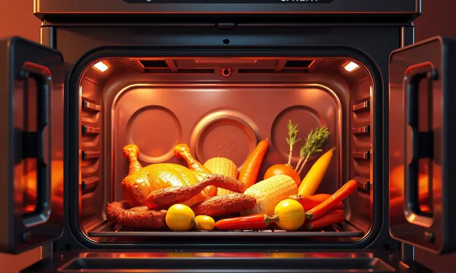
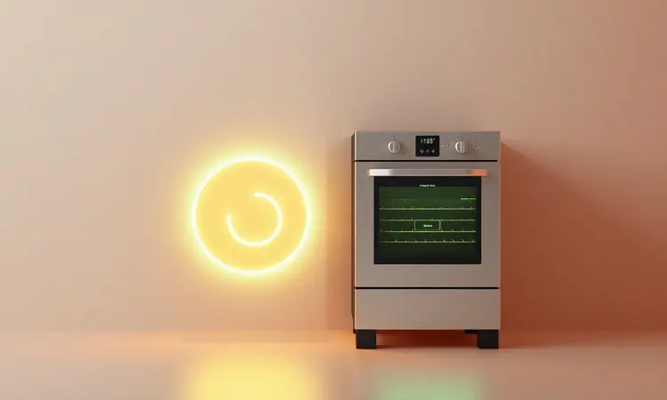
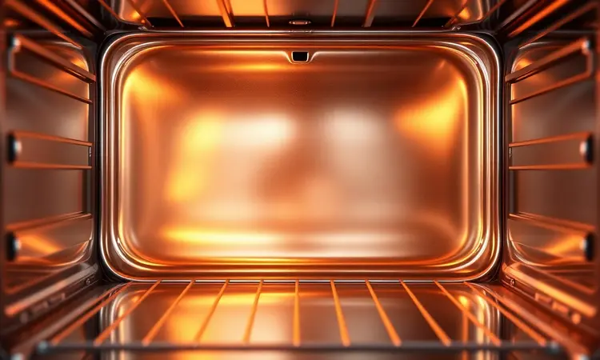
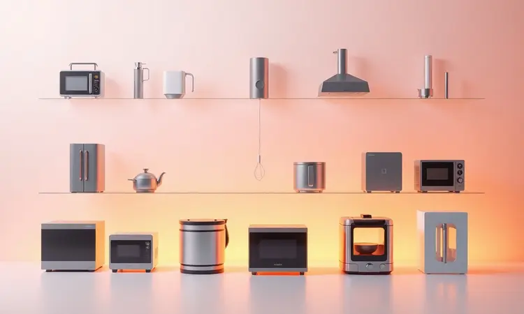

Quando você busca um eletrodoméstico que promete revolucionar sua cozinha, o Oster French Door 42L parece quase um sonho: um forno elétrico com portas duplas que também funciona como airfryer.

Mas diante de um investimento considerável, surge a dúvida genuína: ele realmente transforma seu dia a dia ou é apenas mais um item que ocupará espaço na bancada?

Nesta análise completa, vamos além das especificações técnicas para entender como esse aparelho se comporta na prática, na limpeza e na rotina real. Se você quer saber se esse modelo é bom e vale seu investimento, acompanhe este review até o final.

<SummaryList products={frontmatter.top_products} />

## Visual de forno French Door

<ProductBox 
  title={frontmatter.top_products[0].title} 
  image={frontmatter.top_products[0].image} 
  link={frontmatter.top_products[0].link} 
/>

Imagine abrir um forno como você abre um armário elegante: duas portas que se movem simultaneamente, revelando um interior de 42 litros que parece pronto para uma sessão gourmet.

O Oster French Door não é apenas um eletrodoméstico; é uma declaração de design na sua cozinha.

As portas duplas não só facilitam o acesso (você pode alcançar qualquer prato sem contorcionismos), mas também têm uma função prática: economizam espaço quando você precisa abrir completamente.

Visualmente, ele traz uma modernidade que combina com qualquer estilo de decoração.

A funcionalidade vem embutida na estética: a tecnologia de convecção garantirá que seus assados sejam uniformes, enquanto o controle de temperatura (que varia entre 90°C e 230°C) abre um universo de possibilidades desde pães delicados até frituras sem óleo.

Há um ponto que merece atenção: a limpeza interna pode demandar mais cuidado que em modelos mais simples. Mas para quem valoriza qualidade e deseja um elemento que seja tanto útil quanto bonito, esse forno oferece uma experiência completa.

<CaixaProsContras>

**Prós:**

- Design moderno com portas French Door que otimizam o espaço.

- Grande capacidade de 42 litros para diferentes receitas.

- Tecnologia de convecção para cozimento rápido e uniforme.

- Versatilidade com múltiplas funções de cozimento.

**Contras:**

- Limpeza interna pode ser mais trabalhosa.

- Ocupa um espaço considerável na bancada.

</CaixaProsContras>

## Especificações Técnicas

Mas além da estética, o que realmente define esse forno são seus números. Com 42 litros de capacidade, ele permite que você prepare grandes porções ou várias receitas simultaneamente usando até duas prateleiras.

A tecnologia de convecção não é apenas um termo técnico: é o motor que distribui calor uniformemente, garantindo que suas batatas fiquem crocantes por igual e seu bolo não tenha partes secas.

O painel digital oferece controle preciso de temperatura e tempo, eliminando aquele cálculo mental de 'mais ou menos' que costuma sabotar receitas. As portas francesas não são apenas sofisticadas: elas oferecem melhor visualização durante o processo de cozimento.

E quando pensamos em limpeza, a superfície antiaderente e removível transforma uma tarefa potencialmente árdua em algo que você pode resolver rapidamente após o uso.

## Muita versatilidade para o preparo de várias receitas

Esses números não são apenas técnicos. Eles se traduzem em versatilidade que você sente na rotina. Imagine um domingo onde você quer preparar o pão de fermentação natural, assar um filé para o almoço e ainda fazer chips de batata como snack para a tarde.

Com a função airfryer embutida, você consegue tudo isso em um único aparelho, sem precisar alternar entre três eletrodomésticos diferentes.

A capacidade de 42 litros é perfeita para famílias maiores ou para quem adora receber amigos. Os modos de cozimento incluídos (assar, tostar, gratinar) ampliam suas possibilidades como chef.

Essa multifuncionalidade economiza espaço físico e também tempo mental: você não precisa planejar qual equipamento usar para cada etapa da receita.

## Consumo de energia baixo para um modelo tão grande

Quando você pensa em um forno de 42 litros, a preocupação com consumo energético é natural. O Oster French Door foi projetado para equilibrar tamanho e eficiência.

A tecnologia permite que ele alcance a temperatura desejada rapidamente e mantenha ela com estabilidade, reduzindo o tempo em que precisa ficar ligado.

Mas o verdadeiro benefício vem da multifuncionalidade. Por ter a airfryer integrada, você evita usar múltiplos equipamentos simultaneamente.

Isso significa economia energética em cada preparo: você não precisa ligar o forno tradicional, a airfryer e possivelmente outro aparelho. A eficiência é sentida tanto na praticidade (um único dispositivo) quanto na conta de luz ao final do mês.

## Fácil de limpar

A promessa de um eletrodoméstico multifuncional sempre traz uma dúvida: será difícil de limpar depois de tantas funções diferentes? O Oster French Door simplifica esse processo com revestimentos antiaderentes que impedem que resíduos grudem profundamente.

As bandejas removíveis podem ser lavadas na máquina de lavar louças, transformando uma tarefa potencialmente complicada em algo que você resolve enquanto lava os outros utensílios.

A parte interna é acessível, permitindo que você remova qualquer acúmulo sem dificuldade. Mantendo essas práticas simples, seu forno permanecerá livre de odores e sempre pronto para a próxima receita.

A limpeza fácil não é apenas uma característica técnica: é a garantia que você terá um eletrodoméstico que não se torna um fardo após semanas de uso intenso.

## Falta acessórios inclusos

Um ponto que você pode considerar é que o Oster French Door 42L não inclui alguns acessórios que outras marcas oferecem. Não há uma cesta específica para fritura a ar ou suportes especializados incluídos no pacote básico.

Para alguns usuários, essa ausência pode limitar a experiência inicial.

Porém, essa falta pode ser positiva para quem já possui acessórios em casa ou prefere personalizar sua cozinha. Você pode escolher os complementos que realmente atendem suas necessidades específicas, criando um conjunto mais adaptado ao seu estilo de preparo.

A liberdade de selecionar apenas o que você precisa pode, na verdade, resultar em uma experiência mais personalizada e eficiente.

## Avaliações do Produto

Na prática, como esse forno se comporta? Usuários destacam que a combinação de forno convencional com airfryer realmente oferece versatilidade cotidiana.

A capacidade de 42 litros permite não apenas grandes assados, mas também a preparação de múltiplas receitas simultâneas.

As portas francesas facilitam tanto o acesso quanto a visualização durante o processo, algo que usuários de fornos tradicionais frequentemente mencionam como uma limitação.

O controle preciso de temperatura e temporizador ajuda a alcançar resultados consistentes, especialmente para quem está aprendendo técnicas novas. A limpeza simplificada pelos materiais antiaderentes recebe avaliações positivas de quem usa o aparelho regularmente.

Se você busca um eletrodoméstico que otimize seu tempo e ofereça qualidade nos resultados, essas avaliações sugerem que o modelo cumpre sua proposta.

## Dúvidas dos consumidores

Ao considerar a compra, algumas perguntas surgem naturalmente. A capacidade de 42 litros é suficiente para sua família? Pode acomodar aquela lasagna grande que você adora fazer para encontros?

A versatilidade entre funções de assar e fritura funciona bem na prática, ou uma função compromete a outra?

A limpeza após usar múltiplas funções é realmente fácil como prometido? Essas dúvidas são válidas e refletem a preocupação de quem investe em um eletrodoméstico multifuncional.

Respondendo a elas através de testes práticos e avaliações de usuários, você pode tomar uma decisão mais fundamentada sobre como esse produto se integrará à sua rotina.

## Concorrentes diretos

No mercado, o Oster French Door 42L encontra competidores que oferecem funcionalidades similares. Marcas como Electrolux e Philips apresentam modelos que também combinam forno elétrico com airfryer, com diferentes capacidades e recursos adicionais.

A Electrolux enfatiza eficiência energética e facilidade de uso em seus designs, enquanto a Philips investe em tecnologia avançada de fritura sem óleo.

Comparar esses produtos requer considerar suas necessidades específicas: você prioriza capacidade máxima, eficiência energética, tecnologia de fritura ou facilidade de limpeza?

Cada marca traz diferentes focos, e essa diversidade permite que você escolha o modelo que melhor se alinha com seus hábitos na cozinha.

## Vale a pena comprar a Oster French Door?

Depois de explorar todos os aspectos, a resposta depende do que você busca na sua cozinha. O Oster French Door 42L oferece uma combinação genuína de design sofisticado, capacidade generosa e multifuncionalidade prática.

Ele é ideal para quem deseja preparar uma variedade de pratos com menos óleo, aproveitando a tecnologia de circulação de ar quente para resultados crocantes.

As portas francesas facilitam o acesso e visualização durante o preparo, algo que transforma a experiência de cozinhar. Para famílias ou para quem cozinha em quantidade maior, a capacidade de 42 litros é um diferencial significativo.

Contudo, é essencial considerar o espaço disponível na sua bancada, pois o tamanho pode ser um limitador em cozinhas compactas.

## Conclusão

O Oster French Door 42L não é apenas um eletrodoméstico; é uma proposta de transformação para sua cozinha. Ele une estética contemporânea com funcionalidade real, permitindo que você explore diversas técnicas de preparo sem acumular equipamentos.

A versatilidade que oferece pode simplificar sua rotina alimentar, enquanto o design torna o processo mais agradável.

Se você valoriza capacidade generosa, multifuncionalidade eficiente e deseja um elemento que seja tanto útil quanto visualmente interessante na sua cozinha, esse modelo merece sua consideração.

Avalie seu espaço disponível, suas necessidades cotidianas e imagine como essa combinação de forno e airfryer pode enriquecer sua experiência de preparar alimentos.

A decisão final será sobre como você quer transformar sua relação com a cozinha, e o Oster French Door oferece uma caminho possível para essa evolução.