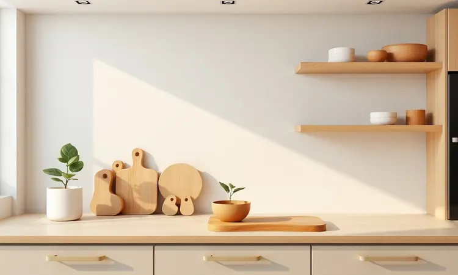
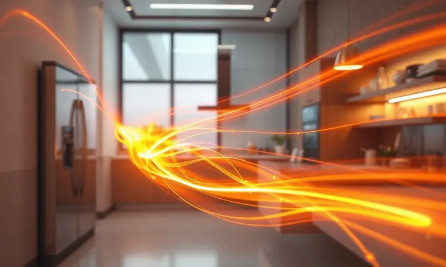

Procurando praticidade na cozinha? O Forno de Embutir Brastemp Elétrico com Função Air Fryer BOF84AR promete unir o melhor dos dois mundos: a robustez de um forno de embutir com a agilidade da fritura sem óleo.

Será que esse modelo realmente entrega o que promete ou é melhor comprar os aparelhos separadamente?

Nesta análise, vamos além das especificações técnicas para revelar como ele se comporta na prática, ajudando você a decidir se este eletrodoméstico merece espaço na sua rotina culinária.

<SummaryList products={frontmatter.top_products} />

## Descrição técnica do Forno de Embutir Brastemp BOF84AR

<ProductBox 
  title={frontmatter.top_products[0].title} 
  image={frontmatter.top_products[0].image} 
  link={frontmatter.top_products[0].link} 
/>

Imagine abrir um forno que comporta uma quantidade generosa de 84 litros. É espaço suficiente para um pernil inteiro, uma travessa enorme de lasanha ou várias assadeiras simultâneas.

O interior não é apenas espaçoso, ele é revestido com o metal esmaltado Cleartec, uma promessa de que as sujeiras do dia a dia escorregarão na hora da limpeza.

Mas o que realmente chama atenção são as 7 funções de preparo, com destaque para a Air Fryer. Pense em preparar batatas fritas crocantes usando apenas ar quente, dispensando litros de óleo.

Isso acontece na cesta exclusiva incluída, enquanto o sistema de convecção trabalha ao redor, distribuindo calor de forma inteligente para que cada canto receba atenção igual.

A praticidade aparece nos detalhes: 7 níveis de prateleiras ajustáveis permitem organizar desde assados altos até bandejas mais baixas, um timer digital com aviso sonoro que evita que você se perca em outras tarefas, e uma iluminação interna que transforma o monitoramento em algo similar a assistir seu prato finalizar no forno.

O design em inox integra facilmente à maioria das cozinhas modernas, mas você perceberá o volume. Com dimensões projetadas para nichos padrão, ele exige uma verificação prévia do espaço disponível antes da instalação.

E sua classificação energética A garante que, mesmo com toda essa tecnologia, a conta de luz não será uma preocupação excessiva.

<CaixaProsContras>

**Prós:**

- Função Air Fryer que permite fritar com pouco ou nenhum óleo.

- Grande capacidade ideal para famílias grandes.

- Sistema de convecção para cozimento uniforme.

- Design elegante em inox que se integra bem à decoração.

**Contras:**

- O peso pode dificultar a instalação por conta própria.

- Dimensões maiores requerem um nicho adequado, podendo limitar espaços menores.

</CaixaProsContras>

## Vantagens da proposta de aparelho 2 em 1

Combinar forno tradicional e air fryer em um único equipamento vai além do conceito de espaço economizado. É sobre simplificar sua relação com a cozinha, reduzindo a quantidade de aparelhos que exigem atenção e limpeza separadas.

### Economia de espaço na bancada da cozinha

Quando cada centímetro conta, ter um forno embutido que também funciona como air fryer significa recuperar área preciosa da bancada.

Enquanto ele trabalha discreto no nicho, você mantém livre a superfície para preparar saladas, organizar ingredientes ou simplesmente curtir uma cozinha mais arejada.

Para ambientes compactos, essa dupla funcionalidade elimina o dilema entre fritar sem óleo e abrir mão de espaço.

### Controle de tempo e precisão nas receitas

Esqueça o chute ao ajustar temperaturas. Com programação digital, você define exatamente quanto calor deseja e por quanto tempo.

Essa precisão transforma receitas complexas em processos intuitivos, onde o risco de ficar cru por dentro ou queimado por fora diminui consideravelmente.

O timer com alerta sonoro permite que você se dedique a outras preparações enquanto o forno cuida do tempo, combinando produtividade com resultados constantes.

### Facilidade de limpeza e manutenção do revestimento interno

Após um jantar com família, a última coisa que você deseja é enfrentar uma guerra contra gordura encrustada. O revestimento Cleartec funciona como uma barreira que repele respingos e derramamentos, transformando a limpeza em tarefa que demanda minutos, não esforço.

A estrutura interna evita cantos complicados onde a sujeira se esconderia, mantendo a sensação de ter um forno sempre renovado.

## Pontos de atenção antes da compra do forno com Air Fryer

Toda inovação exige adaptação. Antes de tomar a decisão, alguns aspectos práticos merecem sua atenção, especialmente se sua rotina envolve ritmos acelerados e expectativas específicas.

### Consumo de energia do forno elétrico Brastemp

Elétrico significa precisão, mas também demanda energia. A potência entre 2000 e 3000 watts se reflete na conta, embora a classificação A ajude a manter esse impacto sob controle.

A boa notícia: comparado com métodos tradicionais, a função Air Fryer pode representar economia, já que fritar com ar consome menos energia que manter uma panela com óleo quente por longo período. É uma troca que vale a análise do seu padrão de uso.

### Tempo de preparo comparado à Air Fryer tradicional

Se você está acostumado com a agilidade de uma air fryer compacta, prepare-se para um ritmo diferente. A capacidade maior significa que o aquecimento inicial pode levar alguns minutos adicionais, mas compensa com volume superior.

Enquanto uma air fryer tradicional lida com porções individuais, o BOF84AR prepara batatas fritas para a família toda de uma vez. O tempo por porção acaba equilibrado quando se considera o total produzido.

### Necessidade de supervisão constante durante o uso

Alto desempenho exige atenção, especialmente quando se trabalha com temperaturas intensas da função Air Fryer. Os alimentos alcançam o ponto ideal rapidamente, e alguns minutos de distração podem transformar crocância em carbonização.

Embora o timer ajude, a supervisão visual é recomendada, principalmente nas primeiras utilizações enquanto você compreende o comportamento do aparelho. É o tipo de cuidado que todo cozinheiro experiente conhece bem.

## Conclusão

O Forno de Embutir Brastemp BOF84AR com função Air Fryer não é apenas um eletrodoméstico, é uma redefinição do que você espera da sua cozinha.

Ele converte espaço ocupado em versatilidade, oferecendo desde assados tradicionais até frituras sem culpa, tudo em um equipamento que mantém o visual integrado.

Para famílias que valorizam refeições compartilhadas e diversidade no cardápio, a capacidade de 84 litros e o sistema de convecção criam novas possibilidades.

A função Air Fryer funciona como um bônus que moderniza preparos, enquanto o revestimento Cleartec garante que a limpeza não seja um obstáculo.

As considerações sobre espaço e consumo energético são reais, mas ponderadas contra o ganho de funcionalidade e organização.

Se sua cozinha comporta o volume e seu estilo de vida combina com a multifuncionalidade, esse forno representa um investimento que entrega exatamente o que promete: praticidade inteligente e sabores que valem cada minuto.

A decisão final depende de como você imagina seu dia a dia culinário: com aparelhos separados ou com um centro de preparos que unifica soluções. O BOF84AR oferece a segunda opção com competência e estilo.