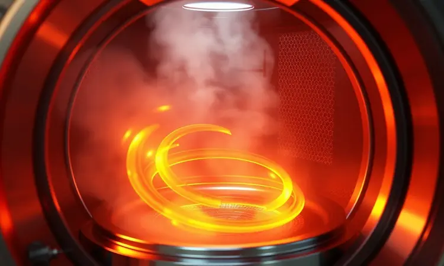
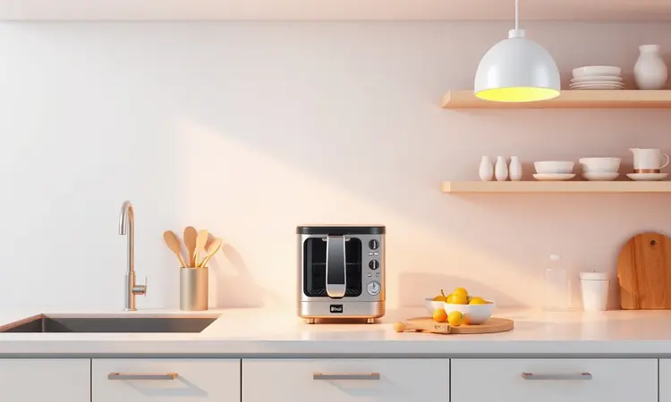
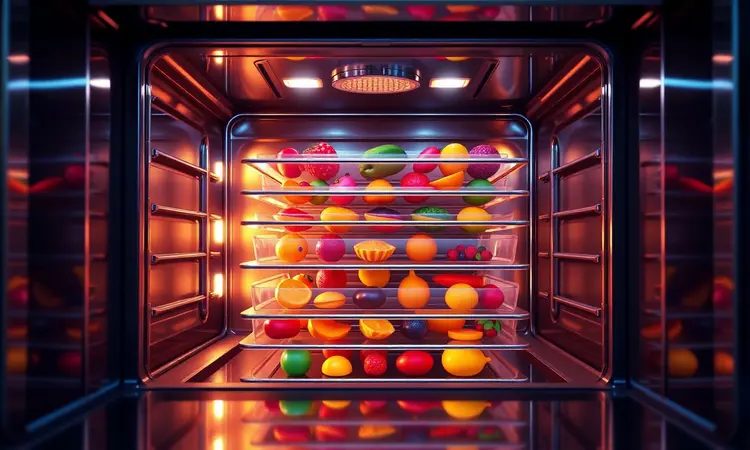

Imagine substituir pelo menos três eletrodomésticos na sua bancada por um único que promete fazer tudo: assar, grelhar e, o grande diferencial, fritar sem óleo.

É exatamente essa proposta que o forno com air fryer traz para sua cozinha, unindo a capacidade generosa de um forno tradicional com a praticidade da fritura saudável.

Mas será que esse 2 em 1 realmente entrega tudo o que promete, ou é apenas mais um gadget que vai ocupar espaço? Vamos mergulhar fundo nessa análise para descobrir se ele merece um lugar especial na sua rotina.

<SummaryList products={frontmatter.top_products} />

## O que é o forno com air fryer e como funciona a tecnologia 2 em 1

Pense nele como o melhor amigo da cozinha moderna: parte forno elétrico, parte fritadeira sem óleo.

O segredo está na circulação intensa de ar quente que envolve os alimentos por todos os lados, criando aquela crocância dourada que tanto amamos, mas com uma fração mínima da gordura.

É como se você tivesse um chef particular que sabe exatamente como transformar batatas, frangos e legumes em versões mais saudáveis sem perder o sabor. Essa versatilidade te permite assar um bolo, grelhar um filé e desidratar frutas para snacks, tudo no mesmo aparelho.

## Economia de espaço e versatilidade na bancada da cozinha

Se sua cozinha mais parece um quebra-cabeça onde cada centímetro conta, esse aparelho é a peça que faltava.

Ao juntar forno e air fryer em um único equipamento, você recupera espaço precioso na bancada e ganha tempo, eliminando a necessidade de trocar de aparelho entre uma receita e outra.

A verdadeira beleza está na praticidade: um minuto você está torrando pães para o café da manhã, no seguinte já está preparando batatas crocantes para o almoço, tudo sem limpar múltiplos equipamentos.

Para apartamentos e cozinhas compactas, essa unificação não é apenas conveniente, é transformadora.

## Comparativo técnico: Forno elétrico tradicional vs. Air Fryer Oven

Vamos à comparação direta: enquanto o forno elétrico tradicional brilha na capacidade de assar grandes quantidades de uma só vez, o forno com air fryer oferece velocidade e eficiência energética.

O segredo está no aquecimento: o forno convencional aquece todo o seu espaço interno, enquanto o modelo híbrido concentra o calor exatamente onde precisa, reduzindo o tempo de espera e o consumo de energia.

Mas atenção: se você precisa preparar um pernil inteiro para o almoço de domingo, o tamanho pode ser uma limitação. A escolha ideal depende do seu estilo de cozinhar: volume versus versatilidade e velocidade.

## Consumo de energia e eficiência térmica do aparelho híbrido

Aqui está um alívio para o bolso: esses aparelhos foram projetados para serem mais econômicos. Por cozinharem mais rápido e em temperaturas geralmente mais baixas, eles consomem menos energia do que um forno tradicional funcionando por horas.

Pense no preparo de frango assado: enquanto um forno convencional pode levar 60 minutos, o modelo com air fryer frequentemente reduz esse tempo pela metade.

Essa eficiência térmica não é apenas uma economia na conta de luz, mas também uma vitória para quem não gosta de esperar muito tempo para uma refeição pronta.

## Análise dos principais modelos de forno air fryer do mercado

Com tantas opções disponíveis, como escolher a certa? Vamos explorar os principais concorrentes para você encontrar aquele que se encaixa perfeitamente na sua rotina.

### Forno Air Fryer Midea

<ProductBox 
  title={frontmatter.top_products[0].title} 
  image={frontmatter.top_products[0].image} 
  link={frontmatter.top_products[0].link} 
/>

Você é do tipo que adora experimentar novas receitas? Os modelos Midea podem ser seus parceiros ideais. O Midea Flexify™ French Door Air Fryer Oven, com seus 26.4 litros e 10 funções diferentes, é como ter uma cozinha profissional em miniatura.

A tecnologia de convecção garante que seu frango fique dourado por igual, sem aquelas partes mais escuras que ninguém gosta.

Já o Midea 11 Qt 8-in-1 Smart Dual-Zone Air Fryer Oven leva a praticidade a outro nível: imagine preparar batatas fritas em uma zona enquanto grelha hambúrgueres na outra, tudo controlado pelo seu smartphone.

É verdade que alguns modelos podem ocupar um espaço considerável na bancada, mas para quem valoriza variedade e tecnologia, esse é um compromisso que vale a pena.

<CaixaProsContras>

**Prós:**

- Diversas opções de cozimento em um único aparelho.

- Cozinha de forma rápida e saudável com pouco óleo.

- Boa capacidade, ideal para famílias.

- Controles digitais intuitivos.

**Contras:**

- Modelos podem ser volumosos, exigindo espaço extra na cozinha.

- Alguns modelos têm preço elevado em comparação a fornos convencionais.

</CaixaProsContras>

### Forno Air Fryer Oster

<ProductBox 
  title={frontmatter.top_products[1].title} 
  image={frontmatter.top_products[1].image} 
  link={frontmatter.top_products[1].link} 
/>

Procurando equilíbrio entre tamanho e funcionalidade? A Oster acerta na medida com modelos como o Oster Digital RapidCrisp, projetado para quem não quer abrir mão da saúde mas também não tem espaço para equipamentos gigantes.

A tecnologia reduz o uso de óleo em até 99,5% comparado às fritadeiras tradicionais, o que significa servir batatas crocantes sem aquela culpa.

Se sua cozinha é compacta, os designs mais enxutos da marca são um respiro. Sim, a capacidade pode limitar preparações muito grandes, mas para o dia a dia de casais ou pequenas famílias, essa versatilidade em tamanho reduzido é exatamente o que muitos precisam.

<CaixaProsContras>

**Prós:**

- Versatilidade com múltiplas funções de cozimento.

- Tecnologia que reduz o uso de óleo, promovendo pratos mais saudáveis.

- Design moderno e compacto, ideal para cozinhas pequenas.

- Modelos com capacidade variada, atendendo diferentes necessidades.

**Contras:**

- Alguns modelos podem ter capacidade limitada para grandes refeições.

- A variedade de funções pode ser confusa para quem prefere simplicidade.

</CaixaProsContras>

### Forno Air Fryer Philco

<ProductBox 
  title={frontmatter.top_products[2].title} 
  image={frontmatter.top_products[2].image} 
  link={frontmatter.top_products[2].link} 
/>

Se potência e agilidade são suas prioridades, a Philco impressiona com modelos como o PFR2200P e seus 1800W. Isso se traduz em tempo real: imagine ter batatas fritas crocantes em minutos, não em meia hora.

Com 9 funções pré-programadas, você praticamente tem receitas prontas ao toque de um botão.

Os acessórios incluídos, como cestos antiaderentes, tornam a experiência ainda mais prática. É verdade que famílias maiores podem achar a capacidade um pouco limitada para preparar tudo de uma vez, mas a velocidade de cozimento compensa permitindo rodadas rápidas.

<CaixaProsContras>

**Prós:**

- Alta potência que garante cozimento rápido.

- Vários modos de preparo para diferentes receitas.

- Design moderno e fácil de manusear.

- Acessórios úteis incluídos no pacote.

**Contras:**

- Limitação na capacidade para grandes famílias.

- Pode levar algum tempo para se acostumar com as funções digitais.

</CaixaProsContras>

### Forno Air Fryer Multi

<ProductBox 
  title={frontmatter.top_products[3].title} 
  image={frontmatter.top_products[3].image} 
  link={frontmatter.top_products[3].link} 
/>

Para quem não quer compromissos e busca máxima versatilidade, os modelos multifuncionais são a resposta.

Com capacidades que variam de 12 a impressionantes 80 litros, há opção para todos os cenários: do solteiro que recebe amigos ao fim de semana até a família grande que adora reunir todos à mesa.

Além da fritura sem óleo, muitos incluem convecção, grill e até cozimento a vapor.

Sim, a limpeza pode ser um pouco mais trabalhosa devido aos múltiplos componentes, mas a capacidade de transformar sua cozinha em um verdadeiro restaurante caseiro compensa esse pequeno esforço.

<CaixaProsContras>

**Prós:**

- Versatilidade para preparar diversos tipos de pratos.

- Capacidade variada para atender diferentes tamanhos de família.

- Recursos adicionais que otimizam o cozimento.

- Economia de tempo na preparação das refeições.

**Contras:**

- Pode ser mais complexo na limpeza do que fornos tradicionais.

- Alguns modelos são mais pesados e ocupam mais espaço.

</CaixaProsContras>

## Capacidade interna e funções extras: desidratar e tostar alimentos

Pense na última vez que você quis fazer snacks saudáveis para as crianças ou tostar pães para um café especial. A capacidade interna do seu aparelho faz toda diferença aqui.

Modelos maiores permitem preparar um frango inteiro ou desidratar várias maçãs de uma vez, enquanto as funções extras abrem um mundo de possibilidades.

A desidratação transforma frutas em chips crocantes naturais, perfeitas para lanches sem culpa. Já a função tostar dá aquele acabamento dourado em pães e queijos que fazem qualquer refeição parecer de restaurante.

Se você adora experimentar na cozinha, essas características não são apenas extras, são passaportes para a criatividade culinária.

## Facilidade de limpeza e manutenção do forno air fryer

Vamos falar da parte que ninguém gosta, mas todos precisam fazer: a limpeza. A boa notícia é que esses aparelhos foram pensados para minimizar o trabalho.

Peças removíveis vão direto para a lava-louças, e a redução drástica no uso de óleo significa menos gordura espirrada e grudada.

Manter seu forno em bom estado é simples: uma limpeza regular das superfícies internas evita acúmulos e garante que cada receita saia perfeita.

É aquela manutenção básica que, feita regularmente, previne problemas maiores no futuro e mantém seu investimento funcionando como novo por anos.

## Tempo de preparo e a necessidade de supervisão constante

Aqui está o verdadeiro teste: enquanto a maioria dos modelos reduz o tempo de cozimento em até 30% comparado aos fornos tradicionais, alguns exigem um olho mais atento.

Por trabalharem com temperaturas altas e circulação intensa de ar, certos alimentos podem passar do ponto rapidamente se deixados sem supervisão.

É uma troca interessante: você ganha minutos preciosos no preparo, mas perde um pouco daquela liberdade de colocar algo no forno e esquecer. Para quem está sempre na cozinha acompanhando o processo, isso não é problema.

Mas se você é do tipo que adora colocar algo para assar e aproveitar para fazer outras coisas, pode precisar ajustar sua rotina.

## Veredito final: O forno com air fryer vale a pena para você?

A resposta depende profundamente do seu estilo de vida. Se sua cozinha é pequena, você valoriza refeições mais saudáveis e adora a praticidade de múltiplas funções em um só equipamento, esse aparelho pode ser revolucionário.

Ele transforma o preparo de alimentos em algo mais ágil, versátil e, sim, mais saudável.

Por outro lado, se você já tem um forno de qualidade que atende bem suas necessidades e raramente se aventura em receitas que exigem fritura, o investimento pode não se justificar.

A verdadeira pergunta é: quantas vezes por semana você imagina usando essas funções extras?

## Conclusão

O forno com air fryer não é apenas mais um eletrodoméstico, é uma redefinição do que esperamos da nossa cozinha. Ele responde a um desejo moderno: comer bem, de forma prática, sem ocupar todo o espaço disponível.

Seja preparando batatas crocantes para as crianças, assando um bolo rapidinho para uma visita inesperada ou desidratando frutas para lanches saudáveis, ele oferece uma versatilidade que poucos equipamentos conseguem igualar.

Sua escolha final deve refletir não apenas o espaço na sua bancada, mas também o espaço que a culinária ocupa na sua rotina.

Para quem busca otimizar tempo, saúde e funcionalidade, esse 2 em 1 pode ser o parceiro perfeito para transformar momentos na cozinha em experiências mais prazerosas e criativas.

O verdadeiro valor não está apenas no que ele faz, mas em como ele se adapta ao jeito que você vive e cozinha.