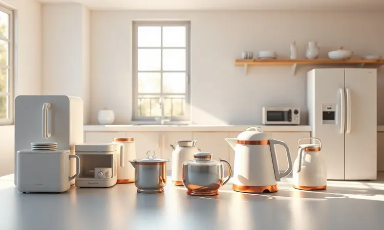

A busca por uma alimentação mais saudável sem abrir mão da praticidade colocou as fritadeiras elétricas no topo dos desejos dos brasileiros.

Recentemente, a marca Gaabor começou a ganhar destaque no mercado nacional com designs elegantes, propostas tecnológicas e preços competitivos. No entanto, diante de tantas opções consagradas, a dúvida é inevitável: a Air Fryer Gaabor é boa mesmo ou é apenas aparência?

Neste artigo, vamos mergulhar na reputação da marca, analisar o desempenho técnico, consumo de energia e durabilidade, além de listar os modelos que realmente valem o investimento para você decidir com segurança.

<SummaryList products={frontmatter.top_products} />

## Air Fryer Gaabor é boa? Entenda a marca

Imagine abrir caixas de pizza vazias no fim de semana porque a fritadeira tradicional te deixa com aquela sensação de peso no estômago. A Gaabor entrou no mercado justamente com essa promessa: trazer o crocante e o sabor que amamos, mas sem o arrependimento.

O que muita gente não sabe é que essa marca não chegou ontem: ela já conquistou adeptos pela consistência em oferecer resultados que realmente funcionam na rotina corrida.

O segredo está na tecnologia de circulação de ar quente que eles utilizam nos modelos, mas aqui vai algo que as especificações técnicas não contam: essa não é apenas uma questão de 'baterias mais fortes' ou 'motores mais rápidos'.

É sobre proporcionar uma experiência culinária tão simples que você se pergunta como cozinhou sem isso antes. Usuários relatam a facilidade de limpeza não como um benefício adicional, mas como um divisor de águas em noites de semana cheias.

O design moderno que você vê nas fotos? Ele realmente tem propósito: ocupa menos espaço que um forno tradicional, liberando sua bancada para o que realmente importa: cozinhar.

## Análise de Desempenho, Reputação e Consumo de Energia

E o que dizem as pessoas que passaram pela experiência? Aqui está onde a Gaabor se diferencia de marcas que só vendem promessas. Usuários frequentemente destacam uma característica que poucos mencionam: a consistência.

Não é sobre fazer batatas crocantes em um dia e falhar no outro; é sobre repetir o sucesso de segunda a segunda, seja você um cozinheiro experiente ou alguém que está começando a jornada por uma alimentação mais equilibrada.

Quando o assunto é consumo de energia, a comparação natural é com o forno tradicional. Mas vamos além dos números: não se trata apenas de economizar alguns reais na conta de luz no fim do mês.

É sobre a liberdade de usar um eletrodoméstico sem aquela hesitação de 'será que vale a pena ligar só para isso?'.

As air fryers da Gaabor aquecem em minutos, não em quartos de hora, transformando aquela vontade de um lanche saudável em realidade, não em um projeto que precisa de planejamento.

A reputação da marca se constrói nesses detalhes: nas avaliações que mencionam como o produto sobreviveu a meses de uso intensivo, nas famílias que descobriram que é possível fazer jantares completos sem estressar, e na surpresa genuína de quem achou que 'menos óleo' significaria 'menos sabor'.

## Tabela comparativa da Air Fryer Gaabor

Antes de mergulharmos nos modelos específicos, é importante entender que a Gaabor não oferece uma solução única para todos.

Cada produto foi pensado para um estilo de vida diferente, e entender essas diferenças é o que faz com que você não apenas compre uma air fryer, mas encontre a parceira ideal para sua cozinha.

A diversidade vai desde o tamanho físico até funcionalidades que podem simplificar seu dia ou se tornar recursos que você nunca usaria.

Pense nisso como escolher um parceiro de dança: você precisa que os passos combinem com o seu ritmo. Uma família que prepara grandes refeições precisa de mais espaço, enquanto quem mora sozinho pode priorizar a economia de espaço.

O que todos os modelos compartilham, no entanto, é a filosofia central da marca: eficiência que se traduz em resultados reais, não apenas em números em uma caixa.

## Melhor air fryer Gaabor: veja os modelos em destaque

Se você está se perguntando qual modelo da Gaabor realmente merece um espaço na sua cozinha, a resposta depende mais da sua rotina do que de rankings abstratos.

Separamos os principais modelos disponíveis em 2025, mas com um olhar diferente: qual deles se encaixa na sua vida, não apenas na sua lista de compras.

### 1. Air Fryer Gaabor Vintage 5,5L

<ProductBox 
  title={frontmatter.top_products[0].title} 
  image={frontmatter.top_products[0].image} 
  link={frontmatter.top_products[0].link} 
/>

Para quem sonha com aquela cozinha de revista, mas não quer abrir mão da funcionalidade, a Vintage 5,5L apresenta uma proposta incomum: ela não apenas cozinha bem, ela embeleza o ambiente.

Com capacidade para alimentar famílias inteiras (até quatro pessoas com tranquilidade), ela resolve o dilema de quem precisa de praticidade sem parecer que instalou uma fábrica sobre a bancada.

Imagine preparar batatas assadas enquanto conversa com a família na sala, sabendo que o desligamento automático está cuidando da segurança, e que ao final, apenas um enxágue rápido vai resolver a limpeza.

A potência de 1400W pode parecer um dado técnico, mas na prática significa que o jantar não será um evento que precisa ser programado com horas de antecedência.

O que você precisa considerar: se você é daqueles que ama experimentar receitas complexas com múltiplos estágios, os controles analógicos podem limitar sua precisão.

Mas se valoriza simplicidade e resultados consistentes, essa limitação se transforma em vantagem: não há como errar.

<CaixaProsContras>

**Prós:**

- Design vintage atraente

- Capacidade generosa de 5,5 litros

- Tecnologia de circulação de ar para cozimento uniforme

- Fácil limpeza com cesto antiaderente

**Contras:**

- Recursos adicionais limitados

- Controles apenas analógicos

</CaixaProsContras>

### 2. Air Fryer Gaabor GA-E45A0 4L

<ProductBox 
  title={frontmatter.top_products[1].title} 
  image={frontmatter.top_products[1].image} 
  link={frontmatter.top_products[1].link} 
/>

Agora, se você olha para sua cozinha e vê um espaço que precisa de tecnologia que se comunique de forma clara, o modelo GA-E45A0 pode ser sua resposta. O painel digital não é apenas um 'upgrade estético', é uma mudança na forma como você interage com o eletrodoméstico.

Ajustar temperatura e tempo se torna tão intuitivo quanto usar seu smartphone, eliminando aquelas tentativas e erros que acontecem quando você está com pressa.

Com 4 litros de capacidade, ela atende bem casais ou pequenas famílias, mas aqui está um insight que ninguém menciona: muitas vezes, cozinhamos porções menores do que imaginamos.

A limpeza facilitada (sim, as peças vão à lava-louças) transforma o 'pós-festa' em um processo de minutos, não de dedicação.

A tecnologia Cyclone Air garante que cada pedaço de frango receba o mesmo carinho térmico, eliminando aquela frustração de encontrar partes mal cozidas. O que você perde em capacidade máxima, ganha em otimização de espaço e elegância discreta.

<CaixaProsContras>

**Prós:**

- Cozimento uniforme com tecnologia Cyclone Air.

- Painel digital intuitivo para ajustes fáceis.

- Design moderno que se adapta a qualquer cozinha.

- Limpeza simples com peças antiaderentes.

**Contras:**

- Capacidade limitada para porções grandes.

- Ocupa um espaço considerável na bancada.

</CaixaProsContras>

### 3. Mini Air Fryer Gaabor AF20M 1,4L

<ProductBox 
  title={frontmatter.top_products[2].title} 
  image={frontmatter.top_products[2].image} 
  link={frontmatter.top_products[2].link} 
/>

Para apartamentos pequenos, estudantes ou casais que valorizam espaço precioso, a Mini AF20M é mais do que uma versão reduzida: é uma filosofia diferente. Com apenas 1,4 litros, ela desafia a ideia de que precisamos de grandes aparelhos para comer bem.

Os 8 menus pré-programados não são apenas botões extras; são atalhos para noites cansativas quando a criatividade culinária está no mínimo.

A segurança embutida (desligamento automático quando aberta) pode parecer um detalhe técnico, mas é a tranquilidade que permite deixar o aparelho funcionando enquanto você atende o telefone ou confere algo rápido.

Para quem vive sozinho ou divide o espaço com uma pessoa, essa mini air fryer se transforma no companheiro perfeito para experimentos culinários sem comprometer metade da bancada.

A limitação de capacidade é real: se você costuma receber amigos para jantares, essa pode não ser a melhor escolha. Mas para refeições cotidianas saudáveis e rápidas, ela é mais do que suficiente.

<CaixaProsContras>

**Prós:**

- Compacta e elegante, ideal para espaços pequenos.

- Tecnologia de circulação de ar que promove resultados crocantes.

- Vários menus pré-programados para comodidade no preparo.

- Fácil de limpar devido ao cesto antiaderente.

**Contras:**

- Capacidade limitada, pode não atender grandes famílias.

- O controle analógico pode ser menos intuitivo do que modelos digitais.

</CaixaProsContras>

### 4. Air Fryer Gaabor Touch Lumen 5,5L

<ProductBox 
  title={frontmatter.top_products[3].title} 
  image={frontmatter.top_products[3].image} 
  link={frontmatter.top_products[3].link} 
/>

Agora, imagine poder acompanhar seu frango assando sem abrir a tampa e interromper o cozimento. É exatamente essa experiência que o Touch Lumen oferece, com seu visor transparente iluminado.

Este não é apenas um aparelho para cozinhar; é um convite para se envolver no processo culinário sem interferir nele.

Com capacidade para famílias de até quatro pessoas, ela equilibra sofisticação tecnológica com praticidade real. O painel touchscreen não precisa de manual: ele é tão intuitivo quanto parece nas fotos.

Quando você investe um pouco mais em um modelo como esse, está pagando por aquela sensação de 'funciona exatamente como eu imaginei' que produtos mais básicos nem sempre entregam.

Preste atenção à assistência técnica na sua região, pois essa é uma consideração importante para qualquer eletrodoméstico de maior valor.

Mas para quem busca a experiência premium em fritadeiras sem óleo, o Touch Lumen representa o topo da linha Gaabor em termos de integração entre tecnologia e usabilidade.

<CaixaProsContras>

**Prós:**

- Capacidade ideal para famílias de até 4 pessoas.

- Painel digital touchscreen intuitivo.

- Tecnologia Cyclone Air para cozimento uniforme.

- Visor transparente que permite monitorar os alimentos durante o preparo.

**Contras:**

- Assistência técnica pode ser limitada em algumas regiões.

- Preço mais elevado em comparação a modelos básicos.

</CaixaProsContras>

### 5. Air Fryer Gaabor Retrô 3,5L

<ProductBox 
  title={frontmatter.top_products[4].title} 
  image={frontmatter.top_products[4].image} 
  link={frontmatter.top_products[4].link} 
/>

Às vezes, o charme está nos detalhes que nos lembram de outras épocas, e a versão Retrô da Gaabor entende perfeitamente esse sentimento. Disponível em cores como cinza e vermelho, ela não é apenas um eletrodoméstico; é uma declaração de estilo.

Se você se identifica com decorações que misturam moderno e vintage, essa air fryer pode ser o elemento que faltava.

Com 3,5 litros, ela atende perfeitamente pequenas famílias ou quem cozinha porções menores com mais frequência. A tecnologia Cyclone Air funciona com a mesma eficiência dos modelos mais caros, provando que estilo não precisa sacrificar desempenho.

Os botões analógicos têm uma textura e feedback que os controles digitais não conseguem reproduzir, oferecendo uma experiência tátil que muitos apreciam.

Um cuidado: o revestimento antiaderente, como em muitos produtos do mercado, pode mostrar desgaste com o tempo se não for tratado com carinho. O uso de forros de silicone (vendidos separadamente) pode prolongar significativamente a vida útil do cesto.

<CaixaProsContras>

**Prós:**

- Design retrô atraente que combina com diversos estilos de cozinha.

- Tecnologia Cyclone Air para cozimento uniforme.

- Controles analógicos simples e intuitivos.

- Opções de programações culinárias pré-definidas para praticidade.

**Contras:**

- O revestimento antiaderente pode descascar com o tempo.

- A numeração dos botões pode desgastar com o uso frequente.

</CaixaProsContras>

### 6. Air Fryer Gaabor com Visor

<ProductBox 
  title={frontmatter.top_products[5].title} 
  image={frontmatter.top_products[5].image} 
  link={frontmatter.top_products[5].link} 
/>

Se você já passou pela frustração de abrir a air fryer para verificar o ponto e perceber que interrompeu o cozimento, sabe exatamente por que os modelos com visor existem.

A Gaabor oferece opções que transformam a tentativa e erro em observação científica: você acompanha o dourado da batata se formando sem interferir no processo.

Modelos como a Lume Touchscreen com seus 5,5 litros ou a GA-50E02A de 4,5 litros compartilham essa filosofia: transparência literal e figurativa.

Não é apenas sobre ver o que está acontecendo; é sobre entender como os alimentos reagem ao calor circulante, aprendendo intuitivamente sobre tempos e temperaturas.

É verdade que algumas concorrentes de preço mais elevado podem oferecer funções ainda mais avançadas, mas aqui está a questão: quantas dessas funções você realmente usaria?

A combinação do visor com o sistema Cyclone Air já resolve a grande maioria das necessidades cotidianas, eliminando o palpite e substituindo-o por certeza.

<CaixaProsContras>

**Prós:**

- Visor que facilita o acompanhamento do cozimento.

- Funções variadas para diferentes tipos de alimentos.

- Design moderno e intuitivo.

- Sistema Cyclone Air para aquecimento uniforme.

**Contras:**

- Pode não ter tantas funções avançadas quanto modelos mais caros.

- Capacidade limitada em comparação a algumas concorrentes.

</CaixaProsContras>

## Como escolher a melhor air fryer Gaabor para sua cozinha

Depois de conhecer os modelos, a escolha se resume a três perguntas honestas que você precisa fazer para si mesmo. Primeiro: quantas pessoas você alimenta regularmente? Não no 'evento especial do domingo', mas na terça-feira comum.

Segundo: quanto espaço real você tem disponível, considerando não apenas o espaço físico, mas também como o aparelho se integra ao seu fluxo na cozinha? Terceiro: qual é o seu nível de paciência com tecnologia?

Algumas pessoas amam telas touch e menus digitais, outras preferem a simplicidade de girar um botão e pronto.

A potência do aparelho importa, mas de uma forma diferente do que você imagina: modelos mais potentes não apenas esquentam mais rápido, mas mantêm a temperatura com mais estabilidade quando você adiciona alimentos frios.

E sobre a facilidade de limpeza: pergunte-se quantas vezes por semana você realmente lava panelas à mão versus quantas vezes coloca na lava-louças. A resposta pode direcionar você para modelos com componentes mais ou menos removíveis.

## FAQ – Perguntas frequentes sobre Air Fryer Gaabor

Quando as pessoas descobrem as air fryers da Gaabor, algumas dúvidas sempre surgem, e elas são mais profundas do que parecem.

A primeira questão costuma ser sobre a crocância: 'será que realmente fica igual à fritura tradicional?' A resposta interessante não é apenas 'sim', mas 'depende do que você valoriza no crocante'. Se você busca aquela textura oleosa e pesada, talvez não.

Mas se quer o crocante sem aquela sensação de que está comendo óleo, então sim, fica até melhor.

Outra dúvida comum é sobre a limpeza, e aqui a verdade é que a maioria subestima o impacto de ter peças que realmente saem para lavar. Não é sobre 'ser fácil', é sobre não precisar de escovas especiais ou movimentos acrobáticos para alcançar cantos inacessíveis.

A versatilidade de receitas também surpreende: muitas pessoas começam com batatas e frango e descobrem que podem fazer desde bolos até vegetais assados com resultados que um forno convencional demoraria muito mais para alcançar.

## Conclusão

Ao final dessa jornada pelos modelos Gaabor, uma coisa fica clara: essa não é uma marca que apenas vende eletrodomésticos, mas sim soluções para dilemas cotidianos que nem sempre verbalizamos.

A escolha entre uma air fryer Vintage ou uma Lumen Touchscreen não é sobre qual é 'melhor' em termos absolutos, mas sobre qual conversa com o seu ritmo de vida, seus valores estéticos e suas prioridades práticas.

O que a Gaabor oferece, em sua essência, é uma ponte entre o desejo por uma alimentação mais leve e a realidade de uma rotina que não permite horas na cozinha.

Os modelos variam em preço e características, mas compartilham uma filosofia comum: tecnologia que serve às pessoas, não o contrário.

Se você está buscando uma air fryer que entregue resultados consistentes, seja fácil de limpar e se adapte ao seu espaço, a linha Gaabor merece sua consideração séria.

A pergunta final não é se 'vale a pena', mas qual desses modelos vai se tornar aquele companheiro silencioso que transforma refeições em experiências, não em obrigações.