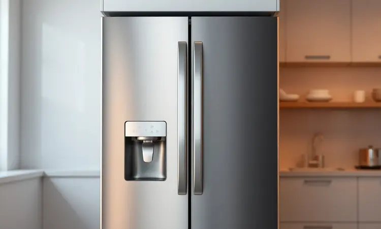
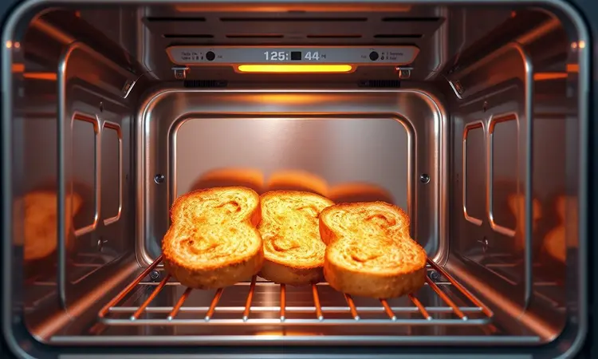
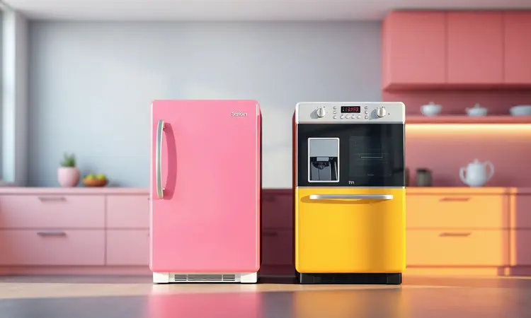

A marca Hamilton Beach é sinônimo de qualidade e durabilidade na cozinha, e suas fritadeiras sem óleo não são exceção.

Se você busca a melhor air fryer Hamilton Beach, este guia completo traz uma análise detalhada dos modelos mais bem avaliados do mercado, como a linha Sure-Crisp e a versão Digital.

Vamos explorar desde as especificações técnicas até o desempenho prático de cada aparelho, ajudando você a decidir qual dessas opções se adapta melhor às suas necessidades diárias, garantindo praticidade, versatilidade no preparo de receitas e saúde para toda a sua família.

<SummaryList products={frontmatter.top_products} />

## As Melhores Air Fryers da Hamilton Beach para Comprar em 2025

As Air Fryers da Hamilton Beach são conhecidas por sua eficiência e versatilidade. Em 2025, destacam-se modelos que combinam funções de fritura, grelhados e assados, oferecendo praticidade e resultados saborosos para o dia a dia.

### 1. Hamilton Beach Sure-Crisp Air Fryer Toaster Oven Combo (31403)

<ProductBox 
  title={frontmatter.top_products[0].title} 
  image={frontmatter.top_products[0].image} 
  link={frontmatter.top_products[0].link} 
/>

Imagina ter um único aparelho capaz de substituir vários na sua cozinha. O Hamilton Beach Sure-Crisp Air Fryer Toaster Oven Combo (31403) oferece exatamente isso, combinando funções de fritura a ar, tostar, assar e grelhar em um design compacto.

Você pode passar de batatas fritas crocantes para um frango inteiro sem precisar trocar de eletrodoméstico, tudo com o mesmo equipamento que ocupa apenas um cantinho da sua bancada.

Com capacidade para até quatro fatias de pão ou uma pizza de 9 polegadas, esse modelo se adapta perfeitamente a pequenas famílias.

O sistema de convecção promete cozimento uniforme, embora alguns usuários notem que certos alimentos podem precisar ser girados durante o preparo para garantir que todos os lados fiquem igualmente dourados.

Ainda assim, sua construção em aço inox e controles simples tornam a experiência diária tão prática quanto agradável.

<CaixaProsContras>

**Prós:**

- Versatilidade com múltiplas funções em um único aparelho.

- Capacidade suficiente para preparar refeições para pequenas famílias.

- Boa relação custo-benefício pela qualidade oferecida.

- Design compacto, ideal para cozinhas menores.

**Contras:**

- Distribuição de calor pode ser desigual durante o assado.

- A leitura dos controles pode ser difícil devido ao tamanho da fonte.

</CaixaProsContras>

### 2. Hamilton Beach Sure-Crisp 31196FG

<ProductBox 
  title={frontmatter.top_products[1].title} 
  image={frontmatter.top_products[1].image} 
  link={frontmatter.top_products[1].link} 
/>

Quando você precisa alimentar uma família maior sem abrir mão da praticidade, o Hamilton Beach Sure-Crisp 31196FG surge como solução.

Este forno elétrico com função de fritadeira sem óleo oferece seis modos de cozimento, incluindo o exclusivo modo Sure-Crisp que circula ar quente para deixar os alimentos crocantes com pouco ou nenhum óleo.

A capacidade extra grande impressiona: imagine acomodar um peru de até 12 libras ou preparar seis hambúrgueres simultaneamente para um almoço de domingo. Os controles manuais são intuitivos, facilitando a seleção do modo de cozimento e ajuste de tempo.

Um detalhe a considerar é que os tempos de fritura podem ser mais longos que em fritadeiras convencionais, mas o resultado final em sabor e saúde compensa essa pequena espera.

<CaixaProsContras>

**Prós:**

- Versatilidade com múltiplas funções de cozimento.

- Modo de fritura saudável com pouca gordura.

- Grande capacidade para preparações em família.

- Controles manuais fáceis de usar.

**Contras:**

- Tempos de fritura podem ser mais longos.

- Pode não substituir completamente uma fritadeira convencional para alguns usuários.

</CaixaProsContras>

### 3. Hamilton Beach 11.6qt Digital Hot Air Fryer

<ProductBox 
  title={frontmatter.top_products[2].title} 
  image={frontmatter.top_products[2].image} 
  link={frontmatter.top_products[2].link} 
/>

O conceito de seis eletrodomésticos em um só se torna realidade com o Hamilton Beach 11.6qt Digital Hot Air Fryer. Além de fritadeira a ar, ele funciona como forno tostador, assador, forno para pizza, desidratador e sanduicheira.

Com 1700 watts de potência, ele cozinha alimentos de maneira eficiente e rápida, enquanto a capacidade de 11,6 litros permite preparar desde um frango de 5 lb até uma pizza de 9 polegadas.

Oito opções de cozimento pré-programadas e um painel digital simplificam o processo, mesmo para quem está começando na cozinha. Usuários relatam que o aparelho pode inclinar levemente ao abrir a porta, embora isso não comprometa a funcionalidade.

A limpeza pode exigir atenção extra em alguns componentes, mas a combinação de versatilidade e desempenho faz com que muitos considerem esses pequenos desafios insignificantes perto dos benefícios.

<CaixaProsContras>

**Prós:**

- Versatilidade com múltiplas funções em um só aparelho.

- Cozinha alimentos rapidamente e de maneira uniforme.

- O design moderno facilita a visualização do interior durante o uso.

- Inclui várias prateleiras para preparar diferentes alimentos ao mesmo tempo.

**Contras:**

- Pode inclinar-se levemente quando a porta está aberta.

- A limpeza pode ser desafiadora para alguns usuários.

</CaixaProsContras>

## Hamilton Beach Digital Air Fryer: key specs

Quando falamos em controle preciso e consistência, a Hamilton Beach Digital Air Fryer se destaca como uma combinação eficiente de forno e fritadeira.

Sua capacidade para assar, fritar e tostar oferece uma forma prática de preparar refeições saudáveis, enquanto o painel digital permite ajustar temperatura e tempo de cozimento com exatidão.

A tecnologia de circulação de ar quente cozinha os alimentos de maneira uniforme, reduzindo drasticamente a necessidade de óleo.

## Hamilton Beach Digital Air Fryer: Design

Mas os números técnicos ganham vida através de um design que combina funcionalidade e estética moderna.

O acabamento em aço inoxidável traz um visual elegante que se integra a qualquer cozinha, enquanto o painel digital intuitivo transforma o ajuste de temperatura e tempo em uma experiência simples.

Luzes indicadoras e botões bem posicionados garantem que você não precise decifrar manuais complicados, e o formato compacto, ainda assim generoso em capacidade, mostra que estilo e praticidade podem coexistir harmoniosamente.

## Hamilton Beach Digital Air Fryer: Performance

Onde realmente importa, na performance diária, essa fritadeira cumpre sua promessa de versatilidade e eficiência.

A tecnologia de ar quente entrega alimentos crocantes com fração do óleo tradicional, enquanto o sistema intuitivo permite que você explore uma variedade de receitas sem ansiedade.

A capacidade generosa torna possível cozinhar porções para toda a família em uma única fornada, transformando-a em uma parceira valiosa para quem busca praticidade sem comprometer o sabor no dia a dia.

## Features:

Voltando ao primeiro modelo, o Hamilton Beach Sure-Crisp Air Fryer Toaster Oven Combo revela suas características mais notáveis quando observamos como elas funcionam em conjunto.

### Powerful Air Circulation for Evenly Browned Food with Little to No Oil

Imagine tirar da sua air fryer batatas fritas tão douradas e crocantes que parecem saídas de um restaurante, mas sem aquele peso no estômago depois.

Essa é a experiência proporcionada pela tecnologia de circulação de ar potente da Hamilton Beach Sure-Crisp, que garante cocção uniforme com pouco ou nenhum óleo.

Você obtém aquela textura que ama em alimentos fritos, mantendo a saúde em primeiro lugar e ainda economizando nos ingredientes.

### 4 Versatile Cooking Options

Um único aparelho que se transforma conforme sua necessidade: air fryer para frituras saudáveis, forno tostador para assados perfeitos, função de aquecimento que mantém a comida quentinha até a hora de servir e opção de descongelamento que economiza tempo precioso na correria do dia a dia.

Essas quatro opções de cozimento tornam o preparo de refeições muito mais fluido, eliminando a necessidade de múltiplos eletrodomésticos que ocupam espaço e complicam a organização.

### 4 Slice Capacity Provides Plenty of Cooking Space

Pense na cena: família reunida para o café da manhã, todos querendo torradas quentes ao mesmo tempo. Com capacidade para até quatro fatias de pão, esse forno tostador resolve essa situação sem exigir múltiplas fornadas, mantendo todos satisfeitos simultaneamente.

O design compacto significa que você ganha essa funcionalidade extra sem sacrificar espaço na bancada, mantendo sua cozinha organizada e funcional mesmo durante os preparativos mais movimentados.

## Buy it if...

Esse aparelho foi feito para você se busca mais que um simples forno tostador. Se a ideia de ter múltiplas funções em um único equipamento, economizando espaço e tempo, ressoa com seu estilo de vida, ele se encaixa perfeitamente.

Para quem valoriza refeições mais saudáveis sem abrir mão do sabor, ou para quem precisa de praticidade na rotina culinária sem complicações, essa combinação de air fryer e forno representa um investimento inteligente na sua cozinha.

## Don't buy it if...

Por outro lado, mantenha suas expectativas alinhadas: se você busca aquela crocância intensa e profunda que só uma fritadeira convencional com imersão total em óleo consegue entregar, talvez sinta que algo falta.

Espaço extremamente limitado na bancada também pode ser um fator decisivo, assim como a necessidade de funções de cozimento ultra-especializadas além das básicas e versáteis que o aparelho oferece.

## How does the Hamilton Beach Digital Air Fryer compare?

No cenário concorrido das fritadeiras sem óleo, a Hamilton Beach Digital Air Fryer encontra seu espaço único. Ela equilibra desempenho robusto com a conveniência do digital, oferecendo controle preciso onde outras marcas podem economizar.

Em relação à concorrência, destaca-se pela capacidade de adaptar-se a cozinhas menores sem sacrificar funcionalidade, e pelo equilíbrio entre tempo de cozimento e qualidade dos resultados.

Para quem transita entre a praticidade do dia a dia e a busca por alimentação mais saudável, ela representa uma ponte sólida entre esses dois mundos.

## Warranty & Support

A tranquilidade de saber que seu investimento está protegido é parte da experiência Hamilton Beach. A garantia padrão cobre defeitos de fabricação e problemas de desempenho, e registrar seu produto logo após a compra garante acesso completo a esses benefícios.

O suporte ao cliente, acessível através do site oficial, recebe elogios frequentes pela prontidão e eficácia na solução de questões, mostrando que a empresa está presente não apenas na venda, mas em todo o ciclo de uso do produto.

## Conclusão

Escolher a melhor air fryer Hamilton Beach envolve mais do que comparar especificações técnicas. Trata-se de encontrar o equilíbrio perfeito entre suas necessidades específicas na cozinha, seu espaço disponível e o tipo de experiência culinária que você deseja criar.

Seja a versatilidade do Sure-Crisp Oven Combo para quem precisa de múltiplas funções em pouco espaço, a capacidade generosa do 31196FG para famílias maiores, ou o controle preciso do modelo Digital, cada opção oferece um caminho para refeições mais saudáveis sem sacrificar sabor ou praticidade.

O verdadeiro valor desses aparelhos está na transformação que eles trazem para sua rotina: menos óleo, menos limpeza complicada, mais tempo para desfrutar das refeições em família.

Independentemente do modelo que melhor se alinha com seu estilo de vida, você está investindo em mais do que um eletrodoméstico, está investindo em uma maneira mais inteligente e saudável de cozinhar. Qual dessas air fryers vai fazer parte da sua história na cozinha?