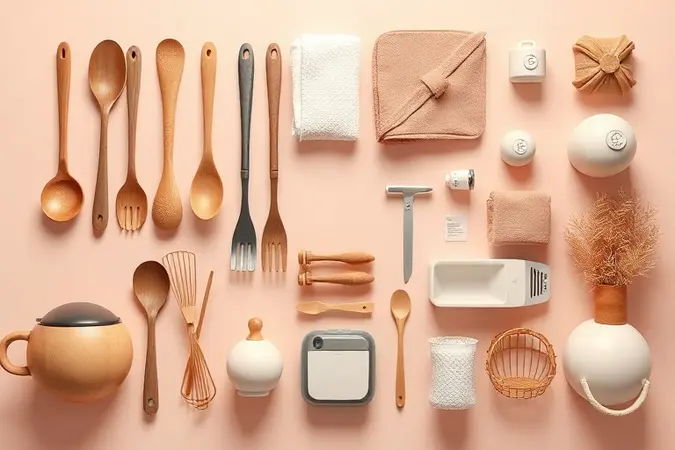
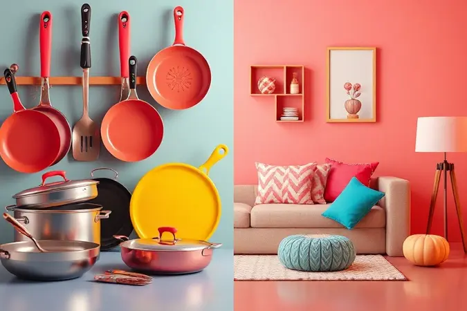
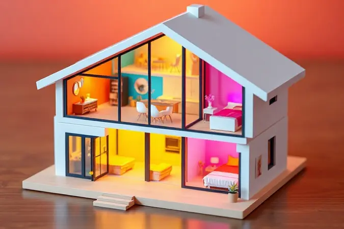

Mudar-se para um novo lar é como abrir um livro em branco, onde cada página será escrita com memórias que você vai construir. Aquele frio na barriga misturado com a empolgação de decorar cada canto, escolher onde cada móvel vai ficar… é um momento único.

E o chá de casa nova? Ele tem o poder de transformar essa transição solitária em uma celebração coletiva, onde amigos e familiares não apenas ajudam com itens práticos, mas carregam as caixas de afeto que transformam quatro paredes em lar.

Se você está nessa fase e a lista do que precisa parece mais complexa que um quebra-cabeça de mil peças, respire fundo.

Este guia vai ser seu companheiro, trazendo um checklist atualizado para 2025 que vai desde a panela perfeita até o detalhe decorativo que vai fazer seu coração bater mais forte ao entrar pela porta.

<SummaryList products={frontmatter.top_products} />

## O que se pede em lista de chá de casa nova? Checklist de Itens

O segredo de uma lista de chá que realmente funciona está em equilibrar o essencial com o emocional. Você não quer só uma cozinha equipada, quer um espaço onde vai preparar o primeiro jantar de domingo.

Não busca apenas roupas de cama, busca as noites de sono reconfortantes após um longo dia. Pense nesses itens não como obrigações, mas como convites para viver.

De utensílios que vão testemunhar suas receitas favoritas a texturas que vão acolher seus momentos de descanso, cada escolha é um passo para criar sua história.

### 1. Enxoval da cozinha

<ProductBox 
  title={frontmatter.top_products[0].title} 
  image={frontmatter.top_products[0].image} 
  link={frontmatter.top_products[0].link} 
/>

A cozinha é o coração pulsante de qualquer casa, o lugar dos cafés da manhã conversados e dos jantares que viram confissões à luz de velas. Equipá-la é, portanto, mais do que uma tarefa logística, é preparar o palco para memórias que ainda estão por vir.

Comece pelos grandes parceiros do dia a dia, a geladeira, o fogão e o micro-ondas, fundamentais para a rotina. Mas pense também na dança das preparações, um bom conjunto de panelas e facas afiadas transformam o cozinhar de obrigação em verdadeiro prazer.

Para receber à mesa, tenha um conjunto versátil de pratos, copos e talheres que conversem entre si. E nunca subestime o poder da organização, potes herméticos e panos de qualidade são os guardiões da praticidade.

Lembre-se, investir em durabilidade aqui não é só economia, é garantir que esses objetos vão envelhecer ao seu lado, testemunhando anos de vida compartilhada.

<CaixaProsContras>

**Prós:**

- Itens essenciais para praticidade no dia a dia.

- Garantia de qualidade e durabilidade dos produtos.

- Organização facilita o uso da cozinha.

- Variedade de itens que atendem diferentes necessidades.

**Contras:**

- Pode exigir um investimento inicial considerável.

- A escolha de muitos itens pode ser confusa para iniciantes.

</CaixaProsContras>

### 2. Enxoval do quarto

<ProductBox 
  title={frontmatter.top_products[1].title} 
  image={frontmatter.top_products[1].image} 
  link={frontmatter.top_products[1].link} 
/>

O quarto é seu santuário pessoal, o refúgio onde o mundo do lado de fora fica suspenso por algumas horas. Criar esse espaço é uma arte que mistura conforto absoluto com uma estética que acalma a alma. A base está em móveis que sejam mais que peças de madeira.

Uma cama que promete noites restauradoras, uma cômoda que organiza sem esforço seu guarda-roupa. A escolha dos tecidos é quase uma carícia, roupas de cama em algodão de alta qualidade e edredons aconchegantes fazem toda a diferença entre dormir e realmente descansar.

Inclua elementos que falem da sua personalidade na decoração, mas sem sobrecarregar. Uma luminária de luz quente para leituras noturnas, uma poltrona fofa para aqueles momentos de introspecção.

Cada item deve ser um convite para desacelerar, para se reconectar consigo mesmo após um dia intenso.

<CaixaProsContras>

**Prós:**

- Móveis multifuncionais otimizam o espaço.

- Cores neutras criam um ambiente tranquilo.

- Tecidos confortáveis protegem a pele do bebê.

- Planejamento ajuda na funcionalidade do espaço.

**Contras:**

- Pode exigir investimento inicial mais alto para móveis de qualidade.

- Compras excessivas de roupas podem resultar em desperdício, já que os bebês crescem rapidamente.

</CaixaProsContras>

### 3. Enxoval do banheiro

<ProductBox 
  title={frontmatter.top_products[2].title} 
  image={frontmatter.top_products[2].image} 
  link={frontmatter.top_products[2].link} 
/>

Mais do que um espaço funcional, o banheiro moderno é um spa pessoal, um oásis diário para cuidados e renovação. Equipá-lo é pensar no ritual matinal que te prepara para o dia e no banho noturno que lava além da poeira, o cansaço.

As toalhas são protagonistas aqui, invista em fios grossos e macios que envolvem o corpo como um abraço. Acessórios como saboneteiras, porta-escovas e organizadores com design limpo não apenas mantêm a ordem, mas elevam a estética do ambiente.

Pense nas sensações, um tapete fofinho sob os pés ao sair do banho, a iluminação suave para os momentos de relaxamento na banheira. Materiais como cerâmica, mármore ou madeira tratada trazem uma sensação de permanência e cuidado.

Este é o espaço para priorizar itens que transformam a higiene em um ato de autocuidado genuíno.

<CaixaProsContras>

**Prós:**

- Estilo moderno que valoriza conforto e praticidade.

- Materiais duráveis que proporcionam sofisticação.

- Toalhas de qualidade aumentam a sensação de cuidado.

- Organização facilita a manutenção do espaço.

**Contras:**

- O investimento inicial pode ser alto.

- A escolha de cores neutras pode não agradar a todos os estilos pessoais.

</CaixaProsContras>

### 4. Enxoval da sala

<ProductBox 
  title={frontmatter.top_products[3].title} 
  image={frontmatter.top_products[3].image} 
  link={frontmatter.top_products[3].link} 
/>

A sala é o palco da vida compartilhada, onde histórias são contadas, filmes são maratonados e risadas ecoam até altas horas. Mobiliar este espaço é projetar cenários para conexão. O sofá é o trono da convivência, então escolha um que convide a sentar e ficar.

Complemente com uma mesa de centro que seja útil sem atrapalhar o fluxo, e uma estante que abrigue não apenas livros e objetos, mas fragmentos da sua identidade.

É aqui que a decoração ganha vida. Almofadas com texturas diferentes, mantas peludas para noites frias, um tapete que delimita a área de conversa.

A iluminação é a magia do ambiente, misture pontos de luz principais com luminárias de apoio para criar diferentes atmosferas. Quadros, objetos de viagem e, claro, plantas, são a alma do espaço, transformando um conjunto de móveis em um lar com personalidade.

<CaixaProsContras>

**Prós:**

- Móveis essenciais que garantem conforto e funcionalidade.

- Almofadas e mantas podem revitalizar o ambiente.

- Opções variadas de decoração que refletem o estilo pessoal.

- Plantas trazem natureza e vida ao espaço.

**Contras:**

- O custo pode aumentar rapidamente com muitos itens.

- Necessidade de planejamento para evitar compras impulsivas.

</CaixaProsContras>

### 5. Itens de decoração

<ProductBox 
  title={frontmatter.top_products[4].title} 
  image={frontmatter.top_products[4].image} 
  link={frontmatter.top_products[4].link} 
/>

Decoração é a assinatura invisível da sua alma no espaço. São os detalhes que sussurram "você mora aqui" antes mesmo de alguém ver uma foto sua na parede. Em 2025, essa expressão ganha tons de autenticidade e conexão com o natural.

Não se trata apenas de seguir tendências, mas de escolher peças que tenham uma história ou que provoquem um sentimento. Vasos com formas orgânicas, quadros de artistas locais, tecidos artesanais.

Aproveite as texturas, uma cestaria de rattan, um cobertor de lã crua, um vaso de cerâmica com imperfeições que contam sua fabricação. As plantas continuam sendo as melhores aliadas, purificando o ar e trazendo um pedacinho da natureza para dentro.

Cada objeto decorativo deve ser uma extensão da sua essência, criando um ambiente que não é apenas bonito, mas verdadeiramente seu.

<CaixaProsContras>

**Prós:**

- Variedade de opções que se adaptam a diferentes estilos.

- Itens funcionais que também servem como decoração.

- Contribuem para criar um ambiente acolhedor.

- Tendências atuais que valorizam sustentabilidade e materiais naturais.

**Contras:**

- Pode ser difícil encontrar itens que combinem perfeitamente com a decoração existente.

- Alguns itens decorativos podem exigir mais cuidados de manutenção.

</CaixaProsContras>

## O que é um chá de casa nova?

Depois de explorar todos os itens que podem compor seu novo espaço, vale a pena parar e refletir sobre o significado por trás da celebração. Um chá de casa nova vai muito além de uma simples reunião para receber presentes.

É um ritual de transição, um abraço coletivo que ajuda a ancorar você em um novo endereço.

Enquanto amigos e familiares chegam com utensílios, decorações e bons votos, eles estão, na verdade, transportando um pedaço do afeto deles para dentro das suas paredes, ajudando a transformar um imóvel em lar desde o primeiro dia.

### Mas, é legal fazer chá de casa nova?

Absolutamente! Mais do que legal, é uma celebração carregada de significado. Fazer um chá de casa nova é abrir as portas da sua nova vida literal e simbolicamente.

É compartilhar a empolgação da conquista, permitir que as pessoas queridas façam parte dessa jornada inicial. Aquela panela que sua melhor amiga deu vai cozinhar suas refeições por anos, o quadro que seus pais escolheram será o pano de fundo das suas memórias.

É um gesto que fortalece laços e cria uma rede de apoio emocional muito concreta. Se você está em dúvida, vá em frente, a experiência de receber amor em forma de presentes úteis é verdadeiramente transformadora.

### Qual a diferença entre chá de panela e chá de casa nova?

Embora ambos celebrem novos começos, eles dançam em ritmos diferentes. O chá de panela tradicionalmente marca o início da vida a dois, focando em presentear o casal com itens que vão equipar o lar que construirão juntos, muitas vezes antes mesmo da mudança.

Já o chá de casa nova acontece quando você já tem as chaves na mão, é a celebração da conquista concreta de um espaço próprio. Os presentes giram mais em torno de personalizar e finalizar o ambiente, com um olhar para a decoração e organização final.

Dois momentos lindos, duas formas de dizer "estamos aqui por você".

### Será que pode fazer chá de casa nova antes de casar?

Claro que pode! O chá de casa nova celebra uma conquista, não um status civil. Se você comprou um apartamento, alugou sua primeira casa sozinho ou com amigos, esse marco merece ser festejado.

É a celebração da independência, da autonomia, do espaço que você vai chamar de seu. Muitas pessoas hoje priorizam a estabilidade de um lar próprio antes mesmo de pensar em casamento, e isso é perfeitamente válido.

O foco deve estar na alegria do novo começo, na gratidão por ter um cantinho seu no mundo. Celebre essa vitória do seu jeito.

## Como fazer uma lista de chá de casa nova?

Agora que o significado está claro, vamos à prática. Criar a lista perfeita é uma arte que mistura pragmatismo com um toque de sonho.

O objetivo não é montar um catálogo de loja de departamentos, mas uma curadoria de itens que vão, de fato, facilitar sua rotina e trazer alegria ao seu dia a dia.

Pense nela como um mapa do tesouro que seus convidados vão usar para ajudar a preencher sua casa com coisas úteis e cheias de significado.

### Comece pelos cômodos

A forma mais intuitiva e organizada de estruturar sua lista é navegando mentalmente pela sua nova casa. Feche os olhos e faça um tour. Primeiro pare na cozinha: o que é essencial para fazer seu café da manhã acontecer sem estresse?

Depois, caminhe até a sala: o que vai tornar esse espaço acolhedor para um cinema em família ou um happy hour com amigos? Siga para o quarto, pensando no conforto que vai garantir suas noites de sono. Finalize nos banheiros, considerando os rituais de cuidado.

Essa abordagem garante que nenhum cantinho importante fique esquecido e ajuda seus convidados a visualizarem o presente no contexto certo.

### Priorize itens essenciais

Em meio à empolgação, é fácil se perder em desejos e esquecer do básico. Respire e comece pelo alicerce. Na cozinha, uma panela boa e um jogo de talheres completos são mais urgentes do que a máquina de waffle dos sonhos.

No quarto, um colchão de qualidade e roupas de cama básicas vêm antes de almofadas decorativas. Foque no que vai fazer a diferença entre viver em uma casa funcional e habitar um lar verdadeiramente confortável desde a primeira semana.

Esses itens essenciais formam a espinha dorsal do seu novo cotidiano, tudo o mais é complemento que pode vir com o tempo.

### Use sites online

Não subestime o poder da tecnologia nesse processo. Plataformas online são aliadas poderosas para organizar suas ideias. Use o Pinterest para criar mood boards visuais de cada cômodo, ajudando você a definir seu estilo.

Aproveite sites especializados em listas de presentes, como alguns oferecidos pelo Elo7 ou até a funcionalidade de lista de casamento da Amazon, que permite cadastrar itens de vários varejistas em um só lugar.

Isso não apenas facilita para os convidados, que podem comprar direto da lista, mas também evita presentes duplicados e garante que você receba exatamente o que precisa.

### Não se esqueça dos detalhes pessoais

Por fim, o toque mágico que transforma uma casa em *sua* casa. Reserve um espaço na lista para itens que falam da sua história.

Pode ser um tipo específico de quadro que você sempre quis, livros de um autor favorito para preencher uma estante, sementes para uma horta de temperos na varanda, ou até uma experiência, como um vale para uma aula de pintura para decorar a própria parede.

Esses detalhes personalizados são os que mais tocam o coração de quem dá e de quem recebe, porque mostram que o presente foi pensado com carinho e atenção à pessoa única que você é.

## Vai fazer chá de casa nova? Indique sites confiáveis

Para colocar todo esse planejamento em prática com segurança e praticidade, conte com parceiros digitais confiáveis. A Amazon segue como uma opção robusta pela variedade inigualável e pelo sistema de lista de presentes integrado, facilitando o controle.

A Magazine Luiza se destaca pelo atendimento ao cliente e por muitas vezes oferecer condições especiais para compras maiores. Para itens com alma única, o Elo7 é o paraíso do artesanato e da personalização.

E para garantir agilidade, a Americanas com sua rede de entrega ampla pode ser uma salvação de última hora. Escolher plataformas consolidadas dá paz de espírito a você e aos seus convidados, mantendo o foco no que realmente importa, a celebração.

## Conclusão

Organizar um chá de casa nova é muito mais do que montar uma lista de compras, é desenhar os primeiros contornos da vida que você vai construir entre essas paredes.

Cada item pedido, desde a panela mais simples até o quadro mais elaborado, carrega a promessa de memórias futuras e a materialização do apoio da sua rede afetiva.

Mais importante que ter tudo perfeito no primeiro dia, é abrir espaço para que o lar cresça e se transforme junto com você, cheio de histórias e significados próprios.

Lembre-se, o verdadeiro aconchego não vem dos objetos, mas das pessoas que os entregam com carinho e das experiências que você vai viver ao seu redor.

Então, respire fundo, celebre essa conquista linda e permita-se receber não apenas presentes, mas os votos de felicidade que vêm com eles. Sua nova casa está esperando para ser preenchida com a música da sua vida.