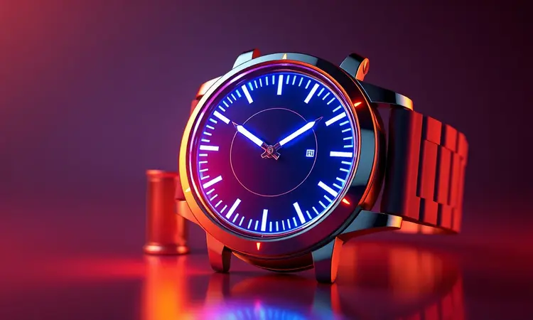
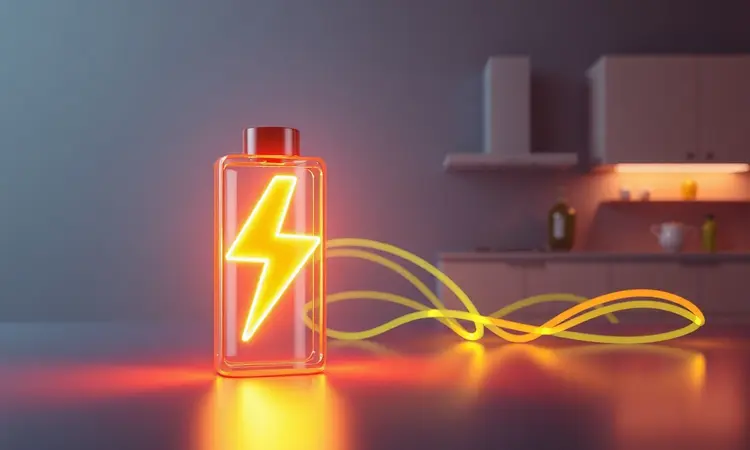

Encontrar a melhor Air Fryer de 5 litros pode transformar a rotina na cozinha, trazendo praticidade e saúde para toda a família.

Com a popularidade crescente das fritadeiras elétricas, o mercado oferece diversas opções com tecnologias que vão desde o controle mecânico simples até painéis digitais sofisticados.

Nesta análise, selecionamos os modelos mais vendidos e eficientes de 2025, focando em marcas renomadas como Mondial, Electrolux e WAP.

Se você busca capacidade ideal para preparar refeições completas sem usar óleo, este guia completo ajudará você a identificar os diferenciais de cada modelo e a fazer a escolha perfeita para suas necessidades.

<SummaryList products={frontmatter.top_products} />

## Melhores modelos de Air Fryer de 5 litros para comprar em 2025

As air fryers de 5 litros são ideais para quem busca preparar refeições saudáveis e rápidas. Elas oferecem espaço suficiente para cozinhar porções generosas, tornando-se uma ótima escolha para famílias e reuniões.

### 1. Fritadeira Elétrica Air Fryer Mondial 5L 110V 1900W – Grand Family Inox

<ProductBox 
  title={frontmatter.top_products[0].title} 
  image={frontmatter.top_products[0].image} 
  link={frontmatter.top_products[0].link} 
/>

Para começar nossa jornada com força, a Mondial Grand Family Inox chega com uma proposta clara: robustez e simplicidade que funcionam. Imagine preparar batatas fritas crocantes para uma família de quatro pessoas, sem usar uma única gota de óleo.

A potência de 1900W é a engrenagem dessa máquina, aquecendo rápido para que você não tenha que negociar com a fome da criançada.

O controle mecânico entre 80°C e 200°C e o timer de 60 minutos oferecem a precisão que você precisa para explorar receitas, desde legumes assados até um frango inteiro.

A tecnologia Air Flow 360° é a magia por trás da cena, garantindo que o calor circule por todos os lados do cesto, entregando uma crocância uniforme em cada mordida.

Seu visual em inox traz um toque moderno para a bancada, e o cesto antiaderente transforma a limpeza em uma tarefa de segundos. O que você não vai encontrar aqui são funções digitais ou conectividade com apps.

Essa é uma escolha para quem valoriza a funcionalidade acima de tudo, um trabalho bem feito sem firulas.

<CaixaProsContras>

**Prós:**

- Capacidade ampla de 5 litros, ideal para grandes porções.

- Tecnologia Air Flow 360° para frituras uniformes.

- Timer e controle de temperatura ajustáveis.

- Design compacto em inox, que combina com a decoração da cozinha.

**Contras:**

- Não possui recursos de conectividade, como aplicativos.

- Pode ser considerada básica em comparação com modelos mais avançados.

</CaixaProsContras>

### 2. Fritadeira Elétrica Air Fryer WAP 5,2L 127V 1500W – Grand Family Mecânica

<ProductBox 
  title={frontmatter.top_products[1].title} 
  image={frontmatter.top_products[1].image} 
  link={frontmatter.top_products[1].link} 
/>

Se a simplicidade é seu lema, a WAP Grand Family Mecânica é um convite ao essencial. Com 5,2 litros, ela oferece um espaço extra que faz diferença na hora de preparar o jantar de domingo para a família toda.

A potência de 1500W é equilibrada, suficiente para um cozimento eficiente sem disparar o contador de energia.

O controle é todo manual, com um botão giratório para a temperatura (80°C a 200°C) e outro para o tempo, trazendo uma experiência intuitiva para quem não quer lidar com telas.

A circulação de ar em 360° garante que os alimentos fiquem bem dourados, e o revestimento antiaderente do cesto significa que você pode simplesmente enxaguá-lo após o uso.

Um cuidado importante: este modelo opera em 127V, então verifique a compatibilidade da sua tomada antes de convidá-la para sua cozinha. É um equipamento que pede um olhar atento ao manual, mas que, uma vez compreendido, funciona com a confiabilidade de um velho amigo.

<CaixaProsContras>

**Prós:**

- Alimentação mais saudável com menor uso de óleo.

- Capacidade generosa de 5,2 litros, ideal para famílias.

- Facilidade na limpeza devido ao revestimento antiaderente.

- Várias funções, incluindo assar e gratinar.

**Contras:**

- Necessidade de seguir o manual para um uso seguro.

- A voltagem é específica (127V), o que pode limitar algumas instalações.

</CaixaProsContras>

### 3. Fritadeira Elétrica Air Fryer Electrolux 5L 127V 1800W – Grand Airfryer Mecânica

<ProductBox 
  title={frontmatter.top_products[2].title} 
  image={frontmatter.top_products[2].image} 
  link={frontmatter.top_products[2].link} 
/>

A Electrolux entra no jogo com um modelo que equilibra potência e praticidade de uma forma que agrada ao dia a dia. Com 1800W, ela aquece com uma rapidez que acalma a ansiedade de quem chega em casa com fome.

Os 5 litros de capacidade são o terreno perfeito para experimentos culinários saudáveis, prometendo reduzir o uso de gordura em até 90%. Isso significa que você pode saborear a crocância das batatas fritas sem o peso na consciência.

O controle mecânico é direto, sem segredos, e o timer de 60 minutos oferece liberdade para você se dedicar a outras tarefas enquanto o jantar fica pronto. O design é limpo e moderno, e o cesto removível com camada antiaderente é quase autolimpante.

Apenas lembre-se: com tanta potência, ela merece uma tomada exclusiva e com aterramento. É um pequeno preço a pagar pela eficiência e pela segurança que ela proporciona.

<CaixaProsContras>

**Prós:**

- Capacidade de 5 litros ideal para porções maiores.

- Reduz o consumo de óleo em até 90%, promovendo refeições mais saudáveis.

- Design moderno que combina com diversos estilos de cozinha.

- Cesto removível e lavável na máquina para maior praticidade.

**Contras:**

- Necessita de tomada exclusiva com aterramento.

- Controle mecânico pode ser menos conveniente para quem prefere opções digitais.

</CaixaProsContras>

### 4. Fritadeira Elétrica Air Fryer Electrolux 5,6L 220V – Efficient por Rita Lobo

<ProductBox 
  title={frontmatter.top_products[3].title} 
  image={frontmatter.top_products[3].image} 
  link={frontmatter.top_products[3].link} 
/>

Para quem vê a cozinha como um laboratório de sabores, a Electrolux Efficient traz o endosso de Rita Lobo e uma capacidade que inspira criatividade.

Com 5,6 litros, ela é uma das mais espaçosas da lista, perfeita para quem adora receber amigos ou preparar várias porções de uma vez.

A tecnologia de circulação de ar quente é a sua assinatura, entregando pratos com aquele contraste perfeito: crocantes por fora e irresistivelmente macios por dentro.

Sua versatilidade vai além da fritura, permitindo que você assade um bolo de cenoura ou gratinado um macarrão. A limpeza é um dos seus trunfos, com cestos removíveis e compatíveis com lava-louças que transformam a tarefa pós-festa em algo trivial.

Sim, seus 1400W de potência são notáveis no consumo, mas pense nisso como o custo da eficiência: ela entrega resultados consistentes e saborosos, economizando seu tempo e esforço.

<CaixaProsContras>

**Prós:**

- Tecnologia de circulação de ar quente, proporcionando frituras mais saudáveis.

- Versatilidade para preparar diferentes tipos de pratos.

- Cesto removível e fácil de limpar.

- Design moderno que se destaca na cozinha.

**Contras:**

- Potência elevada pode influenciar no consumo energético.

- É importante verificar a voltagem correta antes da compra.

</CaixaProsContras>

### 5. Fritadeira Elétrica Air Fryer Philco 7,2L 127V 1800W – Jumbo Inox

<ProductBox 
  title={frontmatter.top_products[4].title} 
  image={frontmatter.top_products[4].image} 
  link={frontmatter.top_products[4].link} 
/>

O nome já entrega: a Philco Jumbo Inox é para quem não brinca em serviço. Se você tem uma família grande ou simplesmente odeia fazer várias rodadas de comida, seus 7,2 litros totais (5,5 litros úteis) são um território vasto.

É espaço suficiente para um frango assado inteiro acompanhado de legumes, tudo de uma só vez.

Os 1800W de potência e o controle de temperatura de 80°C a 200°C dão a você o domínio total sobre o cozimento, enquanto o timer de 30 minutos com desligamento automático oferece segurança.

O visual em inox é imponente e moderno, mas é justo avisar: ela vai ocupar um cantinho relevante na sua bancada.

No entanto, se a prioridade é capacidade acima de tudo, esse é um detalhe que rapidamente se torna irrelevante perto da conveniência de preparar uma refeição completa em uma única bandeja.

<CaixaProsContras>

**Prós:**

- Grande capacidade de 7,2 litros, perfeita para famílias.

- Controle de temperatura versátil de 80°C a 200°C.

- Design moderno em inox que facilita a limpeza.

- Timer com desligamento automático para segurança.

**Contras:**

- Ocupa um espaço considerável na bancada.

- Para melhor desempenho, é recomendado untar o cesto antes da primeira utilização.

</CaixaProsContras>

### 6. Fritadeira Elétrica Air Fryer Mondial 5L 110V 2000W – Digital Inox

<ProductBox 
  title={frontmatter.top_products[5].title} 
  image={frontmatter.top_products[5].image} 
  link={frontmatter.top_products[5].link} 
/>

Aqui a Mondial veste seu traje mais tecnológico. A Digital Inox é para quem quer a praticidade do toque na ponta dos dedos. Com 2000W, ela é a mais potente da nossa seleção, aquecendo quase que instantaneamente para entregar alimentos super crocantes.

O painel digital touch é a porta de entrada para um controle preciso do tempo e da temperatura, tornando o processo quase intuitivo. A tecnologia de circulação de ar quente trabalha em silêncio para que você tenha refeições saudáveis com uma fração do óleo tradicional.

O design em inox com visor frontal dá um ar de eletrodoméstico premium à sua cozinha. A contrapartida? Seu tamanho generoso pode ser um desafio para bancadas muito compactas, e tanta potência se reflete na conta de luz.

Mas se você valoriza agilidade, precisão e um visual moderno, esses são trade-offs que fazem sentido.

<CaixaProsContras>

**Prós:**

- Capacidade ideal para porções maiores.

- Painel digital touch para fácil manuseio.

- Tecnologia que reduz a necessidade de óleo.

- Design moderno em inox.

**Contras:**

- Tamanho pode ser grande para algumas cozinhas.

- Potência elevada pode gerar consumo maior de energia.

</CaixaProsContras>

### 7. Fritadeira Elétrica Air Fryer Midea 5,5L 110V 1900W – Mecânica Premium

<ProductBox 
  title={frontmatter.top_products[6].title} 
  image={frontmatter.top_products[6].image} 
  link={frontmatter.top_products[6].link} 
/>

A Midea Mecânica Premium chega com um argumento convincente: durabilidade. Seu revestimento antiaderente BlackStone não é apenas um nome bonito, é uma promessa de que o cesto vai resistir aos arranhões das colheres de silicone e às lavagens repetidas.

Com 5,5 litros e 1900W, ela tem força e espaço para famílias, preparando alimentos com até 90% menos gordura. O painel mecânico é clássico e confiável, com timer de 60 minutos e temperatura ajustável até 200°C.

Uma característica de design: sua largura maior favorece uma distribuição uniforme dos alimentos, garantindo que tudo cozinhe igualmente.

Isso pode limitar um pouco a altura para receitas como bolos altos, mas é uma troca inteligente para quem prioriza uma fritura perfeita e sem pontos frios. É o tipo de equipamento que você compra para os próximos anos.

<CaixaProsContras>

**Prós:**

- Capacidade ideal para famílias maiores.

- Tecnologia de fritura saudável com menos gordura.

- Revestimento antiaderente que facilita a limpeza.

- Timer e controle de temperatura precisos.

**Contras:**

- Altura interna pode limitar algumas receitas.

- Maior largura pode ser um desafio em cozinhas pequenas.

</CaixaProsContras>

### 8. Fritadeira Elétrica Air Fryer Oster 5L 110V – Digital Inox

<ProductBox 
  title={frontmatter.top_products[7].title} 
  image={frontmatter.top_products[7].image} 
  link={frontmatter.top_products[7].link} 
/>

A Oster Digital Inox é a escolha para quem quer um pouco de luxo e muita inteligência no dia a dia. Seu painel digital touch colorido não é apenas bonito, ele é funcional, com funções pré-programadas que tiram as adivinhações do cozimento.

Basta selecionar "batatas fritas", "frango" ou "peixe", e a máquina ajusta tempo e temperatura para você. Os 1700W de potência e a variação de temperatura de 80°C a 200°C oferecem flexibilidade para qualquer receita.

A grelha Easy Clean removível é um mimo para a limpeza, e todo o conjunto em aço inox tem um apelo visual que transforma o equipamento em parte da decoração. O preço reflete essa sofisticação, e o uso frequente vai aparecer no consumo de energia.

Mas para quem vê na cozinha um espaço de prazer e conveniência, é um investimento que se paga em experiências gastronômicas sem complicação.

<CaixaProsContras>

**Prós:**

- Design moderno e elegante em aço inox.

- Painel digital touch colorido com funções pré-programadas.

- Capacidade generosa de 5 litros ideal para famílias.

- Revestimento antiaderente que facilita a limpeza.

**Contras:**

- Consumo energético pode ser elevado em usos frequentes.

- Preço pode ser um pouco acima da média.

</CaixaProsContras>

### 9. Philips Walita 5 Litros 3000 AirFryer

<ProductBox 
  title={frontmatter.top_products[8].title} 
  image={frontmatter.top_products[8].image} 
  link={frontmatter.top_products[8].link} 
/>

A Philips Walita é sinônimo de tecnologia de ponta no universo das air fryers.

Seu modelo HD9257, com a famosa tecnologia Rapid Air, é um mestre em criar o contraste perfeito: alimentos com uma crosta dourada e irresistível por fora, mantendo o suco e a maciez por dentro.

A redução de gordura pode chegar a 90% em comparação com uma fritura tradicional. O display digital touch oferece 7 predefinições que praticamente cozinham por você, enquanto o controle fino da temperatura (até 200°C) e do tempo (60 minutos) dá asas à sua criatividade.

Todas as peças são removíveis e antiaderentes, prometendo uma limpeza sem esforço. Um detalhe técnico: sua capacidade total é de 5,6 litros, mas o espaço útil para alimentos fica em torno de 4 litros.

É uma consideração importante se você cozinha para muitas pessoas, mas para a maioria das famílias, a qualidade do resultado justifica amplamente a escolha.

<CaixaProsContras>

**Prós:**

- Tecnologia Rapid Air para alimentos crocantes

- Display digital com várias predefinições

- Fácil limpeza com peças removíveis

- Boa capacidade para diversas receitas

**Contras:**

- Capacidade útil um pouco menor do que a total

- Pode ser considerada mais cara em comparação a modelos básicos

</CaixaProsContras>

### 10. Britânia Gold BAF45A 5 Litros

<ProductBox 
  title={frontmatter.top_products[9].title} 
  image={frontmatter.top_products[9].image} 
  link={frontmatter.top_products[9].link} 
/>

A Britânia Gold é a candidata perfeita para quem busca o equilíbrio entre preço acessível e funcionalidade essencial. Projetada para famílias de 3 a 4 pessoas, seus 5 litros e 1500W de potência são números que conversam com a realidade do dia a dia.

A tecnologia Air Flow 360° trabalha para garantir que o ar quente atinja todos os alimentos, promovendo um cozimento uniforme que dispensa o óleo.

O revestimento antiaderente transforma a limpeza em uma tarefa rápida, e o timer com desligamento automático adiciona uma camada importante de segurança. A atenção fica por conta da voltagem: ela não é bivolt, então você precisa escolher entre 110V ou 220V.

Também pode ser um pouco pesada para manusear quando cheia. Mas se você procura uma aliada confiável e sem complicações para refeições mais leves, ela cumpre a missão com louvor.

<CaixaProsContras>

**Prós:**

- Tecnologia Air Flow 360° para cozimento uniforme.

- Revestimento antiaderente que facilita a limpeza.

- Capacidade de 5 litros ideal para pequenas famílias.

- Timer com desligamento automático para maior segurança.

**Contras:**

- Não é bivolt, exigindo atenção na escolha da voltagem.

- Pode ser um pouco pesada para manusear após uso.

</CaixaProsContras>

### 11. Airfryer 5 Litros Hamilton Beach Air Fryer

<ProductBox 
  title={frontmatter.top_products[10].title} 
  image={frontmatter.top_products[10].image} 
  link={frontmatter.top_products[10].link} 
/>

A Hamilton Beach é a versátil da turma. O modelo 35075, com seus 1700 watts e cesto de 5 litros, é um verdadeiro canivete suíço: frita, assa, grelha e até prepara um frango de 2,5 kg.

As oito funções pré-definidas são uma mão na roda para o cotidiano, sugerendo configurações ideais para diferentes tipos de comida. O timer de 60 minutos e o controle preciso de temperatura dão a você o domínio para ajustes finos.

A limpeza é facilitada pelo cesto antiaderente removível, e o design em aço inoxidável tem um apelo clássico. Como muitas de suas concorrentes, o exterior pode aquecer durante o uso, então o cuidado ao manusear é necessário.

Em uma família de 4 a 6 pessoas, ela se torna uma central de refeições rápidas e saudáveis, provando que eficiência e praticidade podem andar juntas.

<CaixaProsContras>

**Prós:**

- Grande capacidade de 5 litros, ideal para famílias.

- Oito funções pré-definidas que facilitam o uso.

- Alta potência para um cozimento rápido.

- Design moderno em aço inoxidável.

**Contras:**

- O exterior pode aquecer durante o uso.

- A capacidade pode ser pequena para cozinhar grandes quantidades de um único item.

</CaixaProsContras>

## Tabela comparativa dos modelos de Air Fryer de 5 litros

Com tantas opções apresentadas, fica claro que a escolha vai muito além do tamanho. É sobre encontrar a parceira de cozinha que se alinha ao seu ritmo de vida, ao espaço que você tem disponível e ao tipo de comida que ama preparar.

Alguns modelos brilham pela simplicidade infalível de seus controles mecânicos, perfeitos para quem não quer complicação. Outros seduzem com painéis digitais e funções pré-programadas que parecem ler seus pensamentos.

A capacidade de 5 litros é o denominador comum que transforma todos eles em aliadas para reuniões familiares e jantares especiais. Antes de tomar sua decisão, pense na rotina: você precisa de velocidade máxima? Prioriza uma limpeza que seja apenas um enxágue?

Ou sonha com uma máquina que também asse bolos? As respostas estão nas linhas que você acabou de ler.

## Escolha a sua Air Fryer de 5 litros!

Agora que você conhece os protagonistas, é hora de considerar os aspectos que vão ditar sua experiência diária com a nova air fryer. Pensar nesses detalhes é garantir que você escolha não apenas um eletrodoméstico, mas um novo hábito.

### Potência e Tempo de Preparo

A potência é o coração da sua air fryer. Modelos entre 1.400W e 1.800W são a zona de conforto para a maioria das famílias, aquecendo rápido o suficiente para que a espera não estrague o apetite.

Um pré-aquecimento de poucos minutos pode fazer toda a diferença para uma crocância perfeita. Pense nisso: quanto mais potente, mais rápido você terá alimentos dourados e saborosos na mesa, mas também maior será o impacto na sua conta de luz.

Encontre o equilíbrio que faz sentido para a frequência com que você planeja usá-la.

### Capacidade e Distribuição de Calor

Os 5 litros são um sweet spot. Eles comportam um frango assado, porções generosas de batatas ou legumes suficientes para uma refeição completa. Mas a quantidade de comida que você pode colocar de uma vez depende de um fator invisível: a distribuição de calor.

Tecnologias como a circulação de ar 360° são o segredo para evitar aquela batata que ficou crua no fundo do cesto. Elas garantem que o ar quente envolva cada pedaço de alimento, entregando uma textura uniformemente crocante por fora e perfeitamente cozida por dentro.

É a diferença entre um resultado caseiro e um profissional.

### Facilidade de Limpeza

Este é o teste decisivo para o amor por qualquer eletrodoméstico. Felizmente, as air fryers de hoje são projetadas para a guerra. Componentes removíveis que vão direto para a máquina de lavar louça são um salva-vidas após um jantar agitado.

Revestimentos antiaderentes de alta qualidade fazem com que os restos de comida simplesmente escorreguem, sem necessidade de esfregar. Alguns modelos até oferecem ciclos de limpeza automática.

Na prática, isso significa menos tempo na pia e mais tempo aproveitando sua refeição ou sua família. Na hora da escolha, não subestime o valor da praticidade na limpeza.

### Recursos Extras

Estes são os diferenciais que podem transformar um cozimento funcional em uma experiência. Painéis digitais touch oferecem uma precisão milimétrica no controle, enquanto funções pré-programadas para batatas, frango ou peixe eliminam as tentativas e erros.

Acessórios como grelhas para bacon ou cestos para frituras com óleo mínimo multiplicam as possibilidades culinárias. Estes recursos são para quem busca conveniência, consistência e um toque de sofisticação no preparo diário.

Eles têm um custo, mas para muitos, o ganho em tempo e qualidade de resultado é um investimento que vale cada centavo.

## Mecânica ou Digital: Qual a Melhor?

Este é o grande divisor de águas. O caminho mecânico é direto, durável e intuitivo: botões giratórios para tempo e temperatura, sem telas para quebrar ou programas para decifrar. É a escolha de quem quer um equipamento que simplesmente funciona, sem surpresas.

O caminho digital oferece uma experiência mais refinada: maior precisão, funções pré-configuradas que otimizam o cozimento e, muitas vezes, um visual mais moderno. A decisão se resume à sua personalidade na cozinha.

Você prefere a simplicidade robusta de um controle manual ou a conveniência inteligente de um painel digital? Ambos levam ao mesmo destino: uma refeição mais saudável e saborosa.

## Tecnologia Antiaderente e Limpeza

O verdadeiro tesouro da air fryer moderna não está apenas em como ela cozinha, mas em como ela se limpa. A tecnologia antiaderente presente nos melhores modelos não é um luxo, é uma necessidade.

Ela assegura que os alimentos não grudem, permitindo que você use quantidades mínimas de óleo. Depois, quando a festa acaba, o cesto praticamente se limpa sozinho.

A maioria dos cestos e grelhas é removível e segura para lava-louças, o que significa que você pode simplesmente organizá-los na máquina e seguir com seu dia. Um bom revestimento também prolonga a vida útil do equipamento, resistindo a arranhões e lavagens repetidas.

Em resumo, investir em uma boa tecnologia antiaderente é garantir anos de praticidade com zero de estresse na limpeza.

## Potência versus Consumo de Energia

Este é um jogo de equilíbrio. Uma air fryer mais potente (como as de 2000W) cozinha com uma agilidade impressionante, ideal para quem tem pressa. No entanto, esse desempenho tem um preço visível na conta de luz.

Modelos com potência mais modesta (em torno de 1500W) podem exigir alguns minutos a mais de cozimento, mas operam de forma mais econômica. A pergunta que você deve se fazer é: qual é o seu ritmo?

Para um uso esporádico, uma potência alta pode não impactar tanto o orçamento. Já para uma família que usa o equipamento quase diariamente, talvez o equilíbrio de uma potência intermediária faça mais sentido financeiro.

Não existe resposta errada, apenas a que melhor se ajusta à sua rotina e às suas prioridades.

## Perguntas Frequentes

É natural ter dúvidas antes de trazer uma nova tecnologia para casa. Vamos esclarecer as mais comuns.

As principais diferenças entre os modelos giram em torno do controle (mecânico ou digital), da presença de funções extras (como pré-aquecimento ou programas automáticos) e, claro, da potência.

Um modelo de 5 litros é, sim, suficiente para uma família de até quatro pessoas, preparando porções completas de uma só vez. Quanto à durabilidade, as marcas renomadas geralmente oferecem garantias de 1 a 3 anos, um sinal de confiança na construção do produto.

Por fim, lembre-se: a melhor air fryer não é necessariamente a mais cara ou a mais cheia de funções. É aquela que, diante dos seus hábitos e do seu espaço, se torna uma extensão natural da sua cozinha, trazendo saúde e sabor sem complicação.

## Conclusão

A jornada em busca da air fryer perfeita é, no fundo, uma jornada de autoconhecimento na cozinha.

Percorremos modelos que priorizam a robustez simples, como a Mondial mecânica, até aqueles que abraçam a tecnologia de ponta, como a Philips Walita com seu sistema Rapid Air.

Vimos que a capacidade de 5 litros é um terreno fértil para famílias, oferecendo espaço sem ocupar toda a bancada.

Aprendemos que potência é sinônimo de agilidade, mas que a limpeza fácil é o verdadeiro segredo para um relacionamento duradouro com qualquer eletrodoméstico.

A escolha entre mecânica e digital reflete sua personalidade: você é do time da simplicidade infalível ou da precisão high-tech?

Seja qual for a resposta, uma coisa é certa: incorporar uma air fryer de 5 litros à sua rotina é dar um passo concreto em direção a refeições mais leves, mais saborosas e, acima de tudo, mais práticas.

É recuperar o prazer de cozinhar sem o peso da gordura ou da louça acumulada. Agora, com todas as informações em mãos, você está pronto para escolher a parceira que vai transformar sua cozinha e sua mesa.