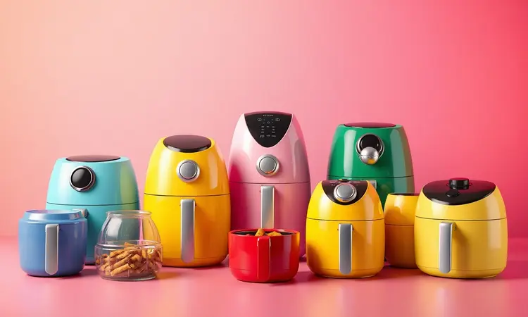
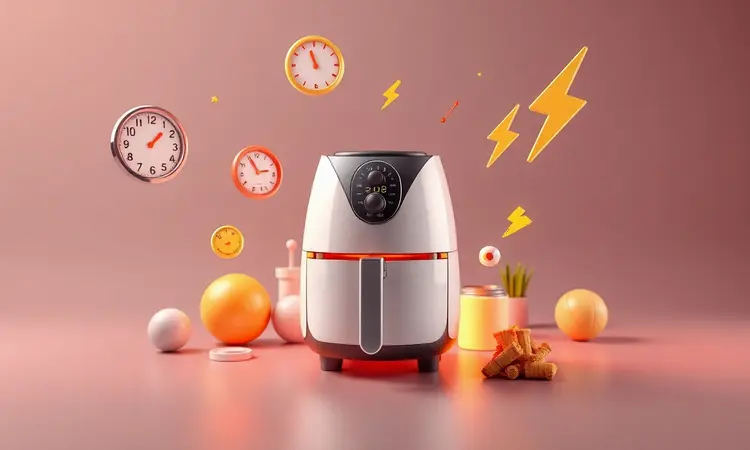
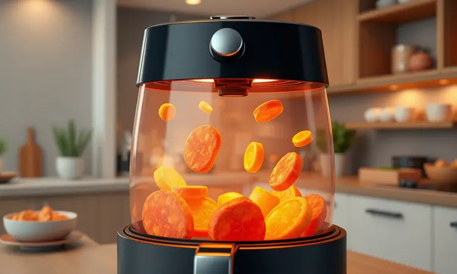

Escolher a melhor air fryer custo-benefício pode ser mais simples do que imagina, especialmente quando entende que não está comprando apenas um eletrodoméstico, mas sim um aliado para refeições mais saudáveis e momentos de praticidade na cozinha.

Encontrar o equilíbrio ideal entre preço, potência e durabilidade é menos sobre números técnicos e mais sobre como cada modelo se encaixa no seu dia a dia.

Neste guia completo, avaliamos os destaques de 2025 para ajudar você a decidir qual fritadeira sem óleo realmente merece espaço na sua cozinha, considerando desde as funções básicas até os recursos que transformam a experiência de cozinhar.

<SummaryList products={frontmatter.top_products} />

## Quais as melhores air fryers custo-benefício em 2025?

As melhores air fryers custo-benefício em 2025 são aquelas que entendem sua rotina. Não se trata apenas de especificações técnicas, mas de como cada modelo entrega versatilidade, economia e, principalmente, resultados que fazem você esquecer da fritura tradicional.

A verdadeira escolha inteligente une desempenho consistente a um investimento que vale cada centavo.

### 1. Mondial AFN-50-BI (5 litros)

<ProductBox 
  title={frontmatter.top_products[0].title} 
  image={frontmatter.top_products[0].image} 
  link={frontmatter.top_products[0].link} 
/>

Para famílias de 3 a 5 pessoas que buscam equilíbrio entre espaço e praticidade, a Mondial AFN-50-BI oferece os 5 litros necessários para preparar o almoço de todos sem precisar de rodadas extras.

Com 1900W de potência, ela transforma o cozimento em algo rápido, aqueles 15 minutos que fazem diferença no dia corrido. A tecnologia de Circulação de Ar Quente dispensa o óleo, criando aquela crocância perfeita sem culpa.

Imagine poder ajustar a temperatura até 200°C e programar o timer por 60 minutos, saindo da cozinha sabendo que um aviso sonoro irá chamar quando tudo estiver pronto.

O desligamento automático não é apenas um detalhe técnico, é a segurança que permite cuidar da família enquanto o jantar se prepara sozinho.

Seu design compacto mescla preto e inox com elegância, mas o verdadeiro destaque é o cesto removível antiaderente. Você lava rapidamente ou simplesmente coloca na lava-louças, eliminando aquela tarefa chata após as refeições.

Alguns números do painel podem desbotar com o tempo, mas o que permanece é a capacidade de preparar batatas, frangos e até pequenos bolos com consistentemente bons resultados.

<CaixaProsContras>

**Prós:**

- Grande capacidade de 5 litros, ideal para famílias.

- Potência alta de 1900W, que acelera o cozimento.

- Tecnologia sem óleo, promovendo refeições mais saudáveis.

- Cesto removível e fácil de limpar, compatível com lava-louças.

**Contras:**

- Números do painel podem apagar com o tempo.

- O nível de ruído pode ser um pouco alto durante o funcionamento.

</CaixaProsContras>

### 2. Mondial Mega Family AFN-80-BI (8 litros)

<ProductBox 
  title={frontmatter.top_products[1].title} 
  image={frontmatter.top_products[1].image} 
  link={frontmatter.top_products[1].link} 
/>

Quando a família é grande ou os encontros são frequentes, os 8 litros da Mondial Mega Family AFN-80-BI tornam-se um investimento que se paga em praticidade.

Ela acomoda um frango inteiro, porções generosas de batatas ou até mesmo aquela lasanha que todos pedem no domingo. Com os mesmos 1900W de potência, atinge 200°C rapidamente, garantindo que o tempo na cozinha seja sempre otimizado.

O cesto quadrado não é apenas um detalhe de design, mas uma escolha inteligente que maximiza o espaço interno. Você organiza os alimentos de forma mais eficiente, evitando aquela sobreposição que deixa algumas batatas mais crocantes que outras.

O timer com aviso sonoro e desligamento automático oferece aquela tranquilidade de poder se afastar enquanto o aparelho faz seu trabalho.

Esta air fryer vai além da fritura, transformando-se em um forno versátil para assar, cozinhar e gratinar. A limpeza é facilitada pelo revestimento antiaderente, embora seu tamanho generoso exija um espaço especial na cozinha.

O consumo de energia reflete sua capacidade, mas cada minuto economizado no preparo de grandes refeições justifica a conta de luz.

<CaixaProsContras>

**Prós:**

- Grande capacidade de 8 litros ideal para famílias.

- Potência alta que proporciona aquecimento rápido.

- Versatilidade para diferentes métodos de preparo (fritar, assar, cozinhar).

- Cesto removível com revestimento antiaderente facilita a limpeza.

**Contras:**

- Consumo de energia pode ser elevado em comparação a modelos menores.

- Design pode ocupar mais espaço na cozinha.

</CaixaProsContras>

### 3. Britânia Redstone BFR50 (5,5 litros)

<ProductBox 
  title={frontmatter.top_products[2].title} 
  image={frontmatter.top_products[2].image} 
  link={frontmatter.top_products[2].link} 
/>

Para quem busca um ponto médio ideal entre espaço e eficiência energética, a Britânia Redstone BFR50 oferece 5,5 litros com 1500W de potência.

O revestimento antiaderente "Redstone" não é apenas um nome bonito, mas uma promessa real de que os alimentos não grudarão, transformando a limpeza em algo quase instantâneo.

A tecnologia de circulação de ar quente em 360º garante que cada batata, cada pedaço de frango receba o mesmo calor, eliminando aquelas partes mais escuras que sempre surgiam nas bordas.

Com temperatura ajustável entre 80°C e 200°C, ela se adapta desde legumes delicados até carnes que precisam de maior calor.

Um detalhe a observar é o timer mecânico, que não pausa automaticamente ao retirar o cesto. Isso exige um pouco mais de atenção, mas também ensina a planejar melhor as etapas do preparo.

Seu design moderno complementa qualquer cozinha, enquanto o desempenho consistente justifica cada real investido.

<CaixaProsContras>

**Prós:**

- Grande capacidade de 5,5 litros, ideal para porções maiores.

- Revestimento antiaderente que facilita a limpeza.

- Tecnologia de circulação de ar quente para cozimento uniforme.

- Design moderno e atraente.

**Contras:**

- O timer não pausa automaticamente quando o cesto é removido.

- Potência ligeiramente inferior comparada a modelos similares.

</CaixaProsContras>

### 4. Philips Walita Série 3000 RI9252/91 (4 litros)

<ProductBox 
  title={frontmatter.top_products[3].title} 
  image={frontmatter.top_products[3].image} 
  link={frontmatter.top_products[3].link} 
/>

Quando a precisão digital encontra a saúde na cozinha, nasce a Philips Walita Série 3000. Com 4,1 litros, ela atende perfeitamente casais ou pequenas famílias que valorizam controle total sobre cada preparo.

A tecnologia Rapid Air não é apenas marketing, mas a garantia de que seus alimentos ficarão crocantes por fora e macios por dentro, usando até 90% menos gordura que métodos tradicionais.

O painel digital com sete programas pré-definidos elimina adivinhações. Você seleciona "batatas", "frango" ou "legumes" e confia que o aparelho já sabe os ajustes ideais de tempo e temperatura.

A função "Manter Aquecido" é aquela gentileza que preserva o jantar quentinho quando alguém se atrasa.

A limpeza com cesto QuickClean antiaderente torna a manutenção quase divertida, especialmente quando todas as peças removíveis vão para a máquina de lavar louças.

Sim, seu preço pode ser superior ao de modelos básicos, mas a eficiência energética e a qualidade de construção transformam esse investimento em economia a longo prazo.

<CaixaProsContras>

**Prós:**

- Tecnologia Rapid Air para cozimento uniforme.

- Painel digital com programas pré-definidos.

- Alta eficiência energética.

- Fácil limpeza com componentes removíveis.

**Contras:**

- Preço pode ser um pouco elevado.

- Capacidade de 4,1 litros pode ser limitada para famílias maiores.

</CaixaProsContras>

### 5. Oster Fritadeira Forno OFRT780 (12 litros)

<ProductBox 
  title={frontmatter.top_products[4].title} 
  image={frontmatter.top_products[4].image} 
  link={frontmatter.top_products[4].link} 
/>

Para quem realmente quer um centro culinário versátil, a Oster Fritadeira Forno OFRT780 redefine o conceito de utilitário de cozinha.

Com 12 litros, ela não apenas frita, mas também assa, grelha e desidrata, substituindo múltiplos aparelhos por um único que otimiza espaço e funcionalidade.

Os 1800W de potência garantem rapidez mesmo com grandes porções, enquanto as nove funções, incluindo opções pré-programadas, transformam receitas complexas em operações simples.

O sistema de rotação 360º não é apenas engenhoso, mas garante que cada pedaço receba calor uniforme, eliminando aquela necessidade constante de virar os alimentos.

Verdade seja dita, a limpeza dos vários acessórios pode exigir um pouco mais de esforço, e o nível de ruído pode ser perceptível.

Mas quando você consegue preparar um jantar completo, desde o aperitivo desidratado até a carne assada, tudo em um único eletrodoméstico, esses pequenos ajustes parecem insignificantes perto da praticidade conquistada.

<CaixaProsContras>

**Prós:**

- Multifuncionalidade (fritar, assar, desidratar)

- Grande capacidade de 12 litros

- Sistema de rotação 360° para cozimento uniforme

- Design moderno com display digital

**Contras:**

- Limpeza dos acessórios pode ser trabalhosa

- Pode ser ligeiramente mais barulhenta do que outras air fryers

</CaixaProsContras>

### 6. Philco Gourmet PFR15PG (4,4 litros)

<ProductBox 
  title={frontmatter.top_products[5].title} 
  image={frontmatter.top_products[5].image} 
  link={frontmatter.top_products[5].link} 
/>

Quando o orçamento é uma consideração importante mas a qualidade não pode ser sacrificada, a Philco Gourmet PFR15PG surge como uma solução inteligente.

Com 4,4 litros e 1500W, ela oferece o equilíbrio perfeito entre capacidade útil e economia, ideal para quem está começando a explorar o mundo das frituras saudáveis.

Imagine poder ajustar a temperatura entre 80°C e 200°C, programar o timer por até 60 minutos e confiar no desligamento automático enquanto atende outras tarefas.

O cesto com revestimento antiaderente transforma a limpeza em algo rápido, eliminando aquela frustração de alimentos grudados que demandam esfregar.

Sim, o acabamento em plástico pode ser mais suscetível a riscos se manuseado sem cuidado, mas essa escolha mantém o preço acessível sem comprometer o desempenho.

O resultado são alimentos consistentemente crocantes que fazem você questionar por que esperou tanto para experimentar essa forma de cozinhar.

<CaixaProsContras>

**Prós:**

- Grande capacidade de 4,4 litros.

- Potente com 1500W para resultados rápidos.

- Fácil limpeza devido ao revestimento antiaderente.

- Bom desempenho em frituras com crocância.

**Contras:**

- Acabamento externo em plástico pode ser mais sensível a riscos.

- Não possui funções pré-programadas para facilidade de uso.

</CaixaProsContras>

### 7. WAP Grand Family FW009539 (5,2 litros)

<ProductBox 
  title={frontmatter.top_products[6].title} 
  image={frontmatter.top_products[6].image} 
  link={frontmatter.top_products[6].link} 
/>

Para famílias que valorizam versatilidade no dia a dia, a WAP Grand Family FW009539 oferece 5,2 litros com um design 2 em 1 que inclui cesto e grelha removíveis.

Isso significa que você pode fritar batatas em um momento e grelhar legumes em outro, tudo sem precisar lavar ou trocar componentes entre preparos.

A tecnologia de circulação de ar 360º trabalha silenciosamente para garantir aquela crocância externa e maciez interna que fazem sucesso em qualquer refeição.

Com controle de temperatura de 80°C a 200°C e timer de 60 minutos com desligamento automático, a segurança e conveniência estão sempre presentes.

O acabamento em plástico pode exigir cuidado extra para evitar riscos, mas a superfície antiaderente compensa com uma limpeza facilitada.

Quando você percebe que pode preparar desde um lanche rápido até o acompanhamento completo do almoço, o pequeno cuidado com a estética externa se torna completamente gerenciável.

<CaixaProsContras>

**Prós:**

- Grande capacidade para porções generosas

- Tecnologia de circulação de ar para melhor crocância

- Design versátil com cesto e grelha removíveis

- Fácil limpeza devido ao revestimento antiaderente

**Contras:**

- Acabamento em plástico pode arranhar facilmente

- O consumo elétrico pode ser significativo se usado com frequência

</CaixaProsContras>

### 8. Elgin Start Fry (3,5 litros)

<ProductBox 
  title={frontmatter.top_products[7].title} 
  image={frontmatter.top_products[7].image} 
  link={frontmatter.top_products[7].link} 
/>

Quando o espaço na cozinha é limitado mas o desejo por refeições saudáveis é grande, a Elgin Start Fry oferece uma solução compacta de 3,5 litros que não compromete resultados.

Sua tecnologia Air Circuit não é apenas um nome sofisticado, mas um sistema real de circulação de ar quente em espiral que uniformiza cada preparo.

Com 1400W de potência e temperatura ajustável entre 80°C e 200°C, ela se adapta desde pipoca para o cinema em casa até legumes para acompanhar o jantar.

O timer de 60 minutos com desligamento automático oferece aquela paz de espírito que permite focar em outras atividades enquanto o aparelho trabalha.

O fato de não ser bivolt pode exigir atenção na escolha da voltagem correta, mas para quem já tem essa definição em casa, trata-se de um detalhe.

O design compacto é exatamente o que cozinhas pequenas precisam, oferecendo eficiência interna sem usurpar espaço precioso do balcão.

<CaixaProsContras>

**Prós:**

- Cozinha com pouco ou nenhum óleo, promovendo uma alimentação mais saudável.

- Tecnologia que garante um preparo uniforme dos alimentos.

- Timer com desligamento automático proporciona segurança.

- Design compacto que economiza espaço na cozinha.

**Contras:**

- Não é bivolt, limitando a escolha de voltagem.

- Modelo básico pode não atender a quem busca funções avançadas.

</CaixaProsContras>

### 9. Electrolux Grand EAF30 (4 litros)

<ProductBox 
  title={frontmatter.top_products[8].title} 
  image={frontmatter.top_products[8].image} 
  link={frontmatter.top_products[8].link} 
/>

Para quem valoriza a simplicidade inteligente, a Electrolux Grand EAF30 combina um painel digital prático com resultados consistentes em 4 litros de capacidade.

Ela promete até 90% menos gordura nas preparações, não como uma simples estatística, mas como uma mudança real na qualidade das refeições diárias.

As funções pré-programadas eliminam adivinhações, enquanto o painel digital oferece controle preciso com toques simples.

Apesar da cesta redonda poder limitar um pouco a organização dos alimentos, seu revestimento antiaderente garante que tudo sairá facilmente após o cozimento.

O timer de 30 minutos pode parecer limitante para receitas mais longas, mas para o uso cotidiano da maioria das famílias pequenas, é mais que suficiente.

O baixo nível de ruído durante operação e a eficiência energética transformam este modelo em um companheiro silencioso e econômico para a cozinha.

<CaixaProsContras>

**Prós:**

- Capacidade ideal para pequenas famílias.

- Cozinha com até 90% menos gordura.

- Painel digital fácil de usar.

- Design compacto e elegante.

**Contras:**

- Cesta arredondada pode ser menos prática.

- Timer limitado a 30 minutos.

</CaixaProsContras>

### 10. Cadence Pratic Fryer FRT515 (3 litros)

<ProductBox 
  title={frontmatter.top_products[9].title} 
  image={frontmatter.top_products[9].image} 
  link={frontmatter.top_products[9].link} 
/>

Para solteiros, casais ou pequenas famílias que prezam pelo essencial bem feito, a Cadence Pratic Fryer oferece 3 litros de capacidade com 1250W de potência. Ela prova que você não precisa de recursos extravagantes para obter resultados satisfatórios no dia a dia.

O controle de temperatura de 90°C a 200°C permite experimentar desde receitas delicadas até preparos mais intensos, enquanto o timer de 60 minutos oferece flexibilidade para diferentes pratos.

A superfície antiaderente mantém a promessa de limpeza fácil, mesmo após preparos mais desafiadores.

Sim, o acabamento pode parecer mais básico e o nível de ruído pode ser perceptível, mas quando você considera o preço acessível e a versatilidade oferecida, esses aspectos se tornam características gerenciáveis.

É a prova de que qualidade não precisa necessariamente custar caro.

<CaixaProsContras>

**Prós:**

- Capacidade ideal para pequenas porções.

- Potência que proporciona cozimento rápido.

- Controle de temperatura para diversas receitas.

- Fácil limpeza com cesto removível.

**Contras:**

- Acabamento pode parecer mais simples.

- Nível de ruído um pouco acima da média.

</CaixaProsContras>

### 11. Midea Airfryer FRB50P (5,3 litros)

<ProductBox 
  title={frontmatter.top_products[10].title} 
  image={frontmatter.top_products[10].image} 
  link={frontmatter.top_products[10].link} 
/>

Quando a tecnologia encontra o design inteligente, nasce a Midea Airfryer FRB50P com seus 5,3 litros e sistema 3D RapidAir. Esta não é apenas mais uma air fryer, mas uma solução pensada para quem valoriza eficiência e aproveitamento de espaço.

O cesto quadrado pode parecer um detalhe, mas na prática significa organizar os alimentos de forma mais lógica, distribuindo o calor de maneira uniforme por toda a superfície.

Com temperatura ajustável até 200°C e timer programável de 60 minutos, o controle está sempre em suas mãos.

As peças antiaderentes e laváveis na lava-louças transformam a manutenção em algo trivial, embora o fechamento do cesto possa exigir um toque firme.

Quando você experimenta a capacidade de assar desde legumes até pequenas carnes com resultados consistentes, percebe que investiu em muito mais que um eletrodoméstico.

<CaixaProsContras>

**Prós:**

- Capacidade ideal para famílias

- Tecnologia 3D RapidAir para cozimento uniforme

- Fácil limpeza com peças antiaderentes

- Design moderno e compacto

**Contras:**

- Fechamento do cesto pode ser um pouco difícil

- Pode exigir cuidado extra ao lavar para evitar danificar o antiaderente

</CaixaProsContras>

### 12. Arno Air Fryer Ultra Digital (4,2 litros)

<ProductBox 
  title={frontmatter.top_products[11].title} 
  image={frontmatter.top_products[11].image} 
  link={frontmatter.top_products[11].link} 
/>

Para famílias pequenas ou médias que desejam simplificar a rotina culinária, a Arno Air Fryer Ultra Digital oferece 4,2 litros com 8 programas pré-configurados que eliminam conjecturas.

A tecnologia Hot Air trabalha silenciosamente para garantir que cada pedaço receba o mesmo calor, independentemente da posição no cesto.

Imagine selecionar "batatas fritas", "frango" ou "legumes" e saber que o aparelho já ajustou tempo e temperatura ideais.

A temperatura ajustável até 200°C oferece flexibilidade para experiências culinárias, enquanto o cesto removível e lavável na máquina torna a limpeza parte natural do processo.

A ausência de bivoltagem pode exigir atenção na compra, mas para quem tem a voltagem adequada em casa, trata-se apenas de conferir uma especificação técnica.

O resultado é uma experiência de cozinhar onde a praticidade encontra resultados consistentes refeição após refeição.

<CaixaProsContras>

**Prós:**

- Tecnologia Hot Air para cozimento uniforme.

- Painel digital com 8 programas pré-configurados.

- Cesto removível e fácil de limpar.

- Capacidade ideal para famílias pequenas e médias.

**Contras:**

- Não é bivolt, disponível apenas em 127V ou 220V.

- Pode ser um pouco pesada para transporte.

</CaixaProsContras>

### 13. Air Fryer Gaabor GA-E45A0

<ProductBox 
  title={frontmatter.top_products[12].title} 
  image={frontmatter.top_products[12].image} 
  link={frontmatter.top_products[12].link} 
/>

Quando a sofisticação tecnológica se encontra com o design contemporâneo, temos a Air Fryer Gaabor GA-E45A0. Com painel digital touch screen e tecnologia de circulação de ar tridimensional, ela oferece precisão alemã em um produto pensado para o usuário moderno.

Os 4 a 4,5 litros de capacidade atendem bem famílias pequenas, enquanto os 1400W garantem rapidez sem excessos.

O ajuste de temperatura até 200°C e timer de 60 minutos oferecem controle total, com desligamento automático e pés antiderrapantes que falam sobre segurança sem necessidade de manuais complexos.

A fabricação na China pode levantar questões sobre durabilidade, mas a eficiência demonstrada a cada uso e o design disponível em várias cores falam sobre atenção aos detalhes que normalmente associamos a marcas premium.

É uma escolha para quem valoriza tanto a estética quanto a funcionalidade.

<CaixaProsContras>

**Prós:**

- Painel digital intuitivo com controle preciso.

- Tecnologia de aquecimento uniforme por circulação de ar.

- Fácil limpeza devido ao cesto antiaderente.

- Design moderno e disponível em várias cores.

**Contras:**

- Fabricada na China, o que pode levantar questões sobre durabilidade.

- Capacidade pode não ser suficiente para famílias grandes.

</CaixaProsContras>

### 14. Air Fryer WAP Barbecue Digital

<ProductBox 
  title={frontmatter.top_products[13].title} 
  image={frontmatter.top_products[13].image} 
  link={frontmatter.top_products[13].link} 
/>

Para quem sonha com churrascos sem fumaça dentro de casa, a Air Fryer WAP Barbecue Digital é mais que um eletrodoméstico, é uma experiência. Com tecnologia "Smokeless" e 12 funções diferentes, ela imita o grelhado perfeito sem incomodar os vizinhos ou sujar as paredes.

Os 10 litros de capacidade transformam encontros familiares em eventos fáceis de organizar, enquanto as potências entre 1700W e 1800W garantem resultados rápidos mesmo com grandes porções.

O painel digital com display LED simplifica a programação, tornando acessível até para quem nunca usou uma air fryer.

Sim, seu tamanho exige espaço na cozinha, mas quando você percebe que pode preparar desde legumes grelhados até carnes imitando churrasco, o espaço ocupado se transforma em versatilidade conquistada. É para quem não quer escolher entre praticidade e sabor autêntico.

<CaixaProsContras>

**Prós:**

- Multifuncional com 12 modos de preparo.

- Tecnologia "Smokeless" para uso sem fumaça.

- Grande capacidade de 10 litros.

- Painel digital intuitivo.

**Contras:**

- Tamanho pode ser excessivo para cozinhas pequenas.

- Potência elevada pode requerer atenção à voltagem.

</CaixaProsContras>

### 15. Air Fryer Eos Chef Gourmet (6,2 litros)

<ProductBox 
  title={frontmatter.top_products[14].title} 
  image={frontmatter.top_products[14].image} 
  link={frontmatter.top_products[14].link} 
/>

Quando você quer um assistente culinário que realmente entende as demandas da cozinha moderna, a Air Fryer Eos Chef Gourmet se apresenta com tecnologia 5 em 1 que descongela, assa, frita, desidrata e reaquece.

Os 6,2 litros atendem famílias médias sem desperdício de espaço ou energia.

O painel digital com 10 funções pré-programadas elimina a incerteza, enquanto os 1500W de potência garantem rapidez sem exageros.

A iluminação interna pode parecer um luxo, mas na prática é aquela ferramenta que permite verificar o cozimento sem perder calor abrindo a tampa.

Para eventos muito grandes ou famílias extensas, a capacidade pode exigir rodadas extras, mas para o uso diário da maioria dos lares, oferece exatamente o equilíbrio necessário entre volume e eficiência.

É a escolha para quem deseja experimentar novas formas de cozinhar sem comprometer os resultados familiares.

<CaixaProsContras>

**Prós:**

- Versatilidade com múltiplas funções.

- Painel digital intuitivo.

- Boa capacidade para porções médias.

- Limpeza facilitada pelo revestimento antiaderente.

**Contras:**

- Capacidade pode ser limitada para famílias grandes.

- Pode não ter tantas funcionalidades como modelos mais avançados.

</CaixaProsContras>

## Como escolher a melhor Air Fryer custo-benefício?

Escolher a melhor air fryer vai além de comparar especificações técnicas. É sobre entender como cada característica se traduz em benefícios reais na sua rotina.

A verdadeira análise de custo-benefício considera não apenas o preço inicial, mas o valor que o aparelho agrega ao seu dia a dia, refeição após refeição.

### Capacidade

Pense na capacidade não como litros, mas como refeições compartilhadas. Um modelo de 2 litros atende perfeitamente quem vive sozinho ou prepara lanches rápidos, enquanto os 5 litros ou mais transformam-se na solução para famílias que desejam todos à mesa ao mesmo tempo.

O segredo está em equilibrar suas necessidades atuais com um olhar para o futuro. Uma air fryer muito pequena limita possibilidades, enquanto uma excessivamente grande ocupa espaço precioso e pode consumir mais energia do que o necessário para suas refeições cotidianas.

### Potência

A potência determina quanto tempo você ficará esperando pelo jantar. Modelos acima de 1500 watts aquecem rapidamente e mantêm temperatura consistente, criando aquela crocância perfeita que parece saída de restaurante.

Mas atenção, maior potência também significa maior consumo energético. A chave está em encontrar o ponto ideal onde a eficiência não sacrifica sua conta de luz.

Para uso frequente, investir em um modelo energeticamente eficiente pode significar economia significativa ao longo dos meses.

### Recursos e funções

Funções pré-programadas não são apenas conveniência, são garantia de resultados consistentes mesmo quando você está começando. O ajuste preciso de temperatura permite desde legumes delicados até carnes que exigem calor intenso.

Cestos removíveis e laváveis na máquina transformam a limpeza de um obstáculo em uma tarefa trivial.

Alguns modelos inclusive oferecem conectividade Wi-Fi, permitindo controlar o cozimento pelo celular, aquela modernidade que surpreende nas primeiras vezes e torna-se indispensável depois.

### Facilidade de limpeza

A limpeza fácil não é um luxo, é um requisito essencial para qualquer eletrodoméstico que use diariamente. Modelos com peças removíveis e superfícies antiaderentes permitem que a limpeza seja rápida, seja lavando à mão ou colocando na lava-louças.

Observe também o design interno, buscando modelos que minimizam cantos onde gordura possa acumular.

Lembre-se, o aparelho mais fácil de limpar será aquele que você usará com mais frequência, sem aquela resistência interna que surge quando sabemos que enfrentaremos uma tarefa trabalhosa depois.

### Durabilidade e preço

Durabilidade começa com a escolha de materiais de qualidade. Marcas consolidadas normalmente investem em construção robusta que resiste ao uso constante, enquanto opções muito baratas podem economizar em componentes que falham prematuramente.

O preço inicial deve ser visto como parte de um cálculo maior que inclui garantia, disponibilidade de peças de reposição e histórico de satisfação dos usuários.

Às vezes, pagar um pouco mais significa anos a mais de serviço confiável, transformando o investimento inicial em economia a longo prazo.

### Consumo de energia

O consumo de energia varia entre 800 e 2000 watts, mas números absolutos contam apenas parte da história.

Tecnologias que otimizam o uso de energia podem oferecer resultados rápidos com menor consumo, enquanto modelos menos eficientes exigem mais tempo ligados para alcançar os mesmos resultados.

Considere também a frequência de uso, uma pessoa que cozinha diariamente se beneficiará mais de modelos energeticamente eficientes do que quem usa apenas ocasionalmente.

A conta de luz final muitas vezes revela o verdadeiro custo de operação que as etiquetas não mostram.

## Painel analógico ou digital: qual é o melhor?

A escolha entre painel analógico e digital revela muito sobre como você gosta de interagir com a tecnologia na cozinha. Os painéis analógicos, com seus botões e dials, oferecem uma simplicidade reconfortante para quem prefere ajustes manuais diretos.

São intuitivos, resistentes ao tempo e não exigem aprendizado complexo.

Já os painéis digitais trazem precisão cirúrgica para o cozimento, com controles milimétricos de tempo e temperatura. Programas pré-definidos eliminam adivinhações, enquanto funções extras como "manter aquecido" acrescentam conveniência real.

Visualmente, complementam cozinhas modernas, mas podem exigir um período de adaptação inicial.

A verdadeira resposta depende do seu estilo. Se valoriza tradição e simplicidade operacional, o analógico satisfará. Se busca precisão e funcionalidades avançadas que otimizam tempo, o digital oferecerá maior retorno.

Ambos entregam alimentos deliciosos, mas caminham por rotas diferentes até o mesmo destino.

## Air fryers com maior capacidade possuem melhor custo-benefício?

Air fryers maiores oferecem uma equação interessante de custo-benefício. Elas permitem preparar refeições completas para a família de uma só vez, economizando tempo e energia que seriam gastos em múltiplas rodadas.

Muitas vezes, modelos de maior capacidade também incluem recursos adicionais como múltiplas funções ou controles mais avançados.

No entanto, esse benefício tem seu preço literal. Modelos maiores custam mais inicialmente, ocupam espaço significativo na cozinha e consomem mais energia durante o uso. O verdadeiro retorno do investimento aparece para quem realmente aproveitará toda essa capacidade.

Famílias grandes, anfitriões frequentes ou quem valoriza preparar grandes quantidades para congelar encontrarão valor adicional.

Para casais ou pequenas famílias, uma air fryer moderada oferece melhor equilíbrio entre funcionalidade e economia, tanto de espaço quanto de recursos.

O melhor custo-benefício sempre será aquele que corresponde exatamente ao seu padrão de uso, nem mais, nem menos do que você realmente necessita.

## Quais são as melhores marcas de air fryer custo-benefício?

Certas marcas consistentemente entregam aquela combinação mágica de qualidade e preço acessível. A Philips se destaca não apenas por inovação, mas por durabilidade que faz seus produtos durarem anos sem perder desempenho.

É o investimento confiável para quem não quer surpresas.

A Mondial oferece funcionalidade prática a preços que cabem em orçamentos mais apertados, provando que simplicidade bem executada vale mais que recursos supérfluos.

A Britânia equilibra design atrativo com desempenho sólido, enquanto a Cadence apresenta opções básicas que cumprem exatamente o prometido sem custos extras.

Cada uma dessas marcas entende que custo-benefício não significa o mais barato, mas o que oferece melhor valor pelo preço pago.

A escolha ideal dependerá de qual combinação de prioridades, seja durabilidade, design ou preço, mais se alinha com suas expectativas de longo prazo.

## Vale a pena comprar uma air fryer?

Comprar uma air fryer vale cada centavo quando você percebe que está investindo em saúde, tempo e versatilidade na cozinha. Ela transforma alimentos que antes eram sinônimo de culpa em opções saudáveis e saborosas, usando até 90% menos gordura que a fritura tradicional.

Mas o verdadeiro valor vai além das estatísticas. É sobre conseguir preparar um jantar completo em minutos quando o tempo é escasso. É sobre diversificar o cardápio sem complicação. É sobre eliminar aquele cheio de fritura que impregna a casa e as roupas.

Antes de decidir, avalie honestamente seu espaço disponível e frequência de uso. Para quem já prepara alimentos fritos regularmente ou busca alternativas mais saudáveis, o retorno é quase imediato.

Para usos mais esporádicos, considere modelos mais compactos e econômicos. De qualquer forma, é um eletrodoméstico que, uma vez incorporado à rotina, faz você questionar como viveu tanto tempo sem ele.

## Dicas para usar air fryer do jeito certo e economizar

Para extrair o máximo da sua air fryer enquanto economiza energia, comece pré-aquecendo por 3 a 5 minutos. Este simples passo reduz o tempo total de cozimento, pois os alimentos entram em um ambiente já na temperatura ideal.

Evite sobrecarregar o cesto, permitindo espaço para o ar circular livremente. Alimentos muito amontoados cozinham de forma desigual, exigindo mais tempo e energia para alcançar o ponto desejado.

Em vez de uma grande quantidade de uma só vez, prefira porções menores que garantem crocância uniforme.

Utilize papel toalha ou papel manteiga para absorver gordura excedente, especialmente em carnes mais gordurosas. Isso não apenas resulta em preparos mais saudáveis, mas também reduz a sujeira interna, facilitando a limpeza posterior.

Explore a versatilidade do aparelho experimentando receitas além das frituras tradicionais. Vegetais assados, carnes grelhadas e até pequenas sobremesas revelam novas possibilidades enquanto você otimiza o uso do eletrodoméstico.

Cada nova receita bem-sucedida aumenta o retorno sobre seu investimento.

## O que não devo colocar na air fryer?

Embora versátil, a air fryer tem suas limitações. Alimentos muito úmidos ou empanados com molhos líquidos liberam umidade que impede a crocância adequada, resultando em preparos ensopados em vez de crocantes.

Evite alimentos com coberturas muito finas como papel alumínio ou plástico, pois bloqueiam a circulação de ar essencial para o funcionamento do aparelho.

Algumas receitas que dependem de grandes quantidades de líquido também não se adaptam bem, já que a proposta central é reduzir o uso de óleos e gorduras.

Alimentos com massa muito líquida podem escorrer pelos vãos do cesto, criando sujeira difícil de limpar e potencialmente danificando o aparelho. Legumes frescos em molhos muito líquidos também tendem a soltar água que evapora rapidamente, sem atingir a textura desejada.

Lembre-se, a air fryer brilha ao transformar alimentos naturalmente crocantes ou com pequena quantidade de óleo em versões ainda melhores. Respeitar suas limitações garante melhores resultados e prolonga a vida útil do eletrodoméstico.

## Qual a diferença entre uma air fryer com cesto redondo e uma com cesto quadrado?

A diferença entre cestos redondos e quadrados vai além da estética, afetando diretamente como você organiza e prepara os alimentos.

Cestos redondos seguem um design clássico, mas muitas vezes sacrificam espaço útil nas bordas, onde alimentos podem ficar mais próximos das paredes e receber calor excessivo.

Cestos quadrados aproveitam melhor o espaço interno, permitindo organizar alimentos em camadas ou fileiras que otimizam a circulação de ar.

Esta disposição é particularmente útil quando se preparam diferentes itens simultaneamente, como legumes em um lado e carnes pequenas em outro.

No desempenho de fritura, ambos os formatos funcionam eficientemente com a tecnologia de circulação de ar quente. A escolha se resume a preferências pessoais e padrões de uso.

Para quem valoriza máxima eficiência de espaço e organização lógica dos ingredientes, o formato quadrado oferece vantagens práticas. Para quem prefere tradição e um design que facilita movimentos circulares ao misturar os alimentos, o redondo pode ser mais intuitivo.

## Perguntas Frequentes

Diante de tantas opções, é natural surgirem dúvidas que vão além das especificações técnicas.

Essas perguntas frequentes refletem as preocupações reais de quem está prestes a transformar sua forma de cozinhar, buscando respostas que vão do funcionamento básico aos cuidados que garantem anos de bom serviço.

### Qual é a melhor air fryer do mercado?

Definir a "melhor" air fryer do mercado exige entender que a perfeição é pessoal. Para famílias pequenas a médias, modelos entre 4 e 6 litros oferecem o equilíbrio ideal entre capacidade e economia de espaço.

Tecnologias que garantem aquecimento uniforme transformam a experiência de cozinhar, enquanto a eficiência energética impacta positivamente sua conta mensal.

A facilidade de limpeza não é um detalhe secundário, mas um fator determinante em quanto você realmente usará o aparelho. Materiais duráveis podem parecer um investimento maior inicialmente, mas se traduzem em anos de serviço confiável.

A verdadeira melhor air fryer será aquela que desaparece na rotina, funcionando tão bem que você para de notá-la, percebendo apenas os excelentes resultados que entrega dia após dia.

### Qual a marca de air fryer mais recomendada?

Quando usuários experientes compartilham recomendações, certos nomes aparecem consistentemente. A Philips lidera pelo equilíbrio entre inovação e confiabilidade, criando produtos que definem padrões no mercado.

A Multilaser surpreende ao oferecer qualidade sólida a preços extremamente acessíveis, provando que tecnologia útil não precisa custar fortunas.

A Midea inova constantemente, introduzindo funcionalidades que antecipam necessidades dos usuários. Já a Oster e Brastemp acumulam décadas de experiência em eletrodomésticos, aplicando esse conhecimento em air fryers que equilibram tradição e modernidade.

Mais importante que seguir recomendações genéricas é identificar qual marca melhor compreende suas necessidades específicas. Algumas brilham em durabilidade, outras em preço acessível, outras ainda em inovação tecnológica.

A escolha certa respeitará seu orçamento enquanto entrega exatamente o que você precisa para transformar sua experiência na cozinha.

### Qual a air fryer que dá menos problemas?

Buscar uma air fryer com menos problemas é buscar por construção inteligente. Marcas como Philips, Mondial e Electrolux constroem reputação justamente pela confiabilidade de seus produtos ao longo do tempo.

Componentes removíveis e de fácil limpeza não apenas facilitam a manutenção, mas também reduzem pontos de falha potenciais.

Avaliações de usuários são um tesouro de informações reais sobre durabilidade, revelando padrões que especificações técnicas não mostram. Garantias generosas não são apenas um seguro, mas um voto de confiança da fabricante em seu próprio produto.

Um bom suporte ao cliente faz toda diferença quando, eventualmente, surgem dúvidas ou necessidades.

A air fryer que menos dá problemas será aquela cujo design prevê manutenção simples, cuja construção prioriza durabilidade e cuja marca apoia seus usuários além da venda inicial. É a escolha para quem valoriza tranquilidade acima de recursos supérfluos.

### Qual a melhor air fryer para usar em casa?

Para uso doméstico, a melhor air fryer é aquela que se torna uma extensão natural da sua rotina na cozinha.

Modelos com tecnologia de circulação de ar quente oferecem a base para frituras saudáveis, enquanto controles precisos de temperatura e tempo garantem resultados consistentes a cada uso.

Funções extras como grelhar e assar transformam um aparelho especializado em um centro culinário versátil. Ao escolher, considere não apenas o tamanho da sua família hoje, mas também como suas necessidades podem evoluir.

O espaço disponível na cozinha determinará o tamanho máximo viável, enquanto seu orçamento definirá o equilíbrio entre recursos e investimento.

Marcas reconhecidas oferecem a segurança de garantias e suporte, mas muitas opções de marcas menores apresentam excelente custo-benefício. A verdadeira melhor escolha será aquela que depois de algumas semanas de uso, você nem consegue imaginar como cozinhava sem ela.

## Conclusão

Escolher a melhor air fryer em 2025 é menos sobre encontrar o aparelho perfeito e mais sobre identificar o parceiro ideal para sua cozinha.

Cada modelo analisado oferece uma combinação única de características que se traduzem em experiências concretas na sua rotina alimentar.

Dos compactos 3 litros perfeitos para solteiros até os generosos 12 litros que transformam encontros familiares, existe uma opção que compreende exatamente suas necessidades.

O verdadeiro custo-benefício se revela não no preço da etiqueta, mas no valor que o eletrodoméstico agrega ao seu dia a dia.

É a economia de tempo quando o jantar precisa ser rápido, a saúde recuperada quando alimentos antes proibidos tornam-se opções viáveis, a versatilidade que expande seu repertório culinário sem complexidade adicional.

Ao final dessa jornada de escolha, lembre-se que a melhor air fryer será aquela que você usa com frequência, que facilita sua vida e não a complica. Que se integra à sua cozinha não apenas fisicamente, mas como parte natural do seu ritual de preparar refeições.

Independentemente da marca ou capacidade escolhida, você está investindo em mais que um eletrodoméstico, está investindo em uma forma mais prática, saudável e satisfatória de se alimentar.

O próximo passo é experimentar e descobrir como essa tecnologia transformará sua relação com a cozinha.