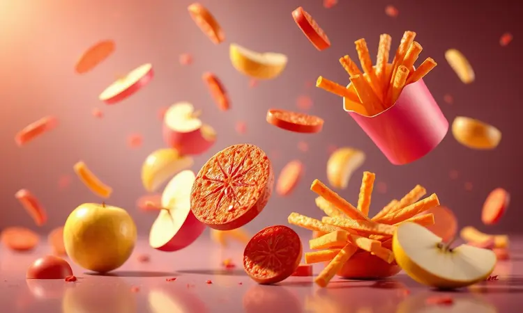
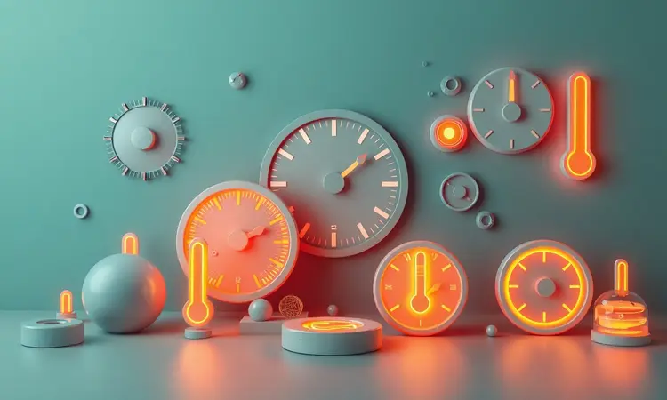

As fritadeiras sem óleo, conhecidas carinhosamente como Air Fryers, transformaram o ato de cozinhar em algo que vai muito além da praticidade.

Elas trouxeram para nossa rotina a possibilidade de saborear alimentos crocantes sem aquela culpa pós-refeição, e a Oster, com sua tradição em eletrodomésticos, criou uma linha que conversa com todos os tipos de cozinheiros.

Desde quem prepara um jantar solo até famílias que precisam de versatilidade para receber amigos, existe um modelo pensado para você.

Este guia não é apenas um ranking, é seu mapa para descobrir qual dessas 14 maravilhas tecnológicas vai se tornar sua parceira na cozinha em 2025, com dicas que vão desde a primeira batata frita até a limpeza que preserva seu investimento por anos.

<SummaryList products={frontmatter.top_products} />

## Melhores Modelos de Fritadeira Elétrica Oster para Comprar

Imagine abrir a porta para o cheiro de batatas crocantes recém-saídas da fritadeira, sem aquele óleo que respinga pela cozinha toda.

As fritadeiras elétricas da Oster transformam essa cena em realidade diária, com uma variedade que vai do compacto discreto ao modelo que parece ter saído de uma cozinha profissional.

A escolha não é sobre qual é a melhor tecnicamente, mas sobre qual combina com seu ritmo, seu espaço e sua forma de celebrar a comida.

### 1. Fritadeira Inox DiamondTech Oster 7,5L com Visor Transparente

<ProductBox 
  title={frontmatter.top_products[0].title} 
  image={frontmatter.top_products[0].image} 
  link={frontmatter.top_products[0].link} 
/>

Quando sua família cresce ou os amigos aparecem sem aviso, ter espaço para cozinhar tudo de uma vez vira prioridade. Esta fritadeira de 7,5 litros é a resposta para quem não quer fazer rodízio de batatas.

O revestimento DiamondTech não é apenas um nome bonito, é a garantia de que mesmo o queijo mais grudento sai do cesto sem deixar vestígios, tornando a limpeza tão rápida quanto o cozimento. E o melhor?

Você não precisa interromper o processo para checar se está no ponto certo. O visor transparente transforma a espera em um espetáculo, observando os alimentos ganharem aquele dourado perfeito sem perder um grau de calor.

<CaixaProsContras>

**Prós:**

- Revestimento em DiamondTech para fácil limpeza

- Capacidade de 7,5 litros ideal para diversas porções

- Visor transparente para monitorar o cozimento

- Painel touch com funções pré-programadas

**Contras:**

- Pode ocupar bastante espaço na bancada

- O tamanho pode ser excessivo para pessoas que cozinham apenas para si

</CaixaProsContras>

### 2. Fritadeira DiamondTech Oster 6L com Visor Transparente

<ProductBox 
  title={frontmatter.top_products[1].title} 
  image={frontmatter.top_products[1].image} 
  link={frontmatter.top_products[1].link} 
/>

Para quem ama receber mas não tem uma cozinha de restaurante, esta fritadeira de 6 litros encontra o equilíbrio perfeito entre generosidade e praticidade. A tecnologia DiamondTech age como um escudo invisível, impedindo que seus alimentos criem raízes no fundo do cesto.

A verdadeira magia acontece quando você olha através do visor e vê as asinhas de frango ficando crocantes, sem precisar abrir e interromper aquele fluxo de ar quente que faz toda a diferença.

Com 1700W de potência, ela não promete rapidez, ela cumpre, entregando resultados que fazem seus convidados perguntarem qual seu segredo.

<CaixaProsContras>

**Prós:**

- Revestimento antiaderente com partículas de diamante.

- Visor transparente que permite monitorar o cozimento.

- Alta capacidade de 6 litros ideal para famílias.

- Painel touch com 10 funções pré-programadas.

**Contras:**

- Pode ocupar bastante espaço na cozinha.

- O tamanho pode não ser ideal para quem cozinha para uma pessoa só.

</CaixaProsContras>

### 3. Fritadeira Digital Touch Oster 4,5L com Visor Transparente

<ProductBox 
  title={frontmatter.top_products[2].title} 
  image={frontmatter.top_products[2].image} 
  link={frontmatter.top_products[2].link} 
/>

Há algo quase hipnótico em observar o processo de cozimento através de um visor iluminado. Esta fritadeira transforma o preparo de um simples jantar em uma experiência, onde você acompanha cada etapa como um diretor assistindo sua obra prima.

As 8 funções pré-programadas são como ter um assistente pessoal na cozinha, garantindo que o frango fique crocante e os legumes mantenham seu sabor natural.

Com 4,5 litros, ela é a companheira ideal para famílias que valorizam qualidade sem exageros, provando que tamanho não é documento quando se trata de sabor.

<CaixaProsContras>

**Prós:**

- Visor transparente que permite acompanhar o cozimento.

- Painel digital touch com várias funções pré-programadas.

- Alta potência para preparo rápido e eficiente.

- Fácil limpeza e manutenção.

**Contras:**

- Capacidade de 4,5 litros pode ser limitada para grandes refeições.

- Preço pode ser um pouco mais alto em comparação a modelos mais simples.

</CaixaProsContras>

### 4. Fritadeira Digital Inox Oster 5L com Painel Touch

<ProductBox 
  title={frontmatter.top_products[3].title} 
  image={frontmatter.top_products[3].image} 
  link={frontmatter.top_products[3].link} 
/>

Alguns eletrodomésticos você esconde, outros você exibe com orgulho. Com seu design em aço inox, esta fritadeira pertence à segunda categoria.

Ela não apenas cozinha, ela eleva o visual da sua cozinha, enquanto os 5 litros de capacidade garantem que ninguém fique com fome.

O painel touch responde ao seu toque como um smartphone, tornando a seleção de temperaturas e funções tão intuitiva quanto enviar uma mensagem. E quando a festa acaba, a grelha Easy Clean lembra que tecnologia também deve simplificar, não complicar.

<CaixaProsContras>

**Prós:**

- Design elegante em aço inox.

- Capacidade generosa de 5 litros.

- Painel digital touch com funções pré-programadas.

- Potência de 1700W para cozimento rápido.

**Contras:**

- Preço pode ser acima da média.

- Opções de receitas podem ser limitadas para quem busca mais variedade.

</CaixaProsContras>

### 5. Fritadeira Black Perform 4,5L Oster

<ProductBox 
  title={frontmatter.top_products[4].title} 
  image={frontmatter.top_products[4].image} 
  link={frontmatter.top_products[4].link} 
/>

Para quem gosta quando a tecnologia fala baixo mas age com força. Esta fritadeira preta discreta esconde 1500W de potência que transformam ingredientes simples em refeições memoráveis.

O cesto quadrado não é um capricho de design, mas uma engenharia que otimiza cada jato de ar quente para garantir que todos os lados do alimento recebam atenção igual.

Ajustar a temperatura entre 80°C e 200°C significa que você pode desde descongelar pão até criar chips de legumes crocantes, tudo no mesmo aparelho.

<CaixaProsContras>

**Prós:**

- Capacidade generosa de 4,5 litros.

- Aquecimento rápido com potência de 1500W.

- Controle de temperatura ajustável.

- Design moderno e fácil de limpar.

**Contras:**

- Não é bivolt, com versões específicas para 127V e 220V.

- Pode aquecer bastante durante o uso prolongado, exigindo pausas.

</CaixaProsContras>

### 6. Fritadeira Inox Compact 4,6L Oster

<ProductBox 
  title={frontmatter.top_products[5].title} 
  image={frontmatter.top_products[5].image} 
  link={frontmatter.top_products[5].link} 
/>

Em cozinhas onde cada centímetro conta, esta fritadeira prova que grande desempenho vem em pacotes compactos.

Os 4,6 litros são suficientes para preparar o jantar da família sem dominar sua bancada, enquanto os 1500W garantem que você não precise escolher entre espaço e velocidade.

O timer de 60 minutos é como ter um despertador culinário, permitindo que você prepare o cesto, programe e vá cuidar de outras coisas enquanto a mágica acontece.

<CaixaProsContras>

**Prós:**

- Capacidade ideal para famílias.

- Design compacto que economiza espaço.

- Potência que proporciona cozimento rápido e uniforme.

- Fácil limpeza com grelha removível.

**Contras:**

- Não é bivolt, limitando a flexibilidade de uso.

- Consumo de energia relativamente alto.

</CaixaProsContras>

### 7. Fritadeira Digital Clear Oster 4,6L com Visor Transparente

<ProductBox 
  title={frontmatter.top_products[6].title} 
  image={frontmatter.top_products[6].image} 
  link={frontmatter.top_products[6].link} 
/>

Reduzir 99,5% do óleo não é apenas um número em uma caixa, é a liberdade de saborear batatas fritas sem aquela sensação pesada depois. Este modelo leva a transparência a sério, tanto no visor que mostra o processo quanto na proposta de uma alimentação mais leve.

As 8 funções pré-programadas são como atalhos para o sucesso culinário, especialmente quando você está cansado depois do trabalho e só quer algo gostoso sem complicações.

<CaixaProsContras>

**Prós:**

- Visor transparente que permite visualizar os alimentos durante o cozimento.

- Capacidade de 4,6 litros ideal para famílias.

- Painel digital com várias funções pré-programadas.

- Limpeza facilitada com grelha Easy Clean.

**Contras:**

- Design compacto pode ser limitante em espaços muito pequenos.

- A diversidade de funções pode parecer excessiva para quem busca simplicidade.

</CaixaProsContras>

### 8. Fritadeira Oven Fryer 12L Oster Multi Touch 3 em 1

<ProductBox 
  title={frontmatter.top_products[7].title} 
  image={frontmatter.top_products[7].image} 
  link={frontmatter.top_products[7].link} 
/>

Por que ter três eletrodomésticos quando um faz tudo? Esta não é apenas uma fritadeira, é uma estação culinária completa que frita, assa e desidrata.

Os 12 litros são para quem não entende cozinhar como tarefa, mas como celebração, permitindo preparar desde pães até frutas desidratadas para o lanche das crianças.

O painel touch colorido guia você como um GPS culinário, tornando a multifuncionalidade acessível mesmo para quem está começando.

<CaixaProsContras>

**Prós:**

- Multifuncionalidade: frita, assa e desidrata.

- Grande capacidade de 12 litros, ideal para famílias.

- Painel touch intuitivo e moderno.

- Inclui funções pré-programadas para facilitar o preparo.

**Contras:**

- Desempenho da fritadeira pode não ser tão potente quanto modelos dedicados.

- Limitações em alguns ajustes de tempo de cozimento.

</CaixaProsContras>

### 9. Fritadeira Oven Fryer 12L Oster 3 em 1

<ProductBox 
  title={frontmatter.top_products[8].title} 
  image={frontmatter.top_products[8].image} 
  link={frontmatter.top_products[8].link} 
/>

Imagine um cesto que gira sozinho, garantindo que cada pedaço de frango receba a mesma quantidade de calor.

Esta fritadeira traz essa tecnologia para sua casa, junto com a possibilidade de explorar temperaturas desde os suaves 40°C para desidratar até os 200°C para fritar.

As nove funções diferentes são como ter um livro de receitas embutido, especialmente útil quando a criatividade culinária dá uma pausa, mas a fome não.

<CaixaProsContras>

**Prós:**

- Multifuncional, atuando como fritadeira, forno e desidratador.

- Capacidade ampla de 12 litros, ideal para famílias.

- Funções pré-programadas que facilitam o uso.

- Cesto rotativo para cozimento uniforme.

**Contras:**

- Limpeza dos acessórios pode ser trabalhosa.

- Design pode ocupar um espaço considerável na cozinha.

</CaixaProsContras>

### 10. Fritadeira Sem Óleo 2 em 1 Black Inox 4,8L Oster

<ProductBox 
  title={frontmatter.top_products[9].title} 
  image={frontmatter.top_products[9].image} 
  link={frontmatter.top_products[9].link} 
/>

O aço inox não é apenas estética, é durabilidade que resiste ao teste do tempo e dos respingos de óleo. Esta fritadeira combina essa resistência com 4,8 litros que entendem que família não tem hora para comer.

A função desidratar é a cereja do bolo, permitindo que você crie snacks saudáveis para a semana toda, transformando bananas em chips e tomates em deliciosos petiscos.

<CaixaProsContras>

**Prós:**

- Design moderno e elegante em aço inox.

- Grande capacidade de 4,8 litros, ideal para refeições familiares.

- Diversas funções pré-programadas, incluindo desidratação.

- Potência de 1500W para um preparo rápido e eficiente.

**Contras:**

- O painel digital pode ser confuso no início.

- Não é bivolt, o que limita sua flexibilidade em diferentes ambientes.

</CaixaProsContras>

### 11. Fritadeira Ultra Digital 2 em 1 Inox 4,8L Oster com Painel Touch

<ProductBox 
  title={frontmatter.top_products[10].title} 
  image={frontmatter.top_products[10].image} 
  link={frontmatter.top_products[10].link} 
/>

Segurança e estilo andam de mãos dadas neste modelo. O desligamento automático é aquele amigo que lembra você de desligar o fogão quando sai de casa, enquanto a pausa ao abrir a cesta respeita seu ritmo de cozimento.

Os 4,8 litros conversam com sua realidade familiar, sabendo que algumas noites são apenas um jantar rápido, enquanto outras merecem uma celebração completa.

<CaixaProsContras>

**Prós:**

- Design moderno e elegante em inox.

- Capacidade generosa de 4,8 litros.

- Painel touch com funções pré-programadas.

- Potente e rápida no preparo dos alimentos.

**Contras:**

- Não é bivolt, o que pode limitar o uso em diferentes locais.

- Algumas funções avançadas podem exigir um tempo de adaptação.

</CaixaProsContras>

### 12. Fritadeira Oster 4,7 L OFRT970

<ProductBox 
  title={frontmatter.top_products[11].title} 
  image={frontmatter.top_products[11].image} 
  link={frontmatter.top_products[11].link} 
/>

Do bolo de caneca às batatas fritas perfeitas, esta fritadeira não conhece limites culinários. O timer de 90 minutos é para quem entende que algumas carnes precisam de paciência, enquanto o visor transparente tira o mistério do processo.

É aquele eletrodoméstico que você compra pensando em fritar batatas e descobre que pode assar um bolo de aniversário surpresa.

<CaixaProsContras>

**Prós:**

- Capacidade ideal para famílias

- Painel digital intuitivo

- Funções pré-programadas práticas

- Visor transparente para monitoramento

**Contras:**

- Tempo de cozimento maior para carnes espessas

- Fragilidade das borrachas da grelha em alguns casos

</CaixaProsContras>

### 13. Fritadeira e Forno Oster 42 L French Door

<ProductBox 
  title={frontmatter.top_products[12].title} 
  image={frontmatter.top_products[12].image} 
  link={frontmatter.top_products[12].link} 
/>

Quando seu conceito de cozinhar envolve preparar o frango assado e as batatas rústicas ao mesmo tempo, este forno de 42 litros com portas duplas é sua resposta.

As portas não são apenas um detalhe de design, são uma solução prática para quem já derrubou comida tentando acessar o fundo do forno. A temperatura que vai até 230°C fala a língua dos assados perfeitos, com aquela crosta dourada que faz todos perguntarem sua receita.

<CaixaProsContras>

**Prós:**

- Design elegante com portas duplas que economizam espaço.

- Capacidade suficiente para preparar várias receitas simultaneamente.

- Opção de fritar sem óleo, promovendo refeições mais saudáveis.

- Funções versáteis que atendem a diferentes necessidades culinárias.

**Contras:**

- Algumas avaliações indicam questões de durabilidade das portas.

- Interface analógica pode não agradar a todos os usuários.

</CaixaProsContras>

### 14. Fritadeira Super Fryer 10L Oster 3 em 1

<ProductBox 
  title={frontmatter.top_products[13].title} 
  image={frontmatter.top_products[13].image} 
  link={frontmatter.top_products[13].link} 
/>

A luz interna deste modelo é como ter um holofote na sua criação culinária, iluminando cada etapa do processo. Os 10 litros entendem que receber amigos não deve ser estressante, permitindo que você prepare porções generosas sem fazer várias rodadas.

As sete funções diferentes são como ter um chef assistente, especialmente quando você quer impressionar mas o tempo está curto.

<CaixaProsContras>

**Prós:**

- Tecnologia 3 em 1 que permite fritar, assar e desidratar.

- Capacidade generosa de 10 litros.

- Painel digital intuitivo e fácil de usar.

- Versatilidade com múltiplas funções de preparo.

**Contras:**

- A limpeza interna pode ser um desafio.

- O cabo de alimentação pode ser curto para algumas cozinhas.

</CaixaProsContras>

## Por que você precisa de uma fritadeira elétrica?

Depois de explorar tantas opções, você deve estar se perguntando: mas por que eu realmente preciso de uma? A resposta vai além da lista de funcionalidades.

Ter uma fritadeira elétrica é sobre recuperar o prazer de comer alimentos crocantes sem aquela conversa interna sobre escolhas saudáveis. É sobre acordar no sábado e fazer waffles sem sujar três panelas diferentes.

É sobre a praticidade de preparar o jantar enquanto ajuda seu filho com a lição de casa, sem precisar ficar vigiando o fogão. Ela transforma o ato de cozinhar de uma obrigação em uma possibilidade, especialmente nos dias em que o tempo é seu bem mais precioso.

### AirFryer ou fritadeira elétrica: qual a diferença?

Vamos esclarecer essa confusão de uma vez por todas. Enquanto a fritadeira tradicional pede um banho de óleo para funcionar, a AirFryer sussurra ao seu ouvido: "deixe o ar quente fazer o trabalho". A diferença não está apenas no método, mas no resultado final.

A circulação de ar das AirFryers atua como milhares de mãozinhas invisíveis, tocando cada pedaço do alimento uniformemente.

Já as fritadeiras elétricas tradicionais dependem mais da imersão no óleo, o que pode criar aquelas variações de crocância que ora agradam, ora frustram. A escolha se resume a uma pergunta simples: você prefere a tradição do frito ou a inovação do crocante saudável?

### 5 motivos para ter uma fritadeira elétrica em casa

1. **Liberdade sem culpa:** Imagine saborear batatas fritas com apenas uma colher de óleo. Essa é a matemática que muda seu relacionamento com a comida.

2. **Tempo que volta para você:** Em vez de gastar 30 minutos vigiando o fogão, você programa e vai ler um livro enquanto o jantar fica pronto.

3. **Versatilidade surpreendente:** Ela não sabe que é apenas uma fritadeira. Para ela, assar um bolo ou desidratar frutas para snacks é perfeitamente normal.

4. **Limpeza que não assusta:** Partes removíveis significam que você não precisa ser contorcionista para limpar cantos impossíveis.

5. **Economia que aparece:** Menos óleo comprado, menos gás consumido, menos tempo gasto. Os números no final do mês agradecem.

## Como usar a fritadeira elétrica corretamente

Comprar a fritadeira perfeita é apenas o primeiro passo. O verdadeiro segredo está em aprender a dançar com ela. Comece sempre com o pré-aquecimento, como você faria com um forno tradicional.

Essa etapa é o abraço inicial que prepara o aparelho para receber seus alimentos. Evite a tentação de encher o cesto até a borda, pense no ar quente como um convidado que precisa de espaço para circular entre os alimentos.

E sempre, sempre use recipientes apropriados, porque mesmo a tecnologia mais avançada respeita as regras básicas da física.

### Como escolher a melhor fritadeira?

Escolher não precisa ser um quebra-cabeça. Comece olhando para sua rotina: quantas pessoas você alimenta diariamente? Sua cozinha tem espaço para um modelo maior ou precisa de algo discreto? As funcionalidades são seu próximo filtro.

Um bom temporizador é como ter um assistente de cozinha, enquanto temperaturas ajustáveis dão a você o controle criativo sobre cada receita.

Pense também no dia seguinte ao uso: peças removíveis não são um luxo, são sua garantia de que o prazer de cozinhar não será arruinado pela tarefa de limpar. Por fim, observe a eficiência energética, porque sustentabilidade também é sobre cuidar do seu bolso.

### Confira a capacidade da fritadeira

Capacidade é mais do que um número no manual. É sobre entender seu estilo de vida. Para casais ou pequenas famílias, modelos entre 1,5 e 3 litros são como bons amigos: presentes sem serem invasivos.

Já famílias maiores ou anfitriões frequentes encontrarão nos 4 litros ou mais o espaço necessário para criatividade sem limites. Mas atenção: mais litros significam mais espaço na bancada.

Encontre o equilíbrio entre suas aspirações culinárias e a realidade do seu balcão.

### Verifique o controle de temperatura

O controle de temperatura é o maestro da sua orquestra culinária. Ele decide se suas batatas ficam douradas ou queimadas, se o frango fica suculento ou seco.

Um ajuste preciso significa poder explorar desde técnicas delicadas de desidratação até frituras rápidas e intensas. É a diferença entre seguir uma receita e criar sua própria versão, com a segurança de saber que o equipamento responde aos seus comandos com exatidão.

### Informe-se sobre o sistema de circulação de ar

O sistema de circulação de ar é o coração da fritadeira sem óleo. Pense nele como um redemoinho controlado de ar quente que abraça cada pedaço de alimento com igual intensidade.

Modelos eficientes transformam esse fluxo em resultados consistentes: crocância por fora, maciez por dentro, sem pontos crus ou queimados.

Quando estiver comparando modelos, pergunte-se: esse sistema é poderoso o suficiente para lidar com uma cesta cheia, ou ele funciona melhor com porções menores?

### Veja o produto é fácil de limpar

A Oster entende que ninguém compra um eletrodoméstico pensando na hora de limpar, mas essa hora sempre chega.

Por isso, a maioria dos modelos vem com cestos e bandejas que se despedaçam com facilidade, prontos para uma lavagem rápida na pia ou até na máquina de lavar louça.

As superfícies externas repelem gordura quase por magia, exigindo apenas um pano úmido para brilhar como novas. Essa preocupação com a manutenção transforma a fritadeira de um projeto de fim de semana em um hábito diário sustentável.

### Funções extras

As funções extras são os segredos que sua fritadeira guarda para surpreendê-lo. Modos pré-programados são como receitas de avó embutidas no sistema, garantindo que suas batatas sempre saiam no ponto certo.

Funções de assar e grelhar expandem seu cardápio sem expandir sua coleção de eletrodomésticos. E o temporizador? Ele é aquele amigo confiável que toca o alarme exatamente quando a perfeição foi alcançada, liberando você para viver enquanto a comida cozinha.

## Passo a passo para limpar sua Air Fryer

Limpar sua Air Fryer não precisa ser um ritual complicado. Comece sempre com segurança: desconecte e espere esfriar. Remova o cesto e a bandeja coletora, essas partes geralmente são as que mais acumulam resíduos.

Uma esponja macia, água morna e detergente suave são seus melhores aliados. Para o interior do aparelho, um pano úmido resolve a maioria das situações. Encontrou algum resíduo mais teimoso?

Uma pasta de bicarbonato de sódio e água age como um removedor natural sem agredir o material. O passo final é crucial: seque completamente todas as partes antes de guardar. A umidade é o único inimigo que sua fritadeira realmente teme.

## Conclusão

Escolher uma fritadeira Oster é mais do que selecionar um eletrodoméstico, é convidar uma parceira para sua jornada culinária.

Cada modelo que exploramos carrega não apenas especificações técnicas, mas uma promessa: a de transformar momentos comuns em memórias saborosas, sem complicações ou culpas.

Desde o visor transparente que torna o cozimento um espetáculo até os sistemas DiamondTech que garantem limpeza sem esforço, a tecnologia serve a um propósito simples: devolver o prazer de cozinhar e compartilhar.

Seja você um solteiro que redescobre o prazer de preparar suas refeições, um pai que quer oferecer opções mais saudáveis para as crianças, ou um anfitrião que ama receber sem stress, existe uma Oster esperando para se tornar parte da sua rotina.

A decisão final não está nos watts ou litros, mas na conexão entre suas necessidades reais e as soluções que esses aparelhos oferecem. Qual deles vai ganhar um lugar permanente na sua bancada e no seu coração?

## Perguntas Frequentes (FAQ)

As fritadeiras sem óleo realmente deixam os alimentos crocantes?
Absolutamente. A circulação de ar quente em alta velocidade cria uma camada externa crocante enquanto mantém o interior úmido e saboroso. É física aplicada ao sabor.

A limpeza é tão fácil quanto dizem?
Na maioria dos modelos sim, graças às partes removíveis e revestimentos antiaderentes. O segredo está em limpar logo após o uso, antes que os resíduos se transformem em desafios.

Posso preparar apenas frituras?
Essa é a beleza da surpresa. Sua fritadeira está pronta para assar, grelhar, desidratar e até fazer sobremesas. Ela apenas espera sua criatividade para mostrar todo seu potencial.