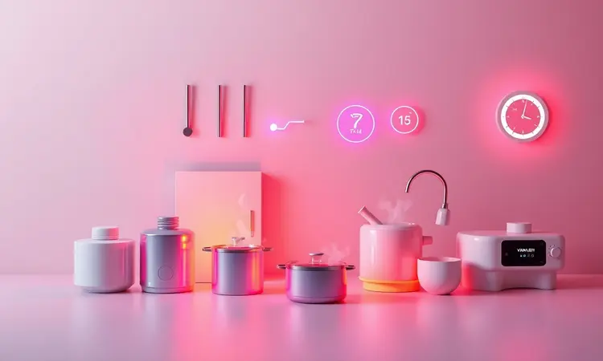
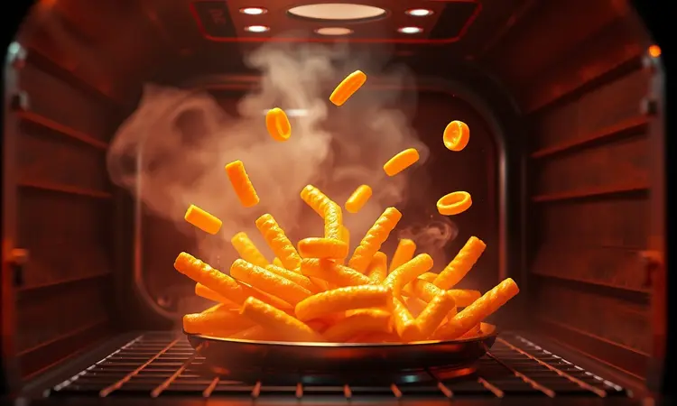

Procurando pela melhor air fryer oven para transformar sua cozinha em 2025? Esses modelos híbridos, que unem a rapidez da fritadeira elétrica com a versatilidade do forno, tornaram-se o desejo de consumo de quem busca praticidade e saúde.

Imagine jantares crocantes e saborosos sem aquela culpa do óleo em excesso, ou a liberdade de assar, grelhar e até desidratar alimentos em um único aparelho.

Com tantas opções de marcas consagradas como Electrolux, Mondial e Philco, escolher o modelo ideal pode ser um desafio.

Neste guia completo, analisamos as melhores fritadeiras com forno disponíveis no mercado, considerando como cada uma se encaixa na sua rotina, nas suas necessidades familiares e no seu orçamento.

Explore nosso ranking atualizado com 13 opções e descubra qual air fryer oven vai facilitar sua rotina e elevar o nível das suas receitas de forma definitiva.

<SummaryList products={frontmatter.top_products} />

## Ranking das melhores air fryers oven da atualidade

As air fryers oven conquistaram nossas cozinhas por uma razão simples: elas entregam a promessa de refeições mais saudáveis sem exigir que você abra mão do sabor ou da praticidade.

Como se fossem um amigo de cozinha versátil, esses aparelhos combinam a magia de fritar sem óleo com a capacidade de assar, grelhar e até desidratar. Mas entre tantas opções disponíveis, como escolher a certa?

Vamos explorar 13 modelos que realmente fazem diferença no dia a dia.

### 1. Air fryer oven Electrolux EAF90

<ProductBox 
  title={frontmatter.top_products[0].title} 
  image={frontmatter.top_products[0].image} 
  link={frontmatter.top_products[0].link} 
/>

Imagine ter um assistente culinário que prepara desde batatas fritas crocantes até frango assado suculento, tudo com um toque no painel digital.

A Electrolux EAF90 oferece exatamente essa experiência, com seus 12 litros de capacidade que permitem cozinhar para a família inteira em uma única etapa.

Com cinco modos de preparo incluindo Airfry, Gratinar e até Rotisserie, você ganha uma versatilidade rara na cozinha.

O que realmente encanta nesse modelo é como ele simplifica o processo criativo. Tem mais de 10 funções pré-selecionadas que eliminam as adivinhações sobre tempo e temperatura.

Daquele bolo especial do domingo aos snacks saudáveis da semana, tudo fica perfeito com temperatura ajustável entre 60°C e 200°C. A porta de vidro removível não só deixa você acompanhar o cozimento como transforma a limpeza em tarefa rápida e sem complicações.

<CaixaProsContras>

**Prós:**

- Capacidade generosa de 12 litros.

- Múltiplos modos de preparo para diversas receitas.

- Painel digital com funções práticas e intuitivas.

- Design moderno e fácil de limpar.

**Contras:**

- Preço mais elevado em comparação a outros modelos.

- Pode ser considerada grande para cozinhas menores.

</CaixaProsContras>

### 2. Air fryer oven Britânia BFR2100

<ProductBox 
  title={frontmatter.top_products[1].title} 
  image={frontmatter.top_products[1].image} 
  link={frontmatter.top_products[1].link} 
/>

Se a Electrolux é sua opção premium, a Britânia BFR2100 conquista pelo equilíbrio perfeito entre funcionalidade e custo-benefício.

Com os mesmos 12 litros de capacidade, ela se torna o centro das atenções na cozinha de famílias que valorizam refeições saudáveis sem abrir mão da praticidade. O encanto começa no painel digital touch com 9 funções pré-programadas que guiam você desde o primeiro uso.

A função desidratar merece destaque especial, transformando frutas da estação em snacks naturais que duram semanas. Você pode preparar maçãs desidratadas para as lancheiras das crianças ou tomates secos para incrementar suas saladas.

O cuidado necessário com o painel digital é pequeno preço a pagar por tanta versatilidade em um único aparelho.

<CaixaProsContras>

**Prós:**

- Multifuncionalidade 4 em 1, abrangendo diversas preparações.

- Capacidade de 12 litros, ideal para famílias.

- Controle de temperatura ajustável para diferentes receitas.

- Acessórios inclusos facilitam o uso e a limpeza.

**Contras:**

- Painel digital sensível a riscos, requer cuidados na limpeza.

- Não é bivolt; é necessário escolher a voltagem correta ao comprar.

</CaixaProsContras>

### 3. Air fryer oven Philco PAF16A

<ProductBox 
  title={frontmatter.top_products[2].title} 
  image={frontmatter.top_products[2].image} 
  link={frontmatter.top_products[2].link} 
/>

Quando o espaço na bancada permite pensar grande, a Philco PAF16A surge como uma escolha impressionante. Com 16 litros de capacidade total e um cesto específico de 5,5 litros para frituras, ela oferece uma flexibilidade que poucos modelos conseguem igualar.

Imagine preparar um frango assado enquanto frita batatas no mesmo aparelho, tudo com a segurança de 10 funções pré-programadas.

A experiência visual é outro trunfo, com seu design em inox e porta de vidro que transformam o acompanhamento do cozimento em algo quase terapêutico.

Ver seus alimentos ganhando aquele dourado perfeito sem abrir a porta e perder calor é um luxo que faz toda diferença no resultado final.

Sim, ela consome mais energia, mas a eficiência no preparo e a redução no uso de óleo criam um equilíbrio que muitos consideram justo.

<CaixaProsContras>

**Prós:**

- Capacidade generosa de 16 litros.

- Várias funções pré-programadas para diferentes tipos de preparo.

- Design moderno em inox com porta de vidro.

- Fácil limpeza devido ao revestimento antiaderente.

**Contras:**

- Consumo de energia relativamente alto.

- Pode ocupar um espaço considerável na cozinha.

</CaixaProsContras>

### 4. Air fryer oven Mondial AFON-12L-BI

<ProductBox 
  title={frontmatter.top_products[3].title} 
  image={frontmatter.top_products[3].image} 
  link={frontmatter.top_products[3].link} 
/>

Para quem busca tecnologia avançada a um preço mais acessível, a Mondial AFON-12L-BI apresenta um argumento convincente.

Sua tecnologia de circulação de ar quente não é apenas um termo de marketing, mas uma realidade que você percebe no primeiro uso: alimentos uniformemente crocantes, sem aquelas áreas que ficam mais cozidas que outras.

Os 12 litros de capacidade abraçam famílias maiores ou aqueles fins de semana com visitas.

O pacote completo com assadeiras antiaderentes e luva de silicone mostra que a marca pensou na experiência do usuário desde o primeiro dia.

O detalhe da tomada de 20A requer atenção, mas uma vez resolvido, você tem um aliado na cozinha que entrega consistência receita após receita.

<CaixaProsContras>

**Prós:**

- Grande capacidade de 12 litros, perfeita para porções maiores.

- Painel digital com várias funções predefinidas, facilitando o uso.

- Tecnologia de circulação de ar quente para resultados crocantes.

- Acompanha diversos acessórios úteis para cozinhar.

**Contras:**

- Requer uma tomada específica de 20A, o que pode exigir adaptações.

- A limpeza pode ser mais trabalhosa em comparação a modelos menores com cesto.

</CaixaProsContras>

### 5. Air fryer oven WAP FW009548

<ProductBox 
  title={frontmatter.top_products[4].title} 
  image={frontmatter.top_products[4].image} 
  link={frontmatter.top_products[4].link} 
/>

A WAP FW009548 fala diretamente com quem valoriza simplicidade e eficiência. Seu timer programável de 90 minutos é um convite para esquecer o relógio enquanto prepara aquelas receitas que precisam de tempo e paciência.

A tecnologia de circulação de ar a 360° garante que cada pedaço receba a mesma atenção, resultando em pratos onde a qualidade não varia conforme a posição na grelha.

A praticidade do design removível transforma a limpeza em tarefa de minutos, não de horas. A preocupação com possível ferrugem interna com o tempo é válida, mas com os cuidados adequados de secagem após cada uso, você prolonga significativamente a vida útil do aparelho.

<CaixaProsContras>

**Prós:**

- Grande capacidade de 12 litros, ideal para famílias.

- Múltiplas funções pré-programadas facilitam o uso.

- Painel digital intuitivo e fácil de operar.

- Design removível que simplifica a limpeza.

**Contras:**

- Possíveis problemas com ferrugem interna ao longo do tempo.

- A prateleira superior pode cozinhar mais rápido, exigindo atenção.

</CaixaProsContras>

### 6. Air fryer oven Elgin AFO00

<ProductBox 
  title={frontmatter.top_products[5].title} 
  image={frontmatter.top_products[5].image} 
  link={frontmatter.top_products[5].link} 
/>

A Elgin AFO00 chega com a promessa de transformar sua relação com a fritura.

Reduzir até 80% da gordura dos alimentos não é apenas um número em uma especificação técnica, é a possibilidade real de servir à sua família refeições mais leves sem sacrificar o sabor que todos amam.

A tecnologia Air Circuit 360º garante que essa redução de gordura não signifique alimentos secos ou sem graça.

O design em "Black Piano" é tão fácil de limpar quanto de admirar, tornando a manutenção do aparelho parte prazerosa da rotina.

A curva de aprendizado com o painel digital touch existe, mas é curta, e logo você estará navegando entre funções com a naturalidade de quem sempre teve um.

<CaixaProsContras>

**Prós:**

- Capacidade generosa de 12 litros.

- Tecnologia que garante cozimento uniforme.

- Funções múltiplas: assar, fritar e reaquecer.

- Design moderno e fácil de limpar.

**Contras:**

- Pode ser um pouco complexa para iniciantes devido ao painel digital.

- O tamanho pode ser excessivo para pequenas cozinhas.

</CaixaProsContras>

### 7. Air fryer oven HQ RA015

<ProductBox 
  title={frontmatter.top_products[6].title} 
  image={frontmatter.top_products[6].image} 
  link={frontmatter.top_products[6].link} 
/>

O que diferencia a HQ RA015 é sua abordagem sem concessões à multifuncionalidade. Com timer ajustável de até 240 minutos, ela abraça desde snacks rápidos até projetos culinários mais ambiciosos como desidratar frutas para estoque.

A faixa de temperatura de 80°C a 200°C oferece o controle fino necessário para alimentos sensíveis que exigem precisão.

O material antiaderente não é apenas um detalhe, mas uma filosofia que permeia toda a experiência de uso. Limpar após o preparo se torna tarefa tão simples quanto preparar.

A atenção necessária à voltagem (não é bivolt) é um pequeno obstáculo que, uma vez superado, revela um aparelho robusto e confiável.

<CaixaProsContras>

**Prós:**

- Multifuncional, com várias opções de cocção.

- Grande capacidade de 12 litros.

- Fácil limpeza devido ao material antiaderente.

- Segurança no cozimento, evitando respingos de óleo.

**Contras:**

- Não é bivolt, disponível apenas em 127V ou 220V.

- O tamanho pode ser um pouco grande para cozinhas menores.

</CaixaProsContras>

### 8. Air fryer oven Oster OFRT780

<ProductBox 
  title={frontmatter.top_products[7].title} 
  image={frontmatter.top_products[7].image} 
  link={frontmatter.top_products[7].link} 
/>

A Oster OFRT780 entende que famílias modernas precisam de soluções que acompanhem seu ritmo. Com 9 funções de cozimento e 4 pré-definições dedicadas, ela quase parece ler sua mente, sugerindo as configurações ideais para cada tipo de alimento.

O cesto rotativo e espeto giratório não são apenas recursos técnicos, mas garantias visuais de que tudo está cozinhando de forma uniforme.

A iluminação interna transforma o acompanhamento do cozimento em experiência quase cinematográfica. Ver seu frango ganhando aquele dourado perfeito sem abrir a porta e interromper o processo é um pequeno luxo que faz grande diferença no resultado final.

A limpeza dos acessórios exige atenção, mas é preço pequeno para tanta versatilidade.

<CaixaProsContras>

**Prós:**

- Multifunções que permitem fritar, assar e desidratar.

- Capacidade adequada para famílias grandes.

- Cesto rotativo para um cozimento uniforme.

- Design moderno com iluminação interna.

**Contras:**

- A limpeza de alguns acessórios pode ser trabalhosa.

- Pode ser um pouco barulhenta durante o funcionamento.

</CaixaProsContras>

### 9. Air fryer oven EOS EAF15IP

<ProductBox 
  title={frontmatter.top_products[8].title} 
  image={frontmatter.top_products[8].image} 
  link={frontmatter.top_products[8].link} 
/>

Quando espaço nunca é demais, a EOS EAF15IP apresenta seus impressionantes 15 litros de capacidade.

Este não é apenas um número em uma ficha técnica, mas a liberdade de preparar o jantar de sexta-feira para a família inteira ou o almoço de domingo com os parentes sem precisar de múltiplas etapas.

A tecnologia de circulação de ar quente garante que tamanho não seja inimigo da qualidade.

O sistema antiaderente MaxxiClean cumpre a promessa de facilitar a limpeza, transformando o que poderia ser tarefa penosa em processo rápido.

A fragilidade da junta da porta merece atenção, mas com cuidado no manuseio, você tem um companheiro de cozinha que entrega consistência dia após dia.

<CaixaProsContras>

**Prós:**

- Capacidade generosa de 15 litros.

- Multifuncional, permitindo fritar, assar, grelhar e desidratar.

- Painel digital que facilita o uso.

- Sistema de limpeza fácil com revestimento antiaderente.

**Contras:**

- A junta da porta pode ser frágil.

- Não é tão silenciosa quanto outros modelos disponíveis.

</CaixaProsContras>

### 10. Air fryer oven Philips Walita AI551/09

<ProductBox 
  title={frontmatter.top_products[9].title} 
  image={frontmatter.top_products[9].image} 
  link={frontmatter.top_products[9].link} 
/>

A Philips Walita AI551/09 representa o encontro entre tradição e inovação. A tecnologia Rapid Air não é novidade, mas aqui ela é refinada até a excelência, garantindo que redução de gordura nunca signifique redução de sabor ou textura.

O aparelho promete até 90% menos gordura, mas o que realmente impressiona é como mantém a crocância que todos amam.

A conexão com o aplicativo HomeID é mais que um recurso tecnológico, é uma biblioteca de inspiração culinária sempre à mão. As receitas exclusivas transformam dias comuns em experiências gastronômicas especiais.

Sim, ocupa espaço na bancada, mas o que ela oferece em retorno justifica cada centímetro quadrado.

<CaixaProsContras>

**Prós:**

- Versatilidade para fritar, assar e grelhar.

- Tecnologia Rapid Air que reduz gordura.

- Painel digital touchscreen intuitivo.

- Acessórios antiaderentes inclusos.

**Contras:**

- Tamanho pode ser grande para algumas cozinhas.

- Preço pode ser elevado em comparação a modelos básicos.

</CaixaProsContras>

### 11. Philco PFR2200 (12 litros)

<ProductBox 
  title={frontmatter.top_products[10].title} 
  image={frontmatter.top_products[10].image} 
  link={frontmatter.top_products[10].link} 
/>

A Philco PFR2200 fala a linguagem de quem não abre mão de segurança junto com performance. Sua proteção contra superaquecimento não é apenas um item de checklist, mas a tranquilidade de saber que seu aparelho cuida de si mesmo enquanto cuida de suas refeições.

Com potência de 2000W, ela entrega rapidez sem sacrificar controle.

A luz interna é um detalhe que faz toda diferença na experiência prática. Verificar se tudo está no ponto certo sem interromper o cozimento mantém a temperatura estável e os resultados consistentes.

As assadeiras podem desafiar na limpeza, mas são projetadas para durabilidade que compensa o esforço extra.

<CaixaProsContras>

**Prós:**

- Grande capacidade de 12 litros.

- Versatilidade com 4 funções (fritar, assar, reaquecer e desidratar).

- Painel digital fácil de usar.

- Design moderno e seguro.

**Contras:**

- Assadeiras podem ser difíceis de limpar.

- Necessita de atenção para evitar que os alimentos queimam devido à alta potência.

</CaixaProsContras>

### 12. Oster Multifunções 10 em 1 (25 litros)

<ProductBox 
  title={frontmatter.top_products[11].title} 
  image={frontmatter.top_products[11].image} 
  link={frontmatter.top_products[11].link} 
/>

Quando pensar grande é necessário, a Oster Multifunções 10 em 1 apresenta argumentos irrefutáveis. Seus 25 litros não são apenas números, mas a capacidade real de assar uma pizza de 30 cm ou preparar um frango inteiro para aquela reunião familiar especial.

Este é o aparelho para quem não quer limites na criatividade culinária.

A função air fry neste contexto ganha nova dimensão: não se trata apenas de fritar sem óleo, mas de integrar essa técnica saudável em preparos maiores e mais complexos.

A desigualdade no aquecimento entre prateleiras existe, mas com o conhecimento da máquina, você aprende a posicionar os alimentos para resultados perfeitos.

<CaixaProsContras>

**Prós:**

- Versatilidade com 10 funções de cozimento.

- Capacidade generosa para preparar refeições grandes.

- Permite fritar com pouco ou nenhum óleo, tornando os pratos mais saudáveis.

- Design otimizado para facilitar o uso na bancada.

**Contras:**

- Desempenho da função air fryer pode ser inferior em comparação a modelos específicos.

- Aquecimento pode ser desigual entre as prateleiras.

</CaixaProsContras>

### 13. Airfry Oven e Grill Arno Expert 9 em 1

<ProductBox 
  title={frontmatter.top_products[12].title} 
  image={frontmatter.top_products[12].image} 
  link={frontmatter.top_products[12].link} 
/>

A Arno Expert 9 em 1 finaliza nosso ranking com uma proposta ousada: preparar até 3 refeições simultaneamente em seus 11 litros inteligentemente distribuídos. Para famílias de até 6 pessoas, isso significa economia de tempo que se transforma em mais momentos juntos.

A tecnologia Hot Air garante que multidão na grelha não signifique desigualdade no cozimento.

O controle de temperatura que começa em 40°C é mais que um detalhe técnico, é a possibilidade de preparos delicados que outras air fryers nem sonhariam em tentar. O peso do aparelho é consequência direta de sua construção robusta, projetada para anos de uso intensivo.

<CaixaProsContras>

**Prós:**

- Multifuncionalidade com várias opções de preparo.

- Grande capacidade para servir várias pessoas.

- Tecnologia que proporciona alimentos crocantes sem óleo.

- Painel digital intuitivo com programas automáticos.

**Contras:**

- Preço considerado alto em comparação a modelos semelhantes.

- O peso do aparelho pode dificultar sua movimentação.

</CaixaProsContras>

## O que é Air fryer oven?

Imagine um assistente de cozinha que entende seus desejos por comidas crocantes sem a culpa do excesso de óleo, que transforma o ato de cozinhar em experiência criativa e saudável.

A air fryer oven é exatamente isso: a fusão perfeita entre a praticidade da fritadeira a ar e a versatilidade de um forno convencional.

Ela não apenas reproduz a textura irresistível da fritura tradicional, mas amplia suas possibilidades com funções de assar, grelhar, tostar e até desidratar.

O segredo está na inteligência da circulação de ar quente que envolve cada alimento de forma uniforme, garantindo que cada mordida tenha a mesma perfeição.

Não se trata apenas de substituir eletrodomésticos, mas de reimaginar como você interage com sua cozinha, transformando preparos complexos em processos simples e acessíveis.

## Como escolhemos as melhores air fryers de 2025?

Nossa seleção foi construída sobre três pilares fundamentais: experiência real do usuário, performance técnica mensurável e valor percebido a longo prazo.

Não nos contentamos com especificações de fábrica, buscamos entender como cada modelo se comporta na rotina caótica de uma família, na precisão exigida por um cozinheiro entusiasta, na praticidade necessária para quem tem pouco tempo.

Analisamos centenas de avaliações para identificar padrões, testamos funcionalidades em cenários reais e consideramos não apenas o preço de compra, mas o custo de manutenção e a durabilidade esperada.

A relação custo-benefício foi avaliada não em termos abstratos, mas no impacto concreto que cada aparelho tem na qualidade de vida e na saúde de quem o utiliza diariamente.

## Como Escolher o Melhor Air Fryer Oven

Escolher a air fryer oven ideal é menos sobre comparar especificações técnicas e mais sobre entender como o aparelho se encaixará na sua vida.

Pense nele não como um eletrodoméstico, mas como um parceiro culinário que estará presente em suas manhãs agitadas, nos jantares em família e nas celebrações especiais.

### Escolha a Air Fryer Oven Ideal Conforme a Capacidade

A capacidade ideal não é determinada apenas pelo número de pessoas na sua casa, mas pelo seu estilo de vida culinário. Para casais ou pequenas famílias que valorizam agilidade e economia de espaço, modelos entre 2 e 4 litros oferecem praticidade sem desperdício.

Mas se sua casa vibra com reuniões familiares, amigos para o jantar de sexta-feira ou simplesmente o prazer de preparar porções maiores para a semana, procure modelos acima de 5 litros.

Considere também o espaço físico disponível. Uma air fryer oven generosa em capacidade que não cabe confortavelmente na sua bancada pode se tornar mais problema que solução. O equilíbrio está em encontrar o ponto onde tamanho encontra utilidade real no seu dia a dia.

### Para Alimentos com Cozimento Mais Uniforme, Prefira Modelos com Cesto e Espeto Giratório

A magia do cesto e espeto giratório vai além da rotatividade mecânica. É sobre garantir que cada pedaço de frango, cada batata frita, cada vegetal receba exatamente a mesma quantidade de calor em todos os lados.

Essa tecnologia transforma a preocupação com 'virar os alimentos na metade do tempo' em lembrança do passado.

Para carnes assadas especialmente, o espeto giratório não é luxo, mas necessidade. Ele replica o movimento tradicional do churrasco, garantindo que a suculência seja distribuída uniformemente enquanto a casca fica perfeita.

O resultado são pratos onde não há áreas mais cozidas que outras, apenas consistência de qualidade do início ao fim.

### Para Fritar, Assar, Grelhar e Desidratar, Invista em um Air Fryer Oven 4 em 1

Ter um aparelho 4 em 1 é como ter uma cozinha compacta em um único equipamento.

Imagine acordar e preparar torradas crocantes no modo grelhado, almoçar com legumes assados perfeitos, fazer um lanche com frutas desidratadas que você mesmo preparou, e encerrar o dia com batatas fritas que têm apenas 10% da gordura das tradicionais.

Essa multifuncionalidade não apenas economiza espaço, mas simplifica sua relação com a cozinha. Em vez de aprender a operar quatro aparelhos diferentes, você domina um que faz tudo com excelência.

A tecnologia de circulação de ar quente é o fio condutor que une todas essas funções, garantindo que independentemente do modo escolhido, o resultado tenha a qualidade que você espera.

### Se Quer Controle de Temperatura Preciso e Funções Programáveis, Air Fryer Oven Digital

Os modelos digitais representam a evolução natural da air fryer oven de utilitário básico para ferramenta culinária de precisão.

O controle de temperatura preciso não é sobre números em um display, mas sobre a confiança de saber que 180°C significa exatamente 180°C, não 175°C ou 185°C com variações que estragam receitas delicadas.

As funções programáveis são seu atalho para a consistência. Elas encapsulam o conhecimento de chefs e usuários experientes em toques simples no painel. Quer preparar frango crocante? Toque no ícone correspondente e deixe o aparelho decidir temperatura e tempo ideais.

Essa inteligência embutida transforma tentativa e erro em acerto garantido desde o primeiro uso.

## Conclusão

A jornada pela air fryer oven perfeita revela muito sobre como queremos viver nossa relação com a comida em 2025.

Não se trata apenas de eletrodomésticos que fritam sem óleo, mas de ferramentas que nos devolvem o prazer de cozinhar sem as desculpas do tempo escasso ou das preocupações com saúde.

Cada modelo que exploramos carrega não apenas especificações técnicas, mas promessas de momentos mais leves à mesa, de criatividade redescoberta na cozinha, de tempo ganho para o que realmente importa.

Desde a Electrolux EAF90 com sua elegância e multifuncionalidade até a Oster de 25 litros que abraça famílias inteiras, passando pelas opções equilibradas da Britânia e Mondial, existe uma air fryer oven que dialoga diretamente com sua realidade.

A escolha final não deve ser baseada apenas em comparações técnicas, mas na resposta sincera a uma pergunta simples: qual desses parceiros culinários vai fazer você sentir que cozinhar é menos obrigação e mais prazer?

Seja qual for sua decisão, lembre-se que o que está em jogo não é apenas um eletrodoméstico, mas uma transformação na forma como você se relaciona com o alimento, com a saúde da sua família e com o tempo que dedica ao que realmente importa.

As air fryers oven chegaram para ficar, e escolher a certa é o primeiro passo para uma relação mais saudável, saborosa e feliz com sua cozinha.

## Vale a pena ter air fryer oven?

Vale cada centímetro quadrado de bancada que ela ocupa e cada real investido. Ter uma air fryer oven é fazer as pazes com dois desejos aparentemente contraditórios: comer bem e comer saudável.

É redescobrir que batatas fritas podem ser crocantes e deliciosas com uma fração mínima do óleo tradicional, que frangos assados mantêm sua suculência enquanto perdem gordura excessiva.

Mais que utilitário, ela se torna centro de experiências culinárias compartilhadas.

Ver as crianças se interessarem por legumes porque estão 'grelhados na air fryer', ou preparar petiscos para amigos sem a culpa do excesso de fritura, são pequenas revoluções no dia a dia.

O espaço que ocupa é compensado pelo tempo que economiza e pela qualidade que agrega a cada refeição.

## Air fryer oven vs. air fryer tradicional: Qual escolher?

A escolha entre air fryer tradicional e oven não é sobre qual é melhor, mas sobre qual se encaixa na sua narrativa culinária. A tradicional é aquela amiga compacta e ágil, perfeita para quem precisa de resultados rápidos em pouco espaço.

Ela entrega batatas fritas crocantes em minutos e transforma snacks em questão de toques.

Já a oven é a mentora versátil, que ensina que limites são apenas sugestões. Ela não apenas frita, mas convida a assar pães, grelhar vegetais, desidratar frutas, tostar castanhas.

Para famílias que veem a cozinha como espaço de criação e encontro, ela oferece o palco completo. A escolha certa é aquela que não apenas cabe no seu espaço físico, mas expande seu espaço criativo.

## Air fryer oven gasta mais energia?

Perguntar se gasta mais energia é focar na pergunta errada. A questão correta é: ela gasta energia de forma inteligente? Comparada a um forno convencional que precisa aquecer um espaço muito maior e mantê-lo quente por mais tempo, a air fryer oven é economia pura.

Seu sistema de circulação de ar quente atinge a temperatura ideal em minutos, não em dezenas de minutos.

Pense nela como um carro eficiente que atinge a velocidade de cruzeiro rapidamente, contra um veículo pesado que consome muito para sair do lugar.

O tempo reduzido de cozimento, a precisão no controle de temperatura e a capacidade de preparar múltiplos alimentos simultaneamente transformam o consumo energético em investimento que retorna em qualidade de vida.

## Dicas de como usar Air Fryer Oven

Dominar sua air fryer oven começa com pequenos rituais que garantem grandes resultados. O pré-aquecimento de alguns minutos não é formalidade, mas garantia de que seus alimentos encontrarão o ambiente ideal desde o primeiro segundo.

O spray de óleo em vez de imersão não é economia, mas inteligência: cada gota é distribuída com precisão onde realmente faz diferença.

Resistir à tentação de sobrecarregar a cesta é exercício de paciência que se paga em crocância uniforme. Espaço entre os alimentos não é desperdício, mas respeito ao processo que faz a mágica acontecer.

Experimentar diferentes temperaturas e tempos não é falta de conhecimento, mas curiosidade que leva à maestria. Sua air fryer oven não é máquina que você opera, é parceira com quem você dialoga.

## Quais receitas posso fazer com uma Air fryer oven?

Limitar o que pode fazer com uma air fryer oven é subestimar sua criatividade.

Ela é o palco onde batatas fritas se tornam clássicos redimidos, onde frangos ganham cascas douradas que escondem suculência perfeita, onde bolos caseiros não precisam do forno convencional, onde vegetais descobrem texturas que nem sabiam ter.

Mas vai além do óbvio. É onde chips de batata-doce com alecrim se tornam vício saudável, onde asas de frango encontrarem equilíbrio entre crocância e maciez, onde pães de queijo ganham versão ainda mais irresistível.

Cada receita tradicional ganha reinterpretação, cada ingrediente descobre novo potencial. Sua air fryer oven não segue receitas, ela as reinventa.

## Como limpar air fryer oven?

Limpar sua air fryer oven não é tarefa penosa, mas ritual de renovação que prepara para a próxima criação. Comece dando tempo para esfriar naturalmente, respeitando o ciclo completo do aparelho.

As bandejas e cestas na máquina de lavar louça são conveniência moderna, mas lavar à mão com água morna e detergente suave é momento de conexão com o utensílio.

O pano úmido no interior não remove apenas resíduos, mas prepara a superfície para receber novos alimentos com a mesma perfeição. Evitar produtos abrasivos não é apenas proteger o revestimento, mas preservar a relação de confiança com o aparelho.

Secar completamente antes de guardar não evita apenas ferrugem, mas demonstra cuidado que será devolvido em durabilidade.

## Posso usar papel manteiga na Air fryer oven?

Sim, o papel manteiga pode ser seu aliado na luta contra alimentos grudados, mas com uma condição: respeito à circulação de ar.

Recortar no formato exato da cesta não é trabalhosidade excessiva, mas compreensão de que a mágica acontece quando o ar circula livremente em torno dos alimentos. Deixar as laterais descobertas não é descuido, é convite para o calor fazer seu trabalho completo.

Usar papel resistente ao calor não é custo extra, mas garantia de que seu facilitador não se tornará problema. O papel manteiga na air fryer oven é como rede de segurança para iniciantes, ponte que leva da insegurança inicial à confiança de quem conhece seu equipamento.

## Mito ou verdade? 8 curiosidades sobre air fryer que você ainda não sabe

Desmistificar as air fryers é abrir espaço para relacionamento mais honesto com essa tecnologia. O mito do 'zero óleo' esconde verdade mais sutil: uma pequena quantidade pode elevar o sabor sem comprometer a saúde, como tempero que realça em vez de mascarar.

Elas não fritam no sentido tradicional, mas criam crocância através de calor inteligente que respeita o alimento.

Achar que todas são iguais é perder a riqueza de opções que atendem desde o solteiro com espaço mínimo até a família que transforma cozinhar em evento social.

Cada modelo carrega personalidade própria, conjunto de habilidades específicas, jeito único de dialogar com sua rotina. Conhecer essas nuances não é conhecimento técnico, é mapa para encontrar o parceiro culinário que fala sua língua.