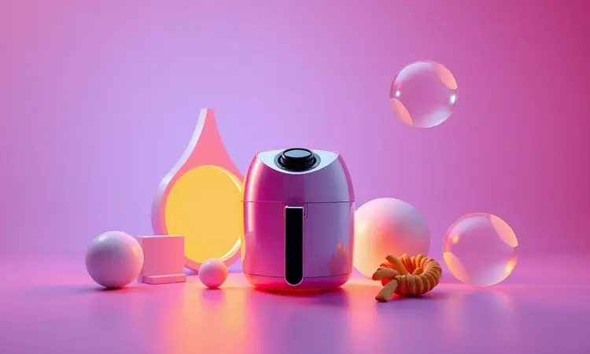

Encontrar a melhor air fryer antiaderente vai além da lista de especificações técnicas. É sobre acabar com aquela cena de fim de tarde, onde você fica 20 minutos esfregando um cesto cheio de gordura queimada.

O verdadeiro valor desses aparelhos não está apenas na promessa de uma fritura mais saudável, mas na liberdade de poder experimentar novas receitas sem o medo da limpeza que vem depois.

Neste guia, vamos além das características técnicas para mostrar modelos que realmente funcionam no seu dia a dia, transformando o ato de cozinhar em algo simples, rápido e, acima de tudo, fácil de limpar.

<SummaryList products={frontmatter.top_products} />

## Melhores Modelos de Air Fryer Antiaderente para Comprar

Escolher uma air fryer antiaderente significa transformar a rotina na cozinha. Em vez de se perguntar 'será que aquela crosta de frango vai grudar de novo?', você foca no que importa: o sabor da comida e o tempo que ganha para si mesmo.

Esta seleção reúne aparelhos que entregam o equilíbrio perfeito entre desempenho e praticidade, cada um com sua personalidade para atender diferentes necessidades.

### 1. WAP Air Fryer Family

<ProductBox 
  title={frontmatter.top_products[0].title} 
  image={frontmatter.top_products[0].image} 
  link={frontmatter.top_products[0].link} 
/>

Imagine uma típica terça-feira à noite. A família chega com fome do trabalho e da escola, e você precisa de algo rápido, saudável e sem bagunça. A WAP Air Fryer Family é a solução para esse cenário.

Com seus 4 litros de capacidade, ela prepara porções perfeitas para até 4 pessoas, ocupando menos espaço na bancada do que uma cafeteira.

A tecnologia de circulação de ar em 360° não é apenas um termo técnico: é o segredo para que as batatas fritas fiquem uniformemente douradas em todos os cantos, sem precisar virar de meia em meia hora.

O cesto antiaderente faz a mágica acontecer. Após preparar nuggets, batatas ou mini-hambúrgueres, você simplesmente desliza os restos para o lixo e passa uma esponja suave, sem força.

O painel intuitivo com temperatura de 80°C a 200°C e timer de 60 minutos permite que você configure e vá cuidar de outras coisas na casa, sem precisar ficar de vigília.

Sim, para receitas que demandam camadas sobrepostas, a capacidade pode pedir duas rodadas, mas para o dia a dia familiar, ela é uma companheira confiável que não transforma a cozinha em uma central de bagunça pós-jantar.

<CaixaProsContras>

**Prós:**

- Capacidade suficiente para famílias pequenas.

- Design compacto ideal para espaços menores.

- Tecnologia de circulação de ar para cozimento saudável.

- Revestimento antiaderente facilita a limpeza.

**Contras:**

- Timer de 60 minutos pode ser insuficiente para algumas receitas.

- Capacidade limitada para maiores grupos.

</CaixaProsContras>

### 2. Philco Redstone PAF40A

<ProductBox 
  title={frontmatter.top_products[1].title} 
  image={frontmatter.top_products[1].image} 
  link={frontmatter.top_products[1].link} 
/>

Cansado daquela sensação de que vai gastar mais tempo limpando do que cozinhando? A Philco Redstone PAF40A chega com uma proposta clara: revestimento interno 'Redstone' que transforma a limpeza em uma tarefa de 30 segundos.

Este não é apenas mais um antiaderente, mas uma tecnologia pensada para durar, evitando que com o tempo os alimentos comecem a grudar nos cantos.

Com 1500W de potência, ela entrega aquela pressa necessária nos dias mais corridos, reduzindo a gordura em até 80% sem perder o crocante.

O visor em vidro com luz interna é um pequeno luxo que faz grande diferença. Em vez de interromper o cozimento abrindo a cesta para ver se o frango já está dourado (e perdendo temperatura), você apenas dá uma espiada.

O controle mecânico pode parecer um retrocesso para quem gosta de telas touch, mas tem sua vantagem: durabilidade e simplicidade de uso para quem não quer lidar com menus complexos.

Lembre-se de verificar a voltagem disponível na sua região, pois ela não é bivolt, um detalhe importante na hora da compra.

<CaixaProsContras>

**Prós:**

- Revestimento interno antiaderente e fácil de limpar.

- Boas capacidades de preparo, ideal para famílias.

- Potência de 1500W para cozimento rápido.

- Timer com desligamento automático para maior segurança.

**Contras:**

- Não é bivolt, apenas disponível em duas voltagens.

- Painel mecânico pode não ser a preferência de todos.

</CaixaProsContras>

### 3. Midea Widemax FWM55P1

<ProductBox 
  title={frontmatter.top_products[2].title} 
  image={frontmatter.top_products[2].image} 
  link={frontmatter.top_products[2].link} 
/>

Para quem tem uma família maior ou simplesmente odeia fazer várias rodadas de comida, os 5,5 litros da Midea Widemax são um abraço de capacidade.

Não se trata apenas de volume adicional, mas da liberdade de preparar um frango inteiro com legumes ao redor em uma única fornada.

Os 1900W de potência garantem que tudo aconteça rápido, enquanto o revestimento BlackStone mantém sua promessa: os alimentos deslizam para fora sem deixar marcas de teimosia nas paredes do cesto.

O sensor de desligamento automático quando a cesta é removida é um daqueles detalhes de segurança que você não percebe o valor... até acidentalmente tocar em uma superfície quente.

Para conseguir aquela crocância perfeita em todos os alimentos, alguns usuários sugerem agitar a cesta na metade do tempo ou ajustar os minutos finais, mas a tecnologia Heatexpress Rapid Air faz a maior parte do trabalho sozinha.

Os presets variados transformam a escolha entre 'frango', 'legumes' ou 'congelados' em um toque, dispensando calculadoras mentais de temperatura.

<CaixaProsContras>

**Prós:**

- Grande capacidade de 5,5 litros.

- Design moderno e fácil de usar.

- Revestimento antiaderente facilita a limpeza.

- Presets variados para diferentes tipos de preparo.

**Contras:**

- Pode ser um pouco volumosa para cozinhas menores.

- Obter uma crocância perfeita pode demandar técnicas adicionais.

</CaixaProsContras>

### 4. Electrolux Rita Lobo EAF40

<ProductBox 
  title={frontmatter.top_products[3].title} 
  image={frontmatter.top_products[3].image} 
  link={frontmatter.top_products[3].link} 
/>

Criada em parceria com a chef Rita Lobo, esta air fryer traz na embalagem a promessa de resultado profissional em casa.

A tecnologia Air Cooking 360° não é apenas marketing: é a garantia de que o calor chega igualmente em todas as pontas do cesto, evitando aquelas batatas que queimam em um lado e ficam cruas em outro.

Com 5,6 litros de capacidade, ela é generosa para receitas que exigem espaço, como asas de frango ou porções maiores de legumes.

O cesto removível com camada antiaderente é o verdadeiro herói aqui. Você termina de preparar aqueles pastéis de forno, retira o cesto inteiro e leva direto para a pia, onde os restos saem com água morna e um movimento suave.

A ausência da função pré-aquecer pode exigir um planejamento de mais alguns minutos se você sair do zero absoluto, mas o timer sonoro e desligamento automático garantem que mesmo distraído, sua comida não virará carvão. Atenção redobrada à voltagem na hora da compra.

<CaixaProsContras>

**Prós:**

- Tecnologia Air Cooking 360° para cozimento uniforme.

- Cesto removível com camada antiaderente para limpeza fácil.

- Timer sonoro e desligamento automático para maior segurança.

- Capacidade generosa de 5,6 litros para diversas receitas.

**Contras:**

- Não possui função pré-aquecer.

- Não é bivolt, exigindo atenção na escolha da voltagem.

</CaixaProsContras>

### 5. Philips Walita Digital 2000 XL

<ProductBox 
  title={frontmatter.top_products[4].title} 
  image={frontmatter.top_products[4].image} 
  link={frontmatter.top_products[4].link} 
/>

A experiência Philips em circulação de ar quente se materializa neste modelo compacto que entrega resultados impressionantes em um design que não domina sua bancada.

A tecnologia RapidAir promete e cumpre: até 90% menos gordura sem abrir mão da crocância que faz você esquecer que não está comendo uma fritura tradicional. Os 4,2 litros são o ponto ideal para casais ou pequenas famílias que querem qualidade sem exageros de capacidade.

A janela de visualização é um pequeno prazer diário. Ver os alimentos dourarem gradualmente, sem abrir e fechar a tampa, mantém o calor constante e a crocância perfeita.

O painel digital com nove presets remove a dúvida de 'quantos minutos para nuggets?', transformando o preparo em uma experiência quase automática.

As peças removíveis e antiaderentes são compatíveis com máquina de lavar louça, reduzindo a limpeza a uma tarefa de carregar e descarregar.

Famílias maiores podem precisar de duas rodadas para refeições completas, mas para o dia a dia corrido, é eficiência em forma de eletrodoméstico.

<CaixaProsContras>

**Prós:**

- Tecnologia RapidAir para cozimento saudável e uniforme.

- Painel digital intuitivo com presets para vários pratos.

- Janela de visualização que facilita o monitoramento do cozimento.

- Peças removíveis e antiaderentes, fáceis de limpar.

**Contras:**

- Capacidade menor para grandes famílias ou preparo em grandes quantidades.

- Preço pode ser considerado elevado comparado a outros modelos.

</CaixaProsContras>

### 6. Philips Walita Essential XL

<ProductBox 
  title={frontmatter.top_products[5].title} 
  image={frontmatter.top_products[5].image} 
  link={frontmatter.top_products[5].link} 
/>

Quando a família cresce ou os amigos aparecem com frequência para jantar, os 6,2 litros da Essential XL são a resposta. Esta não é apenas uma air fryer ampliada, mas uma cozinheira versátil que domina desde o frango assado até os legumes crocantes para acompanhar.

A mesma tecnologia RapidAir da Philips garante que mesmo em grandes quantidades, o calor se distribua de forma uniforme, um desafio que modelos menores não enfrentam.

O painel digital touch com sete predefinições oferece atalhos inteligentes, mas permite que você assuma o controle quando quiser experimentar temperaturas e tempos personalizados.

A possibilidade de lavar as peças na máquina de lavar louça transforma a pós-preparação de uma tarefa em uma operação logística simples.

A conectividade Wi-Fi pode parecer futurista demais para alguns, mas para quem adora a ideia de pré-aquecer o aparelho do escritório, é um conforto que justifica a curva de aprendizado.

<CaixaProsContras>

**Prós:**

- Cozimento rápido e uniforme.

- Grande capacidade interna, adequada para famílias.

- Painel digital intuitivo com várias predefinições.

- Peças antiaderentes e laváveis em lava-louças.

**Contras:**

- A conectividade Wi-Fi pode ser confusa para alguns usuários.

- O cabo de força pode ser curto para algumas configurações de cozinha.

</CaixaProsContras>

### 7. Mondial Oven AFON-12L-BI

<ProductBox 
  title={frontmatter.top_products[6].title} 
  image={frontmatter.top_products[6].image} 
  link={frontmatter.top_products[6].link} 
/>

Por que escolher entre uma air fryer e um forno se você pode ter ambos em um só aparelho?

O Mondial AFON-12L-BI é essa proposta ambiciosa: 12 litros de capacidade total que funcionam como forno elétrico para assar pães e bolos, e um cesto de 5 litros para as frituras sem óleo.

É o eletrodoméstico para quem tem espaço na bancada mas não quer acumular vários aparelhos diferentes.

A tecnologia antiaderente Duraflon resiste aos desafios duplos: às altas temperaturas do forno e às frituras constantes. Os dez programas pré-configurados são como ter um chef embutido que sabe exatamente o que fazer com frango, peixe, legumes ou até mesmo pizza.

Obviamente, um aparelho com tanta funcionalidade ocupa espaço equivalente, então meça sua bancada antes de se apaixonar pela ideia. Mas se você busca substituir vários eletrodomésticos por um multifuncional de verdade, esta é uma candidata forte.

<CaixaProsContras>

**Prós:**

- Funcionalidade 2 em 1 como air fryer e forno.

- Painel digital com funções pré-definidas práticas.

- Tecnologia antiaderente que facilita a limpeza.

- Grande capacidade de 12 litros.

**Contras:**

- Pode ser volumoso para algumas cozinhas.

- Necessita de atenção ao transporte devido ao peso de 7,6 kg.

</CaixaProsContras>

### 8. Britânia Oven BAF16A

<ProductBox 
  title={frontmatter.top_products[7].title} 
  image={frontmatter.top_products[7].image} 
  link={frontmatter.top_products[7].link} 
/>

Para famílias numerosas ou quem adora preparar grandes quantidades para congelar, os 16 litros da Britânia são um território de abundância.

A tecnologia Air Flow 360° enfrenta o desafio de manter um cozimento uniforme em um espaço tão generoso, evitando que as batatas da parte de cima fritem enquanto as de baixo ainda estão cruas.

Com 10 funções pré-programadas, você tem um repertório completo para experimentar novas receitas semana após semana.

A limpeza em um aparelho deste tamanho poderia ser assustadora, mas a porta removível e os acessórios com revestimento antiaderente cerâmico facilitam o acesso a cada centímetro.

A atenção necessária ao usar as duas grelhas simultaneamente (a superior cozinha mais rápido) é compensada pela capacidade de preparar uma refeição completa de uma só vez.

O acúmulo de gordura próximo à resistência exige limpeza cuidadosa, mas é um pequeno preço pela versatilidade oferecida.

<CaixaProsContras>

**Prós:**

- Grande capacidade de 16 litros, perfeita para famílias.

- Tecnologia Air Flow 360° proporciona cozimento uniforme.

- Painel digital com várias funções pré-programadas.

- Facilidade de limpeza com acessórios antiaderentes e porta removível.

**Contras:**

- A parte superior pode cozinhar mais rápido que a inferior ao usar duas grelhas.

- Acúmulo de gordura próximo à resistência pode ser difícil de limpar.

</CaixaProsContras>

### 9. Electrolux Rita Lobo EAF90

<ProductBox 
  title={frontmatter.top_products[8].title} 
  image={frontmatter.top_products[8].image} 
  link={frontmatter.top_products[8].link} 
/>

Esta air fryer de 12 litros não se contenta em apenas fritar sem óleo.

Ela oferece cinco modos distintos: Airfry para as frituras tradicionais, Gratinar para aquela camada dourada perfeita, Reaquecer para dar nova vida às sobras, Desidratar para fazer chips caseiros, e Rotisserie para assar frangos que giram lentamente.

É praticamente uma mini-cozinha em um único aparelho.

O painel digital com mais de 10 funções programadas te guia em cada preparo, enquanto a potência de 1700W garante que mesmo as tarefas mais exigentes, como desidratar frutas, sejam cumpridas com eficiência.

O design em aço inoxidável adiciona um toque de sofisticação à bancada, e a maioria das peças ser lavável na máquina transforma a limpeza de um aparelho complexo em uma tarefa simples.

Se você busca mais do que uma air fryer básica, esta é uma opção que entrega múltiplas experiências culinárias em um só investimento.

<CaixaProsContras>

**Prós:**

- Grande capacidade de 12 litros.

- Multifuncionalidade com cinco modos de preparo.

- Painel digital com funções programadas.

- Facilidade na limpeza das peças.

**Contras:**

- Ocupa um espaço considerável na bancada.

- Pode ser mais complexa para quem deseja algo simples.

</CaixaProsContras>

### 10. WAP Digital Barbecue

<ProductBox 
  title={frontmatter.top_products[9].title} 
  image={frontmatter.top_products[9].image} 
  link={frontmatter.top_products[9].link} 
/>

Para os amantes de churrasco que moram em apartamento ou não querem lidar com fumaça dentro de casa, esta air fryer traz a experiência do grelhado sem o incômodo.

A tecnologia smokeless reduz drasticamente a fumaça, permitindo que você prepare hambúrgueres, linguiças e até legumes grelhados no conforto da sua cozinha, sem ativar o alarme de incêndio ou deixar cheiro pela casa.

As 12 funções vão muito além do barbecue, incluindo assar, cozinhar a vapor e desidratar alimentos. A circulação de ar em 360° garante que o calor envolva cada pedaço de comida, criando aquelas marcas de grelha características sem necessidade de virar constantemente.

O revestimento antiaderente lida bem com os sucos das carnes, que costumam ser os mais problemáticos na limpeza.

Sim, é um investimento superior ao de uma air fryer convencional, mas se você sente falta do sabor do grelhado em seu dia a dia, o valor emocional compensa o custo.

<CaixaProsContras>

**Prós:**

- Multifuncionalidade com 12 funções diferentes.

- Tecnologia smokeless, ideal para uso interno.

- Circulação de ar 360° para cozimento uniforme.

- Revestimento antiaderente que facilita a limpeza.

**Contras:**

- Pode ser mais cara do que air fryers convencionais.

- Ocupa mais espaço devido ao seu design grande.

</CaixaProsContras>

### 11. Electrolux Air Fryer 4,5L EAF15

<ProductBox 
  title={frontmatter.top_products[10].title} 
  image={frontmatter.top_products[10].image} 
  link={frontmatter.top_products[10].link} 
/>

Com seu design moderno em grafite escuro, esta air fryer de 4,5 litros é para quem valoriza estética tanto quanto funcionalidade.

As 8 receitas pré-programadas no painel digital são como ter um livro de receitas básicas embutido, perfeito para quem está começando no mundo das frituras sem óleo e não quer errar nas configurações iniciais.

A capacidade total (3,2 litros no cesto) é ideal para pequenas famílias ou casais que não precisam de volumes exagerados. Os 1400W de potência garantem rapidez sem exageros no consumo energético.

O cesto removível e antiaderente mantém a promessa da limpeza simplificada, especialmente se você agir logo após o uso, enquanto os resíduos ainda estão quentes e soltos.

A limitação de voltagem (apenas 127V) requer atenção na compra, mas se sua instalação elétrica for compatível, é uma opção elegante e eficiente para cozinhas compactas.

<CaixaProsContras>

**Prós:**

- Painel digital com receitas pré-programadas

- Cesto removível e antiaderente para fácil limpeza

- Boa capacidade para pequenas famílias

- Potência adequada para preparos rápidos

**Contras:**

- Disponível apenas na voltagem de 127V

- Nem todos os modelos possuem as mesmas funções

</CaixaProsContras>

### 12. Philips Walita Duplo Cesto 7,1L Série 1000

<ProductBox 
  title={frontmatter.top_products[11].title} 
  image={frontmatter.top_products[11].image} 
  link={frontmatter.top_products[11].link} 
/>

Imagine preparar batatas fritas crocantes em um cesto enquanto assa frango no outro, tudo ao mesmo tempo. Esta é a magia do sistema duplo cesto da Philips.

Com 3,55 litros em cada lado, você não apenas dobra a capacidade útil, mas ganha o poder de separar sabores e texturas que não devem se misturar durante o cozimento.

A tecnologia RapidAir funciona independentemente em cada cesto, garantindo que ambos os lados mantenham a qualidade característica da marca.

O acesso a mais de 700 receitas através do aplicativo HomeID transforma o aparelho em um centro culinário conectado, ideal para quem gosta de experimentar constantemente.

A limpeza é facilitada pelas grades removíveis com revestimento antiaderente, compatíveis com máquina de lavar louça.

A capacidade útil de cada cesto é menor que o volume total anunciado (devido ao espaço das grades), mas a possibilidade de preparo simultâneo compensa essa matemática.

<CaixaProsContras>

**Prós:**

- Dois cestos independentes para preparo simultâneo.

- Tecnologia RapidAir que garante crocância.

- Facilidade de limpeza com peças removíveis.

- Acesso a mais de 700 receitas pelo aplicativo HomeID.

**Contras:**

- Capacidade útil de cada cesto é menor que o volume total anunciado.

- Ocupa um espaço considerável na bancada da cozinha.

</CaixaProsContras>

### 13. Mondial Air Fryer 8L AFN-80-BI

<ProductBox 
  title={frontmatter.top_products[12].title} 
  image={frontmatter.top_products[12].image} 
  link={frontmatter.top_products[12].link} 
/>

Para famílias que precisam de volume mas não querem investir em um forno multifuncional, os 8 litros da Mondial oferecem o meio-termo perfeito.

Com 1900W de potência, ela tem força para lidar com preparos mais densos, como um frango inteiro ou uma fornada generosa de legumes para o almoço de domingo.

O timer programável com desligamento automático é a segurança de saber que, mesmo se o telefone tocar ou as crianças chamarem, sua comida não queimará. O cesto antiaderente de fácil remoção transforma a limpeza pós-preparações pesadas em uma tarefa simples.

Seu tamanho generoso exige uma bancada com espaço adequado, e os 7,1 kg podem ser um desafio para armazenamento em armários altos, mas para uso constante em superfícies acessíveis, é uma workhorse confiável para famílias maiores.

<CaixaProsContras>

**Prós:**

- Grande capacidade de 8 litros, ideal para famílias.

- Potência de 1900W proporciona cozimento rápido.

- Cesto antiaderente facilita a limpeza.

- Timer programável com desligamento automático traz conveniência.

**Contras:**

- Ocupa um espaço considerável na cozinha.

- Pode ser um pouco pesada para manusear em armários altos.

</CaixaProsContras>

Agora que você conhece as principais opções disponíveis, como transformar essas informações em uma decisão inteligente?

Vamos desmistificar os critérios de escolha para que você encontre a air fryer que se encaixa perfeitamente na sua rotina, não apenas nas suas medidas de bancada.

## Como escolhemos as melhores air fryers?

Nosso processo de seleção foi construído em torno de uma pergunta central: 'Quais air fryers realmente tornam a vida na cozinha mais simples?' Analisamos não apenas especificações técnicas, mas experiências reais de usuários que vivem o dia a dia com esses aparelhos.

Avaliamos a durabilidade dos revestimentos antiaderentes após meses de uso, a consistência dos resultados culinários e, principalmente, como cada modelo transforma (ou não) a tarefa pós-preparo.

O equilíbrio entre desempenho e praticidade guiou cada escolha, priorizando aparelhos que entregam excelência sem complexidade desnecessária.

## O que considerar na hora de escolher a melhor air fryer?

Escolher a air fryer perfeita é como encontrar a peça que falta em seu quebra-cabeça culinário. Não se trata apenas de comprar o 'melhor' no mercado, mas o melhor para sua realidade, seus hábitos e sua cozinha.

### Capacidade da air fryer (litros)

Para quantas pessoas você cozinha normalmente? Esta pergunta simples define muito do seu relacionamento com a air fryer. Para indivíduos ou casais, modelos de 2 a 3 litros são companheiros perfeitos que preparam porções ideais sem desperdício.

Famílias de até 4 pessoas encontram conforto nos 4 a 5 litros, que permitem uma refeição completa em uma única rodada.

Acima de 6 litros, você está no território das preparações abundantes, ideal para quem gosta de fazer grandes quantidades para congelar ou receber visitas frequentes.

Lembre-se: capacidade maior significa mais liberdade culinária, mas também mais espaço ocupado na sua bancada.

### Potência (em watts)

A potência define o ritmo da sua cozinha. Modelos entre 1.200 e 1.400 watts são eficientes para o uso diário, aquecendo de forma consistente sem picos exagerados de consumo energético.

Acima de 1.500 watts, você entra no território da rapidez: pré-aquecimento quase instantâneo e alimentos que saem do congelado para a mesa em minutos. Os 1.900+ watts são para quem não tem tempo a perder e quer resultados de restaurante em velocidade doméstica.

Considere que maior potência pode refletir em sua conta de luz se o uso for intensivo, mas também significa menos tempo esperando a comida ficar pronta nos dias mais corridos.

### Facilidade de limpeza

Esta é a promessa central das air fryers antiaderentes: transformar a limpeza de um martírio em uma tarefa simples. Mas nem todos os revestimentos são iguais. Observe modelos com peças totalmente removíveis, que permitem acesso completo a cada superfície.

A compatibilidade com máquina de lavar louça é o segundo nível de ouro, transformando a limpeza em operação de carregar e descarregar.

Os melhores antiaderentes resistem ao teste do tempo, mantendo sua eficiência mesmo após meses de frituras gordurosas e assados diversos.

Quando escolher, imagine a cena pós-preparo: você quer uma experiência de 'deslizar para limpar' ou ainda precisará de esfregões vigorosos?

### Funções extras

As funções extras são os temperos da experiência com air fryer. Pré-programas para alimentos específicos (frango, peixe, legumes, congelados) removem as adivinhações do processo, especialmente para iniciantes.

Funções de reaquecimento inteligentes revitalizam sobras sem deixá-las ressecadas. Modos de desidratação abrem um universo de chips e frutas secas caseiras.

Alguns modelos mais avançados oferecem até integração com aplicativos, trazendo bibliotecas de receitas e controles remotos. Pergunte-se: você busca um aparelho simples e direto ou uma central culinária multifuncional? Sua resposta direcionará o investimento.

### Design e tamanho externo

Sua cozinha tem espaço para mais um eletrodoméstico na bancada? Meça o espaço disponível antes de se apaixonar por um modelo específico. Designs compactos com base quadrada otimizam melhor o espaço em relação aos modelos redondos.

Acabamentos em inox dão sofisticação, mas podem mostrar marcas de dedos; superfícies em plástico são mais práticas para a limpeza diária. Observe também a altura total: alguns modelos são surpreendentemente altos quando abertos, podendo interferir em armários suspensos.

A melhor air fryer é aquela que encontra um lar natural em sua cozinha, não um intruso que precisa ser reorganizado constantemente.

### Marca e assistência técnica

Investir em marcas consolidadas como Philips, Mondial, Electrolux e Britânia é comprar paz de espírito. Essas empresas possuem redes de assistência técnica espalhadas pelo país, garantindo que se algo der errado, você terá onde recorrer.

Verifique a experiência de outros usuários com o suporte ao cliente da marca escolhida. Uma garantia estendida pode valer o investimento extra, especialmente para aparelhos que serão usados diariamente.

Marcas menos conhecidas podem oferecer preços atraentes, mas avalie o custo-benefício considerando a durabilidade esperada e a disponibilidade de peças de reposição.

### Seu perfil de uso

Sua rotina é o filtro final que define a air fryer ideal. Se você cozinha sob pressão de tempo todos os dias, priorize modelos com potência elevada e programas rápidos. Para famílias grandes, capacidade e durabilidade são mais importantes que funções sofisticadas.

Se você adora experimentar receitas novas, modelos com múltiplas funções e conectividade podem valer o investimento. Para uso esporádico ou por uma pessoa só, simplicidade e tamanho compacto são seus melhores amigos.

A air fryer perfeita não é aquela com mais recursos, mas aquela que você usará com prazer, sem complicações, transformando seus momentos na cozinha em experiências positivas.

## Antiaderente e Design: O Que Facilita a Limpeza?

O revestimento antiaderente de qualidade é o verdadeiro herói silencioso das boas air fryers.

Não se trata apenas de um material que impede que os alimentos grudem, mas de uma tecnologia que permite que você limpe com água morna e um pano suave, sem a necessidade de produtos químicos agressivos ou esfregões que danificam a superfície.

Os designs modernos vão além, incorporando peças totalmente removíveis que dão acesso a cada dobra e canto onde a sujeira tenta se esconder. A ventilação inteligente minimiza respingos e respingos queimados, reduzindo as áreas problemáticas.

Quando escolher, imagine a limpeza não como uma tarefa, mas como o fechamento natural de uma experiência culinária bem-sucedida.

## Cesto Quadrado ou Redondo: Qual Limpa Melho?

Esta escolha vai além da estética, influenciando diretamente na sua experiência de uso.

Cestos quadrados oferecem vantagens práticas: distribuem melhor os alimentos, especialmente itens retangulares como filés de peixe ou hambúrgueres, e facilitam o acesso aos cantos na hora da limpeza.

Cestos redondos, por sua vez, promovem uma circulação de ar mais natural em 360°, potencialmente resultando em um cozimento mais uniforme para alimentos como batatas ou nuggets.

Independentemente do formato, o fator decisivo continua sendo a qualidade do revestimento antiaderente. Um bom antiaderente redondo limpa tão facilmente quanto um quadrado de má qualidade.

A verdadeira pergunta é: qual formato se encaixa melhor na sua forma de cozinhar e nas receitas que mais prepara?

## Dicas Para Conservar o Teflon do Cesto

Proteger o revestimento antiaderente é proteger o coração da sua air fryer. A primeira regra é sagrada: nunca use utensílios de metal, que criam microfissuras invisíveis onde a sujeira se acumula com o tempo.

Opte por espátulas de silicone ou madeira, que deslizam suavemente sem agredir a superfície. Produtos de limpeza abrasivos são inimigos declarados do Teflon, opte por detergentes suaves e esponjas não-abrasivas.

O momento ideal para limpar é logo após o uso, quando os resíduos ainda estão quentes e soltos, antes que resfriem e grudem com força. No armazenamento, guarde o cesto separado, evitando que outros utensílios pressionem contra o revestimento.

Esses cuidados simples estendem a vida útil do seu aparelho em anos, mantendo a facilidade de limpeza que fez você escolhê-lo em primeiro lugar.

## Lava-Louças: Quais Modelos São Compatíveis?

A compatibilidade com lava-louças é o divisor de águas entre a praticidade boa e a excelente. A maioria das air fryers modernas tem componentes seguros para lavagem na máquina, mas com nuances importantes.

Algumas marcas recomendam apenas a bandeja inferior, enquanto outras permitem todo o cesto e suas grades. A temperatura máxima da lava-louça também importa: programas muito quentes podem comprometer a aderência do revestimento a longo prazo.

Sempre consulte o manual do usuário para instruções específicas.

Se a facilidade absoluta de limpeza é sua prioridade, opte por modelos com clara indicação de compatibilidade total com lava-louças, transformando a manutenção em uma operação automática que acontece enquanto você relaxa após o jantar.

## Acessórios que Facilitam a Limpeza

Certos acessórios transformam o ritual de limpeza de uma obrigação em uma tarefa simples.

O papel vegetal antiaderente específico para air fryer é o mais subestimado deles: colocado no fundo do cesto, ele captura respingos e migalhas, permitindo que você simplesmente o descarte após o uso, deixando o cesto praticamente limpo.

Escovas com cerdas de silicone alcançam cantos sem riscar o revestimento. Capas protetoras mantêm o aparelho livre de poeira e gordura residual quando não está em uso, reduzindo a necessidade de limpezas preventivas.

Esses pequenos investimentos amplificam o valor da sua air fryer, prolongando sua vida útil e mantendo a promessa de uma cozinha prática e sem estresse que fez você buscá-la.

## Perguntas Frequentes

As dúvidas mais comuns sobre air fryers antiaderentes giram em torno de expectativas versus realidade. Reunimos as perguntas que realmente importam para quem está considerando este investimento na praticidade da cozinha.

### Qual é a melhor air fryer do mercado?

A melhor air fryer não é um modelo universal, mas aquele que resolve seus problemas específicos de forma eficiente. Para famílias pequenas que buscam simplicidade e limpeza fácil, a Philips Walita Digital 2000 XL oferece excelente equilíbrio.

Para famílias maiores que precisam de volume sem abrir mão da qualidade, a Britânia Oven BAF16A se destaca. Para quem deseja multifuncionalidade em um aparelho só, a Electrolux Rita Lobo EAF90 entrega versatilidade impressionante.

A verdadeira resposta está em cruzar sua rotina, espaço disponível e orçamento com os modelos que melhor atendem essas variáveis.

### Qual a marca de air fryer mais recomendada?

Philips estabeleceu um padrão de qualidade com sua tecnologia RapidAir que muitos tentam alcançar. Mondial oferece excelente custo-benefício com modelos robustos. Electrolux, especialmente na linha Rita Lobo, traz sofisticação e resultados consistentes.

Britânia impressiona com capacidades generosas e durabilidade.

A recomendação varia conforme a necessidade: Philips para quem prioriza tecnologia e resultados premium; Mondial para orçamentos mais controlados; Electrolux para design e multifuncionalidade; Britânia para famílias grandes.

O segredo está em alinhar a reputação da marca com o que é mais importante para você.

### Qual a air fryer que dá menos problemas?

Modelos com controles mecânicos em vez de digitais tendem a apresentar menos falhas técnicas ao longo do tempo, por sua simplicidade construtiva.

Marcas com controle de qualidade rigoroso, como Philips e Electrolux, geralmente oferecem produtos com taxa de defeitos menor. O revestimento antiaderente de alta qualidade é outro fator de durabilidade: evita o desgaste prematuro que leva à substituição do cesto.

Consulte avaliações de longo prazo de usuários reais, prestando atenção não apenas aos primeiros meses de uso, mas aos relatos de quem já passou do primeiro ano com o aparelho. Durabilidade frequentemente compensa investimento inicial mais elevado.

### Qual a melhor air fryer para usar em casa?

Para uso doméstico, considere três pilares: compatibilidade com seu espaço, adequação à sua rotina e facilidade de manutenção. Cozinhas compactas pedem modelos como a WAP Air Fryer Family ou Philips Walita Digital 2000 XL, que oferecem desempenho sem dominar a bancada.

Famílias com crianças pequenas se beneficiam de modelos com funções pré-programadas simples e limpeza à prova de falhas, como a Electrolux EAF15. Para casais que cozinham juntos, a Philips Walita Duplo Cesto permite divisão de tarefas e preparo simultâneo.

A melhor air fryer para sua casa é aquela que se integra naturalmente à sua dinâmica familiar, tornando as refeições mais simples, não mais complexas.

## Conclusão

Escolher a melhor air fryer antiaderente é, no fundo, uma decisão sobre como você quer viver seus momentos na cozinha. Se opta por passar mais tempo esfregando panelas ou mais minutos desfrutando da companhia da família após o jantar.

Os modelos que apresentamos oferecem diferentes caminhos para o mesmo destino: alimentos saborosos preparados com menos gordura e limpos com menos esforço.

O revestimento antiaderente de qualidade não é um detalhe técnico, mas a chave que transforma a experiência culinária. Ele representa a promessa de que você pode experimentar novas receitas sem o medo paralizante da limpeza que vem depois.

Significa poder oferecer nuggets crocantes para as crianças sem pensar na cena de frustração que se segue na pia.

Pondere sobre sua rotina real. Quantas pessoas você alimenta diariamente? Que espaço sua cozinha realmente oferece? Quanto tempo está disposto a investir em aprendizado de controles complexos?

Suas respostas direcionarão sua escolha muito mais do que qualquer lista de especificações técnicas.

Independentemente do modelo escolhido, você está investindo em mais do que um eletrodoméstico. Está adquirindo tempo, praticidade e a liberdade de transformar as refeições em momentos de prazer, não de trabalho adicional.

As melhores air fryers antiaderentes cumprem esta promessa silenciosa: entregam excelência gastronômica enquanto permanecem discretas na manutenção, permitindo que você foque no que realmente importa.

O sabor da comida, o calor da companhia, a simplicidade de uma cozinha que funciona a seu favor.

Agora, com todas as informações em mãos, a escolha final é sua, mas sempre com um lembrete: o verdadeiro luxo não está nos watts ou litros, mas na facilidade com que você fecha a cozinha à noite, sorrindo pelo jantar bem-sucedido e pela pia que não exige mais de você.