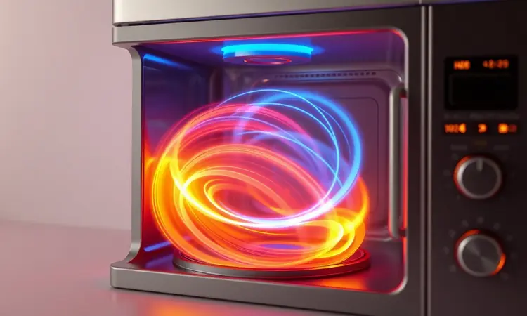
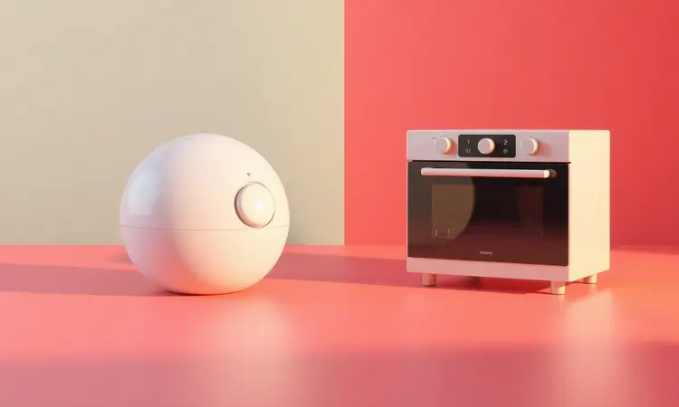
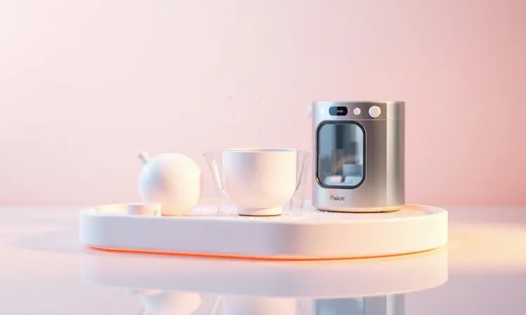

Encontrar a melhor air fryer para sua cozinha pode parecer uma tarefa desafiadora diante de tantas opções de tamanhos, potências e tecnologias disponíveis.

Seja você um entusiasta da culinária saudável ou alguém que busca praticidade extrema no dia a dia, a fritadeira sem óleo tornou-se um item indispensável em qualquer lar moderno.

Neste guia, vamos além das especificações técnicas para revelar como cada modelo se encaixa na sua rotina, desde quem mora sozinho até famílias que adoram receber amigos.

Continue lendo para descobrir qual aparelho conversa com suas necessidades, espaço na bancada e, principalmente, com o modo como você gosta de viver a cozinha.

<SummaryList products={frontmatter.top_products} />

## Melhores Opções de Air Fryer para Investir em 2025

Imagine transformar sua relação com a cozinha: menos gordura, mais sabor e tempo sobrando.

Em 2025, as air fryers evoluíram de aparelhos básicos para verdadeiros assistentes culinários, oferecendo desde a simplicidade que você precisa até sofisticações que desafiam qualquer forno tradicional.

### 1. Cadence FRT515

<ProductBox 
  title={frontmatter.top_products[0].title} 
  image={frontmatter.top_products[0].image} 
  link={frontmatter.top_products[0].link} 
/>

Para quem vive em apartamento pequeno ou precisa de praticidade na rotina corrida, a Cadence FRT515 é aquela companheira discreta que não exige espaço nem atenção especial. Com seus 3 litros, ela entende que você não quer desperdiçar comida nem ficar preso na cozinha.

Os 1250W de potência garantem que seu almoço chegue à mesa no tempo que você tem disponível, com temperatura ajustável que permite desde aquecimentos delicados até crocâncias irresistíveis.

Embora exija um pouco de paciência para alguns preparos e precise que você dê aquela mexidinha nos alimentos, ela compensa com sua simplicidade e preço acessível. É a escolha perfeita para quem está dando os primeiros passos no mundo das frituras saudáveis.

<CaixaProsContras>

**Prós:**

- Compacta e fácil de armazenar

- Tecnologia de convecção para frituras mais saudáveis

- Bom custo-benefício

- Versátil: frita, assa e reaquece

**Contras:**

- Pode exigir mais tempo para cozinhar do que outros modelos

- Acompanha poucos acessórios

</CaixaProsContras>

### 2. Electrolux EAF15

<ProductBox 
  title={frontmatter.top_products[1].title} 
  image={frontmatter.top_products[1].image} 
  link={frontmatter.top_products[1].link} 
/>

Se sua preocupação vai além da praticidade e chega aos números da sua saúde, a Electrolux EAF15 fala sua língua.

Desenvolvida em parceria com Rita Lobo, ela transforma o conceito de 'comida saudável' em algo palpável: até 50% menos calorias e 90% menos gordura comparado à fritura tradicional. Imagine preparar batatas fritas que seu nutricionista aprovaria.

Com 4,6 litros totais, ela é generosa sem ser exagerada. O cesto antiaderente é aquele amigo que facilita sua vida depois da refeição, enquanto as receitas pré-definidas são como ter um chef particular que sussurra o que fazer.

Sim, ela ocupa um espaço considerável na bancada, mas é o tamanho necessário para abraçar suas metas de bem-estar.

<CaixaProsContras>

**Prós:**

- Prepara alimentos com menos gordura e calorias.

- Controle de temperatura e timer que facilitam o uso.

- Cesto antiaderente que torna a limpeza simples.

- Receitas pré-definidas que oferecem praticidade.

**Contras:**

- Cabo de alimentação é um pouco curto.

- Tamanho da carcaça pode ocupar mais espaço na cozinha.

</CaixaProsContras>

### 3. Elgin Start Fry

<ProductBox 
  title={frontmatter.top_products[2].title} 
  image={frontmatter.top_products[2].image} 
  link={frontmatter.top_products[2].link} 
/>

Para quem está começando essa jornada e quer algo que não assuste, a Elgin Start Fry é como um professor paciente. Seu painel analógico dispensa manuais complicados: gire, ajuste e espere o aviso sonoro.

Os 3,5 litros são a medida perfeita para quem cozinha para si mesmo ou para casais, enquanto os 1400W garantem rapidez sem comprometer o resultado.

A ausência do cesto tradicional pode exigir um pouco mais de atenção durante o preparo, mas essa simplicidade se traduz em facilidade na limpeza. É para quem busca o essencial, sem firulas, mas com a certeza de que está fazendo uma escolha mais saudável.

<CaixaProsContras>

**Prós:**

- Cozimento saudável com redução de gordura.

- Capacidade adequada para porções individuais.

- Controle de temperatura e timer práticos.

- Design compacto que economiza espaço.

**Contras:**

- Não tem cesto tradicional, dificultando o chacoalhar.

- O ruído durante o uso é perceptível.

</CaixaProsContras>

### 4. Britânia BAF40A

<ProductBox 
  title={frontmatter.top_products[3].title} 
  image={frontmatter.top_products[3].image} 
  link={frontmatter.top_products[3].link} 
/>

Quando sua família começa a crescer e as porções individuais já não bastam, a Britânia BAF40A chega como a solução inteligente. Com 4 litros e 1500W, ela tem o tamanho exato para preparar o jantar de todos ao mesmo tempo.

A tecnologia Air Flow 360 funciona como uma coreografia perfeita: ar quente dançando ao redor dos alimentos, garantindo que cada pedaço fique igualmente crocante por fora e macio por dentro.

A limpeza exige atenção aos detalhes, especialmente nas dobras onde a gordura pode se esconder, mas o revestimento antiaderente minimiza esse trabalho. É a escolha para quem quer alimentar bem sua família sem abrir mão do sabor que todos amam.

<CaixaProsContras>

**Prós:**

- Cozinha alimentos de forma rápida e uniforme

- Controles intuitivos e timer para maior precisão

- Design compacto ideal para cozinhas pequenas

- Revestimento antiaderente facilita a limpeza

**Contras:**

- Limpeza pode ser trabalhosa em algumas áreas

- Durabilidade relativa em comparação com modelos mais caros

</CaixaProsContras>

### 5. Britânia BFR50

<ProductBox 
  title={frontmatter.top_products[4].title} 
  image={frontmatter.top_products[4].image} 
  link={frontmatter.top_products[4].link} 
/>

Para famílias que transformam a cozinha em ponto de encontro, a Britânia BFR50 é o espaço que faltava. Com 5,5 litros, ela abraça até quatro pessoas sem esforço. O design em inox e preto não é apenas estético: fala de durabilidade e modernidade.

O revestimento antiaderente de nano cerâmica é como ter um assistente invisível que impede que os alimentos criem laços indesejados com o cesto.

Entenda desde já: se você busca a crocância exata da feira livre, talvez precise ajustar suas expectativas. Mas o que ela oferece em troca é consistência, praticidade e a tranquilidade de saber que está oferecendo opções mais saudáveis para quem você ama.

<CaixaProsContras>

**Prós:**

- Ampla capacidade de 5,5 litros.

- Revestimento antiaderente facilita a limpeza.

- Tecnologia Air Flow para cocção rápida e uniforme.

- Design atraente e discreto.

**Contras:**

- Pode não entregar a mesma crocância que frituras convencionais.

- O timer não se ajusta automaticamente ao remover o cesto.

</CaixaProsContras>

### 6. Philips Walita NA130

<ProductBox 
  title={frontmatter.top_products[5].title} 
  image={frontmatter.top_products[5].image} 
  link={frontmatter.top_products[5].link} 
/>

Quando sua mesa precisa alimentar de 3 a 6 pessoas regularmente, a Philips Walita NA130 é a resposta. Seus 6,2 litros são generosos sem ser exagerados, enquanto os 1700W garantem que ninguém precise esperar muito.

A tecnologia RapidAir não é apenas um nome bonito: é a promessa de que cada pedaço receberá a mesma atenção, reduzindo gordura enquanto mantém a textura que faz sucesso.

O painel analógico mantém as coisas simples, ideal para quem não quer complicações digitais. E a limpeza? Lavável na máquina, porque tempo com a família é mais importante do que tempo esfregando panelas.

<CaixaProsContras>

**Prós:**

- Tecnologia RapidAir para cozimento uniforme.

- Capacidade ideal para famílias maiores.

- Facilidade na limpeza, com peças laváveis em máquina.

- Marca confiável com garantia de 2 anos.

**Contras:**

- Painel analógico pode ser menos preciso que painéis digitais.

- Potência ligeiramente menor em comparação com outros modelos.

</CaixaProsContras>

### 7. Mondial AFN-80-BI

<ProductBox 
  title={frontmatter.top_products[6].title} 
  image={frontmatter.top_products[6].image} 
  link={frontmatter.top_products[6].link} 
/>

Para quem cozinha como quem recebe, a Mondial AFN-80-BI é o espaço que faltava. Com impressionantes 8 litros, ela transforma 'fazer um lanche' em 'preparar um banquete'.

Os 1900W de potência são o motor que mantém tudo em movimento, enquanto a versatilidade permite que você frite, asse, grelhe ou até desidrate conforme a ocasião pedir.

Sim, ela exige espaço na bancada, mas esse é o preço da generosidade. O cesto removível e o revestimento antiaderente garantem que, depois da festa, a limpeza não se torne outra celebração trabalhosa.

<CaixaProsContras>

**Prós:**

- Capacidade generosa de 8 litros.

- Tecnologia de circulação de ar quente para cozimento uniforme.

- Versatilidade para várias preparações (fritar, assar, grelhar).

- Cesto removível e fácil de limpar.

**Contras:**

- Tamanho pode ser um desafio em cozinhas pequenas.

- Potência alta pode exigir mais atenção em circuitos elétricos mais limitados.

</CaixaProsContras>

### 8. Mondial AFON-12L-BI

<ProductBox 
  title={frontmatter.top_products[7].title} 
  image={frontmatter.top_products[7].image} 
  link={frontmatter.top_products[7].link} 
/>

Quando sua cozinha precisa ser uma linha de produção gourmet, a Mondial AFON-12L-BI assume o comando. Com 12 litros, ela é para quem não conhece a palavra 'limite'.

As funções múltiplas transformam ingredientes simples em pratos complexos, enquanto o timer de 90 minutos respeita até as receitas mais demoradas.

Atenção: ela não é discreta. Requer espaço e uma tomada dedicada de 20A, mas em troca oferece liberdade criativa que poucos eletrodomésticos podem proporcionar.

<CaixaProsContras>

**Prós:**

- Grande capacidade de 12 litros, perfeita para preparar refeições para toda a família.

- Várias funções de cozimento, incluindo opções saudáveis sem óleo.

- Design moderno com iluminação interna e visor amplo.

- Acessórios inclusos que facilitam o uso e a limpeza.

**Contras:**

- Aparelho volumoso que pode não caber em cozinhas pequenas.

- Requer tomada específica de 20A.

</CaixaProsContras>

### 9. Philco PFR2200

<ProductBox 
  title={frontmatter.top_products[8].title} 
  image={frontmatter.top_products[8].image} 
  link={frontmatter.top_products[8].link} 
/>

Para quem acredita que tecnologia deve simplificar, não complicar, a Philco PFR2200 fala a língua dos pragmáticos. Seus 12 litros atendem multidões, enquanto as 9 funções pré-programadas são como ter receitas mestras na ponta dos dedos.

Os 1800W garantem rapidez, e o timer de 90 minutos cuida do tempo enquanto você cuida das pessoas.

A limpeza das assadeiras pode testar sua paciência, mas é o preço de uma versatilidade que transforma um único aparelho em múltiplas ferramentas culinárias.

<CaixaProsContras>

**Prós:**

- Grande capacidade de 12 litros.

- Potência alta de 1800W.

- Painel digital com funções intuitivas.

- Versatilidade para fritar, assar e desidratar.

**Contras:**

- Assadeiras podem ser difíceis de limpar.

- Aquecimento mais intenso na parte superior requer atenção.

</CaixaProsContras>

### 10. Oster OFRT780

<ProductBox 
  title={frontmatter.top_products[9].title} 
  image={frontmatter.top_products[9].image} 
  link={frontmatter.top_products[9].link} 
/>

Imagine ter três eletrodomésticos em um, sem ocupar o espaço de três. A Oster OFRT780 é exatamente isso: air fryer, forno e desidratador numa única estrutura elegante.

As 10 funções digitais são atalhos para criatividade, enquanto a janela de visualização transforma o cozimento em espetáculo.

Para porções individuais, ela pode parecer exagerada, mas para famílias que valorizam variedade e praticidade, é o investimento que continua dando retorno a cada refeição.

<CaixaProsContras>

**Prós:**

- Versatilidade como air fryer, forno e desidratador.

- 10 funções digitais predefinidas facilitando o preparo.

- Janela de visualização para monitorar o cozimento.

- Superfícies antiaderentes que tornam a limpeza simples.

**Contras:**

- Tamanho grande da cesta pode ser excessivo para porções menores.

- Pode ocupar um espaço considerável na bancada.

</CaixaProsContras>

### 11. Electrolux EAF90

<ProductBox 
  title={frontmatter.top_products[10].title} 
  image={frontmatter.top_products[10].image} 
  link={frontmatter.top_products[10].link} 
/>

Para o cozinheiro que não aceita limites, a Electrolux EAF90 é o estúdio completo. Com 12 litros e cinco funções principais, incluindo a desejada rotisserie, ela transforma seu espaço em uma pequena cozinha profissional.

O painel digital com mais de 10 funções programadas é como ter um assistente que já conhece seus gostos.

Ela exige espaço e pode intimidar iniciantes, mas para quem leva a cozinha a sério, é a ferramenta que faltava para elevar cada refeição a outro patamar.

<CaixaProsContras>

**Prós:**

- Versatilidade com múltiplas funções de cocção.

- Capacidade de cozinhar com menos gordura.

- Painel digital intuitivo e fácil de programar.

- Compacta para uma air fryer estilo forno.

**Contras:**

- Pode ocupar bastante espaço na bancada.

- O modelo pode ser considerado mais avançado para iniciantes.

</CaixaProsContras>

### 12. WAP FW009626

<ProductBox 
  title={frontmatter.top_products[11].title} 
  image={frontmatter.top_products[11].image} 
  link={frontmatter.top_products[11].link} 
/>

Se você sente falta do sabor do churrasco mas não tem espaço para uma churrasqueira tradicional, a WAP FW009626 traz o quintal para dentro de casa. A função Barbecue com 4 níveis de temperatura replica aquela crosta saborosa sem a fumaça que invade tudo.

As 12 funções são um convite à experimentação, enquanto os 10 litros garantem espaço para criatividade.

Ela exige uma tomada específica com aterramento, mas é o preço da segurança quando se brinca com altas temperaturas e muita versatilidade.

<CaixaProsContras>

**Prós:**

- Versatilidade com 12 funções de cozimento.

- Tecnologia de circulação de ar em 360° para cozimento uniforme.

- Função Barbecue com 4 níveis de temperatura.

- Painel digital com display de LED para fácil operação.

**Contras:**

- Requer uma tomada específica com aterramento para segurança.

- O tamanho pode ser considerado grande para cozinhas pequenas.

</CaixaProsContras>

### 13. Philips Walita Série 5000 AI551/08

<ProductBox 
  title={frontmatter.top_products[12].title} 
  image={frontmatter.top_products[12].image} 
  link={frontmatter.top_products[12].link} 
/>

Quando excelência técnica encontra design premium, nasce a Philips Walita Série 5000. Seus 12 litros são o palco perfeito para refeições que merecem atenção, enquanto as múltiplas funções (sim, até fazer iogurte!) transformam ingredientes em experiências.

O painel touch é intuitivo como um smartphone, e os acessórios antiaderentes laváveis na lava-louças entendem que seu tempo é precioso.

O acessório para retirar o cesto poderia ser mais seguro, mas isso é um detalhe pequeno diante da maestria com que essa air fryer executa suas funções.

<CaixaProsContras>

**Prós:**

- Versatilidade com múltiplas funções de cozimento.

- Grande capacidade ideal para refeições familiares.

- Painel touch moderno e fácil de usar.

- Acessórios antiaderentes que facilitam a limpeza.

**Contras:**

- O acessório para retirar o cesto pode ser considerado pouco prático.

- Preocupações com a qualidade de alguns materiais.

</CaixaProsContras>

### 14. WAP Barbecue Digital

<ProductBox 
  title={frontmatter.top_products[13].title} 
  image={frontmatter.top_products[13].image} 
  link={frontmatter.top_products[13].link} 
/>

Para quem acredita que cozinhar deve ser uma experiência sem estresse, a WAP Barbecue Digital elimina dois problemas: a fumaça do churrasco e a limitação de funções. A tecnologia "Smokeless" mantém o ambiente limpo enquanto o sabor permanece intenso.

Com 12 funções e 10 litros, ela é para quem não quer escolher entre praticidade e sofisticação.

Ela requer um espaço fixo na bancada e uma curva de aprendizado inicial, mas uma vez dominada, torna-se o centro das atenções da sua cozinha.

<CaixaProsContras>

**Prós:**

- Multifuncionalidade com 12 funções.

- Capacidade generosa de 10 litros.

- Tecnologia antimáscara reduz fumaça durante o preparo.

- Painel digital intuitivo e fácil de usar.

**Contras:**

- Tamanho considerável que requer espaço fixo na bancada.

- Curva de aprendizado inicial para dominar todas as funções.

</CaixaProsContras>

### 15. Oster Multifunções 10 em 1 (25 litros)

<ProductBox 
  title={frontmatter.top_products[14].title} 
  image={frontmatter.top_products[14].image} 
  link={frontmatter.top_products[14].link} 
/>

Quando você decide que um único aparelho será responsável por transformar sua cozinha, a Oster Multifunções 10 em 1 é a declaração de intenções. Com impressionantes 25 litros, ela não cozinha: ela produz.

Substitui múltiplos eletrodomésticos enquanto reduz gordura em até 99,5%. O painel digital e o alerta sonoro são como ter um chef de brigada particular.

O isolamento térmico poderia ser melhor e falta um pegador para a bandeja, mas esses são pequenos detalhes diante da revolução que esse aparelho representa para quem leva alimentação saudável a sério.

<CaixaProsContras>

**Prós:**

- Multifunção, substitui vários aparelhos na cozinha.

- Cozinha rapidamente e de maneira uniforme.

- Fácil de usar com painel digital intuitivo.

- Material inoxidável que facilita a limpeza.

**Contras:**

- O isolamento térmico pode ser aprimorado.

- Não possui pegador para a bandeja, o que pode dificultar o manuseio.

</CaixaProsContras>

## Como escolhemos as melhores air fryers de 2025?

Escolher não foi apenas comparar especificações técnicas. Foi sobre entender o que realmente importa quando você está na cozinha, com tempo limitado e expectativas altas.

Avaliamos como cada modelo conversa com diferentes estilos de vida: desde o solitário que quer praticidade até a família que transforma cada refeição em celebração.

Consideramos não apenas números de potência e capacidade, mas como esses números se traduzem em experiências reais.

Ouvimos consumidores que já viveram com esses aparelhos, observamos como eles se integram ao espaço físico das cozinhas reais, e procuramos o equilíbrio perfeito entre sofisticação tecnológica e simplicidade no uso diário.

## Como funciona a air fryer?

Imagine um pequeno furacão controlado dentro de um compartimento. É basicamente isso que acontece: uma resistência aquece o ar, e um ventilador poderoso faz esse ar circular em alta velocidade ao redor dos alimentos.

Esse movimento intenso cria uma crocância mágica nas superfícies, simulando a fritura tradicional, mas com uma fração mínima do óleo.

O timer e o controle de temperatura são os maestros dessa orquestra, permitindo que você afine cada preparo como um músico ajusta seu instrumento. O resultado? Aquele sabor que você adora, com a consciência tranquila de quem fez uma escolha inteligente para o corpo.

## Como escolher uma air fryer?

Pare de pensar em especificações técnicas por um momento. Em vez disso, pergunte-se: como é minha vida na cozinha? Para quantas pessoas cozinho regularmente? Valorizo mais rapidez ou versatilidade? Tenho espaço na bancada ou preciso de algo que desapareça depois do uso?

Depois dessas reflexões pessoais, aí sim observe os números: capacidade deve acompanhar seu tamanho de família, potência reflete seu nível de paciência, funções indicam sua vontade de experimentar.

Mas nunca subestime a facilidade de limpeza: o aparelho mais tecnológico do mundo perde seu encanto se transformar em um pesadelo depois da refeição. Procure por modelos com peças removíveis e, quando possível, laváveis na máquina.

Sua relação com a air fryer deve ser de amor, não de obrigação.

## Qual é a melhor air fryer de 2025?

A melhor air fryer não é aquela com mais funções ou maior capacidade. É aquela que desaparece na sua rotina, funcionando tão naturalmente que você esquece que está usando uma tecnologia.

Em 2025, vimos modelos que entendem isso: painéis digitais que conversam com você, materiais que resistem ao tempo sem exigir cuidados excessivos, designs que fazem sentido tanto visualmente quanto funcionalmente.

Marcas como Philips, Mondial e Britânia acertaram ao focar não apenas em 'o que' o aparelho faz, mas em 'como' ele se encaixa na sua vida. A melhor escolha é pessoal: para quem mora sozinho, pode ser a simplicidade da Cadence.

Para famílias grandes, a generosidade da Oster Multifunções. O segredo está em honestidade: admitir suas necessidades reais, não aquelas que você imagina ter.

## Air fryer oven vs. air fryer tradicional: Qual escolher?

Esta é a verdadeira encruzilhada culinária. A tradicional é como aquela amiga prática: chega direto ao ponto, ocupa pouco espaço e resolve o problema sem delongas. Perfeita para frituras saudáveis rápidas e porções menores.

Já a oven é a amiga versátil: traz para a brincadeira a possibilidade de assar, grelhar, desidratar, enquanto oferece espaço para múltiplas preparações simultâneas.

A decisão vem de uma pergunta simples: você quer um especialista em fritura sem óleo ou um multi talentoso que substitui vários aparelhos? Se sua cozinha já tem forno convencional e você busca especificidade, vá de tradicional.

Se você quer centralizar operações ou tem espaço limitado para múltiplos eletrodomésticos, a oven será sua melhor aliada.

## Air fryer oven gasta mais energia?

Aqui está uma surpresa agradável: a air fryer oven geralmente é mais econômica que um forno convencional. Pense nela como um quarto eficiente versus uma sala grande que precisa ser aquecida.

Seu tamanho menor significa menos espaço para aquecer, e o pré-aquecimento acontece em minutos, não em dezenas de minutos.

Comparada à fritura tradicional em fogão, a economia é ainda mais expressiva: você elimina o óleo (que consome energia para atingir altas temperaturas) e concentra o calor apenas onde é necessário.

Para quem cozinha regularmente, essa eficiência se traduz em números reais na conta de luz. É uma daquelas situações raras onde praticidade e economia andam de mãos dadas.

## Quais receitas posso fazer com uma Air fryer oven?

Pergunte melhor: quais receitas você não pode fazer? A versatilidade desses aparelhos transforma limites em possibilidades. Comece com o óbvio: batatas fritas que fazem qualquer fast-food corar de vergonha.

Avance para legumes grelhados que mantêm cores vivas e nutrientes intactos. Experimente carnes: frango crocante por fora e suculento por dentro, peixes que desfiam com o garfo sem desfazer-se no processo.

Mas o verdadeiro tesouro está além do salgado. Pães caseiros com casca dourada, bolos fofos que não precisam do forno convencional, pizzas com bordas perfeitas.

A velocidade de cozimento transforma a experimentação em rotina: em vez de 'um dia eu tento', vira 'hoje à noite vou testar'. Com ingredientes frescos e curiosidade, sua air fryer oven se torna o brinquedo favorito de qualquer cozinheiro.

## Como limpar air fryer oven?

Limpar deve ser ritual, não castigo. Comece com o básico: sempre desconecte e espere esfriar completamente. Sua paciência aqui evita queimaduras e prolonga a vida do aparelho.

Remova bandejas e grades com cuidado, elas são as protagonistas do show e merecem atenção especial.

Água morna e detergente neutro são seus melhores amigos. Para o interior, um pano úmido ou esponja macia fazem milagres sem agredir o revestimento antiaderente. A grande jogada? Secar completamente antes de guardar. Umidade é o inimigo silencioso da durabilidade.

Com essa rotina simples, sua air fryer permanecerá como nova, pronta para a próxima aventura culinária.

## O que evitar na limpeza da air fryer?

Trate sua air fryer como você trata seus utensílios favoritos: com respeito. Esqueça esponjas de aço e produtos abrasivos, eles são bulldozers em um mundo de porcelanas finas. Nunca submerja o aparelho: água e eletrônicos mantêm uma relação complicada.

A menos que o fabricante dê sinal verde expresso, mantenha o cesto e as bandejas longe da lava-louças. O calor e os detergentes agressivos podem comprometer o revestimento que tanto facilita sua vida. Por último, e mais importante: espere esfriar.

Limpar ainda quente é como tentar consertar um motor com as mãos: doloroso e ineficiente.

## Posso usar papel manteiga na Air fryer oven?

Sim, mas com a sabedoria de quem conhece os limites. O papel manteiga pode ser seu aliado contra alimentos grudados e limpeza trabalhosa, desde que respeite regras básicas.

Primeiro, verifique a resistência térmica: nem todo papel manteiga foi feito para o inferno controlado de uma air fryer.

Segundo, e mais crucial: não tape toda a superfície. A circulação de ar é a alma do aparelho, obstruí-la é como tentar respirar com um travesseiro no rosto. Use pedaços menores, apenas onde realmente necessário, e observe como seu aparelho responde.

Cada modelo tem sua personalidade, descubra a do seu.

## Dicas de como usar Air Fryer Oven

Domine sua air fryer oven com essas estratégias simples: sempre pré-aqueça por alguns minutos. É como aquecer os músculos antes do exercício, prepara o aparelho para dar o melhor de si.

Evite sobrecarregar a cesta: espaço entre os alimentos é o segredo da crocância uniforme.

Um fio de azeite não é traição à filosofia 'sem óleo', é realismo gustativo: realça sabores e texturas sem comprometer a saúde. Por último, crie o hábito da limpeza imediata. Gordura fresca sai fácil, gordura endurecida cria raízes.

Seu futuro eu agradecerá por esses minutos investidos no presente.

## Fritadeira sem óleo varia em funções, recursos e também em formatos distintos.

Essa diversidade é o maior presente para o consumidor moderno. Não há mais 'uma air fryer para todos', mas sim 'uma air fryer para cada um'.

Desde as compactas que desaparecem em gavetas até as imponentes que dominam bancadas, desde as analógicas que falam a língua da simplicidade até as digitais que sussurram possibilidades infinitas.

Cada formato, cada função, cada recurso é uma resposta a diferentes modos de viver a cozinha. A beleza está em encontrar não o 'melhor' tecnicamente, mas o que melhor se funde ao seu cotidiano, ao seu espaço, ao seu jeito de transformar ingredientes em memórias.

É essa personalização que transforma um eletrodoméstico em companheiro de jornada culinária.

## Conclusão

Escolher uma air fryer em 2025 deixou de ser um exercício de comparação técnica para se tornar uma conversa sobre estilo de vida. Mais do que watts e litros, você está escolhendo como quer se relacionar com a comida, com seu tempo, com sua saúde.

Desde a simplicidade acolhedora dos modelos compactos até a sofisticação libertadora das ovens multifuncionais, há um caminho para cada cozinheiro.

Lembre-se: o aparelho perfeito não é aquele com mais funções, mas aquele que você usará com prazer, que se integrará naturalmente à sua rotina, que transformará o ato de cozinhar de obrigação em prazer.

Observe sua cozinha, seja honesto sobre seus hábitos, e permita que essas informações guiem sua escolha. A air fryer certa não apenas prepara alimentos mais saudáveis, ela prepara você para uma relação mais saborosa com a própria cozinha.

Agora é sua vez: qual dessas companheiras culinárias vai compartilhar suas próximas aventuras gastronômicas?