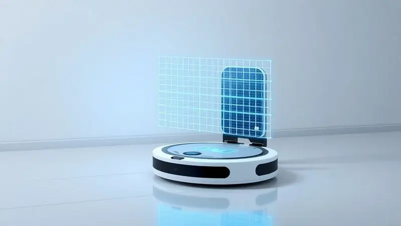
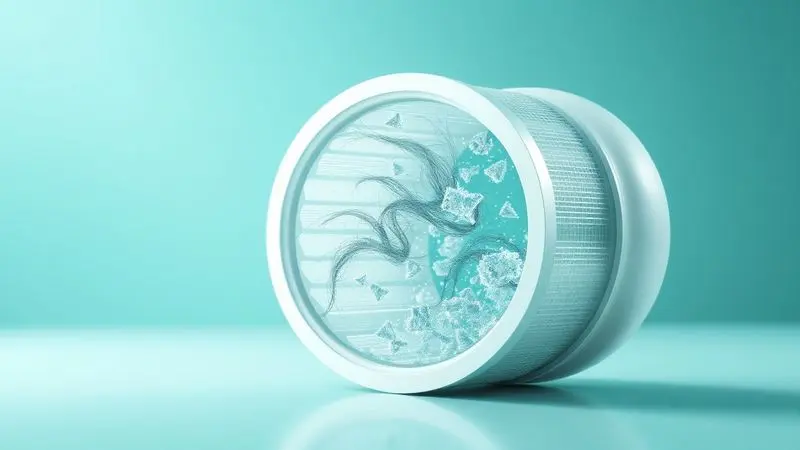
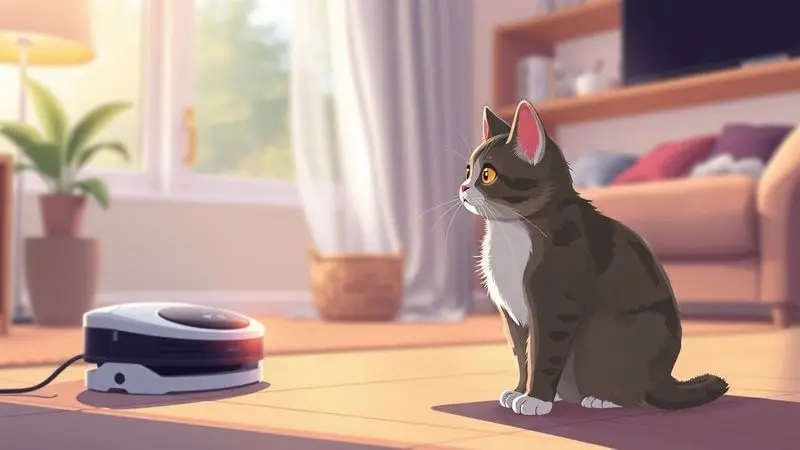
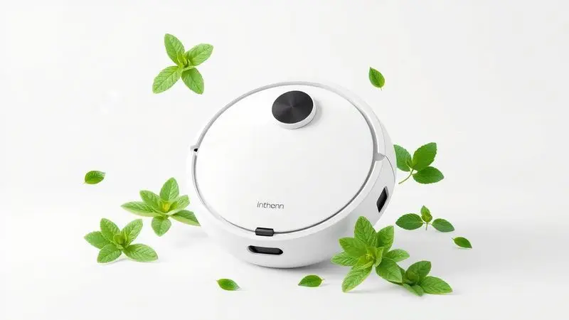

Ter um gato em casa traz toda aquela alegria que só um felino sabe oferecer. Mas é impossível ignorar os desafios que vêm junto, especialmente quando se trata daquelas mechas rebeldes que se espalham por tapetes, sofás e cantos que parecem feitos para acumular sujeira.

Se você já cansou de passar horas com a vassoura e o aspirador portátil, há uma solução que promete transformar essa rotina: o aspirador robô especializado em pelos de gato.

Imagine chegar em casa e encontrar os pisos impecáveis, sem aquela sensação de areia nos pés ou mechas de pelo flutuando no ar. É isso que os 13 modelos a seguir prometem, combinando potência inteligente com a praticidade que seu dia a dia merece.

<SummaryList products={frontmatter.top_products} />

## Os 13 Melhores Modelos de Aspirador Robô para Pelo de Gato

Cada um desses aliados foi pensado para resolver problemas reais. Se você precisa lidar com muitos pelos ou procura algo que entenda sua casa como você, há um modelo ideal esperando por você.

### 1. Aspirador Robô WAP W400

<ProductBox 
  title={frontmatter.top_products[0].title} 
  image={frontmatter.top_products[0].image} 
  link={frontmatter.top_products[0].link} 
/>

Imagine um assistente que não apenas aspira a sujeira do seu piso, mas também passa um pano rápido, deixando tudo impecável sem que você levante um dedo. O WAP W400 faz exatamente isso, combinando três funções em um único movimento elegante.

Com controle ajustável da umidade, ele se adapta desde seu piso frio até o carpete da sala, enquanto sensores inteligentes o guiam para evitar quedas e descobrir cantos escondidos debaixo dos móveis.

Com autonomia para trabalhar por quase duas horas, ele retorna sozinho à base quando precisa de energia.

Mas talvez o maior alívio venha do sistema de filtragem tripla com HEPA, que captura não apenas os pelos visíveis, mas também as micropartículas que podem irritar sua respiração. É a garantia de respirar mais leve em um ambiente que seu gato compartilha com você.

<CaixaProsContras>

**Prós:**

- Funcionalidade 3 em 1: varre, aspira e passa pano.

- Navegação inteligente com sensores antiqueda.

- Sistema de filtragem HEPA eficiente.

- Design slim que alcança locais de difícil acesso.

**Contras:**

- Tempo de carregamento pode ser longo (até 5 horas).

- A autonomia pode variar dependendo da intensidade da limpeza.

</CaixaProsContras>

### 2. Robô Aspirador Ropo Glass 3

<ProductBox 
  title={frontmatter.top_products[1].title} 
  image={frontmatter.top_products[1].image} 
  link={frontmatter.top_products[1].link} 
/>

Para quem busca uma limpeza que vai além do superficial, o Ropo Glass 3 traz uma proposta interessante: além de aspirar e passar pano, ele esteriliza o ambiente com luz UV, eliminando vírus e bactérias que podem ficar nos pelos do seu gato.

Com sucção que chega a 2500Pa, ele lida com sujeira persistente e muda automaticamente a intensidade conforme encontra tapetes ou pisos duros.

Sua navegação cobre áreas extensas sem se perder, sempre retornando para carregar quando necessário. Você pode controlá-lo pelo aplicativo ou simplesmente pedir para seus assistentes de voz preferidos.

Se preocupa com germes em um lar com pets, essa camada extra de proteção pode fazer toda diferença para sua tranquilidade.

<CaixaProsContras>

**Prós:**

- Lâmpada UV para esterilização eficaz.

- Potência de sucção elevada com níveis ajustáveis.

- Navegação inteligente eficiente para cobrir amplas áreas.

- Compatibilidade com assistentes virtuais e controle via aplicativo.

**Contras:**

- O aplicativo pode apresentar dificuldades de uso.

- A função de passar pano pode deixar marcas em algumas superfícies.

</CaixaProsContras>

### 3. Ropo Smart Pet

<ProductBox 
  title={frontmatter.top_products[2].title} 
  image={frontmatter.top_products[2].image} 
  link={frontmatter.top_products[2].link} 
/>

Criado pensando especificamente nos desafios de quem vive com animais, o Ropo Smart Pet entende que pelos de gato não são sujeira qualquer.

Seus sensores ultrassônicos percebem quando está sobre um tapete e aumentam automaticamente a potência, garantindo que nada fique para trás. Ele combina varredura, aspiração e passagem de pano em um ciclo contínuo.

O controle é tão simples quanto abrir seu aplicativo ou conversar com Alexa ou Google Assistant. O sistema triplo de filtragem purifica o ar enquanto trabalha, capturando alérgenos que acompanham os pelos.

Para quem busca praticidade extrema, existe até uma estação que limpa o próprio robô, disponível separadamente.

<CaixaProsContras>

**Prós:**

- Limpeza 3 em 1 (varre, aspira e passa pano).

- Sensores que aumentam a potência em tapetes.

- Controle via aplicativo e assistentes de voz.

- Sistema triplo de filtragem para purificação do ar.

**Contras:**

- Sem mapeamento a laser.

- Ideal apenas para espaços menores.

</CaixaProsContras>

### 4. Aspirador de Pó Robô WAP ROBOT W1000

<ProductBox 
  title={frontmatter.top_products[3].title} 
  image={frontmatter.top_products[3].image} 
  link={frontmatter.top_products[3].link} 
/>

Quando sua casa tem mais de um cômodo e você precisa de cobertura ampla, o WAP ROBOT W1000 se apresenta como um aliado de longa duração.

Com autonomia que chega a quase três horas, ele percorre ambientes extensos sem pedir pausas, usando navegação que mapeia em tempo real e evita obstáculos com inteligência.

São cinco modos de limpeza diferentes, permitindo que você escolha entre uma faxina rápida ou uma limpeza profunda. Controle pelo aplicativo ou por comandos de voz, e programe horários para que ele trabalhe quando você não está.

Especialmente eficaz em capturar pelos de animais, ele mantém o ciclo de limpeza funcionando mesmo em sua ausência.

<CaixaProsContras>

**Prós:**

- Funcionalidade 3 em 1 (varre, aspira e passa pano).

- Navegação inteligente evita obstáculos.

- Controle fácil via aplicativo e comandos de voz.

- Ideal para residências com animais de estimação.

**Contras:**

- Pode ser um pouco barulhento durante o funcionamento.

- Preço pode ser mais alto em comparação a modelos simples.

</CaixaProsContras>

### 5. Aspirador Robô WAP Robot W100

<ProductBox 
  title={frontmatter.top_products[4].title} 
  image={frontmatter.top_products[4].image} 
  link={frontmatter.top_products[4].link} 
/>

Se sua casa tem móveis baixos ou cantos apertados que parecem impossíveis de alcançar, o WAP Robot W100 foi feito para você. Com apenas 7,5 cm de altura, ele desliza embaixo de sofás, camas e armários onde os pelos adoram se esconder.

A funcionalidade 3 em 1 significa que ele limpa completamente esses espaços negligenciados.

Sensores infravermelhos protegem contra quedas e colisões, enquanto a bateria dura tempo suficiente para limpezas em residências menores. Perfeito para quem tem pisos duros e busca uma solução compacta que não exige complicações.

<CaixaProsContras>

**Prós:**

- Design compacto que alcança locais difíceis.

- Funcionalidade 3 em 1 (varre, aspira e passa pano).

- Sensores de segurança para evitar quedas.

- Autonomia de até 1h40.

**Contras:**

- Menos eficiente em carpetes ou tapetes espessos.

- Tempo de carregamento relativamente longo (até 5 horas).

</CaixaProsContras>

### 6. WAP Robot W90 3 em 1

<ProductBox 
  title={frontmatter.top_products[5].title} 
  image={frontmatter.top_products[5].image} 
  link={frontmatter.top_products[5].link} 
/>

Para quem procura equilíbrio entre funcionalidade e simplicidade, o WAP Robot W90 oferece as três operações principais (varrer, aspirar e passar pano) em um pacote compacto.

Sensores infravermelhos garantem que ele navegue com segurança, evitando quedas enquanto acessa espaços estreitos.

Com três modos de limpeza, você adapta a intensidade conforme a necessidade do dia. A autonomia permite limpezas completas sem interrupções frequentes, ideal para manter a rotina mesmo quando a vida está corrida.

<CaixaProsContras>

**Prós:**

- Função 3 em 1 para maior eficiência na limpeza.

- Sensores anticolisão e antiqueda garantem navegação segura.

- Modos de limpeza flexíveis que se adaptam às necessidades do ambiente.

- Compacto, permitindo acesso a espaços estreitos.

**Contras:**

- Reservatório pequeno pode necessitar esvaziamento frequente.

- A função de passar pano é ideal apenas para retoques.

</CaixaProsContras>

### 7. Electrolux ERB30 2h20min

<ProductBox 
  title={frontmatter.top_products[6].title} 
  image={frontmatter.top_products[6].image} 
  link={frontmatter.top_products[6].link} 
/>

Autonomia é o ponto forte do Electrolux ERB30. Com mais de duas horas de funcionamento contínuo, ele percorre ambientes extensos sem precisar de recargas no meio do caminho.

A tecnologia "Autonomous Technology" mapeia sua casa e otimiza cada rota, enquanto sensores protegem contra acidentes.

Embora não tenha conectividade Wi-Fi, o controle remoto torna a operação simples e direta. O filtro HEPA Allergy Protect retém impurezas, melhorando a qualidade do ar para todos, especialmente para quem convive com alergias relacionadas aos pelos dos felinos.

<CaixaProsContras>

**Prós:**

- Autonomia de 2h20min permite limpeza prolongada.

- Função 3 em 1: varre, aspira e passa pano.

- Sensores antiqueda e anticolisão para evitar acidentes.

- Filtro HEPA que melhora a qualidade do ar.

**Contras:**

- Ausência de conectividade Wi-Fi ou controle por aplicativo.

- Pode precisar de ajuda extra em tapetes altos ou sujeira pesada.

</CaixaProsContras>

### 8. Robo aspirador para quem tem pet Liectroux XR500

<ProductBox 
  title={frontmatter.top_products[7].title} 
  image={frontmatter.top_products[7].image} 
  link={frontmatter.top_products[7].link} 
/>

Foco total em eficiência define o Liectroux XR500. Com compartimento de 600ml, você esvazia menos frequentemente, mesmo em lares com gatos que soltam muitos pelos.

A navegação a laser mapeia sua casa com precisão cirúrgica, evitando obstáculos e planejando rotas inteligentes.

Programe limpezas automáticas conforme sua rotina e esqueça de ligá-lo manualmente. O retorno automático ao carregador garante que ele nunca fique sem energia no meio do trabalho, mantendo sua casa sempre em dia.

<CaixaProsContras>

**Prós:**

- Eficiente na remoção de pelos de animais.

- Filtro HEPA melhora a qualidade do ar.

- Navegação inteligente evita obstáculos.

- Programação de limpezas automáticas.

**Contras:**

- Exige manutenção regular das escovas.

- Pode levar um tempo para mapear a casa totalmente.

</CaixaProsContras>

### 9. iRobot Roomba J7+

Inteligência que antecipa problemas é a especialidade do Roomba J7+. O sistema PrecisionVision detecta obstáculos em tempo real, incluindo brinquedos esquecidos no chão e, crucial para donos de pets, acidentes indesejados.

A iRobot garante até a troca do aparelho se ele não evitar esses obstáculos no primeiro ano.

Com mapeamento inteligente, você programa limpezas específicas por cômodo através do aplicativo. A base de autoesvaziamento acumula detritos por até dois meses, transformando a manutenção em algo que você quase não percebe.

<CaixaProsContras>

**Prós:**

- Navegação inteligente e eficaz com detecção de obstáculos.

- Sistema de mapeamento e programação intuitiva.

- Base de autoesvaziamento que facilita a manutenção.

- Escovas duplas que reduzem emaranhados de pelos.

**Contras:**

- Potência de sucção um pouco inferior em comparação a modelos premium.

- Duração da bateria pode ser considerada apenas razoável.

</CaixaProsContras>

### 10. iRobot Roomba i3

Pura potência define o iRobot Roomba i3. Com sucção dez vezes mais forte que modelos anteriores, ele captura não apenas pelos superficiais, mas também a sujeira mais incrustada em carpetes e cantos esquecidos.

Se move de forma sistemática, garantindo que nenhuma área fique sem atenção.

Embora a versão básica não tenha mapeamento sofisticado por cômodos, isso se traduz em simplicidade de uso. A autonomia de 75 minutos cobre a maioria das residências, e o modelo i3+ traz a conveniência do autoesvaziamento para quem busca praticidade máxima.

<CaixaProsContras>

**Prós:**

- Potente sucção ideal para pelo de animais.

- Navegação sistemática que cobre as áreas de forma eficiente.

- Modelos com sistema de autoesvaziamento (i3+) facilitam a manutenção.

- Filtro HEPA que ajuda a capturar alérgenos.

**Contras:**

- Mapeamento limitado nas versões básicas.

- Custo recorrente com filtros e sacos (no modelo i3+).

</CaixaProsContras>

### 11. iLife V5S Pro

<ProductBox 
  title={frontmatter.top_products[10].title} 
  image={frontmatter.top_products[10].image} 
  link={frontmatter.top_products[10].link} 
/>

Híbrido por natureza, o iLife V5S Pro combina aspiração com passagem de pano em um único ciclo. Com até 120 minutos de autonomia, ele navega com sensores que evitam colisões enquanto se ajusta a diferentes superfícies.

Dois modos de sucção garantem que pelos de animais sejam capturados eficazmente.

Excelente para pisos duros, onde a combinação de funções faz diferença visível. A manutenção é simples, exigindo apenas atenção regular ao depósito e filtros para manter o desempenho consistente.

<CaixaProsContras>

**Prós:**

- Boa captação de pelos de animais.

- Função híbrida que combina aspirar e passar pano.

- Boa autonomia de bateria.

- Design compacto que alcança áreas estreitas.

**Contras:**

- Performance básica na função de passar pano.

- Dificuldades em tapetes mais grossos.

</CaixaProsContras>

### 12. Eufy Robovac G10

<ProductBox 
  title={frontmatter.top_products[11].title} 
  image={frontmatter.top_products[11].image} 
  link={frontmatter.top_products[11].link} 
/>

Para quem busca força concentrada, o Eufy Robovac G10 oferece 2000Pa de sucção combinados com passagem de pano. Ideal para pisos duros onde pelos de gato se acumulam, sua navegação giroscópica organiza a limpeza de forma eficiente, sem repetições desnecessárias.

Controle por voz via Alexa ou Google Assistant transforma comandos em ação instantânea. Agende rotinas pelo aplicativo e deixe que ele trabalhe nos horários que mais combinam com sua rotina.

<CaixaProsContras>

**Prós:**

- Função 2 em 1 (aspira e passa pano).

- Potência de sucção forte (2000Pa) ideal para pelos.

- Navegação inteligente que otimiza a limpeza.

- Controle por voz e aplicativo para agendamento.

**Contras:**

- Não é recomendado para carpetes.

- Tanque de água pequeno para grandes áreas.

</CaixaProsContras>

### 13. Robô Aspirador de Pó Inteligente Xiaomi S20

<ProductBox 
  title={frontmatter.top_products[12].title} 
  image={frontmatter.top_products[12].image} 
  link={frontmatter.top_products[12].link} 
/>

Potência extrema é o cartão de visita do Xiaomi S20. Com 5000Pa de sucção, ele lida com pelos persistentes e sujeira incrustada sem esforço. A navegação com tecnologia LiDAR mapeia seu ambiente com precisão, criando rotas inteligentes que evitam obstáculos.

Controle pelo aplicativo Mi Home permite personalização completa das rotinas. A combinação de aspiração e limpeza com pano em um único aparelho torna a manutenção diária algo que funciona quase por si só.

<CaixaProsContras>

**Prós:**

- Potência de sucção alta, excelente para pelos de animais.

- Navegação inteligente com mapeamento a laser.

- Controle fácil via aplicativo.

- Função 2 em 1: aspiração e limpeza com pano.

**Contras:**

- Reservatório de água pequeno para ambientes muito grandes.
0 Conexão Wi-Fi restrita a redes de 2.4 GHz.

</CaixaProsContras>

## Tabela Comparativa dos Modelos

Comparar tantas opções pode parecer desafiador, mas alguns fatores-chave simplificam a escolha.

Pense primeiro no tamanho da sua casa (que define a autonomia necessária), nos tipos de piso que você tem (que determina a potência ideal) e na sua relação com tecnologia (que indica se aplicativos e assistentes de voz são prioridade).

A combinação certa desses elementos garante que você encontre mais que um eletrodoméstico, mas um parceiro que entende suas necessidades específicas.

## Qual o Melhor Aspirador Robô para Pelo de Gato?

A resposta depende do que sua rotina mais precisa. Cada modelo brilha em um cenário específico, resolvendo problemas únicos de quem compartilha a casa com felinos.

### WAP W400 — Para casas com muitos gatos e alto volume de pelos

Quando você tem não um, mas vários gatos, a produção de pelos se multiplica exponencialmente. O WAP W400 foi pensado para esse cenário, com potência que captura até os fios mais rebeldes e filtros que mantêm o ar respirável mesmo com tanta circulação felina.

A navegação avançada encontra caminhos por móveis e obstáculos, enquanto a autonomia garante que ambientes maiores recebam atenção completa. É a solução para quem não quer negociar com a sujeira.

### Ropo Smart Pet — Foco total em casas com animais

Alguns aparelhos são genéricos adaptados para pets, outros nascem com esse propósito. O Ropo Smart Pet pertence ao segundo grupo, com sensores que entendem a diferença entre um piso duro e um tapete fofo, ajustando automaticamente para capturar o que importa.

O sistema de filtragem retém alérgenos específicos dos animais, enquanto a programação inteligente funciona mesmo quando você está fora. É como ter um especialista em pelos felinos trabalhando silenciosamente por você.

### WAP ROBOT W1000 — Para quem precisa de autonomia e praticidade

Se sua casa tem vários cômodos ou sua rotina é tão agitada que você esquece até de ligar aparelhos, o WAP ROBOT W1000 entende esse ritmo. Com autonomia para percorrer espaços extensos, ele não pede pausas no meio do serviço.

O design compacto navega por diferentes ambientes, coletando pelos com eficiência que se mantém consistente. Para quem valoriza tempo livre sem comprometer a limpeza, essa combinação de independência e eficácia é transformadora.

### WAP Robot W100 — Funcional, simples e ideal para iniciantes

Se esta é sua primeira experiência com robôs aspiradores, simplicidade é seu maior aliado. O WAP Robot W100 oferece funcionalidades essenciais sem complicações técnicas excessivas.

Navegação intuitiva alcança cantos esquecidos, enquanto os modos de limpeza cobrem necessidades diárias sem exigir configurações complexas.

A autonomia atende residências menores, fazendo dele o parceiro perfeito para quem está descobrindo como a tecnologia pode facilitar a convivência com seus gatos.

## Como escolher um Aspirador Robô para Pelo de Gato?

Escolher o modelo ideal vai além de comparar especificações técnicas. Pense no seu dia a dia real: quantas horas você passa em casa? Seus gatos têm acesso a todos os cômodos? Você tem alergias?

Cada resposta ajuda a definir qual combinação de potência, autonomia e inteligência faz mais sentido para sua realidade.

### Funções a Considerar

Três elementos merecem atenção especial. Primeiro, a capacidade de sucção determina se o robô apenas varre superficialmente ou realmente aspira os pelos incrustados. Segundo, a tecnologia de navegação decide se ele se perde constantemente ou traça rotas eficientes.

Terceiro, a conectividade permite que você controle e programe remotamente, transformando limpeza em algo que acontece naturalmente no fundo da sua rotina, não como mais uma tarefa para gerenciar.

### Tabela Resumo

Uma tabela bem organizada revela padrões que facilitam decisões. Compare não apenas números isolados, mas como diferentes características se relacionam.

Um modelo com alta potência mas baixa autonomia pode ser ideal para apartamentos pequenos, enquanto outro com navegação avançada e filtragem superior compensa em lares com alérgicos.

Visualizar essas conexões ajuda a encontrar o equilíbrio perfeito para suas necessidades específicas.

### Dicas Adicionais

Antes de decidir, faço algumas perguntas práticas. Verifique se o reservatório de sujeira tem tamanho adequado para a frequência com que você pode esvaziá-lo. Considere como o ruído do aparelho se encaixa nos horários em que você está presente.

E não subestime o valor da compatibilidade com comandos de voz, que transforma a ativação em uma conversa natural com sua casa. São detalhes que fazem a diferença na experiência diária.

### Os robôs aspiradores funcionam para pelos de pets?

Funcionam, e de forma impressionante. Os modelos modernos não apenas coletam pelos visíveis, mas usam escovas rotativas que desalojam fios presos em tecidos e sistemas de filtragem que capturam até partículas microscópicas.

O que era uma batalha diária contra tapetes cheios de pelo se transforma em manutenção automática. A verdadeira magia está em como eles aprendem sua casa, encontrando os pontos onde seus gatos mais deixam marcas e dando atenção especial a essas áreas.

## Potência e Autonomia: O que Observar?

Esses dois fatores formam a base de qualquer escolha inteligente. Potência insuficiente significa que você ainda verá pelos após cada passagem. Autonomia limitada traduz-se em limpezas incompletas que exigem sua intervenção.

O ideal é encontrar o ponto onde força suficiente para lidar com os desafios dos seus gatos se encontra com independência para trabalhar sem supervisão constante.

### Poder de Sucção e Eficiência em Pelos dos robôs aspiradores

Quando falamos de pelos felinos, sucção precisa ser mais que força bruta. Precisa ser inteligência aplicada, com motores que aumentam a potência automaticamente em tapetes e escovas projetadas para não se enrolar em fios longos.

Os melhores modelos entendem que pelos de gato têm textura e comportamento únicos, adaptando sua abordagem para capturá-los eficientemente sem constantes resgates e desembaraços.

### Filtros HEPA e Sistema Antienrosco

Essa combinação representa o que há de mais avançado em cuidado com ambientes com pets. Filtros HEPA capturam não apenas pelos, mas também os alérgenos que os acompanham, permitindo que alérgicos respirem mais livremente.

Já os sistemas antienrosco previnem que o robô fique preso em fios soltos ou franjas de tapetes, garantindo que a limpeza prossiga sem exigir seu resgate.

Juntos, eles criam uma experiência onde o aparelho trabalha de forma independente, cuidando tanto da limpeza superficial quanto da qualidade do ar que você respira.

## O Que Significa "Pa" em um Aspirador de Pó?

Pa (Pascal) mede a força com que o aspirador puxa o ar, e consequentemente, a sujeira.

Pense assim: baixos valores como 500Pa são suficientes para manutenção rotineira, mas quando se trata de pelos de gato que se alojam em tecidos, números como 2000Pa ou mais fazem diferença visível.

Não é apenas uma especificação técnica, é a garantia de que quando seu robô passar por um local, ele realmente levará o que estiver ali, não apenas fará uma visita simbólica.

## Por que cães odeiam aspiradores de pó

O barulho constante e o movimento imprevisível criam uma combinação que muitos cães interpretam como ameaça. Para ouvidos sensíveis, o zumbido pode ser desconfortável, enquanto o deslocamento rápido de um objeto desconhecido gera insegurança.

Entender isso ajuda a planejar como introduzir o robô na rotina familiar, criando associações positivas em vez de medo.

### Como se acostumar com o aspirador de pó?

A adaptação começa com exposição gradual. Deixe o aparelho desligado em um canto por alguns dias, permitindo que seu pet cheire e investigue sem pressão. Inicie operações breves quando você estiver presente para supervisionar, preferencialmente em horários calmos.

Mantenha a rotina consistente, pois animais se acostumam com padrões previsíveis. Com paciência, o que era fonte de ansiedade se transforma em apenas mais um elemento do ambiente doméstico.

## Como Remover o Cheiro de Cachorro do Aspirador de Pó?

Odores persistentes geralmente vêm de resíduos acumulados. Comece esvaziando completamente o reservatório e limpando todas as superfícies internas com água morna e sabão neutro.

Filtros e escovas merecem atenção especial, pois retêm partículas que podem gerar maus cheiros. Uma camada fina de bicarbonato de sódio no compartimento vazio neutraliza odores entre limpezas.

Manter o aparelho seco e arejado previne que os aromas se fixem, garantindo que apenas limpeza fresca saia de suas passagens.

## Perguntas Frequentes (FAQ)

As dúvidas mais comuns giram em torno de eficiência real, compatibilidade com diferentes situações domésticas e manutenção a longo prazo.

Responder a essas questões não apenas informa, mas também constrói confiança na decisão de investir em uma solução que promete simplificar significativamente a convivência com seus gatos.

### Qual é o melhor robô aspirador para lares com gatos?

O "melhor" é aquele que resolve seus problemas específicos. Para alguns, será o modelo com maior potência para lidar com pelos de raças de pelagem longa. Para outros, a prioridade será navegação inteligente que evita constantes resgates.

E para muitos, a resposta estará em filtragem avançada que torna o ar mais respirável para alérgicos. Definir qual desafio é mais crítico em sua casa direciona para a solução mais adequada.

### Como um robô aspirador lida com grandes quantidades de pelo de gato?

Através de uma combinação planejada. Escovas especiais desalojam pelos presos em tecidos, enquanto alta sucção os remove completamente. Filtros HEPA capturam não apenas os fios visíveis, mas partículas microscópicas.

Muitos modelos ainda possuem modos específicos que aumentam a intensidade em áreas com maior concentração, como os locais favoritos dos seus gatos. O resultado é uma abordagem sistêmica que trata o problema em suas múltiplas camadas.

### Existem robôs aspiradores com filtros especiais para pelos de animais de estimação?

Sim, e essa é uma das evoluções mais significativas nos últimos anos. Além dos tradicionais filtros HEPA, alguns modelos incorporam sistemas multicamadas projetados especificamente para reter alérgenos felinos.

Escovas rotativas são otimizadas para não enrolar em pelos longos, enquanto compartimentos são dimensionados para volumes típicos de lares com pets.

São diferenças que podem parecer sutis nas especificações, mas que se traduzem em performance visivelmente superior no contexto real de convivência com gatos.

### Quais são as características essenciais de um robô aspirador para casas com felinos?

Quatro pilares sustentam uma boa escolha. Primeiro, potência adaptativa que aumenta automaticamente em carpetes. Segundo, escovas que evitam emaranhados frequentes. Terceiro, filtragem eficiente para qualidade do ar.

Quarto, navegação inteligente que encontra os cantos onde os pelos se acumulam. Quando esses elementos trabalham juntos, criam uma solução que não apenas limpa, mas entende as particularidades da vida com gatos.

### Como eficientes são os robôs aspiradores em remover pelos de gatos de tapetes e sofás?

A eficiência varia conforme a tecnologia empregada. Modelos básicos podem apenas aspirar a superfície, enquanto os mais avançados usam escovas que penetram tecidos e sucção potente que remove pelos incrustados.

Tapetes de pelo baixo e sofás com tecidos lisos são mais fáceis, enquanto materiais felpudos ou com muitas fibras exigem potência extra. Observar onde seus gatos mais deixam pelos ajuda a escolher um modelo com capacidade adequada para seus tecidos específicos.

### Qual robô aspirador oferece o melhor custo-benefício para donos de gatos?

Custo-benefício não significa sempre o preço mais baixo, mas o melhor equilíbrio entre investimento e soluções entregues.

Considere quanto tempo você economizará em limpeza manual, qual impacto terá na qualidade do ar de sua casa e quanto durará o aparelho antes de precisar substituir peças.

Às vezes, pagar um pouco mais por filtros melhores ou maior autonomia se traduz em economia de tempo e saúde a longo prazo. O verdadeiro valor está em como o robô se integra à sua vida, não apenas em seu preço de etiqueta.

## Conclusão

Viver com gatos é uma experiência recompensadora que traz companhia, personalidade e afeto únicos para qualquer lar. Os desafios, especialmente os relacionados à manutenção dos incontáveis pelos que fazem parte do pacote, podem parecer constantes.

Mas a tecnologia moderna oferece soluções elegantes que transformam essa rotina de limpeza de uma batalha diária para uma manutenção tranquila e automática.

Cada um dos 13 modelos apresentados representa uma abordagem diferente para o mesmo problema fundamental: como manter seu ambiente limpo e saudável enquanto desfruta da companhia dos seus felinos.

Desde o WAP W400 com sua combinação completa de funções até o iRobot Roomba J7+ com sua inteligência que previne acidentes, há uma solução para cada necessidade específica.

Lembre-se de que a escolha ideal vai além de especificações técnicas. Considere como cada modelo se encaixará na dinâmica da sua casa, na personalidade dos seus gatos e na sua rotina pessoal.

O melhor aspirador robô para pelo de gato não é aquele com os números mais impressionantes, mas aquele que trabalha tão harmoniosamente em seu ambiente que você quase esquece que ele está lá, exceto pelos resultados visíveis e pelo tempo que recuperou para simplesmente aproveitar a companhia dos seus animais.

O futuro da convivência com pets é mais inteligente, mais limpo e mais focado no que realmente importa: o vínculo especial que você compartilha com seus gatos, sem que os pelos que eles deixam para trás se tornem um obstáculo para esse relacionamento.