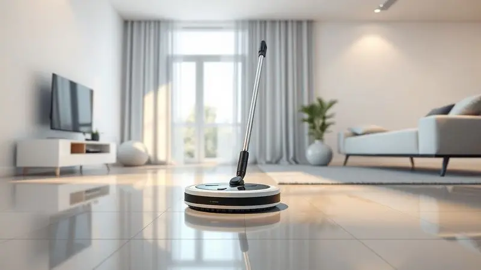
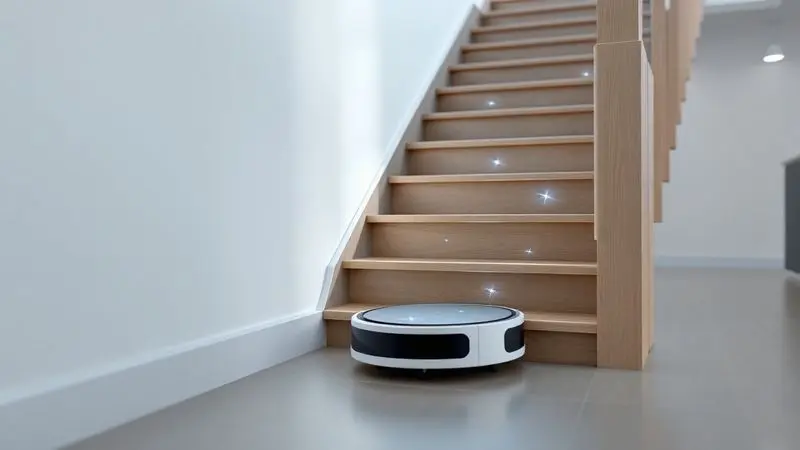
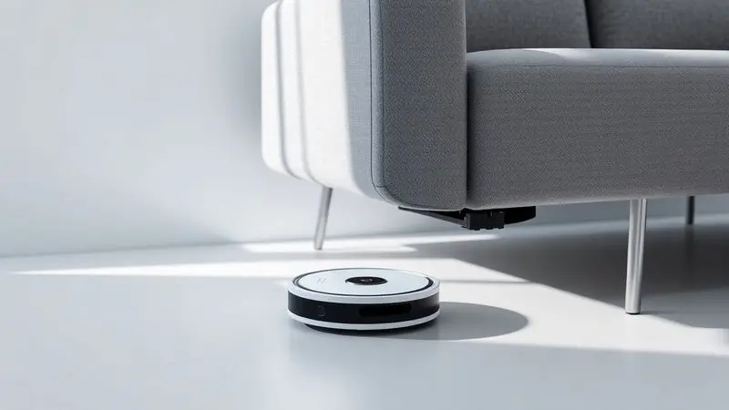

Encontrar o robô aspirador que também passa pano perfeito pode ser aquela mudança que transforma completamente sua relação com a limpeza da casa. Imagine chegar do trabalho e encontrar os pisos impecáveis, sem ter gastado nem cinco minutos do seu dia nisso.

Em 2025, essa conveniência deixou de ser luxo para se tornar uma realidade acessível, com modelos que variam do básico ao premium, atendendo desde apartamentos compactos até casas grandes com pets.

Se você busca aquela liberdade de não ter que escolher entre aspirar e passar pano, ou simplesmente quer uma ajuda extra para manter a casa sempre apresentável, este guia reúne os melhores modelos testados.

Analisamos desde robôs compactos e econômicos até aqueles que praticamente se limpam sozinhos, para que você encontre exatamente o parceiro de limpeza que sua rotina precisa.

<SummaryList products={frontmatter.top_products} />

## Melhores robôs aspiradores que passam pano para comprar em 2025

O que antes era um sonho distante hoje se materializa em dispositivos que não apenas varrem e aspiram, mas também dão aquele acabamento úmido que deixa o chão realmente limpo.

A evolução foi tão significativa que hoje você encontra desde opções básicas, perfeitas para manutenção diária, até sistemas completos que mapeiam sua casa, evitam obstáculos e até lavam seus próprios panos.

A escolha certa depende de quanto você quer investir e do nível de autonomia que deseja.

### 1. WAP ROBOT W100

<ProductBox 
  title={frontmatter.top_products[0].title} 
  image={frontmatter.top_products[0].image} 
  link={frontmatter.top_products[0].link} 
/>

Pense naqueles espaços embaixo do sofá ou da cama que raramente vêem um aspirador tradicional. Com apenas 7,5 cm de altura, o WAP Robot W100 chega exatamente lá, limpando cantos que você normalmente ignoraria.

Ele é a prova de que praticidade não precisa ser complicada: dois modos de limpeza e um mop de microfibra cuidam da sujeira básica enquanto você faz outras coisas.

Para quem tem animais de estimação e precisa de uma manutenção constante de pelos, ele funciona como aquela ajudinha diária que evita o acúmulo. A autonomia de 1h40min é suficiente para apartamentos menores, mas prepare-se para uma espera de 5 horas na recarga.

A ausência de mapeamento inteligente significa que ele trabalha melhor em um cômodo de cada vez, mas para espaços compactos, essa simplicidade pode ser justamente o que você busca.

<CaixaProsContras>

**Prós:**

- Design compacto que alcança espaços apertados.

- Várias funções com modos de limpeza diferentes.

- Ótimo para manutenção diária em ambientes pequenos.

- Boa opção para quem tem animais de estimação.

**Contras:**

- Não possui base de carregamento, requer conexão direta.

- Limpeza considerada básica, não ideal para carpetes.

</CaixaProsContras>

### 2. Electrolux ERB11

<ProductBox 
  title={frontmatter.top_products[1].title} 
  image={frontmatter.top_products[1].image} 
  link={frontmatter.top_products[1].link} 
/>

Quando você quer um aliado que faça três trabalhos ao mesmo tempo, o Electrolux ERB11 aparece como uma solução elegante. Varre, aspira e passa pano em um único dispositivo com apenas 7 cm de altura, perfeito para passar por baixo da maioria dos móveis.

Os três modos de limpeza (Focus, Random e Zig-Zag) se adaptam ao que sua casa precisa naquele momento.

Para famílias com alergias, o filtro HEPA Allergy Protect é um diferencial silencioso mas significativo, retendo alérgenos e mantendo o ar mais respirável. Com 2h20min de bateria, ele cobre áreas consideráveis sem precisar de pausas.

A ausência de conectividade Wi-Fi pode ser vista como uma limitação, mas também como uma vantagem: menos complicações técnicas, mais tempo limpo.

<CaixaProsContras>

**Prós:**

- Função 3 em 1: aspiração, varrição e passagem de pano.

- Design slim que alcança locais difíceis.

- Filtro HEPA que melhora a qualidade do ar.

- Boa autonomia da bateria para sessões longas.

**Contras:**

- Sem conectividade Wi-Fi ou mapeamento por aplicativo.

- Modelagem mais simples comparada a outros robôs do mercado.

</CaixaProsContras>

### 3. Xiaomi Robot Vacuum S20

<ProductBox 
  title={frontmatter.top_products[2].title} 
  image={frontmatter.top_products[2].image} 
  link={frontmatter.top_products[2].link} 
/>

Imagine um robô que não apenas limpa, mas entende o layout da sua casa. Com navegação a laser LDS, o Xiaomi S20 mapea cada canto e otimiza suas rotas, evitando perder tempo em áreas já limpas.

Os 5000Pa de potência de sucção garantem que nem a poeira mais teimosa escape, enquanto o sistema integrado permite que ele aspire e passe pano simultaneamente.

A tecnologia que detecta carpetes e eleva automaticamente o esfregão mostra a atenção aos detalhes que diferencia os bons dos excelentes. Controlar tudo pelo aplicativo Mi Home dá aquela sensação de casa inteligente que realmente funciona a seu favor.

Para espaços médios, ele é um investimento que entrega muito mais do que limpeza: entrega tempo livre.

<CaixaProsContras>

**Prós:**

- Potência de sucção elevada (5000Pa).

- Mapeamento preciso com navegação a laser.

- Funcionalidade de passar pano enquanto aspira.

- Conexão com aplicativo para fácil programação.

**Contras:**

- Duração da bateria poderia ser maior.

- Reservatório de poeira pode exigir esvaziamento frequente.

</CaixaProsContras>

### 4. Liectroux G7

<ProductBox 
  title={frontmatter.top_products[3].title} 
  image={frontmatter.top_products[3].image} 
  link={frontmatter.top_products[3].link} 
/>

Chegamos ao território dos robôs que praticamente cuidam de si mesmos.

O Liectroux G7 não apenas limpa sua casa com impressionantes 6500Pa de sucção, mas também tem uma base autolimpante que esvazia seu reservatório automaticamente, dando até 60 dias de autonomia sem que você precise tocar na sujeira.

O mapeamento a laser LiDAR cria mapas tão precisos que você pode programar limpezas específicas para cada cômodo.

Para quem tem pets ou vive em áreas com muita poeira, essa potência extra faz toda diferença na remoção de pelos e partículas.

A única ressalva é que a base não lava o pano automaticamente, mas quando comparado ao trabalho manual de esvaziar o reservatório toda semana, essa é uma concessão pequena pelo conforto proporcionado.

<CaixaProsContras>

**Prós:**

- Alta potência de sucção para limpeza profunda.

- Mapeamento a laser para navegação precisa.

- Base autolimpante que reduz manutenção.

- Função 2 em 1 para aspirar e passar pano simultaneamente.

**Contras:**

- A base não lava o pano do mop automaticamente.

- Considerado um modelo de preço premium.

</CaixaProsContras>

### 5. Xiaomi Robot Vacuum X20+

<ProductBox 
  title={frontmatter.top_products[4].title} 
  image={frontmatter.top_products[4].image} 
  link={frontmatter.top_products[4].link} 
/>

Se o conceito de "esqueça que ele existe" lhe agrada, o Xiaomi X20+ é seu candidato. Sua estação de acoplamento faz mágica: esvazia o coletor de pó em 10 segundos e lava os panos de esfregão, tudo automaticamente.

Com 6000Pa de sucção e mapeamento a laser 360°, ele navega pela sua casa com uma inteligência que parece premeditada.

O reservatório de 4 litros de água é generoso o suficiente para limpar áreas de até 280m² sem reabastecimento, perfeito para quem tem casa grande ou simplesmente não quer se preocupar com manutenção frequente.

Controlar por aplicativo ou comando de voz adiciona aquela camada de conveniência que faz você se perguntar como vivia sem isso.

<CaixaProsContras>

**Prós:**

- Potência de sucção alta (6000 Pa).

- Estação de acoplamento com esvaziamento automático.

- Limpeza eficiente em pisos duros e carpetes.

- Controle via aplicativo e assistentes de voz.

**Contras:**

- Requer ajuste para carpetes mais grossos.

- O peso do robô pode ser um pouco elevado para algumas pessoas.

</CaixaProsContras>

### 6. Roborock Qrevo S

<ProductBox 
  title={frontmatter.top_products[5].title} 
  image={frontmatter.top_products[5].image} 
  link={frontmatter.top_products[5].link} 
/>

Alguns robôs aspiram e passam pano. O Roborock Qrevo S vai além: lava e seca seus próprios panos, reabastece o tanque de água e ainda esvazia o coletor de pó. É o mais próximo que você chegará de um assistente de limpeza pessoal.

Com 7000Pa de sucção, ele lida com pelos de animais como se fossem migalhas de pão.

A navegação LiDAR garante que cada centímetro quadrado seja coberto de forma eficiente, sem repetições desnecessárias. Em pisos duros, ele é imbatível; em carpetes, seu desempenho é satisfatório, mas pode precisar de uma passada extra para detritos muito finos.

Considerando tudo o que oferece, representa um equilíbrio interessante entre tecnologia premium e custo-benefício.

<CaixaProsContras>

**Prós:**

- Estação de acoplamento multifuncional que lava e seca os panos.

- Potência de sucção robusta (7000 Pa).

- Navegação precisa com tecnologia LiDAR.

- Boa relação custo-benefício em comparação a modelos premium.

**Contras:**

- Desempenho razoável em carpetes, podendo não ser ideal para todos.

- Dificuldade em lidar com detritos finos em algumas superfícies.

</CaixaProsContras>

### 7. Xiaomi Vacuum S10

<ProductBox 
  title={frontmatter.top_products[6].title} 
  image={frontmatter.top_products[6].image} 
  link={frontmatter.top_products[6].link} 
/>

Para quem busca tecnologia de ponta sem o preço das opções mais caras, o Xiaomi S10 oferece um meio-termo inteligente. Sua navegação a laser LDS mapeia seu ambiente com precisão, enquanto os 4000Pa de sucção garantem uma limpeza profunda.

A funcionalidade simultânea de aspirar e passar pano significa que você volta para casa com os pisos completamente renovados.

O controle via aplicativo Mi Home dá flexibilidade para agendar limpezas quando você está fora ou definir áreas específicas que precisam de atenção extra. A autonomia de 130 minutos cobre bem espaços médios, mas para casas maiores pode exigir planejamento.

Se você valoriza tecnologia acessível que realmente funciona, este é um candidato forte.

<CaixaProsContras>

**Prós:**

- Navegação eficiente com mapeamento preciso.

- Potência de sucção forte para um robô dessa categoria.

- Funcionalidade 2 em 1: aspira e passa pano ao mesmo tempo.

- Controle conveniente via aplicativo Mi Home.

**Contras:**

- Autonomia da bateria pode ser insuficiente para grandes áreas.

- Tanque de água pequeno, necessitando reabastecimento frequente.

</CaixaProsContras>

### 8. WAP Robot W90

<ProductBox 
  title={frontmatter.top_products[7].title} 
  image={frontmatter.top_products[7].image} 
  link={frontmatter.top_products[7].link} 
/>

Às vezes, tudo o que você precisa é de uma solução simples que funcione. O WAP Robot W90 é exatamente isso: um robô 3 em 1 que varre, aspira e passa pano sem complicações.

Sua altura compacta permite alcançar debaixo dos móveis, e a autonomia de 1h40min é suficiente para a maioria dos apartamentos.

Para lares com pets ou pessoas alérgicas, ele funciona como uma primeira linha de defesa contra poeira e pelos.

A ausência de mapeamento inteligente significa que você não terá aquela precisão cirúrgica dos modelos mais caros, mas para manutenção diária em pisos lisos, ele entrega bom custo-benefício. Às vezes, menos é mais.

<CaixaProsContras>

**Prós:**

- Função 3 em 1: varre, aspira e passa pano.

- Design compacto para fácil acesso a locais difíceis.

- Boa autonomia e eficiência em pisos frios e laminados.

- Custo-benefício positivo para limpezas leves.

**Contras:**

- Não possui mapeamento inteligente, o que pode resultar em eficiência reduzida.

- A função de passar pano é básica, limitando sua eficácia em limpezas difíceis.

</CaixaProsContras>

### 9. Liectroux XR500

<ProductBox 
  title={frontmatter.top_products[8].title} 
  image={frontmatter.top_products[8].image} 
  link={frontmatter.top_products[8].link} 
/>

Fechando nossa lista com um modelo que equilibra funcionalidade e inteligência, o Liectroux XR500 oferece limpeza 3 em 1 com navegação a laser que realmente entende seu espaço.

Controlar tudo pelo aplicativo dá aquela sensação de estar no comando, mesmo quando você está no trabalho: agende limpezas, ajuste a potência de sucção ou defina zonas proibidas com alguns toques.

Sensores anti-colisão e anti-queda garantem que ele opere com segurança, enquanto a capacidade de limpar diferentes tipos de piso faz dele um versátil para casas mistas.

Para ambientes com muitos pelos de animais, você pode querer considerar modelos com sucção ainda mais potente, mas para a maioria das residências, ele oferece um pacote completo e prático.

<CaixaProsContras>

**Prós:**

- Limpeza 3 em 1 (varre, aspira e passa pano).

- Navegação inteligente com mapeamento a laser.

- Controle via aplicativo para agendamento e ajustes.

- Sensores para evitar colisões e quedas.

**Contras:**

- Pode não ter potência máxima suficiente para ambientes com muitos pelos.

- Algumas versões podem variar em especificações.

</CaixaProsContras>

## Vale a pena comprar um robô aspirador que passa pano?

A resposta vai além de números e especificações técnicas. Vale a pena se você valoriza seu tempo, se cansa de dividir a limpeza entre aspirar e passar pano, ou se simplesmente quer chegar em casa e encontrar os pisos impecáveis sem esforço.

Esses dispositivos transformam uma tarefa recorrente em algo que acontece nos bastidores da sua vida.

Claro, nenhum robô substitui completamente uma limpeza manual profunda ocasional, especialmente para manchas difíceis ou cantos muito específicos. Mas para o dia a dia, para aquela manutenção que mantém a casa sempre apresentável, eles são transformadores.

A tecnologia já avançou ao ponto onde a conveniência supera qualquer ressalva inicial sobre custo.

## Quais são as características específicas que devo buscar em um robô aspirador que passa pano?

Escolher o modelo ideal começa por entender o que realmente importa para sua rotina. A potência de sucção (medida em Pa) determina quão bem ele lida com pelos de pets e sujeira mais pesada.

Capacidade do reservatório de água define quantos metros quadrados ele limpa sem sua intervenção. Tecnologia de navegação (laser, LiDAR ou giroscópio) garante eficiência e cobertura completa.

Mas não pare nas especificações técnicas. Pense na experiência: controle por aplicativo permite programar limpezas quando você está fora; bases autolimpantes reduzem a manutenção a quase zero; sensores anti-queda protegem seu investimento.

O melhor robô não é o mais caro, mas aquele que se adapta perfeitamente ao seu espaço e estilo de vida.

## Relato de quem usa um robô aspirador que passa pano

"A primeira semana com o robô parece brincadeira: você fica observando ele trabalhar, meio incrédulo. Depois de um mês, ele se torna parte invisível da rotina. Programo para limpar enquanto estou no trabalho e volto para pisos que parecem recém-lavados.

Embora ele não substitua aquela limpeza manual profunda de fim de semana, para o dia a dia é revolucionário.

O que mais surpreende é como ele alcança lugares que eu normalmente ignorava: embaixo da cama, atrás do sofá, cantos que acumulavam poeira há meses. A função de passar pano complementa perfeitamente a aspiração, especialmente na cozinha e áreas de circulação.

Não é magia, mas chega bem perto para quem tem uma rotina corrida."

## Como escolher o robô aspirador ideal para quem tem pets?

Viver com animais é maravilhoso, exceto pela guerra constante contra pelos. Para essa batalha, você precisa de um aliado específico. Comece pela potência de sucção: acima de 4000Pa geralmente lida bem com pelos.

Escovas específicas para pets evitam que os fios se enrolem e parem o mecanismo.

Filtros HEPA são essenciais para quem tem alergias, capturando não apenas pelos mas também caspas e outros alérgenos. Autonomia de bateria deve considerar que casas com pets podem precisar de limpezas mais frequentes ou mais longas.

Por fim, mapeamento inteligente garante que nenhum canto onde seu pet brinca fique sem atenção. É um investimento que paga em tempo livre e ar mais limpo.

## Tipos de robôs aspiradores

Entender as categorias ajuda a navegar pelo mercado sem se perder em especificações. Cada tipo atende a necessidades diferentes, orçamentos distintos e níveis variados de expectativa em relação à automação.

### Robôs aspiradores básicos

Esses são os simplificadores de vida: focam na aspiração básica sem complicações extras. Perfeitos para quem quer testar a ideia de um robô aspirador ou tem necessidades simples: apartamentos pequenos, pisos lisos, manutenção diária de poeira.

Eles não mapeiam sua casa nem se conectam ao smartphone, mas fazem seu trabalho de forma consistente e acessível. Se você busca praticidade elementar sem firulas tecnológicas, esta categoria oferece exatamente isso.

### Robôs aspiradores intermediários

Aqui a tecnologia começa a fazer diferença palpável. Mapeamento inteligente, programação por aplicativo, capacidade de passar pano e sistemas de filtragem mais avançados transformam o robô de um simples aspirador em um parceiro de limpeza.

Esta faixa atende quem quer automação real sem pagar preços premium, oferecendo um equilíbrio inteligente entre funcionalidade e investimento. Para a maioria das residências, representa o ponto ideal.

### Robô aspirador que passa pano

Esta é a evolução natural: por que fazer duas tarefas separadas quando uma máquina pode fazer ambas? Além da conveniência óbvia, esses modelos geralmente trazem sensores mais sofisticados, tanques de água integrados e modos de limpeza adaptativos.

Eles entendem que pisos diferentes precisam de abordagens distintas, ajustando a quantidade de água ou a pressão do pano. Para quem valoriza tempo e quer reduzir ao máximo o esforço manual, esta categoria é obrigatória.

### Robô aspirador com mapeamento

Imagine um robô que não apenas limpa, mas memoriza sua casa. Tecnologias como LiDAR e navegação a laser criam mapas digitais precisos, permitindo limpezas por cômodo, exclusão de áreas específicas e rotas otimizadas que evitam repetições.

O controle por aplicativo dá visibilidade total do processo: você vê em tempo real onde ele já limpou e quanto falta. Para espaços maiores ou layouts complexos, essa inteligência faz toda diferença na eficiência.

### Robôs aspiradores autolimpantes

O ápice da automação: robôs que não apenas limpam sua casa, mas também se limpam sozinhos. Bases que esvaziam o reservatório de pó, lavam e secam os panos, e recarregam automaticamente reduzem a manutenção a verificar o aplicativo ocasionalmente.

Essa conveniência tem um custo mais elevado, mas para quem busca máxima liberdade em relação às tarefas domésticas, representa o futuro que já está disponível hoje.

## Robô aspirador ou aspirador vertical: qual escolher?

Esta decisão reflete seu estilo de vida mais do que suas necessidades de limpeza. Robôs aspiradores são para quem prefere automação: eles trabalham enquanto você faz outras coisas, mantendo a casa sempre apresentável.

Aspiradores verticais são para quem quer controle total: maior potência para sujeiras difíceis, precisão para cantos específicos e a satisfação de ver o resultado imediato.

Se sua rotina é corrida e você quer esquecer da limpeza, escolha o robô. Se você gosta de fazer uma limpeza profunda ocasional e tem paciência para isso, o vertical pode ser mais eficaz.

Muitas famílias optam por ambos: o robô para a manutenção diária e um aspirador vertical para aquela limpeza mais detalhada de fim de semana.

## Qual a diferença dos robôs da Xiaomi 2C, S10 e X10?

A linha Xiaomi é um estudo em evolução tecnológica acessível. O 2C é o ponto de entrada: oferece aspiração e passagem de pano básicas, perfeito para quem quer testar a tecnologia sem grandes investimentos.

O S10 adiciona inteligência: mapeamento preciso e controle por aplicativo transformam a experiência de simples para estratégica.

O X10 representa o topo da linha acessível: detecção de sujeira em tempo real, carga automática e recursos que antes eram exclusivos de modelos premium. Escolher entre eles depende do quanto você valoriza automação versus orçamento.

Cada um cumpre bem seu papel dentro da faixa de preço, provando que tecnologia doméstica inteligente não precisa custar uma fortuna.

## 🔌 Como o aspirador-robô funciona?

A magia acontece através de uma combinação inteligente de sensores, algoritmos e hardware especializado. Sensores de proximidade mapeam o ambiente em tempo real, evitando móveis e detectando degraus.

Escovas laterais varrem a sujeira para o centro, onde um poderoso motor de sucção a captura. Nos modelos que passam pano, um tanque de água libera umidade controlada enquanto um pano de microfibra faz o trabalho de limpeza úmida.

O cérebro do robô processa toda essa informação, criando rotas eficientes que maximizam a cobertura e minimizam o tempo. Ao terminar ou quando a bateria está baixa, ele retorna automaticamente à base para recarregar, pronto para a próxima missão.

É automação pura, projetada para funcionar nos bastidores da sua vida.

## 🔋Quanto tempo dura a bateria?

A autonomia varia conforme suas expectativas. Para apartamentos pequenos (até 70m²), 60 a 90 minutos são suficientes. Casas médias (70-120m²) precisam de 90 a 120 minutos.

Espaços maiores exigem 120 minutos ou mais, ou um robô com retorno automático para recarga e continuação.

Modos de limpeza afetam significativamente: o modo turbo para limpeza profunda consome mais bateria, enquanto o modo silencioso para manutenção diária economiza energia.

A boa notícia é que a maioria dos modelos modernos gerencia inteligentemente seu consumo, priorizando áreas mais sujas e otimizando rotas para maximizar a eficiência energética.

## 🪜O aspirador-robô sobe degraus? Ele pode cair?

A resposta curta é: não sobe degraus significativos, mas raramente cai. Sensores infravermelhos na parte inferior detectam mudanças abruptas de altura, parando o robô antes que ele vá muito longe.

Esses sensores são geralmente muito confiáveis para degraus padrão de escadas.

Para transições suaves entre pisos (como entre um tapete fino e o piso frio), ele passa sem problemas. A verdadeira preocupação são fios soltos que podem enroscar nas escovas ou pequenos objetos que os sensores podem não detectar.

Manter o caminho livre desses obstáculos garante operação segura e sem sustos.

## 🧼 Eles passam pano mesmo?

Sim, mas com nuances importantes. A maioria dos modelos usa um sistema de umedecimento controlado: um tanque libera água gradualmente enquanto o pano de microfibra arrasta a sujeira.

O resultado é mais próximo de uma limpeza úmida do que de uma lavagem profunda com esfregão.

Para manutenção diária, manchas recentes e poeira, funciona perfeitamente. Para gordura endurecida na cozinha ou marcas profundas, você ainda precisará do esfregão tradicional.

A grande vantagem é a consistência: enquanto você faria uma limpeza profunda ocasionalmente, o robô mantém o pano úmido passando regularmente, impedindo que a sujeira se acumule a ponto de precisar de esforço manual.

## 🛏️ O aspirador-robô entra debaixo dos móveis?

Esta é uma das maiores vantagens práticas. Com alturas entre 7 e 10 cm, a maioria dos modelos desliza facilmente sob camas, sofás, armários e outros móveis que raramente vêem um aspirador tradicional.

Essa capacidade transforma a limpeza de áreas tradicionalmente negligenciadas em algo rotineiro.

Antes de comprar, meça a altura livre sob seus móveis mais baixos. A maioria dos robôs modernos tem entre 7,5 e 9 cm, mas alguns chegam a incríveis 7 cm (como o Electrolux ERB11).

Combine isso com sensores que evitam ficar presos e você terá acesso a uma limpeza completa que antes exigia mover móveis pesados.

## 🧹 Precisa limpar o aspirador-robô?

Sim, mas muito menos do que você imagina. Manutenção básica inclui esvaziar o reservatório de pó (a frequência depende de quanto sua casa acumula sujeira), limpar as escovas de pelos e fios enrolados, e eventualmente lavar o filtro conforme as instruções do fabricante.

A grande diferença para os modelos premium com bases autolimpantes é que essas tarefas se reduzem drasticamente. Em vez de esvaziar o reservatório toda semana, você pode ficar meses sem tocar nele.

A regra geral é: quanto mais você investe em tecnologia, menos investe em manutenção manual. Mas mesmo os modelos mais básicos exigem menos cuidado do que um aspirador tradicional.

## 📲 Preciso de controle remoto ou de app?

Esta escolha define sua interação com o dispositivo. Controles remotos são diretos: liga, desliga, muda modo.

Aplicativos transformam a experiência: programe limpezas para quando você está fora, receba notificações quando terminar, veja mapas de cobertura, ajuste configurações específicas por cômodo.

Para casas inteligentes, o aplicativo se integra com assistentes de voz e outros dispositivos, permitindo comandos como "Alexa, inicie a limpeza da sala". Se você valoriza conveniência e gosta de tecnologia, o aplicativo vale cada centavo extra.

Se prefere simplicidade absoluta, um controle remoto ou até mesmo botões físicos no robô podem ser suficientes.

## Conclusão

A jornada para encontrar o robô aspirador que também passa pano perfeito é menos sobre especificações técnicas e mais sobre entender como você quer que a limpeza se encaixe na sua vida.

Seja um modelo básico que dá aquela ajuda diária, um intermediário que já entende o layout da sua casa, ou um premium que praticamente se limpa sozinho, o que importa é a liberdade conquistada.

Imagine semanas onde os pisos estão sempre apresentáveis sem você precisar reservar tempo para isso. Pense na tranquilidade de chegar em casa após um dia longo e encontrar os ambientes impecáveis. Essa não é apenas conveniência, é qualidade de vida recuperada.

Cada modelo nesta lista representa um caminho diferente para essa mesma transformação: menos tempo cuidando da casa, mais tempo vivendo nela.

O investimento inicial pode parecer significativo, mas quando você calcula o tempo economizado semana após semana, mês após mês, percebe que está comprando algo mais valioso que um eletrodoméstico: está comprando tempo livre.

E no ritmo acelerado da vida moderna, esse pode ser o melhor investimento que você faz para seu bem-estar diário.