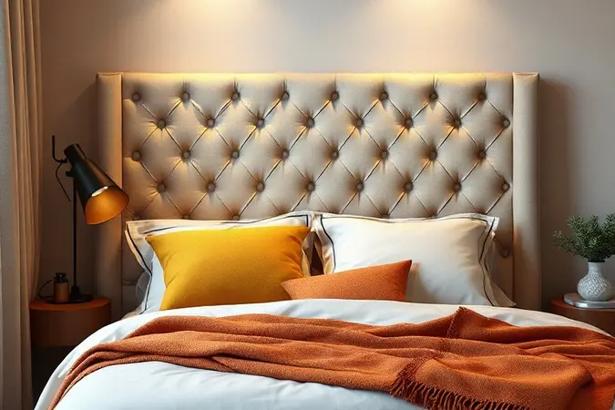
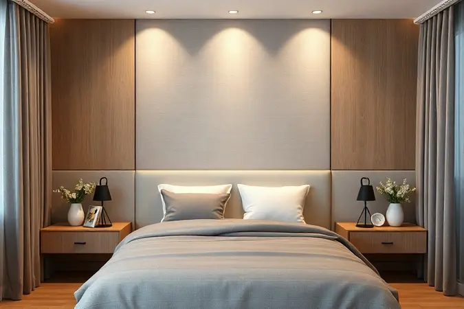
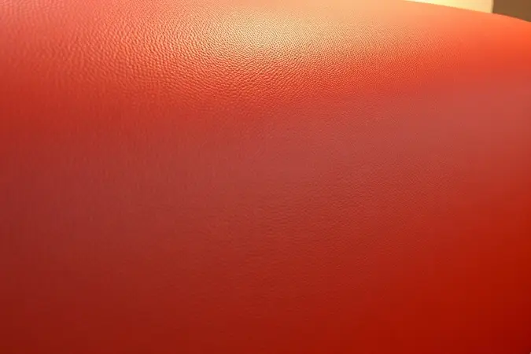
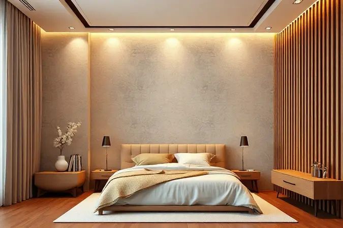

A cabeceira é o abraço que seu quarto dá em você todas as noites. Mais do que um simples apoio, ela é o ponto focal que define a personalidade do seu santuário pessoal, aquela peça que transforma um espaço para dormir em um refúgio para descansar, ler e sonhar.

Escolher a melhor cabeceira estofada vai além da estética: é sobre encontrar o equilíbrio perfeito entre conforto que acolhe suas costas após um longo dia e um design que converse com sua alma.

Com opções que vão do sofisticado capitonê ao prático corino, do aconchegante veludo ao moderno suede, a jornada pode parecer complexa.

Este guia foi criado para simplificar essa busca, reunindo os modelos mais desejados e bem avaliados de 2025, desde peças compactas para solteiros até tronos luxuosos para camas king size, tudo para que seu quarto reflita exatamente quem você é.

<SummaryList products={frontmatter.top_products} />

## As 14 Melhores Cabeceiras Estofadas para Transformar seu Quarto

Imagine entrar no seu quarto e sentir que cada detalhe foi pensado para seu bem-estar. As cabeceiras estofadas são exatamente isso: a fusão entre elegância que encanta os olhos e conforto que abraça o corpo.

Elas não apenas embelezam o ambiente, mas se tornam seu suporte ideal para aquelas páginas finais do livro antes de dormir ou para aquela conversa aconchegante na cama.

Prepare-se para descobrir opções que vão muito além do funcional, verdadeiras extensões da sua personalidade.

### 1. Flamingo Design Cabeceira Estofada Solteiro Provençal Luxo

<ProductBox 
  title={frontmatter.top_products[0].title} 
  image={frontmatter.top_products[0].image} 
  link={frontmatter.top_products[0].link} 
/>

Para quem busca um toque de elegância atemporal, a Provençal Luxo da Flamingo Design é como ter um pedaço da Provence no seu quarto. Seu design clássico, com detalhes impecáveis em tachas galvanizadas, fala de sofisticação sem esforço. A sensação ao encostar?

A combinação perfeita entre a firmeza do MDF e a maciez da espuma, um convite para relaxar. Disponível em cores como suede cinza e veludo, ela se adapta não apenas à sua decoração, mas ao clima que você quer criar no ambiente.

Com medidas de 90 cm de comprimento por 60 cm de altura, ela foi pensada para camas box de solteiro.

A fixação na parede, que pode parecer um detalhe técnico, é na verdade o segredo para a estabilidade e aquele visual integrado e limpo que parece ter sido instalado por um decorador profissional.

<CaixaProsContras>

**Prós:**

- Design clássico que agrega elegância ao quarto.

- Material de alta qualidade e durabilidade.

- Disponível em diversas cores e tecidos.

- Facilidade na combinação com diferentes estilos de decoração.

**Contras:**

- Requer fixação na parede, o que pode ser complicado para alguns.

- O preço pode ser um pouco elevado em comparação a modelos mais simples.

</CaixaProsContras>

### 2. Cabeceira Estofada Solteiro Sophia

<ProductBox 
  title={frontmatter.top_products[1].title} 
  image={frontmatter.top_products[1].image} 
  link={frontmatter.top_products[1].link} 
/>

A Sophia é para quem não quer escolher entre o clássico e o contemporâneo. Ela une esses dois mundos com maestria, apresentando um visual que é tanto familiar quanto surpreendente.

O revestimento em suede oferece uma experiência tátil única, macia ao toque e incrivelmente prática para limpar, ideal para o dia a dia sem preocupações.

Por trás dessa beleza, uma estrutura robusta de madeira de eucalipto ou pinus garante que essa cabeceira será uma companheira por muitos anos.

Com altura entre 1,20m e 1,26m e largura de 90cm ou 100cm, ela se ajusta perfeitamente a camas box de solteiro.

A montagem é descomplicada, basicamente fixar os pés, e mesmo com seu peso considerável (um sinal de qualidade dos materiais), o resultado é uma peça sólida e segura que transforma completamente o ambiente.

<CaixaProsContras>

**Prós:**

- Design versátil que se adapta a diferentes estilos de decoração.

- Revestimento em suede, que proporciona conforto e fácil limpeza.

- Estrutura robusta de madeira, garantindo durabilidade.

- Montagem simples e prática.

**Contras:**

- Pode ser um pouco pesada para transportar.

- É importante conferir as medidas antes da compra para evitar problemas na instalação.

</CaixaProsContras>

### 3. Lyam Decor Cabeceira Estofada Solteiro Dália

<ProductBox 
  title={frontmatter.top_products[2].title} 
  image={frontmatter.top_products[2].image} 
  link={frontmatter.top_products[2].link} 
/>

A Dália da Lyam Decor é a prova de que modernidade e aconchego podem andar juntos. Com linhas limpas e um design que fala por si, ela traz uma elegância discreta para seu quarto.

A magia está nas opções de revestimento: suede bege para um clima neutro e sereno, linho cinza escuro para um ar contemporâneo, ou bouclê rosé para um toque de suavidade. Você escolhe a personalidade da sua peça.

Com 100 cm de largura, 120 cm de altura e 8 cm de profundidade, ela oferece presença sem ser opressora. A versatilidade de instalação (na cama ou na parede) é um trunfo, protegendo suas paredes do atrito e mantendo um visual impecável.

É um investimento em qualidade que se traduz em beleza duradoura.

<CaixaProsContras>

**Prós:**

- Design moderno e elegante.

- Disponível em várias opções de tecido e cor.

- Fácil instalação na cama ou na parede.

- Protege a parede contra manchas e atrito.

**Contras:**

- Não é a opção mais econômica disponível.

- Limitação em tamanhos, sendo voltada apenas para camas de solteiro.

</CaixaProsContras>

### 4. Oferta Mo Cabeceira Estofada Solteiro Laura

<ProductBox 
  title={frontmatter.top_products[3].title} 
  image={frontmatter.top_products[3].image} 
  link={frontmatter.top_products[3].link} 
/>

A Laura é a escolha para quem ama ter opções. Seja no revestimento (tecido sintético, Oxford ou a luxuosa sensação do veludo) ou na origem (encontrada em lojas como Leroy Merlin ou Rojo Decor), ela oferece um leque de possibilidades.

O conforto é garantido pela espuma D23, que oferece a densidade perfeita para apoiar suas costas sem cansar.

Um detalhe que faz a diferença: algumas versões utilizam madeira de reflorestamento em sua estrutura, unindo estilo a uma consciência ambiental.

A dica aqui é clara: diante de tanta variedade, foque no que realmente importa para você: a sensação do tecido ao toque e a densidade do apoio que seu corpo procura.

<CaixaProsContras>

**Prós:**

- Design moderno que combina com diferentes estilos de decoração.

- Várias opções de revestimento e personalização disponíveis.

- Conforto proporcionado pela espuma de boa densidade.

- Estruturas sustentáveis em algumas versões.

**Contras:**

- A variedade de materiais pode confundir na hora da escolha.

- Algumas opções podem ter um tamanho mais restrito, limitando a personalização do ambiente.

</CaixaProsContras>

### 5. Cabeceira Estofada Suspensa Bia

<ProductBox 
  title={frontmatter.top_products[4].title} 
  image={frontmatter.top_products[4].image} 
  link={frontmatter.top_products[4].link} 
/>

A Bia é pura sofisticação suspensa. Fixada diretamente na parede, ela cria a ilusão de leveza e um visual clean e integrado que protege sua parede do desgaste do dia a dia.

É o suporte perfeito para aqueles momentos em que a cama vira sofá: ler um capítulo, tomar um café da manhã especial ou simplesmente contemplar o dia.

Construída em MDF e MDP com estofamento em espuma, ela se oferece em uma paleta de cores que vai do atemporal bege ao moderníssimo rose, em tecidos como suede e corino.

A instalação fica por sua conta, um pequeno desafio que recompensa com uma peça de design que parece ter sido concebida especialmente para seu espaço.

<CaixaProsContras>

**Prós:**

- Design sofisticado e moderno que valoriza o ambiente.

- Confortável, oferecendo apoio para leitura.

- Protege a parede contra manchas e fricção.

- Disponível em várias cores e tecidos.

**Contras:**

- A instalação é de responsabilidade do comprador.

- Pode não ser adequada para todos os estilos de decoração.

</CaixaProsContras>

### 6. Cabeceira Modular Autoadesiva

<ProductBox 
  title={frontmatter.top_products[5].title} 
  image={frontmatter.top_products[5].image} 
  link={frontmatter.top_products[5].link} 
/>

Que tal dar um up no seu quarto sem martelos, parafusos ou complicações? A cabeceira modular autoadesiva é a resposta para quem quer estilo sem obra.

Com módulos que se fixam à parede com fita dupla face, você monta, remonta e personaliza o layout como quiser, criando uma peça única que se adapta ao tamanho exato da sua cama e à sua criatividade.

Além da praticidade, ela não abre mão do conforto: é estofada, pronta para receber você em momentos de relaxamento. A variedade de materiais e cores significa que você encontrará a combinação perfeita para sua decoração.

Só lembre-se: para um "casamento" perfeito com a parede, a superfície precisa ser lisa e limpa.

<CaixaProsContras>

**Prós:**

- Instalação rápida e fácil sem necessidade de ferramentas.

- Permite personalização com diferentes layouts e tamanhos.

- Oferece conforto ao sentar-se ou reclinar na cama.

- Disponível em uma ampla gama de materiais e cores.

**Contras:**

- A adesão pode ser menos eficaz em paredes não lisas.

- Pode não ter a mesma durabilidade que cabeceiras fixas.

</CaixaProsContras>

### 7. Cabeceira Kelly Box Estofada

<ProductBox 
  title={frontmatter.top_products[6].title} 
  image={frontmatter.top_products[6].image} 
  link={frontmatter.top_products[6].link} 
/>

Projetada em sintonia perfeita com camas box, a Kelly Box é a definição de conforto integrado. Sua estrutura robusta em MDF/MDP é envolta por uma camada generosa de espuma e pelo toque aveludado do tecido suede, criando uma superfície convidativa.

O detalhe do acolchoado, muitas vezes com costura manual, adiciona uma camada de sofisticação artesanal.

Disponível em uma ampla gama de cores e tamanhos (casal, queen, king), ela é a peça versátil que se adapta ao seu gosto.

A instalação é simplificada com suporte e manual, mas seu destino é a parede, o que demanda um planejamento prévio para obter aquele visual limpo e organizado que tanto valorizamos.

<CaixaProsContras>

**Prós:**

- Confortável e estofada com material macio.

- Design moderno e sofisticado.

- Disponível em diversas cores para combinar com a decoração.

- Compatível com vários tamanhos de cama box.

**Contras:**

- Requer instalação na parede, o que pode demandar planejamento.

- Pode não ser a melhor opção para ambientes pequenos devido à sua fixação.

</CaixaProsContras>

### 8. Cabeceira Box Bege Ane

<ProductBox 
  title={frontmatter.top_products[7].title} 
  image={frontmatter.top_products[7].image} 
  link={frontmatter.top_products[7].link} 
/>

A Ane traz um conceito de elegância tranquila. Seu design com linhas verticais limpas e o revestimento em bouclé bege criam uma textura visual e tátil que é suave e marcante ao mesmo tempo.

Mais do que bonita, ela é funcional: protege sua parede e oferece um apoio confortável, compatível com camas box.

Sua estrutura, geralmente em madeira de qualidade como eucalipto ou MDF, promete durabilidade. Disponível em tamanhos como casal ou queen, sua instalação costuma ser descomplicada, às vezes exigindo apenas a fixação dos pés.

Ela não vem com firulas ou acessórios extras, e é justamente nessa simplicidade proposital que reside seu charme.

<CaixaProsContras>

**Prós:**

- Design moderno e sofisticado.

- Revestimento suave que proporciona conforto.

- Funcionalidade ao proteger a parede.

- Estrutura robusta que promete durabilidade.

**Contras:**

- Modelos podem exigir montagem simples.

- Não oferece recursos adicionais como prateleiras.

</CaixaProsContras>

### 9. Cabeceira De Cama Box Art Espanha

<ProductBox 
  title={frontmatter.top_products[8].title} 
  image={frontmatter.top_products[8].image} 
  link={frontmatter.top_products[8].link} 
/>

A Art Espanha é um tributo à durabilidade com estilo. Sua estrutura em madeira de eucalipto é a base sólida para um estofamento que promete conforto e resistência.

A paleta de cores oferece opções para todos os humores: do sereno bege ao vibrante américo, passando pelo clássico azul marinho.

Seja para uma cama de casal (140 cm), queen size (160 cm) ou solteiro (90 cm), ela se adapta. A praticidade vem em algumas versões que já chegam montadas, poupando seu tempo.

Um aviso justo: como toda peça única, pode haver pequenas variações de tonalidade em relação às fotos, mas a qualidade da construção costuma falar mais alto.

<CaixaProsContras>

**Prós:**

- Estrutura robusta em madeira de eucalipto.

- Diversas opções de cores disponíveis.

- Estilo elegante que se adapta à decoração.

- Facilidade na instalação de algumas versões.

**Contras:**

- Pode haver variações nas cores em relação às fotos.

- Algumas opções exigem montagem adicional.

</CaixaProsContras>

### 10. Cabeceira Estofada Carla

<ProductBox 
  title={frontmatter.top_products[9].title} 
  image={frontmatter.top_products[9].image} 
  link={frontmatter.top_products[9].link} 
/>

A Carla é a escolha segura para quem busca um design atemporal. Ela transita entre o clássico e o moderno com naturalidade, tornando-se uma peça que nunca sai de moda.

Disponível para cama de casal e king size, sua robustez vem da estrutura em madeira de eucalipto ou contraplacado, enquanto o conforto é dever da espuma de alta densidade que compõe seu estofamento.

Revestida em tecidos como suede ou veludo, em cores neutras que são um convite à harmonia, ela se adapta a praticamente qualquer decoração. A montagem é facilitada com todos os acessórios inclusos. É um investimento acima da média que se paga em anos de uso e beleza.

Só não se esqueça de verificar as dimensões para garantir uma passagem tranquila pela sua casa.

<CaixaProsContras>

**Prós:**

- Design versátil que se adapta a diferentes estilos de decoração.

- Estrutura resistente em madeira de eucalipto.

- Estofamento confortável com espuma de alta densidade.

- Fácil montagem com todos os acessórios inclusos.

**Contras:**

- Não é a opção mais barata disponível.

- Cores limitadas em algumas lojas.

</CaixaProsContras>

### 11. Cabeceira Estofada Capitonê Areia

<ProductBox 
  title={frontmatter.top_products[10].title} 
  image={frontmatter.top_products[10].image} 
  link={frontmatter.top_products[10].link} 
/>

O capitonê é a assinatura do requinte, e esta cabeceira traz esse clássico para o seu quarto com maestria. Os botões que formam o acabamento não são apenas decorativos, criam um relevo que é um convite visual e tátil.

Com estrutura em MDF/MDP e revestimento em suede, ela une solidez a uma estética inconfundível.

Disponível em tamanhos como casal e queen, sua profundidade de 6 cm é um trunfo para quartos que precisam otimizar espaço. Algumas versões ainda oferecem altura ajustável, permitindo o alinhamento perfeito com a espessura do seu colchão.

A cor areia é a camaleoa perfeita, adaptando-se com elegância a qualquer estilo que você já tenha ou queira criar.

<CaixaProsContras>

**Prós:**

- Design elegante com acabamento em capitonê.

- Conforto agregado à decoração do ambiente.

- Disponível em diferentes tamanhos.

- Opções com altura ajustável para melhor ajuste.

**Contras:**

- Pode ter limitações em escolhas de cores.

- Estruturas fixadas na parede exigem instalação adequada.

</CaixaProsContras>

### 12. Cabeceira Mirage Suede Bege

<ProductBox 
  title={frontmatter.top_products[11].title} 
  image={frontmatter.top_products[11].image} 
  link={frontmatter.top_products[11].link} 
/>

A Mirage é sinônimo de sofisticação discreta. Seu nome já sugere: ela cria uma presença elegante que se integra perfeitamente ao ambiente.

A estrutura de madeira de eucalipto reflorestada fala de durabilidade com responsabilidade, enquanto o revestimento em suede bege oferece um toque aveludado e visualmente tranquilo.

Do solteiro ao queen size, ela se adapta. O estofamento em espuma de alta densidade garante o conforto, e detalhes como o capitonê feito à mado podem aparecer, acrescentando charme.

A montagem é quase um passeio: muitas vezes ela chega quase pronta, exigindo apenas a fixação dos pés. Apenas esteja aberto a pequenas variações na tonalidade do bege, parte da beleza de um produto com carácter.

<CaixaProsContras>

**Prós:**

- Estética moderna e sofisticada

- Confortável com estofamento de alta densidade

- Estrutura durável de madeira reflorestada

- Fácil montagem

**Contras:**

- A tonalidade pode variar nas imagens

- Pode não ser adequada para ambientes muito úmidos devido ao tecido

</CaixaProsContras>

### 13. Painel Cabeceira Ripada Freijó

<ProductBox 
  title={frontmatter.top_products[12].title} 
  image={frontmatter.top_products[12].image} 
  link={frontmatter.top_products[12].link} 
/>

Para um despertar em um ambiente que respira leveza e modernidade, o painel ripado na cor freijó é uma escolha inspirada. O tom claro da madeira ilumina o quarto, criando uma sensação de amplitude e aconchego ao mesmo tempo.

Sua versatilidade é impressionante, casando igualmente bem com um estilo nórdico minimalista ou com uma decoração rústica mais aconchegante.

Feito geralmente em MDF, ele oferece a durabilidade e a facilidade de limpeza que quem busca praticidade valoriza.

Requer menos manutenção que uma peça estofada, embora modelos em madeira natural possam pedir um pouco mais de cuidado, um pequeno preço pelo charme único que trazem.

<CaixaProsContras>

**Prós:**

- Design moderno e elegante.

- Facilita a limpeza e manutenção.

- Versátil para diversos estilos de decoração.

- Ajuda a ampliar visualmente o espaço.

**Contras:**

- Modelos em madeira natural podem exigir manutenção.

- Pode não ter o mesmo conforto de uma cabeceira estofada.

</CaixaProsContras>

### 14. Cabeceira Reta Luxo com Tachas

<ProductBox 
  title={frontmatter.top_products[13].title} 
  image={frontmatter.top_products[13].image} 
  link={frontmatter.top_products[13].link} 
/>

A Reta Luxo é um statement de estilo. Ela não pede licença para ser o centro das atenções, com seu design assertivo e as tachas decorativas (em fumê ou prata) que realçam seu caráter sofisticado.

Estofada em materiais como corino, suede ou veludo, ela oferece uma experiência de luxo tátil.

Compatível com camas box e disponível do solteiro ao king size, ela se adapta ao seu espaço.

A instalação costuma ser simples, com suporte incluso, mas a variedade de materiais significa que você deve escolher pensando não só na estética, mas também na durabilidade e no tipo de manutenção que se adequa ao seu estilo de vida.

<CaixaProsContras>

**Prós:**

- Design elegante que adiciona sofisticação ao quarto

- Diversidade de tamanhos disponíveis para diferentes camas

- Materiais variados que permitem personalização

- Instalação fácil com suporte incluído

**Contras:**

- A variedade de materiais pode influenciar na durabilidade

- Pode não ser a melhor opção para quem busca um estilo mais rústico

</CaixaProsContras>

Agora que você já explorou um universo de possibilidades, vamos além da aparência. O que realmente define uma cabeceira estofada? Como transformar todas essas opções na escolha certa para o seu refúgio pessoal? Vamos desvendar esses segredos.

## O Que É a Cabeceira Estofada?

Pense na cabeceira estofada como o abraço arquitetônico do seu quarto. Mais do que um elemento decorativo fixado na parede, ela é uma zona de conforto intencional.

Sua construção geralmente parte de uma base sólida de madeira ou MDF, que é então envolta em camadas de espuma e finalmente vestida com um tecido, veludo para um luxo sensorial, couro para uma durabilidade clássica, linho para uma textura natural.

Sua função transcende o apoio para as costas. Ela melhora a acústica do ambiente, absorvendo sons e criando um clima mais íntimo, e se torna o ponto focal que direciona todo o olhar e a energia do espaço.

Disponíveis em formas, cores e texturas infinitas, elas são a tradução material do estilo do seu quarto, do clássico mais rebuscado ao contemporâneo mais clean.

## Como Escolher a Melhor Cabeceira Estofada

Escolher a cabeceira ideal é uma conversa íntima entre o seu estilo de vida, o conforto que seu corpo pede e o espaço que você habita. Não se trata apenas de combinar cores, mas de criar uma experiência.

Comece visualizando o estilo do seu quarto, sinta o conforto potencial do material e meça com cuidado a altura e o tamanho para um encaixe perfeito.

### Escolha a Cabeceira Estofada Conforme o Tamanho da Cama

A proporção é a chave da harmonia visual. Uma cabeceira para uma cama de casal pode ser mais compacta, elegante e discreta. Já para uma cama king size, a peça pede uma presença mais marcante, uma largura generosa que converse com a escala do móvel.

A escolha correta não só complementa a estética, mas garante que a função de apoio seja eficiente e confortável em qualquer ponto da cama, criando um conjunto equilibrado e intencional.

### Para Quartos Pequenos, Compre uma Cabeceira Estofada Painel

Se o espaço é um tesouro a ser otimizado, a cabeceira em painel é sua aliada estratégica. Seu design compacto e minimalista ocupa menos espaço visual, evitando a sensação de sobrecarga.

Ela oferece exatamente o que você precisa: conforto para encostar e um toque de sofisticação que eleva o ambiente. Com uma variedade de cores e texturas, você consegue criar um ponto focal aconchegante que amplia a percepção do espaço, em vez de reduzi-lo.

### Prefira Cabeceira com Estrutura Resistente e Espuma de Densidade Alta

Aqui está o segredo da longevidade e do prazer diário: a união indissociável entre estrutura e enchimento.

Busque uma estrutura resistente, de madeira de qualidade ou metálica, que seja a espinha dorsal da peça, garantindo que ela mantenha sua forma e dignidade ano após ano. Paralelamente, exija uma espuma de alta densidade.

É ela que proporciona o conforto ergonômico, que não cede com o uso, oferecendo um apoio firme e acolhedor que transforma seu momento de descanso. Investir nesses dois pilares é garantir noites (e sonecas) muito mais tranquilas.

### Cabeceiras Estofadas de Corino São Mais Fáceis de Limpar

Para a vida real, com seus imprevistos e agitações, o corino é um super-herói disfarçado de tecido. Com a aparência nobre do couro, ele traz uma resistência superior e, o melhor, uma praticidade de limpeza inigualável.

Enquanto tecidos tradicionais podem absorver manchas, um pano levemente umedecido é suficiente para manter o corino impecável.

É a escolha inteligente para quem valoriza um visual elegante, mas não quer se tornar refém da manutenção, garantindo que a beleza da peça dure tanto quanto sua estrutura.

### Mesas de Cabeceira ou Encostos Reclináveis: Qual Diferencial Combina com Seu Estilo de Vida?

Esta decisão revela como você usa seu santuário. As mesas de cabeceira são para os colecionadores de momentos: quem gosta de ter o livro atual, uma luminária aconchegante, um copo d'água ou os óculos sempre à mão.

Já o encosto reclinável é para os adeptos do relaxamento profundo: ele transforma sua cama em um lounge, permitindo que você ajuste o ângulo perfeito para ler, assistir a uma série ou simplesmente contemplar o teto.

A pergunta é: você é mais organizador de cenários ou sultão do conforto?

### Verifique Se a Cabeceira Vem com Kit Ferragem

Este é o detalhe prático que separa uma instalação tranquila de uma dor de cabeça. Antes de concluir qualquer compra, confirme explicitamente se a cabeceira inclui o kit de ferragem completo: suportes, parafusos, buchas e instruções.

A ausência deste kit não é apenas um inconveniente, pode significar custos extras e a frustração de ter uma peça linda encostada na parede, esperando por parafusos que você terá que caçar por conta própria.

## Estofada vs Ripada: Qual Estilo Escolher?

Esta escolha define o DNA do seu quarto. A cabeceira estofada é o epítome do aconchego e da sofisticação acolhedora. É tátil, convidativa e oferece um leque enorme de personalização em tecidos e cores.

É para quem quer que o quarto seja um convite ao relaxamento sensorial. A cabeceira ripada, por outro lado, é a musa do minimalismo e da modernidade.

Com um visual clean, linhas definidas e uma durabilidade fácil de manter, ela apela para quem busca praticidade, um estilo contemporâneo e um ambiente que parece sempre organizado.

A resposta está no cruzamento entre a funcionalidade que você precisa e a emoção que você quer sentir ao entrar no seu quarto.

## Dicas de Fixação e Manutenção

Para que sua cabeceira seja tão duradoura na função quanto é na beleza, dois cuidados são essenciais: a instalação correta e a manutenção adequada. Na fixação, não economize nos suportes.

Use parafusos e buchas de qualidade compatíveis com o tipo da sua parede (gesso, alvenaria, etc.). Se for apenas apoiada, verifique minuciosamente o equilíbrio e a estabilidade.

Na manutenção, estabeleça uma rotina simples. Passe um pano seco ou levemente umedecido regularmente para controlar a poeira. Para manchas, recorra a produtos específicos para o tipo de tecido.

E proteja sua investição da luz solar direta prolongada, que pode ser implacável com as cores. Com esses cuidados, sua cabeceira continuará sendo o ponto de orgulho do seu quarto por muito, muito tempo.

## Perguntas Frequentes

É natural ter dúvidas ao fazer uma escolha que vai definir o ambiente por anos. A durabilidade, por exemplo, está diretamente ligada à qualidade da estrutura e do estofamento que você selecionar.

A limpeza varia conforme o tecido, mas a dica de ouro é sempre seguir as orientações do fabricante. A altura e o estilo são decisões pessoais que devem, acima de tudo, complementar a atmosfera que você deseja criar.

Lembre-se, uma boa cabeceira não é apenas um móvel, é a moldura do seu descanso e um reflexo do seu gosto.

## Conclusão

Escolher a melhor cabeceira estofada é uma jornada que vai muito além da compra de um móvel. É sobre dar voz ao seu quarto, sobre transformar um espaço funcional em um refúgio pessoal que conta sua história através do conforto e da beleza.

Das opções clássicas e sofisticadas às modernas e práticas, cada modelo apresentado oferece uma promessa única: a de tornar suas horas de descanso mais acolhedoras e seu despertar mais inspirador.

Ao considerar o tamanho da sua cama, as dimensões do ambiente, a qualidade dos materiais e, claro, a emoção que cada textura e cor despertam em você, você encontrará muito mais do que um apoio para as costas.

Encontrará a peça que completa o puzzle do seu santuário pessoal. Agora é com você: qual dessas cabeceiras vai ganhar o lugar de honra no seu quarto e se tornar o cenário dos seus melhores momentos de relaxamento?