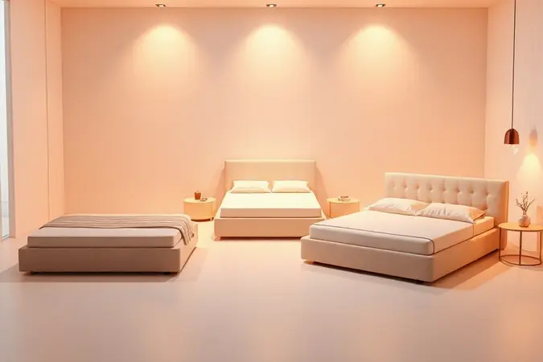
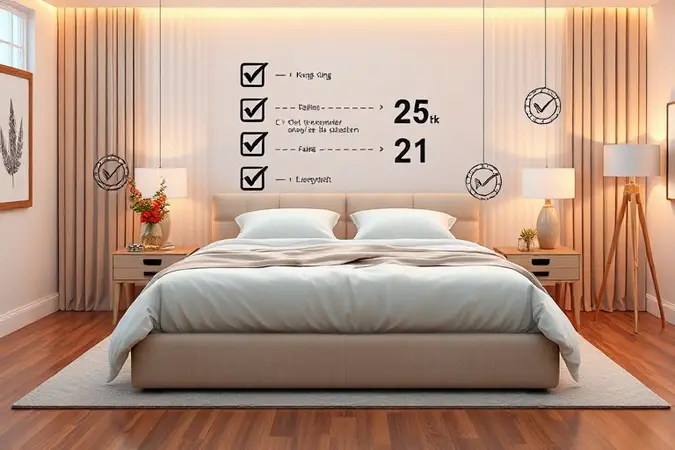
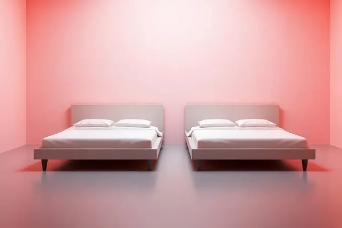
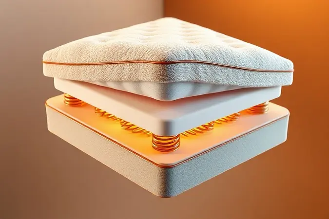

Investir em uma cama box king é como prometer a si mesmo que as próximas noites serão verdadeiramente suas.

Não se trata apenas de ter um espaço maior, é sobre recuperar aquela liberdade de se esticar à vontade, de não acordar com um braço pendurado para fora porque o parceiro tomou todo o espaço, de criar um santuário onde a qualidade do sono finalmente vem em primeiro lugar.

Mas com tantas opções disponíveis, algumas com mais de 30 diferenças de materiais, densidades e funcionalidades, como escolher a que realmente vai transformar seu descanso?

Foi pensando nessa decisão crucial que mergulhamos nos detalhes, montando um guia que vai além das especificações técnicas para mostrar o que cada modelo representa na prática, todas as noites, quando a luz se apaga e você finalmente relaxa.

<SummaryList products={frontmatter.top_products} />

## As 13 Melhores Camas Box King para o Seu Conforto

### 1. Conjunto Box King Mola Probel Prohotel Casa (193x203x66cm)

<ProductBox 
  title={frontmatter.top_products[0].title} 
  image={frontmatter.top_products[0].image} 
  link={frontmatter.top_products[0].link} 
/>

Imagine um colchão que entende que você e seu parceiro são pessoas diferentes, com pesos diferentes, preferências de firmeza diferentes, até horários de sono diferentes.

É exatamente isso que o sistema de molejo Prolastic oferece, adaptando-se progressivamente à pressão que cada um exerce. Não é uma superfície uniforme, mas sim uma que aprende com você.

As espumas de alta densidade garantem que essa adaptação não seja passageira; é um compromisso de anos sem afundar ou perder forma.

E enquanto as moléculas do Baygard trabalham silenciosamente para inibir ácaros e fungos, seu pillow box convida para um abraço inicial de maciez, como se dissesse 'relaxe, hoje vai ser diferente'. A única concessão?

Essa robustez tem um peso que se faz sentir na hora da mudança, mas pense nisso como sinal de um produto que não economizou em durabilidade.

<CaixaProsContras>

**Prós:**

- Conforto e suporte adaptável com molejo Prolastic.

- Estrutura de espumas de alta densidade para maior durabilidade.

- Pillow box para uma experiência de sono mais macia.

- Tratamento Baygard para inibição de ácaros e fungos.

**Contras:**

- Peso elevado pode dificultar movimentação durante mudanças.

- Altura total pode não ser ideal para todos os usuários.

</CaixaProsContras>

### 2. Conjunto Box King Mola Ensacada Probel Munique (193x203x56cm)

<ProductBox 
  title={frontmatter.top_products[1].title} 
  image={frontmatter.top_products[1].image} 
  link={frontmatter.top_products[1].link} 
/>

Para casais que vivem diferentes realidades de conforto, as molas ensacadas criam uma solução tão individualizada quanto um colchão personalizado.

Cada mola trabalha de forma independente, como se você tivesse seu próprio sistema de suporte discreto, invisível para quem está do outro lado.

O tecido de malha branca não é apenas uma escolha estética, é uma promessa de frescor, aquela sensação de lençóis recém-trocados que persiste noite após noite.

Quando o pillow Euro recebe você, a firmeza intermediária abraça sem sufocar, mantendo a coluna alinhada sem rigidez exagerada.

E para quem ainda tem dúvidas sobre investir, a certificação do Inmetro é mais que um selo: é um testemunho de que alguém já testou rigorosamente cada grama de qualidade.

<CaixaProsContras>

**Prós:**

- Sistema de molas ensacadas que oferece suporte personalizado.

*   Pillow Euro que proporciona uma superfície macia.

- Tecido de malha que garante frescor e suavidade.

- Certificação do Inmetro, garantindo qualidade.

**Contras:**

- Pode ser mais volumoso e pesado, exigindo mais espaço.

- O nível de firmeza intermediário pode não agradar a todos os gostos.

</CaixaProsContras>

### 3. Conjunto Box King Mola Ensacada Probel Excede Premium (193x203x56cm)

<ProductBox 
  title={frontmatter.top_products[2].title} 
  image={frontmatter.top_products[2].image} 
  link={frontmatter.top_products[2].link} 
/>

Existe um momento quase mágico quando você percebe que seu parceiro se virou na cama... mas você não sentiu absolutamente nada.

Essa é a tecnologia de transferência de movimento minimizada, e ela transforma noites em um território exclusivo onde os movimentos do outro ficam confinados ao seu próprio espaço.

A camada super pillow é aquele capricho que faz toda a diferença: não é apenas sobre suporte, mas sobre recepção. Como se a cama estivesse esperando por você.

E aqui vem um alívio para quem já desistiu da manutenção de girar e virar colchões: basta uma rotação ocasional, e o resto do tempo você simplesmente desfruta.

O investimento pode ser um passo acima do comum, mas pense nas centenas de manhãs seguintes em que você acordará sem perguntar 'por que me sinto assim?'

<CaixaProsContras>

**Prós:**

- Conforto excepcional devido ao sistema de molas ensacadas.

-   Minimiza a transferência de movimento entre os parceiros.

- Design ergonômico que promove saúde e bem-estar.

- Facilidade na manutenção (apenas girar o colchão).

**Contras:**

- O preço pode ser considerado elevado por alguns consumidores.

- Não é necessário virar o colchão, mas isso pode limitar algumas opções de uso em longo prazo.

</CaixaProsContras>

### 4. Conjunto Box King Mola Ensacada Probel Bari (193x203x58cm)

<ProductBox 
  title={frontmatter.top_products[3].title} 
  image={frontmatter.top_products[3].image} 
  link={frontmatter.top_products[3].link} 
/>

Para quem convive com alergias ou simplesmente deseja um ambiente mais protegido, o tratamento antiácaro não é um detalhe técnico, é um respiro tranquilo. Dormir sem preocupações com espirros noturnos ou coceiras matinais muda completamente a qualidade do descanso.

As molas ensacadas trabalham em dueto com essa proteção, criando um santuário onde nem corpo nem sistema respiratório são perturbados.

O nível de firmeza intermediário é como um mediador hábil: oferece estrutura suficiente para quem precisa de apoio, mas flexibilidade para quem busca conforto mais acolhedor.

A altura da base pode parecer uma simplificação, mas para pessoas com mobilidade reduzida ou apenas preferência por camas mais baixas, essa característica se torna uma comodidade diária.

<CaixaProsContras>

**Prós:**

- Molas ensacadas que reduzem a transferência de movimento.

- Nível de firmeza intermediário, ideal para diferentes biotipos.

- Tratamento antiácaro e composição hipoalergênica.

- Design sofisticado e materiais de qualidade.

**Contras:**

- Base box com altura de 26 cm, que pode não agradar a todos.

- Garantia do box é mais curta (3 meses) em comparação ao colchão (12 meses).

</CaixaProsContras>

### 5. Conjunto Box King Mola Ensacada Probel Vancouver (193x203x54cm)

<ProductBox 
  title={frontmatter.top_products[4].title} 
  image={frontmatter.top_products[4].image} 
  link={frontmatter.top_products[4].link} 
/>

Às vezes, alinhamento da coluna soa como algo clínico, distante. Mas experimente uma semana dormindo em um colchão que realmente apoia sua postura natural.

As dores matinais desaparecem, a energia ao acordar é diferente, e você percebe que apoiar a coluna é na verdade libertá-la para descansar de verdade.

O tecido em malha de 280 g/m² tem uma função crucial nessa equação: enquanto suas costas encontram suporte, sua pele encontra respiração. Nada de suor noturno ou superfícies que retêm calor.

E quando o Euro Pillow entra em cena, ele não acrescenta apenas maciez, acrescenta uma transição suave entre o dia corrido e o sono reparador.

A manutenção sem virar é uma daquelas pequenas gentilezas que você agradece toda vez que lembra que existe uma vida além de arrumar a cama.

<CaixaProsContras>

**Prós:**

- Molas ensacadas que minimizam a transferência de movimento.

- Nível de firmeza intermediário que ajuda no alinhamento da coluna.

- Tecido hipoalergênico e respirável.

- Euro Pillow que proporciona conforto adicional.

**Contras:**

- Suporta até 120 kg por pessoa, o que pode ser uma limitação para alguns usuários.

- Não precisa ser virado, mas apenas girado, isso pode não agradar a quem prefere rotacionar colchões regularmente.

</CaixaProsContras>

### 6. Conjunto Box King Mola Ensacada Probel Cairo Ultra Gel (193x203x56cm)

<ProductBox 
  title={frontmatter.top_products[5].title} 
  image={frontmatter.top_products[5].image} 
  link={frontmatter.top_products[5].link} 
/>

Existe uma satisfação sutil em investir em algo que parece e funciona como um objeto de design. O tecido em malha branca não apenas complementa seu quarto, ele eleva o ambiente, transformando a cama de um móvel para dormir em um elemento decorativo intencional.

Por trás dessa elegância, a espuma HR Gel D45 trabalha com uma precisão quase científica, moldando-se não apenas ao seu corpo, mas à sua noite, recuperando sua forma cada manhã como se estivesse pronta para recomeçar.

Essa altura generosa pode parecer excessiva para alguns, mas para quem procura a sensação de mergulhar na cama, literalmente, é uma experiência que redefine o significado de 'deitar para descansar'.

<CaixaProsContras>

**Prós:**

- Molas ensacadas oferecem independência de movimento.

- Espumas de alta qualidade garantem durabilidade e conforto.

- Design elegante e sofisticado.

- Ideal para casais com biotipos diferentes.

**Contras:**

- Altura do conjunto pode não agradar a todos.

- Pode ser um investimento maior em comparação a opções mais simples.

</CaixaProsContras>

### 7. Conjunto Box King Mola Ensacada Probel Sigma Plus (193x203x50cm)

<ProductBox 
  title={frontmatter.top_products[6].title} 
  image={frontmatter.top_products[6].image} 
  link={frontmatter.top_products[6].link} 
/>

Algumas pessoas não querem 'afundar' no colchão, querem se deitar sobre uma superfície sólida, confiável, que não ceda. A classificação extra firme é para esses perfis: quem acorda sentindo que dormiu em uma rede sabe exatamente do que estamos falando.

Aqui, cada mola ensacada trabalha com uma determinação singular, oferecendo resistência onde você precisa e firmeza onde sua coluna espera encontrá-la. O tratamento hipoalergênico é um bônus silencioso, protegendo enquanto você dorme, sem pedir atenção.

Se você já se cansou de colchões que parecem 'afundar' após alguns meses, essa firmeza consistente é um alívio que dura anos.

<CaixaProsContras>

**Prós:**

- Molas ensacadas que minimizam a transferência de movimento

- Suporte extra firme ideal para alinhamento da coluna

- Tratamento hipoalergênico e antiácaro

- Dimensões espaçosas que acomodam confortavelmente duas pessoas

**Contras:**

- A firmeza pode não agradar a quem prefere colchões mais macios

- Pode ocupar bastante espaço no quarto

</CaixaProsContras>

### 8. Conjunto Box King Mola Probel Roma (193x203x56cm)

<ProductBox 
  title={frontmatter.top_products[7].title} 
  image={frontmatter.top_products[7].image} 
  link={frontmatter.top_products[7].link} 
/>

Equilíbrio é uma arte rara nos colchões: ou são macios demais e comprometem o suporte, ou são firmes demais e sacrificam o conforto.

O Pillow Super nesta cama resolve esse dilema como um mediador experiente, oferecendo um abraço inicial de maciez que depois dá lugar a uma estrutura sólida, confiável.

A etiqueta 'No Turn' pode parecer um detalhe técnico até você experimentar a liberdade de nunca mais precisar revirar um colchão pesado. Apenas gire ocasionalmente, um movimento simples que preserva a longevidade sem exigir esforço heroico.

E sim, os primeiros dias podem sentir-se mais firmes, mas é como conhecer alguém novo: com o tempo, as arestas se suavizam e você descobre um companheiro de sono que realmente entende seu ritmo.

<CaixaProsContras>

**Prós:**

- Firmeza que oferece bom suporte para a coluna.

- Camada adicional de conforto com Pillow Super.

- Materiais de alta qualidade com durabilidade garantida.

- Design king size que proporciona amplo espaço para dormir.

**Contras:**

- Pode parecer duro nos primeiros dias, exigindo um período de adaptação.

- Peso elevado pode dificultar movimentação na hora da limpeza.

</CaixaProsContras>

### 9. Cama Box King Colchão OrtoFirm + Box Double Face Espuma D45 (Cama InBox)

<ProductBox 
  title={frontmatter.top_products[8].title} 
  image={frontmatter.top_products[8].image} 
  link={frontmatter.top_products[8].link} 
/>

Imagine ter duas camas em uma. Não em termos de espaço, mas de longevidade.

A tecnologia Double Face não é apenas um truque de design, é um investimento inteligente que dobra a vida útil do seu colchão, literalmente virando a página quando um lado começa a mostrar sinais de uso.

A espuma D45 com classificação extra firme é para quem leva o alinhamento da coluna a sério, mas sem abrir mão daquele momento de conforto inicial que o Pillow Top Euro Duplo oferece.

É como ter um personal trainer discreto para suas costas, que depois de fazer seu trabalho, sabe que é hora de deixar você relaxar.

A madeira de eucalipto de reflorestamento fala sobre um compromisso que começa na sustentabilidade e termina na robustez que você sente a cada vez que se deita.

<CaixaProsContras>

**Prós:**

- Ampla dimensão ideal para casais ou quem gosta de espaço.

- Conforto extra firme que favorece o alinhamento da coluna.

- Tecnologia Double Face que aumenta a durabilidade.

- Camada Pillow Top que proporciona conforto adicional.

**Contras:**

- Peso elevado pode dificultar movimentação.

- Pode não ser a escolha ideal para quem prefere colchões mais macios.

</CaixaProsContras>

### 10. Cama Box King Ortopédico Firme (BF Colchões)

<ProductBox 
  title={frontmatter.top_products[9].title} 
  image={frontmatter.top_products[9].image} 
  link={frontmatter.top_products[9].link} 
/>

Quando seu médico recomenda atenção à postura durante o sono, você não quer apenas um colchão qualquer, quer uma solução pensada por quem entende de biomecânica.

As diferentes densidades de espuma (D33, D45) oferecem caminhos distintos para o mesmo destino: uma noite de sono que respeita sua anatomia.

A certificação antialérgica é selo de tranquilidade para quem já sofreu com reações durante a noite ou acordou com espirros inexplicáveis.

Modernidade no design significa que você não precisa escolher entre saúde e estética: seu quarto pode ser bonito e funcional, um lugar onde seu corpo se recupera e seus olhos descansam.

<CaixaProsContras>

**Prós:**

- Excelente suporte para a coluna.

- Disponível em diferentes densidades de espuma.

- Antialérgico e certificado.

- Design moderno que se adapta a diversos ambientes.

**Contras:**

- Preço pode ser mais elevado do que camas comuns.

- A necessidade de um espaço maior pode limitar onde você pode colocá-la.

</CaixaProsContras>

### 11. Cama Box King Molas Ensacadas Premium Sleep (BF Colchões)

<ProductBox 
  title={frontmatter.top_products[10].title} 
  image={frontmatter.top_products[10].image} 
  link={frontmatter.top_products[10].link} 
/>

Existe uma sutileza pouco comentada nas molas ensacadas: elas não apenas evitam que você sinta os movimentos do parceiro, mas também permitem que você mesmo se mexa sem criar uma 'onda' que incomoda. É como dançar sozinho em um palma compartilhado.

O pillow top em espuma Max Flowing tem algo de quase terapêutico: alívio de pontos de pressão onde seu corpo mais precisa, especialmente depois de um dia em pé ou sentado em posições pouco naturais.

O acabamento em malha belga é um daqueles detalhes que só quem experimenta entende, um toque que faz diferença na primeira vez que você desliza sob as cobertas, e continua fazendo diferença na centésima vez.

<CaixaProsContras>

**Prós:**

- Molas ensacadas garantem conforto e suporte.

- Pillow top proporciona maciez adicional.

- Hipoalergênico, ideal para quem tem alergias.

- Estrutura resistente e durável.

**Contras:**

- A altura pode não ser ideal para todos.

- O nível de conforto pode ser considerado firme por alguns usuários.

</CaixaProsContras>

### 12. Cama Box Baú Casal King Colchão Molas Ensacadas Love Story (Gazin)

<ProductBox 
  title={frontmatter.top_products[11].title} 
  image={frontmatter.top_products[11].image} 
  link={frontmatter.top_products[11].link} 
/>

Para quem vive em espaços urbanos onde cada centímetro conta, o baú não é apenas um compartimento, é uma extensão do guarda-roupas, um esconderijo para roupas de cama extras, edredons de inverno, ou até aqueles livros que você quer manter por perto mas não em vista.

Enquanto o sistema de abertura fácil organiza sua vida, as molas ensacadas organizam seu sono. O pillow top é o convite, as molas são a execução, e juntos formam um sistema onde a praticidade do dia a dia não compromete o conforto da noite.

O revestimento em malha de viscose e suede é um lembrete de que funcionalidade e sofisticação podem, sim, dormir juntas.

<CaixaProsContras>

**Prós:**

- Conforto superior com Pillow Top e molas ensacadas.

- Sistema de baú para armazenamento eficiente.

- Design moderno e elegante.

- Boa durabilidade com materiais de qualidade.

**Contras:**

- Peso elevado, pode ser difícil para movimentar.

- Garantia do box é mais curta (3 meses).

</CaixaProsContras>

### 13. Cama Box King Size Herval Alba (Herval)

<ProductBox 
  title={frontmatter.top_products[12].title} 
  image={frontmatter.top_products[12].image} 
  link={frontmatter.top_products[12].link} 
/>

Alguns produtos não precisam de muitos adjetivos: o pillow top one side fala por si. É aquele tipo de maciez que não pede desculpas por ser reconfortante, que não tenta esconder seu propósito acolhedor sob linguagem técnica.

A base em eucalipto é a fundação silenciosa de tudo, durável, resiliente, feita para durar décadas. Enquanto você aproveita a sensação do pillow, essa estrutura garante que o suporte jamais falte.

Com revestimento em malha que respira e molas que trabalham em conjunto, tudo conspira para uma noite onde o único objetivo é deixar o dia para trás.

<CaixaProsContras>

**Prós:**

- Conforto excepcional com molas ensacadas.

- Design sofisticado com revestimento em malha.

- Pillow Top que aumenta a maciez.

- Garantia de 12 meses para as molas.

**Contras:**

- Suporte individual pode ser insuficiente para algumas pessoas.

- Limitações no peso podem não atender a todos.

</CaixaProsContras>

Agora que você conhece as opções mais recomendadas, surge uma nova camada da escolha: entender que tipo de cama box king realmente dialoga com sua rotina, espaço e desejos pessoais.

## Cama box king: o máximo em espaço e conforto para seu descanso

Mais do que uma questão de centímetros, a cama box king representa uma mudança de filosofia sobre o sono. Para casais, significa a liberdade de se mover sem negociar espaço, de encontrar sua posição perfeita sem preocupação em perturbar o outro.

Para famílias com crianças que insistem em dormir junto nos momentos mais difíceis, ou para quem divide o quarto com pets que não entendem limites territoriais, essa amplitude não é luxo, é solução prática.

Essa generosidade de espaço trabalha em conjunto com tecnologias que vão além do conforto superficial.

Não se trata apenas de uma cama maior, mas de um sistema que reconhece que dormir bem é um conjunto de pequenas decisões certas: suporte onde sua coluna precisa, respiração onde sua pele pede, durabilidade onde seu investimento exige.

## Tipos de cama box king

Cada modelo traz uma personalidade diferente para o quarto, e entender essas nuances é como escolher o parceiro certo para uma longa jornada de noites bem-dormidas.

### Cama box king bipartido

Resolver um problema logístico pode abrir espaço para uma personalização preciosa. O design bipartido transforma o que seria uma peça monumental em dois componentes gerenciáveis, facilitando desde a entrada no prédio até pequenos ajustes de posição dentro do quarto.

Mas o verdadeiro tesouro aqui está na possibilidade de personalizar a firmeza de cada lado, porque amor é compartilhar a vida, mas sono reparador é algo que cada corpo precisa em sua dose específica.

### Cama box king com baú

Como transformar espaço desperdiçado em solução prática. O baú é um paradoxo elegante: esconde a bagunça enquanto proporciona acesso fácil ao que você precisa guardar.

Edredons volumosos de inverno, roupas de cama extra, até malas que só usamos nas viagens, tudo encontra um lar discreto e organizado. É para quem entende que organização não é sobre ter menos, mas sobre saber onde está cada coisa quando precisa.

### Cama box king com colchão de molas ensacadas

A física do sono reparador começa com um princípio simples: independência.

Cada mola trabalhando de forma autônoma significa que seu quadril direito não precisa saber o que seu ombro esquerdo está fazendo, ou que o movimento do seu parceiro pode ser apenas dele, não seu.

Essa individualidade silenciosa resulta em um alinhamento que respeita a curva natural da coluna, mantendo-a em paz durante aquelas preciosas horas de descanso profundo.

## Como escolher uma cama box king?

Antes de se apaixonar por qualquer modelo, faça um inventário honesto de sua realidade. Meça seu quarto não apenas com uma fita métrica, mas com os olhos: onde ficará o criado-mudo? Haverá espaço para passar ao lado da cama sem fazer manobras?

A altura do colchão facilitará ou dificultará seu movimento diário de deitar e levantar?

O coração da escolha está no colchão que acompanha a box. Espuma oferece isolamento de movimento quase absoluto; molas entregam uma resposta mais viva e respirável. Ambos têm méritos, mas qual dialoga com o que seu corpo pede depois de um longo dia?

A estrutura do box é sua fundação silenciosa, materiais resistentes não são visíveis, mas sua presença se faz sentir na estabilidade que transmite a cada movimento.

## Cama box queen ou king size: qual escolher?

Esta não é uma escolha de tamanho, mas de filosofia de sono. A queen é uma diplomata, negocia espaço para dois mantendo proporções que cabem em ambientes urbanos típicos.

A king é uma declaradora, assume que as dimensões generosas são não negociáveis para o descanso ideal.

Considere seus hábitos noturnos: você e seu parceiro são agitados ou quietos? Vocês compartilham a cama com crianças ou pets com certa frequência? A amplitude da king oferece zonas de conforto independentes, enquanto a queen pede uma harmonia mais próxima.

O quarto dá o veredito final, mas dentro dos limites dele, escolha a opção que mais se aproxima de como você gostaria que cada noite fosse.

## Como escolher o colchão ideal para a cama box king?

O colchão é o tradutor entre sua noite e seu corpo. Escolher errado significa acordar com mensagens confusas na forma de dores ou cansaço.

### Colchão ortopédico

Quando seu ortopedista recomenda atenção à postura noturna, ele está pedindo mais que um colchão firme, está pedindo um aliado.

A tecnologia ortopédica moderna entende que suporte não é rigidez pura, mas sim distribuição inteligente do peso onde seu corpo mais precisa, mantendo as curvas naturais da coluna como se ela estivesse suspensa, não pressionada.

### Colchão 100% espuma

O silêncio tem um valor imensurável no sono. A espuma de alta densidade cria esse silêncio de duas formas: isolando completamente os movimentos para que você e seu parceiro durmam em universos paralelos, e se moldando com uma precisão que evita pontos de pressão.

É o material mais adaptável, perfeito para quem valoriza personalização total do conforto.

### Colchão de molas ensacadas

Respiração importa. Tanto para seu corpo quanto para o colchão. O sistema de molas ensacadas cria câmaras de ar que mantêm a temperatura equilibrada, evitando aquela sensação de superfície quente que pode atrapalhar o sono.

Cada mola trabalha como uma coluna vertebral auxiliar, respondendo com exatidão às diferentes pressões que seu corpo exerce em diferentes posições.

## Qual é a melhor marca de cama box king?

Marcas são personalidades com histórias diferentes. Ortobom traz uma tradição de conforto consistente que atravessa décadas. Castor entende o orçamento brasileiro sem abrir mão da qualidade essencial.

Simmons oferece a experiência premium, para quem vê o sono como investimento em performance pessoal.

Mas a melhor marca sempre será aquela que entende suas prioridades específicas. É como escolher um restaurante: um pode ter o melhor ambiente, outro o melhor preço, outro a comida mais memorável.

Sua missão é definir qual desses atributos fala mais alto para suas noites. Pesquise, leia experiências reais, e se possível, teste, seu corpo é o único crítico que realmente importa.

## Perguntas Frequentes sobre Cama Box King

Sim, você precisará reorganizar seu quarto. Mas essa reorganização é uma oportunidade de criar um espaço que realmente prioriza o descanso, não apenas acomoda uma cama.

A durabilidade superior vem de uma equação simples: materiais melhores + construção mais robusta = tempo mais longo antes da próxima substituição. E quanto à compatibilidade?

A maioria dos colchões king size foi projetada pensando exatamente nas dimensões e suportes da box king, é um casamento planejado para durar.

## Onde comprar cama box king?

Cada canal de compra oferece uma experiência diferente. As lojas físicas permitem o teste real, a sensação do toque, a imersão na escala. Lojas online oferecem conveniência, comparação detalhada e muitas vezes, preços mais competitivos pelo corte de custos operacionais.

Independentemente do caminho escolhido, proteja seu investimento: verifique políticas de troca, condições de garantia, tempo de entrega e suporte pós-venda.

Uma boa compra não termina quando o produto chega, mas sim quando você percebe que fez a escolha certa noite após noite.

## Conclusão

Escolher uma cama box king é um ato de gentileza com seu futuro eu. É aquele ser humano que acorda todos os dias e precisa de energia, clareza, e um corpo que responde aos desafios sem carregar o peso de noites mal dormidas.

Os detalhes técnicos, molas ensacadas, densidade de espuma, tratamentos antiácaros, não são apenas especificações: são promessas.

Cada promessa se traduz em um benefício tangível: acordar sem sentir que seu parceiro se mexeu, não precisar substituir o colchão em poucos anos, dormir sem alergias, encontrar a posição perfeita em um espaço que realmente é seu.

A king size não é sobre luxo desnecessário, mas sobre reconhecer que algumas coisas, como o descanso, não devem ser negociadas.

O investimento parece significativo quando está na fatura do cartão, mas divida pelo número de noites nos próximos anos.

O valor por noite bem dormida se torna insignificante perto do benefício acumulado de energia, saúde, e aquela satisfação silenciosa de saber que finalmente acertou em algo fundamental.

Suas próximas noites estão esperando por essa decisão, e cada manhã seguinte será um agradecimento.