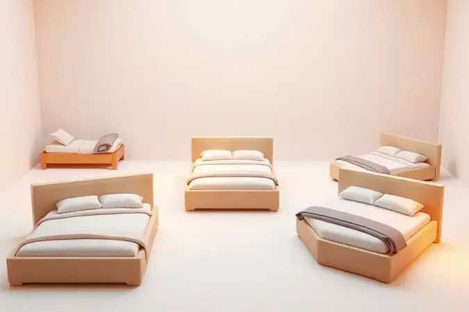
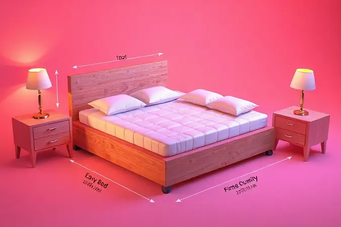
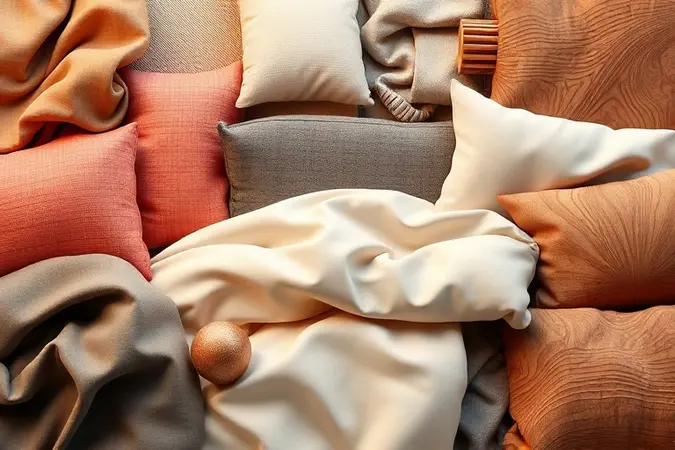

Escolher a cama box solteiro ideal vai muito além da estética; trata-se de garantir noites de sono revigorantes e otimizar o espaço do seu quarto.

Seja você um estudante em busca de praticidade, alguém que precisa de armazenamento extra com um modelo baú, ou quem costuma receber visitas e prefere uma bicama auxiliar, as opções no mercado são vastas.

Neste guia completo, analisamos as melhores alternativas disponíveis em 2025, considerando durabilidade, conforto e custo-benefício.

Prepare-se para descobrir qual modelo se adapta perfeitamente às suas necessidades e transformar seu ambiente com qualidade e funcionalidade.

<SummaryList products={frontmatter.top_products} />

## Quais as 13 Melhores Camas de Solteiro?

Ao escolher uma cama box solteiro, você deve considerar o conforto, o suporte e o design que se encaixam no seu espaço. As melhores opções de 2025 oferecem qualidade e durabilidade para garantir boas noites de sono.

### 1. Cama Solteiro Multifuncional CM8013 Tecno Mobili

<ProductBox 
  title={frontmatter.top_products[0].title} 
  image={frontmatter.top_products[0].image} 
  link={frontmatter.top_products[0].link} 
/>

Imagine transformar seu quarto inteiramente em questão de minutos. A Cama CM8013 da Tecno Mobili é mais que um móvel, ela é um sistema inteligente de espaços.

Com seu mecanismo articulado e dobrável, ela se converte em prateleiras organizadoras quando sua atenção está em outras coisas. Para quem vive o sonho de desenhar o próprio espaço, ela oferece acabamento impecável em pintura UV nas cores branco e amêndoa.

O segredo está nas medidas: 128,5 cm de largura para um colchão tradicional de 88x188 cm. E aquele alívio ao fechar a cama e encontrar tudo perfeitamente guardado? É garantido, contanto que seu colchão tenha até 18 cm de altura.

Uma tranquilidade que suporta até 120 kg e chega com vídeos e manuais que tornam a montagem um momento de descoberta.

<CaixaProsContras>

**Prós:**

- Design multifuncional que economiza espaço.

- Fácil de montar, com manual e vídeos disponíveis.

- Acabamento em pintura UV que garante durabilidade.

- Disponível em cores que se adaptam a diferentes decorações.

**Contras:**

- Suporte de peso pode não ser adequado para usuários muito pesados.

- Não acompanha colchão, sendo necessário adquiri-lo separadamente.

</CaixaProsContras>

### 2. Cama de Solteiro Módulo Santos Andirá Office New

<ProductBox 
  title={frontmatter.top_products[1].title} 
  image={frontmatter.top_products[1].image} 
  link={frontmatter.top_products[1].link} 
/>

Se seu quarto também é seu escritório, estúdio e santuário, você entende que cada centímetro precisa contar. O Módulo Office New pega essa ideia e a eleva a outro patamar.

É uma estação de trabalho completa que esconde seu refúgio noturno, com bancada de estudos, prateleiras e até uma tomada elétrica integrada.

Sair da cadeira e subir a escada metálica para encontrar seu lugar no mundo é um ritual que começa com segurança, graças à proteção lateral. E o baú embutido? Ele guarda seus segredos e suas cobertas com igual discrição.

Sim, você pode precisar de ajuda para montar essa complexidade perfeita, mas o resultado é um espaço que parece ter sido arquitetado especialmente para você.

<CaixaProsContras>

**Prós:**

- Design moderno e funcional

- Espaço otimizado com bancada e prateleiras

- Baú integrado para armazenamento

- Inclui tomada elétrica para conveniência

**Contras:**

- Montagem pode ser complexa

- Estrutura pode não ser adequada para mais de uma pessoa

</CaixaProsContras>

### 3. Cama Multifuncional CM8020 Tecno Mobili

<ProductBox 
  title={frontmatter.top_products[2].title} 
  image={frontmatter.top_products[2].image} 
  link={frontmatter.top_products[2].link} 
/>

Para apartamentos que respiram minimalismo e estudos que precisam se transformar em quartos de hóspedes às sextas-feiras, a CM8020 mostra sua magia. Uma cama articulada que, quando fechada, ocupa apenas 57,7 cm de profundidade.

Ela deixa o resto do espaço livre para sua criatividade.

Esse sistema inteligente suporta até 100 kg e pode vir acompanhado por uma gaveta e prateleira, dois companheiros silenciosos na organização. O acabamento em pintura UV responde aos seus dedos com facilidade, limpando-se quase sozinho.

Investir nela pode abrir mais seu espaço do que seu bolso, mas a recompensa é um ambiente que respira liberdade.

<CaixaProsContras>

**Prós:**

- Design moderno e prático.

- Ideal para espaços pequenos.

- Feita em MDP com boa durabilidade.

- Sistema de articulação e segurança eficiente.

**Contras:**

- O preço pode ser considerado um pouco elevado.

- Montagem pode exigir auxílio profissional para garantir adequação.

</CaixaProsContras>

### 4. Cama Cimol Multifunção Bianca II

<ProductBox 
  title={frontmatter.top_products[3].title} 
  image={frontmatter.top_products[3].image} 
  link={frontmatter.top_products[3].link} 
/>

Esta é para quem acredita que o quarto deve ser uma extensão da personalidade, não um depósito de móveis. A Bianca II reúne em um único objeto tudo o que você precisa: um santuário para dormir, uma mesa para sonhar acordado e um armário para organizar suas histórias.

Dois gavetões em rodízios deslizam silenciosamente, as prateleiras esperam seus livros preferidos, e a escada lateral com barras arredondadas transforma o simples ato de deitar em uma cerimônia de cuidado.

Seus 150 kg de suporte falam de força, mas é nas ripas do estrado que você descansa sua confiança. A montagem pode ser um processo separado, mas é o preço por um universo particular tão bem construído.

<CaixaProsContras>

**Prós:**

- Multifuncionalidade que otimiza o espaço.

- Acabamento de qualidade com pintura UV.

- Segurança com barras de proteção.

- Estrutura resistente, suportando até 150 kg.

**Contras:**

- Montagem não inclusa, podendo gerar custos adicionais.

- Pode ser considerado um móvel mais volumoso para espaços pequenos.

</CaixaProsContras>

### 5. Cama Solteiro Conquista Kiara Conquista

<ProductBox 
  title={frontmatter.top_products[4].title} 
  image={frontmatter.top_products[4].image} 
  link={frontmatter.top_products[4].link} 
/>

Seu quarto merece detalhes que conversem com sua alma. A Kiara oferece esse diálogo através de um design moderno que não grita, mas sussurra sofisticação. Com quase 2 metros de comprimento, ela acolhe seu corpo sem exigir espaço excessivo.

Mas o verdadeiro pulo do gato são as duas gavetas com corrediças metálicas. Elas deslizam tão suavemente que quase parecem adivinhar o que você precisa guardar.

Os nichos integrados são galerias para sua arte pessoal, enquanto o acabamento texturizado em Preto Fosco ou Branco cria o cenário perfeito. Sim, o colchão vem separado, mas essa é sua chance de escolher exatamente a firmeza que abraça seus sonhos.

<CaixaProsContras>

**Prós:**

- Design moderno que se adapta a diferentes estilos de decoração.

- Duas gavetas com corrediças metálicas para armazenamento eficiente.

- Estrutura robusta que suporta até 100 kg.

- Disponível em várias cores, facilitando a personalização do ambiente.

**Contras:**

- Vendida sem colchão, o que pode ser um investimento adicional.

- O espaço sob a cama pode ser limitado devido ao design.

</CaixaProsContras>

### 6. Cama Bibox de Solteiro Cimol Yumi

<ProductBox 
  title={frontmatter.top_products[5].title} 
  image={frontmatter.top_products[5].image} 
  link={frontmatter.top_products[5].link} 
/>

Quantas vezes você já pensou "queria ter um quarto extra quando minha mãe vem visitar"? A Yumi responde com uma solução elegante: uma cama auxiliar que surge quando necessário e desaparece quando não.

Esse é o poder do design inteligente em 100% MDF com acabamento ultravioleta.

Medindo pouco mais de 2 metros de profundidade, ela organiza sua vida em duas camas separadas. Os rodízios permitem que essa segunda cama deslize para fora sem esforço, como se estivesse esperando sua chance de ser útil.

A montagem pede um pouco mais de atenção, mas essa complexidade é o que garante que seu quarto ficará perfeito e funcional para todos os momentos da vida.

<CaixaProsContras>

**Prós:**

- Ótima para otimização de espaço com cama auxiliar.

- Feita em MDF de qualidade com acabamentos variados.

- Design seguro com cantos arredondados.

- Montagem acessível, embora possa precisar de assistência profissional.

**Contras:**

- O estrado pode ser considerado menos durável por alguns usuários.

- A montagem pode ser complexa para quem não tem experiência.

</CaixaProsContras>

### 7. Cama Solteiro Santos Andirá Invicta

<ProductBox 
  title={frontmatter.top_products[6].title} 
  image={frontmatter.top_products[6].image} 
  link={frontmatter.top_products[6].link} 
/>

Organização deve ser uma experiência sensorial, não uma tortura. A Invicta entende isso: seu baú na cabeceira guarda seus travesseiros como um baú de tesouros, sempre acessível mas nunca intrusivo.

As prateleiras acolhem objetos com um propósito, e a tomada elétrica de 20 amperes está ali para carregar não apenas seus dispositivos, mas também sua energia.

Construída em MDP e MDF, ela é aquela amiga sólida que nunca falha, suportando até 80kg de confiança. A montagem é um ritual de apropriação do espaço, um momento onde você constrói literalmente seu refúgio.

O colchão você escolhe separadamente, porque o convite aqui é para personalizar cada aspecto do seu descanso.

<CaixaProsContras>

**Prós:**

- Design funcional com baú e prateleiras.

- Estrutura resistente em MDP e MDF.

- Suporte para até 80kg, ideal para diversas necessidades.

- Disponível em diferentes cores, permitindo personalização.

**Contras:**

- O colchão não está incluso.

- Requer montagem, o que pode ser um desafio para alguns.

</CaixaProsContras>

### 8. Cama Solteiro Bianca II Cimol

<ProductBox 
  title={frontmatter.top_products[7].title} 
  image={frontmatter.top_products[7].image} 
  link={frontmatter.top_products[7].link} 
/>

Às vezes, a beleza está nos movimentos sutis. A Bianca II da Cimol é a prova disso: uma cama que em sua versão retrátil permite que a escrivaninha apareça apenas quando necessário, como um assistente discreto.

Feita em MDF com acabamento UV semi-brilho, ela brilha sem ofuscar.

Com medidas entre 88x188 cm, ela cabe naquele cantinho que você sempre achou impossível de aproveitar. E quando você senta na borda, sente a firmeza de 150 kg de suporte respondendo ao seu peso.

A garantia de 3 meses pode parecer breve, mas a estrutura de compensado laminado protege tanto seu sono quanto você espera de uma companheira de longo prazo.

<CaixaProsContras>

**Prós:**

- Design atraente e funcional.

- Estrutura resistente em MDF.

- Escrivaninha retrátil disponível.

- Proteção lateral arredondada.

**Contras:**

- Garantia de apenas 3 meses.

- Montagem não inclusa na entrega.

</CaixaProsContras>

### 9. Cama de Solteiro Lopas Reali Branco

<ProductBox 
  title={frontmatter.top_products[8].title} 
  image={frontmatter.top_products[8].image} 
  link={frontmatter.top_products[8].link} 
/>

Elegância não precisa falar alto. A Reali Branco da Lopas sussurra classe através de linhas suaves e um branco que parece capturar a luz do amanhecer. Painéis de MDP e MDF constroem essa solidez discreta, com acabamento em pintura UV microtextura que desafia o tempo.

Para colchões de solteiro clássicos, ela oferece medidas perfeitas e uma estrutura que inclui detalhes invisíveis como dispositivos antirruído. São pequenos engenheiros silenciosos trabalhando para que você nunca ouça um rangido enquanto vira na cama.

A barra lateral de 25mm e os pés de 62mm são fundamentos invisíveis que suportam até 90 kg de sonhos tranquilos. Limitada ao branco? Talvez, mas é uma limitação que se transforma em pureza estética.

<CaixaProsContras>

**Prós:**

- Design moderno e elegante.

- Estrutura robusta com boa capacidade de suporte.

- Acabamento em pintura UV que garante durabilidade.

- Dispositivos antirruído para maior conforto durante o sono.

**Contras:**

- Disponível apenas na cor branca.

- Não acompanha colchão, o que pode ser um investimento adicional.

</CaixaProsContras>

### 10. Cama Novo Horizonte Solteiro Verona/Rivera

<ProductBox 
  title={frontmatter.top_products[9].title} 
  image={frontmatter.top_products[9].image} 
  link={frontmatter.top_products[9].link} 
/>

Uma cabeceira ripada não é apenas um detalhe visual. É um convite para apoiar suas costas enquanto lê, um testemunho da artesania que transforma madeira em conforto.

A Verona/Rivera da Novo Horizonte entende essa linguagem, apresentando-se em MDF/MDP com pintura UV que promete anos de beleza intacta.

Com 113 cm de altura, ela domina o espaço com dignidade, não arrogância. Sua versatilidade é secreta: aceita colchões de 0,78 m ou 0,88 m, permitindo que você mude de ideia sem mudar de cama.

O sistema antirruído é um acordo silencioso entre você e a estrutura para que nada perturbe seu descanso. A montagem pode pedir mãos experientes, mas o resultado é uma cama que parece ter sido projetada por quem realmente entende de repouso.

<CaixaProsContras>

**Prós:**

- Design moderno e sofisticado.

- Boa durabilidade devido ao acabamento em pintura UV.

- Suporta colchões de diferentes dimensões.

- Estrutura robusta com sistema antirruído.

**Contras:**

- Montagem pode ser complexa para iniciantes.

- Embora tenha um ótimo acabamento, o preço pode ser superior a modelos mais simples.

</CaixaProsContras>

### 11. Cama Box baú solteiro corino preto

<ProductBox 
  title={frontmatter.top_products[10].title} 
  image={frontmatter.top_products[10].image} 
  link={frontmatter.top_products[10].link} 
/>

O corino preto não é apenas uma cor, é uma declaração. É o material que responde aos seus dedos sem marcas, que mantém sua elegência mesmo depois de anos de uso. Esta cama box baú entende que otimização de espaço precisa de estilo para ser realmente eficaz.

Nas medidas padrão 88x188 cm, ela esconde um baú interno que transforma espaço vazio em utilidade pura. Roupas de cama, memórias guardadas, tudo encontra seu lugar nesse compartimento secreto.

O mecanismo de abertura foi pensado para não exigir força desnecessária, apenas uma leve pressão para revelar o tesouro.

A madeira de reflorestamento na estrutura fala de responsabilidade, enquanto a ausência do colchão oferece a liberdade de escolher exatamente o apoio que seu corpo merece.

<CaixaProsContras>

**Prós:**

- Ótima opção para economizar espaço no quarto.

- Praticidade no armazenamento de objetos.

- Estética moderna e fácil de limpar.

- Estrutura resistente e durável.

**Contras:**

- Vem sem colchão, o que pode aumentar o custo total.

- Requer algum esforço na abertura do baú se não tiver o mecanismo adequado.

</CaixaProsContras>

### 12. Cama Box Baú Solteiro c/ Colchão Espuma D33 - Ortobom

<ProductBox 
  title={frontmatter.top_products[11].title} 
  image={frontmatter.top_products[11].image} 
  link={frontmatter.top_products[11].link} 
/>

Aqui está uma proposta completa: conforto e organização entregues na mesma caixa.

A Ortobom apresenta esta opção com colchão de espuma D33, uma densidade que conversa diretamente com seus pontos de pressão, oferecendo suporte especialmente pensado para quem pesa até 100kg.

O baú embutido não é um extra, é parte fundamental do conceito. Ele permite que você organize seu quarto mantendo o visual limpo, sem precisar de armários extras.

Os tratamentos antialérgicos e antiácaros são promessas silenciosas de um ambiente mais saudável, enquanto as variações de modelo mostram que há opções para diferentes necessidades e espaços.

É a solução para quem não quer pensar em múltiplas compras, apenas em descansar melhor.

<CaixaProsContras>

**Prós:**

- Ótimo suporte devido à densidade D33 do colchão.

- Baú embutido que oferece armazenamento extra.

- Tratamentos antialérgicos e antiácaros para um sono mais saudável.

- Variações de modelo que atendem diferentes necessidades.

**Contras:**

- Pode não ser ideal para usuários acima de 100kg.

- Alguns modelos podem ter opções limitadas em relação ao tamanho.

</CaixaProsContras>

### 13. Cama Bibox Solteiro com Baú e Auxiliar Gabi

<ProductBox 
  title={frontmatter.top_products[12].title} 
  image={frontmatter.top_products[12].image} 
  link={frontmatter.top_products[12].link} 
/>

Versatilidade tem nome e se chama Gabi. Esta estrutura ortopédica suporta até 80 kg por pessoa não apenas com força, mas com inteligência.

O baú integrado é o arquivista silencioso do seu quarto, enquanto a cama auxiliar é o convidado permanente que só aparece quando necessário.

Feita de madeira de eucalipto com revestimento em tecido poliéster, ela mistura robustez com sofisticação tátil. Suas dimensões compactas são um abraço para espaços menores, transformando limitações em oportunidades criativas.

O investimento pode parecer um passo a mais, mas é o preço por ter um quarto que se adapta às suas mudanças de humor, visitas inesperadas e necessidades que só aparecem com o tempo.

<CaixaProsContras>

**Prós:**

- Estrutura ortopédica que garante conforto.

- Baú integrado para armazenamento.

- Inclui cama auxiliar para visitas.

- Material de alta resistência e acabamento sofisticado.

**Contras:**

- Preço pode ser um pouco elevado.

- Dimensões compactas podem não agradar quem prefere camas maiores.

</CaixaProsContras>

## Tipos de Camas Box de Solteiro

Depois de conhecer os modelos específicos, que tal entender as categorias por trás deles? Conhecer os tipos disponíveis ajuda você a navegar melhor pelo mercado e identificar exatamente o que procura.

### Cama box baú solteiro

Esta é a solução discreta que todo espaço pequeno merece. Imagine guardar suas temporadas inteiras de roupa de cama, travesseiros extras e até memórias que você não quer expor, tudo sob o colchão onde você descansa.

A base firme oferece suporte sólido para qualquer densidade de colchão, transformando o que seria apenas espaço morto em um organizador pessoal. Para quartos que precisam respirar mas também guardar segredos, esta é a escolha inteligente.

### Camas box solteiro com cama auxiliar

E se seu quarto pudesse se multiplicar quando necessário? Essa é a magia das camas com auxiliar. Elas abrigam um segundo colchão dentro de si, pronto para surgir quando amigos aparecem ou quando crianças decidem fazer uma festa do pijama.

Os mecanismos modernos fazem essa transição parecer mágica, e o design integrado garante que sua decoração permaneça intacta. É como ter um quarto de hóspedes que você pode guardar no armário.

## Como escolher cama box solteiro?

Com tantas opções, como encontrar a que realmente conversa com seu estilo de vida? A resposta começa no espaço físico disponível. Meça seu quarto não apenas nas paredes, mas também nas entradas, janelas e pontos de energia.

Depois, pense no colchão como uma extensão do seu corpo, e na estrutura da cama como a fundação desse relacionamento.

Um móvel robusto não apenas dura mais, mas transmite segurança a cada vez que você se deita. A estética deve ser o último critério, mas não o menos importante, porque você merece um ambiente que alegra seus olhos ao acordar.

Armazenamento embaixo da cama, quando bem executado, pode ser a diferença entre um quarto organizado e um espaço caótico.

## Como escolher o colchão para cama box solteiro?

Se a cama é a casa, o colchão é a cama dentro dela. Sua firmeza preferida é um dial pessoal que deve responder às suas curvas e pontos de pressão.

Espumas oferecem abraços personalizados, molas garantem respiração e suporte, látex combina durabilidade com conforto térmico. A altura do colchão afeta não apenas sua experiência de deitar, mas também a estética geral da cama.

E se você tem alergias ou preocupa-se com sua coluna, essas necessidades se transformam em guias essenciais. O colchão certo não é apenas uma escolha, é um investimento em como você passa um terço da sua vida.

## Qual o tamanho da cama box solteiro?

O padrão de 0,88x1,88 metros é um acordo coletivo sobre espaço pessoal. É suficiente para esticar-se completamente, virar-se sem medo de cair, e ainda ter um livro ao lado.

Para quem anseia por mais liberdade de movimento, opções de 0,96 metros de largura oferecem essa generosidade extra.

A altura total da cama, combinando base e colchão, determina não apenas a ergonomia ao sentar e levantar, mas também o impacto visual no seu quarto. Mais baixa para um visual contemporâneo, mais alta para uma presença majestosa.

## Quanto custa uma cama box solteiro?

O investimento varia como cores em um arco-íris. Modelos econômicos oferecem funcionalidade básica com qualidade surpreendente, enquanto opções premium adicionam detalhes, materiais e tecnologias que transformam o ato de dormir em uma experiência.

A qualidade do colchão nunca deve ser comprometida, pois ele é o parceiro noturno que realmente afeta seu bem-estar.

Pesquisar, comparar e equilibrar orçamento com benefícios é a arte de encontrar não apenas uma cama, mas uma solução que faz sentido para sua vida hoje, amanhã e pelos próximos anos.

## Onde comprar cama box de solteiro?

As opções são tão variadas quanto as camas. Lojas especializadas como Magazine Luiza, Tok&Stok e Etna oferecem experiência e assistência física. Grandes varejistas como Americanas e Carrefour trazem acessibilidade e conveniência.

No universo digital, Amazon e Mercado Livre permitem comparações detalhadas e acesso à sabedoria coletiva de outros compradores.

Independentemente do caminho, considere a entrega não como um detalhe, mas como a primeira interação com seu novo móvel. Montagem profissional pode transformar uma experiência estressante em um momento de antecipação prazerosa.

## Tipos de Pistão: Gás vs. Mola Tradicional

O gesto de abrir seu compartimento de armazenamento não precisa ser um esforço. Pistões a gás transformam essa ação em um movimento suave e controlado, quase mágico, graças ao amortecimento inteligente.

São perfeitos para quem valoriza praticidade e fluidez no dia a dia.

Molas tradicionais oferecem uma experiência mais rústica e direta, com uma resistência que comunica robustez. Elas exigem um pouco mais de força, mas transmitem uma sensação de solidez que pode ser reconfortante.

A escolha não é apenas técnica, é sobre como você quer interagir com seu móvel todos os dias.

## Materiais e Acabamentos: Durabilidade e Estilo

Madeira traz calor e história, metal oferece modernidade e linhas limpas. Estofados em tecido ou couro sintético convidam ao toque, mas pedem atenção à manutenção.

O verdadeiro herói aqui é o acabamento, seja verniz ou pintura, que protege não apenas a superfície, mas sua tranquilidade ao longo dos anos.

Essa combinação de fatores não cria apenas um móvel, mas um objeto que envelhece com dignidade ao seu lado, mantendo sua função e sua beleza mesmo depois de milhares de sonhos.

## O que é uma Cama Box com Auxiliar: Entendendo a Funcionalidade

Essa é a transformação prática em forma de móvel. Uma cama box tradicional que guarda em seu interior uma segunda cama, geralmente através de sistemas de puxar ou dobrar.

Quando você precisa acomodar um parente, um amigo ou simplesmente criar espaço extra para projetos, essa estrutura revela suas múltiplas personalidades.

O design discreto significa que a cama auxiliar permanece invisível até o momento exato em que você precisa dela. Integra-se perfeitamente à decoração, mantendo a estética do seu quarto intacta enquanto oferece flexibilidade que quartos tradicionais só poderiam invejar.

## Perguntas Frequentes

Algumas dúvidas persistem naturalmente enquanto você pensa em investir em uma cama box solteiro.

O tamanho ideal geralmente é o padrão de 88x188 cm, mas sempre verifique as especificações do fabricante, porque pequenas variações podem fazer grande diferença no seu espaço.

O conforto do colchão é uma ciência pessoal, onde espuma ou molas devem responder às suas preferências específicas. E quanto à durabilidade?

Com os cuidados adequados, uma boa cama box pode acompanhar seus sonhos por 8 a 10 anos, tornando-se não apenas um móvel, mas parte da sua história pessoal.

## Conclusão

Escolher uma cama box solteiro é uma decisão que ecoa em todas as suas manhãs e todas as suas noites. Não se trata apenas de mobiliar um quarto, mas de criar um santuário pessoal onde seu corpo se recupera e sua mente encontra paz.

Cada modelo que exploramos oferece uma conversa diferente entre espaço, funcionalidade e estética, mas todos compartilham um propósito comum: transformar seu descanso em uma experiência verdadeiramente renovadora.

Desde as soluções multifuncionais que dobram-se à sua imaginação até as estruturas robustas que prometem anos de apoio silencioso, você agora tem o conhecimento para identificar qual cama não apenas cabe no seu espaço, mas também na sua vida.

Lembre-se que o colchão ideal, os materiais duráveis e os acabamentos cuidadosos não são detalhes, são investimentos na qualidade dos seus dias.

Agora é sua vez de transformar esse conhecimento em ação. Visite as lojas, sinta os materiais, imagine essas camas no seu espaço. Sua próxima noite de sono perfeita está esperando por você para tomar a decisão certa.

Qual será a cama que vai abraçar seus sonhos pelos próximos anos?