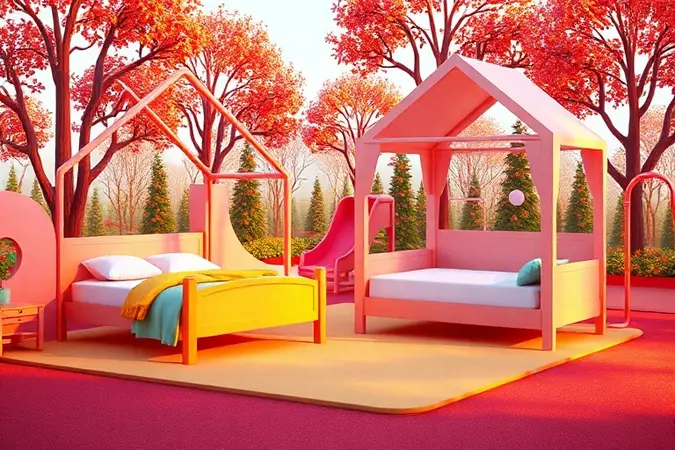
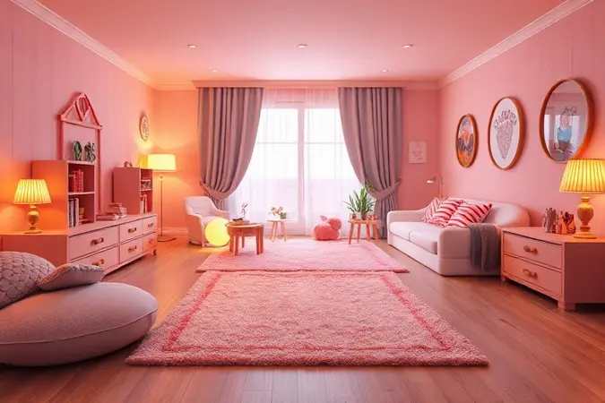

A transição do berço para a primeira cama é um marco emocionante e desafiador no desenvolvimento dos pequenos.

Escolher a melhor cama infantil envolve equilibrar segurança, conforto e autonomia, garantindo que a criança se sinta protegida enquanto explora seu novo espaço.

Neste artigo, analisamos as opções mais bem avaliadas do mercado, desde modelos montessorianos que estimulam a independência até beliches divertidos com escorregador.

Além do ranking detalhado, preparamos um guia completo sobre materiais, medidas e o momento ideal para a troca, ajudando você a tomar a melhor decisão para o sono do seu filho.

<SummaryList products={frontmatter.top_products} />

## As 10 melhores camas infantis para comprar em 2025

Imagine transformar o quarto do seu filho em um espaço onde a imaginação voa livre e o sono chega com segurança. Em 2025, o mercado oferece opções criativas que equilibram funcionalidade e diversão, cada uma com sua personalidade única.

### 1. Mini Cama Montessoriana Uli

<ProductBox 
  title={frontmatter.top_products[0].title} 
  image={frontmatter.top_products[0].image} 
  link={frontmatter.top_products[0].link} 
/>

Quando seu pequeno começa a escalar as grades do berço, é sinal que chegou a hora de um espaço mais independente. A Mini Cama Montessoriana Uli, da Peroba Móveis, acolhe essa transição com uma estrutura baixa que convida: 'Você pode chegar até aqui sozinho'.

A altura perfeita permite que a criança suba e desça sem ajuda, construindo autoconfiança a cada movimentação.

Feita em 100% MDF com pintura atóxica, você respira alívio sabendo que os materiais são seguros para exploradores curiosos. Disponível em Branco Brilho, Carvalho e outras cores, ela se adapta ao tom do quarto.

A montagem exige algum trabalho manual, mas pense nisso como o primeiro projeto que você constrói para o novo capítulo do seu filho.

<CaixaProsContras>

**Prós:**

- Estimula a autonomia das crianças.

- Feita com materiais seguros e atóxicos.

- Design seguro com bordas arredondadas.

- Disponível em várias cores atraentes.

**Contras:**

- A montagem pode ser desafiadora para iniciantes.

- Compatível apenas com colchões específicos.

</CaixaProsContras>

### 2. Cama Montessoriana Infantil Multimóveis

<ProductBox 
  title={frontmatter.top_products[1].title} 
  image={frontmatter.top_products[1].image} 
  link={frontmatter.top_products[1].link} 
/>

Se o método Montessori ressoa com sua filosofia de criação, esta cama é a tradução física desses princípios.

A estrutura baixa não é apenas um detalhe de design, é um convite à liberdade segura, onde seu filho aprende que pode alcançar o que deseja com seus próprios recursos.

Construída em 100% MDF com acabamento UV, ela resiste às inevitáveis marcas do cotidiano infantil, mantendo-se bonita mesmo depois de muitas aventuras. Suporta até 50kg, crescendo junto com a criança.

Algumas versões incluem barras de proteção, então confirme essa característica se seu pequeno ainda precisa desse abraço extra de segurança.

<CaixaProsContras>

**Prós:**

- Design baixo que promove a autonomia da criança.

- Confeccionada em material durável (100% MDF).

- Boa capacidade de suporte (até 50kg).

- Variações disponíveis para atender a diferentes estilos.

**Contras:**

- Pode não ter barras de proteção em todos os modelos.

- A altura pode ser um desafio para crianças mais altas.

</CaixaProsContras>

### 3. Beliche com Escorregador Valentina

<ProductBox 
  title={frontmatter.top_products[2].title} 
  image={frontmatter.top_products[2].image} 
  link={frontmatter.top_products[2].link} 
/>

Quartos infantis precisam ser mais que lugares para dormir, precisam ser parques de diversões. Esta beliche com escorregador transforma a hora de deitar em uma aventura, onde descer da cama é literalmente descer pelo escorregador para começar o dia.

Fabricada em MDF com pés em madeira maciça, ela oferece resistência para saltos e brincadeiras. Medindo cerca de 100cm de altura, 76,5cm de largura e 160cm de profundidade, cabe em espaços compactos sem abrir mão da magia.

O escorregador de 132cm é o coração da diversão, lembrando que infância também se faz de descidas alegres.

<CaixaProsContras>

**Prós:**

- Design divertido com escorregador.

- Material resistente e durável.

- Tamanho compacto ideal para quartos pequenos.

- Disponíveis em cores neutras que combinam com a decoração.

**Contras:**

- O colchão não vem incluso.

- Limitação de peso pode não atender crianças mais velhas.

</CaixaProsContras>

### 4. Cama Elevada Completa Móveis

<ProductBox 
  title={frontmatter.top_products[3].title} 
  image={frontmatter.top_products[3].image} 
  link={frontmatter.top_products[3].link} 
/>

Quando cada centímetro do quarto precisa render, a cama elevada é a solução que multiplica possibilidades.

Ela cria um mundo em dois andares: no superior, o reino do sono; embaixo, um espaço que pode ser escritório, casinha, fortaleza ou apenas o refúgio secreto dos brinquedos.

Algumas versões vêm com escorregadores que convertem o momento de levantar em brincadeira. Outras incluem armários que ensinam organização através da diversão. A única exigência? Um teto de pelo menos 2,70 metros para que o ambiente respire conforto.

<CaixaProsContras>

**Prós:**

- Maximiza o espaço disponível no quarto.

- Oferece áreas adicionais de uso, como escrivaninhas ou espaços de brincadeira.

- Muitos modelos vêm com elementos divertidos como escorregadores.

- Disponíveis em diversos estilos e designs.

**Contras:**

- Altura mínima do ambiente necessária pode ser um limitador.

- O colchão geralmente não está incluído na compra.

</CaixaProsContras>

### 5. Cama Infantil Elza Cimol

<ProductBox 
  title={frontmatter.top_products[4].title} 
  image={frontmatter.top_products[4].image} 
  link={frontmatter.top_products[4].link} 
/>

Receber visitinhas de amigos ou primos ganha um novo significado com esta cama bibox da Cimol. Ela guarda uma surpresa: uma cama auxiliar que aparece quando a companhia chega, transformando noites de pijama em memórias que duram a vida inteira.

Fabricada em 100% MDF, sua estrutura resiste às animadas reuniões infantis. Os detalhes em baixo relevo na cabeceira e peseira, com a proteção em formato de nuvem, falam a linguagem dos sonhos.

Com dimensões de 197cm de comprimento, 97,6cm de largura e 90cm de altura, ela abraça até 110kg em cada leito.

<CaixaProsContras>

**Prós:**

- Design atrativo e lúdico.

- Estrutura robusta em MDF.

- Funcionalidade com cama auxiliar integrada.

- Ideal para quartos pequenos.

**Contras:**

- Não possui espaço de armazenamento extra.

- Cores limitadas disponíveis.

</CaixaProsContras>

### 6. Mini Cama Carro Super Turbo

<ProductBox 
  title={frontmatter.top_products[5].title} 
  image={frontmatter.top_products[5].image} 
  link={frontmatter.top_products[5].link} 
/>

Para a criança que adormece sonhando com velocidades e corridas, esta cama transforma o quarto em pista.

Não é apenas um móvel, é um carro de corrida onde o piloto dorme entre uma aventura e outra, cercado por laterais de proteção que são como os assentos esportivos desse veículo dos sonhos.

Em MDF com acabamento resistente, ela desafia o tempo e as brincadeiras intensas. A altura calculada permite acesso fácil, promovendo aquela independência que todo pequeno motorista almeja.

O colchão você escolhe à parte, como quem seleciona o volante perfeito para seu carro dos sonhos.

<CaixaProsContras>

**Prós:**

- Design atrativo que encanta as crianças.

- Segurança aprimorada com laterais de proteção.

- Altura baixa para fácil acesso.

- Material durável e resistente.

**Contras:**

- O colchão não está incluído na compra.

- Tamanhos podem variar, exigindo checagem antes da compra.

</CaixaProsContras>

### 7. Cama Infantil Casinha Gelius

<ProductBox 
  title={frontmatter.top_products[6].title} 
  image={frontmatter.top_products[6].image} 
  link={frontmatter.top_products[6].link} 
/>

Há casas e há casinhas. Esta cama da Gelius é daquelas que abrigam não apenas corpos cansados, mas também histórias imaginadas. O formato de casinha cria um lar dentro do lar, onde seu filho é arquiteto, morador e contador de histórias do seu próprio universo.

Fabricada em MDF e MDP com pintura UV e bordas soft, ela protege tanto fisicamente quanto emocionalmente. Suporta até 110kg, testemunhando anos de crescimento. As divisórias úteis organizam brinquedos, ensinando que toda casa precisa de sua arrumação.

<CaixaProsContras>

**Prós:**

- Design lúdico que estimula a criatividade.

- Estrutura durável e resistente.

- Segurança com bordas soft e suporte de até 110 kg.

- Divisórias úteis para brinquedos e objetos.

**Contras:**

- Colchão não incluso na compra.

- Montagem geralmente não acompanhada.

</CaixaProsContras>

### 8. Bicama Para Quarto Infantil De Madeira Woodstore

<ProductBox 
  title={frontmatter.top_products[7].title} 
  image={frontmatter.top_products[7].image} 
  link={frontmatter.top_products[7].link} 
/>

Irmãos dividem mais que quartos, dividem memórias. Esta bicama da Woodstore cria o palco perfeito para essas histórias compartilhadas, com estrutura em madeira maciça de pinus e MDF que suporta até 120kg por cama, crescendo junto com a amizade fraternal.

Com espaço para dois colchões de solteiro (188x88cm), ela soluciona a equação espacial de quartos menores. O design moderno, disponível em branco e branco com tabaco, fala uma linguagem contemporânea que as crianças entendem.

A pintura em PU e UV garante que a beleza resista aos anos.

<CaixaProsContras>

**Prós:**

- Fabricada em madeira maciça e MDF, garantindo durabilidade.

- Suporta até 120 kg por cama.

- Design moderno disponível em várias cores.

- Ótima para otimização de espaço em quartos infantis.

**Contras:**

- Montagem necessária, o que pode ser um desafio.

- Garantia do fabricante é limitada a 3 meses por defeito de fabricação.

</CaixaProsContras>

### 9. Cama Infantil Casinha Atenas Wood Store

<ProductBox 
  title={frontmatter.top_products[8].title} 
  image={frontmatter.top_products[8].image} 
  link={frontmatter.top_products[8].link} 
/>

Há casas com janelas para o mundo real e casinhas com janelas para o mundo imaginário. Esta cama da Wood Store pertence à segunda categoria, com um design que lembra uma casa de conto de fadas onde os sonhos moram antes de serem sonhados.

Feita de madeira maciça ou MDF de qualidade, ela oferece a solidez que toda casa precisa. Muitas versões incluem grades de proteção e até cama auxiliar, perfeita para receber amigos imaginários ou reais.

O modelo montessoriano, mais baixo, ensina que toda jornada começa com um passo seguro.

<CaixaProsContras>

**Prós:**

- Design lúdico que estimula a imaginação.

- Estrutura segura, com opções de grades de proteção.

- Facilita a autonomia das crianças.

- Disponível em várias cores e estilos.

**Contras:**

- Pode não se encaixar em decorações mais sóbrias.

- Algumas versões podem ter montagem um pouco complexa.

</CaixaProsContras>

### 10. Cama Alta Infantil com Guarda-roupa Mezzo

<ProductBox 
  title={frontmatter.top_products[9].title} 
  image={frontmatter.top_products[9].image} 
  link={frontmatter.top_products[9].link} 
/>

Em apartamentos onde metros são tesouros, esta cama da Mezzo é o mapa do tesouro. Ela condensa três mundos em um: o reino do sono (cama), o universo da organização (guarda-roupa) e o território do conhecimento (escrivaninha).

Com suporte para até 80kg, ela oferece segurança para descobertas e brincadeiras. O guarda-roupa de duas portas, cinco nichos e cabideiro ensina organização desde cedo.

A escada lateral não é apenas acesso, é uma metáfora: cada degrau conquistado é um passo rumo à independência.

<CaixaProsContras>

**Prós:**

- Integra cama, guarda-roupa e escrivaninha em um só móvel.

- Design moderno e compacto, ideal para quartos pequenos.

- Boa capacidade de armazenamento com nichos e cabideiro.

- Suporta até 80 kg, garantindo segurança.

**Contras:**

- Montagem pode ser complexa para alguns usuários.

- Não inclui colchão nem cama auxiliar.

</CaixaProsContras>

Conhecer as opções é o primeiro passo. Agora vamos entender como escolher a que conversa com seu espaço, seu estilo de criação e, principalmente, com a personalidade única do seu filho.

## Como escolher uma cama infantil?

Escolher uma cama infantil é como escolher um companheiro para os próximos anos do desenvolvimento do seu filho. Vai além de medidas e materiais, envolve entender como esse móvel vai participar das histórias que ainda serão vividas.

### Camas infantis em madeiras de mdf

O MDF conversa com pais que buscam equilíbrio entre durabilidade, design e orçamento. Sua resistência abraça brincadeiras intensas, enquanto sua versatilidade permite acabamentos que conversam com a personalidade do quarto.

Mais leve que madeira maciça, facilita aqueles rearranjos inevitáveis quando a criatividade infantil decide mudar o cenário da brincadeira.

### Camas em madeira maciça

Há uma poesia na madeira maciça que fala de tradição e permanência. Cada veio conta uma história, cada nó guarda uma memória da árvore que um dia foi. Essa solidez é testemunha do crescimento, suportando não apenas peso, mas também anos de descobertas.

Requer cuidados especiais, sim, mas isso faz parte do ritual de cuidar de algo que cuidará do seu filho.

### Medidas

Antes de escolher a cama, converse com o quarto. Meça não apenas o espaço que o móvel ocupará, mas também o caminho que as pequenas pernas farão ao redor dele.

A altura ideal é aquela que permite subir e descer com a dignidade de quem conquista seu próprio espaço, sem precisar de resgates noturnos. E o colchão? Deve ser o abraço perfeito dentro do abraço da cama.

### Limite de peso

O limite de peso é a promessa que a cama faz ao futuro. Não é sobre números frios, mas sobre garantir que o móvel acompanhe saltos, brincadeiras e o crescimento natural.

É a garantia de que, mesmo quando seu filho convidar três amigos para pular na cama durante uma festa do pijama, a estrutura continuará firme, testemunhando alegrias.

### Proteções laterais

As proteções laterais são como as mãos que seguram seu filho durante os primeiros voos noturnos. Evitam quedas, sim, mas também oferecem aquele conforto psicológico de estar cercado por cuidados.

Ajustáveis ou removíveis, elas acompanham o ritmo da conquista da independência, saindo de cena quando não forem mais necessárias.

## Quando trocar o berço por uma Cama Infantil?

Seu filho dá os sinais. Talvez já esteja tentando escalar as grades como um pequeno alpinista, ou talvez o berço pareça cada vez mais apertado para suas pernas alongadas.

Por volta dos 2 a 3 anos, essa transição costuma bater à porta, mas cada criança tem seu calendário único. Outro sinal? Quando ele começa a usar a cama não apenas para dormir, mas como palco para leituras, brincadeiras e conversas com bichinhos de pelúcia.

Aí você sabe: é hora de um espaço que abrace todas essas atividades.

## Tipos de cama infantil (e quando escolher cada uma)

Cada família escreve sua história de um jeito. Felizmente, há camas para cada capítulo.

### Cama infantil padrão

A cama padrão é como aquele amigo confiável que nunca decepciona. Design simples, funcionalidade garantida, estrutura durável em madeira ou MDF.

É para quem prefere a clareza da simplicidade, para crianças que já deixaram o berço mas ainda não pediram castelos ou carros de corrida. Ela cumpre sua missão com discrição e eficiência.

### Cama montessoriana

Mais que um móvel, uma filosofia. A cama montessoriana fala baixinho: 'Você é capaz'. Sua estrutura acessível ensina autonomia desde o primeiro contato, permitindo que a criança explore seu espaço com segurança.

Em madeira natural ou MDF, tem um minimalismo que deixa espaço para a imaginação voar sem obstáculos visuais.

### Cama com grades laterais

Para crianças que viajam durante o sono, rodopiando em sonhos intensos, as grades laterais são o cinto de segurança noturno. Oferecem a proteção extra que permite aos pais descansarem sabendo que os movimentos involuntários não se transformarão em sustos.

Vêm em designs que transformam essa funcionalidade em parte da diversão do quarto.

## Como montar um quarto infantil funcional e seguro

Montar um quarto infantil é projetar o mundo onde seu filho vai descobrir quem é. Alguns princípios garantem que esse mundo seja seguro e inspirador.

### Circulação livre

Crianças não se movem em linha reta, dançam. A circulação livre permite essa coreografia espontânea, com espaço para rodopios, corridinhas e caminhadas de dinossauro. A cama não deve ser uma ilha isolada, mas parte de um arquipélago onde todas as áreas se conectam.

### Altura dos móveis

A altura ideal é aquela que respeita a escala infantil. Móveis muito altos criam barreiras, muito baixos dificultam o acesso.

A cama perfeita fica na medida dourada: alta o suficiente para dar importância ao ato de deitar, baixa o suficiente para ser conquistada com orgulho.

### Móveis fixos

Móveis fixos são como raízes no quarto: dão estabilidade, segurança e sensação de permanência. Camas embutidas, beliches e armários planejados transformam o ambiente em um organismo coeso, onde cada parte conversa com as outras.

Economizam espaço e criam uma estética integrada.

### Iluminação suave

A luz no quarto infantil deve ser como um abraço: acolhedora, suave, protetora. Abajures, luzes com dimmers ou fitas de LED criam transições mágicas entre vigília e sono. Cores quentes acalmam, preparando o terreno para sonhos tranquilos.

### Espaço para brincadeiras

Brincar é trabalho sério na infância. A cama pode ser parte dessa missão, com espaços embaixo que viram cavernas, esconderijos ou galerias de arte para brinquedos.

Quando o móvel estimula a imaginação, ele deixa de ser apenas mobília para se tornar parceiro de aventuras.

## Conclusão

Escolher a cama do seu filho é escolher o cenário onde milhares de noites serão dormidas, centenas de histórias serão contadas, dezenas de segredos serão compartilhados com bichinhos de pelúcia.

Não é sobre madeira, medidas ou modelos, mas sobre criar um porto seguro onde a infância pode desabrochar com segurança e alegria.

Cada cama neste ranking carrega uma personalidade diferente: algumas falam de autonomia, outras de fantasia, algumas otimizam espaço, outras multiplicam funções.

O segerto está em ouvir qual delas conversa com a realidade do seu espaço, com seu estilo de criação e, principalmente, com os sonhos do seu filho.

Lembre-se: a melhor cama infantil não é necessariamente a mais cara ou a mais tecnológica. É aquela que seu filho abraça com entusiasmo ao anoitecer e da qual se afasta com confiança ao amanhecer.

É o lugar onde ele aprende que pode explorar o mundo, sabendo que sempre terá um refúgio aconchegante para retornar. Essa segurança emocional é o verdadeiro presente que uma boa cama oferece, muito além de qualquer característica técnica.