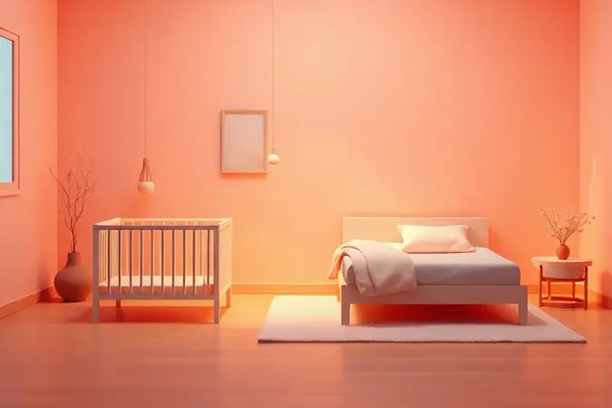
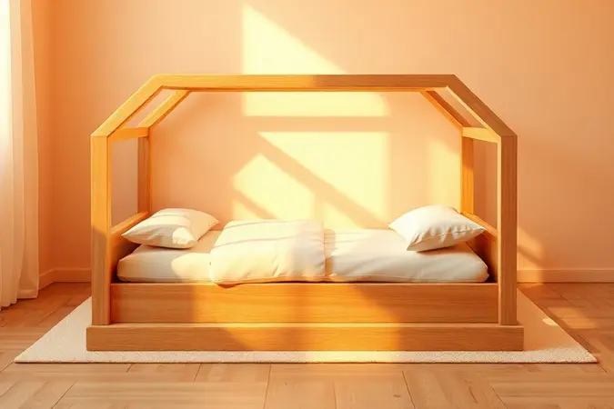
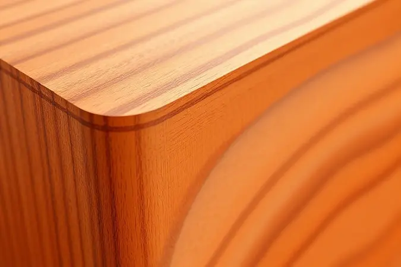
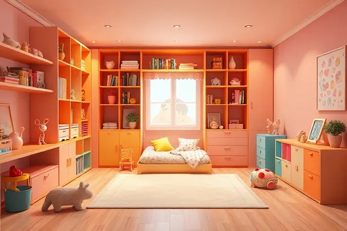

Escolher a melhor cama infantil é como preparar o palco para os primeiros passos rumo à independência do seu filho.

Essa transição do aconchego do berço para a primeira cama não envolve apenas estética, mas uma verdadeira preparação para conquistas diárias, segurança que permite sonhar sem medo e conforto que se transforma em memórias afetivas.

Com tantas opções no mercado, desde os modelos montessorianos que sussurram 'você consegue' até as camas com grades de proteção que dizem 'eu te protejo', é compreensível que pais sintam o coração dividido na hora da escolha.

Este guia apresenta um ranking atualizado com as 13 melhores opções de 2025 e todas as dicas que vão transformar sua busca em uma decisão confiante, garantindo noites tranquilas e um quarto que cresce junto com seu pequeno.

<SummaryList products={frontmatter.top_products} />

## As 13 Melhores Camas Infantis para o seu Filho

Cada cama nesta lista conta uma história diferente. Algumas falam de aventuras em forma de casinha, outras prometem segurança sem abrir mão do design, e todas têm algo especial para oferecer ao desenvolvimento do seu filho.

Este ranking não é apenas sobre medidas e materiais, mas sobre encontrar o lar perfeito para os sonhos infantis.

### 1. MULTIMÓVEIS Cama Infantil Montessoriana 2379.156

<ProductBox 
  title={frontmatter.top_products[0].title} 
  image={frontmatter.top_products[0].image} 
  link={frontmatter.top_products[0].link} 
/>

Imagine uma cama que cresce junto com a autoconfiança do seu filho. A Montessoriana da Multimóveis oferece exatamente isso, com uma estrutura 100% em MDF e acabamento em pintura UV acetinada atóxica que significa tranquilidade.

Você não precisa se preocupar com químicos enquanto seu pequeno explora seu novo reino. As barras laterais de proteção são como guardiões silenciosos, prevenindo quedas enquanto permitem que a criança entre e saia com aquela orgulhosa sensação de 'eu consigo sozinho'.

Com capacidade para suportar até 50 kg, esta cama acompanha seu filho por bons anos, aceitando colchões de 70 x 150 cm.

Ela chega desmontada, o que pode ser uma aventura em família para quem gosta de projetos DIY, mas também significa que você pode transportá-la com facilidade e adaptá-la perfeitamente ao espaço disponível.

<CaixaProsContras>

**Prós:**

- Feita em MDF com acabamento atóxico, garantindo segurança.

- Barras de proteção que evitam quedas.

- Suporta até 50 kg, ideal para crianças crescidas.

- Design que favorece a autonomia infantil.

**Contras:**

- Não inclui serviço de montagem.

- Vem desmontada, podendo ser um desafio para alguns pais.

</CaixaProsContras>

### 2. MÓVEIS PEROBA Mini Cama Montessoriana Uli

<ProductBox 
  title={frontmatter.top_products[1].title} 
  image={frontmatter.top_products[1].image} 
  link={frontmatter.top_products[1].link} 
/>

Se você busca uma cama que seja um verdadeiro treino para a autonomia, a Mini Cama Uli é sua aliada. Com design tão baixo que parece convidar para uma aventura, ela reflete perfeitamente a filosofia montessoriana de 'ajude-me a fazer sozinho'.

Fabricada em MDF 100% com bordas arredondadas e pintura atóxica, é como um abraço seguro em forma de mobiliário.

A magia está nos detalhes, as barras laterais podem ser montadas em duas posições diferentes, dando flexibilidade conforme seu filho cresce.

Compatível com colchões de 70x150 cm (que você escolhe separadamente para garantir o conforto ideal), e disponível em cores como Branco Brilho e Carvalho, ela transforma o quarto em um espaço personalizado.

A montagem requer um pouco de paciência, mas o manual torna o processo uma conquista compartilhada.

<CaixaProsContras>

**Prós:**

- Design montessoriano que promove a autonomia.

- Fabricada em MDF atóxico e seguro.

- Versatilidade nas opções de montagem das barras laterais.

- Disponível em várias cores atraentes.

**Contras:**

- O colchão não está incluído na compra.

- A montagem pode ser considerada complexa para alguns usuários.

</CaixaProsContras>

### 3. RODMÓVEIS Mini Cama Montessoriana Cabana Dudu

<ProductBox 
  title={frontmatter.top_products[2].title} 
  image={frontmatter.top_products[2].image} 
  link={frontmatter.top_products[2].link} 
/>

Quem disse que dormir não pode ser uma aventura? A Cabana Dudu da RODMÓVEIS transforma o quarto em um acampamento seguro, feito em 100% madeira de pinus reflorestada com acabamento em verniz natural.

O design em forma de cabana não é apenas divertido, é um convite para a imaginação voar enquanto a grade de proteção removível garante que os voos sejam sempre seguros.

Com dimensões generosas (158x120x79 cm) e capacidade para suportar até 90 kg, esta cama é como um forte que cresce com seu guerreiro. Ideal para colchões infantis de 70x150 cm, ela chega desmontada mas com estrutura simples que torna a montagem parte da diversão.

É sustentabilidade e magia em um só móvel.

<CaixaProsContras>

**Prós:**

- Design divertido que estimula a criatividade.

- Feita com madeira de pinus reflorestada, mais sustentável.

- Promove a autonomia da criança com fácil acesso.

- Suporta até 90 kg, permitindo uso prolongado.

**Contras:**

- A montagem é necessária, o que pode ser um desafio para alguns.

- O colchão não está incluído, exigindo uma compra adicional.

</CaixaProsContras>

### 4. CANAÃ Cama Montessoriana com Grade

<ProductBox 
  title={frontmatter.top_products[3].title} 
  image={frontmatter.top_products[3].image} 
  link={frontmatter.top_products[3].link} 
/>

Para pais que desejam segurança sem abrir mão da beleza, a Cama Montessoriana da Canaã é um acerto certeiro. Composta por 100% MDF com acabamento em pintura UV atóxica na cor branco brilho, ela brilha literal e figurativamente.

As grades de proteção são discretas guardiãs, prevenindo quedas enquanto seu filho descobre o prazer de subir e descer sozinho.

Esta cama é mais que um móvel, é um investimento no desenvolvimento da autoconfiança e coordenação motora.

Utiliza colchões de solteiro ou mini cama que você escolhe separadamente, dando liberdade para encontrar o modelo perfeito que vai abraçar seu pequeno todas as noites.

<CaixaProsContras>

**Prós:**

- Material robusto e durável (100% MDF).

- Design seguro com grades de proteção.

- Promove a autonomia e independência da criança.

- Esteticamente agradável, adaptando-se a diversos estilos de decoração.

**Contras:**

- Colchão não acompanha a cama, necessitando compra separada.

- O preço pode ser um pouco elevado em comparação a camas convencionais.

</CaixaProsContras>

### 5. IDIMEX Cama Montessoriana Madeira Maciça Casa Estrado Sila

<ProductBox 
  title={frontmatter.top_products[4].title} 
  image={frontmatter.top_products[4].image} 
  link={frontmatter.top_products[4].link} 
/>

Quando madeira maciça encontra criatividade, nasce a Cama Casa Estrado Sila. Fabricada em pinus reflorestada, esta cama oferece durabilidade que transcende o tempo, superando alternativas de MDF com sua qualidade natural.

O design em formato de casa com bordas arredondadas e proteção lateral cria um cantinho seguro onde a imaginação tem endereço certo.

Suportando até 90 kg e compatível com colchões de solteiro (188x88 cm), ela é um lar em miniatura que cresce com seu filho. Chega desmontada e sem colchão, o que pode ser visto como uma tela em branco para sua personalização.

Disponível em várias cores, ela se adapta não apenas ao quarto, mas à personalidade única do seu pequeno.

<CaixaProsContras>

**Prós:**

- Feita de madeira maciça, oferecendo maior durabilidade.

- Estimula a criatividade com seu design lúdico.

- Segurança com bordas arredondadas e proteção lateral.

- Disponível em diferentes cores para combinar com o ambiente.

**Contras:**

- Exige montagem, o que pode ser um desafio para alguns.

- Não acompanha colchão, necessitando da compra separada.

</CaixaProsContras>

### 6. CASATEMA Cama Montessoriana Giulia 870609

<ProductBox 
  title={frontmatter.top_products[5].title} 
  image={frontmatter.top_products[5].image} 
  link={frontmatter.top_products[5].link} 
/>

A Cama Giulia da Casatema é um estudo em elegância segura. Com design que sussurra 'você consegue' a cada subida e descida, ela incentiva a independência com sofisticação.

Fabricada em MDF ou madeira maciça com acabamento em laca ou pintura UV, oferece durabilidade que acaricia os sentidos.

As bordas em PVC eliminam arestas vivas, enquanto as grades de proteção atendem rigorosas normas internacionais de segurança. O resultado é um espaço mágico para sonecas que parecem contos de fadas e brincadeiras que estimulam a imaginação.

Com variedade de modelos e cores, ela se adapta a diferentes decorações, provando que segurança e beleza podem andar de mãos dadas.

<CaixaProsContras>

**Prós:**

- Estimula a autonomia da criança.

- Materiais de alta qualidade e durabilidade.

- Design seguro com bordas arredondadas.

- Diversas opções de modelos e cores.

**Contras:**

- Preço pode ser mais alto em comparação a camas tradicionais.

- Ocupa mais espaço devido ao design montessoriano.

</CaixaProsContras>

### 7. CAROLINA BABY Cama Infantil Analu Montessoriana

<ProductBox 
  title={frontmatter.top_products[6].title} 
  image={frontmatter.top_products[6].image} 
  link={frontmatter.top_products[6].link} 
/>

A Cama Analu é onde a fantasia encontra a segurança. Com design lúdico no estilo casinha, ela adiciona um toque encantador ao quarto enquanto promove autonomia de forma segura.

Fabricada em MDF com acabamento atóxico disponível em branco acetinado ou fosco, é como um abraço visual que diz 'este espaço é seu'.

Com medidas aproximadas de 1,44x0,87x1,62 m e compatibilidade com colchões de 1,50x0,70 m, ela cria um universo particular para seu pequeno.

A montagem pode exigir ajuda profissional, mas o resultado é um espaço acolhedor que suporta entre 50 kg e 60 kg, acompanhando fielmente o crescimento do seu tesouro.

<CaixaProsContras>

**Prós:**

- Design lúdico e encantador que estimula a criatividade.

- Acabamento atóxico e seguro para crianças.

- Estrutura robusta com barras laterais antiqueda.

- Promove a autonomia na hora de dormir e brincar.

**Contras:**

- Requer montagem, o que pode ser um desafio para alguns pais.

- O colchão pode não vir incluído em todas as ofertas.

</CaixaProsContras>

### 8. POTENTE MOVÉIS Cama Casal Montessoriana + Colchão Probel

<ProductBox 
  title={frontmatter.top_products[7].title} 
  image={frontmatter.top_products[7].image} 
  link={frontmatter.top_products[7].link} 
/>

Para irmãos que dividem segredos ou crianças que precisam de espaço extra, a Cama Casal Montessoriana é uma solução inteligente.

Com design próximo ao chão que facilita acesso e segurança, e fabricada em MDF com bordas arredondadas, ela cria um ambiente seguro para aventuras compartilhadas.

O colchão Probel, disponível em densidades como D20 e D33, oferece suporte personalizado para noites tranquilas.

Importante verificar se o conjunto inclui o colchão no momento da compra, pois essa flexibilidade permite escolher o modelo perfeito para as necessidades específicas do seu filho. É investimento em qualidade que transforma o quarto em um verdadeiro lar.

<CaixaProsContras>

**Prós:**

- Design seguro e acessível para crianças.

- Material durável e de qualidade.

- Opções de colchão que oferecem conforto adequado.

- Estimula a autonomia das crianças ao facilitar o uso.

**Contras:**

- O conjunto pode não vir com o colchão incluído.

- O preço pode ser elevado em comparação com camas convencionais.

</CaixaProsContras>

### 9. CIMOL Beliche Montessoriana Ema Cimol

<ProductBox 
  title={frontmatter.top_products[8].title} 
  image={frontmatter.top_products[8].image} 
  link={frontmatter.top_products[8].link} 
/>

Quando o espaço é precioso mas os sonhos são grandes, a Beliche Ema aparece como heroína. Projetada em 100% MDF com acabamento em laca e pintura UV, ela oferece durabilidade com visual moderno que encanta.

Detalhes arredondados e painéis com baixo relevo transformam funcionalidade em arte.

Com dimensões generosas (147x105,6x193,3 cm) e compatibilidade com colchões de solteiro de 88x188 cm, ela otimiza espaço sem comprometer conforto. Suportando até 100 kg por cama, é ideal tanto para crianças quanto para visitas, crescendo junto com suas necessidades.

A montagem fica por sua conta, mas cada parafuso apertado é um passo rumo a um quarto mais funcional.

<CaixaProsContras>

**Prós:**

- Design atraente e moderno

- Materiais de alta qualidade

- Otimização do espaço

- Suporta até 100 kg por cama

**Contras:**

- Montagem é de responsabilidade do cliente

- Pode não ser ideal para espaços muito pequenos

</CaixaProsContras>

### 10. LOJA TIGO Cama Infantil com Colchão e Voal Crystal

<ProductBox 
  title={frontmatter.top_products[9].title} 
  image={frontmatter.top_products[9].image} 
  link={frontmatter.top_products[9].link} 
/>

Imagine desembalar não apenas uma cama, mas um mundo completo.

A opção da Loja Tigo inclui design montessoriano com estrutura baixa que facilita acesso, barras laterais de proteção que garantem segurança, e o bônus mágico, um colchão de solteiro de 68x148 cm e um voal que transforma o espaço em reino particular.

Fabricada em MDF/MDP de alta qualidade com acabamento em pintura UV, oferece durabilidade que acompanha as brincadeiras mais animadas.

Chega desmontada com montagem considerada simples pelos usuários, e com avaliações médias de 4.5 estrelas, comprova que beleza e funcionalidade podem sim andar juntas.

<CaixaProsContras>

**Prós:**

- Design montessoriano que facilita o acesso da criança.

- Inclui colchão e voal, tornando-a mais aconchegante.

- Estrutura resistente e durável devido ao material de alta qualidade.

- Fácil montagem, segundo usuários.

**Contras:**

- A montagem é de responsabilidade do cliente.

- O design pode não agradar todos os estilos de decoração.

</CaixaProsContras>

### 11. Cama Montessoriana de Solteiro com Escada e Escorrega Affetto

<ProductBox 
  title={frontmatter.top_products[10].title} 
  image={frontmatter.top_products[10].image} 
  link={frontmatter.top_products[10].link} 
/>

Por que apenas dormir quando se pode deslizar para os sonhos? A Cama Affetto transforma a hora de dormir em aventura, com escada e escorregador que estimulam a imaginação enquanto a altura reduzida garante segurança.

Produzida em MDP e MDF de alta qualidade, é robusta o suficiente para suportar até 80 kg de energia pura.

As grades de proteção oferecem tranquilidade para pais enquanto as crianças descobrem a alegria da autonomia. Chega desmontada com montagem de dificuldade média, mas manual e kit de ferramentas que transformam a instalação em projeto familiar.

Verifique as dimensões específicas para garantir que caiba perfeitamente no espaço destinado a tanta diversão.

<CaixaProsContras>

**Prós:**

- Design que estimula a autonomia da criança

- Inclui escada e escorregador para maior diversão

- Produzida com materiais de qualidade

- Grades de proteção para segurança adicional

**Contras:**

- Montagem pode ser um pouco complexa

- As dimensões podem variar entre modelos

</CaixaProsContras>

### 12. Cama P/Crianças Solteiro Montessoriana Encanto 100% Mdf

<ProductBox 
  title={frontmatter.top_products[11].title} 
  image={frontmatter.top_products[11].image} 
  link={frontmatter.top_products[11].link} 
/>

A filosofia 'ajude-me a fazer sozinho' ganha forma na Cama Encanto. Feita predominantemente em MDF que garante durabilidade para o ritmo acelerado da infância, com design baixo que permite subidas e descidas seguras e grades de proteção lateral que facilitam o acesso.

Com dimensões variadas que geralmente suportam colchões de solteiro padrão (188x78 cm ou similares), ela se adapta a diferentes espaços.

A montagem requer atenção mas segue instruções claras, enquanto as opções de cores e detalhes como tendas e casinhas transformam o ambiente em cenário de sonhos. É versatilidade que acaricia a imaginação.

<CaixaProsContras>

**Prós:**

- Estimula a autonomia e desenvolvimento da criança.

- Feita em MDF, que confere durabilidade.

- Design seguro com grades de proteção.

- Disponível em várias opções de cores e estilos.

**Contras:**

- Exige montagem, o que pode ser um inconveniente para alguns.

- Pode não ser adequada para crianças maiores devido ao tamanho baixo.

</CaixaProsContras>

### 13. Cama Infantil Montessoriana Solteiro Liz Branco Perfect Wood

<ProductBox 
  title={frontmatter.top_products[12].title} 
  image={frontmatter.top_products[12].image} 
  link={frontmatter.top_products[12].link} 
/>

A Cama Liz é como um suspiro de liberdade em forma de mobiliário. Com estrutura próxima ao chão que permite subidas e descidas fáceis, ela sussurra 'você é capaz' a cada movimento.

Fabricada em MDP com acabamento melamínico, oferece resistência que acompanha o ritmo da infância.

Suportando até 100 kg e compatível com colchões de solteiro de 88x188 cm, suas dimensões compactas abraçam diversos espaços. A montagem exige algum esforço, mas o resultado é conforto que se transforma em memória afetiva.

A garantia de 3 a 6 meses pode parecer breve, mas a qualidade do material fala por si mesma ao longo dos anos.

<CaixaProsContras>

**Prós:**

- Estimula a autonomia da criança.

- Fabricada em material durável.

- Design que se adequa a diversos estilos de decoração.

- Dimensões compactas facilitam o uso em pequenos espaços.

**Contras:**

- Montagem pode ser um desafio sem ajuda.

- Garantia limitada (3 a 6 meses).

</CaixaProsContras>

## Quando é o momento ideal para trocar o berço pela cama infantil?

Esta transição não segue um calendário rígido, mas sim o ritmo único do seu filho. Geralmente acontece entre 18 meses e 3 anos, quando aquela energia que antes ficava contida no berço começa a pedir mais espaço para explorar.

O verdadeiro sinal não está na idade, mas naquele momento em que você percebe que a segurança precisa se reinventar para acompanhar a curiosidade crescente.

### Autonomia crescente

Autonomia não é um destino, é uma jornada que começa com pequenas conquistas. Escolher uma cama que permite ao seu filho subir e descer com facilidade é como dar as primeiras chaves do próprio reino.

Esta liberdade medida fortalece a autoconfiança de maneira orgânica, transformando a hora de dormir de uma imposição para uma escolha pessoal.

Camas com designs que estimulam o brincar, como as que incluem escorregadores ou formatos de casinha, enriquecem esta rotina, criando um ambiente que não apenas acolhe o sono, mas celebra a descoberta.

### Altura e mobilidade

A altura da cama é aquela decisão que equilibra independência e segurança. Uma opção mais baixa funciona como um convite gentil, permitindo que seu filho explore seus limites sem o medo das quedas.

Já a mobilidade do móvel, seja através de rodízios ou designs leves, oferece flexibilidade para adaptar o espaço conforme a criança cresce e seus interesses evoluem.

É praticidade que respeita o ritmo familiar, permitindo reorganizar o quarto para novas brincadeiras ou simplesmente para facilitar a limpeza daqueles cantinhos onde a poeira adora se esconder.

### Segurança em primeiro lugar

Segurança em camas infantis vai além das especificações técnicas, é a tranquilidade que permite aos pais respirar fundo durante a noite. Bordas arredondadas não são apenas um detalhe estético, são prevenção contra arranhões em momentos de entusiasmo.

Materiais não tóxicos significam abraços seguros, enquanto estruturas robustas garantem estabilidade mesmo durante os sonhos mais agitados. A altura próxima ao chão reduz riscos transformando possíveis quedas em aprendizado suave.

Cada uma destas escolhas constrói um ambiente onde a exploração pode florescer sem medo.

## O Que É uma Cama Montessoriana?

Mais que um móvel, a cama montessoriana é uma filosofia materializada. Desenvolvida a partir dos princípios educacionais de Maria Montessori, ela representa uma abordagem que confia na capacidade natural da criança de aprender através da experiência.

Baixa, permitindo acesso independente, e frequentemente sem grades tradicionais, ela diz 'eu confio em você' a cada subida e descida.

Feita geralmente de madeira com design simples e natural, esta cama cria um ambiente acolhedor que convida à exploração segura.

Não se trata apenas de onde a criança dorme, mas de como ela se relaciona com seu espaço pessoal, construindo confiança através da prática diária da autonomia. É mobiliário que educa através do respeito pela individualidade em desenvolvimento.

## Tipos de cama infantil (e quando escolher cada uma)

Cada família escreve sua história em espaços diferentes, por isso existem opções variadas para atender necessidades únicas.

Desde camas tradicionais que oferecem familiaridade até beliches que otimizam espaço ou modelos com guarda-roupa embutido que organizam a rotina, a escolha ideal conversa diretamente com o tamanho do quarto, a idade da criança e o estilo de vida da família.

### Cama infantil padrão

A cama padrão é aquela amiga confiável que acompanha o crescimento sem surpresas.

Com medidas que se adaptam naturalmente aos quartos infantis e design que muitas vezes ecoa as camas de adulto em miniatura, oferece conforto familiar para crianças que deixaram para trás a fase do berço.

As proteções laterais previnem quedas durante aqueles sonhos agitados, enquanto os materiais como madeira ou MDF garantem durabilidade para anos de uso. Disponível em cores e estilos que conversam com qualquer decoração, é funcionalidade pura que não abre mão do charme.

### Cama montessoriana

Se autonomia fosse transformada em mobiliário, seria a cama montessoriana. Próxima ao chão para facilitar acesso independente e frequentemente fabricada em madeira natural que aquece o ambiente, ela é um convite ao desenvolvimento pessoal.

Este estilo não apenas promove liberdade segura, mas também se integra com versatilidade a diferentes decorações, trazendo modernidade e propósito ao espaço infantil.

Para famílias que desejam estimular a independência desde cedo, ela é mais que uma cama, é um parceiro educacional.

### Cama com grades laterais

As camas com grades laterais são como pontes seguras entre o aconchego do berço e a liberdade da cama grande. Estas proteções previnem quedas noturnas, oferecendo tranquilidade para pais enquanto as crianças experimentam seu novo espaço.

Projetadas em tamanhos menores que facilitam o acesso, permitem aquela independência gradual que fortalece a autoconfiança. Escolher modelos estáveis com materiais não tóxicos constrói um ambiente onde a segurança não limita a exploração, apenas a guia com cuidado.

## Materiais e acabamentos: o que observar para segurança

Escolher uma cama infantil é como selecionar os ingredientes para um ambiente saudável. Materiais não tóxicos e acabamentos lisos que evitam arestas cortantes não são apenas especificações técnicas, são promessas de noites tranquilas.

Esta atenção aos detalhes garante que o conforto do seu filho nunca comprometa sua segurança, criando um santuário onde ele pode descansar e crescer com paz.

### Madeira ou MDF?

Esta escolha material define não apenas a estética, mas a história de durabilidade da cama. A madeira oferece resistência natural e beleza rústica que envelhece com graça, enquanto o MDF apresenta maior variedade de cores e acabamentos com leveza que facilita mudanças.

Enquanto a madeira enfrenta o tempo com nobreza, o MDF pede cuidado com a umidade mas recompensa com versatilidade visual. A decisão final conversa tanto com seu estilo decorativo quanto com as necessidades práticas do dia a dia familiar.

### Bordas arredondadas

Bordas arredondadas são a poesia da segurança em design infantil. Mais que uma característica estética, são prevenção ativa contra acidentes em um ambiente onde o movimento é linguagem natural.

Este cuidado no design cria uma sensação visual de suavidade que acalma o espaço, enquanto se adapta com flexibilidade a diferentes estilos decorativos. É detalhe que fala de proteção sem precisar gritar, integrando segurança de maneira orgânica e bela.

### Pintura atóxica

Pintura atóxica é aquele cuidado silencioso que faz toda diferença. Segura e livre de substâncias nocivas, geralmente à base de água e sem compostos orgânicos voláteis, ela contribui para a qualidade do ar que seu filho respira enquanto dorme.

Durabilidade e resistência à abrasão garantem que a beleza da cama sobreviva às brincadeiras, oferecendo tranquilidade que vai além da estética. É investimento na saúde que se reflete em noites mais tranquilas para toda a família.

### Estabilidade ao subir e brincar

Estabilidade em uma cama infantil é a base literal para brincadeiras seguras.

Estruturas robustas em madeira maciça ou metal resistente oferecem durabilidade que acompanha a energia infantil, enquanto barras de proteção previnem quedas durante aqueles movimentos sonâmbulos ou brincadeiras animadas.

Pés largos criam base sólida que minimiza riscos de tombos, transformando cada subida em experiência confiante. Priorizar esta estabilidade é construir um ambiente onde a diversão pode florescer sem preocupação.

## Altura ideal da cama infantil: por que isso importa?

A altura da cama infantil é aquela medida que equilibra risco e conquista. Muito alta e transforma quedas em preocupação constante, muito baixa e pode limitar a sensação de conquista.

Encontrar o ponto ideal significa oferecer acesso que promove autonomia enquanto mantém segurança, criando ambiente funcional onde o sono se torna experiência positiva de independência.

### Camas baixas oferecem mais autonomia

Camas baixas são como degraus iniciais na escada da independência. Esta proximidade com o chão facilita que as crianças subam e desçam sozinhas, fortalecendo aquela autoeficácia que floresce com cada pequena conquista.

Ao reduzir riscos de quedas, oferecem tranquilidade para pais enquanto os pequenos exploram seus limites seguros. Designs lúdicos transformam este espaço em cenário de brincadeiras, provando que segurança e diversão podem habitar o mesmo móvel.

### Grades laterais oferecem riscos?

As grades laterais nascem como protetoras, mas exigem sabedoria na escolha e uso. Mal instaladas ou de qualidade duvidosa podem transformar-se em riscos, enquanto algumas crianças descobrem nelas novos desafios para escalar.

A chave está em selecionar grades firmes que respeitem normas de segurança e monitorar atentamente sua utilização. Com este cuidado, elas cumprem sua missão de criar ambiente seguro onde o conforto não negocia com a proteção.

### Altura e idade

Altura e idade dançam juntas na escolha da cama perfeita. Crianças até 4 anos geralmente se beneficiam de camas baixas que previnem quedas, enquanto entre 5 e 8 anos começam a transição para opções um pouco mais elevadas.

Considerar peso e altura específicos garante conforto personalizado, e modelos com ajustes de altura oferecem investimento inteligente que cresce junto com seu filho. É planejamento que transforma necessidade em oportunidade de desenvolvimento.

## Como montar um quarto infantil funcional e seguro

Montar um quarto infantil é desenhar o cenário onde as memórias da infância serão escritas. Comece com móveis adequados ao espaço, camas baixas e cômodas com cantos arredondados que previnem acidentes.

Tapetes antitérmicos criam áreas de brincadeira seguras, enquanto cortinas que bloqueiam luz garantem ambiente relaxante para o sono.

Iluminação indireta oferece atmosfera acolhedora que acalma antes de dormir, e organização dos brinquedos em caixas ou prateleiras incentiva autonomia na arrumação.

Cada elemento conversa com os outros, criando espaço que não apenas abriga, mas educa através do design, transformando funcionalidade em ferramenta de desenvolvimento.

## Perguntas Frequentes

As dúvidas que surgem na escolha da cama infantil são portas para decisões mais informadas. A questão sobre materiais mais seguros leva a madeira maciça ou MDF de qualidade, duráveis e confiáveis.

A altura ideal aponta para modelos com laterais altas que previnem quedas enquanto permitem acesso independente.

Camas com espaço para armazenamento não apenas otimizam espaço, mas ensinam organização desde cedo. O design que agrada às crianças facilita a transição, transformando obrigação em prazer.

Cada pergunta é oportunidade de alinhar expectativas com realidade, criando ambiente que celebra tanto a segurança quanto a individualidade do seu filho.

## Conclusão

Escolher a cama infantil perfeita é muito mais que selecionar um móvel, é preparar o palco para as primeiras conquistas independentes do seu filho.

Ao longo deste guio, você descobriu que cada modelo conta uma história diferente, algumas sussurram aventuras em forma de casinha, outras prometem segurança sem abrir mão da beleza, e todas oferecem algo especial para o desenvolvimento emocional e físico do seu pequeno.

Lembre-se que a melhor escolha conversa diretamente com o ritmo único da sua família.

Seja uma cama montessoriana que incentiva autonomia desde os primeiros passos, uma opção com grades laterais que oferece transição suave do berço, ou um modelo lúdico que transforma a hora de dormir em brincadeira, o importante é encontrar aquele abraço em madeira ou MDF que diz 'este espaço é seu'.

Os materiais não tóxicos, bordas arredondadas e estabilidade robusta não são apenas especificações técnicas, são promessas de noites tranquilas onde você pode descansar sabendo que seu maior tesouro está seguro.

A altura ideal, as cores que estimulam a criatividade, o design que respeita o espaço disponível, todos estes elementos se unem para criar mais que um quarto, um verdadeiro lar em miniatura.

Agora que você conhece as 13 melhores opções de 2025 e todas as considerações importantes, está pronto para transformar esta decisão em uma experiência positiva para toda a família.

Respire fundo, confie no seu instinto materno ou paterno, e escolha a cama que vai acompanhar os sonhos do seu filho pelos próximos anos. O quarto perfeito espera por você, e com ele, noites de sono tranquilo e dias cheios de descobertas felizes.