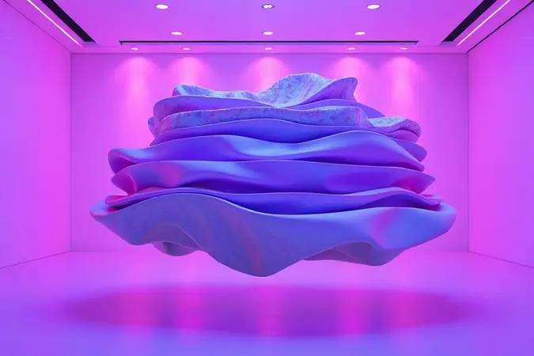
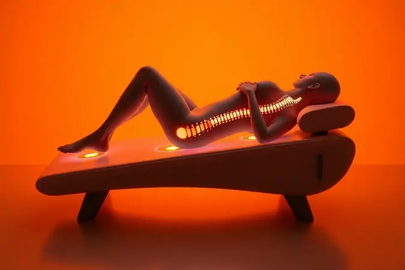

Investir em um bom colchão é uma das decisões mais importantes para sua saúde e qualidade de vida. Depois de um dia inteiro de trabalho e desafios, seu corpo merece um verdadeiro santuário para se recuperar.

A Castor entende essa necessidade e, há décadas, constrói sua reputação não apenas com durabilidade, mas com uma compreensão profunda do que significa ter um sono verdadeiramente restaurador.

Neste guia, vamos além das especificações técnicas. Vamos explorar como cada modelo Castor conversa com seu corpo, alivia suas dores e transforma suas noites.

Você descobrirá os 10 melhores modelos de 2025 analisados não por números, mas pela experiência que proporcionam.

<SummaryList products={frontmatter.top_products} />

## Quais os Top 10 Melhores Colchões Castor?

Escolher entre tantas opções pode parecer um quebra-cabeça. Por isso, organizamos esta lista pensando na experiência real de uso. Cada modelo aqui foi selecionado por equilibrar tecnologia, conforto e, principalmente, a capacidade de transformar sua relação com o sono.

### 1. Colchão Espuma D45 Black White AIR Euro Pillow Double Face Castor

<ProductBox 
  title={frontmatter.top_products[0].title} 
  image={frontmatter.top_products[0].image} 
  link={frontmatter.top_products[0].link} 
/>

Imagine deitar em uma superfície que oferece resistência sem ser dura, como um abraço firme que sabe exatamente onde sua coluna precisa de apoio. É essa sensação que o D45 Black White AIR proporciona.

A densidade D45 não é apenas um número, é a garantia de que mesmo após anos de uso, o colchão manterá sua postura, sem afundar ou perder forma.

A magia do Double Face permite que você literalmente vire a página quando sentir necessidade de uma textura diferente, quase como ter dois colchões em um.

O sistema AIR trabalha silenciosamente durante a noite, criando microcorrentes de ar que dissipam o calor do seu corpo, enquanto o Euro Pillow recebe você com uma maciez que parece um convite para esquecer o mundo.

<CaixaProsContras>

**Prós:**

- Firmeza ideal para suporte da coluna.

- Tecnologia Double Face aumenta durabilidade.

- Camada Euro Pillow traz conforto adicional.

- Sistema AIR melhora ventilação e controle de temperatura.

**Contras:**

- Firmeza maior pode não agradar quem prefere colchões macios.

- Não é dos modelos mais leves para manuseio.

</CaixaProsContras>

### 2. Colchão Espuma D45 SR Victory Euro Pillow Castor

<ProductBox 
  title={frontmatter.top_products[1].title} 
  image={frontmatter.top_products[1].image} 
  link={frontmatter.top_products[1].link} 
/>

Alguns corpos pedem mais do que conforto, precisam de uma base sólida que respeite sua estrutura. O D45 SR Victory foi criado para essa missão, suportando até 150 kg por pessoa sem perder a elegância do suporte.

Quando você se deita, sente imediatamente a diferença: não há aquela sensação de afundamento progressivo, mas sim de flutuação controlada.

O tratamento antiácaro e antifungo no tecido é como ter um guardião invisível protegendo seu espaço sagrado de descanso.

Embora este modelo específico esteja fora de linha, sua essência continua viva em alternativas que carregam o mesmo DNA Castor: qualidade certificada que transforma preocupação em tranquilidade.

<CaixaProsContras>

**Prós:**

- Suporta pesos elevados (até 150 kg por pessoa).

- Conforto equilibrado entre firmeza e maciez.

- Certificado pelo INMETRO, garantindo qualidade.

- Tratamento antiácaro e antifungo no tecido.

**Contras:**

- Fora de linha, limitando a disponibilidade.

- Garantia do tecido é menor (3 meses) em relação à espuma (24 meses).

</CaixaProsContras>

### 3. Colchão Molas Pocket Gold Star Light Stress Oxygen Plush Euro Pillow Castor

<ProductBox 
  title={frontmatter.top_products[2].title} 
  image={frontmatter.top_products[2].image} 
  link={frontmatter.top_products[2].link} 
/>

Para casais, dormir juntos não deveria significar dormir incomodados. As molas pocket ensacadas individualmente são a solução elegante: cada movimento é absorvido de forma independente, criando uma ilha de tranquilidade para cada pessoa.

É como dançar uma valsa onde cada parceiro tem seu próprio ritmo, mas a música é harmoniosa.

A tecnologia Celliant Sleep vai além do conforto físico, trabalha na recuperação do seu corpo enquanto você descansa. E o recurso Stress Free? Imagine libertar-se da carga acumulada do dia com um simples deitar.

A experiência plush é aquela sensação de nuvem que recebe seu corpo sem deixá-lo sem apoio.

<CaixaProsContras>

**Prós:**

- Molas ensacadas que oferecem suporte individualizado.

- Conforto Plush que proporciona uma sensação macia.

- Tecnologias que melhoram a qualidade do sono e reduzem o estresse.

- Camada Euro Pillow para um toque de luxo adicional.

**Contras:**

- Possíveis "bolinhas" no tecido em modelos mais antigos.

- Fragilidade de alguns componentes do box citada por usuários.

</CaixaProsContras>

### 4. Colchão Molas Ensacadas Pocket Silver Star Air Híbrido Euro Pillow Castor

<ProductBox 
  title={frontmatter.top_products[3].title} 
  image={frontmatter.top_products[3].image} 
  link={frontmatter.top_products[3].link} 
/>

Às vezes, o equilíbrio perfeito entre firmeza e maciez parece uma busca impossível. O Silver Star Air Híbrido prova que não precisa ser. Suas camadas de espuma variada conversam entre si para oferecer suporte onde você precisa e acolhimento onde deseja.

A malha 3D não é apenas um tecido, é um sistema respiratório que mantém o colchão vivo e fresco.

Com 32 cm de altura, este colchão anuncia sua presença no quarto com elegância. Cada centímetro trabalha a seu favor, criando uma base estável que se adapta ao seu corpo sem negociar com a qualidade.

Para quem tem alergias, o tecido hipoalergênico é um suspiro de alívio literal.

<CaixaProsContras>

**Prós:**

- Sistema de molas ensacadas que garante suporte individualizado.

- Camadas de espuma de diferentes densidades para maior conforto.

- Tecido em malha 3D promove a ventilação e controle de umidade.

- Conforto anatômico ideal para melhorar a postura durante o sono.

**Contras:**

- Pode ser considerado volumoso devido à sua altura.

- Peso máximo suportado é limitado a 130 kg por pessoa.

</CaixaProsContras>

### 5. Colchão Molas Ensacadas Pocket Class Euro Pillow Castor

<ProductBox 
  title={frontmatter.top_products[4].title} 
  image={frontmatter.top_products[4].image} 
  link={frontmatter.top_products[4].link} 
/>

Quando você divide a cama com alguém, cada movimento conta. As 230 molas por m² do Pocket Class trabalham como uma orquestra bem ensaiada: cada instrumento (ou mola) atua com precisão, sem interferir nos vizinhos. O resultado?

Você pode se virar à noite sem sentir que está acordando meio mundo.

A classificação macia ou intermediária é apenas o começo da história. O verdadeiro protagonista é como o colchão entende que conforto não é uniformidade, mas sim a capacidade de oferecer diferentes tipos de apoio para diferentes partes do seu corpo.

Os tratamentos contra ácaros e fungos são o cuidado invisível que faz toda a diferença na qualidade do seu descanso.

<CaixaProsContras>

**Prós:**

- Ótima combinação de conforto e suporte.

- Tecnologia de molas Pocket evita movimentos indesejados.

- Camada Euro Pillow para maior aconchego.

- Tratamentos contra ácaros e fungos.

**Contras:**

- Pode não ser a melhor opção para quem prefere colchões mais firmes.

- A variedade de modelos pode gerar confusão na escolha.

</CaixaProsContras>

### 6. Colchão Molas Bonnel Silver Star Air Euro Pillow Castor

<ProductBox 
  title={frontmatter.top_products[5].title} 
  image={frontmatter.top_products[5].image} 
  link={frontmatter.top_products[5].link} 
/>

Há uma beleza na tradição bem executada. As molas Bonnel são a prova disso: um sistema testado pelo tempo que oferece firmeza confiável.

Quando combinadas com o Euro Pillow, criam uma experiência paradoxalmente deliciosa, firme por baixo, macia por cima, como caminhar sobre grama bem cuidada.

O Polyframe nas bordas é aquele amigo discreto que nunca deixa você cair da cama, mesmo quando você se aproxima das beiradas durante o sono.

Para quem valoriza simplicidade com qualidade, este modelo é um lembrete de que às vezes as soluções mais eficazes são as que já conhecemos há décadas.

<CaixaProsContras>

**Prós:**

- Conforto extra com camada Euro Pillow.

- Suporte firme das molas Bonnel.

- Revestimento com tratamento antiácaro e antifungo.

- Bordas reforçadas para maior durabilidade.

**Contras:**

- Pode não atender a quem prefere colchões bem firmes.

- Variações nas especificações dependendo do modelo ou vendedor.

</CaixaProsContras>

### 7. Colchão Molas Bonnel Premium Tecnopedic Euro Pillow Castor

<ProductBox 
  title={frontmatter.top_products[6].title} 
  image={frontmatter.top_products[6].image} 
  link={frontmatter.top_products[6].link} 
/>

O Tecnopedic® neste modelo não é apenas um nome, é uma promessa de estabilidade. Enquanto as molas Bonnel garantem a estrutura, esta tecnologia cuida para que cada movimento seja suave e controlado.

A malha 3D funciona como uma segunda pele inteligente, respirando com você durante a noite.

Sim, ele tem presença. O peso é o preço que se paga por tanta qualidade concentrada em um único espaço. Mas quando você se deita e sente como cada parte do seu corpo é recebida com precisão, entende que algumas coisas valem o esforço extra.

Para alérgicos, o tratamento especial no tecido transforma o quarto em um refúgio seguro.

<CaixaProsContras>

**Prós:**

- Conforto equilibrado com a camada Euro Pillow.

- Sistema de molas Bonnel para durabilidade.

- Revestimento em Malha 3D para melhor ventilação.

- Tratamento antiácaro e antifungo, ideal para alérgicos.

**Contras:**

- Pode ser pesado para manusear.

- Modelo "One Side" que precisa ser girado ocasionalmente.

</CaixaProsContras>

### 8. Colchão de Molas Bonnel System Class Euro Pillow Castor

<ProductBox 
  title={frontmatter.top_products[7].title} 
  image={frontmatter.top_products[7].image} 
  link={frontmatter.top_products[7].link} 
/>

Há uma razão pela qual hotéis confiam em sistemas como este: eles oferecem consistência. A espuma de alta densidade não é apenas resistente, é inteligente.

Ela sabe quando ceder para conforto e quando manter firme para suporte, criando um equilíbrio que parece feito sob medida.

O limite de 110 kg por pessoa é uma informação honesta, não uma limitação. É a Castor sendo transparente sobre até onde a qualidade pode ir sem comprometer a experiência.

Quando você encontra um colchão que sabe seus próprios limites, pode confiar que dentro deles, ele será impecável.

<CaixaProsContras>

**Prós:**

- Conforto equilibrado entre firmeza e maciez.

- Tratamento antiácaro e antifungo.

- Durabilidade devido à construção com molas Bonnel.

- Várias dimensões disponíveis para diferentes necessidades.

**Contras:**

- Limite de peso pode ser restritivo para algumas pessoas.

- A espessura pode não agradar a quem prefere colchões mais altos.

</CaixaProsContras>

### 9. Colchão Espuma D45 Sleep Max Castor

<ProductBox 
  title={frontmatter.top_products[8].title} 
  image={frontmatter.top_products[8].image} 
  link={frontmatter.top_products[8].link} 
/>

Algumas pessoas não querem negociação quando se trata de firmeza. Precisam da certeza de que, ao se deitar, o colchão responderá com a mesma consistência todas as noites. O Sleep Max é essa promessa materializada em espuma D45.

A variedade de alturas (de 15 cm a 25 cm) permite que você escolha não apenas um colchão, mas uma experiência completa. Mais alto para quem gosta da sensação de estar aninhado, mais baixo para quem prefere praticidade.

A ausência de pillow top em alguns modelos não é uma falta, é uma declaração de propósito: aqui, a firmeza é a estrela.

<CaixaProsContras>

**Prós:**

- Alta densidade proporciona maior suporte.

- Boa durabilidade e resistência.

- Variedade de alturas e tamanhos disponíveis.

- Conforto com toque inicial macio em alguns modelos.

**Contras:**

- Firmeza excessiva pode não agradar a todos.

- Alguns modelos não possuem pillow top.

</CaixaProsContras>

### 10. Colchão de Molas Bonnel Revolution Euro Pillow Castor

<ProductBox 
  title={frontmatter.top_products[9].title} 
  image={frontmatter.top_products[9].image} 
  link={frontmatter.top_products[9].link} 
/>

Às vezes, revolução não significa mudar tudo, mas sim fazer o familiar de maneira excepcional. O sistema Bonnel Híbrido aqui é exatamente isso: a tradição reinventada com precisão.

Os 27 cm de altura não são apenas medida, são presença, a sensação de que você está sendo cuidado por algo substancial.

A firmeza macia pode surpreender quem está acostumado com colchões mais rígidos, mas é uma surpresa que conquista rapidamente. É como descobrir que pode ter suporte sem rigidez, aconchego sem afundamento.

A adaptação não é um desafio, mas um processo de descoberta de como seu corpo prefere descansar quando tem todas as opções.

<CaixaProsContras>

**Prós:**

- Conforto excepcional com a camada Euro Pillow.

- Sistema de molas Bonnel Híbrido garante firmeza.

- Tratamentos que oferecem proteção contra ácaros e alérgenos.

- Disponível em diversas dimensões para atender diferentes necessidades.

**Contras:**

- A firmeza macia pode não agradar a todos os perfis de sleeper.

- Pode exigir um período de adaptação para quem está acostumado a colchões mais firmes.

</CaixaProsContras>

## Diferenciais dos Colchões Castor

O que realmente separa a Castor não são apenas materiais premium ou tecnologias inovadoras, mas sim uma filosofia: o sono é uma experiência holística.

Quando investem em látex e espuma viscoelástica, não estão pensando apenas em densidade, mas em como esses materiais conversam com a curva da sua coluna durante a madrugada.

A variedade de modelos não é acidental, é o reconhecimento de que corpos diferentes pedem cuidados diferentes. E a durabilidade? É o compromisso silencioso de que seu investimento hoje continuará te abraçando com a mesma qualidade anos depois.

Cada colchão Castor carrega essa compreensão de que dormir bem não é luxo, mas necessidade fundamental.

## Qual é o melhor colchão para a coluna?

Sua coluna não pede milagres, apenas compreensão. Ela precisa de um parceiro que entenda seus pontos de tensão e saiba oferecer apoio exatamente onde necessário.

Colchões com suporte ortopédico funcionam como tradutores: convertem a linguagem técnica da ergonomia em sensações físicas que seu corpo reconhece como alívio.

A firmeza média não é um termo vago, é o ponto perfeito onde conforto e suporte param de competir e começam a colaborar.

Testar um colchão não é verificar uma lista de características, mas perguntar ao seu corpo: "Aqui, você se sente ouvido?" A resposta, quando positiva, transforma noites de sono em processos de cura.

## O que são molas bonnel?

Imagine uma rede de apoio onde cada ponto está conectado, criando uma resposta coletiva ao seu corpo. As molas bonnel são essa rede em forma de ampulheta de aço. Elas não trabalham sozinhas, mas em uníssono, distribuindo seu peso como uma equipe bem coordenada.

A ventilação que proporcionam não é um detalhe técnico, é o segredo para noites frescas mesmo nos dias mais quentes. Enquanto sistemas mais modernos oferecem individualidade, as bonnel oferecem consistência.

Escolhê-las é optar por uma sabedoria testada pelo tempo, que sabe que às vezes, a solução mais elegante é a que já provou seu valor.

## Como escolher o colchão ideal para pessoas com mais de 100 kg?

Quando seu corpo exige mais do colchão, a resposta não pode ser apenas "mais firme". Precisa ser "mais inteligente". Materiais como látex e espuma densa não apenas suportam peso, mas o distribuem de maneira que cada parte do seu corpo receba atenção proporcional.

A firmeza aqui não é sobre rigidez, mas sobre integridade estrutural. É a garantia de que o colchão manterá suas promessas não apenas na primeira noite, mas na milésima.

Testar se torna ainda mais crucial, porque você não está apenas buscando conforto, mas uma parceria duradoura com algo que entenderá suas necessidades específicas.

## Tipos de colchão: as melhores opções para o seu conforto

Escolher um tipo de colchão é como selecionar o tom de uma conversa íntima entre você e seu descanso. Os de espuma sussurram adaptabilidade, moldando-se aos seus contornos como argila cuidadosa.

Os de mola falam em firmeza e respiração, oferecendo uma base clara sobre a qual construir seu relaxamento.

Os híbridos são poliglotas do conforto, fluindo entre linguagens diferentes para criar uma experiência única. E os ortopédicos? São terapeutas noturnos, trabalhando silenciosamente na sua postura enquanto você sonha.

A pergunta não é "qual é o melhor tipo", mas "qual tipo fala a linguagem que seu corpo quer ouvir hoje à noite?".

## Conclusão

Encontrar o colchão Castor perfeito é mais do que uma compra, é o início de um relacionamento com seu próprio bem-estar. Cada modelo que exploramos hoje carrega não apenas espumas, molas e tecnologias, mas uma compreensão profunda do que significa descansar de verdade.

Desde a firmeza confiável do D45 até a dança silenciosa das molas pocket, desde a tradição reinventada das bonnel até os sistemas híbridos que conversam com seu corpo em múltiplas línguas do conforto, há um Castor esperando para transformar suas noites.

Lembre-se: o colchão ideal não é aquele com mais especificações técnicas, mas aquele que desaparece no fundo da sua consciência, permitindo que você simplesmente... durma.

Quando acordar renovado deixar de ser surpresa para se tornar rotina, você saberá que encontrou mais do que um produto, encontrou um aliado na busca por uma vida mais equilibrada e revitalizada. Sua próxima noite de sono extraordinária começa com a escolha certa hoje.