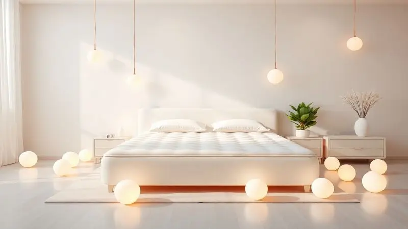
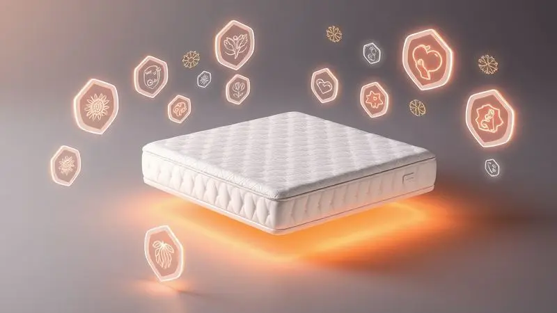
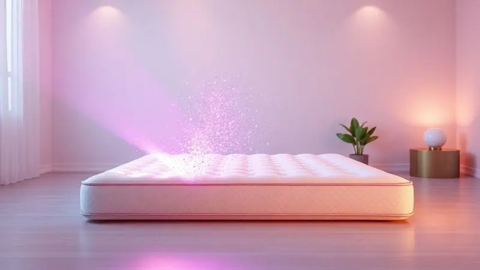

Acordar com espirros, coriza ou olhos irritados pode ser um sinal claro de que seu ambiente de descanso não está colaborando com sua saúde.

Para quem sofre de rinite, asma ou sensibilidades respiratórias, escolher o melhor colchão para pessoas com alergias é um passo fundamental para garantir noites tranquilas e dias mais produtivos.

Neste guia completo, analisamos as opções mais seguras do mercado, focando em tecnologias antiácaro, tecidos hipoalergênicos e materiais que evitam o acúmulo de microrganismos.

Descubra como transformar seu quarto em um refúgio de bem-estar com a nossa seleção atualizada para 2025.

<SummaryList products={frontmatter.top_products} />

## Quais são os 13 Melhores Colchões Para Pessoas Com Alergias?

Na busca por colchões adequados para pessoas com alergias, é essencial considerar materiais hipoalergênicos, que minimizam a acumulação de ácaros e outros alérgenos. Este guia apresenta opções que atendem a essas necessidades, proporcionando conforto e saúde.

### 1. Colchão Molas Ensacadas Visco Imperatore Eco Bamboo Euro Pillow - Herval

<ProductBox 
  title={frontmatter.top_products[0].title} 
  image={frontmatter.top_products[0].image} 
  link={frontmatter.top_products[0].link} 
/>

Imagine deslizar para um abraço que se adapta perfeitamente ao seu corpo enquanto mantém os ácaros bem longe.

O Colchão Molas Ensacadas Visco Imperatore Eco Bamboo Euro Pillow da Herval oferece exatamente essa combinação, com seus 34 cm de altura e sistema de molas ensacadas que praticamente eliminam a transferência de movimento, ideal para quem divide a cama.

A espuma viscoelástica trabalha como uma segunda pele, aliviando pontos de pressão e melhorando a circulação sanguínea enquanto você descansa.

O verdadeiro diferencial está no revestimento em tecido malha com viscose de bambu, que traz um toque fresco e suave para sua pele, aliado a propriedades antibacterianas e antifúngicas que criam um escudo invisível contra alérgenos.

Pense na tranquilidade de saber que cada respiração noturna é filtrada por esse material natural. Embora o peso suportado (entre 120 kg e 140 kg por pessoa) possa ser uma consideração importante, a qualidade e o cuidado respiratório oferecidos justificam o investimento.

<CaixaProsContras>

**Prós:**

- Sistema de molas ensacadas que reduz a percepção de movimento.

- Camada de espuma viscoelástica que melhora a ergonomia.

- Tecido com viscose de bambu, que é antibacteriano e antifúngico.

- Revestimento macio e fresco, ideal para quem sente calor à noite.

**Contras:**

- Peso máximo suportado pode ser limitante para algumas pessoas.

- O preço não é dos mais baixos, mas compensa pela qualidade.

</CaixaProsContras>

### 2. Colchão Molas Ensacadas Látex Impressione Visco Euro Pillow - Anjos

<ProductBox 
  title={frontmatter.top_products[1].title} 
  image={frontmatter.top_products[1].image} 
  link={frontmatter.top_products[1].link} 
/>

Para quem busca o equilíbrio perfeito entre suporte terapêutico e proteção respiratória, este modelo da Anjos apresenta uma sinergia inteligente de materiais.

As molas ensacadas individualmente conversam com as camadas de látex e viscoelástico para criar uma superfície que se adapta ao seu biotipo enquanto alivia pontos específicos de pressão.

O design Euro Pillow não é apenas estético, ele adiciona uma camada extra de maciez que acolhe seu corpo como um abraço reconfortante.

O tratamento antiácaro e antifungo do revestimento funciona como um guardião silencioso durante seu sono, prevenindo que alérgenos encontrem um lar em sua cama.

Embora o investimento possa ser superior a opções básicas, essa diferença se traduz em noites de sono onde você respira livremente, sem aquele despertar abrupto com nariz entupido ou coceira nos olhos.

<CaixaProsContras>

**Prós:**

- Molas ensacadas que minimizam a transferência de movimento.

- Camadas de látex e viscoelástico para alívio de pressão.

- Tratamento antiácaro e antifungo, ideal para alérgicos.

- Design com Euro Pillow que aumenta o conforto.

**Contras:**

- O preço pode ser elevado em relação a opções básicas.

- Algumas versões têm limites de peso, o que pode ser um fator a considerar.

</CaixaProsContras>

### 3. Colchão Espuma D45 Black White AIR - Castor

<ProductBox 
  title={frontmatter.top_products[2].title} 
  image={frontmatter.top_products[2].image} 
  link={frontmatter.top_products[2].link} 
/>

Se seu corpo pede firmeza que não comprometa a respiração noturna, o D45 Black White AIR apresenta uma solução inteligente.

Com densidade D45, ele oferece o suporte necessário para manter sua coluna alinhada, especialmente se você lida com desconfortos lombares, enquanto a tecnologia AIR e malha 3D trabalham em conjunto para criar um fluxo de ventilação constante.

Imagine dormir em uma superfície que respira junto com você, evitando o acúmulo de umidade que tanto atrai ácaros.

A praticidade do design double face estende sua vida útil, permitindo que você alterne os lados conforme necessário, mantendo sempre uma base fresca e renovada.

A altura confortável de 27 cm, muitas vezes acompanhada de um Pillow Top, oferece aquele toque macio que não sacrifica a firmeza estrutural necessária para um sono reparador.

<CaixaProsContras>

**Prós:**

- Suporte firme ideal para alinhar a coluna.

- Tecnologia de ventilação que previne umidade e calor.

- Double face proporciona maior durabilidade.

- Altura confortável de 27 cm com Pillow Top em alguns modelos.

**Contras:**

- Pode ser muito firme para quem prefere colchões mais macios.

- Necessita de cuidados especiais na limpeza devido ao tecido.

</CaixaProsContras>

### 4. Colchão Molas Ensacadas Classic - Anjos

<ProductBox 
  title={frontmatter.top_products[3].title} 
  image={frontmatter.top_products[3].image} 
  link={frontmatter.top_products[3].link} 
/>

Cada contorno do seu corpo recebe atenção individualizada neste modelo Classic, onde as molas ensacadas trabalham como um time perfeitamente coordenado.

Elas respondem isoladamente à sua pressão, aliviando pontos críticos que costumam acumular tensão durante a noite, enquanto o estofamento em espuma de poliuretano (com opções de Pillow Top) proporciona aquele toque acolhedor que convida ao relaxamento profundo.

O revestimento em tecido de malha, frequentemente tratado com tecnologia antiácaro e antifungo, transforma seu colchão em uma barreira ativa contra alérgenos.

A praticidade dos modelos "No Turn" elimina a necessidade de virar regularmente, simplificando sua rotina de cuidados sem comprometer a proteção respiratória que seu corpo merece.

<CaixaProsContras>

**Prós:**

- Molas ensacadas para suporte individualizado.

- Tratamento antiácaro e antifungo.

- Opções com Pillow Top para mais conforto.

- Várias alturas e tamanhos disponíveis.

**Contras:**

- Alguns modelos precisam de cuidados específicos na limpeza.

- Pode haver variações na garantia conforme o modelo.

</CaixaProsContras>

### 5. Colchão Molas Maxspring Petra Malha C1662 - Herval

<ProductBox 
  title={frontmatter.top_products[4].title} 
  image={frontmatter.top_products[4].image} 
  link={frontmatter.top_products[4].link} 
/>

Quando conforto e consciência ambiental se encontram com proteção respiratória, nasce o Petra Malha C1662.

Suas molas Maxspring combinadas com espumas de alta densidade criam uma base firme que se adapta ao seu corpo, enquanto o Pillow Top One Side oferece a praticidade de não precisar virar o colchão.

Imagine acordar renovado em uma superfície que cuidou tanto do seu descanso quanto do planeta.

O tratamento antiácaro e antifungo atua como um escudo invisível, e a malha de alta qualidade do revestimento oferece um toque suave que acaricia sua pele.

O uso da EcoSpuma®, feita de retalhos reciclados, não apenas reduz o impacto ambiental, mas também cria uma estrutura respirável que dificulta a proliferação de microrganismos indesejados.

<CaixaProsContras>

**Prós:**

- Tratamento antiácaro e antifungo ideal para alérgicos.

- Pillow Top One Side para maior conforto sem necessidade de virar.

- Revestimento em malha de alta qualidade com toque suave.

- Feito com EcoSpuma®, material sustentável e durável.

**Contras:**

- Peso máximo suportado varia conforme a altura do usuário.

- Pode não ser ideal para quem prefere colchões muito macios.

</CaixaProsContras>

### 6. Colchão Molas Nanolastic Physical Spring - Ortobom

<ProductBox 
  title={frontmatter.top_products[5].title} 
  image={frontmatter.top_products[5].image} 
  link={frontmatter.top_products[5].link} 
/>

Estabilidade e proteção alérgica se fundem neste modelo da Ortobom, onde as molas Nanolastic em aço de alto carbono oferecem uma base robusta que não cede com o tempo.

A camada de espuma D26 proporciona um toque suave que se ajusta aos seus movimentos noturnos, enquanto o tratamento contra ácaros e alergias no tecido trabalha silenciosamente para manter seu espaço de descanso seguro.

O reforço nas bordas aumenta significativamente a área útil de sono, permitindo que você aproveite cada centímetro da superfície sem preocupações com áreas de menor suporte.

Embora a capacidade de peso tenha seus limites, a durabilidade e o cuidado respiratório oferecidos fazem deste colchão um companheiro de longo prazo para noites tranquilas.

<CaixaProsContras>

**Prós:**

- Conforto elevado com espuma D26.

- Tratamento antialérgico e antiácaro.

- Boa durabilidade com molas de alta qualidade.

- Reforço nas bordas que aumenta a área útil de sono.

**Contras:**

- Suporte de peso limitado a certos perfis.

- Pode não ser a opção mais barata disponível.

</CaixaProsContras>

### 7. Colchão Molas Ensacadas Versalhes - Anjos

<ProductBox 
  title={frontmatter.top_products[6].title} 
  image={frontmatter.top_products[6].image} 
  link={frontmatter.top_products[6].link} 
/>

Tecnologia avançada encontra conforto personalizado no Versalhes, onde as molas ensacadas MasterPocket se adaptam tão precisamente ao seu corpo que você quase esquece que está deitado em uma superfície estruturada.

Essa adaptação inteligente minimiza drasticamente a transferência de movimento, ideal para quem compartilha a cama sem querer compartilhar cada reviravolta noturna.

As camadas de espuma Hiper Soft e D33 trabalham em harmonia para oferecer maciez sem perder a estabilidade, enquanto o revestimento em malha com tratamento antiácaro e antifungo cria um ambiente onde você pode respirar livremente.

A robustez do modelo, ainda que torne a movimentação um pouco mais desafiadora, é exatamente o que garante sua durabilidade ao longo dos anos.

<CaixaProsContras>

**Prós:**

- Molas ensacadas que adaptam-se bem ao corpo.

- Boa ventilação e controle de temperatura.

- Tratamento antiácaro e antifungo.

- Suporte de peso robusto, até 120 kg por pessoa.

**Contras:**

- Pode ser mais pesado, dificultando a movimentação.

- Preço pode variar entre lojas.

</CaixaProsContras>

### 8. Colchão Molas Ensacadas Eco Linho - Paropas

<ProductBox 
  title={frontmatter.top_products[7].title} 
  image={frontmatter.top_products[7].image} 
  link={frontmatter.top_products[7].link} 
/>

Sustentabilidade e saúde respiratória caminham juntas neste modelo ecológico da Paropas.

O sistema MasterPocket de molas ensacadas individualmente oferece suporte anatômico que respeita suas curvas naturais, enquanto o pillow Euro Pillow adiciona a camada de maciez que transforma o deitar na cama em um momento de puro prazer.

O tecido em Malha de Viscose tratado contra ácaros e fungos não é apenas uma característica técnica, é uma promessa de noites sem interrupções alérgicas.

A firmeza equilibrada do modelo pode não agradar todos os gostos, mas para quem busca suporte consistente aliado a uma consciência ambiental ativa, ele representa a convergência perfeita entre conforto pessoal e responsabilidade coletiva.

<CaixaProsContras>

**Prós:**

- Molas ensacadas que garantem suporte e conforto.

- Tecido tratado contra ácaros e fungos.

- Ideal para casais devido à redução da transferência de movimento.

- Ecologicamente correto, com materiais sustentáveis.

**Contras:**

- A firmeza pode não ser do agrado de todos.

- Não possui muitos recursos extras ou tecnologias avançadas.

</CaixaProsContras>

### 9. Colchão Molas Ensacadas Látex Prime - Kappesberg

<ProductBox 
  title={frontmatter.top_products[8].title} 
  image={frontmatter.top_products[8].image} 
  link={frontmatter.top_products[8].link} 
/>

Resiliência e adaptação definem este modelo que combina a tecnologia de molas ensacadas com a flexibilidade natural do látex.

Enquanto as molas oferecem suporte personalizado que praticamente elimina a transferência de movimento entre parceiros, o látex responde aos seus contornos com uma memória suave que não pressiona pontos sensíveis.

A ventilação integrada mantém uma temperatura agradável durante toda a noite, prevenindo aquela sudorese noturna que tanto incomoda e cria ambiente propício para alérgenos.

O design "one face" simplifica a manutenção, ainda que limite as opções de alternância, mas para quem valoriza praticidade aliada a um suporte consistente, essa característica torna o cuidado diário muito mais simples.

<CaixaProsContras>

**Prós:**

- Combinação de molas ensacadas e látex para maior conforto.

- Suporte personalizável que reduz a transferência de movimento.

- Boa ventilação que ajuda na regulação da temperatura.

- Design moderno e opções de tamanhos variados.

**Contras:**

- Normalmente é um modelo "one face", limitando o uso.

- Pode não ser o colchão mais macio para aqueles que preferem um toque mais suave.

</CaixaProsContras>

### 10. Colchão Molas Ensacadas Visco Gel Blue - Paropas

<ProductBox 
  title={frontmatter.top_products[9].title} 
  image={frontmatter.top_products[9].image} 
  link={frontmatter.top_products[9].link} 
/>

Conforto térmico inteligente encontra proteção alérgica neste modelo que parece entender exatamente o que seu corpo precisa durante a noite.

O sistema MasterPocket de molas ensacadas oferece suporte individualizado que se ajusta aos seus movimentos, enquanto a camada de espuma viscoelástica com gel trabalha para regular a temperatura, mantendo você na zona ideal de conforto térmico.

O pillow top americano adiciona aquele toque extra de maciez que transforma o ato de deitar em um ritual de autocuidado, e o tratamento antiácaro e antifungo age como um guardião noturno contra alérgenos.

Com capacidade para suportar até 150 kg e disponível em diversos tamanhos, ele se adapta tanto a solteiros quanto a casais que buscam noites de sono onde a respiração flui livre e desimpedida.

<CaixaProsContras>

**Prós:**

- Sistema de molas ensacadas que oferece suporte individualizado.

- Camada de visco gel para conforto térmico.

- Tratamento antiácaro e antifungo, ideal para alérgicos.

- Disponível em vários tamanhos.

**Contras:**

- O preço pode ser mais alto do que modelos básicos.

- Pode ser considerado muito macio para quem prefere colchões firmes.

</CaixaProsContras>

### 11. Colchão Auping Elite

<ProductBox 
  title={frontmatter.top_products[10].title} 
  image={frontmatter.top_products[10].image} 
  link={frontmatter.top_products[10].link} 
/>

Quando tecnologia de ponta se encontra com cuidado respiratório meticuloso, surge o Auping Elite.

Sua combinação de molas de aço com Vita Talalay Origins® cria uma base que ventila naturalmente, regulando a temperatura de forma tão eficiente que você quase esquece que está deitado sobre uma estrutura complexa.

Imagine dormir em uma superfície que respira com você, mantendo o frescor durante toda a noite.

A capa removível e lavável com propriedades antialérgicas não é apenas um acessório, é sua primeira linha de defesa contra alérgenos, podendo ser limpa regularmente para manter o ambiente impecável.

Disponível em várias opções de firmeza (Soft, Medium e Firm) e tamanhos, ele se adapta não apenas ao seu biotipo, mas também à sua sensibilidade individual, oferecendo um investimento que se traduz em anos de sono protegido e reparador.

<CaixaProsContras>

**Prós:**

- Oferece excelente ventilação e conforto.

- Capa removível e lavável com propriedades antialérgicas.

- Disponível em várias opções de firmeza e tamanhos.

- Sustentabilidade destacada com materiais recicláveis.

**Contras:**

- É um investimento mais alto.

- Não é o modelo mais barato do mercado.

</CaixaProsContras>

### 12. Colchão Auping Elysium

<ProductBox 
  title={frontmatter.top_products[11].title} 
  image={frontmatter.top_products[11].image} 
  link={frontmatter.top_products[11].link} 
/>

Personalização extrema aliada a consciência ambiental define este modelo premium que parece ter sido pensado especificamente para você.

Seu sistema de molas individuais não apenas se adapta ao formato do seu corpo, mas também cria zonas de conforto específicas que respeitam seu biotipo único, oferecendo suporte exatamente onde você mais precisa.

A tecnologia de ventilação mantém a umidade sob controle rigoroso, prevenindo o superaquecimento que tanto incomoda durante a noite e cria ambiente hostil para ácaros.

A sustentabilidade não é um detalhe secundário, mas sim parte integrante do design, com materiais 100% recicláveis que minimizam o impacto ambiental sem comprometer a qualidade do sono protegido que seu corpo merece.

<CaixaProsContras>

**Prós:**

- Conforto personalizável adaptado ao biotipo do usuário.

- Tecnologia avançada em molas para excelente suporte.

- Ventilação eficaz que evita superaquecimento.

- Sustentabilidade com materiais recicláveis e embalagem reduzida.

**Contras:**

- Investimento inicial elevado.

- Pode ser mais firme para quem prefere opções mais macias.

</CaixaProsContras>

### 13. Colchão Solteiro D20 Espuma Certificada Antialérgico Bf Colchões

<ProductBox 
  title={frontmatter.top_products[12].title} 
  image={frontmatter.top_products[12].image} 
  link={frontmatter.top_products[12].link} 
/>

Simplicidade inteligente com foco absoluto em saúde respiratória caracteriza este modelo acessível da BF Colchões.

Feito com espuma de densidade 20 e certificado pelo Inmetro, ele oferece a tranquilidade de saber que está descansando em um produto testado e aprovado quanto à segurança e qualidade.

O tecido em microfibra tratado contra ácaros e alergias trabalha silenciosamente durante sua noite, criando uma barreira protetora enquanto você mergulha no sono.

Com dimensões compactas (88x188x12cm ou 78x188x12cm), sua maciez convidativa transforma não apenas seu descanso diário, mas também a experiência de visitas que possam compartilhar seu espaço.

Embora as opções de tamanho sejam mais limitadas, sua construção focada em conforto e proteção respiratória oferece uma solução inteligente para quem busca qualidade sem complexidades desnecessárias.

<CaixaProsContras>

**Prós:**

- Produzido com espuma de alta densidade e qualidade.

- Tratamento antiácaro e antialérgico no tecido.

- Certificado pelo Inmetro, atestando sua segurança.

- Ótima durabilidade e conforto.

**Contras:**

- Disponível em tamanhos limitados.

- Pode ser um pouco mais pesado que modelos convencionais.

</CaixaProsContras>

## Qual o colchão ideal para pessoas com alergia?

Depois de explorar essas opções específicas, você deve estar se perguntando: qual realmente merece o título de "ideal"? A resposta está na convergência entre propriedades hipoalergênicas ativas e adaptação ao seu corpo.

O colchão perfeito para quem lida com alergias vai além de simplesmente repelir alérgenos, ele cria um ecossistema onde poeira, ácaros e fungos encontram um ambiente hostil para proliferar.

Materiais como látex natural e espuma de memória ganham destaque não apenas por não reterem umidade, mas por sua estrutura interna que dificulta o estabelecimento de microrganismos.

Imagine dormir em uma superfície que trabalha ativamente para manter seu espaço respiratório limpo. As capas protetoras laváveis em máquina não são acessórios, são extensões dessa proteção, permitindo que você renove essa barreira regularmente.

Tecidos como algodão orgânico completam o quadro ao minimizar a exposição a produtos químicos que podem irritar pele já sensibilizada.

## Como escolher o melhor colchão hipoalergênico?

Escolher o colchão certo transforma-se em um processo de autoconhecimento quando as alergias entram na equação. Não se trata apenas de comparar especificações técnicas, mas de entender como cada material conversa com sua sensibilidade individual.

Priorize aqueles que não apenas resistem a ácaros, mas criam condições adversas para sua proliferação.

### Comece pelo tecido do colchão

Seu primeiro contato com o colchão acontece através do tecido, então essa escolha inicial determina muito da sua experiência noturna.

Materiais hipoalergênicos como algodão orgânico ou poliéster tratado não são apenas confortáveis, eles estabelecem a primeira linha de defesa, mantendo alérgenos à distância desde o primeiro toque.

Propriedades antibacterianas e antifúngicas integradas ao tecido trabalham como um sistema imunológico para sua cama, enquanto capas removíveis e laváveis oferecem a praticidade de renovar essa proteção regularmente, mantendo a higiene no nível que sua saúde respiratória exige.

### Opte por modelos que promovam a ventilação e controle de temperatura

A conexão entre temperatura e alergias é mais íntima do que parece. Quando seu corpo superaquece durante a noite, a sudorese cria o ambiente úmido perfeito para que ácaros se multipliquem.

Colchões com materiais como espuma de memória ou látex que permitem circulação de ar constante previnem esse ciclo, mantendo uma temperatura estável que desencoraja a proliferação de alérgenos.

Tecidos tecnológicos que absorvem e dissipam umidade completam essa estratégia, criando um microclima onde você dorme fresco enquanto microrganismos indesejados encontram condições desfavoráveis para prosperar.

### Preenchimento do colchão também é importante

A camada interna do colchão é onde a batalha contra os alérgenos é travada em profundidade. Materiais como látex e espuma viscoelástica destacam-se não apenas pelo conforto que oferecem, mas pela resistência natural que apresentam contra ácaros e fungos.

Sua estrutura celular aberta dificulta a fixação de partículas alergênicas, enquanto oferece o suporte preciso que seu corpo precisa para relaxar verdadeiramente.

Em contraste, preenchimentos sintéticos podem se tornar verdadeiros reservatórios de poeira, transformando seu local de descanso em um potencial gatilho para crises.

A escolha consciente do preenchimento significa optar por uma base que apoia não apenas seu corpo, mas também sua qualidade de vida respiratória.

## Vale a pena ter um colchão hipoalergênico?

Imagine transformar a ansiedade noturna em tranquilidade profunda. Esse é o verdadeiro valor de um colchão hipoalergênico.

Para quem vive com a sombra das alergias, cada noite pode se tornar um campo minado de potenciais reações, mas essa escolha específica redefine completamente essa experiência.

Esses colchões não apenas reduzem a acumulação de alérgenos como ácaros, fungos e bactérias, eles criam um santuário onde seu sistema respiratório pode descansar verdadeiramente.

A melhoria na qualidade do ar no seu ambiente de descanso não é um benefício abstrato, é algo que você sente ao acordar sem aquela congestão matinal ou coceira nos olhos que tanto atrapalham seus primeiros momentos do dia.

Investir em um colchão hipoalergênico significa investir em acordares renovados, em dias que começam com clareza respiratória, e em noites onde o único movimento que importa é o ritmo tranquilo da sua respiração.

## Principais vantagens dos colchões antialergicos

Os benefícios de um colchão antialérgico vão muito além da simples ausência de sintomas.

Eles oferecem uma proteção ativa que transforma seu quarto em uma zona livre de gatilhos alérgicos, beneficiando especialmente quem convive com condições respiratórias ou dermatológicas que tornam cada partícula de poeira uma potencial ameaça.

Materiais hipoalergênicos e laváveis não apenas facilitam a manutenção da higiene, mas devolvem a você o controle sobre seu ambiente de descanso.

O conforto oferecido por essas tecnologias específicas trabalha em duas frentes: enquanto proporcionam suporte ergonômico que respeita suas curvas naturais, as tecnologias de ventilação integrada regulam a temperatura criando condições adversas para a proliferação de alérgenos.

O resultado são noites verdadeiramente reparadoras, onde seu corpo encontra não apenas descanso físico, mas também respiratório, permitindo que você desperte com a energia necessária para enfrentar o dia com vitalidade renovada.

## Tipos de materiais utilizados em colchões antialérgicos

A ciência por trás da proteção alérgica começa com a escolha estratégica de materiais.

Espumas de poliuretano e látex ganham destaque não apenas por suas propriedades hipoalergênicas inerentes, mas pela estrutura que dificulta a penetração e fixação de ácaros e outros alérgenos.

Imagine uma barreira física que diz "não" às partículas microscópicas que tanto incomodam seu sistema respiratório.

Fibras naturais como o algodão orgânico completam essa equação ao minimizar a exposição a produtos químicos agressivos que podem irritar pele já sensibilizada.

O gel, frequentemente incorporado em camadas específicas, oferece mais do que conforto térmico, ele ajuda a estabilizar o microclima do colchão, criando condições menos propícias para a proliferação de microrganismos.

Essa combinação inteligente de materiais garante que seu colchão seja não apenas um local de descanso, mas um aliado ativo na sua saúde respiratória.

## Cuidados e manutenção dos colchões antialergicos

A eficácia prolongada de um colchão antialérgico depende de uma parceria ativa entre a tecnologia do produto e seus cuidados diários.

Comece estabelecendo uma rotina de aspiração regular da superfície, removendo não apenas poeira visível, mas também partículas microscópicas que poderiam se tornar gatilhos alérgicos.

Protetores impermeáveis e laváveis atuam como uma segunda pele para seu colchão, prevenindo a infiltração de líquidos e suor que poderiam comprometer suas propriedades protetoras.

Girar o colchão a cada três meses promove um desgaste uniforme que preserva suas características originais, enquanto a exposição ocasional aos raios UV do sol aproveita o poder natural da luz solar para eliminar microorganismos indesejados.

Seguir as instruções específicas do fabricante para limpeza não é apenas uma recomendação, é a garantia de que você está mantendo intactas as tecnologias que tornam seu colchão um verdadeiro guardião do seu sono protegido.

## Perguntas frequentes sobre colchão hipoalergênico

Os colchões hipoalergênicos são especialmente projetados para minimizar alérgenos, como poeira e ácaros. Se você tem problemas respiratórios ou de pele, é importante considerar esses colchões que proporcionam um ambiente mais saudável para o sono.

### Os colchões antialérgicos têm garantia?

A maioria dos colchões antialérgicos oferece garantias que variam de 5 a 10 anos, dependendo do fabricante e da qualidade dos materiais utilizados.

Essa cobertura geralmente protege contra defeitos de fabricação e problemas estruturais que possam comprometer a integridade do produto.

Ao fazer sua escolha, dedique alguns minutos para entender os termos específicos da garantia, pois essa proteção é sua segurança de que o investimento em sua saúde respiratória terá suporte de longo prazo.

Muitas marcas complementam essa proteção com períodos de teste que permitem experimentar o colchão antes do compromisso definitivo.

### Quais são os sinais de que um colchão antialérgico precisa ser trocado?

Seu corpo oferece pistas claras quando a proteção alérgica do seu colchão começa a se deteriorar. Dor nas costas persistente ao acordar, diminuição perceptível no suporte, ou a sensação de estar "afundando" em pontos específicos indicam que a estrutura está cedendo.

Manchas que resistem à limpeza, odores persistentes, ou um aumento na frequência das suas reações alérgicas noturnas são sinais ainda mais diretos de que as propriedades protetoras estão comprometidas.

Um colchão antialérgico deve ser seu aliado silencioso na busca por noites tranquilas, e quando ele começa a se tornar parte do problema em vez da solução, é o momento de considerar sua substituição.

Lembre-se que a qualidade do seu sono e da sua respiração noturna são investimentos valiosos que merecem ser protegidos.

### Posso usar protetores de colchão em colchões antialérgicos?

Não apenas pode, como deve usar protetores de colchão em modelos antialérgicos.

Essa prática adiciona uma camada extra de defesa que complementa as tecnologias já integradas ao produto, criando uma barreira física adicional contra ácaros, poeira e outras partículas que poderiam se acumular na superfície.

A chave está em escolher um protetor respirável, feito de materiais hipoalergênicos que não comprometam as propriedades originais do colchão.

Imagine essa combinação como um sistema de defesa em camadas: enquanto o colchão oferece proteção estrutural, o protetor atua como uma capa renovável que pode ser lavada regularmente, mantendo o ambiente de sono impecável.

Essa sinergia não apenas preserva a integridade do seu investimento, como amplifica a proteção que seu sistema respiratório merece.

### É seguro lavar um colchão antialérgico?

A limpeza segura de um colchão antialérgico segue um princípio básico: preserve as propriedades protetoras enquanto remove os alérgenos. Comece sempre com a aspiração regular para remover ácaros e poeira superficiais, mantendo as camadas protetoras intactas.

Se a lavagem se tornar necessária, consulte cuidadosamente as instruções do fabricante, pois alguns modelos permitem lavagem manual ou em máquina em ciclos específicos que não comprometem suas características antialérgicas.

Evite produtos químicos agressivos que poderiam degradar os tratamentos especiais integrados ao tecido, optando por soluções suaves que limpam sem danificar.

Essa abordagem cuidadosa garante que seu colchão continue oferecendo a proteção respiratória pela qual você investiu, mantendo seu espaço de descanso como um verdadeiro santuário de saúde.

## Conclusão

Escolher o colchão certo quando se vive com alergias vai muito além de uma simples decisão de compra. É um ato de autocuidado que redefine completamente sua relação com o descanso noturno.

Cada uma das opções que exploramos oferece uma abordagem única para criar esse espaço protegido onde seu corpo pode finalmente relaxar sem a constante ameaça de reações alérgicas.

Do toque fresco do bambu antibacteriano à resiliência natural do látex, das molas que se adaptam individualmente aos seus movimentos às tecnologias de ventilação que mantêm o microclima ideal, você agora possui o conhecimento necessário para fazer uma escolha informada.

Lembre-se que o melhor colchão para você é aquele que não apenas protege sua respiração, mas também se adapta ao seu corpo, oferecendo o suporte que suas costas precisam enquanto mantém os alérgenos bem longe.

Imagine acordar amanhã sem aquela congestão matinal que tanto atrapalha seus primeiros momentos do dia. Visualize noites inteiras de sono profundo, sem interrupções por espirros ou coceira. Esse futuro está ao seu alcance.

Dê o primeiro passo transformando seu quarto em um verdadeiro refúgio de saúde respiratória. Seu corpo - e suas manhãs renovadas - agradecerão.