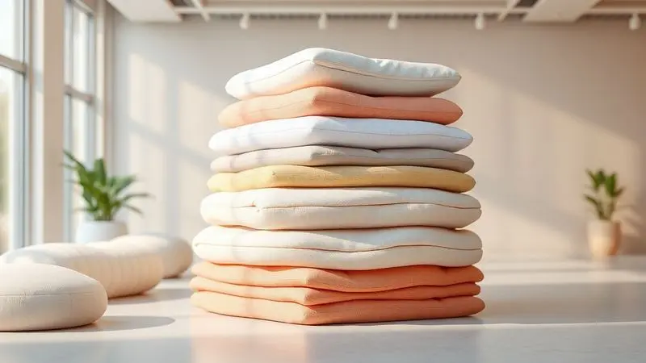
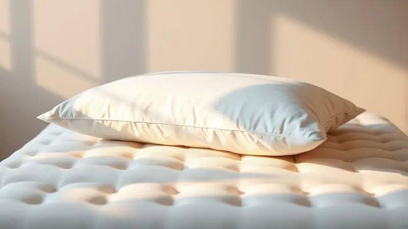

O sono de qualidade transforma seu dia. Você acorda renovado, com energia para enfrentar qualquer desafio, e essa sensação começa com a escolha certa do que está debaixo de você durante a noite.

Se busca o equilíbrio perfeito entre suporte sólido e conforto acolhedor, os colchões de molas ensacadas oferecem exatamente isso: tecnologia que se adapta somente a você, enquanto mantém o parceiro completamente imune aos seus movimentos.

Neste guia de 2025, exploramos os melhores modelos do mercado, desde Castor e Ortobom até Herval e Paropas, analisando não apenas especificações técnicas, mas como cada detalhe impacta sua noite de sono.

Prepare-se para descobrir qual colchão transformará suas horas na cama em verdadeiro descanso.

<SummaryList products={frontmatter.top_products} />

## Guia das Melhores Opções de Colchões de Molas Ensacadas

Imagine dormir profundamente enquanto o parceiro vira de lado, levanta para beber água ou até mesmo troca de posição. Isso não é sonho, é a realidade que os colchões de molas ensacadas entregam.

Com suporte individualizado que respeita os movimentos de cada corpo, essa tecnologia transforma a experiência de casais e revela por que tantas pessoas trocam seus colchões tradicionais por essa independência noturna.

### 1. Colchão Castor Molas Pocket Gold Star Light Stress Oxygen New Plush One Face

<ProductBox 
  title={frontmatter.top_products[0].title} 
  image={frontmatter.top_products[0].image} 
  link={frontmatter.top_products[0].link} 
/>

Quando tecnologia terapeutica se encontra com conforto pensado para o sono reparador, temos o Castor Gold Star. Pense naquela sensação de pernas pesadas após um longo dia.

Agora imagine um tecido que trabalha ativamente para melhorar sua circulação através da tecnologia Celliant Sleep, aumentando a oxigenação do sangue enquanto você descansa.

As molas ensacadas fazem sua parte crucial: cada uma se move independentemente, garantindo que você não sinta os movimentos do parceiro. O tecido Stress Free elimina a eletricidade estática que, mesmo sem percebermos, gera desconforto.

A camada plush oferece esse abraço macio que convida ao relaxamento, enquanto a malha 3D nas laterais mantém o frescor constante.

É um colchão projetado para ser usado de um lado só, uma escolha prática que simplifica sua vida, mas que significa considerar essa característica na sua decisão.

<CaixaProsContras>

**Prós:**

- Tecnologia de molas ensacadas para melhor suporte.

- Tratamento terapêutico no tecido para melhorar a qualidade do sono.

- Tecido que reduz eletricidade estática e estresse.

- Design ventilado que ajuda no controle de temperatura.

**Contras:**

- Uso de apenas um lado pode limitar opções de manutenção.

- Pode não ser adequado para quem prefere colchões mais firmes.

</CaixaProsContras>

### 2. Colchão Castor Molas Pocket Silver Star Air Híbrido One Face

<ProductBox 
  title={frontmatter.top_products[1].title} 
  image={frontmatter.top_products[1].image} 
  link={frontmatter.top_products[1].link} 
/>

Precisa de firmeza nas bordas para levantar da cama sem dificuldade, mas quer o centro macio e adaptável? O Silver Star Air Híbrido resolve essa equação com maestria.

Sua tecnologia combina as molas ensacadas no centro - perfeitas para o suporte pontual da coluna - com espumas firmes nas bordas que dão estrutura quando você se senta na beira da cama.

Os 32 cm de altura criam uma presença imponente no seu quarto, enquanto a tecnologia Aria 3D trabalha silenciosamente mantendo a ventilação ideal.

Não poder virá-lo simplifica sua rotina, e a garantia de 36 meses para o molejo respalda a durabilidade que você está adquirindo.

<CaixaProsContras>

**Prós:**

- Tecnologia híbrida que combina molas ensacadas e espumas.

- Conforto intermediário ideal para diversas preferências.

- Ventilação constante com a tecnologia Aria 3D.

- Garantia prolongada para maior segurança na compra.

**Contras:**

- Design de uma face pode limitar opções de uso.

- Algumas avaliações sugerem que o conforto pode variar conforme o biotipo.

</CaixaProsContras>

### 3. Colchão Herval Molas Ensacadas MasterPocket Imperatore Eco Bamboo

<ProductBox 
  title={frontmatter.top_products[2].title} 
  image={frontmatter.top_products[2].image} 
  link={frontmatter.top_products[2].link} 
/>

Se você sente dores nos ombros ou quadris ao acordar, a combinação entre molas ensacadas e espuma viscoelástica do Herval Imperatore pode ser sua libertação.

A espuma se adapta aos seus contornos específicos, aliviando pontos de pressão exatamente onde seu corpo mais precisa, enquanto as molas garantem que essa personalização não interfira no descanso ao lado.

O toque fresco do tecido de bambu não é apenas agradável, mas também naturalmente resistente, criando um ambiente de sono mais saudável.

O investimento reflete materiais premium que prometem acompanhar suas noites por anos, transformando cada manhã em um despertar mais leve.

<CaixaProsContras>

**Prós:**

- Conforto superior devido às molas ensacadas.

- Boa adaptação ao corpo com espuma viscoelástica.

- Tecido Eco Bamboo resistente e agradável ao toque.

- Design estético e moderno com bordado quadro a quadro.

**Contras:**

- Pode ter um custo inicial mais alto.

- Exige cuidados para manter suas propriedades, como não expor ao sol direto.

</CaixaProsContras>

### 4. Colchão Molas Ensacadas SuperPocket Elegant OrtoPillow - Ortobom

<ProductBox 
  title={frontmatter.top_products[3].title} 
  image={frontmatter.top_products[3].image} 
  link={frontmatter.top_products[3].link} 
/>

Acorda espirrando ou com coceira no nariz? O Elegant OrtoPillow da Ortobom cria uma barreira invisível contra alérgenos enquanto oferece conforto.

As molas ensacadas fazem seu trabalho essencial de isolamento de movimento, mas a estrela aqui é o tratamento antiácaro e antialérgico que transforma seu colchão em um santuário para quem sofre com alergias.

O tecido Bambú Fresh mantém a temperatura agradável, e as laterais em camurça dão aquele toque de sofisticação que você vê em hotéis premium.

Suporta tranquilamente até 150kg por pessoa, e a praticidade do não precisar rotacioná-lo significa menos trabalho e mais descanso.

<CaixaProsContras>

**Prós:**

- Molas ensacadas que oferecem suporte individualizado.

- Camada Ortopillow para maior maciez.

- Tratamento antialérgico e antiácaro.

- Design sofisticado com tecido Bambú Fresh.

**Contras:**

- O tamanho King pode ser difícil de manusear em espaços pequenos.

- Pode ser considerado mais pesado em comparação a outros modelos.

</CaixaProsContras>

### 5. Colchão Castor Molas Pocket Silver Star Air Double Face

<ProductBox 
  title={frontmatter.top_products[4].title} 
  image={frontmatter.top_products[4].image} 
  link={frontmatter.top_products[4].link} 
/>

Quer prolongar a vida útil do seu investimento? A característica Double Face do Silver Star Air significa que você tem praticamente dois colchões em um.

Quando um lado mostrar sinais de uso, basta virar e começar a usar o outro, aumentando significativamente a durabilidade. As molas Pocket trabalham em conjunto com a tecnologia Air que mantém o interior ventilado, evitando acúmulo de umidade e odores.

As espumas de diferentes densidades criam camadas de conforto inteligentes, enquanto os tratamentos antiácaros e antibacterianos cuidam da sua saúde enquanto você dorme.

A robustez se traduz em volume, então considere o espaço disponível, mas saiba que essa estrutura firme promete anos de suporte consistente.

<CaixaProsContras>

**Prós:**

- Sistema de molas Pocket® para suporte personalizado.

- Tecnologia Air que auxilia na ventilação e controle de umidade.

- Utilização dos dois lados aumenta a vida útil.

- Tratamentos antiácaros e antibacterianos para maior higiene.

**Contras:**

- Pode ser um pouco volumoso para alguns espaços.

- Disponibilidade de modelos e tamanhos pode variar.

</CaixaProsContras>

### 6. Colchão Molas Ensacadas SuperPocket Airtech Spring OrtoPillow - Ortobom

<ProductBox 
  title={frontmatter.top_products[5].title} 
  image={frontmatter.top_products[5].image} 
  link={frontmatter.top_products[5].link} 
/>

Cansa daquela obrigação de virar o colchão a cada seis meses? A tecnologia No Turn do Airtech Spring elimina essa tarefa da sua lista.

As molas SuperPocket garantem que seu movimento permaneça seu, enquanto a camada OrtoPillow adiciona aquela sensação de nuvem que envolve seu corpo sem afundá-lo demais.

Para quem compartilha a cama, o tratamento antialérgico significa que ambos podem respirar livremente, sem preocupações com ácaros.

O investimento reflete não apenas no conforto imediato, mas na durabilidade que mantém essa qualidade por anos, tornando cada real gasto uma contribuição para suas noites de descanso perfeito.

<CaixaProsContras>

**Prós:**

- Molas ensacadas garantem conforto e suporte individual.

- Camada OrtoPillow proporciona maciez adicional.

- Tratamentos antialérgicos e antiácaro asseguram um sono saudável.

- Tecnologia No Turn facilita a manutenção.

**Contras:**

- Não é a opção mais barata do mercado.

- Nível de firmeza pode não agradar a todos os biótipos.

</CaixaProsContras>

### 7. Colchão Molas Ensacadas SuperPocket Light OrtoPillow Ortobom

<ProductBox 
  title={frontmatter.top_products[6].title} 
  image={frontmatter.top_products[6].image} 
  link={frontmatter.top_products[6].link} 
/>

Procurando um equilíbrio perfeito entre maciez e firmeza que não exagere em nenhum dos extremos? O SuperPocket Light da Ortobom acerta nesse ponto ideal.

Suas dimensões de 138x188cm se encaixam na maioria dos quartos, enquanto os 26cm de altura mantêm um perfil elegante. As molas ensacadas cumprem sua promessa essencial: minimizar a transferência de movimento para que os dois possam dormir em paz.

A camada Ortopillow é como um abraço suave, e o tecido Jacquard Belga oferece textura de qualidade ao toque. Suporta peso considerável, mas lembre-se que o uso consistente no limite máximo pode impactar a longevidade do produto.

<CaixaProsContras>

**Prós:**

- Sistema de molas ensacadas que minimiza a transferência de movimento.

- Camada Ortopillow que proporciona conforto adicional.

- Tratamento antialérgico e antiácaro, ideal para alérgicos.

- Fácil manutenção com tecnologia No Turn.

**Contras:**

- O suporte de peso pode variar conforme a fonte, o que gera confusão.

- Não é voltado para quem busca um colchão extremamente firme.

</CaixaProsContras>

### 8. Colchão Anjos de Molas Ensacadas King Best

<ProductBox 
  title={frontmatter.top_products[7].title} 
  image={frontmatter.top_products[7].image} 
  link={frontmatter.top_products[7].link} 
/>

Tem dificuldade para encontrar lençóis que se ajustem perfeitamente ao seu colchão alto? O King Best da Anjos tem altura considerável (28 a 33 cm), criando uma presença majestosa no seu quarto.

Mas essa dimensão vem recheada de conforto: as molas ensacadas adaptam-se à pressão do seu corpo, enquanto a espuma D28 no estofamento complementa com firmeza inteligente.

O revestimento em malha 100% poliéster com faixas laterais em suede não apenas parece elegante, mas é prático de manter limpo.

Com opções de tamanho que atendem diferentes necessidades e suporte robusto, ele oferece solidez para quem precisa de uma base realmente estável para descansar.

<CaixaProsContras>

**Prós:**

- Molas ensacadas que minimizam transferência de movimento.

- Conforto excepcional com espuma D28.

- Várias opções de tamanho disponíveis.

- Revestimento em malha de fácil manutenção.

**Contras:**

- Altura considerável, pode exigir lençóis específicos.

- Pode ser considerado mais firme para quem prefere maciez excessiva.

</CaixaProsContras>

### 9. Colchão Molas Ensacadas Visco Gel MasterPocket Blue Pillow Top - Paropas

<ProductBox 
  title={frontmatter.top_products[8].title} 
  image={frontmatter.top_products[8].image} 
  link={frontmatter.top_products[8].link} 
/>

Sente calor durante a noite e acorda desconfortável? O visco gel da Paropas trabalha como um termostato natural, regulando a temperatura para mantê-lo fresco enquanto as molas ensacadas oferecem suporte personalizado.

Com 32 cm de altura, ele promete solidez e durabilidade, suportando até 150 kg por pessoa sem comprometer o conforto. Os tratamentos antiácaro e antifungo criam um ambiente mais saudável, especialmente importante para quem passa oito horas diárias nesse espaço.

O fato de ser de uso unilateral limita sua durabilidade comparada a modelos reversíveis, mas suas qualidades de conforto e regulação térmica podem valer essa concessão.

<CaixaProsContras>

**Prós:**

- Sistema de molas ensacadas que proporciona suporte individualizado.

- Camada de visco gel que regula a temperatura.

- Tratamento antiácaro e antifungo para um sono mais saudável.

- Disponível em diversos tamanhos para atender diferentes necessidades.

**Contras:**

- Uso em apenas um lado, o que pode limitar a durabilidade.

- Pode ser mais pesado devido à sua construção robusta.

</CaixaProsContras>

### 10. Colchão Molas Ensacadas SuperPocket ISO OrtoPillow Ortobom

<ProductBox 
  title={frontmatter.top_products[9].title} 
  image={frontmatter.top_products[9].image} 
  link={frontmatter.top_products[9].link} 
/>

Precisa de um colchão que não escorrega na cama? O revestimento antiderrapante do SuperPocket ISO mantém tudo no lugar, enquanto as molas SuperPocket cuidam da independência de movimentos.

A camada OrtoPillow adiciona conforto extra sem afundar demais, criando a sensação perfeita de aconchego com suporte.

Os tratamentos antimicrobianos no poliéster garantem uma superfície de descanso mais limpa, e a tecnologia No Turn elimina a obrigação de virar o colchão.

A capacidade de suporte pode chegar a 150kg, oferecendo margem de segurança para diferentes biotipos, embora seu peso possa exigir ajuda na hora da instalação.

<CaixaProsContras>

**Prós:**

- Molas SuperPocket que reduzem a transferência de movimento.

- Camada OrtoPillow para um conforto extra.

- Revestimento antiderrapante com tratamentos antimicrobianos.

- Tecnologia No Turn que facilita o uso.

**Contras:**

- Pode ser considerado mais pesado para manuseio.

- A variação no nível de conforto pode não agradar todos os usuários.

</CaixaProsContras>

### 11. Colchão Casal Molas Ensacadas Martino Umaflex

<ProductBox 
  title={frontmatter.top_products[10].title} 
  image={frontmatter.top_products[10].image} 
  link={frontmatter.top_products[10].link} 
/>

Precisa de maciez extra que envolva seu corpo como um abraço? O Pillow Top do Martino da Umaflex é essa camada aconchegante que transforma o deitar na cama em um momento de puro prazer.

As molas ensacadas garantem que esse conforto seja personalizado para cada um, enquanto o revestimento em malha superior e suede nas laterais oferece texturas sofisticadas ao toque.

Com tratamento antiácaro e antifúngico, ele cuida da sua saúde respiratória enquanto você descansa. As dimensões de 138x188x25 cm se encaixam bem na maioria dos ambientes, e suportar até 120kg por pessoa atende à grande maioria dos casais.

O investimento reflete em durabilidade que acompanhará suas noites por anos.

<CaixaProsContras>

**Prós:**

- Conforto individualizado com molas ensacadas.

- Camada extra de maciez com Pillow Top.

- Tratamento antiácaro e antifúngico.

- Design elegante em malha e suede.

**Contras:**

- Não é o colchão mais acessível.

- Pode ser pesado na hora de manusear.

</CaixaProsContras>

### 12. Colchão Casal Molas Ensacadas Tower Gazin

<ProductBox 
  title={frontmatter.top_products[11].title} 
  image={frontmatter.top_products[11].image} 
  link={frontmatter.top_products[11].link} 
/>

Transpira durante a noite e acorda com sensação de umidade? A Malha Cashmere do Tower Gazin regula temperatura e umidade, mantendo você seco e confortável.

O sistema de molas ensacadas assegura que os movimentos noturnos não se tornem um problema para o parceiro, enquanto o Pillow Top adiciona camadas de conforto inteligentes.

As espumas D33 e D26 trabalham em conjunto com a Hiper Soft para criar diferentes zonas de suporte, e a base antiderrapante oferece segurança extra.

Com capacidade para até 120kg por lado e altura entre 34 e 35cm, ele se posiciona como uma opção robusta que entrega qualidade proporcional ao seu investimento.

<CaixaProsContras>

**Prós:**

- Sistema de molas ensacadas para mínimo movimento.

- Camada Pillow Top que confere conforto adicional.

- Revestimento em Malha Cashmere que regula temperatura.

- Boa capacidade de suporte de peso.

**Contras:**

- A altura pode ser um pouco elevada para algumas camas.

- Pode ser considerado um pouco firme para quem prefere colchões mais macios.

</CaixaProsContras>

### 13. Colchão Casal Queen Molas Ensacadas Maximus Gazin

<ProductBox 
  title={frontmatter.top_products[12].title} 
  image={frontmatter.top_products[12].image} 
  link={frontmatter.top_products[12].link} 
/>

Quer personalizar a altura do seu colchão conforme sua cama e preferência? O Maximus Gazin oferece essa flexibilidade, permitindo que você escolha o perfil ideal para seu espaço.

As molas ensacadas cumprem sua função essencial de estabilidade, especialmente valiosas para casais com padrões de movimento diferentes durante a noite. Suportar até 120kg por pessoa garante que a durabilidade acompanhe o uso diário.

O revestimento em malha matelassê com fibra siliconada tem toque suave que convida ao repouso, e as opções com Pillow Top ou Euro In permitem ajustar o nível de maciez. O cuidado na lavagem do revestimento é necessário, mas a qualidade geral justifica essa atenção.

<CaixaProsContras>

**Prós:**

- Molas ensacadas que reduzem a transferência de movimento.

- Revestimento em malha matelassê para maior conforto.

- Disponível em diferentes alturas conforme a preferência.

- Suporta até 120 kg por pessoa, garantindo durabilidade.

**Contras:**

- Pode ter um preço mais elevado em comparação a modelos básicos.

- A necessidade de cuidados especiais na lavagem do revestimento.

</CaixaProsContras>

## Colchões de Molas Ensacadas

Agora que conhece as melhores opções do mercado, vamos entender por que essa tecnologia realmente faz diferença no seu sono.

Não se trata apenas de um conceito técnico, mas da experiência prática de acordar mais descansado porque seu corpo recebeu exatamente o suporte que precisava, sem interferir no descanso de quem divide a cama com você.

### Colchão de Molas x Colchão de Molas Ensacadas

Pense num colchão de molas convencional como uma rede interconectada onde puxar um fio mexe toda a estrutura. Agora imagine cada mola em seu próprio compartimento, agindo independentemente. Essa é a diferença fundamental.

Enquanto as molas tradicionais transferem movimento por toda a superfície, as ensacadas contêm esse movimento apenas onde ele ocorre. Isso significa que quando seu parceiro se vira durante a noite, você continua imóvel, mergulhado no mesmo sono profundo.

Para casais, essa diferença não é técnica, é a distância entre acordar várias vezes e dormir a noite inteira.

### Vantagens do colchão de molas ensacadas

Além da independência de movimento que transforma o sono compartilhado, essas molas oferecem alinhamento inteligente para sua coluna.

Cada uma responde à pressão específica do seu corpo, criando uma superfície que se adapta aos seus contornos sem afundar desproporcionalmente. Isso alivia pontos de pressão nos ombros e quadris, especialmente para quem dorme de lado.

A ventilação natural entre as molas mantém o ar circulando, prevenindo o acúmulo de calor e umidade que faz você acordar desconfortável. Não é uma lista de benefícios, é a experiência concreta de deitar cansado e levantar renovado.

### Qual é o melhor colchão: de mola ou de espuma?

Essa pergunta tem uma resposta que depende totalmente de como seu corpo dorme. Se você tende a sentir calor, acorda suado ou simplesmente prefere uma sensação mais arejada, as molas ensacadas oferecem a ventilação natural que as espumas não conseguem igualar.

Se seu principal objetivo é alívio máximo de pressão e aquela sensação de afundamento controlado, espumas viscoelásticas podem ser mais adequadas.

Considere também seu peso e posição de dormir: quem dorme de costas ou de bruços geralmente se beneficia mais do suporte estruturado das molas, enquanto dorminhocos de lado muitas vezes preferem a adaptabilidade das espumas.

A verdadeira resposta está em como você quer acordar todas as manhãs.

## Como Escolher o Colchão de Molas Ensacadas Ideal

Depois de ver tantas opções, como fazer a escolha certa? Comece imaginando sua noite de sono ideal. Você busca principalmente não sentir os movimentos do parceiro? Então foque nas tecnologias de molas ensacadas mais avançadas. Sofre com calor noturno?

Priorize modelos com sistemas de ventilação ativa como Air ou Aria 3D. Tem alergias? Os tratamentos antiácaro não são apenas detalhes, são essenciais. A firmeza ideal é aquela que dá suporte sem pressão, e encontrar esse ponto depende de testar pessoalmente.

Leve em conta seu biotipo, peso, posição de dormir frequente e, claro, não subestime a importância da garantia oferecida.

### A Importância da Densidade e Suporte de Peso

A densidade do colchão funciona como sua fundação invisível. Maior densidade não significa necessariamente mais duro, mas sim mais inteligente na distribuição do seu peso.

Isso evita que seu quadril afunde desproporcionalmente enquanto seus ombros ficam suspensos, causando torções na coluna durante a noite.

Para quem sofre com dores nas costas ou articulações, essa distribuição uniforme pode significar a diferença entre acordar dolorido ou revitalizado.

O suporte de peso adequado protege sua compra a longo prazo: um colchão constantemente sobrecarregado perde sua estrutura muito mais rápido, enquanto um com margem de segurança mantém sua forma ano após ano.

Pense na densidade como o investimento na longevidade do seu conforto.

### A Importância do Pillow Top

O Pillow Top é como a cereja do bolo do seu colchão: não é essencial para a estrutura, mas transforma completamente a experiência.

Essa camada extra funciona como uma zona de amortecimento inteligente, especialmente para quem dorme de lado e precisa aliviar a pressão nos ombros e quadris. Materiais como espuma de memória ou látex adaptam-se aos seus contornos sem transferir calor excessivo.

Mais do que maciez, um bom Pillow Top regula temperatura, permitindo que seu corpo mantenha sua termorregulação natural durante o sono.

Se você valoriza aquele momento de deitar na cama e sentir um aconchego imediato, essa característica não é opcional, é fundamental para transformar o dormir em descansar.

## Dicas para Manutenção e Vida Útil do Colchão

Seu novo colchão é um investimento que merece cuidado para acompanhar suas noites por muitos anos. Comece pela base: uma estrutura adequada não é apenas suporte, é a parceira essencial que distribui peso e previne deformações.

Embora muitos modelos modernos não exijam rotação, se o seu permitir, girá-lo periodicamente distribui o desgaste de forma uniforme. Evite transformá-lo em trampolim - as molas são fortes, mas não projetadas para impactos repetidos.

Na limpeza, o aspirador de pó é seu melhor aliado contra ácaros, e para manchas, um pano úmido com sabão neutro resolve sem agredir os tecidos.

Uma capa protetora não é apenas estética: é a barreira que mantém seu colchão como novo por mais tempo, protegendo contra derramamentos, poeira e desgaste natural.

## Perguntas Frequentes

Ao considerar um colchão de molas ensacadas, perguntas práticas surgem naturalmente. Sobre durabilidade, esses modelos geralmente superam colchões de espuma porque sua estrutura distribuída resiste melhor ao desgaste contínuo, mantendo o suporte por mais tempo.

Quanto ao conforto, ele é mais ajustado e personalizado do que uniforme: seu corpo recebe exatamente a resposta que precisa em cada ponto de contato.

Para manutenção, a regra é simples: use uma base adequada, aspire regularmente e, se o modelo permitir, gire periodicamente.

A maior dúvida costuma ser sobre adaptação: seu corpo pode levar algumas semanas para se acostumar completamente à nova superfície, mas esse período de ajuste leva a noites de sono consistentemente melhores.

## Conclusão

Escolher o colchão certo vai além de comparar especificações técnicas, é sobre selecionar o parceiro noturno que transformará suas horas de sono em verdadeiro descanso reparador.

As molas ensacadas oferecem uma revolução silenciosa na forma como casais dormem juntos, substituindo noites interrompidas por sono contínuo e profundo.

Cada modelo que analisamos tem sua personalidade: alguns focam em regulação térmica para quem sofre com calor, outros priorizam tratamentos de saúde para alérgicos, muitos equilibram firmeza e maciez de formas únicas.

Seja o Gold Star com sua tecnologia terapêutica, o Airtech Spring com sua praticidade No Turn, ou o Pillow Top do Martino com seu aconchego extra, sua escolha deve refletir como você quer acordar todas as manhãs.

Lembre-se que este não é apenas um móvel para seu quarto, é um investimento na sua energia diária, na sua saúde postural e na qualidade do seu relacionamento.

Experimente, sinta o conforto pessoalmente e faça a escolha que transformará suas noites e, consequentemente, seus dias. Seu corpo merece esse cuidado, e sua mente agradecerá todas as manhãs.