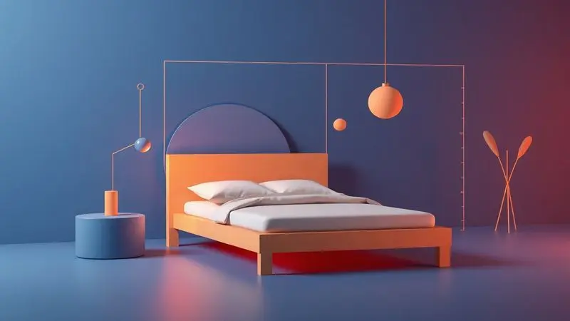

Encontrar o descanso perfeito é uma busca constante que começa com o equipamento certo. Para o quarto principal, os colchões king size de molas ensacadas representam o ápice do conforto e do cuidado com a saúde.

Imagine dormir sem sentir o movimento do parceiro ao seu lado, com cada parte do colchão adaptando-se ao seu corpo, oferecendo estabilidade e suporte anatômico personalizado. Esta tecnologia transforma o sono em uma experiência individualizada.

Neste guia, selecionamos 11 modelos que não apenas apresentam números e dimensões, mas traduzem características técnicas em benefícios emocionais concretos.

Analisamos desde a altura e densidade até os tratamentos de tecido que promovem higiene e frescor, tudo para ajudar você a fazer a melhor escolha para sua saúde e bem-estar.

<SummaryList products={frontmatter.top_products} />

## Os Melhores Colchões King Size de Molas Ensacadas

Os colchões king size de molas ensacadas não são apenas uma escolha popular. São a resposta para quem busca conforto que respeita a individualidade.

Eles se adaptam ao corpo como um abraço personalizado, minimizando a transferência de movimento para que cada pessoa tenha seu espaço de descanso intacto, ideal para casais.

### 1. Colchão King Mola Ensacada Probel Excede Premium

<ProductBox 
  title={frontmatter.top_products[0].title} 
  image={frontmatter.top_products[0].image} 
  link={frontmatter.top_products[0].link} 
/>

Imagine acordar sem dor, com o corpo bem alinhado depois de horas de descanso.

O Colchão King Mola Ensacada Probel Excede Premium oferece essa experiência através de suas dimensões generosas de 193 cm de largura e 203 cm de comprimento, combinadas com uma altura de 30 cm que cria uma superfície ampla para relaxamento total.

Sua tecnologia de molas ensacadas individualizadas significa que cada parte do colchão se adapta ao seu corpo, proporcionando isolamento de movimento perfeito para casais.

A firmeza classificada como robusta é ideal para quem prefere um suporte mais sólido, enquanto o Pillow Super adiciona uma camada extra de suavidade que contrasta com a estrutura firme.

As espumas de alta densidade garantem que você não precise trocar o colchão após poucos anos, oferecendo durabilidade que se transforma em economia. Para alguns, essa rigidez pode ser intensa, mas para quem valoriza apoio consistente, é a definição de conforto.

<CaixaProsContras>

**Prós:**

- Molas ensacadas que oferecem suporte personalizado.

- Design ergonômico que ajuda na postura durante o sono.

- Alívio de pontos de pressão, prevenindo desconfortos.

- Tecnologia "no turn" que facilita a manutenção.

**Contras:**

- Nível de firmeza pode ser excessivo para alguns.

- Peso máximo por pessoa limitado a 120 kg.

</CaixaProsContras>

### 2. Colchão King Mola Ensacada Probel Versailles Ultra Gel

<ProductBox 
  title={frontmatter.top_products[1].title} 
  image={frontmatter.top_products[1].image} 
  link={frontmatter.top_products[1].link} 
/>

Para quem vive em regiões mais quentes ou simplesmente deseja frescor constante durante a noite, este modelo traz tecnologia que transforma o calor em conforto.

O Colchão King Mola Ensacada Probel Versailles Ultra Gel combina molas ensacadas individualmente com a tecnologia HR Gel, que proporciona frescor contínuo enquanto se adapta aos contornos do seu corpo.

A superfície acolchoada com Pillow Euro cria uma sensação de entrada em um espaço premium. A firmeza pode ser um ajuste necessário para alguns, mas para quem busca suporte que mantém a postura correta durante o sono, essa característica se torna um aliado.

Com dimensões generosas que acomodam bem o espaço king size, ele é ideal para quem valoriza noites tranquilas e revigorantes sem a sensação de calor excessivo.

<CaixaProsContras>

**Prós:**

- Sistema de molas ensacadas que oferece suporte individualizado.

- Tecnologia HR Gel que regula a temperatura e aumenta o conforto.

- Design ergonômico que melhora a postura durante o sono.

- Alta durabilidade com garantia de até 12 meses.

**Contras:**

- Pode ser considerado firme para alguns usuários.

- Requer girar periodicamente para manutenção, mas não é necessário virar.

</CaixaProsContras>

### 3. Colchão King Mola Ensacada Probel Bari

<ProductBox 
  title={frontmatter.top_products[2].title} 
  image={frontmatter.top_products[2].image} 
  link={frontmatter.top_products[2].link} 
/>

Se você e seu parceiro têm biotipos diferentes, este colchão oferece a solução para um sono harmonioso sem comprometer o apoio individual.

O Colchão King Mola Ensacada Probel Bari se adapta aos contornos de cada corpo através de seu sistema de molas ensacadas individualmente, garantindo alinhamento adequado da coluna enquanto minimiza completamente a transferência de movimento.

O nível de firmeza intermediário proporciona o equilíbrio perfeito entre maciez e suporte. Imagine a sensação de dormir em uma superfície que não é nem demasiadamente dura nem excessivamente mole.

Espumas de alta qualidade como D28 garantem que esse equilíbrio se mantenha por anos. A tecnologia "No turn" transforma a manutenção em uma tarefa simples, dispensando a necessidade de virar o colchão.

Como um produto premium, seu investimento pode ser maior, mas quando você considera a qualidade e durabilidade que oferece noites tranquilas e revigorantes consistentes, ele se torna uma escolha que protege seu descanso.

<CaixaProsContras>

**Prós:**

- Molas ensacadas proporcionam adaptação ao corpo.

- Nível de firmeza intermediário equilibra conforto e suporte.

- Tecnologia "No turn" facilita a manutenção.

- Tecido hipoalergênico promove um ambiente saudável.

**Contras:**

- Não é a opção mais acessível do mercado.

- Pode não atender quem prefere colchões mais firmes.

</CaixaProsContras>

### 4. Colchão King Mola Probel Siena

<ProductBox 
  title={frontmatter.top_products[3].title} 
  image={frontmatter.top_products[3].image} 
  link={frontmatter.top_products[3].link} 
/>

Para quem aprecia firmeza como base do conforto, este modelo oferece suporte adaptável através do sistema de molejo Prolastic. O Colchão King Mola Probel Siena proporciona uma experiência intermediária com 28 cm de altura que facilita entrar e sair da cama.

Suas dimensões de 193 cm de largura e 203 cm de comprimento são perfeitas para casais com biotipos semelhantes, suportando até 110 kg por pessoa.

O Pillow Super acrescenta uma camada extra de conforto que complementa a estrutura firme, enquanto espumas de diferentes densidades garantem acolhimento adequado para diferentes partes do corpo.

Com certificação do Inmetro e garantia de 12 meses, você dorme com a tranquilidade de saber que seu investimento é protegido. Essa firmeza pode não agradar todos os gostos, mas para quem valoriza apoio consistente, ele cumpre bem seu propósito.

<CaixaProsContras>

**Prós:**

- Sistema de molejo Prolastic que oferece suporte firme.

- Pillow Super proporciona uma camada extra de conforto.

- Altura adequada para conforto ao entrar e sair da cama.

- Certificação do Inmetro garante qualidade e segurança.

**Contras:**

- Suporte firme pode não ser ideal para todos os gostos.

- Limitação na capacidade de peso para pessoas mais pesadas.

</CaixaProsContras>

### 5. Colchão King Mola Ensacada Probel Passione Bambu

<ProductBox 
  title={frontmatter.top_products[4].title} 
  image={frontmatter.top_products[4].image} 
  link={frontmatter.top_products[4].link} 
/>

Imagine dormir em uma superfície que não apenas se adapta ao seu corpo, mas também protege sua saúde através de materiais que combatem alergias.

O Colchão King Mola Ensacada Probel Passione Bambu, com 26 cm de altura, é equipado com molas ensacadas individualmente que garantem adaptação ao corpo enquanto reduzem a transmissão de movimento entre parceiros.

A firmeza intermediária equilibra maciez e suporte eficaz para diversos biotipos. Espumas densas, D28 e ≥ D65, com tratamento antiácaro e antifungo criam um ambiente seguro, enquanto o Pillow Super proporciona uma camada extra de conforto.

O tecido de poliéster é hipoalergênico, respirável e antialérgico, ideal para quem busca higiene no sono. Ele suporta até 110 kg por pessoa, um limite que pode ser considerado para casais com biotipos mais elevados.

Com garantia de 12 meses e certificação do Inmetro, ele reforça sua qualidade como um investimento em saúde.

<CaixaProsContras>

**Prós:**

- Conforto personalizado graças às molas ensacadas

- Firmeza intermediária que atende a diferentes preferências

- Tratamentos antiácaro e antifungo para maior higiene

- Hipoalergênico e respirável

**Contras:**

- Limite de peso de 110 kg por pessoa pode não ser suficiente em todos os casos

- Pode não ser a escolha mais econômica do mercado

</CaixaProsContras>

### 6. Colchão King Mola Probel Prohotel Casa

<ProductBox 
  title={frontmatter.top_products[5].title} 
  image={frontmatter.top_products[5].image} 
  link={frontmatter.top_products[5].link} 
/>

Para quem busca firmeza como fundamento do conforto, este modelo combina suporte robusto com elementos que transformam rigidez em acolhimento.

O Colchão King Mola Probel Prohotel Casa utiliza seu sistema de molas Prolastic para adaptar-se ao corpo, promovendo alinhamento da coluna essencial para quem passa horas dormindo.

Camadas de espuma de alta densidade proporcionam suporte durável, disponível nas opções de firme ou extra firme, ideal para casais com biotipos semelhantes. O Pillow Box adiciona uma camada extra de conforto sem comprometer o apoio estrutural.

Para alguns, essa firmeza pode ser intensa, mas para quem valoriza suporte consistente, é uma experiência que transforma o sono. A manutenção simplificada pelo sistema "No Turn" significa que você apenas gira o colchão, uma tarefa mínima para preservar seu investimento.

<CaixaProsContras>

**Prós:**

- Sistema de molas que adapta-se ao corpo.

- Boa durabilidade devido às espumas de alta densidade.

- Camada extra de conforto com Pillow Box.

- Tratamento contra ácaros e fungos.

**Contras:**

- Pode ser muito firme para quem busca um colchão mais macio.

- Não é necessário virar, apenas girar, mas isso pode limitar a manutenção.

</CaixaProsContras>

### 7. Colchão King Mola Probel Volare Luxo

<ProductBox 
  title={frontmatter.top_products[6].title} 
  image={frontmatter.top_products[6].image} 
  link={frontmatter.top_products[6].link} 
/>

Para casais com biotipos semelhantes que valorizam suporte firme como base do conforto, este modelo oferece dimensões generosas de 193 cm de largura e 203 cm de comprimento.

O Colchão King Mola Probel Volare Luxo utiliza o sistema de molejo Mola Prolastic que garante suporte adaptável enquanto promove o alinhamento da coluna. O nível de firmeza é classificado como robusto, ideal para quem busca consistência no apoio.

Com capacidade para suportar até 120 kg por pessoa, ele oferece segurança estrutural. O pillow super adiciona uma camada extra de suavidade que complementa a firmeza, enquanto espumas de alta densidade prometem proporcionar noites bem dormidas por anos.

A manutenção simplificada (não precisa ser virado) transforma o cuidado em uma tarefa mínima.

<CaixaProsContras>

**Prós:**

- Conforto superior com um pillow super.

- Sistema de molejo que se adapta ao corpo.

- Ideal para casais com biotipos semelhantes.

- Boa relação custo-benefício.

**Contras:**

- Nível de firmeza pode não agradar a todos.

- Disponível apenas em tamanhos King Size.

</CaixaProsContras>

### 8. Colchão King Mola Ensacada Probel Cairo Ultra Gel

<ProductBox 
  title={frontmatter.top_products[7].title} 
  image={frontmatter.top_products[7].image} 
  link={frontmatter.top_products[7].link} 
/>

Para quem busca elasticidade e firmeza em uma combinação que respeita o corpo, este modelo oferece uma experiência única.

O Colchão King Mola Ensacada Probel Cairo Ultra Gel adapta-se ao corpo através de molas ensacadas individualmente, oferecendo suporte preciso e alívio de pressão.

A combinação de espumas HR Gel D45 e D33 traz elasticidade que acompanha seus movimentos enquanto mantém firmeza estrutural. O Euro Pillow proporciona uma camada extra de suavidade que transforma o contato com a superfície.

Com altura de 30 cm e tecido de malha respirável, ele mantém temperatura agradável durante a noite, evitando aquela sensação de calor excessivo que pode interromper o descanso.

O nível de firmeza intermediário a firme pode não ser ideal para quem prefere colchões bem macios, mas se qualidade e durabilidade são suas prioridades, este modelo atende com excelência.

<CaixaProsContras>

**Prós:**

- Molas ensacadas que oferecem suporte personalizado.

- Espumas de alta resiliência que proporcionam conforto superior.

- Tecido respirável que mantém a temperatura agradável.

- Garantia de 12 meses para molas e espuma.

**Contras:**

- Nível de firmeza pode não agradar quem prefere colchões mais macios.

- Opção de manutenção limitada, exigindo apenas giro.

</CaixaProsContras>

### 9. Colchão King Herval Imperatore Eco Bamboo

<ProductBox 
  title={frontmatter.top_products[8].title} 
  image={frontmatter.top_products[8].image} 
  link={frontmatter.top_products[8].link} 
/>

Para quem valoriza sustentabilidade e conforto superior, este modelo oferece uma experiência que conecta cuidado ambiental com saúde pessoal.

O colchão King Herval Imperatore Eco Bamboo minimiza a transferência de movimento através de molas ensacadas individualmente, garantindo um sono tranquilo mesmo quando compartilhado.

A tecnologia de espuma viscoelástica, inspirada na NASA, molda-se ao corpo oferecendo suporte e aliviando pontos de pressão. Essa adaptação pode ser um diferencial importante para quem sofre com desconforto durante a noite.

O tecido em fibras de bambu proporciona um toque macio enquanto é naturalmente antibacteriano e antifúngico, ideal para quem tem alergias ou busca um ambiente mais higiênico.

O uso em apenas um lado simplifica os cuidados com o produto, mas pode limitar sua durabilidade em comparação com modelos que podem ser invertidos.

<CaixaProsContras>

**Prós:**

- Conforto superior com molas ensacadas.

- Espuma viscoelástica que reduz pressão.

- Tecido em fibras de bambu com propriedades antibacterianas.

- Produzido com materiais sustentáveis.

**Contras:**

- Uso em apenas um lado pode limitar a durabilidade.

- Altura do colchão pode ser maior do que o padrão.

</CaixaProsContras>

### 10. Colchão King Kappesberg Comfort Roll

<ProductBox 
  title={frontmatter.top_products[9].title} 
  image={frontmatter.top_products[9].image} 
  link={frontmatter.top_products[9].link} 
/>

Para quem busca praticidade combinada com conforto duradouro, este modelo oferece uma solução que simplifica desde o transporte até o uso diário.

O Colchão King Kappesberg Comfort Roll minimiza a transferência de movimento através de molas ensacadas individualmente, garantindo uma noite de sono tranquila para casais ou pessoas que se mexem muito.

Espuma de alta densidade (D33) proporciona durabilidade e suporte necessário, enquanto o Pillow Top One Side oferece uma camada extra de maciez que transforma a experiência de descanso.

Sua embalagem a vácuo facilita o transporte e instalação, eliminando a complexidade de mover um colchão tradicional. Embora considerado firme, muitos usuários acham essa firmeza ideal para um bom suporte.

As dimensões típicas são 193x203cm, mas verifique as variantes existentes para garantir compatibilidade com seu espaço.

<CaixaProsContras>

**Prós:**

- Molas ensacadas para menor transferência de movimento.

- Estrutura durável com espuma D33.

- Pillow Top para maior conforto.

- Embalagem a vácuo para facilitar o transporte.

**Contras:**

- Pode ser considerado firme demais para quem prefere colchões mais macios.

- Disponibilidade de apenas um lado utilizável pode limitar opções de rotação.

</CaixaProsContras>

### 11. Conjunto Box + Colchão King Herval C1624

<ProductBox 
  title={frontmatter.top_products[10].title} 
  image={frontmatter.top_products[10].image} 
  link={frontmatter.top_products[10].link} 
/>

Para quem busca uma solução completa que une conforto com sustentabilidade, este conjunto oferece robustez desde a base até a superfície.

O Conjunto Box + Colchão King Herval C1624 distribui peso uniformemente através de molas ensacadas, minimizando a transferência de movimento enquanto oferece apoio consistente.

O Pillow Top One Side elimina a necessidade de virar o colchão, facilitando cuidados e manutenção. A EcoSpuma®, uma espuma de alta densidade sustentável, proporciona durabilidade que respeita o ambiente enquanto oferece conforto.

A base box em madeira de Eucalipto Rosa pode ter diferentes acabamentos incluindo Suede Clean, combinando robustez com estética moderna. Com capacidade para suportar até 130 kg por pessoa, é resistente e adequada para casais.

As dimensões do conjunto são bem específicas (geralmente 193x203 cm), então verifique se caberá no seu espaço para aproveitar totalmente sua funcionalidade.

<CaixaProsContras>

**Prós:**

- Molas ensacadas garantem conforto superior.

- Pillow Top facilita a manutenção.

- EcoSpuma® é uma opção sustentável.

- Base robusta e moderna.

**Contras:**

- Dimensões específicas podem não se adequar a todos os ambientes.

- Variação na garantia da base box pode causar confusão.

</CaixaProsContras>

## Tecnologia e Materiais

A tecnologia presente nos colchões king size de molas ensacadas transforma características técnicas em experiências emocionais concretas.

Molas ensacadas individuais adaptam-se ao contorno do corpo como um abraço personalizado, reduzindo a transferência de movimento para que cada pessoa tenha seu espaço de descanso intacto. Essa individualização é especialmente valiosa para casais.

A combinação de materiais como espuma de alta densidade e viscoelástica oferece um toque macio que não compromete firmeza. Essa sinergia não apenas melhora a ergonomia, mas também ajuda na circulação do ar, evitando o acúmulo de calor durante a noite.

Imagine dormir sem aquela sensação de abafamento que interrompe o descanso. A durabilidade dos materiais utilizados garante um investimento que protege seu sono por muitos anos.

## Especificações Técnicas

As especificações técnicas dos colchões king size de molas ensacadas traduzem números em benefícios tangíveis. Múltiplas camadas, incluindo espuma de alta densidade, dispersam o peso do corpo para prevenir pontos de pressão que causam desconforto.

Molas ensacadas proporcionam individualidade de movimento, permitindo que cada lado do colchão responda de forma independente aos movimentos durante a noite.

Tecnologia de resfriamento e tecidos hipoalergênicos aumentam não apenas durabilidade, mas também a sensação de cuidado com sua saúde. A profundidade dos colchões varia entre 25 a 35 cm, adequando-se a diferentes preferências de firmeza.

Escolher a altura adequada significa facilidade ao entrar e sair da cama, uma consideração prática que impacta seu conforto diário.

## Cuidados e Manutenção

Manter um colchão king size de molas ensacadas em bom estado é uma prática que prolonga sua vida útil enquanto protege seu investimento em descanso.

Virar o colchão regularmente, a cada três meses, previne deformações e desgaste irregular, garantindo que cada parte da superfície ofereça apoio consistente.

Utilizar um protetor de colchão ajuda a prevenir manchas e acumulação de sujeira, mantendo um ambiente higiênico para seu sono. Limpar ocasionalmente com um aspirador de pó remove poeira e alérgenos que podem afetar sua saúde respiratoria.

Evitar pular ou sentar com força nas bordas protege a estrutura das molas, preservando a funcionalidade que garante conforto.

Com esses cuidados simples, seu colchão poderá oferecer noites de sono agradáveis por muitos anos, transformando manutenção em preservação da qualidade do seu descanso.

## Manual do Sono Ortobom

O Manual do Sono Ortobom é um guia que transforma conhecimento técnico em práticas que melhoram sua qualidade de vida. Ele aborda ergonomia, saúde postural e a importância de escolher o colchão adequado como fundamentos para um descanso reparador.

O manual destaca os benefícios das molas ensacadas que oferecem suporte individualizado e reduzem a transferência de movimento, ideal para casais que buscam harmonia no sono.

Além disso, orienta sobre a manutenção do colchão e como cuidar adequadamente de sua superfície para prolongar sua vida útil.

Com dicas práticas, esse manual se torna uma valiosa ferramenta para garantir noites de descanso reparador e um sono verdadeiramente rejuvenecedor.

## Conclusão

Escolher o colchão king size de molas ensacadas perfeito é uma decisão que transforma números e especificações em experiências emocionais concretas.

Cada modelo apresentado oferece uma combinação única de tecnologia, materiais e cuidados que convergem para um objetivo comum: proporcionar descanso que respeita sua individualidade.

As molas ensacadas não são apenas uma característica técnica, são a garantia que você não sentirá o movimento do parceiro ao seu lado, criando um espaço de descanso pessoal dentro da cama compartilhada.

As diferentes firmezas atendem às preferências pessoais que definem como você deseja ser apoiado durante a noite. Os tratamentos antiácaros e hipoalergênicos protegem sua saúde enquanto dorme.

Esta seleção curada com os 11 melhores modelos de 2025 oferece caminhos distintos para alcançar o mesmo resultado: noites de sono que rejuvenescem, aliviam pontos de pressão e promovem bem-estar.

Independentemente da escolha específica, o investimento em um colchão king size de molas ensacadas é um compromisso com sua saúde e qualidade de vida. O descanso perfeito começa com o equipamento que adapta-se a você, não você ao equipamento.