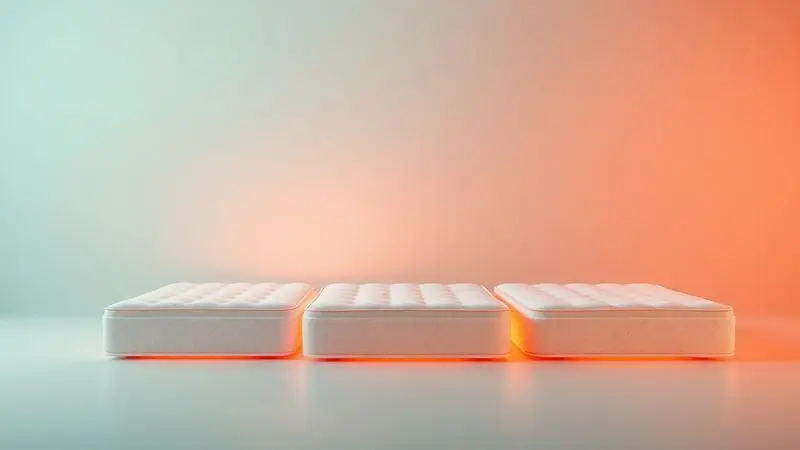
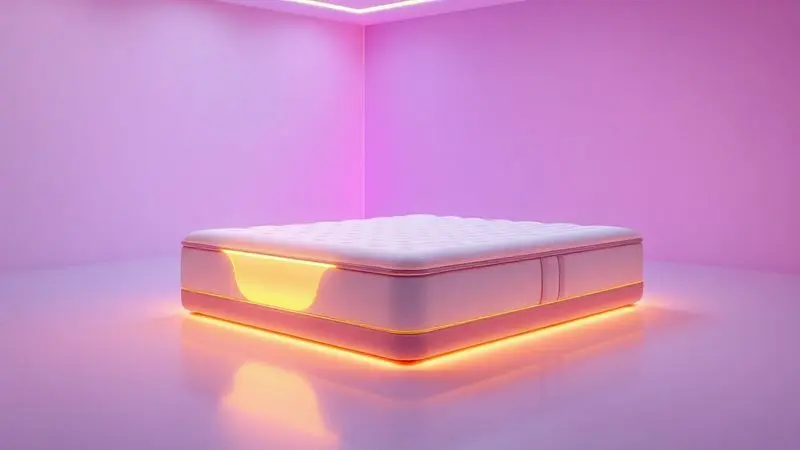
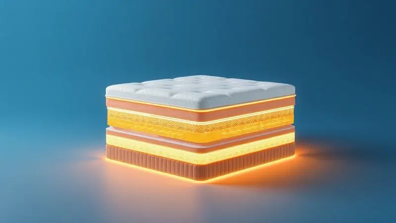

Escolher o colchão certo é fundamental para garantir uma boa noite de sono e a saúde da sua coluna. A Orthocrin, marca tradicional no mercado brasileiro, oferece uma vasta gama de modelos que atendem a diferentes necessidades e biotipos.

Neste guia, analisamos minuciamente os melhores colchões Orthocrin disponíveis em 2025, desde opções de espuma com variadas densidades até modelos com molas ensacadas e tecnologia viscoelástica.

Se você busca durabilidade, conforto e o melhor custo-benefício, continue lendo para descobrir qual o modelo perfeito para transformar o seu descanso diário.

<SummaryList products={frontmatter.top_products} />

## Ranking dos Melhores Colchões Orthocrin para Comprar em 2025

O ranking de colchões Orthocrin de 2025 traz opções que combinam conforto e suporte ideal para uma boa noite de sono. Confira as características que tornam cada modelo único e escolha o melhor para você.

### 1. Colchão Espuma Viscoelástico Serenity Visco Euro Pillow - Orthocrin

<ProductBox 
  title={frontmatter.top_products[0].title} 
  image={frontmatter.top_products[0].image} 
  link={frontmatter.top_products[0].link} 
/>

Imagine acordar sem aquela dor nas costas que te acompanha desde que você se levantou.

O Serenity Visco Euro Pillow da Orthocrin traz essa possibilidade através de sua espuma viscoelástica que se molda aos contornos do seu corpo, dissipando a pressão em pontos críticos como ombros e quadril.

A camada extra de Euro Pillow oferece aquela sensação de nuvem que você busca sem comprometer o suporte, enquanto o tecido de malha de bamboo trabalha silenciosamente para manter a temperatura equilibrada e criar um ambiente mais resistente aos ácaros, perfeito para quem tem alergias.

Com nível de conforto firme e capacidade para até 150 kg por pessoa, ele traz certificação do Inmetro. Algumas versões podem estar fora de linha, mas isso não diminui sua qualidade como uma escolha inteligente para quem quer equilíbrio entre adaptabilidade e estrutura.

<CaixaProsContras>

**Prós:**

- Espuma viscoelástica que se adapta ao corpo

- Camada Euro Pillow para mais conforto

- Tecido de malha de bamboo com propriedades térmicas

- Suporta até 150 kg por pessoa

**Contras:**

- Algumas versões podem estar fora de linha

- Pode não ser a melhor escolha para quem prefere colchões extremamente macios

</CaixaProsContras>

### 2. Colchão Molas Ensacadas Visco MasterPocket Supreme Plus Pillow Top - Orthocrin

<ProductBox 
  title={frontmatter.top_products[1].title} 
  image={frontmatter.top_products[1].image} 
  link={frontmatter.top_products[1].link} 
/>

Você já se levantou porque seu parceiro se mexeu durante a noite? O MasterPocket Supreme Plus Pillow Top resolve essa questão com molas ensacadas individualmente que isolam movimentos, garantindo que cada movimento seja seu próprio.

A camada de espuma viscoelástica completa a experiência, adaptando-se aos seus contornos para aliviar pressão e promover circulação sanguínea adequada.

O pillow top é como um abraço extra de maciez, enquanto o tecido em malha de bamboo regula a temperatura e combate bactérias.

Com cerca de 32 cm de altura, ele pode demandar ajustes em móveis mais baixos, mas essa dimensão é o resultado de um acúmulo de tecnologias que transformam sua cama em um santuário de descanso.

<CaixaProsContras>

**Prós:**

- Suporte personalizado com molas ensacadas.

- Camada de espuma viscoelástica que alivia pressão.

- Pillow top para um toque extra de conforto.

- Tecido com propriedades antibacterianas e de regulação térmica.

**Contras:**

- Altura considerável que pode dificultar o uso em móveis baixos.

- Pode não ser a escolha ideal se você preferir colchões mais firmes.

</CaixaProsContras>

### 3. Colchão para Hotelaria Molas Miracoil Royal Saúde Anatomic Plus Size Euro Pillow - Orthocrin

<ProductBox 
  title={frontmatter.top_products[2].title} 
  image={frontmatter.top_products[2].image} 
  link={frontmatter.top_products[2].link} 
/>

O que os hoteles de luxo escolhem para garantir que seus clientes acordem revitalizados?

Este modelo com molas ensacadas Miracoil oferece suporte individualizado tão preciso que parece feito sob medida, especialmente para pessoas com maior peso ou que apreciam uma base firme.

A camada de Euro Pillow entra como um contraponto de suavidade, criando uma experiência balanceada.

A estrutura com espuma de alta densidade e revestimento em malha soft com tratamento antiácaro e antifungo cria um ambiente limpo que você pode replicar em casa.

A firmeza pode ser intensa para quem busca maciez total, mas essa característica é precisamente o que oferece resistência e suporte que dura anos.

<CaixaProsContras>

**Prós:**

- Conforto superior com molas Miracoil.

- Revestimento antiácaro e antifungo.

- Estrutura durável com espuma de alta densidade.

- Disponível em tamanhos variados.

**Contras:**

- Nível de firmeza pode ser alto para alguns usuários.

- Não é necessário virar, o que pode limitar opções de uso.

</CaixaProsContras>

### 4. Colchão Espuma D33 Royal Saúde Plus Pró Saúde Euro Pillow - Orthocrin

<ProductBox 
  title={frontmatter.top_products[3].title} 
  image={frontmatter.top_products[3].image} 
  link={frontmatter.top_products[3].link} 
/>

A busca por firmeza ideal sem sacrificar o toque agradável encontra resposta aqui. Com dimensões de 138x188cm e 24cm de altura, este colchão suporta até 110 kg por pessoa enquanto o Pillow Top Americano oferece uma capa de maciez que acolhe seu corpo.

O revestimento em fibras de bambu trabalha como um sistema de climatização pessoal, evitando que o calor se acumule durante a noite.

Tratamento antiácaro e antifungo promove um ambiente de sono saudável, e a tecnologia Pro Espuma da Orthocrin garante que essa qualidade se mantenha com o tempo.

É sempre bom verificar as dimensões para garantir o encaixe perfeito no seu espaço, mas essa atenção detalhada reflete o cuidado que a marca tem com cada aspecto do seu descanso.

<CaixaProsContras>

**Prós:**

- Conforto firme ideal para diversos perfis.

- Revestimento em fibras de bambu que melhora a respirabilidade.

- Tratamento antiácaro e antifungo para uma melhor higiene.

- Garantia de 12 meses, refletendo a confiança da marca.

**Contras:**

- Pode ser pesado para manuseio.

- A densidade D33 pode não ser ideal para quem prefere colchões mais macios.

</CaixaProsContras>

### 5. Colchão Espuma D45 Royal Saúde Plus Pró Saúde Pillow Top - Orthocrin

<ProductBox 
  title={frontmatter.top_products[4].title} 
  image={frontmatter.top_products[4].image} 
  link={frontmatter.top_products[4].link} 
/>

Se você sente que seu colchão atual não oferece o apoio que sua coluna precisa, a densidade D45 traz a resposta. Esta espuma de poliuretano de alta densidade mantém sua forma ano após ano, certificada pelo selo Pró-Espuma e INMETRO.

A camada de Pillow Top não é apenas um detalhe, é um convite para um conforto extra que transforma a firmeza em experiência agradável.

O tecido em Jacquard com fios de bambu oferece resistência e propriedades antiácaro e antifungo, criando uma escolha saudável.

Com capacidade para até 150 kg por pessoa, ele pode não ser para quem busca maciez absoluta, mas se estabilidade é sua prioridade, este modelo cumpre seu papel com maestria.

<CaixaProsContras>

**Prós:**

- Conforto firme ideal para alinhamento postural.

- Espuma de alta densidade D45 com selo de qualidade.

- Tecido resistente com propriedades antiácaro.

- Camada Pillow Top para maior conforto.

**Contras:**

- Não é indicado para quem prefere colchões muito macios.

- A altura pode variar conforme o modelo específico.

</CaixaProsContras>

### 6. Colchão Ortopédico Wood Orthoclínico Ouro Plus Pró Saúde Euro Pillow - Orthocrin

<ProductBox 
  title={frontmatter.top_products[5].title} 
  image={frontmatter.top_products[5].image} 
  link={frontmatter.top_products[5].link} 
/>

A estrutura ortopédica em madeira de eucalipto, tratada contra cupim e mofo, é como a fundação de uma casa sólida para seu sono.

O Euro Pillow oferece o toque macio que seu corpo espera, enquanto o nível extra firme e capacidade para 150 kg por pessoa garantem que essa fundação não cede. Para quem prioriza uma postura correta durante a noite, essa combinação é reveladora.

A firmeza pode ser intensa para quem prefere sensações mais suaves, mas essa mesma característica é o que proporciona o suporte que sua coluna precisa para descansar verdadeiramente.

<CaixaProsContras>

**Prós:**

- Estrutura ortopédica que oferece suporte firme.

- Tecido Jacquard com fio de bambu que proporciona frescor e durabilidade.

- Camada Euro Pillow para maior conforto.

- Tratamento antiácaro e antifungo que aumenta a higiene.

**Contras:**

- Firmeza excessiva para quem prefere colchões mais macios.

- Disponível em tamanhos limitados.

</CaixaProsContras>

### 7. Colchão Ortopédico Wood Orthoclínico Ouro Azul - Orthocrin

<ProductBox 
  title={frontmatter.top_products[6].title} 
  image={frontmatter.top_products[6].image} 
  link={frontmatter.top_products[6].link} 
/>

A combinação de 5 cm de espuma D28 com base de madeira de eucalipto tratada cria uma plataforma de suporte que mantém seu alinhamento postural intacto.

Classificado como "extra firme" e com revestimento de algodão com propriedades antiácaro e antifungo, ele é um refúgio para quem tem alergias e busca estrutura robusta.

Disponível em diversos tamanhos, sua rigidez pode demandar um período de adaptação, mas essa mesma rigidez é o que oferece a consistência que muitos buscam para dormir sem preocupações com cedência ou deformação.

<CaixaProsContras>

**Prós:**

- Estrutura firme que promove bom alinhamento postural.

- Material de alta qualidade, com madeira tratada.

- Tecido antiácaro e antifungo para maior conforto.

- Disponível em vários tamanhos para diferentes configurações.

**Contras:**

- A rigidez pode não agradar a todos os perfis de sono.

- Pode demandar um período de adaptação para quem nunca usou colchões firmes.

</CaixaProsContras>

### 8. Colchão Ortopédico Wood Orthoclínico Ouro Pró Saúde - Orthocrin

<ProductBox 
  title={frontmatter.top_products[7].title} 
  image={frontmatter.top_products[7].image} 
  link={frontmatter.top_products[7].link} 
/>

Quando a pressão na coluna se acumula ao longo do dia, você precisa de uma estrutura que trabalhe contra essa tensão durante a noite.

A estrutura ortopédica deste modelo ajuda a manter a postura correta enquanto a madeira tratada contra cupins e mofo garante que esse suporte permaneça intacto por anos.

A espuma de densidade D28 oferece consistência, e o tratamento antiácaro e antifungo no tecido transforma seu espaço de descanso em um ambiente mais saudável.

A classificação extra firme pode não agradar todos os gostos, mas para quem precisa de apoio extra durante a noite, essa característica é um aliado silencioso contra as dores que surgem ao amanhecer.

<CaixaProsContras>

**Prós:**

- Suporte eficaz para a coluna vertebral.

- Estrutura de madeira tratada, aumentando a durabilidade.

- Espuma de alta densidade proporciona conforto.

- Tratamento antiácaro e antifungo que melhora a saúde do sono.

**Contras:**

- O colchão é classificado como extra firme, o que pode não agradar todos os usuários.

- Disponibilidade variável em diferentes tamanhos.

</CaixaProsContras>

### 9. Colchão Espuma D33 Diamante - Orthocrin

<ProductBox 
  title={frontmatter.top_products[8].title} 
  image={frontmatter.top_products[8].image} 
  link={frontmatter.top_products[8].link} 
/>

A firmeza aqui não é apenas uma característica, é uma garantia de suporte para sua coluna que permanece com o tempo.

Com certificação D33 e capacidade para até 100 kg por pessoa (alguns modelos atendem pesos maiores), ele oferece durabilidade enquanto o tecido tratado contra ácaros e bactérias cria um ambiente de sono saudável.

A opção duplo-face em muitos modelos é um presente para a vida útil do produto, permitindo que você reveze as superfícies.

A rigidez pode ser intensa para quem busca maciez, mas para quem valoriza um suporte firme que não se deforma, essa característica é o diferencial que justifica o investimento.

<CaixaProsContras>

**Prós:**

- Firmeza ideal para suporte da coluna

- Tratamento antiácaro e antifungo

- Durabilidade devido à alta densidade D33

- Modelos com dupla face, aumentando a vida útil

**Contras:**

- Pode ser considerado rígido para quem prefere colchões mais macios

- Limitação de peso em alguns modelos menores

</CaixaProsContras>

### 10. Colchão Espuma D20 Platinum - Orthocrin

<ProductBox 
  title={frontmatter.top_products[9].title} 
  image={frontmatter.top_products[9].image} 
  link={frontmatter.top_products[9].link} 
/>

Para quem pesa até 50 kg e busca um nível de firmeza intermediário que mantém a coluna alinhada sem ser agressivo, o D20 Platinum é a resposta.

Sua densidade oferece suporte adequado enquanto o revestimento em poliéster tratado para ser antiácaro, antialérgico e antimofo contribui para um ambiente mais saudável.

A praticidade do uso duplo-face aumenta sua durabilidade, e o custo acessível torna-o um investimento inteligente.

Ele pode não satisfazer quem busca maciez extrema, mas seu suporte firme e qualidade superior fazem dele um aliado para quem prioriza saúde postural sem comprometer o budget.

<CaixaProsContras>

**Prós:**

- Conforto intermediário ideal para suportar a coluna.

- Revestimento antiácaro e antimofo.

- Durabilidade com uso de materiais de alta qualidade.

- Versatilidade por ser duplo face.

**Contras:**

- Pode não atender quem busca um colchão muito macio.

- Suporta até 50 kg por pessoa, limitando seu uso em casos de maior peso.

</CaixaProsContras>

## Colchões Orthocrin

Com tantas opções, como entender o DNA da Orthocrin? A marca se especializa em criar produtos que traduzem tecnologia avançada em experiências de descanso personalizadas.

Cada modelo que você viu neste ranking representa uma resposta diferente para necessidades específicas: do suporte ortopédico preciso ao alívio de pressão inteligente, da regulação térmica eficiente à durabilidade que resiste ao tempo.

Materiais como espuma viscoelástica e molas ensacadas não são apenas componentes técnicos, são ferramentas que a marca usa para garantir que sua coluna encontre o alinhamento ideal enquanto seu corpo desfruta do conforto necessário.

Essa combinação de precisão e cuidado faz da Orthocrin uma escolha confiável quando você decide investir em uma boa noite de sono que se repete, ano após ano.

## Qual o melhor colchão da Orthocrin?

A resposta para "qual é o melhor" depende menos do produto e mais de você. A Orthocrin oferece tecnologia que se adapta, mas sua escolha deve considerar três pilares: firmeza desejada, tipo de material que conversa com seu corpo e suas necessidades pessoais de sono.

Os modelos de espuma viscoelástica são como um abraço personalizado que se ajusta aos seus contornos, enquanto os com molas ensacadas isolam movimentos para que você e seu parceiro tenham espaços de descanso independentes.

Experimentar diferentes opções em uma loja física não é apenas um passo, é uma conversa entre seu corpo e o produto, garantindo que a escolha final seja a mais acertada para suas noites.

## Diferença entre o tamanho dos colchões

Escolher o tamanho certo é como definir o espaço onde seu descanso acontece. Os modelos solteiro (cerca de 88 cm de largura) são ideais para crianças ou quartos compactos, enquanto o casal tradicional (138 cm) funciona para casais que não demandam amplitude extra.

Quando o espaço permite, os modelos queen (158 cm) e king size (193 cm) oferecem a liberdade de movimento que transforma o sono em uma experiência mais expansiva.

Essa decisão impacta diretamente na qualidade do seu descanso e na disposição que você terá ao amanhecer. Um tamanho inadequado pode criar restrições invisíveis que seu corpo sente durante toda a noite.

## Qual é o melhor colchão para a coluna?

O melhor colchão para sua coluna é aquel que respeita sua individualidade enquanto oferece suporte inteligente. Espuma viscoelástica molda-se ao seu corpo para aliviar pontos de pressão e manter o alinhamento natural.

Molas ensacadas oferecem suporte individualizado que acolhe diferenças entre parceiros. A ventilação adequada regula temperatura para que seu corpo não precise lutar contra o calor acumulado.

Essa escolha deve ser uma conversa entre seu tipo de corpo, sua posição de dormir e suas preferências pessoais. Quando esses elementos se harmonizam, sua coluna encontra o ambiente perfeito para recuperar-se durante a noite.

## Como escolher o colchão ideal para pessoas com mais de 100 kg?

Para pessoas com mais de 100 kg, a escolha do colchão deve considerar densidade como prioridade. Modelos com maior densidade (espuma ou látex) oferecem suporte adequado e durabilidade que resiste ao uso intensivo.

A firmeza também é crucial, pois colchões mais firmes tendem a proporcionar conforto que não cede com o tempo.

A ventilação merece atenção, pois colchões que mantêm temperatura agradável podem melhorar significativamente a qualidade do sono. Finalmente, experimentar o colchão antes da compra é essencial, pois cada corpo responde de maneira única ao suporte e conforto oferecidos.

## Conclusão

A jornada para encontrar o colchão ideal é mais sobre entender suas necessidades pessoais do que sobre comparar especificações técnicas.

A Orthocrin oferece um espectro de soluções que traduzem densidades, tecnologias de molas e tratamentos antiácaro em experiências de descanso concretas: desde o abraço personalizado da viscoelástica até o suporte estrutural das molas ensacadas, cada modelo é uma resposta para diferentes diálogos entre seu corpo e a necessidade de recuperação.

Este guia não é apenas uma lista, é um mapa que ajuda você a navegar entre firmeza e maciez, tamanho e capacidade, tecnologia e conforto.

Escolher o colchão certo significa investir em anos de descanso qualificado, onde sua coluna encontra apoio e seu corpo desfruta do repouso que merece. Agora que você conhece as opções, o próximo passo é sentir como cada uma conversa com você pessoalmente.

Visite uma loja, experimente diferentes modelos e permita que seu corpo escolha o parceiro de descanso que transformará suas noites.