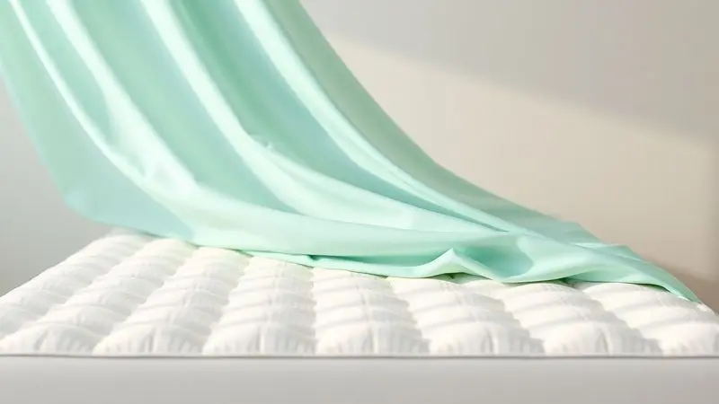

A escolha do colchão ideal para o berço do seu bebê vai muito além de simplesmente comprar um produto - é uma decisão que molda as noites de sono, influencia o desenvolvimento da coluna e, acima de tudo, define um ambiente seguro onde seu pequeno crescerá.

No meio de tantas opções, densidades e certificações, essa tarefa pode parecer assustadora, como tentar escolher uma estrela no céu.

Pensando nisso, percorremos o mercado para trazer a você um guia completo com as 13 melhores opções disponíveis, analisadas não apenas por suas especificações técnicas, mas pelo que realmente importa: a tranquilidade dos pais e o bem-estar dos bebês.

<SummaryList products={frontmatter.top_products} />

## Quais os 13 melhores colchões para berço?

Imagine abrir o quarto do seu bebê e saber que, ali, ele encontra não apenas um lugar para dormir, mas um verdadeiro porto seguro projetado para seu desenvolvimento.

Cada um dos colchões a seguir foi selecionado por atender a uma necessidade específica, seja para famílias que valorizam sustentabilidade, bebês com refluxo ou pais que precisam de praticidade no dia a dia.

### 1. Colchão Infantil Light Saúde Ortobom

<ProductBox 
  title={frontmatter.top_products[0].title} 
  image={frontmatter.top_products[0].image} 
  link={frontmatter.top_products[0].link} 
/>

Quando a preocupação com o meio ambiente se encontra com a busca por um sono saudável, o Colchão Light Saúde da Ortobom aparece como uma resposta elegante.

Feito com espuma de poliol vegetal, ele traz a consciência ecológica para dentro do quarto do bebê, enquanto os tratamentos antiácaro e antifungo trabalham silenciosamente para criar um ambiente protegido.

A magia está nas opções: você pode escolher entre densidades D18 para recém-nascidos ou D28 para crianças maiores, como se o colchão pudesse crescer junto com seu filho.

Com certificação INMETRO e 12 meses de garantia, ele oferece aquela paz de espírito que pais de primeira viagem tanto buscam.

<CaixaProsContras>

**Prós:**

- Tratamento antiácaro e antifungo.

- Feito com espuma ecológica.

- Diversas opções de tamanho e suporte.

- Certificação do INMETRO garantida.

**Contras:**

- Alguns modelos podem ser mais pesados para troca de roupa de cama.

- Opções limitadas para quem busca colchões com tecnologia adicional.

</CaixaProsContras>

### 2. Colchão Infantil Physical Resistente Ortobom

<ProductBox 
  title={frontmatter.top_products[1].title} 
  image={frontmatter.top_products[1].image} 
  link={frontmatter.top_products[1].link} 
/>

Para aquelas mini camas que testemunham as primeiras aventuras da infância, o Colchão Physical Resistente oferece a resiliência necessária.

Com espuma D20 Pró Aditivada, ele suporta até 60 kg de energia pura - pense em todas as brincadeiras, pulos e descobertas que acontecerão sobre ele.

O revestimento em Viscopoli convida ao toque, enquanto os tratamentos antialérgico e antiácaro atuam como guardiões invisíveis.

Sim, ele pede um giro regular para manter sua performance, mas essa pequena rotina de cuidado se torna mais um gesto de carinho pelo sono do seu pequeno.

<CaixaProsContras>

**Prós:**

- Material resistente e de alta performance

- Tratamentos antialérgico e antiácaro

- Conforto intermediário ideal para crianças

- Manutenção simples e fácil

**Contras:**

- Não é recomendado para pesos acima de 60 kg

- Precisa de rotação regular para manter a durabilidade

</CaixaProsContras>

### 3. Colchão Infantil Baby Physical Ortobom

<ProductBox 
  title={frontmatter.top_products[2].title} 
  image={frontmatter.top_products[2].image} 
  link={frontmatter.top_products[2].link} 
/>

Há uma certa poesia em como este colchão equilibra proteção e conforto. A espuma de poliuretano D18 distribui o peso do bebê como um abraço ergonômico, enquanto a tríade de tratamentos (antialérgico, antiácaro e antifungo) cria uma barreira invisível contra irritações.

Para os pais que conhecem a imprevisibilidade dos bebês, a versão com revestimento impermeável é como ter um guarda-chuva sempre pronto - porque acidentes acontecem, mas o sono não precisa ser interrompido por eles.

A certificação INMETRO é o carimbo final de uma noite tranquila.

<CaixaProsContras>

**Prós:**

- Tratamento antialérgico e antiácaro.

- Revestimento impermeável disponível em alguns modelos.

- Certificado pelo INMETRO, garantindo qualidade e segurança.

- Opção ambientalmente consciente com espuma de Poliol Vegetal.

**Contras:**

- Peso ligeiramente maior que colchões similares.

- Disponibilidade em tamanhos limitados para berços.

</CaixaProsContras>

### 4. Colchão Infantil Baby Light Ortobom

<ProductBox 
  title={frontmatter.top_products[3].title} 
  image={frontmatter.top_products[3].image} 
  link={frontmatter.top_products[3].link} 
/>

Às vezes, o que um bebê precisa é de uma superfície que o acolha sem firmeza excessiva. É aqui que o Baby Light Ortobom brilha, com sua densidade D18 que oferece suporte sem sacrificar o aconchego.

Os tratamentos antialérgico e antiácaro funcionam como um sistema de purificação silencioso, limpando o ar que seu bebê respira durante a noite.

E quando chega a hora da limpeza - porque sempre chega - o revestimento impermeável transforma um potencial drama em uma simples passagem de pano.

Pode ser mais macio do que alguns pais imaginam, mas é exatamente essa maciez que ajuda os bebês a encontrarem sua posição perfeita.

<CaixaProsContras>

**Prós:**

- Densidade D18 ideal para suporte de crianças.

- Tratamento antialérgico e antiácaro.

- Revestimento impermeável para fácil limpeza.

- Certificado pelo INMETRO, garantindo segurança.

**Contras:**

- Pode ser considerado muito macio para alguns gostos.

- Disponível em tamanhos limitados para berços.

</CaixaProsContras>

### 5. Colchão Infantil Luckspuma Baby Super

<ProductBox 
  title={frontmatter.top_products[4].title} 
  image={frontmatter.top_products[4].image} 
  link={frontmatter.top_products[4].link} 
/>

Para aqueles bebês que precisam de um cuidado extra na digestão, o sistema anti-refluxo deste colchão é como ter um aliado noturno.

Enquanto a espuma D18 oferece o suporte necessário para a coluna em desenvolvimento, a inclinação projetada trabalha discretamente para facilitar a respiração e digestão.

A base em PVC impermeável é aquele detalhe prático que os pais agradecem nas madrugadas, e os tratamentos antifungo e antiácaro completam o pacote de proteção.

Sim, o limite de 30 kg significa que ele terá um ciclo de vida específico, mas para os primeiros anos, ele é um companheiro dedicado.

<CaixaProsContras>

**Prós:**

- Estrutura firme com boa densidade para suporte.

- Sistema anti-refluxo que auxilia no conforto do bebê.

- Fácil de limpar graças à base impermeável.

- Tratamento antialérgico, antifungo e antiácaro.

**Contras:**

- Suporte de peso limitado a 30 kg, o que pode restringir seu uso com o crescimento da criança.

- Disponível em tamanhos específicos que podem não se adequar a todos os berços.

</CaixaProsContras>

### 6. Colchão Infantil Baby Light Saúde Ortobom

<ProductBox 
  title={frontmatter.top_products[5].title} 
  image={frontmatter.top_products[5].image} 
  link={frontmatter.top_products[5].link} 
/>

Há uma leveza neste colchão que vai além do peso físico - é uma sensação de frescor que começa no material (espuma de poliol vegetal de fontes sustentáveis) e se estende ao tratamento Actiguard, que age contra ácaros, fungos e bactérias como um escudo protetor.

A praticidade de manuseio faz diferença na rotina cansativa dos pais, e a maciez da superfície convida ao descanso.

Se você busca um colchão que une consciência ecológica com proteção ativa, este modelo sussurra ao ouvido dos pais preocupados com o futuro do planeta e do sono do seu filho.

<CaixaProsContras>

**Prós:**

- Feito com espuma ecológica.

- Tratamento contra ácaros e fungos.

- Leve e fácil de manusear.

- Conforto garantido pelo toque macio.

**Contras:**

- Nível de firmeza pode ser considerado baixo por alguns.

- A durabilidade em longo prazo pode ser uma preocupação dependendo do uso.

</CaixaProsContras>

### 7. Colchão Infantil Polar Baby

<ProductBox 
  title={frontmatter.top_products[6].title} 
  image={frontmatter.top_products[6].image} 
  link={frontmatter.top_products[6].link} 
/>

A reputação da Polar no mercado não é acidental - é construída sobre colchões como este, que entendem que o desenvolvimento da coluna infantil precisa de um suporte macio, não rígido. A espuma D18 oferece exatamente isso: uma base que acolhe enquanto sustenta.

Com tratamentos antiácaro e antifungo trabalhando nos bastidores e certificações INMETRO validando cada noite de sono, ele se adapta a diferentes berços como se fosse feito sob medida para cada família.

A atenção à garantia do modelo escolhido é o último passo para uma compra tranquila.

<CaixaProsContras>

**Prós:**

- Conforto ideal para o desenvolvimento da coluna.

- Tratamentos antiácaro e antifungo.

- Disponível em diversas dimensões para diferentes berços.

- Certificações de qualidade e segurança.

**Contras:**

- A garantia varia entre os modelos, exigindo atenção na hora da compra.

- Alguns modelos podem não ser impermeáveis.

</CaixaProsContras>

### 8. Colchão Infantil Castor Castorzinho Baby Clean

<ProductBox 
  title={frontmatter.top_products[7].title} 
  image={frontmatter.top_products[7].image} 
  link={frontmatter.top_products[7].link} 
/>

Este colchão entende que a infância é feita de fases, e por isso oferece uma solução dupla: dois lados utilizáveis que prolongam sua vida útil.

A espuma D18 proporciona a maciez que os bebês adoram, enquanto os tratamentos antiácaro e antifungo mantêm o ambiente protegido. Com dimensões que se adaptam a berços, mini camas e até camas montessorianas, ele é como um companheiro versátil que acompanha as mudanças.

O limite de 40 kg por pessoa estabelece um horizonte claro de uso, perfeito para planejar os próximos passos.

<CaixaProsContras>

**Prós:**

- Material com tratamento antiácaro e antifungo

- Textura macia e confortável

- Design prático para uso em diferentes tipos de cama

- Base dupla para prolongar a vida útil

**Contras:**

- Suporta até 40 kg, o que pode ser limitante para crianças maiores

- A densidade da espuma D18 pode não ser ideal para todas as preferências de firmeza

</CaixaProsContras>

### 9. Colchão Infantil D23 Light Ortobom

<ProductBox 
  title={frontmatter.top_products[8].title} 
  image={frontmatter.top_products[8].image} 
  link={frontmatter.top_products[8].link} 
/>

Para quem busca o ponto ideal entre maciez e firmeza, a densidade D23 deste colchão é como encontrar o tom perfeito em uma canção de ninar.

Ele oferece suporte suficiente para o alinhamento da coluna sem sacrificar o conforto, enquanto os tratamentos antiácaro e antifungo mantêm o ambiente higiênico.

Com certificação INMETRO garantindo que cada noite está protegida por padrões rigorosos, e opções de tamanho que se encaixam perfeitamente em berços e camas infantis, ele é uma escolha que equilibra técnica e sensibilidade.

<CaixaProsContras>

**Prós:**

- Densidade D23 ideal para crianças.

- Tratamento antiácaro e antifungo.

- Boa estética e acabamento.

- Certificação do INMETRO.

**Contras:**

- Suporte de peso limitado para crianças maiores.

- Pode não ser tão adequado para uso prolongado em jovens mais pesados.

</CaixaProsContras>

### 10. Colchão Infantil Castor D18 Amarelo c/10 alt (87536) (INMETRO) Infantil

<ProductBox 
  title={frontmatter.top_products[9].title} 
  image={frontmatter.top_products[9].image} 
  link={frontmatter.top_products[9].link} 
/>

A versatilidade é a marca registrada deste colchão da Castor. Com um lado suave e outro impermeável, ele se adapta às necessidades do momento - conforto para o sono, praticidade para a limpeza.

A espuma D18 oferece a firmeza adequada para o desenvolvimento, enquanto a certificação INMETRO funciona como um selo de confiança. Os tratamentos antiácaro e antifungo são os guardiões silenciosos que trabalham enquanto seu bebê sonha.

O limite de peso estabelece parâmetros claros, ajudando você a planejar quando será a hora da próxima transição.

<CaixaProsContras>

**Prós:**

- Conforto adequado com espuma D18.

- Certificação INMETRO, garantindo qualidade.

- Tratamento antiácaro e antifungo disponível.

- Opção de uso duplo, facilitando a manutenção.

**Contras:**

- Limite de peso pode ser um pouco restritivo.

- Tamanhos variados podem causar confusão na escolha.

</CaixaProsContras>

### 11. Colchão para Berço Chiqueirinho BF Colchões

<ProductBox 
  title={frontmatter.top_products[10].title} 
  image={frontmatter.top_products[10].image} 
  link={frontmatter.top_products[10].link} 
/>

Para as famílias que vivem em movimento, este colchão é mais do que um lugar para dormir - é um pedacinho de casa que pode ser levado para qualquer lugar. Projetado especificamente para berços desmontáveis, ele transforma viagens e visitas em experiências confortáveis.

Com opções de densidade D17 e D18, espessuras adaptáveis e materiais antialérgicos com capas impermeáveis, ele entende que a segurança não tira férias.

As medidas específicas garantem um encaixe perfeito na maioria dos chiqueirinhos, como se dissesse: "onde quer que você vá, o sono seguro vai junto".

<CaixaProsContras>

**Prós:**

- Conforto e segurança para o bebê.

- Diferentes densidades e espessuras disponíveis.

- Materiais antialérgicos e impermeáveis.

- Garantia de até 1 ano em alguns modelos.

**Contras:**

- Pode não ser ideal para berços convencionais.

- A variedade pode gerar dúvidas na escolha do modelo certo.

</CaixaProsContras>

### 12. Colchão Para Berço Padrão Nacional Ecoflex

<ProductBox 
  title={frontmatter.top_products[11].title} 
  image={frontmatter.top_products[11].image} 
  link={frontmatter.top_products[11].link} 
/>

Quando tradição e inovação se encontram, nasce o Ecoline D18 da Ecoflex. Fabricado por uma marca pioneira na certificação de espumas no Sul do Brasil, este colchão traz no DNA a qualidade testada pelo tempo.

O tratamento antiácaro, antifungo e antialérgico cria um santuário de sono saudável, enquanto o lado impermeável em poliéster garante durabilidade frente aos imprevistos da infância.

A garantia de 90 dias pode parecer breve, mas reflete a confiança em um produto feito para durar muito além desse período, acompanhando cada fase do crescimento com solidez.

<CaixaProsContras>

**Prós:**

- Certificado pelo INMETRO, oferecendo segurança.

- Tratamento antiácaro e antifungo para um ambiente saudável.

- Impermeável em um lado, aumentando a durabilidade.

- Fabricado por uma marca com boa reputação no mercado.

**Contras:**

- Garantia de apenas 90 dias, que pode ser considerada curta.

- O giro do colchão a cada 15 dias pode ser um inconveniente para alguns pais.

</CaixaProsContras>

### 13. Colchão Berço Americano BF Colchões

<ProductBox 
  title={frontmatter.top_products[12].title} 
  image={frontmatter.top_products[12].image} 
  link={frontmatter.top_products[12].link} 
/>

Há um certo requinte na forma como este colchão une proteção e elegância. A espuma D18 hipoalergênica é leve o suficiente para recém-nascidos, mas firme na missão de eliminar bactérias e prevenir alérgenos.

A face em tecido jacquard matelassê conversa com a decoração do quarto, enquanto o courino branco 100% impermeável fica pronto para a ação quando necessário. As certificações de qualidade são mais do que selos - são promessas cumpridas de noites tranquilas.

Sim, o investimento pode ser maior, mas quando se trata da saúde do seu pequeno, cada centavo se transforma em paz de espírito.

<CaixaProsContras>

**Prós:**

- Confeccionado com espuma D18 hipoalergênica.

- Tratamento que elimina bactérias e previne alérgenos.

- Duplex com face impermeável para fácil limpeza.

- Certificado por órgãos de qualidade reconhecidos.

**Contras:**

- Pode ter um custo mais elevado em comparação a outros colchões.

- Medidas específicas que podem não ser adequadas para todos os berços.

</CaixaProsContras>

## Quais são as exigências para colchões para berço?

Pensar nas exigências de um colchão para berço é como construir os alicerces de uma casa segura.

A firmeza adequada não é apenas uma característica técnica - é a barreira que separa um sono tranquilo de riscos de sufocamento, a base que sustenta a postura correta durante horas de descanso.

Materiais hipoalergênicos transformam-se em escudos invisíveis contra alergias, enquanto o ajuste perfeito ao berço elimina aqueles espaços perigosos onde pequenos braços e pernas poderiam se prender.

A facilidade de limpeza e a boa ventilação completam o círculo, regulando a temperatura e garantindo que cada noite seja fresca e confortável.

## Como escolher o colchão adequado para o berço do bebê?

A jornada da escolha começa com três pilares fundamentais: firmeza que protege, materiais que cuidam e durabilidade que acompanha o crescimento. Mas como traduzir esses conceitos em decisões práticas?

É como aprender a linguagem do sono seguro, onde cada especificação técnica conta uma história de proteção.

### 1. Densidade da peça

A densidade do colchão é a linguagem secreta que ele usa para conversar com a coluna do seu bebê.

Quando falamos em pelo menos 12kg/m³ para recém-nascidos, não estamos apenas citando números - estamos definindo o suporte que evitará deformações e oferecerá o alicerce perfeito para vértebras em formação.

Um colchão muito macio sussurra perigos de sufocamento; um muito firme grita desconforto. Encontrar o equilíbrio certo é a arte de criar um porto seguro onde desenvolvimento e descanso dançam juntos.

### 2. Tamanho do colchão para berço

O tamanho perfeito não é uma questão de estética, mas de segurança transformada em geometria. Os 130 cm de comprimento por 70 cm de largura do padrão mais comum são mais do que medidas - são os limites de um território seguro.

Um colchão muito pequeno cria abismos onde acidentes esperam; um muito grande vira uma prisão apertada.

Verificar as dimensões do berço antes da compra é o ritual que transforma números em proteção, garantindo que cada centímetro trabalhe a favor do bem-estar do seu pequeno.

### 3. Capacidade antialérgica

A capacidade antialérgica é o sistema de defesa silencioso que trabalha enquanto o mundo dorme. Materiais como látex ou espuma de memória não são apenas confortáveis - são estrategistas na guerra contra ácaros, fungos e bactérias.

As capas hipoalergênicas que acompanham alguns modelos são como portas duplas de proteção, filtrando alérgenos antes que eles possam perturbar o sono. Escolher um colchão com essa característica é assinar um pacto com a saúde respiratória do seu bebê, noite após noite.

## Medida do colchão para berço

As medidas do colchão para berço são a matemática do cuidado. Os 130 cm por 70 cm do padrão nacional não são arbitrários - são o resultado de anos de estudo sobre segurança infantil.

Mas essa fórmula ganha vida quando você a confirma com as dimensões exatas do seu berço, criando um encaixe tão perfeito que elimina espaços perigosos.

A espessura ideal entre 10 cm e 15 cm é a camada protetora que separa seu bebê do mundo, oferecendo suporte sem sacrificar o conforto. É na precisão dessas medidas que mora a tranquilidade.

## Tipos de colchão para berço

O universo dos colchões para berço se divide em três galáxias principais, cada uma com sua própria filosofia de conforto. Os de espuma abraçam com maciez controlada, os de mola respondem com resiliência estruturada, e os ortopédicos focam no alinhamento preciso.

A escolha entre eles é menos sobre tecnologia e mais sobre qual linguagem de conforto fala mais alto para as necessidades únicas do seu bebê.

### Colchão anti-refluxo

Para os bebês que lutam contra o refluxo gastroesofágico, este colchão é mais do que um lugar para dormir - é um aliado terapêutico.

Sua inclinação específica não é um acidente de design, mas uma solução calculada que mantém o bebê em posição confortável, reduzindo a dança desconfortável da regurgitação.

Fabricado com materiais que oferecem suporte sem rigidez, e muitas vezes com características hipoalergênicas para peles sensíveis, ele transforma noites agitadas em descanso recuperador.

### Colchão para berço desmontável

O colchão para berço desmontável é o nômade do mundo do descanso infantil - leve, adaptável e pronto para seguir a família em suas aventuras.

Projetado para se encaixar em berços que montam e desmontam com a facilidade de um quebra-cabeça, ele entende que a vida moderna é feita de movimento.

Materiais respiráveis e capas removíveis são seus segredos para manter a frescura em qualquer latitude, enquanto as dimensões verificadas e certificações de segurança garantem que o conforto nunca tira férias.

## Quanto tempo devo trocar o Colchão do Berço do Bebê?

O ciclo de vida de um colchão para berço é como as estações do crescimento infantil - tem seu tempo marcado entre 3 e 5 anos, mas pode chegar antes se sinais de desgaste ou manchas começarem a contar uma história diferente.

Esses sinais não são apenas estéticos; são alertas de que a proteção e o conforto podem estar comprometidos. Trocar no momento certo é garantir que a qualidade do sono continue evoluindo junto com seu filho.

### Como escolher capa para colchão de berço

Escolher a capa para o colchão de berço é como selecionar a segunda pele do sono do seu bebê. Tecidos respiráveis e hipoalergênicos como algodão não são apenas macios - são parceiros na regulação da temperatura e na absorção da umidade.

O ajuste perfeito ao colchão evita que essa proteção escorregue no meio da noite, enquanto a lavabilidade transforma a manutenção da higiene em um ritual simples.

As cores e estampas, por fim, são o toque poético que harmoniza proteção com beleza, trazendo personalidade ao santuário do descanso.

## Qual o Melhor Colchão para Berço?

A busca pelo melhor colchão para berço é, no fundo, a busca por um equilíbrio delicado entre ciência e sensibilidade. A firmeza necessária para evitar riscos de asfixia conversa com o conforto que acolhe o corpo cansado.

Materiais como espuma ou látex oferecem a durabilidade que acompanha fases de crescimento, enquanto o ajuste perfeito ao berço elimina espaços que poderiam se transformar em armadilhas.

Modelos hipoalergênicos e laváveis são a tradução prática do cuidado diário, facilitando a manutenção de um ambiente saudável.

No final, o melhor colchão é aquele que entende que sua missão vai além de suportar peso - é sustentar sonhos, proteger desenvolvimentos e oferecer, noite após noite, um porto seguro para o seu maior tesouro.

## Conclusão

Escolher o colchão ideal para o berço do seu bebê é uma das primeiras e mais importantes decisões que você toma como pai ou mãe.

Mais do que analisar densidades, tratamentos antiácaro ou certificações INMETRO, essa escolha representa um compromisso com a qualidade do sono, com o desenvolvimento saudável da coluna e, acima de tudo, com a segurança que permite que seu pequeno explore o mundo dos sonhos com tranquilidade.

Cada um dos 13 colchões que apresentamos conta uma história diferente - da sustentabilidade do poliol vegetal à praticidade dos modelos desmontáveis, da proteção extra dos anti-refluxo à versatilidade dos dois lados utilizáveis.

O segredo não está em encontrar o colchão "perfeito" em um sentido absoluto, mas em descobrir aquele que dialoga com as necessidades específicas da sua família, do seu bebê e do seu estilo de vida.

Lembre-se que os números técnicos - D18, D20, D23 - são apenas o vocabulário inicial.

O verdadeiro significado está no que eles representam: noites inteiras de respiração fácil, colunas que se desenvolvem com apoio adequado, e a paz de espírito de saber que, enquanto você descansa, seu bebê está protegido por camadas de cuidado pensadas até o último detalhe.

Respire fundo, confie no seu instinto parental e escolha aquele colchão que parece sussurrar: "aqui, seu bebê estará seguro". Porque no final das contas, é exatamente isso que todos nós, pais, queremos oferecer.