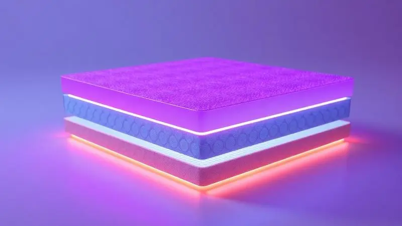

Escolher o colchão ideal vai além de uma simples decisão de compra, é um investimento diário no seu descanso, na recuperação do corpo e na qualidade de vida.

Enquanto o mercado oferece infinitas opções, os modelos de gama alta são como atletas olímpicos do sono: cada um especializado em uma modalidade específica. Neste artigo, vamos explorar a elite do descanso premium da Pikolin.

Se você procura o equilíbrio exato entre suporte que respeita sua coluna e um abraço reconfortante, este guia será seu mapa para descobrir qual parceiro de sono de luxo combina com sua noite em 2025.

<SummaryList products={frontmatter.top_products} />

## Quais são os melhores colchões topo de gama? Comparação

Os melhores colchões topo de gama não vendem apenas materiais, vendem experiências que transformam como você acorda todos os dias.

A diferença está na inteligência do suporte que se molda ao seu corpo, não o contrário, e na durabilidade que transforma um investimento em anos de descanso de qualidade. Vamos descobrir como os modelos premium da Pikolin traduzem essa filosofia em noites reais de sono.

### 1. Colchão DualPIK DUAL

<ProductBox 
  title={frontmatter.top_products[0].title} 
  image={frontmatter.top_products[0].image} 
  link={frontmatter.top_products[0].link} 
/>

Imagine acordar sentindo que seu lado da cama foi projetado exclusivamente para você, mesmo que o seu parceiro tenha preferências completamente diferentes de firmeza.

É exatamente essa magia que o DualPIK DUAL realiza, graças às suas molas ensacadas Adapt-Tech que criam três zonas de descanso independentes.

Você pode escolher firmeza média enquanto seu parceiro prefere extra firme, e o colchão abraça cada um de vocês perfeitamente, sem transferência de movimento.

O segredo do conforto está no acolchoado Progression Fiber+®. Além de oferecer uma superfície suave e acolhedora, ele atua como um termostato personalizado, regulando sua temperatura durante a noite para que você nunca precise acordar por sentir calor ou frio.

Com uma altura robusta de 32 a 33 cm e capacidade para suportar até 120 kg por pessoa, este colchão oferece uma estrutura que não cede com o tempo, garantindo que seu investimento em descanso continue dando retorno ano após ano.

<CaixaProsContras>

**Prós:**

- Tecnologia de molas ensacadas que elimina o movimento entre os lados.

- Ajuste de firmeza para atender diferentes preferências de conforto.

- Acolchoado com propriedades termorreguladoras.

- Durabilidade com suporte para até 120 kg por pessoa.

**Contras:**

- O preço pode ser um pouco elevado.

- Pode não ser ideal para quem busca um colchão totalmente firme.

</CaixaProsContras>

### 2. Colchão DualPIK FIRM

<ProductBox 
  title={frontmatter.top_products[1].title} 
  image={frontmatter.top_products[1].image} 
  link={frontmatter.top_products[1].link} 
/>

Se você sente que sua coluna grita por um abraço mais firme e estruturado, o DualPIK FIRM pode ser a resposta que seu corpo procura.

Este modelo é como ter um terapeuta manual embutido na sua cama, com a tecnologia Adapt-Tech® que aplica suporte preciso onde você mais precisa.

As molas ensacadas inteligentes se adaptam ponto a ponto ao seu corpo, aliviando músculos sobrecarregados sem criar aquela sensação de superfície dura e impiedosa.

Mas a sofisticação deste colchão vai além do suporte. O tratamento Triple Barrier® funciona como um escudo invisível contra ácaros, bactérias e fungos, ideal para quem acorda com espirros ou coceira nos olhos.

Enquanto isso, o acolchoado Progression Fiber+® e a camada de Viscoelastic INGRAVITY trabalham juntos para criar uma superfície que é firme, porém gentil.

Se você busca maciez que abraça, este pode ser um ajuste muito rigoroso, mas se firmeza restauradora é sua prioridade, prepare-se para encontrar seu parceiro de sono ideal.

<CaixaProsContras>

**Prós:**

- Adaptação ponto a ponto ao corpo.

- Excelente suporte e estabilidade.

- Tratamento higiênico eficaz contra alérgenos.

- Superfície agradável com propriedades termorreguladoras.

**Contras:**

- Firmeza elevada pode não agradar quem prefere colchões mais macios.

- Design focado na funcionalidade pode ser menos atraente visualmente para alguns.

</CaixaProsContras>

### 3. Colchão DualPIK MEDIUM

<ProductBox 
  title={frontmatter.top_products[2].title} 
  image={frontmatter.top_products[2].image} 
  link={frontmatter.top_products[2].link} 
/>

Para muitos de nós, o ideal não é nem mole demais, nem duro demais, é aquele ponto mágico do meio, onde conforto e suporte se encontram em perfeito equilíbrio.

O DualPIK MEDIUM domina essa arte, oferecendo uma firmeza média que acolhe seu corpo enquanto mantém sua coluna alinhada.

Tecnologia de molas ensacadas Adapt-Tech significa que o movimento do seu parceiro não vira sua noite de insônia, permitindo que cada um durma em seu próprio universo de conforto.

Três zonas de descanso distintas trabalham em conjunto, oferecendo suporte superior para seus ombros, alívio para sua lombar e estabilidade para seus quadris.

O acolchoado Progression Fiber+® adiciona o toque de genialidade: ele mantém a temperatura perfeita enquanto você dorme, eliminando aquela sensação de acordar suado.

Com 32,5 cm de altura e a opção de firmeza dupla, este colchão funciona como um mediador diplomático perfeito para casais em busca de consenso, ou para quem simplesmente quer um descanso equilibrado.

<CaixaProsContras>

**Prós:**

- Tecnologia de molas ensacadas para independência de movimentos.

- Três zonas de descanso para suporte personalizado.

- Propriedades termorreguladoras para conforto térmico.

- Opção de firmeza dupla para casais com preferências diferentes.

**Contras:**

- Pode ser um pouco volumoso para algumas camas.

- Garantia de apenas dois anos.

</CaixaProsContras>

### 4. Colchão ActivePik Dual

<ProductBox 
  title={frontmatter.top_products[3].title} 
  image={frontmatter.top_products[3].image} 
  link={frontmatter.top_products[3].link} 
/>

Quando duas personalidades de sono dividem uma cama, a harmonia noturna pode ser um desafio, a não ser que você tenha o ActivePik Dual. Este colchão é como duas camas em uma, com seu sistema 'Double Rest' que oferece firmeza média de um lado e alta do outro.

O resultado? Ambos adormecem com exatamente o tipo de abraço que preferem, sem precisar de concesões que deixam alguém insatisfeito.

Núcleo de molas ensacadas cria uma rede de suporte personalizada que isola movimentos, então o remexer noturno do parceiro não se transforma em tremor no seu lado da cama.

O acolchoado Progression Fiber® é uma camada de conforto que combina espuma supersuave com fibra que respira, mantendo você fresco. O tecido de viscose adiciona um toque de luxo sensual à superfície.

A única consideração real é o peso, que reflete sua construção robusta, uma pequena dificuldade logística pelo preço de noites harmoniosas compartilhadas.

<CaixaProsContras>

**Prós:**

- Tecnologia de firmeza dual para atender diferentes preferências.

- Núcleo de molas ensacadas para suporte personalizado.

- Acolchoado com propriedades termorreguladoras para conforto.

- Tratamento higiênico contra ácaros e fungos.

**Contras:**

- Peso considerável, podendo dificultar seu manuseio.

- Pode não ser a opção mais acessível do mercado.

</CaixaProsContras>

### 5. Colchão Dense Molas Ensacadas Extra Firme Pikolin

<ProductBox 
  title={frontmatter.top_products[4].title} 
  image={frontmatter.top_products[4].image} 
  link={frontmatter.top_products[4].link} 
/>

Alguns corpos simplesmente pedem um suporte inabalável, uma superfície que funcione como uma base sólida para a recuperação total.

O Dense Molas Ensacadas Extra Firme foi concebido para essa missão, com seu sistema de molas ensacadas Cross System que oferece estabilidade quase arquitetônica, suportando até 250 kg por pessoa.

Esta não é uma cama morna, é um fundamento para um sono realmente reparador.

O tecido Copper Fabric representa um salto tecnológico fascinante: fios de cobre integrados ajudam a dissipar calor corporal, criando uma superfície mais fria que se adapta à sua fisiologia.

Enquanto isso, uma camada de látex natural de alta densidade trabalha em conjunto com espuma Cool Touch para garantir que, mesmo sendo firme, o colchão nunca se torne desconfortável.

É um investimento sério para quem leva o descanso a sério, para quem busca não apenas dormir, mas reconstruir-se todas as noites.

<CaixaProsContras>

**Prós:**

- Suporte firme ideal para quem prefere colchões rígidos.

- Sistema de molas ensacadas proporciona adaptação aos movimentos.

- Tecido com fios de cobre oferece frescor e propriedades antibacterianas.

- Camada de látex natural melhora o conforto e o alinhamento da coluna.

**Contras:**

- Preço pode ser elevado em comparação com outros modelos.

- Pode não ser indicado para quem prefere colchões macios.

</CaixaProsContras>

### 6. Colchão Pikolin Equilibrium

<ProductBox 
  title={frontmatter.top_products[5].title} 
  image={frontmatter.top_products[5].image} 
  link={frontmatter.top_products[5].link} 
/>

Equilíbrio perfeito raramente é uma qualidade fácil de encontrar, mas o Pikolin Equilibrium personifica esse conceito.

Com tecnologia de molas Normablock Pro®, este colchão oferece suporte reforçado onde você mais precisa, especialmente na região lombar, enquanto suporta até 250 kg por pessoa.

É como ter reforços estruturais invisíveis trabalhando para manter sua coluna em perfeita harmonia durante toda a noite.

O revestimento em tecido Purotex® traz uma inovação inteligente: microcápsulas com probióticos naturais que lutam contra alérgenos. Isso significa que você pode respirar profundamente durante o sono, sem preocupações com ácaros ou fungos.

A espuma Reactive completa o pacote, adaptando-se suavemente aos seus contornos corporais sem criar pontos de pressão que o fazem revirar-se.

Para quem busca uma linha tênue entre o macio e o estruturado, entre o suave e o suportivo, este pode ser o ponto de equilíbrio que transforma o sono.

<CaixaProsContras>

**Prós:**

- Suporte reforçado na região lombar.

- Tecnologias hipoalergênicas que combatem ácaros.

- Boa adaptação ao corpo sem pressão excessiva.

- Altura generosa de aproximadamente 30 cm.

**Contras:**

- Pode não ser firme o suficiente para alguns usuários.

- O preço pode ser um pouco elevado em comparação a modelos básicos.

</CaixaProsContras>

## Conclusão

Escolher seu parceiro de sono ideal é uma conversa íntima entre suas necessidades físicas, seus hábitos noturnos e seu estilo de vida.

Como você viu, os colchões de gama alta da Pikolin não são apenas produtos, são sistemas de suporte inteligentes, cada um com uma personalidade distinta.

Desde o equilíbrio diplomático do DualPIK MEDIUM até o suporte inabalável do Dense Extra Firme, cada modelo oferece uma solução diferente para a mesma questão fundamental: como transformar suas noites em oportunidades de recuperação verdadeira.

Você deve escolher o que se alinha com sua morfologia, seus pontos de pressão e sua sensibilidade térmica.

E enquanto investir em um colchão premium exige recursos, considere-o como investimento na qualidade de suas manhãs, na sua produtividade diária e na saúde da sua coluna.

Porque depois de uma noite de sono verdadeiramente reparador, você não pensa no preço, você celebra a sabedoria da escolha certa.

Agora que conhece as opções disponíveis, escute o que seu corpo diz e permita-se escolher o abraço noturno ideal para sua próxima década de sono.