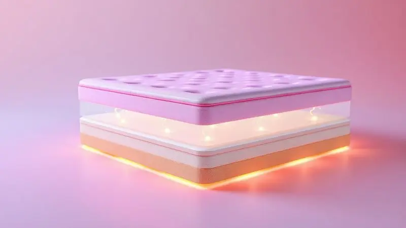

Acordar com dores no corpo ou sentir que seu parceiro vira e revira a noite inteira enquanto você tenta dormir pode ser um sinal de que chegou a hora de dar adeus ao seu colchão atual.

Encontrar o modelo certo vai além das especificações técnicas: é sobre recuperar aquele despertar renovado, sem rigidez muscular.

Entre as opções que prometem essa mudança, os colchões de solteiro com molas ensacadas se destacam por uma tecnologia simples, mas revolucionária: cada mola age de forma independente, isolando movimentos e se adaptando aos seus contornos como se fosse feita só para você.

Com tantas densidades, marcas e promessas, escolher pode parecer um labirinto. Pensando nisso, preparamos uma análise detalhada dos 11 melhores colchões de solteiro para 2025, equilibrando dados técnicos com o conforto que seu sono merece.

<SummaryList products={frontmatter.top_products} />

## Ranking dos 11 Melhores Colchões de Solteiro em 2025

Abaixo, você encontra uma seleção feita com base em conforto, suporte e durabilidade. Aqui, o foco é em como cada modelo pode transformar suas noites, não apenas em uma lista de características.

### 1. Colchão Solteiro Mola Ensacada Probel Akira (88x188x20cm)

<ProductBox 
  title={frontmatter.top_products[0].title} 
  image={frontmatter.top_products[0].image} 
  link={frontmatter.top_products[0].link} 
/>

Imagine um colchão que se adapta aos dois lados da cama de forma diferente, perfeito para casais onde um precisa de mais firmeza e outro de mais aconchego.

O Probel Akira torna isso realidade com seu sistema de molas ensacadas, que oferece suporte personalizado para cada parte do corpo, suportando até 110 kg por pessoa.

A sensação é de estabilidade sem rigidez, graças ao nível de firmeza intermediário que atende a maioria dos perfis de sono.

O revestimento em malha branca e a camada de espuma matelassê criam um toque confortável, e o melhor: você não precisa se preocupar em virá-lo constantemente.

A única ressalva fica por conta da garantia de 12 meses, considerada curta por quem planeja investir a longo prazo.

<CaixaProsContras>

**Prós:**

- Suporte personalizado que se adapta a biotipos diferentes na mesma cama.

- Conforto consistente sem necessidade de virar frequentemente.

- Excelente custo-benefício para quem busca tecnologia de molas ensacadas.

**Contras:**

- Período de garantia de apenas 12 meses.

- Firmeza intermediária pode não atender extremos (quem busca muito macio ou muito firme).

</CaixaProsContras>

### 2. Colchão Solteiro Mola Ensacada Probel Sigma Plus (88x188x24cm)

<ProductBox 
  title={frontmatter.top_products[1].title} 
  image={frontmatter.top_products[1].image} 
  link={frontmatter.top_products[1].link} 
/>

Para quem sente que a coluna grita por um suporte mais decisivo, o Sigma Plus chega com uma proposta clara: firmeza extra. Suas molas ensacadas trabalham para minimizar qualquer transferência de movimento, uma benção se você ou seu parceiro são agitados durante a noite.

Essa robustez é especialmente reconfortante para quem lida com dores nas costas, promovendo um alinhamento que parece corrigir sua postura enquanto você descansa.

O tecido poliéster antialérgico e respirável cria uma barreira invisível contra ácaros, ideal para quem sofre com alergias.

Só esteja preparado: a sensação inicial é de um colchão decididamente firme, que pode surpreender quem está acostumado a afundar em modelos mais macios.

<CaixaProsContras>

**Prós:**

- Firmeza extra que oferece suporte robusto para a coluna.

- Isolamento de movimento quase total para noites tranquilas.

- Tecido hipoalergênico que protege contra alérgenos.

- Adição de conforto com o Pillow Euro.

**Contras:**

- Sensação de rigidez para quem prefere colchões mais acolhedores.

- Garantia de 12 meses limitada para molas e espuma.

</CaixaProsContras>

### 3. Colchão Solteiro Mola Ensacada Probel Excede Premium (88x188x30cm)

<ProductBox 
  title={frontmatter.top_products[2].title} 
  image={frontmatter.top_products[2].image} 
  link={frontmatter.top_products[2].link} 
/>

Às vezes, o conforto vem em camadas. O Excede Premium começa com um abraço macio do Pillow Super na superfície, convidando você a afundar levemente.

Abaixo dessa primeira impressão, as molas ensacadas entram em ação, garantindo que esse aconchego não comprometa o suporte, distribuindo seu peso de forma inteligente e aliviando pontos de pressão nos ombros e quadris.

O design é ergonômico, pensado para quem passa horas na mesma posição. A manutenção é simplificada, sem a necessidade de viradas regulares. Fique atento apenas à garantia do tecido, de 3 meses, um detalhe que contrasta com a construção robusta do restante do colchão.

<CaixaProsContras>

**Prós:**

- Camada superior macia (Pillow Super) para conforto imediato.

- Suporte ergonômico que alivia pontos de pressão específicos.

- Molas ensacadas que oferecem adaptação personalizada.

- Praticidade na manutenção, sem necessidade de virar.

**Contras:**

- Garantia do tecido limitada a 3 meses.

- Pode ser macio demais para quem busca firmeza primária.

</CaixaProsContras>

### 4. Colchão Solteiro Mola Ensacada Probel Collin (88x188x30cm)

<ProductBox 
  title={frontmatter.top_products[3].title} 
  image={frontmatter.top_products[3].image} 
  link={frontmatter.top_products[3].link} 
/>

Você se vira para o lado no meio da noite e teme acordar quem está ao lado. Com o Collin, esse receio desaparece. Suas molas ensacadas funcionam como ilhas de suporte, absorvendo movimentos localmente sem transmitir a agitação para o outro lado da cama.

A firmeza intermediária é o ponto de equilíbrio perfeito, oferecendo suporte sem sacrificar a sensação acolhedora.

A malha do revestimento atua como um sistema de respiração para o colchão, permitindo a circulação de ar e ajudando a manter uma temperatura agradável durante toda a noite.

Para casais com até 110 kg cada, ele é uma escolha versátil, embora possa não atender quem busca uma base explicitamente firme.

<CaixaProsContras>

**Prós:**

- Isolamento de movimento eficiente para casais.

- Firmeza balanceada que agrada diferentes preferências.

- Revestimento em malha que melhora a ventilação.

- Design que incentiva o alinhamento natural da coluna.

**Contras:**

- Pode não ser firme o suficiente para alguns usuários.

- Limite de peso de 110 kg por pessoa.

</CaixaProsContras>

### 5. Colchão Solteiro Mola Probel Siena (88x188x28cm)

<ProductBox 
  title={frontmatter.top_products[4].title} 
  image={frontmatter.top_products[4].image} 
  link={frontmatter.top_products[4].link} 
/>

Durabilidade e suporte muitas vezes andam de mãos dadas. O Probel Siena é a prova disso, com seu sistema de molejo Prolastic e duas camadas de espuma (D28 e D33) que prometem resistir ao tempo sem ceder.

A sensação é de um colchão que segura seu corpo com segurança, mantendo a coluna em uma linha reta natural. O Pillow Super adiciona uma camada inicial de maciez que disfarça a firmeza estrutural.

Com tratamento antiácaro e antifungo, ele também cuida do ambiente onde você descansa. Se você prioriza um investimento que dure anos e ofereça suporte consistente, este é um forte candidato, desde que não espere a sensação de nuvem de um modelo ultra macio.

<CaixaProsContras>

**Prós:**

- Construtação robusta com molejo Prolastic para suporte duradouro.

- Camadas de espuma que garantem densidade e resistência.

- Tratamento de higiene (antiácaro e antifungo).

- Firmeza intermediária que serve como base confiável.

**Contras:**

- Firmeza perceptível pode desagradar quem busca colchões muito macios.

- Limite de suporte de peso (110 kg) pode ser restritivo.

</CaixaProsContras>

### 6. Colchão Solteiro Mola Probel Life (88x188x24cm)

<ProductBox 
  title={frontmatter.top_products[5].title} 
  image={frontmatter.top_products[5].image} 
  link={frontmatter.top_products[5].link} 
/>

O medo de afundar em um buraco no meio do colchão é real. O Probel Life aborda essa preocupação com seu molejo Prolastic, que se adapta ao seu corpo sem criar valas indesejadas, mantendo um perfil uniforme que protege sua postura.

A firmeza intermediária funciona como um comodista, agradando a maioria das pessoas. O toque final fica por conta do pillow top euromodelo, que entrega uma dose extra de maciez logo na superfície.

Suportando até 110 kg por pessoa e exigindo apenas giros ocasionais (não viradas completas), ele é prático. Só considere que sua construção sólida traz um peso considerável, o que pode tornar a movimentação um pequeno desafio.

<CaixaProsContras>

**Prós:**

- Adaptação ao corpo que evita a sensação de afundamento desproporcional.

- Firmeza equilibrada e universalmente agradável.

- Conforto extra da camada pillow top.

- Capacidade de suporte generosa (110 kg por pessoa).

**Contras:**

- Peso elevado que dificulta manobras e mudanças de posição.

- Apesar de não precisar virar, ainda requer giros periódicos.

</CaixaProsContras>

### 7. Colchão Solteiro Mola Ensacada Probel Vancouver (88x188x28cm)

<ProductBox 
  title={frontmatter.top_products[6].title} 
  image={frontmatter.top_products[6].image} 
  link={frontmatter.top_products[6].link} 
/>

Conforto e suporte não precisam ser opostos. O Vancouver prova isso unindo a tecnologia de molas ensacadas, que garante suporte ponto a ponto, com a maciez reconfortante de um pillow top.

O resultado é um colchão que acolhe seu corpo enquanto mantém sua coluna no eixo certo. O tecido antialérgico e respirável é um aliado silencioso, especialmente para quem acorda com espirros ou coceiras.

Com capacidade para até 120 kg por pessoa, ele atende bem a maioria, mas sua beleza reside na simplicidade: é um colchão que cumpre sua função com excelência, sem firulas, embora seu design básico não seja seu maior atrativo visual.

<CaixaProsContras>

**Prós:**

- Suporte personalizado das molas ensacadas combinado com maciez superficial.

- Firmeza adequada para manter o alinhamento postural.

- Tecido que promove respirabilidade e é hipoalergênico.

- Conforto adicional da camada pillow top.

**Contras:**

- Limite de peso de 120 kg pode excluir alguns usuários.

- Estética de design simples e básica.

</CaixaProsContras>

### 8. Colchão Solteiro Mola Ensacada Probel Cairo Ultra Gel (88x188x30cm)

<ProductBox 
  title={frontmatter.top_products[7].title} 
  image={frontmatter.top_products[7].image} 
  link={frontmatter.top_products[7].link} 
/>

Tecnologia de ponta para noites de nível premium. O Cairo Ultra Gel incorpora espuma HR Gel D45, um material de alta resiliência conhecido por sua durabilidade e capacidade de retornar à forma original, combinada com espuma D33.

Essa dupla garante um conforto que não murcha com os anos. As molas ensacadas fazem sua parte, oferecendo suporte individualizado que isola completamente os movimentos. O pillow Euro e o tecido de malha completam a experiência com um toque agradável.

Com 30 cm de altura e suporte para 120 kg, ele é imponente, e sua firmeza intermediária é um convite para a maioria dos dorminhocos, embora sua altura possa ser um obstáculo para camas baixas ou preferências estéticas específicas.

<CaixaProsContras>

**Prós:**

- Uso de espumas de alta resiliência (HR Gel D45 e D33) para conforto durável.

- Molas ensacadas que garantem suporte e isolamento de movimento.

- Acabamento com pillow Euro para maciez extra.

- Manutenção facilitada (não requer viradas).

**Contras:**

- Altura de 30 cm pode ser excessiva para alguns leitos ou gostos.

- Perfil de firmeza pode não atender preferências muito específicas.

</CaixaProsContras>

### 9. Colchão Solteiro Espuma D33 Fort 88x188x21cm

<ProductBox 
  title={frontmatter.top_products[8].title} 
  image={frontmatter.top_products[8].image} 
  link={frontmatter.top_products[8].link} 
/>

Para quem busca a simplicidade da espuma com a certeza da resistência, o D33 Fort da Gazin apresenta um argumento convincente: até 150 kg de capacidade de suporte por pessoa.

A densidade D33 não é um número aleatório, ela traduz uma espuma estruturada que oferece firmeza real, evitando que o colchão se deforme e perca seu poder de sustentação com o tempo.

A manutenção é direta: mantenha-o ventilado e gire-o de vez em quando para um desgaste uniforme. Essa solidez, no entanto, tem um preço sensorial, podendo ser percebida como excessivamente rígida por quem anseia por um abraço mais suave do colchão.

<CaixaProsContras>

**Prós:**

- Firmeza e suporte notáveis, ideais para quem precisa de base sólida.

- Alta capacidade de carga (até 150 kg).

- Construção com espuma durável que resiste a deformações.

- Cuidados de manutenção simples.

**Contras:**

- Sensação de rigidez acentuada para quem prefere maciez.

- Conforto menos personalizável, sem camadas diferenciadas.

</CaixaProsContras>

### 10. Colchão Solteiro Espuma D45 Lazio Pillow Top Branco Hellen

<ProductBox 
  title={frontmatter.top_products[9].title} 
  image={frontmatter.top_products[9].image} 
  link={frontmatter.top_products[9].link} 
/>

Elegância e conforto se encontram no Lazio da Hellen. Sob a capa de tecido Jacquard branco, que além de bonito melhora a passagem de ar, encontra-se uma espuma D45 de alta densidade combinada com EPS, prometendo estabilidade por anos.

A estrela do show, porém, é o Pillow Top, uma camada extra que transforma o primeiro contato em uma experiência acolhedora e suave. A base antiderrapante é um detalhe inteligente que evita deslizes inconvenientes. Suportando até 150 kg, ele é robusto.

Este colchão é para quem quer um equilíbrio claro entre o aconchego imediato e a solidez interna, aceitando que ele pode não ter a firmeza categórica que alguns buscam.

<CaixaProsContras>

**Prós:**

- Conforto superior proporcionado pela camada Pillow Top.

- Excelente capacidade de suporte (150 kg por pessoa).

- Tecido Jacquard que favorece a ventilação.

- Base antiderrapante que aumenta a estabilidade na cama.

**Contras:**

- Pode não oferecer firmeza suficiente para todos os gostos.

- Carece de tecnologias adicionais, como regulação térmica ativa.

</CaixaProsContras>

### 11. Colchão Misto Iso 150 D45 Solteiro Ortobom

<ProductBox 
  title={frontmatter.top_products[10].title} 
  image={frontmatter.top_products[10].image} 
  link={frontmatter.top_products[10].link} 
/>

A Ortobom aposta na combinação inteligente de materiais com o Iso 150 D45. A base é uma placa de EPS, que dá firmeza estrutural, sobre a qual repousa uma espuma D45 Pró Aditivada de Alta Performance, responsável pela adaptação confortável ao seu corpo.

O nível de conforto é classificado como firme, uma escolha segura para quem prioriza o suporte da coluna acima de tudo. O tratamento antialérgico e antiácaro é um cuidado valioso para a saúde do seu sono.

Com dimensões padrão (88x188x18 cm), ele se adapta facilmente, mas exige atenção: ele não deve ser usado sobre estrado inteiriço, precisando de uma base arejada ou box apropriado para funcionar corretamente.

<CaixaProsContras>

**Prós:**

- Conforto firme que oferece suporte postural decisivo.

- Tratamento protetor contra alérgenos e ácaros.

- Durabilidade assegurada pela espuma D45 de alta performance.

- Acabamento em matelassê bordado para maior aconchego.

**Contras:**

- Incompatível com estrados inteiriços, exigindo base específica.

- Limite de peso estabelecido em 120 kg.

</CaixaProsContras>

## Como escolher o colchao ideal

Agora que você conhece os modelos, vamos ao cerne da questão: como traduzir essa informação em uma decisão certa para você? Pense no seu corpo falando.

A escolha começa pelo material: as molas ensacadas são campeãs em adaptação e isolamento de movimento, enquanto espumas de alta densidade, como a D45, oferecem uma firmeza consistente e duradoura. Depois, escute sua postura ao dormir.

Dormir de lado pede mais maciez para acolher ombros e quadris, de costas vai melhor com firmeza média, e de bruços exige um modelo firme para evitar torções no pescoço. Seu peso é um guia crucial para a densidade necessária.

Por fim, nunca subestime o poder de uma experimentação, mesmo que rápida. O colchão ideal é aquele que, em poucos minutos, já parece um velho conhecido do seu corpo.

## Principais vantagens dos colchões solteiro

Os colchões solteiro vão além de ser apenas para uma pessoa. Eles são máquinas de otimização de espaço, cabendo perfeitamente em quartos compactos ou servindo como cama extra sem complicações.

A maioria dos modelos que vimos incorpora tecnologia de molas ensacadas, que traz um benefício duplo: suporte individualizado que contorna seu corpo como uma luva, e o fim daquelas noites em que cada movimento do parceiro vira um terremoto no seu lado da cama.

E, por serem mais compactos, são naturalmente mais leves e fáceis de manusear, simplificando tarefas como trocar lençóis ou fazer a limpeza ao redor da cama.

## Tipos de colchão disponíveis no mercado

Entender a família do seu futuro colchão ajuda a afunilar a busca. Os tradicionais colchões de molas, principalmente os de molas ensacadas, são sinônimos de suporte duradouro e adaptação inteligente ao corpo, minimizando a interferência entre os dorminhocos.

Do outro lado, as espumas viscoelásticas são especialistas em alívio de pressão, moldando-se aos seus contornos. Os híbridos tentam capturar o melhor dos dois mundos, combinando molas e espuma.

E os colchões de látex se destacam pela resistência natural e uma frescura característica. Cada tipo atende a um diálogo diferente entre seu corpo e a cama.

## O que analisar antes de comprar um colchao

Antes de concluir a compra, faça uma checklist mental. A firmeza deve ser sua aliada, não sua inimiga, e deve conversar diretamente com seu peso e posição de sono. O material define a personalidade do suporte: molas ensacadas para precisão e isolamento.

Observe como o colchão respira, alguns materiais retêm calor e podem transformar sua noite em um forno. O tamanho deve considerar não apenas o espaço disponível, mas também seu conforto para se movimentar.

E, por mais tentador que seja comprar online, se tiver a oportunidade, deite-se. São esses minutos de teste que convertem especificações em sensação.

## Cuidados e manutencao do colchao

Um bom colchão merece bons cuidados para retribuir com anos de conforto. Girá-lo de cabeça para os pés a cada três meses é o segredo para um desgaste uniforme, evitando depressões.

Um protetor impermeável não é um acessório, é um escudo contra acidentes e umidade, prolongando a vida útil drasticamente. Na limpeza, prefira um pano úmido e sabão neutro, mantendo distância de químicos agressivos.

Por fim, o manual do fabricante não é apenas burocracia, ele contém as instruções de carinho específicas que seu colchão precisa para envelhecer com vitalidade.

## Perguntas Frequentes (FAQ)

As dúvidas mais comunes sobre colchões de solteiro, respondidas de forma clara para ajudar na sua decisão final.

### Qual é a durabilidade média de um colchão solteiro?

Espere que um bom colchão de solteiro seja seu companheiro por 7 a 10 anos.

Essa vida útil depende diretamente da qualidade dos materiais (molas ensacadas e espumas de alta densidade tendem a durar mais), dos cuidados que você tem (como usar capa protetora e fazer a rotação periódica) e, claro, do seu peso e hábitos de sono.

Investir em um modelo robusto e tratá-lo bem é a receita para acordar bem por muitos anos.

### É possível usar um colchão solteiro em uma cama de casal?

Tecnicamente possível, sim, mas praticamente não recomendado. Usar um colchão solteiro em uma cama de casal compromete totalmente o conforto de ambos, cria um vão incômodo no meio e não oferece o suporte lateral adequado.

Pode funcionar como solução extremamente temporária em um quarto de hóspedes, mas para um descanso digno e saudável, o colchão deve sempre corresponder ao tamanho da cama. Seu sono e sua coluna agradecem o investimento correto.

### Como posso saber se um colchão é adequado para minha postura ao dormir?

Seu corpo dá a dica. Se você dorme de lado, sinta se o colchão afunda o suficiente para acomodar seu ombro e quadril sem deixar sua coluna torta. Para quem dorme de costas, verifique se a região lombar recebe apoio, mantendo a curvatura natural.

Dormir de barriga para baixo é o caso mais delicado: o colchão precisa ser firme o bastante para evitar que seu pescoço se estique para trás em um ângulo doloroso. Em uma loja, não tenha pressa.

Deite-se em sua posição habitual por alguns minutos, é nesse silêncio que o colchão certo se revela.

### Qual é a melhor forma de limpar um colchão solteiro?

A limpeza regular mantém seu colchão saudável. Comece aspirando a superfície para eliminar poeira e ácaros. Para manchas, use uma solução suave de água morna com sabão neutro ou vinagre (um excelente desinfetante natural), aplicando com um pano úmido sem encharcar.

Seque bem com um pano seco e deixe arejar. Para um frescor extra e eliminação de odores, polvilhe bicarbonato de sódio, deixe agir por algumas horas e aspire. Ritual simples, resultados poderosos.

### Os colchões têm garantia? O que ela cobre?

Sim, a grande maioria possui garantia, geralmente entre 5 e 10 anos. Ela está aí para cobrir você de defeitos de fabricação, como afundamentos profundos e anormais, falhas nas molas ou problemas estruturais.

É fundamental ler o contrato, pois desgaste natural, manchas ou danos por uso inadequado normalmente não são cobertos. Conhecer os termos é ter tranquilidade no investimento.

### Qual é a importância de usar uma base adequada para o colchão?

A base não é apenas um apoio, é a fundação do seu colchão.

Uma base firme e adequada garante que o suporte seja distribuído corretamente, prevenindo deformações prematuras e garantindo que todas as tecnologias internas (como as molas ensacadas) funcionem como projetadas.

Ela também melhora a ventilação, crucial para regular a temperatura e afastar a umidade. Em resumo, a base certa protege seu investimento e potencializa a qualidade do seu sono.

## Conclusão

Escolher um colchão é escolher como você vai recarregar suas energias para os próximos anos. Não se trata apenas de comprar um produto, mas de investir na qualidade do seu descanso, no alívio das suas costas e na tranquilidade das suas noites.

Entre os modelos que analisamos, desde o acessível Probel Akira até o tecnológico Cairo Ultra Gel, passa pelo equilíbrio do Vancouver e a solidez do D33 Fort, há uma opção que conversa com suas necessidades específicas, seu biotipo e sua forma de dormir.

Lembre-se das perguntas certas (material, firmeza, suporte de peso) e dos cuidados essenciais. Agora, com todas as informações em mãos, você está pronto para tomar uma decisão que vai muito além da compra.

Você está pronto para transformar a maneira como você acorda todos os dias. O próximo passo, literalmente, é deitar, testar e sentir.