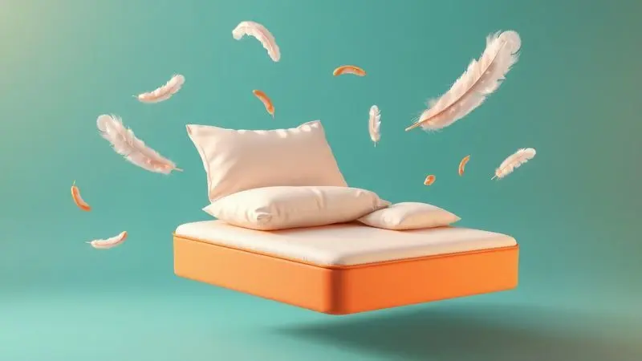
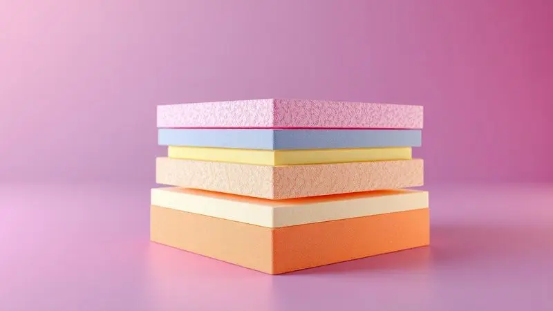
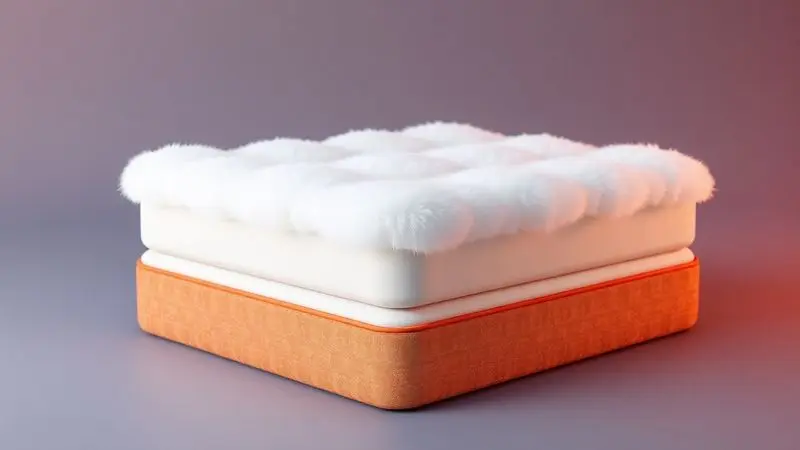

Escolher o colchão de solteiro ideal é um passo decisivo para garantir noites de descanso profundo e a saúde da coluna a longo prazo.

Com a vasta variedade de densidades de espuma, tipos de molas e tecnologias de conforto disponíveis em 2025, a decisão pode parecer complexa para o consumidor.

Marcas consagradas como Ortobom, Castor e Probel oferecem soluções que buscam equilibrar suporte ortopédico e maciez.

Para facilitar sua jornada, preparamos uma curadoria criteriosa com os 13 modelos mais elogiados, além de um guia completo para você entender qual a densidade correta para seu biotipo e os benefícios de cada material.

<SummaryList products={frontmatter.top_products} />

## Ranking dos Melhores Colchões de Solteiro de 2025

Diante de tantas opções, por onde começar? Este ranking foi pensado para você. Reunimos os colchões de solteiro mais bem avaliados, considerando conforto, durabilidade e, principalmente, o suporte que eles oferecem à sua coluna durante o sono.

A ideia é que você encontre a opção ideal sem precisar virar especialista em materiais.

### 1. Colchão Ortobom D45 ISO 150

<ProductBox 
  title={frontmatter.top_products[0].title} 
  image={frontmatter.top_products[0].image} 
  link={frontmatter.top_products[0].link} 
/>

Imagine um colchão que não cede, mesmo após anos de uso. O Ortobom D45 ISO 150 foi feito para essa missão. Com densidade D45, ele oferece uma firmeza robusta, projetada especialmente para quem precisa de suporte extra, como pessoas com peso acima de 100 kg.

Essa resistência garante que ele suporte até 150 kg, prometendo uma vida útil impressionante.

Internamente, placas de EPS trabalham em conjunto com uma camada de espuma de alta performance. Para seu conforto e saúde, o revestimento em Viscopoli é macio ao toque e possui tratamento antialérgico, criando uma barreira contra ácaros e alérgenos.

É verdade que sua firmeza característica pode não agradar quem busca afundar em um abraço macio, mas para quem prioriza apoio consistente durante a noite, é uma escolha certeira.

<CaixaProsContras>

**Prós:**

- Firmeza ideal para apoio e durabilidade.

- Capacidade de suporte para pesos mais elevados.

- Revestimento antialérgico e antiácaro.

- Camada de conforto em espuma de alta performance.

**Contras:**

- Pode ser muito firme para quem prefere conforto macio.

- Disponível em dimensões específicas que podem não agradar a todos.

</CaixaProsContras>

### 2. Colchão Ortobom Ortopédico Light

<ProductBox 
  title={frontmatter.top_products[1].title} 
  image={frontmatter.top_products[1].image} 
  link={frontmatter.top_products[1].link} 
/>

Você acorda com aquela dorzinha nas costas que parece te seguir o dia todo? O Ortopédico Light da Ortobom foi desenvolvido para ser seu aliado.

Recomendado por ortopedistas, ele combina espuma de poliuretano em densidades diferentes com a tecnologia Ortopillow, uma camada extra de conforto que lembra a maciez de um travesseiro perfeito.

Além do suporte direcionado para a coluna vertebral, o tratamento hipoalergênico afasta agentes que podem prejudicar seu sono. É importante saber que ele é firme por natureza. Alguns podem sentir que, ao dormir de lado, ele é um pouco rígido demais.

No entanto, para quem busca alívio de dores e uma base durável, essa característica se transforma em uma vantagem poderosa.

<CaixaProsContras>

**Prós:**

- Suporte ideal para a coluna, ajudando a aliviar dores nas costas.

- Tecnologia Ortopillow para maior conforto.

- Tratamento hipoalergênico que previne alergias.

- Diversas opções de tamanhos e densidades.

**Contras:**

- Pode ser considerado duro demais por alguns usuários.

- Custo-benefício elevado em relação a colchões comuns.

</CaixaProsContras>

### 3. Colchão Castor Molas Bonnel System Class

<ProductBox 
  title={frontmatter.top_products[2].title} 
  image={frontmatter.top_products[2].image} 
  link={frontmatter.top_products[2].link} 
/>

Procura o equilíbrio perfeito entre conforto tradicional e suporte? O Castor Molas Bonnel System Class é a resposta. Seu sistema de molas bicônicas garante firmeza e durabilidade, assegurando um bom alinhamento da coluna.

Em muitos modelos, você ainda encontra um Pillow Top, uma camada extra que abraça seu corpo com maciez.

O cuidado com a higiene do seu sono também é evidente: o revestimento em poliéster recebe tratamentos que combatem ácaros e fungos. Fique atento, alguns modelos são "One Face" (uso de um lado só), enquanto outros são "Double Face" e podem ser virados.

Pode não ser o colchão mais barato da prateleira, mas é um investimento que se paga em noites de sono consistentemente boas.

<CaixaProsContras>

**Prós:**

- Boa durabilidade devido ao sistema de molas Bonnel.

- Oferece conforto adicional com o Pillow Top.

- Revestimento tratado para maior higiene.

- Variedade de modelos e densidades.

**Contras:**

- Não é a opção mais barata disponível.

- Alguns modelos não são viráveis.

</CaixaProsContras>

### 4. Colchão Probel Guarda Costas Próextreme Plus

<ProductBox 
  title={frontmatter.top_products[3].title} 
  image={frontmatter.top_products[3].image} 
  link={frontmatter.top_products[3].link} 
/>

Para quem não abre mão de um suporte robusto, o Guarda Costas Próextreme Plus da Probel é um forte candidato.

A espuma de alta densidade D45 dá a ele uma firmeza extra, projetada para aliviar dores e manter sua coluna perfeitamente alinhada, suportando até 150 kg por pessoa.

Os benefícios vão além do suporte físico. O tratamento antiácaro e antifungo garante um ambiente mais limpo, enquanto o tecido em poliéster com bordado contínuo oferece um visual sofisticado. A manutenção é facilitada, pois ele não precisa ser virado.

Se você sonha com um colchão macio que afunda, este não é para você. Mas se firmeza e apoio definem um bom descanso, ele é uma excelente opção.

<CaixaProsContras>

**Prós:**

- Alta densidade D45 proporciona firmeza e suporte.

- Alívio de dores e bom alinhamento da coluna.

- Tratamento antiácaro e antifungo.

- Tecido em poliéster com design elegante.

**Contras:**

- Firmeza excessiva pode não ser confortável para todos.

- Não é possível virar o colchão.

</CaixaProsContras>

### 5. Colchão Anjos Classic

<ProductBox 
  title={frontmatter.top_products[4].title} 
  image={frontmatter.top_products[4].image} 
  link={frontmatter.top_products[4].link} 
/>

Por que se limitar a uma única sensação? O Anjos Classic entende que o conforto é pessoal.

Disponível com molas Superlastic ou ensacadas (Pocket), ele se adapta maravilhosamente ao contorno do seu corpo, aliviando pontos de pressão para um sono verdadeiramente reparador.

Com alturas entre 20 cm e 30 cm, ele suporta geralmente até 120 kg, chegando a 130 kg em alguns modelos.

A saúde do seu sono também é prioridade, graças aos tratamentos antiácaro e antifungo. E se você é fã de uma sensação acolhedora, algumas versões vêm com o Pillow Top Europeu.

Sim, os modelos com base D20 são menos firmes, mas essa é justamente a graça: você escolhe entre o suporte mais estrutural ou a maciez que convida ao relaxamento total.

<CaixaProsContras>

**Prós:**

- Conforto com diversas opções de firmeza.

- Suporte adequado para pesos elevados.

- Tratamentos que garantem saúde e frescor.

- Disponível em tamanhos variados.

**Contras:**

- Modelos mais básicos podem ter menor firmeza.

- Variabilidade nas especificações entre as versões.

</CaixaProsContras>

### 6. Colchão Castor Molas Bonnel Revolution

<ProductBox 
  title={frontmatter.top_products[5].title} 
  image={frontmatter.top_products[5].image} 
  link={frontmatter.top_products[5].link} 
/>

Durabilidade é uma palavra que ressoa no Castor Molas Bonnel Revolution. Seu sistema de molas Bonnel entrelaçadas foi feito para durar, oferecendo uma firmeza que não murcha com o tempo.

A combinação de espumas D20 e D26 cria uma base que é ao mesmo tempo confortável e estável, adaptando-se ao seu corpo para garantir um descanso eficiente.

O revestimento em tecido suede e malha não só tem um visual elegante, mas também melhora a ventilação, ajudando a manter a temperatura agradável. Com capacidade para suportar até 130 kg, atende bem a maioria. A sensação predominante é de firmeza.

Se sua definição de conforto é uma superfície mais macia, pode não ser a primeira escolha. Para quem valoriza uma base sólida e duradoura, é um investimento inteligente.

<CaixaProsContras>

**Prós:**

- Sistema de molas Bonnel que oferece durabilidade.

- Combinação de espumas para conforto e firmeza.

- Revestimento em tecido suede que melhora a ventilação.

- Suporta até 130kg por pessoa, adequado para a maioria dos usuários.

**Contras:**

- Pode ser menos macio do que algumas pessoas preferem.

- Requer cuidado na escolha do tamanho ideal.

</CaixaProsContras>

### 7. Colchão Ortobom Physical Spring

<ProductBox 
  title={frontmatter.top_products[6].title} 
  image={frontmatter.top_products[6].image} 
  link={frontmatter.top_products[6].link} 
/>

Que tal um colchão que se move com você? O Physical Spring da Ortobom usa o sistema de molas Nanolastic, que oferece um suporte progressivo e flexível, acompanhando cada movimento do seu corpo.

A camada Ortopillow, feita de espuma de poliuretano antialérgica, adiciona um toque acolhedor que convida ao relaxamento.

A ventilação é outro ponto forte, ajudando a dissipar o calor e manter uma temperatura ideal durante a noite. A manutenção é facilitada em alguns modelos, que exigem rotação apenas entre os pés e a cabeceira.

Se você busca um colchão extremamente macio, onde você afunda, talvez prefira outras opções. Mas para quem deseja um apoio dinâmico e confortável, ele é uma escolha excelente.

<CaixaProsContras>

**Prós:**

- Excelente suporte com molas Nanolastic.

- Camada Ortopillow para conforto extra.

- Tratamentos antialérgicos, anti-ácaro e anti-mofo.

- Boa ventilação que ajuda a regular a temperatura.

**Contras:**

- Pode ser firme demais para quem prefere colchões muito macios.

- Disponibilidade em diferentes tamanhos pode não atender todos os gostos.

</CaixaProsContras>

### 8. Colchão Castor Premium Tecnopedic Euro

<ProductBox 
  title={frontmatter.top_products[7].title} 
  image={frontmatter.top_products[7].image} 
  link={frontmatter.top_products[7].link} 
/>

Buscando estabilidade cervical durante o sono? O Premium Tecnopedic Euro da Castor utiliza a tecnologia "Tecnopedic System", uma combinação de firmeza e estabilidade pensada para manter o alinhamento da sua coluna.

As molas bicônicas são temperadas eletronicamente para máxima resistência, e a borda "Edge Metal" aumenta a estabilidade e reduz ruídos.

O cuidado com a higiene é evidente no tratamento antibacteriano que protege contra ácaros e fungos, prolongando a vida útil do produto. O design é sofisticado e agradável ao toque. É um colchão firme com conforto, mas essa firmeza pode não ser a preferida de todos.

Embora ofereça um suporte excelente, vale notar que não é classificado como ortopédico.

<CaixaProsContras>

**Prós:**

- Tecnologia de molas que proporciona ótimo suporte.

- Tratamento antiácaro, antifungo e antibacteriano.

- Design moderno e sofisticado.

- Alta durabilidade e resistência.

**Contras:**

- Firmeza que pode não agradar a todos.

- Não é classificado como ortopédico.

</CaixaProsContras>

### 9. Colchão Probel D33 Guarda Costas

<ProductBox 
  title={frontmatter.top_products[8].title} 
  image={frontmatter.top_products[8].image} 
  link={frontmatter.top_products[8].link} 
/>

Tradição e firmeza se encontram no Probel D33 Guarda Costas. Feito com espuma de densidade D33, ele oferece o suporte firme necessário para um bom alinhamento da coluna.

A grande vantagem prática é que ele é duplo face: você pode usá-lo dos dois lados, o que praticamente dobra sua vida útil se você se lembrar de girá-lo a cada 15 dias.

Com capacidade para suportar até 100 kg por pessoa, atende uma ampla gama de usuários. Alguns modelos ainda contam com tratamentos antiácaros e antibacterianos para um sono mais saudável.

A Probel, com mais de 84 anos no mercado, traz a garantia de uma marca consolidada. Se a maciez é seu critério principal, este pode não ser o ideal. Mas para quem valoriza firmeza e durabilidade em um produto de marca confiável, é uma opção segura.

<CaixaProsContras>

**Prós:**

- Firmeza ideal para suporte da coluna

- Dupla face aumenta a durabilidade

- Tratamentos antiácaros e antibacterianos

- Marca com boa reputação e história no mercado

**Contras:**

- Não é indicado para quem prefere colchões macios

- Pode não oferecer o mesmo nível de conforto para pesos acima de 100 kg

</CaixaProsContras>

### 10. Colchão Castor Molas Pocket Silver Star Air Híbrido

<ProductBox 
  title={frontmatter.top_products[9].title} 
  image={frontmatter.top_products[9].image} 
  link={frontmatter.top_products[9].link} 
/>

Sono leve e perturbado pelo movimento do parceiro? O Silver Star Air Híbrido da Castor é a solução. Suas molas ensacadas individualmente oferecem suporte personalizado e praticamente eliminam a transferência de movimento.

Combinadas com espuma de alta densidade, elas garantem uma experiência macia, porém ortopédica, perfeita para o alinhamento da coluna.

A malha 3D melhora a ventilação, controlando umidade e calor para que você não acorde suado. Alguns usuários podem sentir uma firmeza inicial nos primeiros dias, um período comum de adaptação a colchões com bom suporte.

No geral, sua durabilidade e as propriedades hipoalergênicas fazem dele um investimento valioso para a qualidade do seu sono.

<CaixaProsContras>

**Prós:**

- Suporte personalizado com molas ensacadas

- Boa ventilação e controle de temperatura

- Propriedades hipoalergênicas

- Opção Double Face aumenta a durabilidade

**Contras:**

- Pode exigir um período de adaptação ao conforto

- O valor pode ser considerado elevado por alguns consumidores

</CaixaProsContras>

### 11. Colchão Guldi Mola Ensacada Macio

<ProductBox 
  title={frontmatter.top_products[10].title} 
  image={frontmatter.top_products[10].image} 
  link={frontmatter.top_products[10].link} 
/>

O nome já entrega: o Guldi Mola Ensacada Macio é para quem prioriza o conforto acima de tudo. Suas molas ensacadas individualmente garantem que você não seja incomodado por movimentos ao lado.

A sensação ao deitar é imediatamente agradável, graças a uma generosa camada de 5 cm de espuma macia D30, somada a mais 2 cm de espuma D33.

Com 215 molas por metro quadrado, ele oferece suporte adequado para pessoas de até 110 kg, e sua altura de 25 cm dá uma presença elegante à cama. O revestimento em malha garante frescor e um toque suave.

É importante ter em mente que, embora suporte bem o peso, um uso muito intenso pode afetar sua durabilidade a longo prazo.

<CaixaProsContras>

**Prós:**

- Alta qualidade com molas ensacadas individualmente.

- Conforto superior devido às camadas de espuma.

- Boa ventilação com revestimento em malha.

- Fácil transporte por vir embalado a vácuo.

**Contras:**

- Pode ser considerado um investimento mais elevado.

- A durabilidade pode variar dependendo do uso frequente.

</CaixaProsContras>

### 12. Colchão Solteiro Mola Ensacada Probel Akira

<ProductBox 
  title={frontmatter.top_products[11].title} 
  image={frontmatter.top_products[11].image} 
  link={frontmatter.top_products[11].link} 
/>

O equilíbrio perfeito entre maciez e suporte existe, e seu nome é Probel Akira. Com molas ensacadas individualmente, ele oferece suporte adaptável, uma benção para casais com biotipos diferentes, pois o movimento de um não afeta o sono do outro.

Sua firmeza é intermediária, aquele ponto ideal que agrada a maioria das pessoas.

O revestimento em malha branca e a camada de espuma D20 adicionam uma camada extra de conforto. A manutenção é descomplicada, pois ele não precisa ser virado.

É preciso observar o limite de peso de 110 kg por pessoa, que pode ser um fator decisivo para usuários mais pesados. Fora isso, é uma opção que une tecnologia, conforto e praticidade.

<CaixaProsContras>

**Prós:**

- Molas ensacadas que oferecem suporte individualizado

- Nível de firmeza intermediário adequado à maioria das pessoas

- Não precisa ser virado, o que facilita a manutenção

- Garantia de 12 meses, assegurando qualidade

**Contras:**

- Limite de peso de 110 kg por pessoa, que pode ser um fator limitante

- O preço pode não ser o mais baixo do mercado

</CaixaProsContras>

### 13. Colchão Solteiro Mola Ensacada Probel Sigma Plus

<ProductBox 
  title={frontmatter.top_products[12].title} 
  image={frontmatter.top_products[12].image} 
  link={frontmatter.top_products[12].link} 
/>

Para quem não abre mão de firmeza, mas também quer conforto, o Sigma Plus da Probel é uma combinação poderosa. Suas molas ensacadas são mestras em isolar movimento, tornando-o perfeito para casais.

A adição do Pillow Euro é como um abraço extra, uma camada de conforto que acolhe seu corpo.

O tecido é antialérgico e respirável, um alívio para quem sofre com alergias, e sua estrutura robusta suporta até 150 kg por pessoa.

A manutenção pede que você gire o colchão regularmente para prolongar sua vida, uma prática simples para quem quer cuidar do investimento. Se sua preferência é por colchões muito macios, pode achar a sensação firme.

Mas se busca apoio consistente com um toque acolhedor, ele é uma escolha excepcional.

<CaixaProsContras>

**Prós:**

- Tecnologia de molas ensacadas que minimiza a transferência de movimento.

- Pillow Euro para maior conforto.

- Tecido antialérgico e respirável.

- Suporta até 150 kg por pessoa.

**Contras:**

- Requer girar regularmente para manutenção.

- Pode ser considerado um pouco mais firme para quem prefere colchões macios.

</CaixaProsContras>

## Os Melhores Colchões de Solteiro: Conforto e Qualidade para um Sono Reparador

Escolher o colchão de solteiro ideal pode transformar completamente a qualidade do seu sono. Em 2025, os melhores modelos vão além da simples espuma ou molas; eles combinam conforto inteligente, suporte preciso para a coluna e materiais que duram.

A firmeza certa para o seu biotipo, o material que regula sua temperatura à noite e a durabilidade que justifica o investimento são os pilares de uma boa escolha.

Ao entender suas necessidades pessoais, você encontra o modelo que garante noites não apenas tranquilas, mas verdadeiramente revigorantes.

## Como escolher um colchão?

A escolha do colchão é uma decisão íntima que impacta sua saúde todos os dias. Comece se perguntando: como você dorme?

Dorminhocos laterais geralmente se beneficiam de uma superfície mais macia que acomoda ombros e quadril, enquanto quem dorme de costas ou de barriga para baixo pode precisar de mais firmeza para manter a coluna alinhada.

O material é outra peça chave: viscoelástico se adapta como uma segunda pele, látex oferece suporte resiliente e as molas garantem firmeza tradicional. Nada substitui a experiência pessoal. Sempre que possível, deite-se no colchão. Sinta como ele recebe seu corpo.

Esse teste é o investimento mais importante que você faz no seu próprio descanso.

## Como saber a densidade ideal da espuma do colchão?

A densidade da espuma é como a fundação de um prédio: define a solidez do suporte. Medida em kg/m³, ela guia sua escolha. Para a maioria dos adultos, a zona de conforto está entre 18 e 30 kg/m³.

Se você tem mais peso ou simplesmente prefere a sensação de uma base mais rígida, densidades acima de 30 kg/m³ são o caminho.

Crianças ou pessoas de estrutura mais leve podem encontrar maior conforto em densidades menores, que oferecem maciez sem comprometer o suporte básico.

No fim, a densidade ideal é aquela que casa a necessidade de suporte do seu corpo com a sensação de conforto que faz você relaxar profundamente.

## Molas ensacadas são melhores?

Imagine que cada ponto do seu corpo recebe um apoio personalizado. É isso que as molas ensacadas (ou pocket) oferecem.

Envoltas individualmente em tecido, elas se movem de forma independente, adaptando-se perfeitamente ao seu contorno e, o melhor, minimizando drasticamente a transferência de movimento. Se seu parceiro se vira, você mal percebe.

Essa tecnologia também melhora a ventilação, ajudando a dispersar o calor do corpo.

É verdade que o custo inicial pode ser um pouco mais alto comparado a sistemas de mola tradicionais, mas o retorno em qualidade de sono e durabilidade costuma fazer do investimento uma decisão inteligente para quem valoriza descanso e harmonia a dois.

## O que é pillow top?

Pense no pillow top como um edredom de conforto costurado diretamente no topo do seu colchão.

Essa camada extra, feita de materiais macios como espuma ou fibra, é projetada para oferecer uma sensação imediata de suavidade e alívio de pontos de pressão, especialmente em ombros e quadris.

É uma escolha popular para quem dorme de lado ou busca um colchão que abrace o corpo.

Por ter uma construção diferenciada, esses modelos podem exigir um cuidado um pouco mais atento para manter suas propriedades ao longo dos anos, mas para muitos, o conforto extra desde o primeiro minuto vale qualquer atenção especial.

## Como elegemos os melhores colchões?

Nosso critério foi pensado para ir além das especificações técnicas. Primeiro, ouvimos a voz mais importante: a dos usuários reais. Suas experiências no dia a dia revelam a verdade sobre conforto e durabilidade.

Em seguida, dissecamos a composição de cada produto, analisando a qualidade das espumas, látex e sistemas de molas, além de buscar certificações de segurança e qualidade.

Testamos pessoalmente a sensação de firmeza e o suporte oferecido, e avaliamos o custo-benefício com rigor, para garantir que cada recomendação não apenas prometa, mas entregue um sono melhor dentro de uma realidade orçamentária.

Nosso objetivo foi claro: filtrar o ruído do mercado e apresentar apenas opções que realmente fazem diferença na sua noite.

## Conclusão

Encontrar o colchão de solteiro perfeito é mais do que uma compra; é um investimento na sua qualidade de vida.

Cada modelo deste ranking foi selecionado para atender a uma necessidade específica: da firmeza ortopédica que acalma dores nas costas à maciez que convida ao relaxamento total, da tecnologia que isola movimento à durabilidade que acompanha você por anos.

As informações sobre densidade, tipos de mola e pillow top são ferramentas para você decifrar o que cada detalhe significa para o seu corpo. Agora, com esse guia em mãos, você está pronto para tomar uma decisão informada e confiante.

Escolha o colchão que conversa com suas necessidades e dê o primeiro passo para noites de sono verdadeiramente reparadoras. Seu descanso merece esse cuidado.