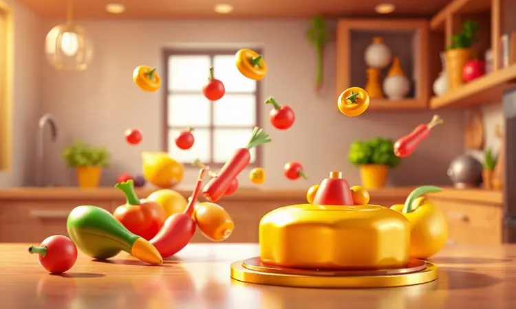

Imagine abrir mão do óleo sem abrir mão do sabor, ou preparar um frango inteiro crocante e suculento enquanto assa batatas e legumes na mesma bancada.

A melhor air fryer oven 25 litros é exatamente esse companheiro culinário que transforma a cozinha em um espaço de liberdade criativa, unindo a agilidade da fritura a ar com a versatilidade de um forno de grande capacidade.

Esses modelos robustos conquistaram famílias por permitirem o preparo de refeições completas de uma só vez, eliminando a necessidade de múltiplos eletrodomésticos.

Neste guia, analisamos as opções mais bem avaliadas de 2025, considerando não apenas potência e funções, mas o verdadeiro impacto que cada modelo pode ter na sua rotina, desde marcas consolidadas como Mondial e Oster até surpresas como a Suggar, para que você encontre não apenas um aparelho, mas um parceiro para suas aventuras gastronômicas.

<SummaryList products={frontmatter.top_products} />

## Melhores Air Fryers Oven de 25 Litros: Guia de Modelos

Se você busca transformar sua cozinha em um espaço de praticidade e sabor, conhecer os modelos disponíveis é o primeiro passo.

Cada uma das opções abaixo oferece uma combinação única de recursos que pode se adaptar exatamente ao seu estilo de vida, seja você um chef em ascensão ou quem simplesmente quer mais tempo livre com a família.

### 1. MONDIAL Fritadeira Air Fryer Forno Oven Digital 25L, Preto/Inox, 2200W

<ProductBox 
  title={frontmatter.top_products[0].title} 
  image={frontmatter.top_products[0].image} 
  link={frontmatter.top_products[0].link} 
/>

Com 2200W de potência, essa Mondial conquista pela simplicidade inteligente. Pense em preparar uma pizza de 30 cm com a crosta perfeita enquanto programa o timer digital por até 90 minutos, tudo sem precisar vigiar constantemente.

O painel com 12 funções pré-programadas elimina adivinhações, permitindo que você frite, asse e gratine com apenas um toque.

O controle de temperatura ajustável até 220°C dá a liberdade para explorar desde snacks crocantes até assados delicados, tudo com a tranquilidade de saber que está criando refeições mais saudáveis para sua família.

Claro, seu design robusto exige espaço na bancada, mas é justamente essa presença que garante a capacidade para porções generosas.

<CaixaProsContras>

**Prós:**

- Versatilidade: funciona como fritadeira e forno.

- Grande capacidade para assar porções grandes.

- Painel digital com várias funções predefinidas.

- Preparo saudável sem uso de óleo.

**Contras:**

- Ocupa bastante espaço na bancada.

- A potência alta pode refletir em consumo energético.

</CaixaProsContras>

### 2. Forno Air Fryer 25L, Preto, Hamilton Beach

<ProductBox 
  title={frontmatter.top_products[1].title} 
  image={frontmatter.top_products[1].image} 
  link={frontmatter.top_products[1].link} 
/>

Seguindo na linha da versatilidade, a Hamilton Beach oferece uma experiência intuitiva desde o primeiro uso.

Imagine seus filhos preparando batatas fritas crocantes com os botões grandes e claros, ou você grelhando vegetais enquanto acompanha o processo através da ampla janela de visualização.

A tecnologia Sure-Crisp® não é apenas um nome sofisticado, é a garantia de que cada mordida terá aquela textura satisfatória que parece ter sido frita em óleo, mas com uma fração das calorias.

Com 12 funções pré-definidas, você tem à disposição desde o assado de domingo até o peixe grelhado da semana, tudo em um design preto elegante que se limpa com um pano úmido.

<CaixaProsContras>

**Prós:**

- Versatilidade com 12 funções de preparo.

- Grande capacidade de 25 litros para refeições em família.

- Tecnologia Sure-Crisp® para resultados crocantes.

- Design elegante e fácil de limpar.

**Contras:**

- A potência pode variar entre os modelos.

- Pode ocupar um espaço considerável na cozinha.

</CaixaProsContras>

### 3. Oster Forno e Fryer 25L Oster Multifunções 10 em 1, OFOR250

<ProductBox 
  title={frontmatter.top_products[2].title} 
  image={frontmatter.top_products[2].image} 
  link={frontmatter.top_products[2].link} 
/>

Para quem não quer apenas cozinhar, mas explorar possibilidades, a Oster OFOR250 é uma verdadeira estação criativa.

Com 10 modos de preparo, incluindo a função desidratar para fazer chips de frutas caseiros ou carne seca, você transforma ingredientes simples em experiências gastronômicas.

A tecnologia de Turbo Convecção trabalha silenciosamente para distribuir o calor uniformemente, garantindo que suas batatas fiquem douradas por igual sem precisar virá-las constantemente.

O display digital oferece precisão profissional, enquanto o rápido pré-aquecimento (cerca de 5 minutos para 200°C) respeita seu tempo. Sim, o exterior pode aquecer durante o uso, mas isso é um lembrete sutil de que a magina está acontecendo dentro.

<CaixaProsContras>

**Prós:**

- Versatilidade com 10 modos de preparo.

- Tecnologia de Turbo Convecção para cozimento uniforme.

- Display digital que facilita o uso.

- Acompanha diversos acessórios úteis.

**Contras:**

- O exterior pode esquer durante o uso.

- A limpeza da bandeja coletora pode ser um pouco trabalhosa.

</CaixaProsContras>

### 4. NEUHAUS FORNO OVEN FRYER COM ROTISSERIE INOX 25 LITROS XXL 2500W

<ProductBox 
  title={frontmatter.top_products[3].title} 
  image={frontmatter.top_products[3].image} 
  link={frontmatter.top_products[3].link} 
/>

Se o sonho é assar um frango inteiro com aquela crosta dourada perfeita enquanto prepara legumes assados na mesma bancada, a Neuhaus traz esse cenário para sua cozinha.

A função rotisserie com espeto giratório não é apenas um recurso, é o convite para transformar domingos em celebrações, garantindo que cada pedaço fique suculento e crocante por igual.

Com 2500W de potência e a tecnologia NEUSPEED 360°, o ar quente circula como um abraço envolvente em torno dos alimentos, cozinhando uniformemente sem pontos crus ou queimados.

A luz interna permite aquela espiada curiosa sem abrir a porta e interromper o processo, mantendo a temperatura estável para resultados consistentes.

<CaixaProsContras>

**Prós:**

- Multifuncional: combina air fryer e forno.

- Grande capacidade de 25 litros.

- Tecnologia de circulação de ar 360° para cozimento uniforme.

- Função rotisserie para assados perfeitos.

**Contras:**

- Pode ocupar bastante espaço na cozinha.

- Peso considerável, o que pode dificultar movimentação.

</CaixaProsContras>

### 5. SUGGAR FORNO AIR FRYER OVEN 25 LITROS PRETO FE2501PT

<ProductBox 
  title={frontmatter.top_products[4].title} 
  image={frontmatter.top_products[4].image} 
  link={frontmatter.top_products[4].link} 
/>

A Suggar FE2501PT prova que sofisticação pode ser simples. Imagine ajustar a temperatura de 0°C a 230°C com precisão para cada receita, desde o iogurte caseiro até o pão crocante do café da manhã.

Com 1500W de potência, ela oferece a combinação perfeita entre eficiência energética e resultados rápidos, aquecendo uniformemente sem surpresas.

O timer de 60 minutos e a luz interna criam uma experiência de cozinha tranquila, onde você pode preparar o jantar enquanto ajuda as crianças com a lição de casa, apenas dando uma olhada ocasional.

É importante verificar sua instalação elétrica, mas essa atenção inicial garante anos de funcionamento seguro e confiável.

<CaixaProsContras>

**Prós:**

- Funcionalidade 2 em 1 como fritadeira e forno

- Cozimento rápido com tecnologia Air Fryer

- Capacidade ideal para várias preparações

- Design moderno e fácil de limpar

**Contras:**

- Requer instalação elétrica adequada

- Pode ter confusão nas especificações sobre resistências

</CaixaProsContras>

### 6. MONDIAL Fritadeira Air Fryer Forno Oven Digital 25L, Preto/Inox, 2000W

<ProductBox 
  title={frontmatter.top_products[5].title} 
  image={frontmatter.top_products[5].image} 
  link={frontmatter.top_products[5].link} 
/>

Esta Mondial de 2000W é a prova de que tecnologia pode ser acessível. Visualize preparar o almoço completo da família enquanto programa o timer com desligamento automático e escolhe entre 12 funções pré-programadas no painel digital intuitivo.

As assadeiras antiaderentes inclusas não são apenas acessórios, são convites para experimentar novas receitas sem medo de grudar, enquanto a grelha permite que a gordura escorra, resultando em alimentos mais leves e saborosos.

O design em inox com visor amplo e iluminação interna adiciona um toque de elegância à sua bancada, transformando o ato de cozinhar em uma experiência visual que antecipa o prazer de saborear.

<CaixaProsContras>

**Prós:**

- Combina funções de air fryer e forno em um só aparelho.

- Grande capacidade de 25 litros, ideal para famílias.

- Painel digital fácil de usar com várias funções.

- Acessórios inclusos aumentam a versatilidade.

**Contras:**

- Ocupa bastante espaço na bancada.

- Pode ser mais complexa para quem busca um aparelho muito simples.

</CaixaProsContras>

### 7. MONDIAL Air Fryer Forno 25L French Door, Preto/Inox, 2200W - AFD

<ProductBox 
  title={frontmatter.top_products[6].title} 
  image={frontmatter.top_products[6].image} 
  link={frontmatter.top_products[6].link} 
/>

Para quem vive a dualidade de querer simplificar a cozinha sem abrir mão da sofisticação, a Mondial French Door apresenta uma solução elegante.

As portas duplas não são apenas bonitas, elas abrem como asas dando acesso completo ao interior de 25 litros, onde você pode preparar uma lasanha enquanto assa legumes em uma bandeja separada, graças à tecnologia Dualzone.

Imagine cozinhar dois pratos diferentes simultaneamente, cada um com temperatura e timer individual, como se tivesse dois fornos em um.

Os 2200W de potência garantem que essa versatilidade não comprometa a velocidade, trazendo eficiência para sua rotina sem sacrificar a apresentação dos pratos.

<CaixaProsContras>

**Prós:**

- Grande capacidade de 25 litros.

- Tecnologia Dualzone para cozinhar pratos diferentes simultaneamente.

- Design elegante com portas French Door.

- Potência elevada para cozimento rápido.

**Contras:**

- Pode ser grande demais para cozinhas compactas.

- Alguns usuários podem achar o painel touch sensível demais.

</CaixaProsContras>

### 8. Philco Forno Elétrico PFE25I Air Fry 2 em 1 Esmaltado 25L

<ProductBox 
  title={frontmatter.top_products[7].title} 
  image={frontmatter.top_products[7].image} 
  link={frontmatter.top_products[7].link} 
/>

A Philco PFE25I entende que cozinhar deve ser uma experiência, não uma tarefa. O controle de temperatura de 100°C a 230°C oferece a liberdade de explorar desde desidratação delicada até fritura crocante, tudo com precisão que antes era exclusiva de chefs profissionais.

O interior esmaltado é mais do que fácil de limpar, é uma promessa de que cada uso começará com uma superfície impecável, enquanto a iluminação interna permite acompanhar a transformação dos alimentos sem interromper o processo.

As grelhas ajustáveis em três níveis dão flexibilidade para assar um bolo enquanto gratinam queijo sobre legumes, criando camadas de sabor em um só aparelho.

<CaixaProsContras>

**Prós:**

- Versatilidade com função 2 em 1 (forno + air fryer)

- Controle de temperatura amplo e preciso

- Fácil de limpar devido ao interior esmaltado

- Vários modos de aquecimento para diferentes receitas

**Contras:**

- Um pouco pesado, o que pode dificultar o manuseio

- Não é dos mais compactos para espaços reduzidos

</CaixaProsContras>

### 9. EOS Forno Elétrico e Air Fryer 25 Litros 3 em 1 Inox EFE25AID

<ProductBox 
  title={frontmatter.top_products[8].title} 
  image={frontmatter.top_products[8].image} 
  link={frontmatter.top_products[8].link} 
/>

Quando espaço na cozinha é precioso mas a vontade de experimentar é grande, o EOS EFE25AID oferece uma solução tripla.

Imagine substituir três eletrodomésticos por um só: forno para assar pães, air fryer para batatas crocantes e desidratador para fazer tomates secos caseiros.

O painel digital touch responde com suavidade aos seus comandos, enquanto as 8 opções pré-programadas são como atalhos para receitas favoritas, desde batatas fritas perfeitas até bolos fofos.

Com 1800W de potência, ele entrega desempenho robusto sem consumir energia excessiva, provando que eficiência e versatilidade podem coexistir em um design que valoriza sua bancada.

<CaixaProsContras>

**Prós:**

- Funções 3 em 1 que economizam espaço na cozinha.

- Capacidade generosa de 25 litros.

- Painel digital intuitivo para facilitar o uso.

- Acessórios inclusos para maior versatilidade.

**Contras:**

- Pode ser volumoso para algumas cozinhas pequenas.

- O preço pode ser um pouco mais elevado em comparação com modelos básicos.

</CaixaProsContras>

### 10. Fritadeira Air Fryer Forno Gallant Digital 25L GFE25 Rotisserie

<ProductBox 
  title={frontmatter.top_products[9].title} 
  image={frontmatter.top_products[9].image} 
  link={frontmatter.top_products[9].link} 
/>

A Gallant GFE25 é para quem acredita que cozinhar é um ato de cuidado. A função rotisserie transforma o simples frango em uma celebração, girando lentamente para que cada centímetro receba o calor uniforme que garante crocância por fora e suculência por dentro.

Com 1700W de potência e capacidade para 25 litros, ela acolhe refeições familiares completas, enquanto o painel digital oferece controle preciso de temperatura (60°C a 200°C) e timer de até 90 minutos.

A atenção à voltagem (127V ou 220V) é um detalhe técnico que garante segurança e longevidade, permitindo que você se concentre no que realmente importa: criar memórias ao redor da mesa.

<CaixaProsContras>

**Prós:**

- Multifuncionalidade (fritadeira, forno e grelhador).

- Boa capacidade de 25 litros, adequada para grandes famílias.

- Potente (1700W), proporcionando cozimento rápido.

- A função rotisserie garante assados crocantes e suculentos.

**Contras:**

- Não é bivolt, exigindo atenção à voltagem.

- O tamanho pode ser excessivo para cozinhas menores.

</CaixaProsContras>

## Como escolher a air fryer ideal

Escolher sua air fryer ideal vai além de comparar especificações técnicas. Comece imaginando suas manhãs de sábado: você prefere a simplicidade de um painel analógico ou a precisão de um digital com funções pré-programadas?

Considere quantas pessoas compartilham suas refeições e se vale a pena investir em 25 litros para ter liberdade de preparar porções generosas de uma só vez.

Pense também na sua rotina de limpeza: peças removíveis e laváveis na máquina podem economizar minutos preciosos no seu dia.

Por fim, leia experiências reais de outros usuários, porque durabilidade não é apenas sobre materiais, mas sobre como o aparelho se adapta à vida real das famílias.

## Principais vantagens das air fryers

O que realmente transforma air fryers em companheiras de cozinha é como elas reconciliam saúde com prazer. Imagine saborear batatas fritas crocantes sem aquela sensação pesada depois, ou assar um frango dourado usando apenas uma colher de azeite.

Essa economia de óleo não é apenas sobre calorias, é sobre se sentir bem após cada refeição. A versatilidade permite que um só aparelho substitua vários, liberando espaço na bancada e simplificando sua organização.

E quando você descobre que pode preparar o jantar em metade do tempo, ganhando minutos para si mesmo ou para a família, percebe que essa não é apenas uma ferramenta culinária, é uma aliada na busca por mais qualidade de vida.

## Tipos de air fryers disponíveis

Cada tipo de air fryer atende a uma necessidade diferente na dança diária da cozinha.

As compactas são como parceiras discretas para solteiros ou casais, enquanto as de 25 litros se expandem para abraçar famílias inteiras, permitindo que você prepare o prato principal e os acompanhamentos simultaneamente.

Alguns modelos oferecem funções especiais como desidratar, transformando frutas em snacks saudáveis, ou grelhar, trazendo aquelas marcas apetitosas aos vegetais.

A tecnologia de convecção é a magia por trás do cozimento uniforme, garantindo que tudo fique dourado por igual sem precisar virar constantemente. Sua escolha deve refletir não apenas o espaço disponível, mas como você deseja que sua cozinha funcione para você.

## Analógico ou Digital: Qual Painel Vale Mais a Pena?

A escolha entre painel analógico e digital reflete sua relação com a cozinha. O analógico é como um amigo direto e simples: você gira o botão e ele responde, ideal para quem valoriza a intuição sobre a precisão.

Já o digital é o parceiro técnico que oferece controle milimétrico, lembrando você de temperaturas específicas para cada receita e permitindo programações que respeitam seu tempo.

Se sua culinária é espontânea e baseada no feeling, o analógico pode ser tudo que você precisa. Mas se você adora explorar receitas complexas ou precisa que o jantar esteja pronto exatamente quando chegar em casa, o digital transforma essa precisão em tranquilidade.

## A Vantagem do Espeto Giratório nos Modelos 25L

O espeto giratório é mais do que um acessório, é uma experiência culinária que transforma o ato de assar.

Imagine um frango girando lentamente, cada lado recebendo o calor igualmente, enquanto a gordura escorre para a bandeja coletora, resultando em uma carne suculenta sem excesso de gordura.

Esse movimento rotativo não apenas garante uniformidade, mas cria uma crosta dourada perfeita em toda a superfície, algo difícil de alcançar em métodos tradicionais.

Para famílias que adoram um bom assado de domingo ou querem impressionar em ocasiões especiais, essa função adiciona um toque profissional que faz toda a diferença no sabor e na apresentação.

## O que analisar antes de comprar

Antes de levar sua nova companheira culinária para casa, faça algumas perguntas essenciais.

A potência de 1700W a 2500W influencia não apenas a velocidade, mas como o aparelho se integra à sua conta de luz: modelos mais potentes cozinham mais rápido, mas consomem mais energia durante esse tempo.

Os 25 litros de capacidade são um abraço generoso para famílias, mas avalie se sua bancada tem espaço para acolher esse volume. As funções múltiplas (fritar, assar, grelhar) podem simplificar sua rotina, substituindo vários eletrodomésticos por um só.

E a facilidade de limpeza, especialmente com peças removíveis, pode transformar uma tarefa chata em um ritual rápido, garantindo que seu aparelho esteja sempre pronto para a próxima criação.

## Dicas de uso e manutenção

Para extrair o máximo da sua air fryer, comece criando o hábito do pré-aquecimento. Esses poucos minutos de espera ativam a circulação de ar quente, garantindo que seus alimentos atinjam a crocância ideal desde o primeiro contato.

Evite a tentação de encher a cesta completamente: porções menores permitem que o ar circule livremente, resultando em alimentos uniformemente cozidos e mais saborosos.

Após cada uso, enquanto ainda está morno, limpe o interior e as grelhas com um pano úmido; essa pequena rotina evita o acúmulo de gordura que pode afetar o sabor das próximas refeições.

E sempre confie nas recomendações do fabricante para tempo e temperatura: eles são o mapa que garante que você chegue ao destino saboroso que imaginou.

## Como limpar air fryer oven?

Limpar sua air fryer não precisa ser uma batalha. Comece desconectando o aparelho e dando a ele alguns minutos para esfriar, mostrando o mesmo respeito que ele mostra ao seu alimento.

A maioria das partes internas, como a bandeja coletora de gordura e a cesta, foi projetada para se soltar com facilidade, pronta para uma lavagem rápida com água morna e detergente suave.

Para resíduos mais persistentes, uma esponja não abrasiva é sua melhor aliada, removendo a sujeira sem arranhar o revestimento precioso.

O interior do forno aceita um pano úmido passado com carinho, evitando produtos químicos agressivos que poderiam comprometer sua durabilidade. Em poucos minutos, você terá um aparelho renovado, pronto para receber sua próxima inspiração culinária.

## Quais receitas posso fazer com uma Air fryer oven?

Sua air fryer oven é um portal para reinventar sua relação com a comida. Imagine acordar com o aroma de pão caseiro ainda quente, com a casca crocante que só a circulação de ar quente proporciona.

No almoço, transforme batatas simples em fritas douradas que desafiariam qualquer fast-food, mas com uma fração das calorias. Para o jantar, asse um peixe inteiro com a pele estaladiça e a carne úmida, acompanhado de legumes grelhados com aquelas marcas charmosas.

Nos fins de semana, explore a função rotisserie para um frango que vira atração principal, ou use a desidratação para criar chips de maçã como snacks saudáveis.

Cada função é um convite para brincar com sabores, texturas e apresentações, provando que comer bem pode ser ao mesmo tempo simples e especial.

## Oster vs Mondial vs Philco: Comparativo de Marcas

Cada marca traz uma personalidade diferente para sua cozinha. A Oster é a amiga confiável que sempre entrega resultados consistentes, com tecnologia robusta que dura anos e uma eficiência que respeita seu tempo.

A Mondial é a companheira acessível que descomplica o dia a dia, oferecendo funcionalidades essenciais em designs intuitivos que não exigem manuais complicados.

Já a Philco é a parceira sofisticada que combina design moderno com tecnologia prática, como grelhas ajustáveis e interiores fáceis de limpar que mostram atenção aos detalhes do cotidiano.

Sua escolha não é sobre qual é melhor em absoluto, mas sobre qual dialoga melhor com sua rotina, seu espaço e sua maneira única de viver a cozinha.

## Perguntas Frequentes (FAQ)

As dúvidas que surgem antes da compra são naturais, e respondê-las é parte da jornada para encontrar o parceiro culinário perfeito.

Cada questão abaixo foi cuidadosamente selecionada para ajudar você a visualizar como uma air fryer oven de 25 litros pode se encaixar na sua vida, considerando desde o espaço na bancada até as possibilidades culinárias que ela abre.

### É possível assar bolos em uma air fryer oven de 25 litros?

Absolutamente! A capacidade de 25 litros é mais do que suficiente para acomodar formas de bolo tradicionais, e a circulação de ar quente oferece uma vantagem especial: cozimento uniforme que elimina aquela frustração do centro cru enquanto as bordas já estão douradas.

A chave está em ajustar o tempo e a temperatura, já que a eficiência do aparelho pode reduzir em até 20% o tempo de forno convencional.

Comece com receitas simples, observe como seu modelo específico se comporta, e em breve você estará assando desde bolos fofos de café da manhã até cheesecakes cremosos, tudo com a praticidade de um aparelho que já faz parte da sua rotina.

### Qual a vida útil média de uma air fryer oven?

Com os cuidados adequados, sua air fryer pode ser uma companheira de cozinha por 5 a 10 anos. Marcas estabelecidas costumam usar componentes mais duráveis e oferecer garantias que refletem essa confiança.

O segredo da longevidade está na simplicidade: limpeza regular após o uso, evitando temperaturas extremas por períodos prolongados, e respeito às recomendações do fabricante para carga máxima.

Pense nela como um investimento que, quando bem cuidado, retorna em refeições saudáveis e momentos especiais ao redor da mesa ano após ano.

### As air fryers oven são fáceis de limpar?

A facilidade de limpeza é uma das surpresas mais agradáveis desses aparelhos.

A maioria foi projetada com a vida real em mente: peças removíveis que vão direto para a máquina de lavar louça, revestimentos antiaderentes que impedem que os alimentos grudem, e superfícies lisas que aceitam um simples pano úmido.

O processo se torna tão intuitivo que, após algumas semanas, você nem pensa mais nisso como uma tarefa, apenas como o passo natural entre uma refeição deliciosa e a próxima criação culinária.

### Posso cozinhar alimentos congelados diretamente na air fryer oven?

Sim, e essa é uma das magias mais práticas! A circulação de ar quente penetra mesmo nos alimentos congelados, criando aquela crocância exterior que parece ter sido frita enquanto mantém o interior úmido e bem cozido.

O segredo está em ajustar o tempo (geralmente alguns minutos a mais do que alimentos descongelados) e evitar sobrecarregar a cesta para que o ar circule livremente.

É a solução perfeita para aqueles dias em que o planejamento falha, mas o desejo por uma refeição saborosa e caseira permanece.

### Como posso evitar que os alimentos fiquem secos na air fryer oven?

A chave para alimentos suculentos está no equilíbrio entre temperatura e tempo. Comece seguindo as recomendações do fabricante, mas considere reduzir levemente o tempo se notar que suas carnes estão ficando secas.

Uma pequena quantidade de óleo ou marinada não apenas adiciona sabor, mas cria uma barreira protetora que retém a umidade interior. Para cortes maiores, usar papel alumínio nos primeiros minutos do cozimento pode fazer uma diferença dramática na suculência final.

Com prática, você desenvolverá um feeling para o ponto perfeito de cada alimento.

### A air fryer oven pode ser utilizada para descongelar alimentos?

Muitos modelos oferecem uma função específica de descongelamento que utiliza temperaturas baixas para derreter o gelo gradualmente, preservando a textura e o sabor dos alimentos.

É especialmente útil para carnes que você esqueceu de tirar do freezer, permitindo que elas estejam prontas para o preparo em minutos em vez de horas.

A atenção aqui é garantir que o processo seja interrompido antes que o cozimento comece, mas com o timer programável, você tem controle total sobre essa transição delicada.

### Air fryer oven gasta mais energia?

Comparada a um forno elétrico tradicional, a air fryer oven tende a ser mais eficiente porque aquece mais rapidamente e cozinha em menos tempo, reduzindo o período em que consome energia em sua potência máxima.

A economia se torna mais evidente quando você considera que muitas vezes pode preparar uma refeição completa usando apenas este aparelho, em vez de ligar múltiplos eletrodomésticos simultaneamente.

É uma eficiência que se reflete não apenas na conta de luz, mas na otimização do seu tempo e espaço na cozinha.

### Posso usar papel manteiga na Air fryer oven?

Sim, o papel manteiga pode ser um grande aliado, especialmente para receitas que tendem a grudar ou para facilitar a limpeza.

O importante é cortá-lo para caber exatamente na bandeja ou cesta, garantindo que não bloqueie as entradas de ar que são essenciais para a circulação de calor.

Coloque os alimentos sobre o papel para mantê-lo no lugar durante o cozimento, e você terá a praticidade do papel manteiga sem comprometer a eficiência que faz da air fryer uma revolucionária culinária.

## Conclusão

Escolher a melhor air fryer oven 25 litros é mais do que selecionar um eletrodoméstico: é convidar um novo parceiro para sua jornada culinária.

Cada modelo apresentado oferece uma combinação única de capacidade, tecnologia e personalidade, desde a simplicidade inteligente da Mondial até a sofisticação versátil da Neuhaus com seu espeto giratório.

O que todos compartilham é a promessa de transformar sua relação com a cozinha, oferecendo liberdade para explorar sabores sem as amarras do óleo excessivo ou do tempo limitado.

Ao considerar potência, funções, espaço e, principalmente, como cada recurso se traduz em benefícios reais para sua rotina, você encontra não apenas um aparelho eficiente, mas um aliado que respeita seu tempo, sua saúde e seu prazer em criar.

Agora é sua vez de imaginar as possibilidades: qual dessas companheiras culinárias ajudará você a escrever as próximas páginas da sua história gastronômica?