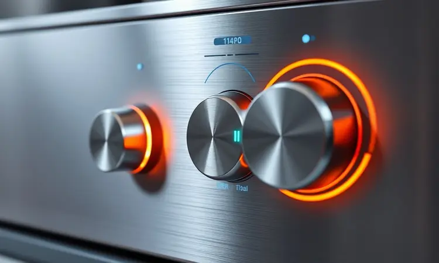
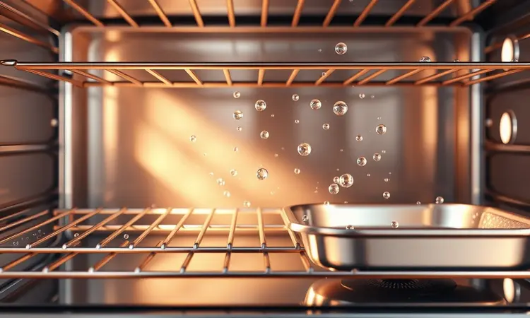

Os fornos com função air fryer, também conhecidos como fornos oven, tornaram-se o desejo de quem busca praticidade e saúde na cozinha moderna.

Unindo o espaço generoso de um forno convencional com a tecnologia de circulação de ar ultra-rápida das fritadeiras sem óleo, esses aparelhos permitem assar, fritar e até desidratar alimentos em um único lugar.

Com a crescente variedade de marcas e capacidades, escolher o modelo ideal pode ser um desafio. Neste guia, selecionamos os melhores modelos de 2025, analisando potência, recursos e custo-benefício para que você faça a escolha certa para sua casa.

<SummaryList products={frontmatter.top_products} />

## Qual o melhor forno com air fryer? Veja modelos que serão abordados

Se você está diante de tantas opções e não sabe por onde começar, respire fundo. A escolha do forno com air fryer ideal depende muito do seu estilo de vida.

Pense no espaço que você tem na cozinha, no tamanho da sua família e nas receitas que mais fazem seus olhos brilharem. Para te ajudar nessa decisão, preparamos um mergulho detalhado nos 11 modelos que estão conquistando as cozinhas brasileiras em 2025.

São aparelhos que vão muito além de fritar batatas, prometendo revolucionar sua forma de cozinhar.

### 1. Midea OvenFryer FFA20P1

<ProductBox 
  title={frontmatter.top_products[0].title} 
  image={frontmatter.top_products[0].image} 
  link={frontmatter.top_products[0].link} 
/>

Para quem busca um aliado versátil e que não exige conhecimentos avançados de culinária, o Midea OvenFryer se apresenta como uma ótima companhia. Com seus 12 litros de capacidade e potência de 1700W, ele é aquele parceiro que entende seu dia a dia corrido.

Imagine conseguir fritar, assar, grelhar e até desidratar frutas para um lanche saudável sem precisar trocar de aparelho.

A mágica acontece com o controle preciso de temperatura, que vai de 80°C a 200°C, e um timer de 60 minutos que desliga sozinho, te dando a liberdade de fazer outras tarefas sem preocupação.

A porta de vidro com luz interna é como ter uma janela para o cozimento, enquanto as peças antiaderentes vão direto para a lava-louças, transformando a limpeza em um momento rápido, não em uma tarefa cansativa.

<CaixaProsContras>

**Prós:**

- Capacidade espaçosa de 12 litros para diversos pratos.

- Várias funções - fritar, assar, grelhar e desidratar.

- Bom sistema de segurança com desligamento automático.

- Design prático com porta de vidro para fácil visualização.

**Contras:**

- Peso considerável que pode dificultar o manuseio.

- A versão com Wi-Fi e aplicativo pode ser limitada a modelos específicos.

</CaixaProsContras>

### 2. Britânia BFR2100P

<ProductBox 
  title={frontmatter.top_products[1].title} 
  image={frontmatter.top_products[1].image} 
  link={frontmatter.top_products[1].link} 
/>

Se a ideia é ter um painel de controle que parece intuitivo desde o primeiro toque, a Britânia BFR2100P entra em cena. Ela mantém a capacidade espaçosa de 12 litros, mas adiciona a praticidade de 9 funções pré-programadas no painel digital.

É a sensação de ter um assistente culinário que já sabe o tempo e a temperatura ideais para fritar nuggets, assar legumes ou reaquecer a pizza do dia anterior. A tecnologia Air Flow trabalha para garantir que o calor envolva os alimentos de forma uniforme.

Alguns usuários notam que, em certos níveis, o calor pode não se distribuir com perfeição absoluta, mas no dia a dia, o resultado é de crocância por fora e suculência por dentro, especialmente para famílias que valorizam a agilidade.

<CaixaProsContras>

**Prós:**

- Multifuncional: frita, assa e desidrata.

- Grande capacidade de 12 litros.

- Painel digital intuitivo com funções pré-programadas.

- Tecnologia Air Flow para cozimento uniforme.

**Contras:**

- Distribuição de calor pode ser desigual em alguns níveis.

- Cabo de alimentação pode ser considerado fino por alguns usuários.

</CaixaProsContras>

### 3. Elgin Oven Fry 4 em 1

<ProductBox 
  title={frontmatter.top_products[2].title} 
  image={frontmatter.top_products[2].image} 
  link={frontmatter.top_products[2].link} 
/>

Aqui, a Elgin oferece potência extra para quem não tem tempo a perder. Com 1800W, este modelo aquece rapidamente, ideal para aqueles minutos preciosos entre chegar em casa e servir o jantar.

Suas 10 opções de preparo no painel touch são um convite para experimentar: de batatas fritas crocantes a carne assada suculenta. A promessa é de uma cozinha mais saudável, com menos óleo, mas sem abrir mão do sabor e da textura que todo mundo adora.

O design moderno, porém, pede um cantinho especial na bancada. Para quem vê o eletrodoméstico como um investimento que otimiza tempo e expande o cardápio, ele cumpre muito bem seu papel.

<CaixaProsContras>

**Prós:**

- Multifuncionalidade (fritar, assar, desidratar, reaquecer)

- Boa capacidade para famílias médias ou grandes

- Tecnologia que proporciona cozimento uniforme

- Facilidade de limpeza com peças removíveis

**Contras:**

- Design pode ocupar bastante espaço na cozinha

- Potência elevada pode consumir mais energia

</CaixaProsContras>

### 4. Mondial AFON-12L-BI

<ProductBox 
  title={frontmatter.top_products[3].title} 
  image={frontmatter.top_products[3].image} 
  link={frontmatter.top_products[3].link} 
/>

Este modelo da Mondial é para quem aprecia a simplicidade inteligente. O painel digital com 10 funções predefinidas é tão claro que praticamente elimina a necessidade do manual. Quer fazer frango assado, bolo ou batatas rústicas? Basta girar o seletor.

A experiência é pensada para ser descomplicada, desde o preparo até a limpeza, com acessórios antiaderentes que vão à lava-louças.

A atenção fica por conta do tamanho, que requer um espaço dedicado na bancada, e da voltagem fixa, um detalhe importante na hora da compra para evitar surpresas.

<CaixaProsContras>

**Prós:**

- Combina forno e Air Fryer em um só aparelho.

- Capacidade de 12 litros para preparar grandes porções.

- Painel digital com 10 funções predefinidas.

- Acessórios antiaderentes e laváveis na lava-louças.

**Contras:**

- Ocupa bastante espaço na bancada.

- Não é bivolt, necessitando escolha da voltagem correta.

</CaixaProsContras>

### 5. Electrolux EAF90

<ProductBox 
  title={frontmatter.top_products[4].title} 
  image={frontmatter.top_products[4].image} 
  link={frontmatter.top_products[4].link} 
/>

Para quem enxerga a cozinha como um laboratório de sabores e está disposto a investir em um equipamento robusto, o Electrolux EAF90 se destaca.

Sua multifuncionalidade 5 em 1 e mais de 10 programas vão desde frituras sem culpa até a desidratação perfeita para chips de vegetais.

O grande atrativo é a promessa de preparar alimentos com até 90% menos gordura, uma mudança real para quem busca hábitos mais saudáveis. A qualidade de construção e os resultados consistentes justificam o preço mais elevado.

É a escolha para quem não quer apenas um eletrodoméstico, mas um parceiro de longo prazo na busca por uma alimentação melhor.

<CaixaProsContras>

**Prós:**

- Multifuncionalidade com cinco funções diferentes.

- Grande capacidade ideal para famílias.

- Design moderno e fácil limpeza.

- Reduz gordura e calorias nos alimentos.

**Contras:**

- Preço elevado em comparação a outros modelos.

- Pode ser considerado complexo para iniciantes na cozinha.

</CaixaProsContras>

### 6. Arno Expert 9 em 1 UFE9

<ProductBox 
  title={frontmatter.top_products[5].title} 
  image={frontmatter.top_products[5].image} 
  link={frontmatter.top_products[5].link} 
/>

Imagine um único aparelho que substitui nove utensílios da sua cozinha. Essa é a proposta da Arno Expert. Com 11 litros, ela atende bem famílias maiores e oferece uma gama impressionante de funções, da grelha rápida à desidratação lenta.

A tecnologia Hot Air é o segredo para a crocância que engana qualquer paladar, fazendo você acreditar que usou óleo. A limpeza fácil é outro ponto alto.

A única ressalva é a falta de bivolt, um detalhe técnico que precisa ser checado na sua tomada, mas que não ofusca a versatilidade que ela entrega no dia a dia.

<CaixaProsContras>

**Prós:**

- Oferece 9 funções diferentes em um só aparelho.

- Capacidade ideal para famílias grandes.

- Tecnologia Hot Air para melhor crocância.

- Painel digital com programas automáticos facilita o uso.

**Contras:**

- Não é bivolt, limitando a voltagem disponível.

- Pode ser um pouco pesado para manusear.

</CaixaProsContras>

### 7. Philips Walita Série 5000 AI551

<ProductBox 
  title={frontmatter.top_products[6].title} 
  image={frontmatter.top_products[6].image} 
  link={frontmatter.top_products[6].link} 
/>

A Philips traz para a mesa sua renomada tecnologia Rapid Air, prometendo aquele cozimento uniforme que deixa os alimentos crocantes por fora e macios por dentro, usando uma fração mínima de óleo.

A capacidade de 12 litros e funções que vão do iogurte caseiro ao grelhado perfeito falam diretamente a quem valoriza saúde sem abrir mão da praticidade. A limpeza é facilitada pelos acessórios antiaderentes.

Novamente, a voltagem fixa (127V ou 220V) pede atenção, mas para quem tem a rede elétrica compatível, é uma opção que combina confiabilidade de marca com resultados de alto nível.

<CaixaProsContras>

**Prós:**

- Grande capacidade de 12 litros.

- Multifuncionalidade com várias opções de preparo.

- Tecnologia que reduz gordura nos alimentos.

- Facilidade na limpeza dos acessórios.

**Contras:**

- Não é bivolt, requer atenção à voltagem.

- O tamanho pode ser um pouco volumoso para cozinhas pequenas.

</CaixaProsContras>

### 8. WAP Barbecue 12 em 1

<ProductBox 
  title={frontmatter.top_products[7].title} 
  image={frontmatter.top_products[7].image} 
  link={frontmatter.top_products[7].link} 
/>

Para o amante de churrasco que mora em apartamento ou não quer lidar com a fumaça, a WAP Barbecue é uma revelação. Ela não é só uma air fryer, é uma estação de cozinha completa.

O sistema de grelha com quatro níveis de temperatura imprime aquele sabor defumado na carne, enquanto a função Smokeless permite cozinhar com a tampa aberta, dentro de casa, sem alardes. São 12 funções que oferecem uma liberdade criativa rara.

O tamanho é generoso (10 litros), ideal para receber amigos, mas pode ser um desafio para cozinhas compactas.

<CaixaProsContras>

**Prós:**

- 12 funções culinárias que oferecem versatilidade.

- Tecnologia de circulação de ar que garante alimentos crocantes.

- Sistema Smokeless que reduz fumaça ao cozinhar.

- Painel digital intuitivo com timer programável.

**Contras:**

- Tamanho pode ser grande para cozinhas menores.

- Pode ser mais complexa para quem busca apenas uma air fryer simples.

</CaixaProsContras>

### 9. Oster French Door 42L

<ProductBox 
  title={frontmatter.top_products[8].title} 
  image={frontmatter.top_products[8].image} 
  link={frontmatter.top_products[8].link} 
/>

Este é para quem não faz concessões quando o assunto é espaço. Com 42 litros, o Oster French Door é um forno de verdade que incorpora a função air fryer. Assar um frango inteiro, uma pizza grande ou um bolo para uma festa se torna possível.

As portas francesas não são apenas um charme, elas facilitam o acesso ao interior de forma prática e segura. A convecção turbo acelera o cozimento e distribui o calor com eficiência.

Pode exigir um pequeno ajuste nas temperaturas das receitas tradicionais, mas a capacidade e a versatilidade o tornam um trunfo para famílias grandes ou para quem adora cozinhar em quantidade.

<CaixaProsContras>

**Prós:**

- Grande capacidade (42 litros) ideal para refeições familiares.

- Funções versáteis, incluindo air fryer e convecção turbo.

- Portas francesas facilitam o acesso ao interior.

- Boa distribuição de calor para cozimentos uniformes.

**Contras:**

- Temperatura pode ser ligeiramente alta em algumas funções.

- Alguns relatos isolados sobre problemas de durabilidade.

</CaixaProsContras>

### 10. Philco Air Fryer Oven 12L PFR2200P

<ProductBox 
  title={frontmatter.top_products[9].title} 
  image={frontmatter.top_products[9].image} 
  link={frontmatter.top_products[9].link} 
/>

A Philco apresenta um equilíbrio interessante entre tecnologia acessível e desempenho. Com nove funções pré-programadas e um painel digital claro, ela tira o estresse da descoberta.

Os 1800W de potência garantem agilidade, e o revestimento cerâmico antiaderente transforma a limpeza em algo quase insignificante.

A experiência é pensada para ser fácil, embora, como em muitos aparelhos automáticos, algumas receitas específicas possam pedir um ajuste manual no tempo para atingir a perfeição.

É uma candidata forte para quem quer um primeiro forno com air fryer, robusto e sem complicações excessivas.

<CaixaProsContras>

**Prós:**

- Versatilidade com múltiplas funções em um único aparelho.

- Grande capacidade de 12 litros, ideal para famílias.

- Design moderno e fácil de usar com painel digital.

- Fácil limpeza graças ao revestimento antiaderente.

**Contras:**

- A precisão dos tempos e temperaturas pode exigir ajustes manuais.

- Apesar da versatilidade, pode não substituir totalmente um forno convencional para algumas receitas complexas.

</CaixaProsContras>

### 11. Oster Multifunções 25L 10 em 1

<ProductBox 
  title={frontmatter.top_products[10].title} 
  image={frontmatter.top_products[10].image} 
  link={frontmatter.top_products[10].link} 
/>

Fechando nossa seleção com um aparelho que é um verdadeiro canivete suíço, a Oster de 25 litros oferece uma amplitude de funções impressionante. São 10 manuais e 11 pré-programadas, incluindo a exclusiva TenderRoast™ para carnes que derretem na boca.

O modo Air Fryer, que promete usar 99,5% menos óleo, é o coração do aparelho. A iluminação interna e os alertas sonoros guiam você durante o preparo.

A capacidade de 25 litros é um meio-termo excelente, maior que os modelos compactos de 12L, mas ainda mais versátil para quem não precisa do gigante de 42L. É para quem quer explorar todas as possibilidades da cozinha moderna em um único equipamento.

<CaixaProsContras>

**Prós:**

- Versatilidade com múltiplas funções de cozimento.

- Modo air fryer reduz muito a necessidade de óleo.

- Painel digital facilita o uso.

- Acessórios inclusos para prática de preparo e limpeza.

**Contras:**

- Capacidade pode ser limitada para famílias grandes.

- Pode ter uma curva de aprendizado inicial para novos usuários.

</CaixaProsContras>

## Como escolhemos os melhores fornos com air fryer de 2025?

Nossa busca não foi por uma simples lista de especificações. Queríamos entender qual aparelho realmente faz diferença na sua rotina.

Por isso, além dos dados técnicos como eficiência energética (que impacta direto no seu bolso ao final do mês) e capacidade (para saber se ele atende sua família ou seus jantares com amigos), olhamos para a experiência.

Avaliamos a intuitividade dos controles, a real facilidade de limpeza (ninguém quer passar meia hora esfregando) e, principalmente, cruzamos dados técnicos com centenas de avaliações de pessoas que usam esses fornos no dia a dia.

O resultado é uma curadoria que prioriza não apenas o que o aparelho promete, mas o que ele realmente entrega na sua cozinha.

## Vale a pena investir em um forno com air fryer?

A resposta vai depender do que você busca transformar na sua relação com a cozinha.

Se você anseia por praticidade no dia a dia, por poder preparar uma refeição mais saudável em menos tempo, ou por experimentar novas técnicas culinárias sem precisar comprar cinco eletrodomésticos diferentes, então sim, vale cada centavo.

É um investimento que consolida funções, libera espaço e, muitas vezes, reduz o consumo de energia comparado ao forno tradicional. A contrapartida é o espaço físico que ele ocupará.

Mas se você enxerga a cozinha como um lugar de criação e bem-estar, um forno com air fryer deixa de ser um gasto e se torna um facilitador de um estilo de vida mais ágil e saboroso.

## Capacidade e Potência: Como Escolher a Ideal?

Pense na capacidade como o tamanho do seu palco culinário. Para solteiros ou casais, 10 a 12 litros podem ser suficientes. Famílias de 3 a 4 pessoas se dão bem com 12 a 20 litros.

Para quem adora receber ou tem família grande, modelos de 25 litros ou mais, como o Oster French Door, são ideais. Já a potência é o motor desse palco. Entre 1500W e 1800W, você terá um aquecimento rápido e um cozimento uniforme, perfeito para quem valoriza agilidade.

Potências menores podem ser econômicas, mas exigem um pouco mais de paciência. A combinação certa entre espaço e poder define se o aparelho será um parceiro eficiente ou uma fonte de frustração.

## Painel Digital ou Botões: Qual a Melhor Escolha?

Essa escolha é sobre como você prefere se comunicar com sua comida. O painel digital, com sua tela e toques suaves, oferece um visual moderno e, muitas vezes, mais opções de programas automáticos. É como ter um GPS culinário que te guia.

Já os botões físicos tradicionais trazem a simplicidade tátil e a resistência que muitos apreciam, especialmente em ambientes familiares onde crianças ou idosos também vão usar. Não há certo ou errado.

Há o que ressoa com você: a tecnologia que sugere caminhos ou a simplicidade que dá controle absoluto com um giro de botão.

## O que gasta mais energia: airfryer ou forno elétrico?

Aqui a vantagem é clara para a tecnologia air fryer. Imagine a diferença entre esquentar um quarto inteiro (o forno elétrico) e esquentar apenas o ar ao redor do seu alimento (a air fryer).

O forno com função air fryer aquece em minutos, graças ao seu sistema de circulação de ar concentrado, e cozinha os alimentos mais rápido. O forno elétrico tradicional precisa aquecer uma cavidade muito maior e mantê-la quente por mais tempo.

No fim do mês, essa eficiência se traduz em uma conta de luz mais leve, tornando o forno com air fryer não só uma escolha saudável, mas também econômica.

## Dicas para usar o aparelho

Para extrair o máximo do seu novo aliado, comece dando a ele alguns minutos de pré-aquecimento. Isso garante que o choque térmico não roube a crocância dos seus alimentos.

Na hora de dispor os ingredientes na bandeja, pense em dar espaço a cada um, como convidados em uma mesa. Evite sobrepor, e o calor circulará por todos os lados de forma igualitária. Quanto ao óleo, menos é mais.

Muitas receitas funcionam perfeitamente com uma fina camada de spray ou até mesmo sem nada, revelando sabores puros. E fique atento: os tempos de cozimento costumam ser menores do que você está acostumado.

É melhor checar um minuto antes do que descobrir uma refeição ressecada.

## Dicas de Limpeza para Fornos Airfryer

A chave para uma relação duradoura com seu forno air fryer é a limpeza gentil e constante. Após cada uso, com o aparelho já frio, remova a bandeja coletora de gordura e lave com água morna e sabão. Para o interior, um pano úmido com detergente neutro é suficiente.

Fuja de esponjas abrasivas ou produtos químicos agressivos que possem danificar o delicado revestimento antiaderente.

Uma vez por mês, uma limpeza mais profunda com uma mistura de água e vinagre branco (aquecida por alguns minutos no próprio aparelho) ajuda a desengordurar e eliminar qualquer odor residual.

Cuidados simples garantem que ele estará sempre pronto para sua próxima criação culinária.

## Perguntas Frequentes

É natural ter dúvidas antes de trazer uma novidade para sua cozinha. A crocância é real? Sim, a tecnologia de ar quente circulante cria uma camada externa dourada e crocante que engana até os paladares mais exigentes, usando uma fração do óleo. E a versatilidade?

Esses aparelhos são verdadeiros centros multifuncionais, capazes de assar um bolo, grelhar um filé, desidratar frutas para um snack saudável e reaquecer sobras, tudo com a mesma base. A limpeza é complicada? Pelo contrário.

A maioria dos modelos foi projetada pensando na praticidade, com bandejas e cestos removíveis de revestimento antiaderente, muitos deles laváveis na máquina de lavar louça, transformando uma tarefa chata em algo rápido.

## Conclusão

Escolher um forno com air fryer é mais do que selecionar um eletrodoméstico. É optar por um estilo de vida mais ágil, saudável e criativo na cozinha.

Dos modelos compactos e diretos ao ponto, como o Midea e o Philco, aos gigantes versáteis como o Oster French Door, há um parceiro ideal para cada necessidade, cada família e cada sonho culinário.

A análise que fizemos mostra que, independentemente do seu orçamento ou espaço, a tecnologia está acessível para transformar sua rotina alimentar.

O que era um luxo tornou-se uma ferramenta democratizada para quem busca sabor sem culpa e praticidade sem abrir mão da qualidade.

Agora, com todas as informações em mãos, você está pronto para dar o próximo passo e descobrir como um único aparelho pode reescrever a história das suas refeições. Qual será o primeiro prato que você vai preparar?