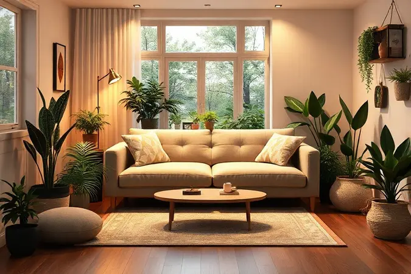
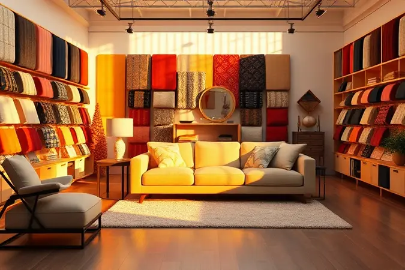
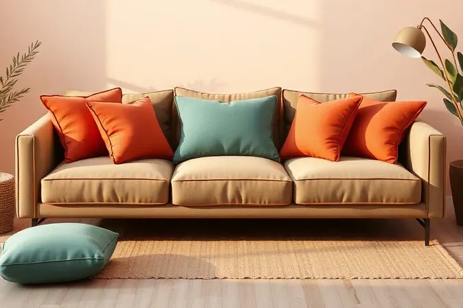
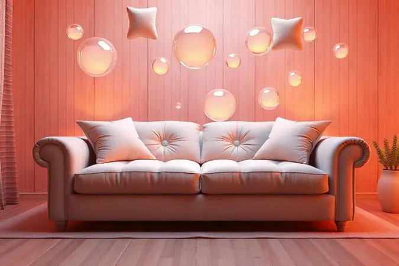

Encontrar o equilíbrio perfeito entre conforto e funcionalidade é o maior desafio ao decorar ambientes pequenos. O sofá-cama surge como a solução ideal para quem precisa de versatilidade no dia a dia mas também de praticidade para receber visitas inesperadas.

Com tantas opções de tecidos, mecanismos e tamanhos no mercado, escolher o modelo certo pode parecer uma missão impossível.

É por isso que preparamos este guia detalhado, analisando 11 opções que combinam otimização de espaço com design atemporal para transformar sua casa em 2025.

Aqui você encontra não apenas especificações técnicas, mas histórias reais sobre como cada modelo pode se encaixar na sua rotina, respondendo a todas as dúvidas que surgem nessa jornada de escolha.

<SummaryList products={frontmatter.top_products} />

## Ranking dos melhores modelos de sofá-cama para sua casa

Nossa seleção cuidadosa leva em conta mais do que números em uma ficha técnica. Analisamos como cada sofá-cama se comporta na vida real, desde aquela sesta de domingo até aquela visita surpresa que precisa de acomodação confortável.

Pensamos não apenas em espaços, mas em momentos.

### 1. Sofá-cama Mobly Excelencia Premium

<ProductBox 
  title={frontmatter.top_products[0].title} 
  image={frontmatter.top_products[0].image} 
  link={frontmatter.top_products[0].link} 
/>

Imagine chegar em casa depois de um dia intenso e encontrar um refúgio que é sofá durante o dia e cama quando necessário. O Excelência Premium da Mobly oferece exatamente essa experiência com seus 190cm de largura revestidos em suede macio que convida ao toque.

A combinação de espuma D33 no assento e D26 no encosto cria um equilíbrio perfeito entre firmeza e acolhimento, enquanto a estrutura de madeira reflorestada garante que essa sensação dure por anos.

A transformação acontece de forma quase mágica, expandindo para uma cama de 180cm por 110cm ideal para hóspedes ocasionais. O design elegante não apenas se destaca na decoração como cria um ponto focal sofisticado em qualquer ambiente.

O que algumas pessoas observam é que para pernoites muito frequentes você pode sentir que o colchão poderia ser mais confortável, mas como sofá de uso diário ele se torna rapidamente seu melhor companheiro de relaxamento.

<CaixaProsContras>

**Prós:**

- Design elegante que se destaca na decoração.

- Conforto adequado tanto como sofá quanto como cama.

- Estrutura resistente e durável.

- Fácil montagem, exigindo apenas a instalação dos pés.

**Contras:**

- A função cama pode não ser a mais confortável para uso prolongado.

- Algumas reclamações pontuais sobre problemas de entrega.

</CaixaProsContras>

### 2. Sofá-cama Adonai Estofados Alice

<ProductBox 
  title={frontmatter.top_products[1].title} 
  image={frontmatter.top_products[1].image} 
  link={frontmatter.top_products[1].link} 
/>

Se sua rotina exige flexibilidade constante, o Alice da Adonai Estofados entende essa dinâmica. Disponível em versões de dois ou quatro lugares, ele se adapta não apenas ao espaço físico mas também às suas necessidades sociais.

Imagine poder reorganizar seu espaço conforme o momento, recebendo amigos em uma configuração e reservando intimidade em outra.

A estrutura em madeira de eucalipto e espuma D-28 oferece aquele suporte reconfortante que faz toda diferença depois de um dia longo, enquanto os pés em alumínio prateado adicionam um toque contemporâneo.

A montagem fica por sua conta, mas as instruções claras transformam essa tarefa em um processo tranquilo que antecede anos de uso satisfatório.

<CaixaProsContras>

**Prós:**

- Design moderno e versátil.

- Opções de configuração para 2 ou 4 lugares.

- Conforto no assento e encosto com espuma D-28.

- Estrutura robusta em madeira de eucalipto.

**Contras:**

- Montagem é responsabilidade do comprador.

- Não é o modelo mais compacto disponível.

</CaixaProsContras>

### 3. Sofá-cama Essencial Estofados Caribe

<ProductBox 
  title={frontmatter.top_products[2].title} 
  image={frontmatter.top_products[2].image} 
  link={frontmatter.top_products[2].link} 
/>

Para quem valoriza simplicidade funcional com um toque de ousadia, o Caribe oferece uma proposta interessante.

Sem braços laterais, ele cria uma sensação visual de amplitude mesmo em espaços reduzidos, enquanto a robusta estrutura de eucalipto e mecanismo de catraca em aço suporta até 400kg com confiança.

O verdadeiro encanto está na sua versatilidade tripla, permitindo que você escolha entre sentar, reclinar ou transformá-lo completamente em cama conforme seu momento do dia.

A espuma D-26 proporciona conforto suficiente para ler um livro por horas ou receber aquela amiga querida para pernoitar.

Se você é do tipo que gosta de se abraçar nos braços do sofá enquanto assiste filme, essa ausência pode requerer um tempo de adaptação, mas para ambientes modernos e clean, ele se torna uma peça de destaque.

<CaixaProsContras>

**Prós:**

- Estrutura robusta e durável

- Fácil de montar

- Versatilidade com três posições ajustáveis

- Design moderno que otimiza o espaço

**Contras:**

- Não possui braços, o que pode não agradar a todos

- Pode ser menos acolhedor para quem prefere sofás tradicionais

</CaixaProsContras>

### 4. Sofá-cama Adonai Estofados Karen

<ProductBox 
  title={frontmatter.top_products[3].title} 
  image={frontmatter.top_products[3].image} 
  link={frontmatter.top_products[3].link} 
/>

Elegância e funcionalidade se encontram no Karen, um sofá-cama que parece entender que a beleza também precisa ser prática.

Revestido em veludo que capta a luz de maneira sofisticada, ele transforma qualquer ambiente enquanto esconde seu segredo mais útil, a capacidade de se retrair e reclinar até alcançar uma cama de aproximadamente 1,20m de profundidade.

O encosto acolchoado com fibra e assento em espuma de alta densidade criam uma experiência de conforto que faz você querer passar mais tempo nesse espaço. A estrutura de eucalipto reflorestado oferece paz de consciência ambiental junto com durabilidade.

É verdade que seu peso significa que você precisará de ajuda para posicioná-lo, e a montagem exige seu envolvimento, mas esses detalhes parecem pequenos diante da transformação que ele traz ao espaço.

<CaixaProsContras>

**Prós:**

- Design moderno e elegante

- Conforto superior com almofadas e espuma de qualidade

- Funcionalidade retrátil e reclinável

- Estrutura robusta com madeira reflorestada

**Contras:**

- Peso considerável, dificultando o transporte

- Necessita de montagem pelo comprador

</CaixaProsContras>

### 5. Sofá-cama Keva Génova

<ProductBox 
  title={frontmatter.top_products[4].title} 
  image={frontmatter.top_products[4].image} 
  link={frontmatter.top_products[4].link} 
/>

Quando estilo e funcionalidade precisam coexistir sem concessões, o Génova da Keva apresenta seu argumento.

Visualmente sofisticado em tecidos como linho ou poliéster, disponível em cores neutras que conversam com qualquer paleta, ele promete mais do que apenas boa aparência.

A transformação em cama confortabilíssima acontece com facilidade, tornando-se refúgio para visitas ou para seus próprios momentos de descanso extra.

O investimento pode ser um pouco mais elevado que outras opções, mas a sensação de ter um móvel que é tanto centro de atenção quanto solução prática justifica essa escolha para quem valoriza durabilidade e design integrados.

<CaixaProsContras>

**Prós:**

- Design elegante que se adapta a diversos ambientes

- Conforto garantido com opções de espuma de alta densidade

- Versatilidade de uso como sofá e cama

- Variedade de tecidos e cores disponíveis

**Contras:**

- Preço pode ser elevado em comparação a outras opções

- Dimensões podem ser limitantes em espaços muito pequenos

</CaixaProsContras>

### 6. Sofá-cama Estofados Ferrari Belize

<ProductBox 
  title={frontmatter.top_products[5].title} 
  image={frontmatter.top_products[5].image} 
  link={frontmatter.top_products[5].link} 
/>

O Belize da Estofados Ferrari oferece uma abordagem direta, focada em fazer bem o essencial.

Disponível em tamanhos solteiro e de casal, ele conversa com diferentes configurações familiares enquanto mantém a sustentabilidade no centro com sua estrutura de madeira de reflorestamento.

A combinação de espuma D28 no assento e D26 no encosto garante que cada momento sentado seja confortável, e a transformação em cama acontece sem complicações.

Seu design é mais funcional do que decorativo, o que significa que ele pode não roubar a cena em ambientes muito estilizados, mas naqueles onde praticidade e qualidade são prioridades, ele se torna um aliado confiável.

<CaixaProsContras>

**Prós:**

- Estrutura robusta em madeira de reflorestamento.

- Confortável com espuma de qualidade.

- Disponível em diferentes tamanhos e revestimentos.

- Fácil de transformar em cama.

**Contras:**

- Design que pode não agradar todos os estilos.

- Algumas versões podem necessitar montagem.

</CaixaProsContras>

### 7. Sofá-cama R9 Design Futon Tokio

<ProductBox 
  title={frontmatter.top_products[6].title} 
  image={frontmatter.top_products[6].image} 
  link={frontmatter.top_products[6].link} 
/>

Para espíritos contemporâneos que apreciam materiais naturais, o Futon Tokio da R9 Design oferece uma proposta diferente. Mais do que um sofá-cama, ele é um sistema 3 em 1 que pode se tornar sofá, chaise ou cama conforme sua necessidade do momento.

A estrutura em madeira maciça de pinus transmite solidez enquanto o futon com espuma D28 e mantas de algodão natural oferece suporte ortopédico que seu corpo agradece após horas de uso.

O revestimento em Sarja Premium 100% algodão traz suavidade ao toque e facilidade de manutenção. Seu visual moderno pode não conversar com interiores clássicos, mas para espaços que celebram a contemporaneidade, ele se torna uma peça de identidade.

<CaixaProsContras>

**Prós:**

- Design moderno que se adapta a diferentes ambientes

- Estrutura robusta em madeira maciça

- Conforto garantido com o futon de algodão natural

- Sistema 3 em 1 que maximiza funcionalidade

**Contras:**

- Estilo pode não agradar a todos os gostos

- Requer cuidados no tempo de uso por ser feito de materiais naturais

</CaixaProsContras>

### 8. Sofá-cama Herval Aurora

<ProductBox 
  title={frontmatter.top_products[7].title} 
  image={frontmatter.top_products[7].image} 
  link={frontmatter.top_products[7].link} 
/>

O Aurora da Herval parece ter sido desenhado para quem não quer escolher entre robustez e elegância.

Sua estrutura combinada de madeira maciça de eucalipto e MDF de alta qualidade promete anos de uso tranquilo, enquanto o revestimento em tecido linho em tons neutros se adapta a praticamente qualquer cenário decorativo.

O conforto é imediato, com assentos em espuma de alta densidade e encosto acolhedor que convidam a momentos prolongados de descanso. A transformação em cama mantém a simplicidade operacional, perfeita para quando as visitas chegam sem aviso prévio.

Seu peso considerável pode exigir planejamento no posicionamento inicial, e sim, você não encontrará entradas USB integradas, mas essas são concessões que muitos fazem pela sensação de solidez e estilo que ele oferece.

<CaixaProsContras>

**Prós:**

- Estrutura robusta e durável.

- Conforto agradável com espuma de alta densidade.

- Design moderno que combina com vários estilos.

- Transformação fácil em cama.

**Contras:**

- Peso considerável pode dificultar o transporte.

- Falta de entradas USB para funcionalidades extras.

</CaixaProsContras>

### 9. Sofá-cama Mamflex Pratik 5000

<ProductBox 
  title={frontmatter.top_products[8].title} 
  image={frontmatter.top_products[8].image} 
  link={frontmatter.top_products[8].link} 
/>

Praticidade dá nome e sobrenome a esse modelo da Mamflex. Com dimensões compactas que variam de 140cm de largura fechado a 177cm aberto, ele entende as necessidades de espaços que não podem dar-se ao luxo do desperdício.

Fabricado com madeira reflorestada e revestido em suede macio, oferece conforto suficiente para o dia a dia enquanto mantém uma estética moderna e discreta.

É verdade que ele não reclina e requer montagem, mas sua variedade de cores permite personalização e sua capacidade de peso adaptável (120 a 160kg) garante que atenda diferentes perfis de usuários.

<CaixaProsContras>

**Prós:**

- Design moderno e versátil.

- Confortável, com bom acolhimento.

- Fabricado com materiais sustentáveis.

- Variedade de cores disponíveis.

**Contras:**

- Não é reclinável.

- Requer montagem.

</CaixaProsContras>

### 10. Sofá-cama Cama Inbox Compact

<ProductBox 
  title={frontmatter.top_products[9].title} 
  image={frontmatter.top_products[9].image} 
  link={frontmatter.top_products[9].link} 
/>

Como o próprio nome sugere, o Compact da Cama Inbox foi pensado para espaços que precisam otimizar cada centímetro. Com larguras entre 1,50m e 1,80m, ele acomoda confortavelmente de duas a três pessoas enquanto mantém uma presença discreta.

O revestimento em Suede Velusoft oferece aquele toque macio que faz diferença no contato diário, e a múltipla reclinação proporciona diferentes ângulos de conforto.

Rodinhas frontais facilitam pequenos ajustes de posição, enquanto a estrutura em eucalipto reflorestado garante sustentabilidade com resistência.

As opções de cores são mais limitadas, focadas em tons neutros que se integram facilmente, e a capacidade de 110kg por pessoa pode requerer consideração dependendo do uso.

<CaixaProsContras>

**Prós:**

- Design compacto ideal para espaços pequenos.

- Conforto garantido com múltiplos níveis de reclinação.

- Revestimento em tecido macio e agradável ao toque.

- Estrutura resistente e sustentável.

**Contras:**

- Opções limitadas de cores e estampas.

- Peso suportado por pessoa é de 110kg, que pode ser uma limitação para alguns usuários.

</CaixaProsContras>

### 11. Sofá-cama Mobly Premium II

<ProductBox 
  title={frontmatter.top_products[10].title} 
  image={frontmatter.top_products[10].image} 
  link={frontmatter.top_products[10].link} 
/>

O Premium II da Mobly parece ter aprendido com os melhores atributos de seus predecessores. Com estrutura robusta de madeira reflorestada e revestimento em suede que acolhe ao primeiro contato, ele promete durabilidade com conforto.

A combinação de espuma D33 no assento e D26 no encosto cria uma experiência equilibrada, enquanto a transformação entre sofá e cama mantém a simplicidade operacional que você espera nessas situações.

Suas dimensões generosas (cerca de 190cm de largura) significam que quando transformado em cama ele ocupará espaço considerável, mas também oferecerá área de repouso ampla.

Alguns usuários sugerem o uso de topper para pernoites mais frequentes, mas como sofá de uso diário ele cumpre com excelência suas promessas.

<CaixaProsContras>

**Prós:**

- Estrutura sólida e durável de madeira de reflorestamento.

- Conforto ótimo, com espumas de alta densidade.

- Fácil transformação entre sofá e cama.

- Revestimento de tecido macio e agradável ao toque.

**Contras:**

- Pode ocupar bastante espaço quando usado como cama.

- Alguns usuários sugerem usar topper para maior conforto em pernoites longas.

</CaixaProsContras>

## Benefícios de um bom sofá-cama

Ter um sofá-cama de qualidade em casa é como possuir uma peça de magia discreta. Durante o dia, ele é seu refúgio para leituras, conversas e momentos de descanso.

À noite, quando aquela visita querida aparece, ele se transforma em um espaço acolhedor que elimina a necessidade de improvisar acomodações. Mas os benefícios vão além do funcional.

Muitos modelos atuais trazem designs que se tornam elementos centrais na decoração, oferecendo estética contemporânea que conversa com diferentes estilos.

A variedade de tamanhos e tecidos significa que você pode encontrar a peça que não apenas se encaixa no espaço físico, mas também na sua identidade visual.

Mais do que um móvel, um bom sofá-cama é um investimento em flexibilidade de vida, permitindo que seu espaço se adapte às suas necessidades em vez de o contrário.

## Tipos de sofá-cama

Cada tipo de sofá-cama atende a uma narrativa de vida diferente. Os modelos de abertura simples são como bons amigos discretos, sempre prontos para ajudar quando necessário, transformando-se rapidamente em cama para hóspedes ocasionais.

Já os retráteis oferecem uma experiência mais integrada, combinando o conforto de um sofá tradicional com a praticidade de um espaço para dormir quase invisível até ser necessário.

Para quem busca luxo no cotidiano, os sofás-cama com chaise adicionam uma dimensão extra de relaxamento, perfeitos para aqueles momentos em que você precisa esticar as pernas completamente.

Os conversíveis, por sua vez, são os camaleões do mundo dos móveis, adaptando-se a múltiplas configurações conforme seu humor ou necessidade social.

Escolher entre eles é menos sobre especificações técnicas e mais sobre entender como você vive seus dias e recebe suas noites.

## Como escolher sofá-cama

Escolher o sofá-cama ideal começa com um exercício de honestidade espacial. Antes de se encantar por qualquer modelo, meça não apenas o local onde ele ficará, mas também o espaço necessário para sua transformação completa.

Pergunte-se como você realmente usará essa peça, se será mais um sofá ocasionalmente transformado em cama ou mais uma cama disfarçada de sofá.

Essa resposta guiará sua busca pelo nível de conforto necessário, com modelos que priorizem espumas de alta densidade para suporte prolongado.

Considere também a vida real que acontecerá sobre esse tecido, optando por materiais que suportem seus rituais diários sem demandar cuidados excessivos.

Por fim, deixe que seu olhar decida se essa peça conversa com a personalidade do seu ambiente, criando harmonia ao invés de conflito visual.

A escolha perfeita emerge quando funcionalidade, durabilidade e estética encontram um ponto de equilíbrio que faz sentido para sua rotina.

## Perguntas Frequentes sobre Sofás

As dúvidas que surgem na hora da escolha revelam nossas preocupações mais genuínas sobre como viveremos com essas peças. Elas falam sobre durabilidade, manutenção e, principalmente, sobre como essas escolhas se relacionam com nossa qualidade de vida diária.

### Qual cor de sofá está na moda?

As cores que dominam as salas contemporâneas são aquelas que trazem calma e versatilidade. Tons neutros como cinza, bege e off-white continuam reinando porque oferecem uma tela neutra para que outros elementos da decoração brilhem.

Mas se você busca injetar personalidade, cores como azul petróleo ou verde-musgo estão ganhando espaço, trazendo profundidade e caráter sem abrir mão da sofisticação.

A verdadeira tendência, no entanto, está na cor que conversa com seu estado de espírito e com a luz do seu espaço, criando uma atmosfera que você sente prazer em habitar diariamente.

### Qual sofá dura mais?

A longevidade de um sofá está diretamente ligada à conversa honesta entre seus materiais. Estruturas de madeira massiva, especialmente de espécies como eucalipto ou carvalho, oferecem uma solidez que resiste ao tempo e ao uso.

Quando combinadas com estofamentos em tecidos sintéticos como poliéster, que resistem melhor a manchas e desgaste, você cria uma parceria durável.

Mas o ingrediente secreto da durabilidade está na relação que você estabelece com a peça, cuidando dela com limpezas regulares e usando-a com atenção. Investir em qualidade desde o início é apostar em anos de convivência tranquila.

### Como saber se o sofá é de qualidade?

Reconhecer um sofá de qualidade envolve uma investigação sensorial. Comece pela estrutura, buscando a firmeza de madeiras duráveis que não cedem à pressão. Sinta o estofamento, procurando espumas que retornam ao formato original rapidamente após pressionadas.

Observe o revestimento, preferindo tecidos com boa gramatura e resistência ao atrito. Mas o teste definitivo acontece quando você se senta, deita e percebe como o móvel responde ao seu corpo.

Uma boa garantia do fabricante é o selo de confiança que complementa suas percepções, confirmando que aquela qualidade que você sente foi pensada para durar.

### Qual tipo de sofá não afunda?

A sensação de "afundar" em um sofá geralmente fala sobre a relação entre estrutura e estofamento.

Sofás com estrutura de madeira maciça oferecem uma base firme que resiste ao tempo, enquanto espumas de alta densidade garantem que essa firmeza seja acolhedora ao invés de dura.

Quando essas duas características se encontram com sistemas de molas ensacadas, que distribuem o peso de maneira inteligente, você tem a combinação perfeita para um assento que mantém sua integridade ano após ano.

O resultado é um sofá que recebe você sempre da mesma maneira, independentemente de quantas histórias já tenham sido vividas sobre ele.

### Qual sofá é mais confortável?

O conforto é uma experiência pessoal que vai além de especificações técnicas. Sofás com espuma de alta densidade moldam-se ao corpo enquanto oferecem suporte onde necessário, criando uma sensação de abraço estrutural.

Encostos e braços bem acolchoados transformam momentos simples em pequenos luxos, enquanto a profundidade do assento determina como você se relaciona com o espaço ao se levantar ou deitar.

A verdade sobre o conforto só se revela quando você experimenta pessoalmente, sentando, deitando e percebendo como aquele móvel dialoga com seu corpo específico.

### Que tipo de sofá suja menos?

Manter um sofá limpo envolve estratégia inteligente na escolha dos materiais. Tecidos sintéticos como poliéster ou nylon oferecem resistência natural a manchas e facilitam a limpeza, tornando-os ideais para famílias dinâmicas.

Sofás com capas removíveis transformam a manutenção em um processo simples, permitindo lavagens regulares sem complicações. Cores escuras ou padrões texturizados atuam como aliados visuais, disfarçando pequenas marcas do uso cotidiano.

Para quem busca praticidade máxima, materiais como couro sintético permitem limpeza com um pano úmido, mantendo a aparência impecável com mínimo esforço.

### Por que as molas ensacadas deixam o sofá mais aconchegante?

As molas ensacadas trabalham como uma comunidade inteligente dentro do seu sofá. Cada mola, envolvida em seu próprio saco de tecido, move-se independentemente, respondendo exatamente ao ponto onde seu corpo aplica pressão.

Essa independência significa que o peso é distribuído de maneira natural, criando um suporte personalizado que se adapta às suas curvas.

Em sofás-camas, essa tecnologia brilha especialmente, minimizando a transferência de movimento entre pessoas que ocupam espaços diferentes.

O resultado é uma sensação de aconchego que parece entender exatamente o que seu corpo precisa em cada momento, transformando simples momentos de descanso em experiências de bem-estar genuíno.

## Conclusão

Escolher o sofá-cama ideal é mais do que selecionar um móvel, é encontrar um companheiro para seus momentos de relaxamento e acolhimento.

Cada modelo que analisamos carrega não apenas especificações técnicas, mas personalidades diferentes que conversam com estilos de vida diversos.

Desde o clássico conforto do Mobly Excelência Premium até a versatilidade contemporânea do R9 Design Futon Tokio, o que realmente importa é como cada peça se encaixa na sua rotina e espaço.

Lembre-se que o melhor sofá-cama é aquele que desaparece em sua funcionalidade, tornando-se parte natural do seu dia a dia enquanto mantém seu segredo transformador para quando você mais precisa.

Seja para aquela visita sem aviso prévio ou para seu próprio momento extra de descanso, a peça certa oferece não apenas um lugar para sentar ou deitar, mas um espaço que compreende a fluidez da vida moderna.

Agora que você conhece as melhores opções do mercado e as respostas para suas dúvidas mais comuns, imagine como seria acordar sabendo que seu espaço está preparado para qualquer oportunidade de convívio ou descanso.

Qual dessas histórias de conforto e versatilidade você quer começar a escrever na sua casa?