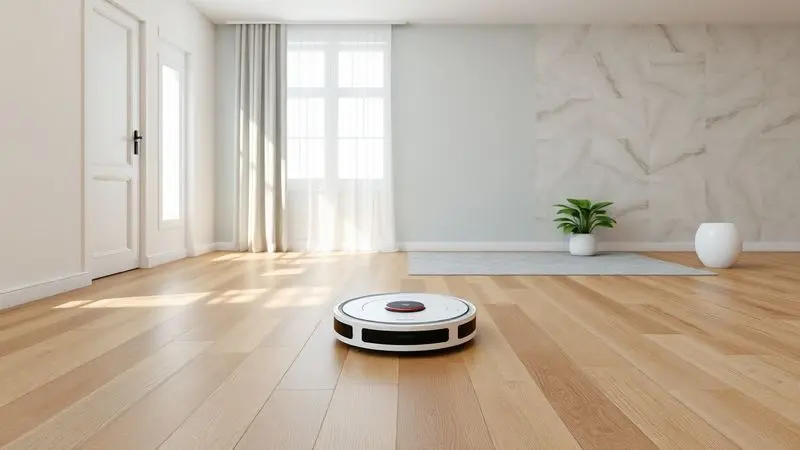
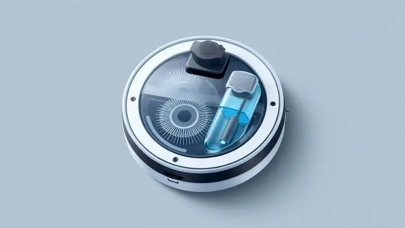
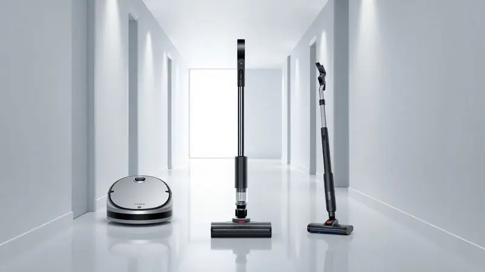

Encontrar um robô aspirador até R$ 1.000 que realmente entregue eficiência e praticidade pode parecer um desafio técnico.

No entanto, o mercado brasileiro evoluiu significativamente, e hoje marcas renomadas como WAP, Electrolux e Philco oferecem opções com excelente custo-benefício, incluindo funções de passar pano e até conectividade via Wi-Fi.

Neste guia completo, analisamos os modelos mais promissores para ajudar você a manter a casa limpa sem estourar o orçamento.

Se o seu objetivo é automatizar a limpeza diária e ganhar tempo, confira nossa seleção rigorosa com os melhores robôs aspiradores baratos disponíveis em 2025.

<SummaryList products={frontmatter.top_products} />

## Qual Comprar? Veja os Melhores Modelos até R$ 1.000

Imagine chegar em casa e encontrar os pisos impecáveis, sem precisar gastar seu final de semana com faxina. Essa é a promessa dos robôs aspiradores modernos, que evoluíram de curiosidades tecnológicas para parceiros reais na limpeza doméstica.

A tecnologia de mapeamento, a autonomia da bateria e os aplicativos deixaram de ser luxos e se tornaram diferenciais que fazem toda a diferença na sua rotina.

### 1. Robô aspirador Philco PAS22P

<ProductBox 
  title={frontmatter.top_products[0].title} 
  image={frontmatter.top_products[0].image} 
  link={frontmatter.top_products[0].link} 
/>

Para quem convive com alergias respiratórias, o filtro HEPA do Philco PAS22P pode ser o seu maior aliado. Ele não apenas aspira sujeira, mas retém 99,9% das partículas que deixariam o ar pesado, criando um ambiente onde você realmente respira melhor.

Com 100 minutos de autonomia, ele limpa áreas consideráveis sem precisar daquela pausa frustrante para recarregar.

Os sensores antiqueda e de obstáculos garantem que seu investimento não termine no fundo de uma escada. Sim, você terá que conectar o carregador manualmente, pois não vem com base, e a função de passar pano funciona apenas a seco.

Mas se sua prioridade é aspirar com eficiência e melhorar a qualidade do ar, essa limitação é fácil de aceitar.

<CaixaProsContras>

**Prós:**

- Filtro HEPA para retenção eficiente de partículas.

- Boa autonomia de cerca de 100 minutos.

- Sensores antiqueda para navegação segura.

- Função que combina varrer, aspirar e passar pano seco.

**Contras:**

- Não possui base de carregamento.

- A função MOP é apenas para limpeza a seco.

</CaixaProsContras>

### 2. Robô aspirador Electrolux ERB20

<ProductBox 
  title={frontmatter.top_products[1].title} 
  image={frontmatter.top_products[1].image} 
  link={frontmatter.top_products[1].link} 
/>

O Electrolux ERB20 entende que nem toda sujeira é igual. Com modos específicos como o "Focus" para aquele canto da cozinha que sempre acumula migalhas e o "Zig-Zag" para navegar entre os pés da mesa, ele se adapta à realidade da sua casa.

Suas 2h20 de autonomia significam que ele limpa sem pressa, abrangendo boa parte de um apartamento médio em uma única carga.

Sim, ele não mapeia o ambiente e limpa aleatoriamente. Mas pense nisso como ter um ajudante diligente que, mesmo sem um plano perfeito, consegue cobrir todo o chão.

O design baixo garante que aquela poeira sob a cama finalmente desapareça, e o controle remoto mantém a simplicidade para quem prefere tecnologia sem complicações.

<CaixaProsContras>

**Prós:**

- Função 3 em 1 (varre, aspira e passa pano).

- Modos de limpeza adaptados a diferentes situações.

- Sensor antiqueda para maior segurança.

- Design compacto que alcança locais difíceis.

**Contras:**

- Não realiza mapeamento do ambiente.

- Limpeza aleatória pode não ser ideal para todos os usuários.

</CaixaProsContras>

### 3. Robô aspirador Mondial RB-04

<ProductBox 
  title={frontmatter.top_products[2].title} 
  image={frontmatter.top_products[2].image} 
  link={frontmatter.top_products[2].link} 
/>

Com apenas 8,5 cm de altura, o Mondial RB-04 é o especialista em lugares onde sua vassoura não alcança. Sob sofás, camas e móveis baixos se tornam território fácil para esse robô.

O filtro HEPA lavável que retém 99,5% de alérgenos significa que você pode respirar aliviado sabendo que o ar está mais limpo, especialmente importante para quem tem sensibilidade respiratória.

Os 90 minutos de autonomia atendem bem à maioria dos ambientes, mas a recarga de 4 a 6 horas exige algum planejamento. Se você consegue programar a limpeza para momentos em que está fora de casa, essa característica se torna irrelevante.

Para limpeza diária em espaços médios, ele cumpre o papel com eficiência.

<CaixaProsContras>

**Prós:**

- Realiza varrição, aspiração e passagem de pano simultaneamente.

- Design slim que permite acesso a espaços reduzidos.

- Sensores antiqueda garantem segurança durante a operação.

- Filtro HEPA lavável melhora a qualidade do ar.

**Contras:**

- Não possui mapeamento avançado.

- Tempo de recarga pode ser considerado longo.

</CaixaProsContras>

### 4. Robô aspirador Kabum Smart 100

<ProductBox 
  title={frontmatter.top_products[3].title} 
  image={frontmatter.top_products[3].image} 
  link={frontmatter.top_products[3].link} 
/>

Se a ideia de configurar aplicativos e lidar com tecnologias complexas te assusta, o Kabum Smart 100 foi feito para você. Um único toque e ele começa a trabalhar, com uma potência de sucção de 1400Pa que lida com as sujeiras do dia a dia.

Os modos Zigue Zague e Limpeza de Cantos são inteligências suficientes para a maioria dos ambientes.

Sim, a navegação é mais básica e pode parecer aleatória, mas essa simplicidade tem seu charme. Ele não promete substituir uma limpeza profunda manual, mas para manter a casa apresentável entre uma faxina e outra, é uma mão na roda.

Os filtros HEPA são o bônus que transforma uma tarefa prática em um benefício para sua saúde.

<CaixaProsContras>

**Prós:**

- Fácil de usar com operação por um único toque.

- Design compacto, alcançando lugares baixos.

- Boa potência de sucção para sujeiras leves.

- Filtros HEPA para retenção de alérgenos.

**Contras:**

- Navegação pode ser um pouco aleatória.

- Não substitui uma limpeza profunda totalmente.

</CaixaProsContras>

### 5. Robô aspirador Positivo PRA100

<ProductBox 
  title={frontmatter.top_products[4].title} 
  image={frontmatter.top_products[4].image} 
  link={frontmatter.top_products[4].link} 
/>

Imagine controlar sua limpeza sem precisar levantar do sofá. O Positivo PRA100 torna isso possível com sua conectividade Wi-Fi e compatibilidade com Alexa e Google Assistente. Uma simples frase como "Alexa, limpe a sala" e o trabalho começa.

Os 2000 Pa de potência significam que pelos de animais não são mais um problema, mas sim uma tarefa rotineira.

Os até 100 minutos de autonomia são generosos, embora o tempo de recarga de 4 a 5 horas demande paciência. A função de passar pano pode exigir um acessório adicional, mas a verdadeira vantagem está na conveniência do controle inteligente.

Para quem já vive em uma casa conectada, ele se integra perfeitamente ao ecossistema.

<CaixaProsContras>

**Prós:**

- Versatilidade com três funções em um só aparelho.

- Controle por aplicativo e compatibilidade com assistentes de voz.

- Eficiente na limpeza de pelos de pets.

- Sensores que previnem acidentes durante o funcionamento.

**Contras:**

- Pode precisar de acessório adicional para passar pano.

- O tempo de carregamento pode ser longo para algumas pessoas.

</CaixaProsContras>

### 6. Robô aspirador Electrolux ERB30

<ProductBox 
  title={frontmatter.top_products[5].title} 
  image={frontmatter.top_products[5].image} 
  link={frontmatter.top_products[5].link} 
/>

A tecnologia "Autonomous Technology" do Electrolux ERB30 não é apenas um nome bonito. Ele realmente aprende com o ambiente, escolhendo o caminho mais eficiente para limpar sua casa.

Quando a bateria está baixa, ele encontra sozinho o caminho de volta para a base, como um animal de estimação bem treinado.

O reservatório de 310 ml pode exigir esvaziamento frequente em casas maiores, mas essa é a contrapartida por ter um design compacto que alcança cada cantinho. O filtro HEPA transforma a limpeza mecânica em um benefício para sua saúde respiratória.

Se você valoriza inteligência e autonomia, esse modelo merece sua atenção.

<CaixaProsContras>

**Prós:**

- Função 3 em 1: varre, aspira e passa pano.

- Tecnologia adaptativa para uma limpeza eficiente.

- Sensores que evitam quedas e colisões.

- Design compacto para acessar áreas difíceis.

**Contras:**

- Reservatório de apenas 310 ml pode necessitar esvaziamento frequente.

- Não possui recarga rápida, podendo levar um tempo considerável para estar pronto novamente.

</CaixaProsContras>

### 7. Robô aspirador Karcher RCV 1

<ProductBox 
  title={frontmatter.top_products[6].title} 
  image={frontmatter.top_products[6].image} 
  link={frontmatter.top_products[6].link} 
/>

Com apenas 7 cm de altura, o Kärcher RCV 1 é o mestre dos espaços apertados. Aquela poeira que se acumula sob a cama ou o sofá finalmente tem um destino.

Os três modos de limpeza oferecem flexibilidade: automático para manutenção diária, intensivo para dias de mais sujeira e foco em cantos para aquelas áreas problemáticas.

A ausência de mapeamento significa que ele pode repetir algumas áreas, mas o controle remoto permite que você direcione manualmente quando necessário.

Para ambientes com muitos móveis baixos e cantos difíceis, essa característica compacta vale mais do que qualquer mapa sofisticado.

<CaixaProsContras>

**Prós:**

- Design baixo que alcança áreas difíceis.

- Três modos de limpeza para diferentes necessidades.

- Sensores de segurança que evitam quedas.

- Controle remoto para facilitar o uso.

**Contras:**

- Não possui mapeamento do ambiente.

- Repetição de áreas pode ocorrer durante a limpeza.

</CaixaProsContras>

### 8. Robô aspirador WAP Robot W90

<ProductBox 
  title={frontmatter.top_products[7].title} 
  image={frontmatter.top_products[7].image} 
  link={frontmatter.top_products[7].link} 
/>

Para quem vive com pets, o WAP Robot W90 entende o drama dos pelos espalhados pela casa. Sua função 3 em 1 não apenas aspira, mas também ajuda na manutenção diária que mantém os ambientes apresentáveis.

Os três modos de limpeza permitem que ele se adapte a diferentes situações, desde uma limpeza rápida até uma sessão mais cuidadosa.

A autonomia de 1h40 é suficiente para apartamentos menores ou para limpar por cômodos. Ele não é feito para sujeiras pesadas como areia ou grãos, mas para a rotina doméstica comum, onde o maior inimigo são poeira e pelos, ele se sai muito bem.

O filtro lavável é a cereja do bolo, reduzindo custos de manutenção.

<CaixaProsContras>

**Prós:**

- Função 3 em 1: varre, aspira e passa pano.

- Ideal para manutenção diária e limpeza de pelos de pets.

- Sensores que garantem navegação segura.

- Baixa altura que permite acesso a espaços apertados.

**Contras:**

- Não recomendado para sujeiras pesadas.

- Pode ter dificuldades em tapetes altos.

</CaixaProsContras>

### 9. Robô aspirador WAP Robot W100

<ProductBox 
  title={frontmatter.top_products[8].title} 
  image={frontmatter.top_products[8].image} 
  link={frontmatter.top_products[8].link} 
/>

O WAP Robot W100 prova que eficiência não precisa ser complicada. Com 7,5 cm de altura, ele alcança lugares que outros limpadores ignoram, transformando cantos esquecidos em áreas limpas.

A navegação pode ser aleatória, mas se você organizar a limpeza por cômodos, esse "defeito" se transforma em uma estratégia eficiente.

Os 1h40 de autonomia atendem bem a espaços menores, mas a ausência de base automática de carregamento significa que você precisará conectá-lo manualmente. Essa é a economia que permite o preço acessível.

Para quem busca um primeiro robô aspirador ou precisa de um auxiliar para manutenção diária, ele oferece excelente custo-benefício.

<CaixaProsContras>

**Prós:**

- Design compacto que facilita o acesso a locais baixos

- Função 3 em 1: varre, aspira e passa pano

- Navegação segura com sensores antiqueda

- Boa autonomia para limpezas curtas

**Contras:**

- Navegação aleatória pode ser menos eficiente

- Não possui base automática de carregamento

</CaixaProsContras>

### 10. Robô aspirador Electrolux ERB10

<ProductBox 
  title={frontmatter.top_products[9].title} 
  image={frontmatter.top_products[9].image} 
  link={frontmatter.top_products[9].link} 
/>

Às vezes, menos é mais. O Electrolux ERB10 oferece o essencial: varre, aspira e passa pano seco, tudo em um design compacto de 7 cm que alcança onde outros não chegam.

Suas 2h20 de autonomia são impressionantes para a categoria, permitindo limpezas extensas sem interrupções.

A função de passar pano exige que você molhe o pano manualmente, mas essa simplicidade também significa menos peças para dar problema. Os sensores antiqueda e anticolisão garantem segurança, enquanto o filtro HEPA cuida da qualidade do ar.

Para quem não precisa de controles sofisticados, apenas de resultados consistentes, essa é uma escolha inteligente.

<CaixaProsContras>

**Prós:**

- Sistema 3 em 1 (varre, aspira e passa pano).

- Design baixo que alcança áreas difíceis.

- Sensores antiqueda e anticolisão.

- Filtro HEPA que melhora a qualidade do ar.

**Contras:**

- A rota de limpeza pode ser incerta.

- A função de passar pano é limitada sem reservatório de água.

</CaixaProsContras>

## Como Escolher Seu Robô Aspirador Ideal

Depois de conhecer essas 10 opções, a escolha pode parecer mais difícil do que antes. Mas é exatamente o contrário. Agora você tem informações reais para tomar uma decisão que vai transformar sua rotina.

A chave não está em encontrar o robô perfeito, mas aquele que conversa com a realidade da sua casa e do seu dia a dia.

### Tipo de piso e ambiente

Pense no chão da sua casa como o palco principal do robô aspirador. Se você tem muitos carpetes, priorize modelos com escovas rotativas que realmente penetram nos fios e removem sujeira acumulada.

Para pisos duros como cerâmica ou laminado, a potência de sucção e rodas adequadas fazem mais diferença. O tamanho dos ambientes também dita a escolha. Casas maiores exigem autonomia generosa, enquanto apartamentos compactos podem se satisfazer com baterias menores.

Seu robô ideal é aquele que dança bem no seu tipo de piso.

### Potência de sucção e capacidade de bateria

A potência de sucção é o músculo do seu robô. Em tapetes e áreas com mais sujeira, essa força extra faz toda diferença. Mas potência sem bateria é como um carro potente com tanque vazio.

Entre 60 e 120 minutos de autonomia costumam ser o ponto ideal para a maioria das residências. O equilíbrio entre esses dois fatores define se seu robô será um parceiro confiável ou apenas mais um eletrodoméstico que exige atenção constante.

### Funções inteligentes e conectividade

Em 2025, a inteligência deixou de ser luxo e se tornou acessível. Agendar limpezas pelo aplicativo significa chegar em casa com os pisos limpos, sem precisar lembrar de ligar o aparelho. O controle por voz integra a limpeza à sua rotina natural.

Essas funções não são apenas tecnologias, são ferramentas que devolvem tempo para o que realmente importa. Avalie quais delas realmente fazem sentido para seu estilo de vida.

### Capacidade do reservatório e manutenção

Um reservatório pequeno em uma casa grande significa paradas frequentes para esvaziar. Esse detalhe aparentemente pequeno pode tornar a experiência frustrante. A manutenção também conta.

Filtros laváveis significam economia a longo prazo, enquanto sensores de fácil acesso garantem que o robô mantenha sua eficiência. Um bom robô não é aquele que nunca precisa de cuidados, mas sim aquele cujos cuidados são simples e previsíveis.

### Orçamento e custo-benefício

Até R$ 1.000, você não está comprando o robô mais avançado do mercado, mas sim o parceiro ideal para a limpeza diária. A verdadeira economia não está no preço da etiqueta, mas no tempo que você recupera.

Esses modelos provam que eficiência não precisa ser cara, apenas inteligente. Eles limpam enquanto você trabalha, estuda ou simplesmente descansa, transformando horas de trabalho doméstico em momentos de qualidade.

## Funções Essenciais: 3 em 1 e Conectividade

A função 3 em 1 não é apenas um número em uma especificação. É a praticidade de resolver três tarefas com um único aparelho, eliminando a necessidade de trocar equipamentos.

A conectividade via aplicativo transforma o robô de um eletrodoméstico em um assistente pessoal que obedece seus comandos mesmo quando você não está em casa. Essas não são características técnicas, são liberdades conquistadas.

## Autonomia e Recarga Automática

Imagine um robô que para no meio da sala porque a bateria acabou, exigindo que você o carregue manualmente. Agora imagine outro que, percebendo a energia baixa, encontra sozinho o caminho para a base e retoma o trabalho depois de recarregado.

Essa diferença define a experiência. A autonomia adequada significa limpeza completa sem interrupções, enquanto a recarga automática transforma o robô em um verdadeiro parceiro autônomo.

## Quais os tipos de robô aspirador?

Conhecer os tipos de robô aspirador é como entender diferentes personalidades. Cada uma tem seus talentos e limitações, e escolher a certa significa casar expectativas com realidade.

### Robô Aspirador Básico

O básico não significa ruim. Significa foco no essencial. Esses modelos são para quem quer resultados sem complicação. Eles varrem e aspiram com eficiência, mantendo a casa limpa sem exigir que você se torne um especialista em tecnologia.

A simplicidade é sua maior virtude, especialmente para primeiras experiências ou para ambientes sem grandes desafios.

### Robô Aspirador com Mapeamento de Ambientes

O mapeamento é a memória do robô. Ele lembra onde já limpou e onde precisa focar, evitando desperdício de energia e tempo. Para casas com layouts complexos ou muitos obstáculos, essa inteligência faz a diferença entre uma limpeza eficiente e uma aleatória.

É como ter um limpador que realmente conhece sua casa.

### Robô Aspirador com Função de Passar Pano

Esses modelos entendem que limpeza completa vai além da aspiração. A função de passar pano transforma a tarefa mecânica em um cuidado mais profundo, especialmente em pisos que acumulam marcas e sujeiras aderentes.

A combinação perfeita para quem busca praticidade sem abrir mão dos resultados.

### Robô Aspirador com Autoesvaziamento

O autoesvaziamento é o próximo nível de autonomia. Imagine semanas de limpeza sem precisar tocar no reservatório de sujeira. Para quem tem animais de estimação ou alergias, essa função não é luxo, é necessidade.

Ela transforma a manutenção de algo frequente em algo ocasional.

## Robô aspirador ou aspirador vertical?

Esta não é uma competição, mas sim uma questão de casamento perfeito com sua rotina. O robô aspirador é o parceiro da manutenção diária, que trabalha silenciosamente nos bastidores.

O aspirador vertical é o herói das emergências, para aquela sujeira localizada que precisa de atenção imediata. Um não substitui o outro, mas se complementam. O robô mantém, o vertical resolve.

## Perguntas Frequentes

### Robô aspirador funciona em tapete?

Funciona, mas com nuances. Tapetes baixos e médios são território fácil. Os mais felpudos podem desafiar modelos de entrada, mas aqueles com potência ajustável se saem melhor.

A verdadeira pergunta não é se funciona, mas sim quão bem funciona no seu tipo específico de tapete.

### Preciso estar em casa enquanto o robô funciona?

Não apenas não precisa, como essa é uma das maiores vantagens. Programe para limpar enquanto você trabalha, e volte para um ambiente renovado.

A única preparação necessária é garantir que fios e objetos pequenos estejam fora do caminho, um pequeno preço pela conveniência.

### Qual a diferença entre robô aspirador com e sem mapeamento?

Imagine dois limpadores. Um caminha aleatoriamente, cobrindo o chão eventualmente. Outro tem um mapa mental, limpando de forma organizada e evitando repetições. Em ambientes simples, a diferença pode ser pequena.

Em espaços complexos, o mapeamento transforma a experiência.

### Qual a durabilidade esperada de um robô aspirador nessa faixa de preço?

Entre 2 e 5 anos de parceria. Como qualquer relacionamento, a durabilidade depende dos cuidados. Limpeza regular dos filtros, atenção às escovas e uso adequado mantêm o desempenho. É um investimento que se paga não apenas em dinheiro poupado, mas em tempo recuperado.

### Vale a pena gastar mais e ir para modelos acima de R$1000?

Depende do que você valoriza. Acima de R$ 1.000, encontra mapeamento mais preciso, potência superior e recursos como autoesvaziamento. Mas se sua casa é simples e suas necessidades são básicas, os modelos até R$ 1.000 oferecem exatamente o que você precisa.

O custo-benefício está em pagar pelo que realmente usará.

## Conclusão

Escolher um robô aspirador até R$ 1.000 não é sobre encontrar o aparelho perfeito, mas sim o parceiro ideal para sua rotina. Cada um dos 10 modelos que analisamos tem sua personalidade.

Alguns são especialistas em cantos difíceis, outros brilham na conectividade inteligente, muitos se destacam pelo cuidado com a qualidade do ar.

O verdadeiro valor não está nas especificações técnicas, mas na transformação que eles trazem para seu dia a dia. Menos tempo com vassouras, mais tempo com o que realmente importa. Menos poeira no ar, mais respiração tranquila. Menos trabalho doméstico, mais liberdade.

Agora que você conhece as opções, ouça o que sua casa precisa. Avalie seus pisos, considere sua rotina, pense nos desafios específicos do seu espaço. O robô certo é aquele que não apenas limpa seu chão, mas também simplifica sua vida.

Comece sua jornada rumo a uma casa mais limpa e uma rotina mais leve.