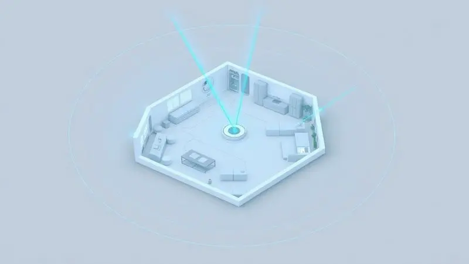
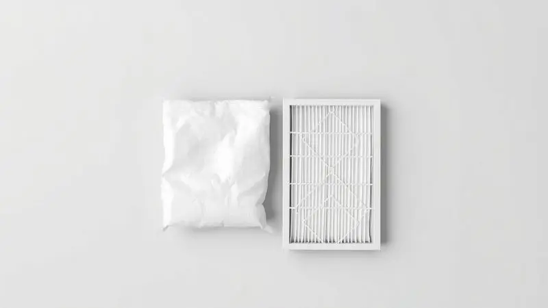
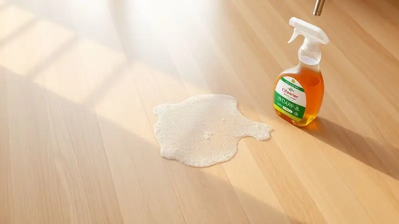

Encontrar o melhor robô aspirador autolimpante pode transformar completamente a rotina de limpeza da sua casa.

Esses dispositivos avançados não apenas aspiram e passam pano, mas também esvaziam seus próprios reservatórios em uma estação inteligente, reduzindo drasticamente a necessidade de manutenção manual.

Com a evolução da tecnologia em 2025, os modelos estão mais precisos, potentes e acessíveis.

Neste artigo, consolidamos os 8 melhores robôs aspiradores com base de autolimpeza do mercado, analisando desde o mapeamento inteligente até a autonomia da bateria, para que você faça a escolha certa e tenha mais tempo livre no seu dia a dia.

<SummaryList products={frontmatter.top_products} />

## Top 8 Melhores Robôs Aspiradores com Base Autolimpante

Imagine acordar com sua casa limpa, sem precisar tocar em um aspirador. Os robôs com base autolimpante tornam essa cena realidade, transformando a manutenção doméstica de uma tarefa frequente em algo que você quase esquece que existe.

### 1. Liectroux G7

<ProductBox 
  title={frontmatter.top_products[0].title} 
  image={frontmatter.top_products[0].image} 
  link={frontmatter.top_products[0].link} 
/>

Para quem tem pets e busca potência extrema. O Liectroux G7 chega com 6500Pa de sucção, suficiente para lidar com os pelos mais rebeldes de cachorros e gatos. Sua navegação a laser mapeia cada centímetro do seu ambiente, criando uma limpeza tão metódica quanto a sua.

A grande estrela, porém, é a base que armazena sujeira por até 60 dias, como se você tivesse um mordomo silencioso cuidando da poeira.

<CaixaProsContras>

**Prós:**

- Base autolimpante que reduz a frequência de esvaziamento

- Potência de sucção de 6500Pa, ideal para pelos de animais

- Funcionalidade de aspirar e passar pano ao mesmo tempo

- Controle via aplicativo e compatibilidade com assistentes virtuais

**Contras:**

- Não é o modelo mais barato disponível

- Pode exigir um tempo de adaptação para usuários menos tech-savvy

</CaixaProsContras>

### 2. Ropo Glass 4 Pro

<ProductBox 
  title={frontmatter.top_products[1].title} 
  image={frontmatter.top_products[1].image} 
  link={frontmatter.top_products[1].link} 
/>

Aquela limpeza hospitalar que você procurava? O Ropo Glass 4 Pro entrega. Sua estação esvazia o coletor em apenas 10 segundos, permitindo até 15 ciclos completos sem sua intervenção.

Mas o diferencial está na esterilização com luz UV, ideal para famílias com crianças pequenas ou pessoas alérgicas que precisam não apenas limpar, mas purificar o ambiente.

<CaixaProsContras>

**Prós:**

- Estação autolimpante que facilita o uso contínuo.

- Mapeamento a laser para limpeza precisa e eficiente.

- Potência de sucção alta adaptável a diferentes superfícies.

- Função de esterilização com luz UV.

**Contras:**

- Pode não lidar bem em áreas com muitos líquidos soltos.

- O preço pode ser um pouco elevado para quem busca algo básico.

</CaixaProsContras>

### 3. iRobot Roomba j7+

<ProductBox 
  title={frontmatter.top_products[2].title} 
  image={frontmatter.top_products[2].image} 
  link={frontmatter.top_products[2].link} 
/>

Vive com animais que às vezes fazem bagunça? O Roomba j7+ tem um superpoder: ele detecta e desvia de fezes de pets, cabos e brinquedos em tempo real. Essa tecnologia PrecisionVision transforma a ansiedade de "será que ele vai engolir algo?" em confiança total.

A base mantém 60 dias de autonomia, mas seu verdadeiro valor está na paz mental para donos de pets.

<CaixaProsContras>

**Prós:**

- Navegação inteligente com tecnologia de evasão de obstáculos.

- Base de autoesvaziamento para limpeza prolongada.

- Desempenho eficaz em diversos tipos de pisos.

- Design compacto que cabe sob móveis.

**Contras:**

- Sucção um pouco inferior em carpetes com pelos.

- Pode ser barulhento durante o processo de autoesvaziamento.

</CaixaProsContras>

### 4. Xiaomi Robot Vacuum X10

<ProductBox 
  title={frontmatter.top_products[3].title} 
  image={frontmatter.top_products[3].image} 
  link={frontmatter.top_products[3].link} 
/>

Performance premium sem perder a essência prática. O X10 combina 4000Pa de sucção com navegação a laser que funciona até no escuro, perfeito para quem tem cantos pouco iluminados.

A estação armazena sujeira por 60 limpezas, criando uma rotina onde você só se lembra do robô quando precisa trocar um acessório, não quando a poeira começa a incomodar.

<CaixaProsContras>

**Prós:**

- Potente sucção de 4000 Pa.

- Navegação inteligente com mapeamento a laser.

- Estação de auto-esvaziamento com grande capacidade.

- Função mopa integrada para limpeza mais eficaz.

**Contras:**

- O preço pode ser elevado para algumas pessoas.

- Requer manutenção ocasional do tanque e filtros.

</CaixaProsContras>

### 5. Samsung Jet Bot AI+

<ProductBox 
  title={frontmatter.top_products[4].title} 
  image={frontmatter.top_products[4].image} 
  link={frontmatter.top_products[4].link} 
/>

Quando você quer que seu robô "enxergue" a casa como você. O Jet Bot AI+ usa reconhecimento de objetos em 3D para identificar e evitar tudo, desde chinelos até brinquedos.

Seu sistema de filtragem captura 99,99% das partículas microscópicas, uma benção para quem sofre com alergias e quer respirar melhor dentro de casa.

<CaixaProsContras>

**Prós:**

- Reconhecimento de objetos e navegação inteligente.

- Estação de autolimpeza para maior conveniência.

- Excelente sistema de filtragem contra micro sujeira.

- Mapeamento preciso com definições de zonas virtuais.

**Contras:**

- Desempenho em carpetes pode ser insuficiente.

- Preço elevado em comparação com concorrentes.

</CaixaProsContras>

### 6. WAP Robô Aspirador de Pó ROBOT W4000

<ProductBox 
  title={frontmatter.top_products[5].title} 
  image={frontmatter.top_products[5].image} 
  link={frontmatter.top_products[5].link} 
/>

O tudo-em-um que simplifica sua vida. Varre, aspira e passa pano em uma única operação, com 29 sensores que transformam seu robô em um verdadeiro equilibrista doméstico.

A base autolimpante esvazia o reservatório a cada 60 dias, criando um ciclo onde você vive a limpeza, não a executa.

<CaixaProsContras>

**Prós:**

- Limpeza 3 em 1: varre, aspira e passa pano.

- Tecnologia de mapeamento a laser para navegação precisa.

- Base autolimpante que simplifica a manutenção.

- Controle via aplicativo e comandos de voz.

**Contras:**

- Pode não substituir completamente uma faxina manual para manchas difíceis.

- Nível de ruído de 65 dB(A) pode ser um pouco alto em ambientes silenciosos.

</CaixaProsContras>

### 7. Xiaomi Robot Vacuum X20+

<ProductBox 
  title={frontmatter.top_products[6].title} 
  image={frontmatter.top_products[6].image} 
  link={frontmatter.top_products[6].link} 
/>

Para quem quer um sistema completo, não apenas um robô. A estação base do X20+ não apenas recolhe o pó automaticamente, mas também lava e seca os esfregões.

Com capacidade para 75 dias de armazenamento e um reservatório de 4L que limpa até 280m², é para quem pensa em anos de conveniência, não apenas em comprar um eletrodoméstico.

<CaixaProsContras>

**Prós:**

- Coleta automática de pó e limpeza de esfregões.

- Alta potência de sucção para diversos tipos de sujeira.

- Mapeamento eficiente com navegação a laser.

- Controle remoto via aplicativo e comandos de voz.

**Contras:**

- Tamanho considerável da estação base.

- Pode ser um pouco caro em comparação a modelos mais simples.

</CaixaProsContras>

### 8. DREAME D10 Plus Gen 2

<ProductBox 
  title={frontmatter.top_products[7].title} 
  image={frontmatter.top_products[7].image} 
  link={frontmatter.top_products[7].link} 
/>

O equilíbrio perfeito entre preço acessível e performance robusta. Com 6000Pa de sucção, ele não apenas varre a poeira, mas a extrai de carpetes grossos.

Seu sistema de autoesvaziamento mantém 90 dias de autonomia, ideal para quem quer começar no mundo da automação doméstica sem comprometer o bolso.

<CaixaProsContras>

**Prós:**

- Sucção forte de 6.000Pa, ideal para pets.

- Função de mopagem integrada para limpeza adicional.

- Navegação eficiente com mapeamento em tempo real.

- Sistema de auto-esvaziamento que minimiza manutenção.

**Contras:**

- A evitabilidade de obstáculos pode ser limitada em comparação com modelos mais caros.

- A função de mopagem requer instalação e manutenção manual.

</CaixaProsContras>

Agora que conhecemos as principais opções, surge a questão fundamental: todo esse investimento realmente vale a pena na prática do dia a dia?

## Os robôs aspiradores autolimpantes valem a pena?

Valer a pena não se mede apenas em dinheiro, mas em tranquilidade. Se você já cansou de passar aspirador em horários apertados, ou se simplesmente deseja chegar em casa após um dia cansativo e encontrar tudo limpo, então sim, vale cada centavo.

Esses dispositivos transformam uma tarefa recorrente em algo que acontece naturalmente no background da sua vida.

Para famílias com pets, o benefício é ainda mais claro: em vez de encarar uma camada diária de pelos, você programa o robô para limpar enquanto trabalha, como ter um ajudante dedicado que nunca reclama.

O segredo está em escolher o modelo certo para suas necessidades específicas.

## Critérios Essenciais para Escolher

Com tantas opções disponíveis, como saber qual robô realmente combina com seu estilo de vida? Comece olhando para seus maiores "inimigos" da limpeza.

Se você tem animais de estimação, a potência de sucção acima de 4000Pa é não negociável. Imagine não precisar aspirar o mesmo canto três vezes para pegar todos os pelos.

Para ambientes maiores, a autonomia da bateria faz toda diferença. Nada pior que seu robô desistir no meio da sala porque a bateria acabou. Procure modelos que durem pelo menos 120 minutos.

A conectividade vai além do modismo: controle por aplicativo significa que você pode iniciar uma limpeza extra quando recebe visitas de surpresa, ou programar para que a casa esteja impecável quando voltar das férias.

Por fim, o sistema de navegação define a diferença entre um robô que limpa e um que limpa com inteligência. É a escolha entre acordar com casa completamente limpa ou encontrar cantos esquecidos.

## Mapeamento Inteligente vs. Sensores Tradicionais

Pense assim: sensores tradicionais são como alguém andando pela sua casa de olhos fechados, tocando nas paredes para se guiar. Funciona, mas cria percursos aleatórios, repetições e deixa áreas sem limpeza.

O mapeamento inteligente, por outro lado, cria um "GPS" interno da sua casa. O robô sabe exatamente onde já passou, onde precisa voltar e como evitar obstáculos sem esbarrar neles.

Para apartamentos com muitos móveis ou casas com layout complexo, essa tecnologia não é luxo, é necessidade.

## Autonomia e Potência de Sucção

Essas duas características trabalham em conjunto para definir sua experiência. A autonomia determina se seu robô consegue limpar toda sua casa de uma só vez, ou se ele precisará recarregar no meio do caminho e recomeçar depois.

Para espaços acima de 100m², procure pelo menos 120 minutos de bateria.

Já a potência de sucção define se ele apenas "passa por cima" da sujeira ou realmente a remove. Para pisos frios, 2000Pa podem bastar. Mas se você tem tapetes, carpetes ou animais, não abra mão de 4000Pa ou mais.

É a diferença entre ter um ajudante e ter um especialista em limpeza.

## Recursos Adicionais: Controle por App e Voz

Esses recursos parecem opcionais até você experimentar.

O controle por aplicativo transforma seu smartphone em um controle remoto universal: você programa limpezas enquanto espera no trânsito, cria zonas proibidas quando tem um tapete especial exposto, ou monitora o progresso sem sair do sofá.

A integração com assistentes de voz é ainda mais mágica. Imagine dizer "Alexa, limpe a sala" enquanto prepara o jantar, ou "Google, inicie limpeza completa" ao sair para trabalhar. São esses toques de automação que fazem a tecnologia sentir-se realmente pessoal.

## Quanto Custa Manter um Robô Aspirador com Base Autolimpante por Ano?

O verdadeiro custo não está na etiqueta, mas na manutenção ao longo dos anos. Felizmente, é mais modesto do que parece.

Filtros precisam ser trocados a cada 3-6 meses (R$30-50 cada), escovas anualmente (R$40-80), e sacos para a base (quando aplicável) a cada 60-90 dias (R$20-40 cada).

Some isso ao consumo de energia, que é equivalente a manter uma lâmpada LED acesa por algumas horas por dia.

Anualmente, você gasta entre R$200 e R$400, menos do que muitas pessoas gastam em produtos de limpeza tradicional. E quando considera que ganha horas de seu tempo de volta, o retorno é exponencial.

## Dicas para usar seu robô aspirador que passa pano

Transformar seu robô de uma novidade em um aliado confiável requer alguns ajustes. Primeiro, prepare o terreno antes de sua primeira missão: recolha fios soltos, brinquedos pequenos e qualquer item que possa ser engolido ou emperrar as escovas.

Programe as limpezas quando ninguém estiver em casa. Não apenas evita interrupções, mas permite que o robô trabalhe em seu ritmo ideal sem precisar desviar de pessoas.

Para a função de pano, mantenha o reservatório cheio com água limpa ou soluções recomendadas pelo fabricante. Limpe o pano após cada uso para evitar mofo e odores.

Por fim, não espere até quebrar para fazer manutenção. Limpe os sensores semanalmente, as escovas a cada 15 dias, e os filtros conforme recomendação. Seu robô retribuirá com anos de serviço fiel.

## Quais produtos usar no pano do robô aspirador?

A regra de ouro é simples: menos é mais. Para a maioria dos pisos, água pura já faz um excelente trabalho.

Se quiser um poder de limpeza extra, soluções específicas para robôs aspiradores são formuladas para não danificar os componentes internos e evaporar sem deixar resíduos.

Soluções caseiras como água com um pouco de vinagre branco (proporção 10:1) funcionam bem para desinfetar e remover manchas leves, mas evite usar regularmente para não corroer partes metálicas.

Evite completamente produtos para limpeza tradicional, detergentes fortes ou amaciantes. Eles criam espuma que entope o sistema, deixam resíduos pegajosos e podem danificar permanentemente seu investimento.

## Perguntas Frequentes

### O que é um robô aspirador com base autolimpante?

Imagine um aspirador que não apenas limpa sua casa, mas também cuida de sua própria sujeira. É exatamente isso. Quando o robô termina seu trabalho, ele retorna à base, que suga toda a poeira coletada e a armazena em um compartimento maior.

Para você, significa que pode passar semanas sem sequer tocar no aparelho, enquanto ele mantém sua casa impecável de maneira totalmente autônoma.

### Todos os modelos lavam e secam o pano?

Nem todos. Muitos modelos apenas utilizam um pano úmido que você precisa limpar manualmente após o uso. Os mais avançados, como o Xiaomi X20+, possuem estações que realmente lavam, secam e até aplicam detergente automaticamente.

Se a ideia de nunca mais lavar um pano de chão soa como um sonho, procure especificamente por modelos com "estação de lavagem e secagem".

### Qual a principal vantagem da base autolimpante?

Tempo. É simples assim. Em vez de esvaziar um compartimento de pó a cada dois dias (que sempre cria uma nuvem de poeira), você troca um saco maior a cada 60, 75 ou até 90 dias.

Para quem tem uma rotina corrida, animais que soltam muito pelo, ou simplesmente quer simplificar a vida, essa conveniência transforma completamente a experiência de manter uma casa limpa.

### Vale a pena investir em um modelo premium?

Depende do que "premium" significa para você. Se significa mais potência para lidar com pets, navegação inteligente para apartamentos cheios de móveis, ou conectividade para controlar à distância, então sim, cada real extra se paga em eficiência e tranquilidade.

Mas se você mora sozinho em um espaço pequeno com pisos lisos, um modelo básico pode entregar 80% dos benefícios por metade do preço. O segredo está em comprar para suas necessidades reais, não para especificações no papel.

### Quanto tempo dura um robô aspirador com base inteligente?

Com cuidados básicos, de 5 a 7 anos de serviço confiável. A bateria normalmente dura 2-3 anos antes de precisar de substituição (um processo simples e acessível). Os componentes principais são projetados para longa duração.

A chave está na manutenção preventiva: limpar filtros regularmente, manter os sensores desobstruídos e evitar que objetos estranhos danifiquem as escovas. Trate bem seu robô, e ele retribuirá por anos.

### O robô aspirador pode substituir a limpeza tradicional?

Para a manutenção diária, sim, completamente. Ele mantém seus pisos livres de poeira, pelos e migalhas melhor do que a maioria das pessoas faria manualmente.

Mas ainda precisamos da limpeza tradicional para cantos de difícil acesso, limpezas profundas de tapetes, ou quando há sujeiras mais complexas como derramamentos pegajosos.

Pense nele como seu parceiro que cuida do básico todos os dias, liberando você para focar nas tarefas mais importantes e ocasionais.

### Robôs com base autolimpante fazem muito barulho?

Durante a limpeza normal, produzem um zumbido similar a um ventilador (60-70 decibéis), perfeito para funcionar enquanto você trabalha ou assiste TV. O processo de autolimpeza na base é mais audível (como um aspirador portátil rápido), mas dura apenas 10-15 segundos.

Se você é especialmente sensível a ruídos, programe para funcionar quando estiver fora, ou opte por modelos conhecidos por operação silenciosa.

### É seguro deixar o robô funcionando sozinho?

Totalmente. Os modelos modernos possuem sensores anti-queda que detectam escadas, sistemas anti-colisão que evitam móveis, e inteligência para parar se algo prender suas escovas.

Para maior tranquilidade nos primeiros usos, observe uma limpeza completa para entender seu padrão de navegação. Depois disso, pode confiar que ele fará seu trabalho sem supervisão, mesmo com pets e crianças em casa (desde que o ambiente esteja preparado).

### Robôs com base autolimpante consomem mais energia?

A base em si consome energia apenas durante os 10-15 segundos do processo de autolimpeza. O robô principal tem consumo similar aos modelos tradicionais. No total, estamos falando de poucos centavos por dia de operação.

Quando você compara com o custo do seu tempo (e possivelmente de serviços de limpeza), o consumo energético é insignificante perto dos benefícios obtidos.

### Preciso trocar o saco de pó da base com frequência?

A beleza do sistema está justamente na baixa frequência. Dependendo do modelo e da quantidade de sujeira em sua casa, um saco dura de 60 a 90 dias. Algumas bases têm indicadores luminosos que avisam quando está cheio.

Para referência: uma família com dois gatos e piso frio pode trocar a cada 75 dias; um apartamento pequeno com uma pessoa sozinha pode chegar aos 90 dias facilmente.

## Conclusão

Escolher um robô aspirador autolimpante não é apenas sobre comprar um eletrodoméstico. É sobre reconhecer que seu tempo é precioso demais para ser gasto em tarefas repetitivas que a tecnologia já domina perfeitamente.

É sobre transformar horas semanais de limpeza em momentos com família, hobbies ou simplesmente descanso.

Dos oito modelos analisados, cada um brilha em situações específicas. O Liectroux G7 para quem precisa de potência extrema contra pelos de pets. O Roomba j7+ para lares com animais que fazem bagunças imprevisíveis.

O Dreame D10 Plus Gen 2 para quem busca o melhor equilíbrio entre custo e benefício.

Independentemente da escolha, o resultado será o mesmo: menos tempo limpando, mais tempo vivendo. Seu futuro eu, que chega em casa após um dia cansativo e encontra tudo impecável sem ter feito esforço algum, agradecerá por essa decisão.

Comece hoje a recuperar as horas que merece. A tecnologia está pronta para trabalhar por você.