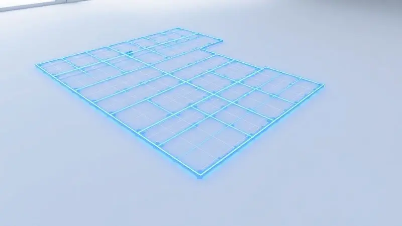
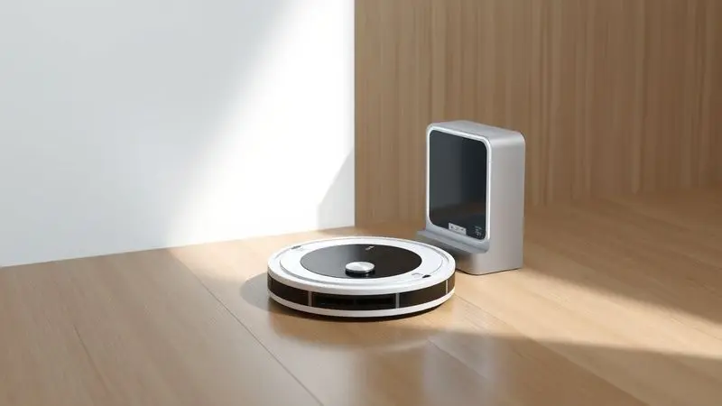
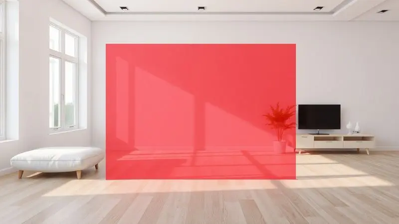

Manter a casa impecável quando cada minuto do seu dia já tem dono parece um desafio impossível.

Enquanto você se divide entre trabalho, família e compromissos, a poeira se acumula nos cantos, os pelos de pet dominam os carpetes e aquela sensação de 'nunca estou em dia com a limpeza' vira uma sombra constante.

Mas e se você pudesse delegar essa tarefa a um assistente que não só limpa, mas aprende o layout da sua casa, evita obstáculos e opera no piloto automático? Os robôs aspiradores com mapeamento são essa revolução silenciosa.

Diferente dos modelos antigos que batiam aleatoriamente nos móveis, essas máquinas inteligentes criam mapas digitais precisos do seu ambiente, garantindo que cada centímetro seja limpo de forma sistemática, eficiente e totalmente personalizável pelo seu celular.

Para ajudar você a encontrar o parceiro perfeito que vai devolver horas preciosas da sua semana, analisamos minuciosamente o mercado e selebramos os modelos que realmente fazem diferença na rotina doméstica de 2025.

<SummaryList products={frontmatter.top_products} />

## Quais são os melhores robôs aspiradores com mapeamento em 2025?

Imagine acordar com os pisos já limpos, sem ter levantado um dedo. Os melhores robôs aspiradores com mapeamento de 2025 transformam essa cena em realidade diária.

Eles combinam a precisão cirúrgica do mapeamento a laser ou por câmera com uma inteligência que aprende seus hábitos, criando rotas de limpeza que economizam tempo e energia elétrica. O resultado? Uma casa que se mantém impecável enquanto você vive sua vida.

### 1. Neatsvor X600

<ProductBox 
  title={frontmatter.top_products[0].title} 
  image={frontmatter.top_products[0].image} 
  link={frontmatter.top_products[0].link} 
/>

Para quem busca versatilidade sem complicações, o Neatsvor X600 é como ter dois assistentes em um.

Enquanto seus 4000Pa de sucção removem até a sujeira mais incrustada dos cantos, o reservatório de água integrado permite que ele passe pano logo em seguida, deixando pisos cerâmicos e de madeira com aquele brilho recém-lavado.

O mapeamento a laser garante que ele nunca perca tempo limpando o mesmo lugar duas vezes, e o aplicativo WeBack transforma seu smartphone em um controle remoto completo.

Você pode criar zonas de limpeza específicas (ideal para a área da cozinha depois do jantar) ou programar horários que se encaixem perfeitamente na sua rotina.

<CaixaProsContras>

**Prós:**

- Excelente potência de sucção (até 4000Pa).

- Função molhada para limpeza adicional.

- Controle fácil via aplicativo e integração com assistentes virtuais.

- Mapeamento eficiente com navegação a laser.

**Contras:**

- Pode ter dificuldades com móveis muito baixos.

- Algumas limitações em relação a pequenas bordas ou desníveis.

</CaixaProsContras>

### 2. Liectroux XR500

<ProductBox 
  title={frontmatter.top_products[1].title} 
  image={frontmatter.top_products[1].image} 
  link={frontmatter.top_products[1].link} 
/>

Se sua casa tem múltiplos níveis ou cômodos com configurações distintas, o Liectroux XR500 entende perfeitamente essa complexidade. Sua memória guarda até cinco mapas diferentes, como se tivesse um plano arquitetônico digital de cada ambiente.

O sensor a laser escaneia o espaço com tanta precisão que o robô praticamente 'enxerga' obstáculos antes de chegar perto deles.

Para famílias com animais de estimação, a função de aumento automático de potência em carpetes é um diferencial que realmente faz diferença, capturando pelos que outros modelos deixariam para trás.

<CaixaProsContras>

**Prós:**

- Mapeamento a laser para rotas eficientes

- Armazenamento de múltiplos mapas

- Sensores avançados para evitar obstáculos

- Limpeza por zonas programáveis

**Contras:**

- Preço pode ser superior a modelos básicos

- Pode necessitar de manutenção regular

</CaixaProsContras>

### 3. Xiaomi Vacuum S10

<ProductBox 
  title={frontmatter.top_products[2].title} 
  image={frontmatter.top_products[2].image} 
  link={frontmatter.top_products[2].link} 
/>

O Xiaomi Vacuum S10 prova que tecnologia avançada pode vir em um pacote acessível.

Sua navegação a laser LDS é tão precisa que ele consegue traçar rotas quase perfeitas, evitando aquela sensação frustrante de ver o robô passar três vezes no mesmo lugar enquanto ignora um canto sujo.

Os 4000Pa de sucção são suficientes para lidar com a sujeira do dia a dia de uma família ativa, e o controle por três níveis de água na função mop significa que você pode ajustar a umidade conforme o piso, sem risco de danificar madeiras mais sensíveis.

<CaixaProsContras>

**Prós:**

- Excelente potência de sucção (4000Pa).

- Navegação precisa com mapeamento a laser.

- Controle via aplicativo e compatibilidade com assistentes de voz.

- Função de mopa com três níveis de ajuste.

**Contras:**

- Capacidade do recipiente de pó pode ser insuficiente para grandes áreas.

- O preço pode ser mais elevado comparado a modelos básicos.

</CaixaProsContras>

### 4. Neatsvor X600 Pro

<ProductBox 
  title={frontmatter.top_products[3].title} 
  image={frontmatter.top_products[3].image} 
  link={frontmatter.top_products[3].link} 
/>

Quando a sujeira parece ter se instalado para ficar, o Neatsvor X600 Pro chega como um verdadeiro herói da limpeza.

Seus impressionantes 6000Pa de sucção são equivalentes à força de um aspirador de mão potente, capaz de remover até areia de praia incrustada nos carpetes.

Para casas com crianças pequenas ou animais que derramam comida constantemente, essa potência extra é a diferença entre 'limpo' e 'impecável'.

A autonomia de 180 minutos significa que ele pode limpar um apartamento de três quartos inteiro em uma única sessão, retornando sozinho à base quando a bateria está baixa.

<CaixaProsContras>

**Prós:**

- Potência de sucção de 6000 Pa, ideal para sujeiras difíceis.

- Navegação a laser para mapeamento eficiente.

- Função 2 em 1 (aspiração e mopagem).

- Autonomia de até 180 minutos com recarga automática.

**Contras:**

- Nível de ruído um pouco elevado para alguns usuários.

- A variedade de funções pode ser excessiva para quem busca simplicidade.

</CaixaProsContras>

### 5. Ropo Glass 4

<ProductBox 
  title={frontmatter.top_products[4].title} 
  image={frontmatter.top_products[4].image} 
  link={frontmatter.top_products[4].link} 
/>

Imagine um robô que não só limpa, mas desinfeta. O Ropo Glass 4 faz exatamente isso, combinando aspiração, passagem de pano e esterilização por luz UV em um único dispositivo.

É como ter uma equipe de limpeza profissional trabalhando silenciosamente enquanto você está fora.

O mapeamento a laser 4.0 é tão avançado que você pode literalmente desenhar barreiras virtuais no aplicativo, impedindo que o robô entre em áreas com fios expostos ou tapetes delicados que você prefere limpar manualmente.

<CaixaProsContras>

**Prós:**

- Multifuncional: varre, aspira, passa pano e esteriliza.

- Mapeamento preciso com tecnologia a laser.

- Controle via aplicativo e compatibilidade com assistentes virtuais.

- Boa autonomia de bateria com retomada da limpeza.

**Contras:**

- O preço pode ser elevado em comparação a modelos simples.

- Funcionalidades extras podem ser desnecessárias para quem busca uma limpeza básica.

</CaixaProsContras>

### 6. Liectroux G7

<ProductBox 
  title={frontmatter.top_products[5].title} 
  image={frontmatter.top_products[5].image} 
  link={frontmatter.top_products[5].link} 
/>

O verdadeiro luxo na limpeza automática é não precisar esvaziar o reservatório de poeira por dois meses. O Liectroux G7 oferece exatamente isso com sua base autolimpante que compacta os detritos e armazena sujeira para até 60 dias.

Para quem tem alergias ou simplesmente não quer lidar com poeira, essa funcionalidade é transformadora.

O mapeamento LiDAR cria mapas tão precisos que você pode selecionar cômodos específicos pelo aplicativo, mandando o robô limpar apenas a cozinha depois do almoço, por exemplo.

<CaixaProsContras>

**Prós:**

- Mapeamento preciso com tecnologia LiDAR.

- Base autolimpante que reduz o trabalho manual.

- Conexão via aplicativo e compatibilidade com assistentes virtuais.

- Boa potência de sucção, ideal para pelos de animais.

**Contras:**

- Dificuldades em tapetes altos.

- Escovas rotativas exigem limpeza periódica.

</CaixaProsContras>

### 7. Positivo PRA1000

<ProductBox 
  title={frontmatter.top_products[6].title} 
  image={frontmatter.top_products[6].image} 
  link={frontmatter.top_products[6].link} 
/>

Marca nacional com tecnologia global, o Positivo PRA1000 democratiza o mapeamento a laser sem abrir mão da qualidade. Seu aplicativo Casa Inteligente é desenvolvido pensando no usuário brasileiro, com interface intuitiva e suporte em português.

Os filtros HEPA são uma bênção para quem sofre com alergias, capturando 99,97% das partículas microscópicas que pioram a qualidade do ar dentro de casa. A autonomia de 150 minutos é mais que suficiente para a maioria dos apartamentos e casas médias brasileiras.

<CaixaProsContras>

**Prós:**

- Mapeamento a laser que otimiza a limpeza

- Controle via aplicativo e assistentes virtuais

- Autonomia de até 150 minutos

- Filtro HEPA para melhor qualidade do ar

**Contras:**

- Função de passar pano pode não ser eficiente em cantos

- Dificuldade com objetos pequenos no chão

</CaixaProsContras>

### 8. Xiaomi Robot Vacuum 2C

<ProductBox 
  title={frontmatter.top_products[7].title} 
  image={frontmatter.top_products[7].image} 
  link={frontmatter.top_products[7].link} 
/>

Para quem está dando os primeiros passos no mundo dos robôs com mapeamento, o 2C é o guia perfeito. Ele oferece a essência da tecnologia inteligente por um investimento mais acessível.

O mapeamento visual dinâmico pode não ter a precisão cirúrgica do laser, mas é mais que suficiente para apartamentos com layouts simples.

A função de passar pano com controle eletrônico de água é um diferencial raro nessa faixa de preço, permitindo que você mantenha pisos cerâmicos brilhantes sem esforço.

<CaixaProsContras>

**Prós:**

- Navegação inteligente com mapeamento eficiente.

- Boa potência de sucção para diferentes tipos de sujeira.

- Controle via aplicativo, facilitando o uso diário.

- Função de passar pano com controle eletrônico de água.

**Contras:**

- Menos preciso em comparação a modelos mais caros com tecnologia a laser.

- Autonomia limitada a aproximadamente 90 minutos em uso contínuo.

</CaixaProsContras>

### 9. Xiaomi Robot Vacuum X10+

<ProductBox 
  title={frontmatter.top_products[8].title} 
  image={frontmatter.top_products[8].image} 
  link={frontmatter.top_products[8].link} 
/>

A estação de acoplamento do X10+ redefine o que significa 'manutenção zero'. Enquanto o robô limpa sua casa, a base lava e seca os panos sujos, esvazia o reservatório de poeira e mantém a bateria sempre carregada.

É o sistema mais próximo do 'coloque e esqueça' disponível no mercado.

Os 4000Pa de sucção garantem que até pelos de gato de pelos longos sejam capturados eficientemente, e o mapeamento LDS permite que você crie rotinas complexas, como limpar apenas os quartos durante a semana e a sala inteira nos fins de semana.

<CaixaProsContras>

**Prós:**

- Potência de sucção excepcional de 4000Pa.

- Sistema avançado de navegação a laser.

- Estação de acoplamento que limpa e seca os panos automaticamente.

- Aplicativo intuitivo para controle remoto.

**Contras:**

- Preço relativamente elevado em comparação com modelos simples.

- O tempo de carga da bateria é de cerca de seis horas.

</CaixaProsContras>

### 10. JETS J1

<ProductBox 
  title={frontmatter.top_products[9].title} 
  image={frontmatter.top_products[9].image} 
  link={frontmatter.top_products[9].link} 
/>

Em um mundo hiperconectado, o JETS J1 oferece uma proposta refrescante: simplicidade que funciona. Sem necessidade de Wi-Fi ou aplicativos complicados, ele faz o mapeamento inteligente de forma autônoma, criando rotas otimizadas que cobrem cada canto.

Suas três horas de autonomia são ideais para casas grandes ou para quem quer limpar tudo de uma só vez. A tecnologia CyclonePower mantém a sucção poderosa mesmo quando o reservatório começa a encher, garantindo consistência do início ao fim da limpeza.

<CaixaProsContras>

**Prós:**

- Mapeamento inteligente para limpeza otimizada

- Alta capacidade de sucção com tecnologia CyclonePower

- Longa autonomia de até 3 horas

- Limpeza úmida disponível

**Contras:**

- Não possui conectividade Wi-Fi na versão padrão

- Assistência técnica pode ser limitada fora das grandes cidades

</CaixaProsContras>

### 11. Roborock Q7 Max

<ProductBox 
  title={frontmatter.top_products[10].title} 
  image={frontmatter.top_products[10].image} 
  link={frontmatter.top_products[10].link} 
/>

O segredo do Q7 Max está na palavra 'max' de seu nome: performance máxima em todos os aspectos. Seus 4200Pa de sucção aumentam automaticamente em carpetes, como se o robô soubesse exatamente quando precisa de força extra.

O mapeamento LiDAR 3D não só evita obstáculos, mas memoriza a altura dos móveis, permitindo que ele limpe embaixo de camas e sofás com margens milimétricas de segurança.

Para quem tem pisos mistos (madeira, cerâmica e carpetes), essa adaptabilidade inteligente é um divisor de águas.

<CaixaProsContras>

**Prós:**

- Potência de sucção elevada (4200Pa) e modo "Carpet Boost".

- Navegação LiDAR com mapeamento 3D eficiente.

- Aspiração e limpeza simultâneas com controle ajustável de água.

- Boa autonomia, cobrindo grandes áreas sem interrupções.

**Contras:**

- Dificuldade na coleta de pelos em carpetes altos.

- Sem função automática de esvaziamento na versão padrão.

</CaixaProsContras>

### 12. Xiaomi Robot Vacuum X20+

<ProductBox 
  title={frontmatter.top_products[11].title} 
  image={frontmatter.top_products[11].image} 
  link={frontmatter.top_products[11].link} 
/>

Quando potência bruta encontra automação completa, você tem o X20+. Seus 6000Pa de sucção são suficientes para lidar com os cenários mais desafiadores, como casas com múltiplos animais de estimação ou crianças que adoram fazer bagunça com areia.

A estação base não é apenas um carregador, é um centro de manutenção completo que esvazia, limpa e prepara o robô para a próxima missão. O mapeamento a laser LDS atinge um nível de precisão que permite até mesmo salvar múltiplos mapas para casas com andares diferentes.

<CaixaProsContras>

**Prós:**

- Potência de sucção impressionante

- Estação base com autolimpeza

- Mapeamento preciso com navegação a laser

- Função Mop eficaz para pisos

**Contras:**

- Preço relativamente alto

- Pode exigir manutenção regular de escovas e filtros

</CaixaProsContras>

### 13. iRobot Roomba j7

<ProductBox 
  title={frontmatter.top_products[12].title} 
  image={frontmatter.top_products[12].image} 
  link={frontmatter.top_products[12].link} 
/>

O Roomba j7 tem um superpoder particular: ele enxerga e evita obstáculos que outros robôs simplesmente atropelariam.

Usando câmeras e inteligência artificial, ele identifica fios soltos, meias, brinquedos e até mesmo 'acidentes' de animais de estimação, contornando esses itens em vez de espalhá-los pela casa.

Para famílias com pets ou crianças pequenas que sempre deixam coisas no chão, essa funcionalidade evita mais bagunça do que limpeza. O mapeamento inteligente permite que você desenhe zonas de 'não limpe' ao redor de vasos de plantas ou áreas de trabalho.

<CaixaProsContras>

**Prós:**

- Excelente tecnologia de mapeamento e navegação.

- Evita obstáculos como fios e resíduos de animais.

- Permite personalização nas áreas de limpeza.

- Funciona bem em diversos tipos de pisos.

**Contras:**

- A sucção pode não ser tão potente para carpetes muito densos.

- O processo de auto-esvaziamento do modelo j7+ pode ser ruidoso.

</CaixaProsContras>

## O que é robô aspirador com mapeamento?

Pense no mapeamento como a memória fotográfica do seu robô aspirador. Enquanto modelos mais básicos se movem de forma aleatória, batendo em móveis até cobrir toda a área, os robôs com mapeamento criam um mapa digital preciso do seu ambiente na primeira limpeza.

É como se eles fizessem um tour guiado pela sua casa, memorizando onde estão as paredes, os sofás, as mesas e até os cantos mais difíceis.

Essa 'inteligência espacial' permite que eles planejem rotas lógicas, economizando tempo e bateria enquanto garantem que nenhum centímetro quadrado fique sem atenção.

## Como funciona o mapeamento do robô aspirador?

A magia acontece através de sensores que funcionam como os olhos e o cérebro do robô. Nos modelos com tecnologia LiDAR (laser), um feixe de luz gira rapidamente, medindo a distância até cada objeto e criando um mapa de pontos tridimensional.

Já os robôs com mapeamento por câmera tiram fotos constantemente do ambiente e usam algoritmos para entender o espaço.

Ambos os sistemas permitem que o robô não apenas navegue, mas aprenda: ele lembra onde estão os degraus perigosos, identifica áreas que costumam acumular mais sujeira e otimiza suas rotas a cada uso.

## Tipos de mapeamento em robôs aspiradores

Cada tecnologia de mapeamento tem sua personalidade. O LiDAR é o perfeccionista do grupo, criando mapas milimétricos que funcionam mesmo no escuro total, ideal para quem quer precisão acima de tudo.

O mapeamento por câmera é mais versátil, reconhecendo objetos específicos como cadeiras ou sapatos, mas pode ter dificuldade em ambientes com pouca luz.

Já os sistemas com giroscópios e sensores de roda são os mais acessíveis, estimando a posição com base no movimento, como um navegador de carro sem GPS. Sua escolha depende do que você valoriza mais: precisão cirúrgica, reconhecimento inteligente ou custo-benefício.

## Robô aspirador com mapeamento vale a pena?

A resposta depende do que 'valer a pena' significa para sua rotina. Se você mora em um studio pequeno com piso liso, talvez um modelo básico seja suficiente.

Mas se sua casa tem múltiplos cômodos, diferentes tipos de piso, móveis complexos ou habitantes peludos (humanos ou animais), o mapeamento transforma completamente a experiência.

O investimento extra se paga não apenas em limpeza mais eficiente, mas no tempo que você recupera. São minutos preciosos todas as manhãs que não precisa gastar aspirando, horas mensais que podem ser dedicadas ao que realmente importa para você.

## Principais vantagens do robô aspirador com mapeamento

Além da óbvia economia de tempo, os robôs com mapeamento oferecem benefícios que só se percebe quando se experimenta. A eficiência sistemática significa que eles não repetem áreas já limpas, economizando energia e desgaste.

O controle granular pelo aplicativo permite criar rotinas personalizadas, como limpar apenas a cozinha após o jantar. A memória de layout é especialmente valiosa após reorganizar móveis, o robô se adapta rapidamente sem precisar reaprender tudo do zero.

E a paz mental de saber que sua casa está sendo limpa de forma inteligente, não aleatória, é talvez o maior benefício de todos.

## Como escolher um robô aspirador com mapeamento?

Escolher o robô certo é como encontrar um parceiro de limpeza que complemente seu estilo de vida. Em vez de uma lista técnica de especificações, pense nas suas necessidades reais. Quantos animais você tem? Sua casa tem muitos tapetes ou principalmente pisos duros?

Você viaja frequentemente e quer programar limpezas remotamente? As respostas a essas perguntas guiarão você melhor do que qualquer lista de características técnicas.

### Compatibilidade com Aplicativos

O aplicativo é a ponte entre você e seu robô, e essa conexão pode variar muito. Alguns apps são minimalistas e focados no essencial, perfeitos para quem não quer complicação.

Outros oferecem dashboards detalhados com histórico de limpeza, consumo de energia e até sugestões de otimização.

A integração com assistentes de voz (Alexa, Google Assistant) é particularmente útil para iniciar uma limpeza rápida enquanto suas mãos estão ocupadas cozinhando ou cuidando das crianças.

Antes de comprar, vale pesquisar reviews específicos sobre a experiência do aplicativo, pois uma interface confusa pode transformar uma tecnologia incrível em uma fonte de frustração.

### Potência de Sucção e Tipos de Piso

A potência de sucção medida em Pa (Pascals) ganha significado real quando traduzida para sua casa. Em pisos de madeira ou cerâmica, 2000-3000Pa são suficientes para a sujeira do dia a dia.

Já para carpetes, especialmente os mais altos ou com pelos de animais, 4000Pa ou mais fazem diferença tangível na capacidade de remover sujeira incrustada.

Os melhores modelos detectam automaticamente a mudança de superfície e aumentam a potência quando necessário, como um motorista experiente que sabe quando acelerar. Se sua casa tem uma mistura de pisos, procure por essa funcionalidade adaptativa.

### Autonomia e Retorno Automático à Base

A autonomia ideal depende diretamente do tamanho do seu espaço. Para apartamentos de até 70m², 90 minutos são mais que suficientes. Casas maiores, especialmente com múltiplos andares, se beneficiam de 150 minutos ou mais.

O retorno automático à base transforma a limpeza em um processo contínuo, o robô vai recarregar e retomar exatamente de onde parou, como um maratonista inteligente que sabe quando hidratar-se sem perder o ritmo.

Para espaços realmente extensos, alguns modelos podem até limpar um andar completo, recarregar, e depois subir para o próximo nível automaticamente.

### Recursos Extras

Além das funções básicas, alguns recursos extras podem mudar completamente sua relação com a limpeza doméstica. Bases autolimpantes que esvaziam o reservatório sozinhas são revolucionárias para quem tem alergias ou simplesmente prefere não lidar com poeira.

Funções de esterilização por luz UV ou vapor agregam uma camada extra de higiene, especialmente valiosas em casas com crianças pequenas ou idosos. Sensores de obstáculos avançados que identificam objetos específicos (como fios ou brinquedos) previnem acidentes e danos.

Cada recurso extra representa uma decisão entre conveniência e investimento, portanto, priorize aqueles que resolvem dores reais da sua rotina.

### Custo-benefício

O verdadeiro custo-benefício vai além do preço na etiqueta. Considere o custo por ano de uso, incluindo substituição de filtros, escovas e eventuais reparos.

Um modelo 30% mais caro que dura o dobro do tempo e consome menos energia pode ser mais econômico no longo prazo. Avalie também o valor do seu tempo, quantas horas mensais você economizaria com um robô mais eficiente?

Às vezes, pagar um pouco mais por um modelo que realmente se integra à sua rotina (com app intuitivo, manutenção simples e suporte local) vale muito mais do que economizar na compra inicial mas enfrentar frustrações constantes.

## Qual melhor robô aspirador e passa pano com mapeamento?

A combinação perfeita de aspiração e passagem de pano com mapeamento é aquela que entende que limpar não é apenas remover sujeira, é deixar os pisos realmente renovados.

Os melhores modelos nesta categoria não apenas alternam entre as funções, mas as sincronizam, aspirando primeiro para remover partículas maiores e então passando pano com a quantidade certa de água para não deixar resíduos.

O mapeamento precisa ser especialmente inteligente para evitar que áreas já molhadas sejam aspiradas novamente, criando uma coreografia de limpeza que parece simples, mas envolve algoritmos complexos trabalhando nos bastidores.

## Qual Melhor robô aspirador com mapeamento em Custo-benefício?

Custo-benefício não significa necessariamente o mais barato, mas o que oferece mais valor pelo investimento.

Em 2025, os modelos que equilibram mapeamento por laser (mais preciso que câmera) com potência de sucção adequada (3000-4000Pa) e aplicativos completos representam o ponto ideal. Eles fazem 95% do que os modelos premium fazem por 60-70% do preço.

Procure por marcas que já estão no mercado há alguns anos, pois elas tendem a ter software mais maduro e suporte técnico estabelecido, reduzindo o risco de ficar com um produto abandonado após a compra.

## Quanto tempo deixar o robô em cada cômodo?

Ao invés de cronometrar manualmente, confie na inteligência do seu robô com mapeamento. Ele calcula automaticamente o tempo ideal baseado no tamanho do cômodo, quantidade de obstáculos e nível de sujeira detectado.

Geralmente, salas e quartos médios (15-20m²) levam 20-30 minutos para uma limpeza completa. Banheiros e corredores menores (5-10m²) ficam prontos em 10-15 minutos.

O verdadeiro poder do mapeamento está na capacidade de identificar 'pontos quentes' de sujeira, áreas onde o robô naturalmente passa mais tempo porque os sensores detectam mais partículas no ar, garantindo que locais problemáticos recebam atenção extra sem sua intervenção.

## Perguntas frequentes

Mesmo com toda a tecnologia, dúvidas naturais surgem quando integramos uma máquina inteligente à nossa rotina doméstica. Estas são as questões que mais ouvimos de quem está começando sua jornada com robôs aspiradores com mapeamento.

### O que acontece se o robô aspirador ficar sem bateria no meio da limpeza?

Os robôs modernos são como celulares inteligentes, eles sabem quando estão com a bateria fraca e tomam providências antes que seja tarde demais.

Quando a carga atinge cerca de 20%, a maioria dos modelos inicia um retorno ordenado à base, calculando a rota mais eficiente para chegar ao carregador.

Uma vez recarregado (geralmente em 2-4 horas), ele retoma automaticamente a limpeza exatamente do ponto onde parou, como um audiobook que pausa no capítulo certo.

Essa funcionalidade transforma a limpeza em um processo contínuo que respeita os limites da bateria sem exigir sua supervisão.

### Posso controlar meu robô aspirador remotamente?

Sim, e essa é uma das maiores vantagens dos modelos com conectividade. Imagine sair para trabalhar e, pelo caminho, lembrar que esqueceu de ligar o robô. Com dois toques no aplicativo do seu smartphone, você inicia a limpeza à distância.

Melhor ainda, pode programar horários específicos, como toda segunda, quarta e sexta às 10h, quando sabe que ninguém está em casa para tropeçar nele.

Alguns aplicativos até mostram em tempo real onde o robô está e que áreas já foram limpas, dando aquela satisfação visual de ver o progresso acontecendo enquanto você está no escritório.

### Como faço a manutenção do meu robô aspirador?

A manutenção regular é simples mas essencial, como escovar os dentes para seu robô. Semanalmente, remova pelos e fios das escovas principais e laterais (a tesoura de unha é sua melhor aliada aqui).

Mensalmente, lave os filtros com água corrente (quando o fabricante permitir) e deixe secar completamente por 24 horas antes de recolocar. A cada 3-6 meses, verifique as rodinhas para garantir que não acumularam sujeira que prejudique a movimentação.

Essa rotina leve de 5-10 minutos por semana pode estender a vida útil do seu robô por anos, mantendo a performance como no primeiro dia.

### Os robôs aspiradores são barulhentos?

O nível de ruído varia significativamente entre modelos, mas pense no som de um ventilador de mesa no modo médio, não no rugido de um aspirador tradicional.

Os robôs mais silenciosos operam em torno de 55-60 decibéis, volume que permite conversar normalmente ou assistir TV sem interferência. Em modo turbo para carpetes, esse número pode subir para 65-70 decibéis, equivalente a uma conversa animada.

Muitos aplicativos permitem programar limpezas para horários em que você está fora ou dormindo, transformando o possível ruído em uma preocupação teórica, não prática.

### Quanto tempo dura a bateria de um robô aspirador?

A autonomia real depende de vários fatores além da capacidade da bateria. Pisos duros (madeira, cerâmica) exigem menos energia que carpetes fofos. Ambientes com muitos móveis onde o robô precisa manobrar constantemente consomem mais bateria que espaços abertos.

Em condições normais, a maioria dos modelos oferece 60-120 minutos de limpeza contínua, suficiente para apartamentos de até 100m².

A beleza dos sistemas com mapeamento é que eles são eficientes, o robô não perde tempo em movimentos aleatórios, esticando cada minuto de bateria ao máximo possível.

### O robô aspirador pode limpar tapetes e pisos duros?

Sim, e essa adaptabilidade é uma das conquistas mais impressionantes dessas máquinas.

Em tapetes, sensores detectam a mudança de resistência e automaticamente aumentam a potência de sucção, às vezes ativando escovas especiais que 'pentam' as fibras para trazer a sujeira do fundo à superfície.

Ao voltar para pisos duros, a potência reduz para não danificar superfícies sensíveis e para economizar bateria.

Os melhores modelos até memorizam onde estão os tapetes, criando estratégias específicas para cada um, como um limpador profissional que conhece cada peculiaridade da sua casa.

### Como funcionam as zonas de exclusão?

Zonas de exclusão são como desenhar círculos virtuais de proteção ao redor de áreas que você não quer que o robô toque. No aplicativo, você simplesmente desliza o dedo para criar retângulos ou formas livres no mapa da sua casa.

Talvez seja ao redor da cama do seu cachorro idoso que não gosta de perturbação, ou da área onde seu filho monta suas construções de Lego.

Alguns modelos mais avançados até permitem criar 'zonas de limpeza intensiva', onde o robô passa duas ou três vezes, perfeito para a entrada da casa onde a sujeira da rua se acumula. É controle granular que transforma uma máquina genérica em um assistente personalizado.

## Conclusão

Escolher um robô aspirador com mapeamento é muito mais do que comprar um eletrodoméstico, é investir em tempo, qualidade de vida e paz mental.

Cada um dos 13 modelos que analisamos oferece uma combinação única de tecnologias que atendem a necessidades específicas, desde o Neatsvor X600 com sua versatilidade 2-em-1 até o iRobot Roomba j7 com sua habilidade quase sobrenatural de evitar obstáculos.

O que todos compartilham é a capacidade de transformar a limpeza doméstica de uma tarefa árdua em um processo automatizado, inteligente e quase invisível.

Lembre-se que a melhor escolha nem sempre é o modelo mais caro ou com mais recursos, mas aquele que se encaixa harmonicamente na sua rotina, no seu espaço e no seu orçamento.

Um robô que você usa consistentemente vale infinitamente mais do que um modelo premium que fica esquecido no armário porque é complicado demais.

A verdadeira medida de sucesso não está nas especificações técnicas, mas na quantidade de manhãs em que você acorda com os pisos já limpos, nas tardes de sábado que recupera para seu lazer, e na satisfação silenciosa de ver sua casa se manter impecável enquanto você vive sua vida plenamente.

Qual será o primeiro canto da sua casa que seu novo assistente robótico vai mapear?