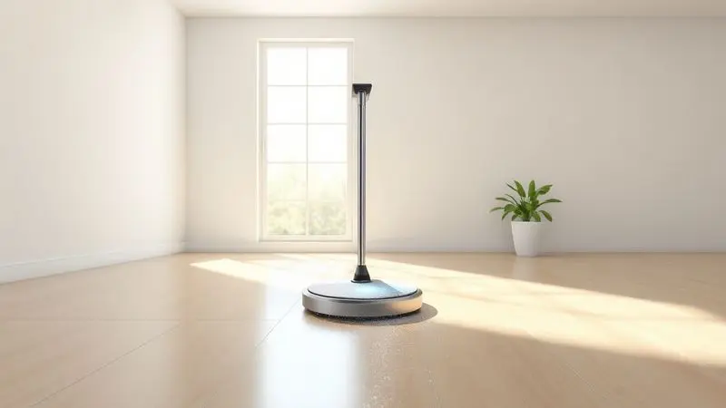
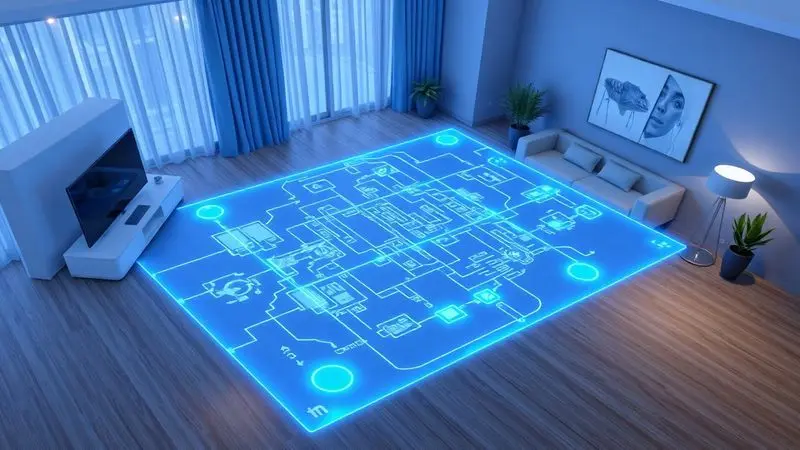
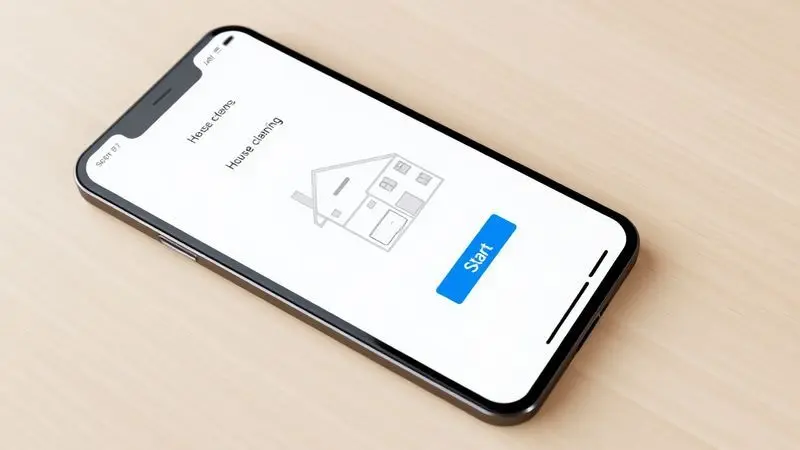
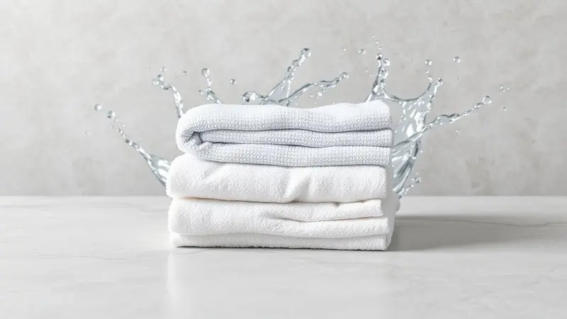

Imagine acordar sabendo que sua casa já está limpa. Sem gastar um minuto do seu sábado com vassouras ou baldes. É essa transformação que os robôs aspiradores e passa pano oferecem: tempo de vida de volta para você.

Depois de analisar profundamente o mercado, selecionamos os 14 modelos que realmente fazem diferença em 2025 - desde opções básicas para apartamentos até máquinas que parecem saídas de um filme de ficção científica.

Cada um deles foi avaliado considerando não apenas especificações técnicas, mas como eles se encaixam no seu dia a dia. Prepare-se para descobrir como automatizar a parte mais chata da sua rotina.

<SummaryList products={frontmatter.top_products} />

## Quais são os melhores robôs aspiradores e passa pano em 2025?

O que diferencia os melhores modelos não são apenas números em uma ficha técnica, mas como eles resolvem problemas reais. Alguns brilham em apartamentos pequenos, outros dominam casas de dois andares com pets.

A tecnologia evoluiu para entender não apenas onde está a sujeira, mas como você vive.

### 1. Xiaomi Robot Vacuum S10

<ProductBox 
  title={frontmatter.top_products[0].title} 
  image={frontmatter.top_products[0].image} 
  link={frontmatter.top_products[0].link} 
/>

Quando precisar de uma limpeza que não deixa nada passar despercebido, o S10 é seu aliado. Com 4000Pa de sucção, ele transforma grãos de areia e pelos de pet em memória. A navegação a laser LDS cria um mapa tão preciso que você poderia usá-lo para decorar sua casa.

Mas onde ele realmente surpreende é na função de passar pano: três níveis de umidade que entendem a diferença entre um piso de cerâmica que precisa de mais água e um laminado que prefere menos.

Pelo aplicativo Mi Home, você programa a limpeza para acontecer enquanto trabalha, define áreas específicas (nada de sujeira na área de brincar das crianças) e até integra com sua Alexa para comandos de voz.

A bateria de 3200mAh garante que ele complete o trabalho sem precisar voltar para recarregar no meio do caminho.

<CaixaProsContras>

**Prós:**

- Potência de sucção elevada (4000Pa).

- Função de esfregar com ajuste de fluxo de água.

- Controle via aplicativo com recursos avançados.

- Design elegante e compacto.

**Contras:**

- Pode enfrentar dificuldades em ambientes muito grandes ou complicados.

- Algumas avaliações críticas sobre a durabilidade.

</CaixaProsContras>

### 2. Neatsvor X600

<ProductBox 
  title={frontmatter.top_products[1].title} 
  image={frontmatter.top_products[1].image} 
  link={frontmatter.top_products[1].link} 
/>

Se você busca um robô que não se perde em cantos e recantos, o sistema LIDAR do X600 é como dar um GPS para sua limpeza. Ele mapeia cada centímetro do seu ambiente antes de começar, garantindo que nenhum ponto fique sem atenção.

A mesma potência de 4000Pa do S10, mas com uma diferença: ele alterna entre limpeza seca e úmida no mesmo passe.

Imagine chegar em casa e encontrar o piso não apenas sem poeira, mas com aquele brilho de recém-limpado. O aplicativo oferece a liberdade de dizer "limpe apenas a cozinha hoje" ou "evite o tapete da sala".

A autonomia de 90 a 120 minutos cobre a maioria dos apartamentos em uma única carga.

<CaixaProsContras>

**Prós:**

- Navegação precisa com tecnologia LIDAR.

- Potência de sucção contundente.

- Controle via aplicativo com funções práticas.

- Capacidade para limpeza seca e úmida.

**Contras:**

- Dificuldades para superar carpetes mais altos.

- Design que pode ser propenso a arranhões.

</CaixaProsContras>

### 3. WAP ROBOT W400

<ProductBox 
  title={frontmatter.top_products[2].title} 
  image={frontmatter.top_products[2].image} 
  link={frontmatter.top_products[2].link} 
/>

Para quem lida com alergias, a palavra mágica é HEPA. O filtro do W400 retém 99% dos alérgenos, transformando sua casa em um refúgio respiratório.

Com apenas 7,5cm de altura, ele é o espião perfeito para limpar debaixo da cama e do sofá, lugares que normalmente acumulam poeira esquecida.

A combinação de três funções em um único dispositivo significa que você não precisa trocar acessórios ou fazer pausas. Aspira, varre e passa pano em uma sequência contínua.

A conectividade Wi-Fi e compatibilidade com assistentes de voz fazem parecer que você tem um mordomo digital.

<CaixaProsContras>

**Prós:**

- Função 3 em 1: varre, aspira e passa pano.

- Filtro HEPA eficaz contra alérgenos.

- Conectividade via aplicativo e assistentes de voz.

- Design slim para melhor acesso a locais difíceis.

**Contras:**

- O tempo de carregamento é relativamente longo.

- O nível de ruído pode ser um pouco alto para ambientes sensíveis.

</CaixaProsContras>

### 4. WAP ROBOT W100

<ProductBox 
  title={frontmatter.top_products[3].title} 
  image={frontmatter.top_products[3].image} 
  link={frontmatter.top_products[3].link} 
/>

Compacto como um livro grosso e silencioso como uma biblioteca, o W100 é para quem valoriza a discrição. Seus 7,5cm de altura são uma vantagem estratégica para alcançar lugares que robôs maiores ignoram.

Os sensores antiqueda e anticolisão funcionam como um sexto sentido, protegendo tanto o dispositivo quanto seus móveis.

Ele não vai competir com modelos de alta potência, mas para manutenção diária em apartamentos pequenos, cumpre sua missão com elegância. Os modos de limpeza (cantos, aleatório e espiral) garantem que ele não fique apenas circulando no mesmo lugar.

<CaixaProsContras>

**Prós:**

- Design moderno e compacto

- Silencioso durante a operação

- Boa duração da bateria

- Fácil de usar com manutenção simples

**Contras:**

- Eficiência de limpeza limitada para sujeiras pesadas

- Não possui mapeamento avançado ou inteligência artificial

</CaixaProsContras>

### 5. Electrolux Home-e Speed Experience ERB10

<ProductBox 
  title={frontmatter.top_products[4].title} 
  image={frontmatter.top_products[4].image} 
  link={frontmatter.top_products[4].link} 
/>

Quando falamos em qualidade do ar, 99,9% faz toda a diferença. O filtro HEPA Allergy Protect do Electrolux é como ter um purificador de ar que também limpa o chão.

Com autonomia impressionante de 2h20min, ele é o maratonista dos robôs aspiradores, capaz de cobrir espaços generosos sem parar.

O design ultra slim não é apenas estético: é funcional. Chega onde outros não chegam, garantindo que a limpeza seja completa, não apenas conveniente. A ausência de controle remoto é compensada pela inteligência autônoma que toma decisões sozinha.

<CaixaProsContras>

**Prós:**

- Combinação de funções (varre, aspira e passa pano).

- Bateria com boa autonomia (até 2h20min).

- Filtro HEPA para qualidade do ar superior.

- Design ultra slim que alcança lugares baixos.

**Contras:**

- Não possui controle remoto.

- Tempo de carregamento inicial longo (recomendado de 24 horas).

</CaixaProsContras>

### 6. Samsung POWERbot-E VR5000RM

<ProductBox 
  title={frontmatter.top_products[5].title} 
  image={frontmatter.top_products[5].image} 
  link={frontmatter.top_products[5].link} 
/>

A Samsung aplicou sua expertise em motores ao Digital Inverter, resultando em 55W de potência que não consomem energia desnecessariamente. A navegação inteligente vai além de evitar obstáculos: ele aprende o layout da sua casa, otimizando cada nova sessão de limpeza.

Os 150 minutos de autonomia são suficientes para casas grandes, mas o reservatório de 0,2L pede atenção frequente se você tem pets que soltam muitos pelos. O aplicativo SmartThings transforma seu smartphone em um centro de comando completo.

<CaixaProsContras>

**Prós:**

- Funcionalidade 2 em 1: aspira e passa pano simultaneamente.

- Navegação inteligente com múltiplos sensores.

- Design compacto que alcança locais difíceis.

- Controle remoto através do aplicativo SmartThings.

**Contras:**

- Reservatório de pó pequeno, necessitando esvaziamento frequente.

- Alguns usuários relataram problemas na conectividade Wi-Fi.

</CaixaProsContras>

### 7. Ropo Glass 3

<ProductBox 
  title={frontmatter.top_products[6].title} 
  image={frontmatter.top_products[6].image} 
  link={frontmatter.top_products[6].link} 
/>

Limpeza com luz UV soa como algo de hospitais, mas imagine aplicada ao seu lar. O Ropo Glass 3 não apenas remove a sujeira visível, mas esteriliza superfícies, ideal para famílias com crianças pequenas ou imunocomprometidos.

O tanque de água elétrico é um diferencial: controle preciso entre um pano quase seco e um úmido perfeito.

Os 140 minutos de bateria cobrem até 120m², mas ele honestamente avisa: não substitui aquela faxina profunda ocasional. É o parceiro perfeito para manter tudo impecável entre as limpezas mais intensas.

<CaixaProsContras>

**Prós:**

- Potência de sucção eficaz para diferentes superfícies.

- Vários modos de limpeza para diferentes necessidades.

- Controle via aplicativo facilita a programação.

- Funcionalidade de esterilização UV adiciona um nível extra de limpeza.

**Contras:**

- A função de passar pano pode deixar marcas visíveis no chão.

- Não substitui uma limpeza completa e profunda.

</CaixaProsContras>

### 8. Xiaomi 2C

<ProductBox 
  title={frontmatter.top_products[7].title} 
  image={frontmatter.top_products[7].image} 
  link={frontmatter.top_products[7].link} 
/>

O sistema VSLAM do 2C é como dar olhos ao seu robô. Ele não apenas navega, mas vê e entende o ambiente em tempo real, criando rotas inteligentes que economizam tempo e bateria. Os 2200Pa de sucção são mais do que suficientes para a maioria dos cenários domésticos.

O ajuste eletrônico de umidade no tanque de água é um detalhe que faz diferença: pisos porosos recebem mais água, enquanto os brilhantes ficam com menos, evitando manchas. Para apartamentos com pisos duros, ele é uma escolha quase perfeita.

<CaixaProsContras>

**Prós:**

- Mapeamento inteligente com sistema VSLAM.

- Potência de sucção elevada, garantindo limpeza eficiente.

- Função mopa com ajuste eletrônico de umidade.

- Controle fácil via aplicativo.

**Contras:**

- O desempenho em carpetes finos pode ser inferior.

- A altura reduzida pode limitar a remoção de sujeira em rodapés.

</CaixaProsContras>

### 9. Ropo Glass 4

<ProductBox 
  title={frontmatter.top_products[8].title} 
  image={frontmatter.top_products[8].image} 
  link={frontmatter.top_products[8].link} 
/>

Mapeamento a laser 4.0 soa técnico, mas significa que seu robô conhece sua casa melhor que você. Ele cria mapas em tempo real que podem ser editados pelo aplicativo: "evite a área do tapete persa", "limpe extra a cozinha".

A combinação de quatro funções (varrição, aspiração, pano e UV) faz dele uma estação de limpeza completa.

Os 4000Pa de sucção operam abaixo de 55dB em modo silencioso, permitindo que ele trabalhe enquanto você faz uma videoconferência sem interrupções. A autonomia de 150 minutos é generosa, mas os refis de pano pedem um orçamento mensal.

<CaixaProsContras>

**Prós:**

- Mapeamento a laser para eficiência na limpeza.

- Função 4 em 1 oferecendo várias opções de limpeza.

- Controle através de aplicativo para conveniência.

- Alta potência de sucção com operação silenciosa.

**Contras:**

- Preço elevado dos refis de pano.

- Pode ser considerado complexo para usuários que preferem simplicidade.

</CaixaProsContras>

### 10. Mondial Pratic Clean RB-11

<ProductBox 
  title={frontmatter.top_products[9].title} 
  image={frontmatter.top_products[9].image} 
  link={frontmatter.top_products[9].link} 
/>

Simplicidade que funciona. O RB-11 não promete milagres tecnológicos, apenas cumpre sua função com eficiência honesta. Seus 7,5cm de altura são seu superpoder, alcançando os mesmos lugares difíceis que modelos mais caros.

Para quem tem um apartamento pequeno e busca manutenção diária sem complicações, os 90 minutos de autonomia são suficientes. O coletor de 140ml precisa de atenção regular, mas essa é a troca por um investimento acessível.

<CaixaProsContras>

**Prós:**

- Limpeza 3 em 1 (varre, aspira e passa pano)

- Design super slim para acessar espaços reduzidos

- Boa autonomia com até 90 minutos de uso

- Operação simples e intuitiva

**Contras:**

- Performance limitada em carpetes altos

- Coletor sem indicador de enchimento

</CaixaProsContras>

### 11. Philco PAS22P MOP

<ProductBox 
  title={frontmatter.top_products[10].title} 
  image={frontmatter.top_products[10].image} 
  link={frontmatter.top_products[10].link} 
/>

Quando silêncio é uma prioridade, o PAS22P MOP opera como um sussurro. Ideal para apartamentos onde o barulho incomoda vizinhos ou para limpezas noturnas. O reservatório de 600ml combinado com filtro HEPA cria um ciclo virtuoso: sujeira capturada, ar purificado.

Os sensores antiqueda são particularmente eficazes em apartamentos com varandas ou mezaninos. A bateria de 100 minutos pode variar dependendo do modo de limpeza, mas para a maioria dos usos diários, é mais que suficiente.

<CaixaProsContras>

**Prós:**

- Combina funções de aspiração e passada de pano.

- Filtro HEPA que melhora a qualidade do ar.

- Sensores que previnem quedas e colisões.

- Operação silenciosa, ideal para qualquer horário.

**Contras:**

- Duração da bateria pode ser inferior ao prometido.

- Carregamento pode levar mais tempo em algumas situações.

</CaixaProsContras>

### 12. Ekaza Zuno EKTS-T5200G

<ProductBox 
  title={frontmatter.top_products[11].title} 
  image={frontmatter.top_products[11].image} 
  link={frontmatter.top_products[11].link} 
/>

Navegação giroscópica pode não soar tão high-tech quanto laser, mas resulta em um mapeamento em zigue-zague que cobre cada centímetro sem repetições. Os três níveis de aspiração e quatro de controle de água oferecem personalização fina para diferentes situações.

A compatibilidade com Alexa e Google Assistente significa que você pode dizer "limpe a sala" enquanto prepara o café. A limitação ao Wi-Fi 2.4GHz é uma consideração técnica, mas a maioria dos roteadores domésticos suporta.

<CaixaProsContras>

**Prós:**

- Navegação eficiente com mapeamento em zigue-zague.

- Controle remoto pelo aplicativo e assistentes de voz.

- Multi-funcional: aspiração e passa pano em um só dispositivo.

- Design compacto que alcança áreas difíceis.

**Contras:**

- Compatível apenas com Wi-Fi 2.4GHz.

- Tempo de carregamento pode ser relativamente longo.

</CaixaProsContras>

### 13. Wap Robot W1000

<ProductBox 
  title={frontmatter.top_products[12].title} 
  image={frontmatter.top_products[12].image} 
  link={frontmatter.top_products[12].link} 
/>

Autonomia de 2h40 é um número que muda completamente o que você pode esperar de um robô aspirador. É tempo suficiente para limpar uma casa grande sem interrupções. O mapeamento em tempo real Gyro garante que ele não apenas evite obstáculos, mas aprenda com eles.

Os 75dBA de ruído são perceptíveis, mas considere: é o som da liberdade de não precisar passar aspirador manualmente. O aplicativo WAP Connect oferece controle completo, desde programação até definição de zonas proibidas.

<CaixaProsContras>

**Prós:**

- Capacidade 3 em 1 (varre, aspira e passa pano).

- Navegação inteligente com mapeamento em tempo real.

- Controle via aplicativo e assistentes de voz.

- Boa autonomia de até 2h40.

**Contras:**

- Nível de ruído relativamente alto.

- Preço pode ser uma limitação para alguns consumidores.

</CaixaProsContras>

### 14. Xiaomi Robot Vacuum S40

<ProductBox 
  title={frontmatter.top_products[13].title} 
  image={frontmatter.top_products[13].image} 
  link={frontmatter.top_products[13].link} 
/>

10.000Pa de sucção não é apenas um número impressionante: é a garantia de que nada, absolutamente nada, ficará para trás. Combinado com navegação a laser que cria mapas 3D, o S40 é para quem não aceita meio-termo na limpeza.

Os 180 minutos de bateria são quase uma provocação aos outros modelos.

O aplicativo Xiaomi Home permite um controle tão detalhado que você pode desenhar no mapa exatamente onde quer que ele limpe ou evite. A função de passar pano é básica (apenas arrasta um pano úmido), mas considerando todo o resto, é uma concessão aceitável.

<CaixaProsContras>

**Prós:**

- Potente capacidade de sucção e longa duração da bateria.

- Navegação a laser com mapeamento 3D.

- Controle prático pelo aplicativo Xiaomi.

- Compatível com assistentes de voz como Alexa e Google Assistant.

**Contras:**

- A função de mopping é bastante simples.

- Não possui base de auto-esvaziamento.

</CaixaProsContras>

## Por que procurar robôs aspiradores que passam pano?

Pense no tempo que você gasta não apenas aspirando, mas depois passando pano. São duas tarefas que consomem energia física e mental. Um robô que faz ambas não é apenas um aparelho: é um acordo com você mesmo para recuperar horas de vida.

Para famílias com pets ou crianças, essa dupla função significa manchas tratadas imediatamente, não acumuladas. É a diferença entre uma casa "limpinha" e uma casa que realmente parece cuidada.

## O que é um aspirador robô?

Mais do que um eletrodoméstico, um aspirador robô é um sistema que entende seu espaço. Sensores são seus olhos, bateria é sua energia, e algoritmos são seu cérebro. Ele não apenas remove sujeira: cria rotinas de limpeza que se adaptam ao seu estilo de vida.

A função de passar pano transforma esse sistema de manutenção em um parceiro completo de cuidado doméstico.

## Como Escolher um Robô Aspirador e Passa Pano?

A escolha certa não começa com especificações técnicas, mas com uma pergunta simples: como você quer que sua vida mude? Cada decisão abaixo deve refletir não apenas o que o robô faz, mas como ele se integra aos seus dias.

### Avalie o Tipo de Piso da Sua Casa

Pisos duros são o paraíso dos robôs aspiradores: eles deslizam com facilidade e a limpeza é visivelmente eficaz. Já carpetes e tapetes representam um desafio duplo: exigem mais potência para aspirar profundamente e podem emaranhar os pelos.

Se sua casa é um mix, procure modelos com sensores que detectam automaticamente a mudança de superfície e ajustam a potência. Essa inteligência básica evita que seu tapete favorito vire um campo de batalha para o robô.

### Verifique as Funções de Mapeamento

Mapeamento inteligente vai além de não bater nas paredes. É a diferença entre um robô que limpa aleatoriamente e um que tem um plano.

Tecnologias como LIDAR, VSLAM ou giroscópio criam mapas que permitem delimitar áreas ("não entre no escritório quando estou em reunião"), programar limpezas por cômodo, e até mesmo salvar diferentes andares se você tem uma casa com mais de um nível.

Essa organização transforma a limpeza de uma tarefa caótica em um processo sistemático.

### Considere a Capacidade do Reservatório

Um reservatório grande parece sempre melhor, até você perceber que significa um robô mais pesado e volumoso. O equilíbrio está na sua realidade: se tem pets que soltam muitos pelos, um compartimento de sujeira maior evita interrupções frequentes.

Para o tanque de água, a questão é similar. Apartamentos pequenos podem preferir reservatórios menores que mantêm o robô ágil, enquanto casas grandes beneficiam da autonomia extra.

A verdadeira pergunta é: você prefere reabastecer com mais frequência ou lidar com um dispositivo mais robusto?

### Explore as Opções de Controle Remoto ou Aplicativo

Controle via aplicativo não é um luxo: é a ponte entre você e a automação da sua casa. Programar limpezas para horários específicos (enquanto você trabalha, por exemplo) transforma o robô de um assistente para um parceiro autônomo.

A compatibilidade com assistentes de voz adiciona uma camada de conveniência que parece mágica: "Alexa, limpe a cozinha". Mas avalie se você realmente usará esses recursos, ou se um botão físico de iniciar é tudo que precisa.

### Observe o Nível de Ruído

Decibéis são mais do que números: são a permissão para usar o robô quando quiser. Modelos silenciosos (abaixo de 60dB) permitem limpezas noturnas ou durante videoconferências sem constrangimento.

Já os mais potentes (e consequentemente mais barulhentos) podem ser programados para quando ninguém está em casa. Considere sua rotina: se trabalha home office, o silêncio vale ouro; se sai diariamente, potência pode ser prioridade.

### Compare o Custo-Benefício

O preço inicial é apenas parte da equação. Um modelo mais barato pode exigir substituição de peças frequentemente ou ter uma vida útil menor.

Recursos como filtros HEPA, tanques de água de qualidade superior, ou baterias com maior ciclos de recarga representam economia a longo prazo. Pergunte-se: estou comprando um dispositivo para os próximos 2 anos ou para os próximos 5?

A resposta define onde vale a pena investir mais.

### Avalie a Autonomia da Bateria

Autonomia não é apenas sobre quantos minutos o robô funciona, mas sobre quantos metros quadrados ele cobre nesse tempo. Um modelo com 90 minutos pode ser perfeito para um apartamento de 60m², mas insuficiente para uma casa de 120m².

A função de retorno automático à base é crucial para espaços maiores: o robô recarrega e retoma exatamente de onde parou. Pense na sua casa não como um número de cômodos, mas como a área total que precisa ser coberta.

### Dê Atenção ao Suporte e Garantia

Tecnologia falha. A questão não é se, mas quando. Um bom suporte ao cliente significa que quando algo der errado (e algo sempre pode dar errado), você terá ajuda rápida e eficiente. Garantia estendida não é apenas papel: é paz de espírito.

Marcas estabelecidas geralmente oferecem melhor suporte pós-venda, enquanto marcas novas podem ter preços atraentes mas suporte limitado. Essa decisão é sobre como você quer ser tratado quando precisar de ajuda.

## Quais produtos usar no pano do robô aspirador?

O segredo está na simplicidade. Soluções multiuso diluídas em água geralmente funcionam melhor que produtos especializados caros. Evite como a praia qualquer coisa ácida, abrasiva ou com álcool em excesso: eles podem danificar tanto o piso quanto os componentes do robô.

Panos de microfibra são investimentos inteligentes: retêm sujeira melhor, são laváveis e duram muito mais que panos descartáveis. Quando em dúvida, água morna pura é sempre uma opção segura e eficaz.

## Dicas ao usar um robô aspirador e passa pano

Prepare o terreno antes de iniciar: fios soltos são inimigos, brinquedos pequenos são obstáculos, e tapetes soltos podem emaranhar. Programe a primeira limpeza para quando você estiver em casa, para observar como o robô interage com seu espaço.

Limpe os reservatórios regularmente: água parada cria bactérias, poeira acumulada reduz a eficiência. Use o mapeamento não apenas para limpar, mas para aprender sobre os padrões de sujeira da sua casa.

E lembre-se: ele é um parceiro, não um substituto completo da sua atenção.

## Conclusão

Escolher o robô aspirador e passa pano ideal é menos sobre tecnologia e mais sobre reconhecer o que você realmente precisa. Para alguns, será o poder bruto do Xiaomi S40 com seus 10.000Pa. Para outros, a discrição silenciosa do Philco PAS22P MOP.

O que todos esses modelos compartilham é uma promessa: devolver seu tempo.

Imagine seus próximos sábados sem a obrigação da faxina. Imagine chegar em casa após um dia longo e encontrar os pisos impecáveis. Imagine respirar um ar mais puro porque o filtro HEPA capturou o que seus pulmões prefeririam evitar.

Cada um dos 14 modelos analisados representa um caminho diferente para essa mesma liberdade.

Seja o investimento premium em tecnologia de ponta ou a solução acessível que cumpre o básico com excelência, a decisão final sempre retorna a uma pergunta: como você quer viver?

Os melhores robôs não são aqueles com as especificações mais impressionantes, mas aqueles que desaparecem na sua rotina, trabalhando silenciosamente para que você possa focar no que realmente importa. Qual será o seu parceiro nessa transformação?